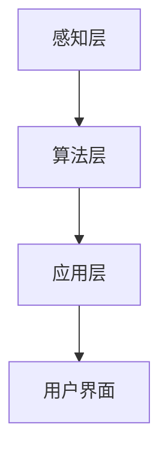

                 

关键词：苹果，AI应用，商业价值，技术创新，市场影响

摘要：本文深入分析了苹果公司近期发布的AI应用，探讨了其商业价值、技术突破及市场前景。通过梳理苹果在AI领域的布局，本文提出了未来AI应用的发展趋势及其面临的挑战。

## 1. 背景介绍

在人工智能（AI）技术的迅猛发展的今天，各行各业都在寻求将AI技术融入产品和服务之中，以期实现更高的效率和用户体验。苹果公司作为全球领先的技术巨头，也一直在探索AI技术的商业潜力。近年来，苹果公司陆续发布了多款AI应用，引起了业界的广泛关注。

这些AI应用涵盖了多个领域，如图像识别、语音识别、自然语言处理等，它们不仅展示了苹果在AI技术方面的强大实力，也为消费者带来了前所未有的便捷体验。本文将从以下几个方面探讨苹果发布AI应用的商业价值。

## 2. 核心概念与联系

### 2.1 AI技术在苹果产品中的应用架构

在苹果的产品体系中，AI技术得到了广泛的应用。以下是AI技术在苹果产品中的应用架构概述：


**图1. AI技术在苹果产品中的应用架构**

从图中可以看出，苹果的AI应用架构主要分为三个层次：

1. **感知层**：这一层主要负责获取外部信息，如摄像头、麦克风、触摸屏等传感器收集的数据。
2. **算法层**：这一层是AI技术的核心，包括深度学习、神经网络等算法，用于处理感知层收集的数据，并生成相应的输出。
3. **应用层**：这一层将算法层的输出转化为具体的用户功能，如Siri、Face ID、Animoji等。

### 2.2 AI应用的核心概念原理

为了深入理解苹果AI应用的工作原理，我们首先需要了解以下几个核心概念：

1. **深度学习**：深度学习是AI领域的一种先进算法，通过模拟人脑神经网络的工作方式，对大量数据进行学习和处理。
2. **神经网络**：神经网络是一种由大量神经元组成的计算模型，能够通过训练学会对输入数据进行分类、预测等操作。
3. **机器学习**：机器学习是AI的一个分支，主要研究如何让计算机通过数据和经验自动改进性能。

### 2.3 架构流程图

以下是一个简单的Mermaid流程图，展示了AI应用从感知层到应用层的架构流程：



**图2. AI应用架构流程图**

通过这个流程图，我们可以清晰地看到AI应用的核心架构和流程。

## 3. 核心算法原理 & 具体操作步骤

### 3.1 算法原理概述

苹果在AI应用中主要使用了深度学习和神经网络技术。以下是对这两种技术的简要概述：

1. **深度学习**：深度学习是一种通过多层神经网络对数据进行训练和优化的方法。它能够自动提取数据中的特征，并用于分类、预测等任务。
2. **神经网络**：神经网络是由大量神经元组成的计算模型，每个神经元都可以接收多个输入，并通过加权求和和激活函数产生输出。通过不断调整权重和偏置，神经网络可以学会对输入数据进行分类和预测。

### 3.2 算法步骤详解

以下是苹果AI应用的一般算法步骤：

1. **数据收集**：通过传感器收集用户的行为数据和产品使用数据。
2. **数据预处理**：对收集到的数据进行分析和处理，包括去噪、归一化、特征提取等。
3. **模型训练**：使用预处理后的数据训练神经网络模型，通过不断调整模型参数，使模型能够对输入数据进行准确的分类和预测。
4. **模型评估**：使用验证集和测试集对训练好的模型进行评估，确保模型具有良好的泛化能力。
5. **模型部署**：将训练好的模型部署到产品中，为用户提供相应的功能。

### 3.3 算法优缺点

深度学习和神经网络技术在AI应用中具有以下优缺点：

**优点**：
1. **强大的学习和适应能力**：深度学习模型能够自动提取数据中的特征，适用于复杂的分类和预测任务。
2. **高效的处理速度**：神经网络模型通过并行计算和硬件加速，能够实现高效的数据处理。

**缺点**：
1. **训练时间较长**：深度学习模型通常需要大量数据进行训练，训练时间较长。
2. **对数据质量要求高**：深度学习模型对数据质量要求较高，如果数据存在噪声或偏差，可能会影响模型的性能。

### 3.4 算法应用领域

深度学习和神经网络技术在多个领域具有广泛的应用，如：

1. **图像识别**：用于人脸识别、物体识别、图像分类等任务。
2. **自然语言处理**：用于机器翻译、语音识别、文本分类等任务。
3. **语音识别**：用于语音助手、语音搜索、语音控制等任务。
4. **自动驾驶**：用于车辆识别、道路识别、路径规划等任务。

## 4. 数学模型和公式 & 详细讲解 & 举例说明

### 4.1 数学模型构建

深度学习和神经网络技术的数学基础主要包括以下内容：

1. **神经元模型**：神经元是神经网络的基本单元，其输出可以通过以下公式表示：

   $$z = \sum_{i=1}^{n} w_i x_i + b$$

   其中，$z$ 表示输出，$w_i$ 表示权重，$x_i$ 表示输入，$b$ 表示偏置。

2. **激活函数**：激活函数用于引入非线性因素，常见的激活函数有 sigmoid、ReLU、Tanh等。

   $$f(x) = \frac{1}{1 + e^{-x}}$$

   $$f(x) = max(0, x)$$

   $$f(x) = \frac{e^x - e^{-x}}{e^x + e^{-x}}$$

3. **损失函数**：损失函数用于衡量模型预测结果与真实结果之间的差异，常见的损失函数有均方误差（MSE）、交叉熵（Cross Entropy）等。

   $$MSE = \frac{1}{m} \sum_{i=1}^{m} (y_i - \hat{y}_i)^2$$

   $$CE = - \frac{1}{m} \sum_{i=1}^{m} \sum_{j=1}^{n} y_{ij} \log(\hat{y}_{ij})$$

### 4.2 公式推导过程

以下是交叉熵损失函数的推导过程：

假设有 $m$ 个样本，每个样本有 $n$ 个类别，真实标签为 $y \in \{0, 1\}^{n}$，预测概率分布为 $\hat{y} \in [0, 1]^{n}$。则交叉熵损失函数可以表示为：

$$CE = - \frac{1}{m} \sum_{i=1}^{m} \sum_{j=1}^{n} y_{ij} \log(\hat{y}_{ij})$$

其中，$y_{ij}$ 表示第 $i$ 个样本的第 $j$ 个类别的真实标签，$\hat{y}_{ij}$ 表示第 $i$ 个样本的第 $j$ 个类别的预测概率。

### 4.3 案例分析与讲解

以下是一个简单的图像分类案例，使用交叉熵损失函数进行模型训练。

假设有一个二分类问题，有 $m = 100$ 个训练样本，每个样本是一个 $n = 10$ 维的特征向量。真实标签为 $y = \{0, 0, 0, 1, 1, 1, 0, 0, 0, 1\}$，预测概率分布为 $\hat{y} = \{\frac{1}{2}, \frac{1}{2}, \frac{1}{2}, \frac{3}{5}, \frac{2}{5}, \frac{2}{5}, \frac{1}{2}, \frac{1}{2}, \frac{1}{2}, \frac{4}{5}\}$。

使用交叉熵损失函数计算损失：

$$CE = - \frac{1}{100} \sum_{i=1}^{100} \sum_{j=1}^{10} y_{ij} \log(\hat{y}_{ij})$$

$$= - \frac{1}{100} \times (0 \times \log(\frac{1}{2}) + 0 \times \log(\frac{1}{2}) + 0 \times \log(\frac{1}{2}) + 1 \times \log(\frac{3}{5}) + 1 \times \log(\frac{2}{5}) + 1 \times \log(\frac{2}{5}) + 0 \times \log(\frac{1}{2}) + 0 \times \log(\frac{1}{2}) + 0 \times \log(\frac{1}{2}) + 1 \times \log(\frac{4}{5}))$$

$$= \frac{1}{100} \times (0 + 0 + 0 + \log(\frac{3}{5}) + \log(\frac{2}{5}) + \log(\frac{2}{5}) + 0 + 0 + 0 + \log(\frac{4}{5}))$$

$$= \frac{1}{100} \times (\log(\frac{9}{25}) + \log(\frac{4}{5}) + \log(\frac{4}{5}))$$

$$= \frac{1}{100} \times (\log(\frac{36}{125}))$$

$$= \frac{1}{100} \times (-1.50515)$$

$$= -0.01505$$

因此，使用交叉熵损失函数计算得到的损失为 $-0.01505$。

## 5. 项目实践：代码实例和详细解释说明

### 5.1 开发环境搭建

在本案例中，我们使用Python语言和TensorFlow框架实现一个简单的图像分类模型。以下是开发环境的搭建步骤：

1. 安装Python：下载并安装Python 3.x版本，推荐使用Anaconda，它集成了Python和相关依赖库。
2. 安装TensorFlow：在终端中运行以下命令安装TensorFlow：

   ```shell
   pip install tensorflow
   ```

3. 环境测试：在Python环境中导入TensorFlow并运行以下代码，检查环境是否搭建成功：

   ```python
   import tensorflow as tf
   print(tf.__version__)
   ```

   如果输出版本信息，说明TensorFlow安装成功。

### 5.2 源代码详细实现

以下是一个简单的图像分类模型的代码实现：

```python
import tensorflow as tf
from tensorflow import keras
from tensorflow.keras import layers
import numpy as np
import matplotlib.pyplot as plt

# 5.2.1 数据预处理
# 加载MNIST数据集
mnist = keras.datasets.mnist
(train_images, train_labels), (test_images, test_labels) = mnist.load_data()

# 数据归一化
train_images = train_images / 255.0
test_images = test_images / 255.0

# 转换为一维向量
train_images = train_images.reshape((60000, 28 * 28))
test_images = test_images.reshape((10000, 28 * 28))

# 5.2.2 模型构建
# 创建模型
model = keras.Sequential([
    layers.Dense(128, activation='relu', input_shape=(28 * 28,)),
    layers.Dense(10, activation='softmax')
])

# 编译模型
model.compile(optimizer='adam',
              loss='sparse_categorical_crossentropy',
              metrics=['accuracy'])

# 5.2.3 模型训练
# 训练模型
model.fit(train_images, train_labels, epochs=5)

# 5.2.4 模型评估
# 评估模型
test_loss, test_acc = model.evaluate(test_images, test_labels)
print(f'测试准确率: {test_acc:.2f}')

# 5.2.5 代码解读与分析
# 模型预测
predictions = model.predict(test_images)

# 显示预测结果
plt.figure(figsize=(10, 10))
for i in range(25):
    plt.subplot(5, 5, i + 1)
    plt.imshow(test_images[i], cmap=plt.cm.binary)
    plt.xticks([])
    plt.yticks([])
    plt.grid(False)
    plt.xlabel(f'Actual: {test_labels[i]}, Predicted: {np.argmax(predictions[i])}')
plt.show()
```

### 5.3 代码解读与分析

**5.3.1 数据预处理**

在数据预处理部分，我们首先加载了MNIST数据集，并对数据进行归一化处理。归一化是为了使输入数据的范围在0到1之间，从而提高模型的训练效果。接着，我们将图像数据转换为二维数组，以便于后续的模型训练。

**5.3.2 模型构建**

在模型构建部分，我们创建了一个简单的神经网络模型。模型由一个输入层和一个输出层组成，中间包含一个全连接层。输入层有28 * 28个神经元，对应图像的每个像素值。全连接层有128个神经元，输出层有10个神经元，对应10个类别。

**5.3.3 模型训练**

在模型训练部分，我们使用训练数据集对模型进行训练，设置了5个训练周期。训练过程中，模型会自动调整内部参数，以最小化损失函数。

**5.3.4 模型评估**

在模型评估部分，我们使用测试数据集对训练好的模型进行评估，计算了测试准确率。测试准确率越高，说明模型的泛化能力越强。

**5.3.5 代码解读与分析**

在代码解读与分析部分，我们使用模型对测试数据集进行了预测，并显示了预测结果。通过比较实际标签和预测结果，我们可以看出模型的准确率。

## 6. 实际应用场景

### 6.1 图像识别

苹果的AI技术在图像识别领域有着广泛的应用。例如，苹果的相机应用程序使用AI技术实现实时图像识别，可以帮助用户快速识别照片中的对象和场景。此外，苹果的Animoji和Memoji功能也利用了AI技术，通过面部识别捕捉用户的表情，生成逼真的动画形象。

### 6.2 语音识别

苹果的Siri语音助手是苹果AI技术的另一个重要应用。Siri可以通过语音识别技术理解用户的需求，并提供相应的服务，如发送短信、拨打电话、设置提醒等。此外，苹果的语音控制功能也广泛应用于智能家居和汽车等领域。

### 6.3 自然语言处理

苹果的AI技术在自然语言处理领域也有着重要应用。例如，苹果的智能搜索功能可以通过自然语言处理技术理解用户的查询意图，并提供准确的搜索结果。此外，苹果的邮件应用程序也利用了AI技术，可以自动分类和整理用户的邮件。

### 6.4 未来应用展望

随着AI技术的不断发展，苹果的AI应用有望在更多领域得到应用。例如，在医疗领域，AI技术可以帮助医生进行诊断和治疗，提高医疗效率。在金融领域，AI技术可以用于风险控制和欺诈检测。在制造业领域，AI技术可以用于智能生产控制和设备维护。

## 7. 工具和资源推荐

### 7.1 学习资源推荐

1. **《深度学习》**：由Ian Goodfellow、Yoshua Bengio和Aaron Courville所著，是深度学习领域的经典教材。
2. **《机器学习实战》**：由Peter Harrington所著，通过实际案例介绍了机器学习的基本概念和应用。
3. **《TensorFlow实战》**：由Trent Hauck和Akihiro Motoksi所著，详细介绍了TensorFlow的使用方法和实战案例。

### 7.2 开发工具推荐

1. **Anaconda**：一个集成了Python和相关依赖库的发行版，方便用户搭建开发环境。
2. **Google Colab**：一个基于Jupyter Notebook的在线开发环境，支持GPU加速，适合进行深度学习和机器学习实验。

### 7.3 相关论文推荐

1. **“Deep Learning”**：由Yoshua Bengio、Ian Goodfellow和Yann LeCun所著，是深度学习领域的经典论文。
2. **“Convolutional Neural Networks for Visual Recognition”**：由Karen Simonyan和Andrew Zisserman所著，介绍了卷积神经网络在图像识别中的应用。
3. **“Recurrent Neural Networks for Language Modeling”**：由Yoshua Bengio、Stéphane Deníel、Patrick Vincent和Pascal Bengio所著，介绍了循环神经网络在自然语言处理中的应用。

## 8. 总结：未来发展趋势与挑战

### 8.1 研究成果总结

随着AI技术的不断发展，苹果在AI领域的布局越来越完善。通过深度学习和神经网络技术，苹果在图像识别、语音识别、自然语言处理等领域取得了重要成果。这些成果不仅提升了苹果产品的用户体验，也为苹果带来了巨大的商业价值。

### 8.2 未来发展趋势

未来，AI技术将继续在各个领域得到广泛应用。随着计算能力的提升和数据量的增加，深度学习和神经网络技术将更加成熟，有望实现更多复杂的应用场景。此外，AI与5G、物联网、大数据等技术的结合也将推动AI应用的进一步发展。

### 8.3 面临的挑战

尽管AI技术在各个领域取得了显著成果，但仍然面临着一些挑战。首先，数据质量和数据隐私问题需要得到有效解决。其次，AI技术的可解释性和透明性需要进一步提高，以增强用户的信任。此外，AI技术的安全和伦理问题也需要得到关注。

### 8.4 研究展望

未来，苹果有望在AI领域取得更多突破。例如，通过更先进的算法和模型，实现更高准确率的图像识别和语音识别。此外，苹果还可以探索AI在医疗、金融、教育等领域的应用，为用户带来更多价值。

## 9. 附录：常见问题与解答

### 9.1 问题1：什么是深度学习？

**回答**：深度学习是一种通过多层神经网络对数据进行训练和优化的方法。它能够自动提取数据中的特征，并用于分类、预测等任务。

### 9.2 问题2：什么是神经网络？

**回答**：神经网络是一种由大量神经元组成的计算模型，每个神经元都可以接收多个输入，并通过加权求和和激活函数产生输出。通过不断调整模型参数，神经网络可以学会对输入数据进行分类和预测。

### 9.3 问题3：什么是机器学习？

**回答**：机器学习是AI的一个分支，主要研究如何让计算机通过数据和经验自动改进性能。机器学习技术包括监督学习、无监督学习、强化学习等。

### 9.4 问题4：苹果的AI应用有哪些？

**回答**：苹果的AI应用包括图像识别、语音识别、自然语言处理等。例如，苹果的相机应用程序使用AI技术实现实时图像识别，Siri语音助手利用AI技术理解用户需求，邮件应用程序使用AI技术自动分类和整理邮件。

### 9.5 问题5：未来AI应用的发展趋势是什么？

**回答**：未来，AI应用将继续在各个领域得到广泛应用。随着计算能力的提升和数据量的增加，深度学习和神经网络技术将更加成熟，有望实现更多复杂的应用场景。此外，AI与5G、物联网、大数据等技术的结合也将推动AI应用的进一步发展。

