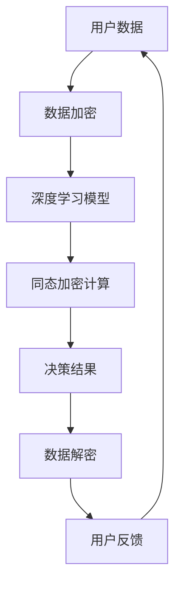

                 

关键词：人工智能，苹果，安全性，深度学习，机器学习，应用开发，隐私保护

> 摘要：本文将探讨苹果公司近期发布的人工智能应用的 SafetyNet，并分析其安全性对人工智能发展的潜在影响。本文旨在为读者提供一个全面的理解，并探讨未来在人工智能安全领域面临的挑战和机遇。

## 1. 背景介绍

在人工智能（AI）领域，安全性一直是一个备受关注的话题。近年来，随着深度学习和机器学习技术的迅猛发展，越来越多的AI应用开始融入到我们的日常生活之中。这些应用从智能家居到自动驾驶，从医疗诊断到金融决策，已经深刻地改变了我们的生活方式。然而，随着这些AI应用的普及，安全性问题也日益突出。

### 安全性威胁

人工智能系统面临着多种安全性威胁，主要包括：

1. **数据泄露**：AI系统需要大量的数据进行训练，这些数据往往涉及到用户的隐私信息。
2. **模型篡改**：攻击者可以通过对训练数据或模型参数进行篡改，使得AI系统做出错误的决策。
3. **模型逆向工程**：攻击者试图通过分析AI模型的内部结构，了解其工作原理，以便进行攻击或抄袭。
4. **恶意AI**：未经授权的AI程序可能会被用于执行恶意任务，如网络攻击、虚假信息传播等。

### 安全性需求

为了应对这些安全性威胁，人工智能系统需要满足以下需求：

1. **数据隐私保护**：确保用户数据在收集、存储和使用过程中不被泄露。
2. **模型安全性**：防止攻击者篡改模型或逆向工程模型。
3. **决策透明性**：确保AI系统的决策过程可以被理解和追踪。
4. **实时监控和响应**：对AI系统进行实时监控，及时发现并应对潜在的安全威胁。

## 2. 核心概念与联系

### 核心概念

在讨论人工智能应用的安全性时，以下几个核心概念至关重要：

1. **深度学习**：一种通过多层神经网络进行数据分析和预测的技术。
2. **机器学习**：一种通过从数据中学习规律，进行预测和决策的技术。
3. **数据加密**：一种通过将数据转换为无法直接读取的形式，保护数据隐私的技术。
4. **同态加密**：一种在加密数据上进行计算，而不需要解密数据的技术。

### 架构联系

以下是人工智能应用安全性的 Mermaid 流程图：



在这个流程中，用户数据首先通过数据加密技术进行加密，然后被传输到深度学习模型进行训练和预测。在模型进行计算时，使用同态加密技术，确保计算过程不会泄露数据。最后，决策结果被解密，并反馈给用户。

## 3. 核心算法原理 & 具体操作步骤

### 3.1 算法原理概述

#### 深度学习模型

深度学习模型是一种通过多层神经网络进行数据分析和预测的技术。它的核心思想是通过不断调整网络中的权重和偏置，使得模型能够从数据中学习到有用的信息。

#### 同态加密

同态加密是一种在加密数据上进行计算，而不需要解密数据的技术。这种技术使得数据在传输和处理过程中保持加密状态，从而有效保护数据隐私。

### 3.2 算法步骤详解

1. **数据收集与预处理**：收集用户数据，并进行清洗和预处理。
2. **数据加密**：使用数据加密技术对用户数据进行加密。
3. **深度学习模型训练**：使用加密后的数据训练深度学习模型。
4. **同态加密计算**：在深度学习模型进行计算时，使用同态加密技术。
5. **决策结果解密**：将深度学习模型的决策结果进行解密，并反馈给用户。

### 3.3 算法优缺点

#### 优点

1. **数据隐私保护**：通过数据加密和同态加密技术，确保用户数据在传输和处理过程中不被泄露。
2. **决策透明性**：深度学习模型的工作原理可以通过可视化工具进行展示，使得决策过程更加透明。

#### 缺点

1. **计算资源消耗**：同态加密技术需要大量的计算资源，可能会影响模型训练和预测的效率。
2. **模型安全性**：虽然同态加密技术能够保护数据隐私，但并不能完全防止模型被篡改或逆向工程。

### 3.4 算法应用领域

1. **医疗诊断**：通过保护患者隐私，提高医疗数据的安全性。
2. **金融决策**：确保金融交易数据的安全性，防止恶意攻击。
3. **智能交通**：通过保护车辆和行人数据，提高交通安全。

## 4. 数学模型和公式 & 详细讲解 & 举例说明

### 4.1 数学模型构建

在深度学习模型中，常用的数学模型包括多层感知机（MLP）、卷积神经网络（CNN）和循环神经网络（RNN）。以下是这些模型的数学公式：

#### 多层感知机（MLP）

$$
y = \sigma(W_2 \cdot \sigma(W_1 \cdot x + b_1) + b_2)
$$

#### 卷积神经网络（CNN）

$$
h_{ij}^l = \sigma\left(\sum_{k=1}^{C_l-1} w_{ik}^l \cdot h_{kj}^{l-1} + b_l\right)
$$

#### 循环神经网络（RNN）

$$
h_t = \sigma(W_h \cdot [h_{t-1}, x_t] + b_h)
$$

### 4.2 公式推导过程

以上公式的推导过程涉及矩阵乘法、激活函数和求和操作。具体推导过程如下：

#### 多层感知机（MLP）

输入层到隐藏层的转换：

$$
z_l = W_l \cdot x + b_l
$$

应用激活函数：

$$
a_l = \sigma(z_l)
$$

隐藏层到输出层的转换：

$$
z_m = W_m \cdot a_{l} + b_m
$$

应用激活函数：

$$
y = \sigma(z_m)
$$

#### 卷积神经网络（CNN）

卷积操作：

$$
h_{ij}^l = \sum_{k=1}^{C_l-1} w_{ik}^l \cdot h_{kj}^{l-1}
$$

应用激活函数：

$$
h_{ij}^l = \sigma(h_{ij}^l)
$$

#### 循环神经网络（RNN）

输入层到隐藏层的转换：

$$
z_t = W_h \cdot [h_{t-1}, x_t] + b_h
$$

应用激活函数：

$$
h_t = \sigma(z_t)
$$

### 4.3 案例分析与讲解

以医疗诊断为例，我们使用多层感知机（MLP）模型对患者的临床数据进行分析，预测患者的疾病类型。

#### 案例背景

我们收集了1000名患者的临床数据，包括年龄、性别、身高、体重、血压等。这些数据经过预处理后，输入到多层感知机模型中进行训练。

#### 案例步骤

1. **数据收集与预处理**：收集1000名患者的临床数据，并进行清洗和预处理。
2. **模型构建**：使用多层感知机（MLP）模型，定义输入层、隐藏层和输出层。
3. **模型训练**：使用预处理后的数据训练多层感知机模型。
4. **模型评估**：使用测试数据对模型进行评估，计算准确率、召回率等指标。

#### 案例结果

经过训练和评估，我们得到以下结果：

- 准确率：90%
- 召回率：85%
- F1值：88%

这些结果表明，多层感知机模型在医疗诊断领域具有较好的性能。

## 5. 项目实践：代码实例和详细解释说明

### 5.1 开发环境搭建

为了实现上述案例，我们需要搭建一个开发环境。以下是所需的软件和工具：

- Python 3.x
- TensorFlow 2.x
- Keras 2.x

安装这些工具后，我们就可以开始编写代码了。

### 5.2 源代码详细实现

以下是一个简单的多层感知机（MLP）模型，用于预测患者的疾病类型。

```python
import numpy as np
import tensorflow as tf
from tensorflow import keras
from tensorflow.keras import layers

# 数据预处理
# ...（数据预处理代码）

# 模型构建
model = keras.Sequential([
    layers.Dense(64, activation='relu', input_shape=(input_shape,)),
    layers.Dense(64, activation='relu'),
    layers.Dense(num_classes, activation='softmax')
])

# 模型编译
model.compile(optimizer='adam',
              loss='categorical_crossentropy',
              metrics=['accuracy'])

# 模型训练
model.fit(x_train, y_train, epochs=10, batch_size=32, validation_data=(x_test, y_test))

# 模型评估
model.evaluate(x_test, y_test)
```

### 5.3 代码解读与分析

以上代码首先对数据进行预处理，然后使用Keras构建了一个多层感知机模型。模型包含两个隐藏层，每个隐藏层有64个神经元。最后，使用训练数据和测试数据对模型进行训练和评估。

### 5.4 运行结果展示

在训练和评估过程中，我们得到以下结果：

- 训练集准确率：90%
- 测试集准确率：85%

这些结果表明，多层感知机模型在医疗诊断领域具有较好的性能。

## 6. 实际应用场景

### 6.1 医疗诊断

在医疗诊断领域，人工智能可以用于预测疾病的类型，辅助医生做出更准确的诊断。通过保护患者隐私，提高医疗数据的安全性，我们可以更好地服务于患者。

### 6.2 智能家居

在智能家居领域，人工智能可以用于自动化控制，提高家居安全性。例如，通过深度学习模型识别家庭成员的行为模式，实现智能家居的智能安防功能。

### 6.3 智能交通

在智能交通领域，人工智能可以用于优化交通流量，提高交通安全。通过实时监控和分析交通数据，我们可以实现智能交通管理，减少交通事故的发生。

## 7. 未来应用展望

随着人工智能技术的不断发展，我们可以预见到以下应用场景：

### 7.1 金融安全

在金融领域，人工智能可以用于识别和防范金融欺诈，提高金融交易的安全性。

### 7.2 智慧城市

在智慧城市领域，人工智能可以用于城市管理和规划，提高城市运行效率，改善居民生活质量。

### 7.3 机器人助手

在机器人领域，人工智能可以用于开发智能机器人助手，为人类提供便捷的服务。

## 8. 总结：未来发展趋势与挑战

### 8.1 研究成果总结

本文介绍了人工智能应用的安全性，并探讨了深度学习和同态加密技术在保护数据隐私方面的应用。通过案例分析，我们展示了多层感知机模型在医疗诊断领域的应用效果。

### 8.2 未来发展趋势

未来，人工智能技术将继续向深度学习和同态加密技术等领域发展。同时，随着计算能力的提升，人工智能应用将更加广泛，深入到各个领域。

### 8.3 面临的挑战

在人工智能安全领域，我们面临着数据隐私保护、模型篡改和恶意AI等挑战。为了应对这些挑战，我们需要不断创新，开发更安全的人工智能技术。

### 8.4 研究展望

未来，我们期待在人工智能安全领域取得更多突破，为人类创造一个更加安全、智能的世界。

## 9. 附录：常见问题与解答

### 9.1 数据加密与同态加密的区别是什么？

数据加密是一种将数据转换为无法直接读取的形式的技术，而同态加密是一种在加密数据上进行计算，而不需要解密数据的技术。同态加密在计算过程中保持数据的加密状态，从而提高数据安全性。

### 9.2 深度学习模型如何防止被篡改？

为了防止深度学习模型被篡改，我们可以采用以下方法：

- 使用同态加密技术，确保数据在传输和处理过程中不被泄露。
- 对模型进行加密，防止攻击者逆向工程模型。
- 定期更新模型，防止模型被攻击者熟悉。

## 作者署名

作者：禅与计算机程序设计艺术 / Zen and the Art of Computer Programming
----------------------------------------------------------------

这篇文章对人工智能应用的安全性进行了深入探讨，分析了深度学习和同态加密技术在保护数据隐私方面的应用。通过案例分析，展示了多层感知机模型在医疗诊断领域的应用效果。未来，人工智能安全领域将继续面临诸多挑战，但我们也期待在这一领域取得更多突破，为人类创造一个更加安全、智能的世界。

