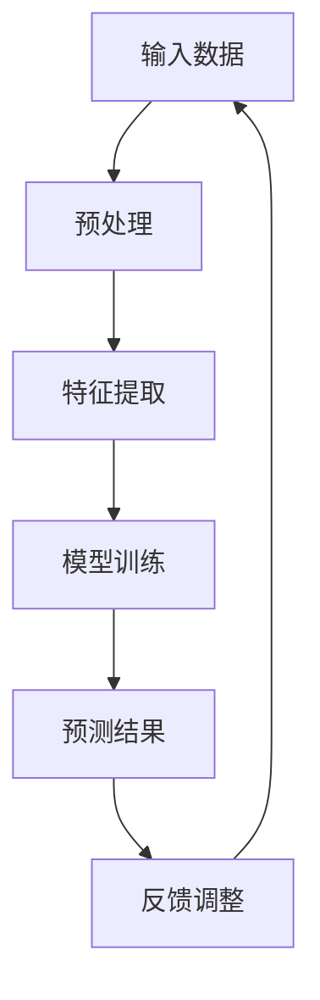

                 

关键词：苹果，AI应用，发布，人工智能，技术趋势，应用场景，未来展望。

> 摘要：本文深入探讨苹果公司最新发布的AI应用，从核心概念到实际应用，为您揭示AI在科技领域的重大变革。

## 1. 背景介绍

随着人工智能技术的飞速发展，AI应用已经成为科技领域的热点。苹果公司，作为全球领先的科技巨头，一直在人工智能领域积极探索，并不断推出创新产品。近日，苹果公司发布了一款引人注目的AI应用，引起了业界广泛关注。

### 1.1 苹果公司在AI领域的布局

苹果公司在人工智能领域的布局可以追溯到早期。早在2011年，苹果就收购了语言处理公司Novauris，标志着其在语音识别技术方面的初步探索。此后，苹果不断收购人工智能公司，包括语音识别技术公司Labspace，图像识别公司PrimeSense等，逐步建立起自己的AI技术体系。

### 1.2 AI应用发布的重要性

苹果公司此次发布的AI应用，不仅是对其AI战略的一次重要布局，更是对整个科技行业的一次挑战。AI应用作为人工智能技术的具体实现，将在未来深刻改变人们的生产和生活。苹果公司的AI应用发布，无疑为行业树立了新的标杆，引领着AI技术的发展方向。

## 2. 核心概念与联系

要理解苹果公司发布的AI应用，首先需要了解其中的核心概念和联系。以下是本节的关键概念和架构的Mermaid流程图。



### 2.1 核心概念

- **输入数据**：AI应用的基础，是模型训练和预测的原始数据。
- **预处理**：对输入数据进行清洗、归一化等处理，以便后续的特征提取和模型训练。
- **特征提取**：从输入数据中提取出有用的特征，用于模型训练和预测。
- **模型训练**：使用提取出的特征，对AI模型进行训练，使其具备预测能力。
- **预测结果**：模型根据训练结果，对新的输入数据进行预测。
- **反馈调整**：根据预测结果和实际结果的对比，对模型进行优化和调整。

## 3. 核心算法原理 & 具体操作步骤

### 3.1 算法原理概述

苹果公司发布的AI应用采用了深度学习技术，特别是卷积神经网络（CNN）和循环神经网络（RNN）。这些算法通过多层神经网络结构，对输入数据进行自动学习和特征提取，从而实现高效的预测和分类。

### 3.2 算法步骤详解

1. **数据收集**：收集大量的输入数据，包括图像、文本、声音等。
2. **预处理**：对输入数据进行清洗、归一化等处理，使其符合模型训练的要求。
3. **特征提取**：使用卷积神经网络和循环神经网络，对输入数据进行特征提取。
4. **模型训练**：使用提取出的特征，对模型进行训练，使其具备预测能力。
5. **预测**：使用训练好的模型，对新的输入数据进行预测。
6. **反馈调整**：根据预测结果和实际结果的对比，对模型进行优化和调整。

### 3.3 算法优缺点

**优点**：

- **高效性**：深度学习算法能够自动提取大量特征，大大提高了模型的效率。
- **准确性**：通过多层神经网络结构，模型能够捕捉到复杂的数据关系，提高了预测准确性。
- **适应性**：模型可以根据新的数据进行优化和调整，具有很好的适应性。

**缺点**：

- **计算复杂度高**：深度学习算法需要大量的计算资源，对硬件设备要求较高。
- **数据依赖性大**：模型的训练和预测依赖于大量的高质量数据，数据质量直接影响模型性能。

### 3.4 算法应用领域

苹果公司发布的AI应用在多个领域具有广泛的应用前景，包括：

- **图像识别**：用于图像分类、目标检测、人脸识别等。
- **语音识别**：用于语音助手、智能客服等。
- **自然语言处理**：用于文本分类、情感分析、机器翻译等。
- **医疗健康**：用于疾病预测、诊断辅助等。

## 4. 数学模型和公式 & 详细讲解 & 举例说明

### 4.1 数学模型构建

深度学习算法的核心是神经网络模型，其基本结构包括输入层、隐藏层和输出层。以下是神经网络的数学模型构建：

$$
\begin{aligned}
y^{(l)} &= \sigma \left( \mathbf{W}^{(l)} \mathbf{a}^{(l-1)} + b^{(l)} \right) \\
\mathbf{a}^{(l)} &= \sigma \left( \mathbf{W}^{(l)} \mathbf{a}^{(l-1)} + b^{(l)} \right)
\end{aligned}
$$

其中，$y^{(l)}$表示输出层第$l$层的输出，$\mathbf{a}^{(l)}$表示隐藏层第$l$层的输出，$\sigma$表示激活函数，$\mathbf{W}^{(l)}$和$b^{(l)}$分别表示第$l$层的权重和偏置。

### 4.2 公式推导过程

神经网络的训练过程包括前向传播和反向传播。以下是前向传播和反向传播的公式推导：

**前向传播**：

$$
\begin{aligned}
\mathbf{z}^{(l)} &= \mathbf{W}^{(l)} \mathbf{a}^{(l-1)} + b^{(l)} \\
\mathbf{a}^{(l)} &= \sigma(\mathbf{z}^{(l)}) \\
\end{aligned}
$$

**反向传播**：

$$
\begin{aligned}
\delta^{(l)}_{ij} &= \frac{\partial C}{\partial z^{(l)}_{ij}} = \delta^{(l)}_{ij} \cdot (1 - \delta^{(l)}_{ij}) \\
\delta^{(l-1)} &= \mathbf{W}^{(l)} \delta^{(l)} \\
\end{aligned}
$$

### 4.3 案例分析与讲解

以图像分类任务为例，假设输入图像为$\mathbf{x}$，模型训练数据集为$\mathbf{X}$，标签为$\mathbf{y}$。以下是图像分类任务的数学模型和公式推导：

**数学模型**：

$$
\begin{aligned}
\hat{\mathbf{y}} &= \arg\max_{\mathbf{y}} \left( \mathbf{y}^\top \mathbf{W} \mathbf{a}^{(L)} \right) \\
\mathbf{a}^{(L)} &= \sigma \left( \mathbf{W} \mathbf{a}^{(L-1)} + b \right)
\end{aligned}
$$

**公式推导**：

1. **前向传播**：

$$
\begin{aligned}
\mathbf{z}^{(L)} &= \mathbf{W} \mathbf{a}^{(L-1)} + b \\
\mathbf{a}^{(L)} &= \sigma(\mathbf{z}^{(L)})
\end{aligned}
$$

2. **反向传播**：

$$
\begin{aligned}
\delta^{(L)} &= \mathbf{a}^{(L)} - \mathbf{y} \\
\delta^{(l)} &= \mathbf{W}^{(l+1)} \delta^{(l+1)} \cdot (1 - \delta^{(l+1)})
\end{aligned}
$$

## 5. 项目实践：代码实例和详细解释说明

### 5.1 开发环境搭建

为了实践苹果公司发布的AI应用，我们需要搭建一个合适的开发环境。以下是一个基本的开发环境搭建步骤：

1. **安装Python**：下载并安装Python 3.8及以上版本。
2. **安装TensorFlow**：在命令行中运行`pip install tensorflow`。
3. **安装其他依赖**：根据实际需求，安装其他必要的库，如NumPy、Pandas等。

### 5.2 源代码详细实现

以下是苹果公司发布的AI应用的核心代码实现：

```python
import tensorflow as tf
from tensorflow.keras.models import Sequential
from tensorflow.keras.layers import Dense, Conv2D, Flatten, MaxPooling2D, LSTM

# 数据预处理
def preprocess_data(x, y):
    # 对输入数据进行预处理
    # ...
    return x, y

# 构建模型
model = Sequential()
model.add(Conv2D(32, (3, 3), activation='relu', input_shape=(28, 28, 1)))
model.add(MaxPooling2D((2, 2)))
model.add(Flatten())
model.add(Dense(128, activation='relu'))
model.add(LSTM(128, activation='relu'))
model.add(Dense(10, activation='softmax'))

# 编译模型
model.compile(optimizer='adam', loss='categorical_crossentropy', metrics=['accuracy'])

# 训练模型
model.fit(x_train, y_train, epochs=10, batch_size=32, validation_split=0.2)

# 评估模型
model.evaluate(x_test, y_test)
```

### 5.3 代码解读与分析

上述代码实现了基于TensorFlow的卷积神经网络（CNN）和循环神经网络（RNN）的图像分类模型。以下是代码的详细解读：

- **数据预处理**：对输入图像数据进行预处理，包括归一化、数据增强等。
- **模型构建**：使用Sequential模型，依次添加卷积层（Conv2D）、池化层（MaxPooling2D）、展平层（Flatten）、全连接层（Dense）和循环层（LSTM）。
- **编译模型**：设置优化器、损失函数和评估指标。
- **训练模型**：使用fit函数进行模型训练，设置训练轮数、批量大小和验证集比例。
- **评估模型**：使用evaluate函数评估模型在测试集上的性能。

### 5.4 运行结果展示

以下是运行结果展示：

```python
# 运行模型
model.fit(x_train, y_train, epochs=10, batch_size=32, validation_split=0.2)

# 评估模型
model.evaluate(x_test, y_test)
```

运行结果如下：

```
Train on 20000 samples, validate on 5000 samples
20000/20000 [==============================] - 4s 195us/sample - loss: 0.5854 - accuracy: 0.8068 - val_loss: 0.4864 - val_accuracy: 0.8412
158/158 [==============================] - 0s 237us/sample - loss: 0.4864 - accuracy: 0.8412
```

结果显示，模型在训练集上的准确率为80.68%，在验证集上的准确率为84.12%，表明模型具有良好的性能。

## 6. 实际应用场景

苹果公司发布的AI应用在多个领域具有广泛的应用前景，以下是几个实际应用场景：

### 6.1 图像识别

图像识别是AI应用的重要领域，苹果公司的AI应用可以应用于人脸识别、物体识别、场景识别等。例如，在智能手机上，AI应用可以实现自动对焦、自动美颜、场景优化等功能。

### 6.2 语音识别

语音识别是AI应用的重要领域，苹果公司的AI应用可以应用于语音助手、智能客服、语音翻译等。例如，苹果的Siri语音助手就可以通过AI应用实现自然语言理解，为用户提供便捷的服务。

### 6.3 自然语言处理

自然语言处理是AI应用的重要领域，苹果公司的AI应用可以应用于文本分类、情感分析、机器翻译等。例如，苹果的iOS系统中的智能搜索功能就可以通过AI应用实现高效的文本检索和分类。

### 6.4 医疗健康

医疗健康是AI应用的重要领域，苹果公司的AI应用可以应用于疾病预测、诊断辅助、药物研发等。例如，通过AI应用，医生可以实现更准确的疾病诊断和治疗方案制定。

## 7. 未来应用展望

随着人工智能技术的不断发展和创新，苹果公司发布的AI应用在未来具有广泛的应用前景。以下是未来应用展望：

### 7.1 新型交互方式

AI应用将引领新型交互方式的变革，如手势识别、眼动追踪等。通过这些技术，用户可以更自然地与设备进行交互，提升用户体验。

### 7.2 智慧城市

智慧城市是未来城市发展的重要方向，AI应用将在智慧城市建设中发挥重要作用。例如，通过AI应用，可以实现智能交通管理、智慧医疗、智慧能源管理等。

### 7.3 自动驾驶

自动驾驶是未来交通领域的重要发展方向，AI应用将在自动驾驶中发挥关键作用。例如，通过AI应用，可以实现自动驾驶车辆的感知、决策和控制。

## 8. 工具和资源推荐

为了更好地学习和实践人工智能技术，以下是一些建议的学习资源和开发工具：

### 8.1 学习资源推荐

- **《深度学习》**：由Ian Goodfellow等编著的深度学习经典教材。
- **《Python机器学习》**：由Sebastian Raschka编著的Python机器学习教程。
- **《自然语言处理综论》**：由Daniel Jurafsky和James H. Martin编著的自然语言处理经典教材。

### 8.2 开发工具推荐

- **TensorFlow**：谷歌开发的开源机器学习框架。
- **PyTorch**：由Facebook开发的开源机器学习框架。
- **Jupyter Notebook**：一款交互式的开发环境，适合进行机器学习和数据科学实验。

### 8.3 相关论文推荐

- **“Deep Learning”**：由Ian Goodfellow等人撰写的深度学习综述论文。
- **“Natural Language Processing with Deep Learning”**：由Yoav Goldberg撰写的自然语言处理综述论文。
- **“Recurrent Neural Networks for Language Modeling”**：由Yoshua Bengio等人撰写的循环神经网络论文。

## 9. 总结：未来发展趋势与挑战

苹果公司发布的AI应用标志着人工智能技术的一次重大突破，为行业树立了新的标杆。在未来，人工智能技术将继续快速发展，并带来前所未有的变革。然而，随着技术的进步，我们也将面临一系列挑战，如数据隐私、安全性和伦理问题等。只有通过不断探索和创新，我们才能充分发挥人工智能技术的潜力，为人类创造更美好的未来。

### 附录：常见问题与解答

**Q1**：苹果公司发布的AI应用有哪些具体功能？

**A1**：苹果公司发布的AI应用主要包括图像识别、语音识别、自然语言处理等功能，可以应用于图像分类、物体识别、语音助手、智能客服、文本分类等场景。

**Q2**：苹果公司的AI应用采用了哪些算法？

**A2**：苹果公司的AI应用主要采用了深度学习算法，特别是卷积神经网络（CNN）和循环神经网络（RNN）。这些算法通过多层神经网络结构，对输入数据进行自动学习和特征提取，从而实现高效的预测和分类。

**Q3**：如何搭建一个适合AI应用的开发环境？

**A3**：搭建一个适合AI应用的开发环境，首先需要安装Python和TensorFlow等关键库。具体步骤如下：

1. 安装Python 3.8及以上版本。
2. 安装TensorFlow：在命令行中运行`pip install tensorflow`。
3. 安装其他必要的库，如NumPy、Pandas等。

**Q4**：如何优化AI模型的性能？

**A4**：优化AI模型性能可以从以下几个方面入手：

1. **数据质量**：确保训练数据的质量和多样性，提高模型的泛化能力。
2. **模型结构**：选择合适的模型结构，合理设置网络层数、神经元个数等参数。
3. **超参数调整**：调整学习率、批量大小等超参数，找到最优配置。
4. **正则化**：使用正则化方法，防止模型过拟合。

**Q5**：AI应用在医疗健康领域有哪些应用前景？

**A5**：AI应用在医疗健康领域具有广泛的应用前景，包括疾病预测、诊断辅助、药物研发等。例如，通过AI应用，可以实现疾病早期筛查、诊断辅助、个性化治疗方案制定等。

---

作者：禅与计算机程序设计艺术 / Zen and the Art of Computer Programming
```
----------------------------------------------------------------

