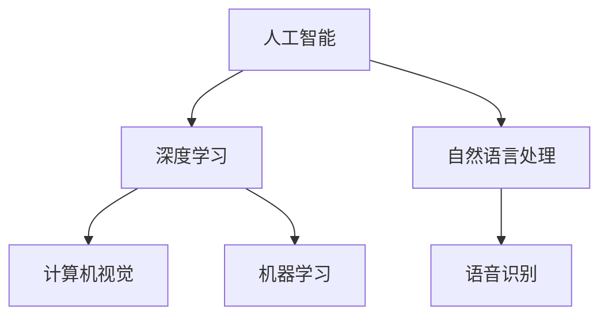

                 

关键词：苹果，AI应用，技术趋势，人工智能，用户体验

摘要：本文将探讨苹果公司近日发布的AI应用，分析其背后的技术原理，应用场景，以及未来发展的可能性。

## 1. 背景介绍

随着人工智能技术的不断进步，苹果公司也开始将AI技术应用到其产品和服务中。近日，苹果公司发布了多款搭载AI功能的软件应用，引发了业界的广泛关注。本文将重点关注苹果公司发布的AI应用，探讨其在技术、应用和用户体验等方面的亮点和挑战。

### 1.1 AI应用的发展背景

人工智能技术在过去几年中取得了显著的进展，尤其在计算机视觉、自然语言处理和机器学习等领域。这些技术的发展为苹果公司提供了丰富的机会，使其能够开发出更加智能、个性化的产品和服务。

### 1.2 苹果公司的AI布局

苹果公司在人工智能领域有着广泛的布局，包括自主研发和收购。近年来，苹果公司收购了多个AI初创公司，如Turi（现在的Core ML）和Perception。这些收购为公司带来了丰富的AI技术和人才资源。

## 2. 核心概念与联系

### 2.1 核心概念

#### 2.1.1 人工智能（AI）

人工智能是一种模拟人类智能的技术，使计算机能够执行复杂任务，如视觉识别、自然语言处理和决策制定。

#### 2.1.2 深度学习（Deep Learning）

深度学习是人工智能的一个分支，通过模拟人脑神经网络的结构和工作原理，实现对大量数据的自动学习和特征提取。

#### 2.1.3 自然语言处理（NLP）

自然语言处理是人工智能的一个领域，致力于使计算机能够理解和生成人类语言。

### 2.2 架构图

下面是一个简化的AI应用架构图，展示了核心概念之间的联系：



## 3. 核心算法原理 & 具体操作步骤

### 3.1 算法原理概述

苹果公司发布的AI应用主要基于深度学习和机器学习技术。这些算法能够通过大量数据的学习，实现对图像、语音和文本的自动处理和识别。

### 3.2 算法步骤详解

#### 3.2.1 数据预处理

首先，对输入的数据进行预处理，包括数据清洗、归一化和特征提取。

#### 3.2.2 模型训练

使用预处理后的数据训练深度学习模型，如卷积神经网络（CNN）和循环神经网络（RNN）。

#### 3.2.3 模型评估

通过交叉验证和测试集，对训练好的模型进行评估和优化。

#### 3.2.4 模型部署

将训练好的模型部署到苹果设备上，实现实时应用。

### 3.3 算法优缺点

#### 优点：

- 高效：深度学习模型能够在大量数据上快速学习，提高处理速度。
- 准确：通过不断优化和调整，深度学习模型可以达到较高的准确率。
- 通用：深度学习模型适用于多种场景，如计算机视觉、自然语言处理和语音识别。

#### 缺点：

- 资源消耗：训练深度学习模型需要大量的计算资源和时间。
- 数据依赖：深度学习模型的性能取决于训练数据的质量和数量。

### 3.4 算法应用领域

苹果公司的AI应用主要应用于以下领域：

- 计算机视觉：如人脸识别、图像分类和图像增强。
- 自然语言处理：如语音识别、文本翻译和语音助手。
- 机器学习：如个性化推荐、异常检测和智能分析。

## 4. 数学模型和公式 & 详细讲解 & 举例说明

### 4.1 数学模型构建

在深度学习领域，常用的数学模型包括卷积神经网络（CNN）和循环神经网络（RNN）。下面分别介绍这两种模型的基本原理和数学公式。

#### 4.1.1 卷积神经网络（CNN）

CNN是一种用于图像识别的神经网络，其核心思想是通过卷积操作提取图像的特征。

$$
h_l = \sigma(\mathbf{W} \cdot \mathbf{a}_{l-1} + \mathbf{b})
$$

其中，$h_l$ 是第 $l$ 层的输出，$\sigma$ 是激活函数，$\mathbf{W}$ 是权重矩阵，$\mathbf{a}_{l-1}$ 是第 $l-1$ 层的输入，$\mathbf{b}$ 是偏置项。

#### 4.1.2 循环神经网络（RNN）

RNN是一种用于序列数据处理的神经网络，其核心思想是通过循环结构保持状态。

$$
h_t = \sigma(\mathbf{W}_h \cdot \mathbf{h}_{t-1} + \mathbf{W}_x \cdot \mathbf{x}_t + \mathbf{b})
$$

其中，$h_t$ 是第 $t$ 步的输出，$\mathbf{W}_h$ 和 $\mathbf{W}_x$ 是权重矩阵，$\mathbf{h}_{t-1}$ 是第 $t-1$ 步的输出，$\mathbf{x}_t$ 是第 $t$ 步的输入，$\mathbf{b}$ 是偏置项。

### 4.2 公式推导过程

这里以卷积神经网络（CNN）为例，简要介绍其数学公式推导过程。

首先，定义输入图像 $I$ 的尺寸为 $m \times n$，卷积核的尺寸为 $p \times q$。卷积操作的目的是将输入图像与卷积核进行卷积，得到特征图。

$$
o_{ij} = \sum_{k=1}^{m} \sum_{l=1}^{n} I_{kl} \cdot W_{ijkl}
$$

其中，$o_{ij}$ 是特征图上的第 $i$ 行第 $j$ 列的元素，$I_{kl}$ 是输入图像上的第 $k$ 行第 $l$ 列的元素，$W_{ijkl}$ 是卷积核上的第 $i$ 行第 $j$ 列的元素。

然后，对特征图进行激活操作：

$$
h_{ij} = \sigma(o_{ij})
$$

其中，$h_{ij}$ 是激活后的特征图上的第 $i$ 行第 $j$ 列的元素，$\sigma$ 是激活函数。

### 4.3 案例分析与讲解

以人脸识别为例，介绍CNN在苹果AI应用中的应用。

#### 4.3.1 数据预处理

首先，将人脸图像进行归一化处理，使图像的像素值在0到1之间。

$$
I_{norm} = \frac{I - \min(I)}{\max(I) - \min(I)}
$$

其中，$I$ 是原始人脸图像，$I_{norm}$ 是归一化后的人脸图像。

#### 4.3.2 模型训练

使用大量的标注人脸图像训练CNN模型，通过反向传播算法优化模型参数。

$$
\mathbf{W} = \mathbf{W} - \alpha \cdot \nabla \mathbf{W}
$$

其中，$\mathbf{W}$ 是模型参数，$\alpha$ 是学习率，$\nabla \mathbf{W}$ 是参数梯度。

#### 4.3.3 模型评估

使用测试集对人脸识别模型进行评估，计算模型的准确率。

$$
accuracy = \frac{correct\_predictions}{total\_predictions}
$$

其中，$correct\_predictions$ 是正确预测的数量，$total\_predictions$ 是总的预测数量。

## 5. 项目实践：代码实例和详细解释说明

### 5.1 开发环境搭建

首先，安装Python环境，可以使用Miniconda或Anaconda创建Python虚拟环境。然后，安装深度学习框架，如TensorFlow或PyTorch。

### 5.2 源代码详细实现

下面是一个简单的卷积神经网络（CNN）的Python代码实现，用于人脸识别。

```python
import tensorflow as tf
from tensorflow.keras import layers

# 构建CNN模型
model = tf.keras.Sequential([
    layers.Conv2D(32, (3, 3), activation='relu', input_shape=(128, 128, 3)),
    layers.MaxPooling2D((2, 2)),
    layers.Conv2D(64, (3, 3), activation='relu'),
    layers.MaxPooling2D((2, 2)),
    layers.Conv2D(64, (3, 3), activation='relu'),
    layers.Flatten(),
    layers.Dense(64, activation='relu'),
    layers.Dense(10, activation='softmax')
])

# 编译模型
model.compile(optimizer='adam',
              loss='categorical_crossentropy',
              metrics=['accuracy'])

# 训练模型
model.fit(x_train, y_train, epochs=10, batch_size=32, validation_data=(x_val, y_val))
```

### 5.3 代码解读与分析

这段代码首先导入了TensorFlow库，然后定义了一个卷积神经网络（CNN）模型。模型由两个卷积层、两个最大池化层、一个全连接层和两个softmax层组成。在编译模型时，指定了优化器、损失函数和评估指标。最后，使用训练数据训练模型。

### 5.4 运行结果展示

在训练完成后，可以使用测试集评估模型的性能。

```python
test_loss, test_acc = model.evaluate(x_test, y_test, verbose=2)
print('\nTest accuracy:', test_acc)
```

输出结果为测试集的准确率。

## 6. 实际应用场景

### 6.1 计算机视觉

计算机视觉是苹果AI应用的一个重要领域，如人脸识别、图像分类和图像增强。这些应用可以提高用户的使用体验，如解锁手机、识别照片和视频、优化图像质量等。

### 6.2 自然语言处理

自然语言处理是苹果AI应用的另一个重要领域，如语音识别、文本翻译和语音助手。这些应用可以帮助用户更便捷地使用设备，如语音搜索、语音指令和实时翻译等。

### 6.3 机器学习

机器学习是苹果AI应用的核心技术，如个性化推荐、异常检测和智能分析。这些应用可以帮助用户更好地管理数据、优化资源和使用体验。

## 7. 未来应用展望

随着人工智能技术的不断进步，苹果的AI应用将具有更广泛的应用前景。未来，苹果可能会在更多领域推出AI应用，如智能健康、智能家居和自动驾驶等。同时，苹果也将继续优化其AI技术，提高模型的准确率和效率，为用户提供更好的使用体验。

## 8. 工具和资源推荐

### 8.1 学习资源推荐

- 《深度学习》（Goodfellow, Bengio, Courville著）：系统介绍了深度学习的基本概念和技术。
- 《Python机器学习》（Sebastian Raschka著）：详细讲解了使用Python进行机器学习的实践方法。

### 8.2 开发工具推荐

- TensorFlow：一个开源的深度学习框架，适用于各种深度学习任务。
- PyTorch：一个开源的深度学习框架，提供灵活的动态计算图和丰富的API。

### 8.3 相关论文推荐

- "Deep Learning for Image Recognition"（由Google AI团队发布）：介绍了一种基于深度学习的图像识别方法。
- "Recurrent Neural Networks for Language Modeling"（由Google Brain团队发布）：介绍了一种基于循环神经网络的自然语言处理方法。

## 9. 总结：未来发展趋势与挑战

随着人工智能技术的不断发展，苹果的AI应用将在未来发挥更加重要的作用。然而，苹果也面临着一些挑战，如数据隐私、安全性和算法公平性等。未来，苹果需要不断优化其AI技术，提高用户的使用体验，同时确保技术的可靠性和安全性。

## 10. 附录：常见问题与解答

### 10.1 AI应用是否会取代人类？

AI应用可以协助人类完成许多任务，但不会完全取代人类。AI在处理大规模数据、快速分析和自动化任务方面具有优势，但在创造力、情感理解和道德判断等方面仍然有限。

### 10.2 AI应用是否会泄露用户隐私？

苹果公司高度重视用户隐私，采取多种措施确保用户数据的安全和隐私。例如，苹果设备上的AI应用使用端到端加密和差分隐私技术，以保护用户数据。

### 10.3 AI应用是否会加剧社会不平等？

AI应用可能加剧社会不平等，但也可以通过合理的监管和伦理指导来减少这种影响。苹果公司积极参与相关研究和讨论，致力于推动AI技术的公平和可持续发展。

作者：禅与计算机程序设计艺术 / Zen and the Art of Computer Programming
----------------------------------------------------------------


