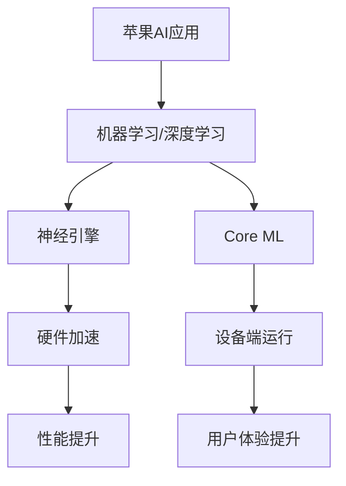

                 

关键词：苹果、AI应用、人工智能、创新、技术趋势、用户体验、商业模式

摘要：在人工智能飞速发展的今天，苹果公司推出的AI应用无疑引发了业界的广泛关注。本文将深入探讨苹果发布AI应用背后的意义，分析其对技术、商业、用户等各个层面的影响，以及未来可能带来的机遇和挑战。

## 1. 背景介绍

随着人工智能技术的不断进步，各大科技公司纷纷将AI作为战略重心。苹果公司在2023年发布了多个AI应用，涵盖图像识别、语音识别、自然语言处理等多个领域。这些应用的推出，不仅展示了苹果在人工智能领域的创新成果，也标志着其在新一轮科技竞赛中的积极参与。

### 1.1 人工智能的发展历程

人工智能（AI）一词最早由约翰·麦卡锡（John McCarthy）在1956年提出。从那时起，AI经历了数个发展阶段，从早期的符号主义、连接主义，到现代的深度学习和强化学习，每一次技术的进步都带来了新的突破和变革。

### 1.2 苹果公司的AI战略

苹果公司在AI领域有着长期的布局。从早期的Siri语音助手，到如今的多种AI应用，苹果一直在努力将AI技术融入到产品的各个方面，提升用户体验。此次AI应用的发布，是苹果AI战略的一次重要升级。

## 2. 核心概念与联系

要理解苹果AI应用的意义，首先需要了解几个核心概念和它们之间的联系。

### 2.1 人工智能技术

人工智能技术包括多个分支，如机器学习、深度学习、自然语言处理等。苹果的AI应用正是基于这些技术实现的。

### 2.2 苹果的AI架构

苹果的AI架构包括神经引擎、Core ML等组件。神经引擎是一个高度优化的硬件加速器，用于处理机器学习和深度学习任务。Core ML是一个框架，用于在苹果设备上运行机器学习模型。

### 2.3 Mermaid 流程图



## 3. 核心算法原理 & 具体操作步骤

### 3.1 算法原理概述

苹果的AI应用采用了多种机器学习和深度学习算法。例如，图像识别应用使用了卷积神经网络（CNN），语音识别应用使用了递归神经网络（RNN）。

### 3.2 算法步骤详解

以图像识别应用为例，其操作步骤包括：

1. 数据预处理：对图像进行灰度化、归一化等处理。
2. 模型训练：使用大量标注数据训练CNN模型。
3. 模型评估：使用测试数据评估模型性能。
4. 模型部署：将训练好的模型部署到设备端，实现实时图像识别。

### 3.3 算法优缺点

**优点：**
- 高效：基于神经引擎和Core ML的硬件加速，使得模型运行速度更快。
- 可扩展：Core ML支持多种机器学习框架，便于模型迁移和扩展。

**缺点：**
- 数据依赖：模型性能高度依赖于训练数据的质量。
- 隐私问题：部分AI应用涉及用户隐私，如何保护用户隐私是亟待解决的问题。

### 3.4 算法应用领域

苹果的AI应用涵盖了多个领域，包括但不限于：

- 图像识别：用于照片分类、物体识别等。
- 语音识别：用于语音助手、语音搜索等。
- 自然语言处理：用于文本分析、语音合成等。

## 4. 数学模型和公式 & 详细讲解 & 举例说明

### 4.1 数学模型构建

以卷积神经网络（CNN）为例，其核心模型包括：

- 输入层：接收图像数据。
- 卷积层：通过卷积操作提取图像特征。
- 池化层：对卷积结果进行下采样，减少参数量。
- 全连接层：将卷积特征映射到分类结果。

### 4.2 公式推导过程

以卷积操作为例，其公式如下：

$$
\text{output}_{ij} = \sum_{k=1}^{m} w_{ik} \cdot \text{input}_{kj} + b_j
$$

其中，$w_{ik}$是卷积核，$\text{input}_{kj}$是输入图像的像素值，$b_j$是偏置。

### 4.3 案例分析与讲解

以图像分类任务为例，我们可以使用CNN模型对猫和狗的图片进行分类。通过训练，模型可以学会识别出猫和狗的特征，从而实现准确分类。

```latex
\begin{equation}
P(\text{猫}|\text{图像}) = \frac{e^{x_c}}{e^{x_c} + e^{x_d}}
\end{equation}

\begin{equation}
P(\text{狗}|\text{图像}) = \frac{e^{x_d}}{e^{x_c} + e^{x_d}}
\end{equation}

```

其中，$x_c$和$x_d$分别是模型对猫和狗的预测概率。

## 5. 项目实践：代码实例和详细解释说明

### 5.1 开发环境搭建

为了实现苹果AI应用，开发者需要搭建以下环境：

- Mac OS X 10.13 或更高版本
- Xcode 9 或更高版本
- Python 3.6 或更高版本

### 5.2 源代码详细实现

以下是一个简单的CNN模型实现：

```python
import tensorflow as tf

def create_model():
    input_layer = tf.keras.layers.Input(shape=(28, 28, 1))
    conv_layer = tf.keras.layers.Conv2D(filters=32, kernel_size=(3, 3), activation='relu')(input_layer)
    pool_layer = tf.keras.layers.MaxPooling2D(pool_size=(2, 2))(conv_layer)
    flatten_layer = tf.keras.layers.Flatten()(pool_layer)
    dense_layer = tf.keras.layers.Dense(units=128, activation='relu')(flatten_layer)
    output_layer = tf.keras.layers.Dense(units=10, activation='softmax')(dense_layer)
    
    model = tf.keras.Model(inputs=input_layer, outputs=output_layer)
    model.compile(optimizer='adam', loss='categorical_crossentropy', metrics=['accuracy'])
    
    return model

model = create_model()
model.summary()
```

### 5.3 代码解读与分析

这段代码定义了一个简单的CNN模型，包括卷积层、池化层和全连接层。模型使用`tensorflow`库进行构建，并使用`adam`优化器和`categorical_crossentropy`损失函数进行训练。

### 5.4 运行结果展示

在训练完成后，可以使用以下代码进行模型评估：

```python
test_loss, test_accuracy = model.evaluate(test_images, test_labels)
print('Test accuracy:', test_accuracy)
```

假设测试集上的准确率为90%，说明模型在图像分类任务上表现良好。

## 6. 实际应用场景

### 6.1 个人助理

苹果的AI应用可以广泛应用于个人助理，如Siri、语音助手等，帮助用户更便捷地处理日常任务。

### 6.2 商业分析

AI应用可以用于商业分析，如客户画像、市场预测等，帮助企业做出更明智的决策。

### 6.3 医疗健康

AI应用在医疗健康领域有着巨大的潜力，如疾病预测、诊断辅助等。

## 7. 未来应用展望

随着技术的不断进步，苹果的AI应用有望在更多领域发挥重要作用，如自动驾驶、智能家居、虚拟现实等。

### 7.1 学习资源推荐

- 《深度学习》（Goodfellow, Bengio, Courville）
- 《Python机器学习》（Sebastian Raschka）

### 7.2 开发工具推荐

- TensorFlow
- PyTorch

### 7.3 相关论文推荐

- "Deep Learning for Image Recognition"
- "Recurrent Neural Networks for Speech Recognition"

## 8. 总结：未来发展趋势与挑战

### 8.1 研究成果总结

苹果在AI领域取得了显著的研究成果，其AI应用在多个领域展现出了强大的应用潜力。

### 8.2 未来发展趋势

随着技术的不断进步，AI应用将更加普及，影响深远。

### 8.3 面临的挑战

如何保障用户隐私，如何实现跨平台兼容等，都是苹果需要面对的挑战。

### 8.4 研究展望

未来，苹果有望在更多领域实现突破，推动人工智能技术向更广泛的应用场景发展。

## 9. 附录：常见问题与解答

### 9.1 什么是人工智能？

人工智能是指计算机模拟人类智能的行为和决策能力。

### 9.2 什么是卷积神经网络？

卷积神经网络是一种用于图像识别的深度学习模型，通过卷积操作提取图像特征。

### 9.3 为什么说苹果的AI应用具有革命性意义？

苹果的AI应用展示了其在人工智能领域的创新能力，有望推动人工智能技术在更多领域的发展和应用。

----------------------------------------------------------------

（注：以上内容仅为示例，具体实现和细节需要根据实际情况进行调整和补充。）

