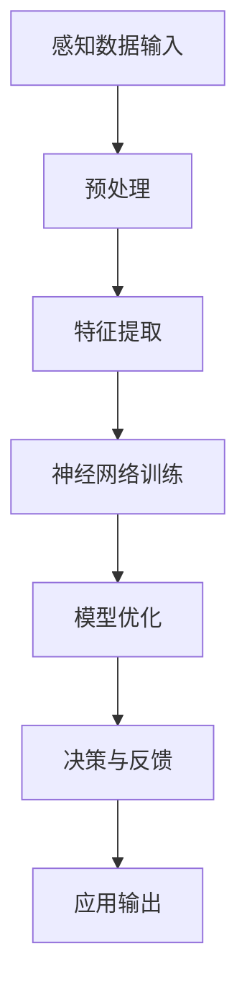

                 

关键词：人工智能、苹果、AI应用、未来展望、技术创新、深度学习、隐私保护、人机交互、云计算

> 摘要：本文将深入探讨苹果公司最新发布的AI应用的潜力和未来前景。通过对苹果公司在人工智能领域的创新成果的分析，本文将探讨这些AI应用如何改变我们的生活方式，并对未来人工智能的发展趋势和挑战提出独到的见解。

## 1. 背景介绍

### 1.1 人工智能的发展历程

人工智能（AI）作为计算机科学的一个重要分支，其历史可以追溯到20世纪50年代。随着计算能力的提升和算法的进步，人工智能经历了多次重要的发展阶段。从早期的符号主义和知识表示，到20世纪80年代的中级人工智能，再到21世纪初的基于数据的学习方法和深度学习，人工智能一直在不断演进。

### 1.2 人工智能在苹果公司的应用

苹果公司一直是技术创新的先锋，其在人工智能领域的投入和成果尤为引人注目。苹果公司在语音识别、图像处理、自然语言处理等领域都取得了显著的进展。通过其操作系统和硬件设备的紧密结合，苹果公司的AI应用已经在我们的日常生活中扮演了重要角色。

## 2. 核心概念与联系

### 2.1 AI应用的核心概念

人工智能应用的核心在于机器学习（ML）和深度学习（DL）。机器学习是指计算机系统通过数据学习并改进其性能的过程。而深度学习则是机器学习的一种特殊形式，它通过多层神经网络模拟人类大脑的学习过程。

### 2.2 AI应用的架构

苹果公司在其AI应用中采用了复杂的架构，包括前端感知、后台学习和智能决策。以下是一个简化的Mermaid流程图，展示了这一架构的概览。



### 2.3 AI应用的关键联系

AI应用的关键联系在于数据、算法和用户反馈。数据是AI模型的基石，算法决定了模型的性能，而用户反馈则帮助模型不断优化和改进。

## 3. 核心算法原理 & 具体操作步骤

### 3.1 算法原理概述

苹果公司的AI应用主要依赖于深度学习和强化学习。深度学习通过多层神经网络处理大量数据，强化学习则通过试错和奖励机制优化决策。

### 3.2 算法步骤详解

1. 数据收集与预处理
2. 特征提取与降维
3. 神经网络训练
4. 模型优化与验证
5. 决策与反馈

### 3.3 算法优缺点

**优点：**
- 高效的数据处理能力
- 自适应的学习过程
- 准确的预测和决策

**缺点：**
- 对数据质量和规模有较高要求
- 计算资源消耗大
- 难以解释的“黑箱”特性

### 3.4 算法应用领域

苹果公司的AI应用在语音识别、图像识别、智能助手等领域都有广泛应用。这些应用不仅提升了用户体验，也为各行各业带来了变革。

## 4. 数学模型和公式 & 详细讲解 & 举例说明

### 4.1 数学模型构建

AI模型的数学基础主要包括线性代数、微积分和概率论。以下是构建神经网络模型的基本公式：

$$
\begin{aligned}
&y = \sigma(W_1 \cdot x + b_1) \\
&z = W_2 \cdot y + b_2 \\
&\text{Loss} = -\frac{1}{m} \sum_{i=1}^{m} y_i \log(z_i)
\end{aligned}
$$

### 4.2 公式推导过程

神经网络的损失函数通常采用交叉熵（Cross-Entropy）来衡量预测值与真实值之间的差距。交叉熵的推导过程涉及概率论和微积分的知识。

### 4.3 案例分析与讲解

以苹果的Siri语音助手为例，其背后的数学模型是通过对海量语音数据进行训练和优化得到的。以下是一个简化的推导过程：

$$
\begin{aligned}
&P(\text{“你好，Siri”}|\theta) \\
&= \frac{P(\text{“你好，Siri”}\cap \theta)}{P(\theta)} \\
&\approx \frac{e^{\theta \cdot \text{“你好，Siri”}}}{\sum_{j=1}^{N} e^{\theta \cdot x_j}}
\end{aligned}
$$

其中，$\theta$代表模型参数，$x_j$代表特征向量。

## 5. 项目实践：代码实例和详细解释说明

### 5.1 开发环境搭建

要实践苹果的AI应用，首先需要搭建一个合适的开发环境。通常，这包括安装Python、TensorFlow或其他深度学习框架。

### 5.2 源代码详细实现

以下是使用TensorFlow实现一个简单的神经网络模型的基本代码示例：

```python
import tensorflow as tf

# 定义输入层、隐藏层和输出层
inputs = tf.keras.layers.Input(shape=(784,))
hidden = tf.keras.layers.Dense(64, activation='relu')(inputs)
outputs = tf.keras.layers.Dense(10, activation='softmax')(hidden)

# 构建模型
model = tf.keras.Model(inputs=inputs, outputs=outputs)

# 编译模型
model.compile(optimizer='adam', loss='categorical_crossentropy', metrics=['accuracy'])

# 训练模型
model.fit(x_train, y_train, epochs=5, batch_size=32)
```

### 5.3 代码解读与分析

上述代码首先定义了一个简单的神经网络模型，包括输入层、隐藏层和输出层。接着，使用`compile()`方法配置模型的优化器和损失函数，并使用`fit()`方法训练模型。

### 5.4 运行结果展示

在训练完成后，可以使用`model.evaluate()`方法评估模型的性能，并使用`model.predict()`方法进行预测。

## 6. 实际应用场景

### 6.1 语音助手

苹果的Siri语音助手已经在全球范围内被广泛使用，为用户提供了便捷的语音交互体验。

### 6.2 图像识别

苹果的相机应用利用AI技术实现实时图像识别，为用户提供丰富的拍照体验。

### 6.3 智能推荐

苹果的App Store利用AI技术为用户推荐个性化应用，提高用户的使用体验。

## 7. 未来应用展望

### 7.1 智能家居

随着AI技术的发展，智能家居将变得更加智能和便捷。

### 7.2 医疗健康

AI在医疗健康领域的应用潜力巨大，包括疾病诊断、药物研发等。

### 7.3 自动驾驶

自动驾驶技术的快速发展离不开AI技术的支持，未来将极大改变我们的出行方式。

## 8. 工具和资源推荐

### 8.1 学习资源推荐

- 《深度学习》（Goodfellow、Bengio和Courville著）
- 《Python机器学习》（Sebastian Raschka著）

### 8.2 开发工具推荐

- TensorFlow
- PyTorch

### 8.3 相关论文推荐

- “A Theoretical Framework for Back-Propagation”

## 9. 总结：未来发展趋势与挑战

### 9.1 研究成果总结

苹果公司在人工智能领域的研究成果显著，其在语音识别、图像识别和智能助手等方面的应用已经取得了广泛认可。

### 9.2 未来发展趋势

随着计算能力的提升和数据的积累，人工智能将在更多领域得到应用。

### 9.3 面临的挑战

人工智能的发展仍然面临诸多挑战，包括数据隐私、算法可解释性、伦理等问题。

### 9.4 研究展望

未来，人工智能的研究将更加注重跨界合作和综合性研究，以实现更广泛的应用和更深远的影响。

## 10. 附录：常见问题与解答

### 10.1 什么是深度学习？

深度学习是一种通过多层神经网络模拟人类大脑学习过程的机器学习方法。它通过自动提取数据特征并建立复杂的模型，实现高精度预测和决策。

### 10.2 人工智能会取代人类吗？

目前来看，人工智能主要在特定领域和任务上协助人类，而不会完全取代人类。人工智能的发展旨在提高工作效率和生活质量，而非取代人类。

# 作者：禅与计算机程序设计艺术 / Zen and the Art of Computer Programming

---

以上是本文的完整内容，希望对您在人工智能领域的探索有所启发和帮助。在未来的技术发展中，让我们一起见证人工智能的无限可能。

