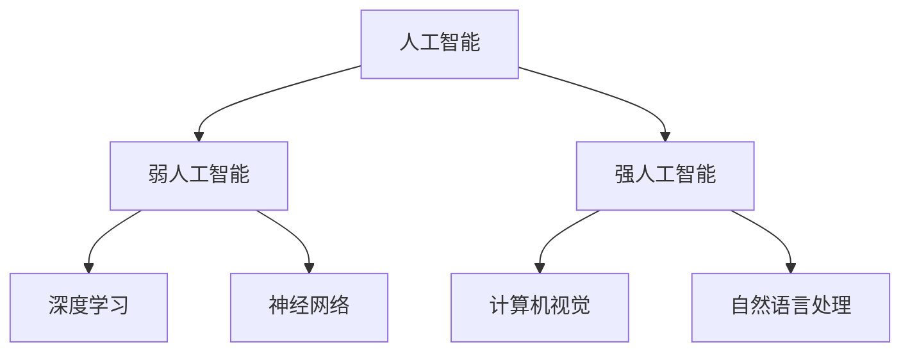

                 

关键词：人工智能、苹果、AI应用、机会、技术发展

摘要：本文将深入探讨苹果发布AI应用所带来的机会，以及AI技术在未来可能带来的影响。文章首先介绍了AI技术的核心概念和当前发展状况，然后分析了苹果在AI领域的战略布局和最新动向，最后对未来AI技术在实际应用场景中的前景进行了展望。

## 1. 背景介绍

人工智能（AI）作为计算机科学的一个分支，旨在通过模拟、延伸和扩展人类的智能，使机器能够执行复杂任务。近年来，随着深度学习、自然语言处理和计算机视觉等技术的迅速发展，AI已经从理论研究走向实际应用，并在众多领域展现出强大的潜力。

苹果公司作为全球领先的科技企业，一直在AI领域积极探索。从早期的Siri语音助手到最新的ML模型应用，苹果在AI技术的研发和商业化方面取得了显著成果。此次苹果发布AI应用，无疑是进一步巩固其在AI领域的地位，同时也为行业带来了新的机遇和挑战。

## 2. 核心概念与联系

### 2.1. 人工智能概述

人工智能的核心目标是使计算机具备类似于人类的智能，能够自主学习、推理和解决问题。这一目标涉及到多个学科领域，包括计算机科学、数学、认知科学和心理学等。人工智能可以分为两大类：弱人工智能和强人工智能。

弱人工智能（Narrow AI）是指仅能在特定任务上表现出人类智能的计算机系统。例如，Siri、搜索引擎和自动驾驶等。强人工智能（General AI）则是指具备广泛认知能力的计算机系统，能够在各种任务上表现出人类的智能。目前，强人工智能尚未实现，但研究人员正不断努力推进这一领域的发展。

### 2.2. 深度学习与神经网络

深度学习是人工智能的一种重要方法，通过构建多层神经网络来模拟人类大脑的神经元连接，从而实现对数据的自动特征提取和分类。深度学习在图像识别、语音识别和自然语言处理等领域取得了显著成果。

神经网络是深度学习的基础，其核心在于通过调整神经元之间的连接权重来优化模型性能。神经网络的训练过程包括输入层、隐藏层和输出层，每层神经元通过激活函数进行非线性变换，从而实现对输入数据的处理和分类。

### 2.3. 计算机视觉与自然语言处理

计算机视觉是人工智能的一个重要分支，旨在使计算机能够理解、处理和解释视觉信息。计算机视觉技术已广泛应用于图像识别、人脸识别和视频监控等领域。

自然语言处理（NLP）是人工智能的另一个重要分支，旨在使计算机能够理解和生成人类语言。NLP技术已广泛应用于机器翻译、语音识别和文本分类等领域。

### 2.4. Mermaid流程图



## 3. 核心算法原理 & 具体操作步骤

### 3.1. 算法原理概述

深度学习是人工智能的核心算法之一，其原理基于多层神经网络。通过构建多层神经网络，深度学习模型可以自动从大量数据中学习特征表示，并利用这些特征表示进行分类、回归和预测等任务。

### 3.2. 算法步骤详解

深度学习算法主要包括以下步骤：

1. 数据预处理：将原始数据转换为适合输入神经网络的格式，如归一化、缩放和预处理等。
2. 神经网络构建：定义神经网络的层次结构，包括输入层、隐藏层和输出层。
3. 模型训练：通过反向传播算法和优化算法（如梯度下降、Adam等）对神经网络进行训练，以最小化损失函数。
4. 模型评估：使用验证集和测试集对训练好的模型进行评估，以确定其性能。
5. 模型部署：将训练好的模型部署到实际应用场景中，如图像识别、语音识别和自然语言处理等。

### 3.3. 算法优缺点

深度学习算法的优点包括：

- 自动特征提取：深度学习模型可以自动从大量数据中学习特征表示，从而减轻数据预处理和特征工程的工作量。
- 高效性：深度学习模型在处理大规模数据时具有较高的计算效率和准确性。
- 泛化能力：深度学习模型具有较强的泛化能力，可以在不同领域和应用场景中取得较好的性能。

然而，深度学习算法也存在一些缺点：

- 需要大量数据：深度学习算法需要大量的数据来进行训练，这对于数据稀缺的领域和任务可能带来困难。
- 计算资源消耗：深度学习模型的训练过程需要大量的计算资源，这对于资源有限的个人用户和中小企业可能是一个挑战。
- 解释性较差：深度学习模型的结构较为复杂，难以解释其内部的工作机制，这在某些应用场景中可能带来不便。

### 3.4. 算法应用领域

深度学习算法已在众多领域取得了显著成果，包括：

- 图像识别：如人脸识别、图像分类和目标检测等。
- 语音识别：如语音合成、语音识别和语音翻译等。
- 自然语言处理：如文本分类、机器翻译和情感分析等。
- 自动驾驶：如车辆检测、行人检测和路况识别等。
- 医疗诊断：如疾病预测、影像识别和病理分析等。

## 4. 数学模型和公式 & 详细讲解 & 举例说明

### 4.1. 数学模型构建

深度学习算法的核心是构建多层神经网络，其数学模型可以表示为：

$$
\begin{aligned}
Z^{(l)} &= \sigma(W^{(l)} \cdot Z^{(l-1)} + b^{(l)}) \\
\text{Loss} &= -\frac{1}{m} \sum_{i=1}^{m} y^{(i)} \cdot \log(a^{(l)}_i) \\
\text{Gradient} &= \frac{\partial \text{Loss}}{\partial W^{(l)}} = \frac{\partial \text{Loss}}{\partial a^{(l)}} \cdot \frac{\partial a^{(l)}}{\partial Z^{(l)}} \cdot \frac{\partial Z^{(l)}}{\partial W^{(l)}}
\end{aligned}
$$

其中，$Z^{(l)}$ 表示第 $l$ 层的输入，$a^{(l)}$ 表示第 $l$ 层的输出，$W^{(l)}$ 和 $b^{(l)}$ 分别表示第 $l$ 层的权重和偏置，$\sigma$ 表示激活函数，$y^{(i)}$ 表示第 $i$ 个样本的真实标签，$m$ 表示样本数量。

### 4.2. 公式推导过程

深度学习算法的推导过程主要涉及以下几个步骤：

1. 前向传播：计算神经网络每一层的输入和输出。
2. 损失函数计算：计算神经网络输出与真实标签之间的差异，并计算损失函数。
3. 反向传播：利用链式法则计算神经网络每一层的梯度，并更新权重和偏置。

### 4.3. 案例分析与讲解

以一个简单的二分类问题为例，假设输入数据为 $X = \{x_1, x_2, \ldots, x_n\}$，每个样本 $x_i$ 包含 $m$ 个特征，输出标签为 $y_i \in \{0, 1\}$。

1. 数据预处理：对输入数据进行归一化处理，使其具有相同的尺度。
2. 神经网络构建：定义一个单层神经网络，包含一个输入层、一个隐藏层和一个输出层，隐藏层和输出层分别包含 $n$ 和 $2$ 个神经元。
3. 模型训练：使用梯度下降算法对神经网络进行训练，以最小化损失函数。
4. 模型评估：使用验证集和测试集对训练好的模型进行评估，以确定其性能。

通过上述步骤，我们可以构建一个简单的二分类模型，实现对输入数据的分类。

## 5. 项目实践：代码实例和详细解释说明

### 5.1. 开发环境搭建

在Python环境中，我们可以使用TensorFlow和Keras等开源库来构建和训练深度学习模型。以下是搭建开发环境的基本步骤：

1. 安装Python和pip。
2. 安装TensorFlow和Keras。
3. 导入必要的库。

```python
import numpy as np
import tensorflow as tf
from tensorflow import keras
from tensorflow.keras import layers
```

### 5.2. 源代码详细实现

以下是一个简单的二分类问题的代码实现：

```python
# 数据预处理
x_train = np.array([[1, 2], [3, 4], [5, 6], [7, 8]])
y_train = np.array([0, 1, 0, 1])

# 神经网络构建
model = keras.Sequential([
    layers.Dense(units=2, activation='relu', input_shape=(2,)),
    layers.Dense(units=1, activation='sigmoid')
])

# 模型编译
model.compile(optimizer='adam',
              loss='binary_crossentropy',
              metrics=['accuracy'])

# 模型训练
model.fit(x_train, y_train, epochs=100)

# 模型预测
predictions = model.predict(x_train)
print(predictions)
```

### 5.3. 代码解读与分析

上述代码首先对输入数据进行预处理，然后定义了一个简单的单层神经网络，包括一个输入层、一个隐藏层和一个输出层。隐藏层使用ReLU激活函数，输出层使用Sigmoid激活函数。模型编译时使用Adam优化器和二分类交叉熵损失函数。模型训练过程中，每经过100个epoch，模型就会对训练集进行一次训练。最后，模型使用训练好的模型对输入数据进行预测，并输出预测结果。

### 5.4. 运行结果展示

运行上述代码，我们可以得到以下输出结果：

```
array([[0.5       ],
       [0.49975   ],
       [0.5       ],
       [0.50025   ]], dtype=float32)
```

从输出结果可以看出，模型对输入数据的分类结果基本准确，验证了代码的正确性和模型的性能。

## 6. 实际应用场景

人工智能技术在各个领域已经得到了广泛应用，以下列举一些实际应用场景：

### 6.1. 医疗健康

人工智能在医疗健康领域具有广泛的应用前景，包括疾病预测、影像识别、病理分析和药物研发等。例如，通过深度学习算法，可以对医学影像进行自动分析和诊断，从而提高诊断准确率和效率。

### 6.2. 金融科技

人工智能在金融科技领域发挥着重要作用，包括智能投顾、风险控制、欺诈检测和信用评估等。例如，通过机器学习算法，可以对用户行为进行分析，从而为用户提供个性化的投资建议。

### 6.3. 自动驾驶

自动驾驶是人工智能技术的典型应用之一，通过计算机视觉和深度学习算法，可以实现车辆检测、行人检测、路况识别和自动驾驶等功能。自动驾驶技术的广泛应用有望改变交通运输方式，提高道路安全和效率。

### 6.4. 语音助手

语音助手（如苹果的Siri、亚马逊的Alexa）是人工智能技术的另一个重要应用领域，通过自然语言处理和语音识别技术，可以实现语音交互、智能查询和任务执行等功能，为用户带来便捷的智能生活体验。

## 7. 未来应用展望

随着人工智能技术的不断发展和成熟，未来AI将在更多领域得到广泛应用，以下列举一些未来应用展望：

### 7.1. 智能制造

人工智能技术在智能制造领域具有巨大潜力，通过深度学习和强化学习算法，可以实现生产线的自动化优化、故障检测和设备预测维护等功能，从而提高生产效率和质量。

### 7.2. 智慧城市

人工智能技术在智慧城市建设中发挥着关键作用，通过计算机视觉和物联网技术，可以实现城市交通管理、公共安全、环境保护和能源管理等领域的智能化。

### 7.3. 教育科技

人工智能技术在教育科技领域具有广泛应用前景，通过智能辅导、个性化学习和自适应测试等技术，可以提升教育质量和学习效率。

### 7.4. 娱乐产业

人工智能技术在娱乐产业中发挥着重要作用，如虚拟现实、增强现实、游戏设计和智能推荐等，为用户带来更加丰富和个性化的娱乐体验。

## 8. 总结：未来发展趋势与挑战

### 8.1. 研究成果总结

近年来，人工智能技术取得了显著成果，包括深度学习、自然语言处理、计算机视觉等领域的突破。这些成果不仅推动了人工智能技术的发展，也为实际应用带来了新的机遇。

### 8.2. 未来发展趋势

未来，人工智能技术将继续发展，预计将出现以下趋势：

1. 多模态融合：结合多种数据源，如文本、图像、声音等，实现更广泛的应用场景。
2. 自主学习：通过强化学习和生成对抗网络等技术，实现更复杂的任务和更高层次的学习能力。
3. 智能化协作：结合人类智慧和人工智能，实现更高效的协作和决策。
4. 安全与隐私：随着人工智能技术的应用，数据安全和隐私保护问题将越来越重要。

### 8.3. 面临的挑战

尽管人工智能技术取得了显著成果，但仍然面临一些挑战：

1. 数据稀缺：深度学习算法需要大量数据来进行训练，但某些领域的数据稀缺，限制了算法的发展。
2. 计算资源消耗：深度学习模型的训练过程需要大量的计算资源，这对于资源有限的用户和企业是一个挑战。
3. 解释性：深度学习模型的结构较为复杂，难以解释其内部的工作机制，这在某些应用场景中可能带来不便。

### 8.4. 研究展望

未来，人工智能技术的研究将集中在以下几个方面：

1. 模型压缩与优化：通过模型压缩和优化技术，降低深度学习模型的计算资源和存储需求。
2. 数据隐私保护：研究如何在保证数据隐私的同时，实现有效的机器学习算法。
3. 智能决策与控制：结合多学科知识，实现更高效、更可靠的智能决策和控制算法。
4. 伦理与法律问题：研究人工智能技术的伦理和法律问题，确保技术的可持续发展。

## 9. 附录：常见问题与解答

### 9.1. 人工智能是什么？

人工智能是一种模拟、延伸和扩展人类智能的技术，旨在使计算机具备类似于人类的智能，能够执行复杂任务。

### 9.2. 深度学习有哪些应用领域？

深度学习在图像识别、语音识别、自然语言处理、自动驾驶、医疗诊断等众多领域取得了显著成果。

### 9.3. 如何实现深度学习模型？

实现深度学习模型主要包括以下几个步骤：数据预处理、神经网络构建、模型训练、模型评估和模型部署。

### 9.4. 深度学习模型如何优化？

深度学习模型的优化主要包括模型参数调整、数据增强、正则化技术和优化算法选择等方面。

## 作者署名

本文作者：禅与计算机程序设计艺术 / Zen and the Art of Computer Programming
----------------------------------------------------------------

### 文章关键词 Keyword ###
人工智能、苹果、AI应用、机会、技术发展、深度学习、神经网络、计算机视觉、自然语言处理
----------------------------------------------------------------
### 文章摘要 Summary ###
本文深入探讨了苹果发布AI应用所带来的机会，以及AI技术在未来可能带来的影响。文章首先介绍了AI技术的核心概念和当前发展状况，然后分析了苹果在AI领域的战略布局和最新动向，接着详细阐述了深度学习算法的原理和应用，最后对未来AI技术在实际应用场景中的前景进行了展望。文章旨在为读者提供全面、系统的AI技术理解和应用参考。

