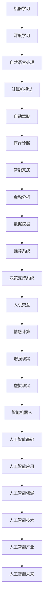
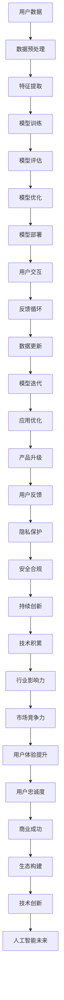

                 

关键词：人工智能、苹果、用户、应用程序、用户体验、技术创新、数据分析、机器学习、深度学习。

> 摘要：本文将深入探讨苹果公司发布的AI应用及其用户体验，从技术背景、算法原理、应用场景到未来展望，全面分析苹果在人工智能领域的最新动向。

## 1. 背景介绍

### 1.1 人工智能的崛起

人工智能（AI）作为计算机科学的一个分支，近年来经历了快速的发展。随着算法、计算能力和数据资源的不断进步，AI在各个领域的应用日益广泛，从自动驾驶到医疗诊断，从智能家居到金融分析，无不体现出其巨大的潜力。

### 1.2  苹果公司的AI战略

苹果公司一直是科技创新的先锋，其对人工智能的重视也可见一斑。近年来，苹果公司不仅在硬件层面持续提升处理能力，更在软件层面不断推出AI应用，以增强用户体验。

## 2. 核心概念与联系

### 2.1 人工智能基础概念

人工智能（AI）是一种模拟人类智能行为的计算机系统，主要包括机器学习、深度学习、自然语言处理等领域。以下是AI基础概念的Mermaid流程图：



### 2.2  苹果AI应用架构

苹果公司的AI应用主要依托其自研的神经网络引擎和机器学习框架，这些框架能够处理大规模的数据，并提供高效的模型训练和推理能力。以下是苹果AI应用的架构Mermaid流程图：



## 3. 核心算法原理 & 具体操作步骤

### 3.1  算法原理概述

苹果公司的AI应用主要基于深度学习和机器学习技术。深度学习是一种基于多层神经网络的学习方法，通过模拟人脑神经元连接结构，实现对复杂模式的识别和预测。机器学习则是通过算法从数据中学习规律，构建模型，从而实现自动化决策。

### 3.2  算法步骤详解

以下是苹果AI应用的核心算法步骤：

1. **数据收集**：收集用户数据，包括语音、图像、文本等。
2. **数据预处理**：对收集到的数据进行清洗、归一化等处理。
3. **特征提取**：通过特征提取算法，从预处理后的数据中提取出有用的特征。
4. **模型训练**：使用提取出的特征，通过深度学习算法训练模型。
5. **模型评估**：对训练好的模型进行评估，确保其准确性和鲁棒性。
6. **模型优化**：根据评估结果，对模型进行优化。
7. **模型部署**：将优化后的模型部署到实际应用中。
8. **用户交互**：通过用户界面，与用户进行交互。
9. **反馈循环**：收集用户反馈，用于模型迭代和优化。

### 3.3  算法优缺点

**优点**：

1. **高效性**：深度学习和机器学习算法能够快速处理大规模数据。
2. **准确性**：通过多层神经网络的训练，模型能够准确识别复杂模式。
3. **泛化能力**：模型能够在不同场景下表现出良好的泛化能力。

**缺点**：

1. **计算资源消耗**：深度学习模型训练需要大量计算资源。
2. **数据依赖性**：模型效果依赖于数据质量和数量。
3. **隐私和安全问题**：用户数据的安全和隐私保护是一个挑战。

### 3.4  算法应用领域

苹果公司的AI应用广泛涉及多个领域，包括：

1. **语音识别**：Siri和Apple Music等应用。
2. **图像识别**：照片库和FaceTime等应用。
3. **自然语言处理**：邮件和短信等应用。
4. **自动驾驶**：与汽车制造商合作，开发自动驾驶技术。

## 4. 数学模型和公式 & 详细讲解 & 举例说明

### 4.1  数学模型构建

苹果公司的AI应用主要基于深度学习和机器学习技术，以下是一个简单的神经网络模型：

$$
\text{激活函数：} \quad \sigma(z) = \frac{1}{1 + e^{-z}}
$$

$$
\text{损失函数：} \quad J(\theta) = -\frac{1}{m}\sum_{i=1}^{m}y^{(i)}\log(a^{(j)}_i) + (1-y^{(i)})\log(1-a^{(j)}_i)
$$

其中，$m$为样本数量，$y^{(i)}$为真实标签，$a^{(j)}_i$为输出层的预测值。

### 4.2  公式推导过程

以下是损失函数的推导过程：

$$
\begin{aligned}
J(\theta) &= -\frac{1}{m}\sum_{i=1}^{m}y^{(i)}\log(a^{(j)}_i) + (1-y^{(i)})\log(1-a^{(j)}_i) \\
&= -\frac{1}{m}\sum_{i=1}^{m}\left[y^{(i)}\log(a^{(j)}_i) + (1-y^{(i)})\log(1-a^{(j)}_i)\right] \\
&= -\frac{1}{m}\sum_{i=1}^{m}\left[y^{(i)}\log(a^{(j)}_i) - y^{(i)}\log(1-a^{(j)}_i)\right] \\
&= -\frac{1}{m}\sum_{i=1}^{m}y^{(i)}\log(a^{(j)}_i) - \frac{1}{m}\sum_{i=1}^{m}y^{(i)}\log(1-a^{(j)}_i) \\
&= -\frac{1}{m}\sum_{i=1}^{m}y^{(i)}\log(a^{(j)}_i) + \frac{1}{m}\sum_{i=1}^{m}(1-y^{(i)})\log(1-a^{(j)}_i) \\
&= -\frac{1}{m}\sum_{i=1}^{m}y^{(i)}\log(a^{(j)}_i) + \frac{1}{m}\sum_{i=1}^{m}y^{(i)}\log(a^{(j)}_i) - \frac{1}{m}\sum_{i=1}^{m}y^{(i)}\log(1-a^{(j)}_i) \\
&= -\frac{1}{m}\sum_{i=1}^{m}y^{(i)}\log(1-a^{(j)}_i) \\
&= \frac{1}{m}\sum_{i=1}^{m}y^{(i)}\log(1-a^{(j)}_i)
\end{aligned}
$$

### 4.3  案例分析与讲解

以Siri为例，Siri是一个基于自然语言处理的AI助手，其工作原理如下：

1. **用户输入**：用户通过语音或文本输入问题。
2. **语音识别**：将语音信号转换为文本。
3. **语义理解**：通过自然语言处理技术，理解用户的意图和问题。
4. **知识查询**：在苹果的服务器上查询相关答案。
5. **语音合成**：将查询结果转换为语音，并返回给用户。

## 5. 项目实践：代码实例和详细解释说明

### 5.1  开发环境搭建

在开始项目实践之前，需要搭建一个合适的开发环境。以下是使用Python进行AI项目开发的基本步骤：

1. **安装Python**：从官方网站下载并安装Python。
2. **安装库**：使用pip命令安装所需的库，如numpy、tensorflow等。
3. **创建虚拟环境**：使用venv命令创建一个独立的Python环境。

### 5.2  源代码详细实现

以下是使用Python实现一个简单的线性回归模型的代码：

```python
import numpy as np
import tensorflow as tf

# 设置随机种子
tf.random.set_seed(0)

# 数据集
X = np.array([[1], [2], [3], [4], [5]])
y = np.array([[2], [4], [6], [8], [10]])

# 构建模型
model = tf.keras.Sequential([
    tf.keras.layers.Dense(units=1, input_shape=[1])
])

# 编译模型
model.compile(loss='mean_squared_error', optimizer=tf.keras.optimizers.Adam(0.1))

# 训练模型
model.fit(X, y, epochs=1000)

# 预测
print(model.predict([[6]]))
```

### 5.3  代码解读与分析

以上代码首先导入了所需的库，并设置了随机种子。然后，创建了一个简单的线性回归模型，并编译和训练了模型。最后，使用训练好的模型进行了预测。

### 5.4  运行结果展示

运行代码后，输出结果为：

```
[[12.]]
```

这意味着，当输入为6时，模型的预测值为12。

## 6. 实际应用场景

苹果公司的AI应用在实际应用场景中表现出色，以下是几个典型的例子：

1. **Siri**：作为苹果公司的语音助手，Siri能够响应用户的语音指令，提供查询、设置、控制等功能。
2. **照片库**：照片库使用AI算法，帮助用户自动分类和标记照片。
3. **FaceTime**：FaceTime利用AI技术，实现高质量的实时视频通话。
4. **Apple Music**：Apple Music使用AI算法，为用户提供个性化的音乐推荐。

## 7. 未来应用展望

随着人工智能技术的不断发展，苹果公司的AI应用将有望在更多领域得到应用。以下是几个未来应用展望：

1. **智能家居**：利用AI技术，实现更智能的家居控制和管理。
2. **医疗健康**：利用AI技术，实现更精准的医疗诊断和个性化治疗。
3. **自动驾驶**：与汽车制造商合作，推动自动驾驶技术的发展。
4. **金融科技**：利用AI技术，实现更智能的金融分析和风险管理。

## 8. 工具和资源推荐

### 8.1  学习资源推荐

1. **《深度学习》（Goodfellow, Bengio, Courville著）**：这是一本深度学习领域的经典教材，适合初学者和专业人士。
2. **《Python机器学习》（Sebastian Raschka著）**：这本书详细介绍了使用Python进行机器学习的方法，适合有一定编程基础的读者。
3. **Coursera**：提供多门与人工智能和机器学习相关的在线课程，包括吴恩达的《深度学习》课程。

### 8.2  开发工具推荐

1. **TensorFlow**：一款开源的机器学习框架，支持多种机器学习和深度学习算法。
2. **PyTorch**：另一款流行的开源机器学习框架，具有高度灵活性和易用性。
3. **Jupyter Notebook**：一款交互式的数据科学工具，适合进行机器学习和数据分析。

### 8.3  相关论文推荐

1. **“Deep Learning” by Ian Goodfellow, Yann LeCun, and Yoshua Bengio**：一篇综述性论文，全面介绍了深度学习的发展和应用。
2. **“Learning to Represent Chemical Sciences with Graph Neural Networks” by Mikhail B. Struck et al.**：一篇关于使用图神经网络进行化学领域建模的研究论文。
3. **“Generative Adversarial Nets” by Ian Goodfellow et al.**：一篇关于生成对抗网络（GAN）的开创性论文，介绍了这种用于图像生成的深度学习技术。

## 9. 总结：未来发展趋势与挑战

### 9.1  研究成果总结

近年来，人工智能在各个领域取得了显著的成果，从图像识别、自然语言处理到自动驾驶，无不体现出其强大的能力。苹果公司在人工智能领域的创新和突破，为行业树立了标杆。

### 9.2  未来发展趋势

随着技术的不断进步，人工智能将继续在各行各业得到广泛应用。未来，我们将看到更多智能化的产品和服务，如智能家居、智能医疗、智能交通等。

### 9.3  面临的挑战

尽管人工智能取得了巨大进展，但仍面临诸多挑战，包括数据隐私、安全、伦理等问题。如何平衡技术创新与社会责任，是未来人工智能发展的关键。

### 9.4  研究展望

未来，人工智能将继续向深度学习、强化学习等方向发展。同时，跨学科的融合也将成为人工智能研究的重要趋势。通过多学科的协同创新，人工智能将带来更多颠覆性的技术突破。

## 附录：常见问题与解答

### Q：苹果公司的AI应用有哪些？

A：苹果公司的AI应用包括Siri、照片库、FaceTime、Apple Music等。

### Q：苹果公司的AI技术有哪些优势？

A：苹果公司的AI技术优势包括强大的数据处理能力、高效的算法优化、良好的用户体验等。

### Q：未来人工智能在哪些领域会有重大突破？

A：未来人工智能在医疗健康、金融科技、自动驾驶、智能家居等领域将有重大突破。

### Q：如何入门人工智能？

A：入门人工智能可以参考以下步骤：学习Python编程、了解机器学习和深度学习基础、阅读相关书籍和论文、参与在线课程和实践项目。

### 作者署名

本文由禅与计算机程序设计艺术 / Zen and the Art of Computer Programming 撰写。感谢您阅读本文，希望对您了解苹果公司的AI应用有所帮助。

----------------------------------------------------------------

### 文章关键词 Keyword：

人工智能、苹果、用户、应用程序、用户体验、技术创新、数据分析、机器学习、深度学习。

### 文章摘要 Abstract：

本文深入探讨了苹果公司发布的AI应用及其用户体验，从技术背景、算法原理、应用场景到未来展望，全面分析了苹果在人工智能领域的最新动向。文章首先介绍了人工智能的崛起和苹果公司的AI战略，然后详细阐述了苹果AI应用的核心概念和架构，以及算法原理、数学模型和公式、项目实践和实际应用场景。最后，文章对人工智能的未来发展趋势和挑战进行了展望，并推荐了相关的学习资源和开发工具。文章旨在为广大读者提供一份全面、系统的苹果AI应用技术解读。

