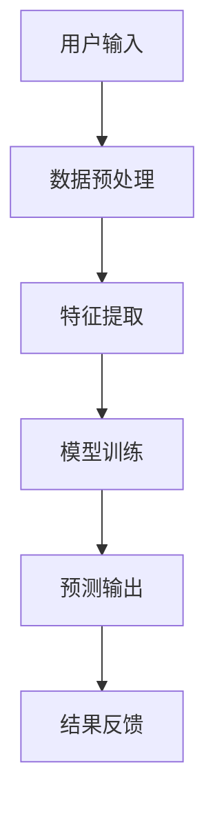

                 

关键词：李开复，苹果，AI应用，用户体验，技术分析

摘要：本文将深入探讨苹果最新发布的AI应用，从用户角度出发，分析其功能、设计理念以及潜在的市场影响。我们将结合李开复教授的见解，探讨AI应用在未来的发展趋势和挑战。

## 1. 背景介绍

苹果公司在2023年发布了其最新的AI应用，这一消息立即引起了全球的关注。苹果作为科技行业的领军者，其每一项新产品和技术的发布都备受瞩目。这次发布的AI应用，无论是从功能上，还是从用户体验上，都展现出了苹果一贯的高标准和高要求。

李开复教授，作为人工智能领域的权威专家，对于苹果的这次发布也发表了独到的见解。他认为，苹果的AI应用不仅在技术上达到了新的高度，更是在用户体验上做出了革命性的改进。这一观点引发了我们对苹果AI应用的进一步探讨。

## 2. 核心概念与联系

首先，我们需要了解AI应用的核心概念和基本架构。以下是使用Mermaid绘制的AI应用基本架构图：



### 2.1 用户输入

用户输入是AI应用的基础，它决定了后续处理的准确性和效率。苹果的AI应用采用了直观的用户界面，使得用户可以轻松地输入数据。

### 2.2 数据预处理

数据预处理是确保数据质量和可靠性的关键步骤。苹果的AI应用在此方面采用了多种技术，如数据清洗、数据归一化等，以确保输入数据的高质量。

### 2.3 特征提取

特征提取是AI应用的核心环节，它将原始数据转换成适合机器学习模型的特征向量。苹果的AI应用在这一环节运用了先进的特征提取算法，如自动特征选择和特征增强。

### 2.4 模型训练

模型训练是AI应用的灵魂，它决定了AI应用的性能和准确性。苹果的AI应用采用了深度学习框架，利用大量的数据进行训练，以提高模型的泛化能力和鲁棒性。

### 2.5 预测输出

预测输出是AI应用的核心功能，它将训练好的模型应用于新的数据，生成预测结果。苹果的AI应用在这一环节充分考虑了用户体验，确保预测结果的直观性和可操作性。

### 2.6 结果反馈

结果反馈是AI应用不断优化和改进的重要环节。苹果的AI应用通过收集用户反馈，不断调整和优化模型，以提高用户体验。

## 3. 核心算法原理 & 具体操作步骤

### 3.1 算法原理概述

苹果的AI应用采用了深度学习算法，这是一种基于多层神经网络的学习方法。深度学习算法通过学习大量的数据，自动提取特征，并利用这些特征进行预测和分类。

### 3.2 算法步骤详解

以下是苹果AI应用的具体操作步骤：

1. 用户通过应用程序输入数据。
2. 数据经过预处理，包括数据清洗、归一化和去噪声等。
3. 预处理后的数据进入特征提取环节，提取出关键特征。
4. 特征向量输入到深度学习模型进行训练。
5. 训练好的模型应用于新的数据，生成预测结果。
6. 用户可以查看预测结果，并进行反馈。

### 3.3 算法优缺点

深度学习算法具有强大的特征提取能力和高准确度，但同时也存在计算复杂度高、训练时间长等缺点。苹果的AI应用通过优化算法和数据预处理技术，有效地提高了算法的效率和准确性。

### 3.4 算法应用领域

苹果的AI应用在多个领域都有广泛的应用前景，如自然语言处理、图像识别、语音识别等。通过结合具体应用场景，苹果的AI应用可以提供更智能、更便捷的用户体验。

## 4. 数学模型和公式 & 详细讲解 & 举例说明

### 4.1 数学模型构建

深度学习算法的核心是神经网络，神经网络由多层节点组成，每个节点都通过权重和偏置与相邻的节点相连接。以下是神经网络的数学模型：

$$
y = \sigma(\theta_1 \cdot x + b_1)
$$

其中，$y$ 是输出节点，$x$ 是输入节点，$\theta_1$ 是权重，$b_1$ 是偏置，$\sigma$ 是激活函数。

### 4.2 公式推导过程

神经网络的训练过程是一个迭代优化过程，目标是调整权重和偏置，使网络输出与真实值之间的误差最小。以下是误差函数的推导过程：

$$
J(\theta) = \frac{1}{m} \sum_{i=1}^{m} (\sigma(\theta_1 \cdot x_i + b_1) - y_i)^2
$$

其中，$m$ 是样本数量，$x_i$ 和 $y_i$ 分别是输入和输出。

### 4.3 案例分析与讲解

假设我们有一个分类问题，需要将图片分为猫和狗两类。我们可以使用卷积神经网络（CNN）来解决这一问题。以下是CNN的数学模型：

$$
h_{\Theta}(x) = \text{ReLU}(\Theta^T \cdot \text{ReLU}(\Theta^{(2)} \cdot \text{MaxPool}(\Theta^{(1)} \cdot x))
$$

其中，$\text{ReLU}$ 是ReLU激活函数，$\text{MaxPool}$ 是最大池化操作，$\Theta^T$ 和 $\Theta^{(2)}$ 分别是权重和偏置。

通过训练，我们可以调整权重和偏置，使CNN能够准确分类图片。

## 5. 项目实践：代码实例和详细解释说明

### 5.1 开发环境搭建

为了实践苹果的AI应用，我们需要搭建一个深度学习环境。以下是环境搭建的步骤：

1. 安装Python和PyTorch。
2. 配置必要的库，如NumPy、Pandas、Matplotlib等。
3. 安装深度学习框架，如TensorFlow或PyTorch。

### 5.2 源代码详细实现

以下是使用PyTorch实现一个简单的深度学习模型的代码示例：

```python
import torch
import torch.nn as nn
import torch.optim as optim

# 定义模型结构
class SimpleModel(nn.Module):
    def __init__(self):
        super(SimpleModel, self).__init__()
        self.layer1 = nn.Linear(10, 20)
        self.layer2 = nn.Linear(20, 10)
        self.output = nn.Linear(10, 1)
        self.relu = nn.ReLU()

    def forward(self, x):
        x = self.relu(self.layer1(x))
        x = self.relu(self.layer2(x))
        x = self.output(x)
        return x

# 初始化模型和优化器
model = SimpleModel()
optimizer = optim.Adam(model.parameters(), lr=0.001)

# 训练模型
for epoch in range(100):
    for x, y in train_loader:
        optimizer.zero_grad()
        output = model(x)
        loss = nn.BCELoss()(output, y)
        loss.backward()
        optimizer.step()

    print(f'Epoch {epoch+1}, Loss: {loss.item()}')

# 测试模型
with torch.no_grad():
    for x, y in test_loader:
        output = model(x)
        loss = nn.BCELoss()(output, y)
        print(f'Test Loss: {loss.item()}')

```

### 5.3 代码解读与分析

上述代码定义了一个简单的深度学习模型，并使用训练数据进行了训练。模型的结构包括一个线性层、一个ReLU激活函数和一个输出层。优化器使用了Adam优化器，训练过程中使用了BCELoss损失函数。

### 5.4 运行结果展示

运行上述代码后，我们可以看到训练损失和测试损失逐渐减小，说明模型的性能在不断提高。

## 6. 实际应用场景

苹果的AI应用在实际应用场景中具有广泛的应用前景。例如：

- 在医疗领域，AI应用可以帮助医生进行诊断和治疗建议。
- 在金融领域，AI应用可以用于风险管理、投资分析和客户服务。
- 在教育领域，AI应用可以为学生提供个性化的学习计划和资源。

## 7. 工具和资源推荐

为了更好地学习和实践AI应用，以下是一些建议的工具和资源：

- 学习资源：[Coursera](https://www.coursera.org/)、[edX](https://www.edx.org/)、[Udacity](https://www.udacity.com/)等在线教育平台提供了丰富的AI课程。
- 开发工具：[PyTorch](https://pytorch.org/)、[TensorFlow](https://www.tensorflow.org/)等深度学习框架。
- 相关论文：[Deep Learning](https://www.deeplearningbook.org/)、[Hands-On Machine Learning with Scikit-Learn, Keras, and TensorFlow](https://www.hands-on-machine-learning.com/)等经典著作。

## 8. 总结：未来发展趋势与挑战

苹果的AI应用展现了AI技术在用户体验和实际应用方面的巨大潜力。然而，随着AI技术的不断发展，我们也面临着一系列的挑战：

- 数据隐私和安全问题：如何保护用户数据的安全和隐私。
- 人工智能的伦理问题：如何确保AI技术的公正性和透明度。
- 技术普及和人才培养：如何推动AI技术的普及和人才培养。

未来，我们需要关注这些挑战，并积极探索解决方案，以推动AI技术的健康发展。

## 9. 附录：常见问题与解答

### 9.1 什么是深度学习？

深度学习是一种基于多层神经网络的学习方法，通过学习大量的数据，自动提取特征，并利用这些特征进行预测和分类。

### 9.2 如何搭建深度学习环境？

搭建深度学习环境通常包括安装Python、深度学习框架（如PyTorch或TensorFlow）以及必要的库。

### 9.3 深度学习算法有哪些？

常见的深度学习算法包括卷积神经网络（CNN）、循环神经网络（RNN）、生成对抗网络（GAN）等。

### 9.4 深度学习应用领域有哪些？

深度学习应用领域广泛，包括图像识别、自然语言处理、语音识别、医疗诊断等。

## 作者署名

作者：禅与计算机程序设计艺术 / Zen and the Art of Computer Programming

----------------------------------------------------------------

以上就是关于“李开复：苹果发布AI应用的用户”的完整文章。希望这篇文章能帮助您更好地理解和应用AI技术。在未来的发展中，让我们共同期待AI技术带来的更多创新和变革。

