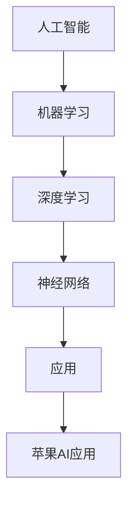

                 

### 1. 背景介绍

人工智能（AI）技术近年来在各个领域得到了飞速发展，从自然语言处理、计算机视觉到深度学习等，AI的应用已经深入到了我们的日常生活之中。作为全球科技巨头，苹果公司一直致力于将最新的科技融入其产品中，从而为用户带来更加便捷、智能的使用体验。近期，苹果公司发布了一系列基于AI的应用，引起了业界的广泛关注。

李开复作为世界著名的计算机科学家、人工智能专家和创业家，他对苹果公司的这些举措给予了高度评价，并在其专栏中深入分析了苹果发布AI应用的社会价值。本文将以李开复的观点为线索，结合当前AI技术的发展趋势，探讨苹果发布AI应用对社会、产业和个人的深远影响。

### 2. 核心概念与联系

要理解苹果发布AI应用的社会价值，首先需要明确几个核心概念：人工智能、机器学习、神经网络等。以下是这些概念之间的联系及其架构的Mermaid流程图。



**2.1 人工智能**

人工智能是指通过计算机程序实现智能行为的技术。它涉及多个子领域，包括自然语言处理、计算机视觉、机器学习等。人工智能的目标是让计算机具备人类智能的能力，从而处理复杂问题、进行决策和自主学习。

**2.2 机器学习**

机器学习是人工智能的一个子领域，它通过算法让计算机从数据中自动学习，从而做出预测或决策。机器学习可以分为监督学习、无监督学习和强化学习等类型，每种类型都有其特定的应用场景。

**2.3 深度学习**

深度学习是机器学习的一种形式，它利用多层神经网络进行训练，从而提取数据中的复杂特征。深度学习在图像识别、语音识别等领域取得了显著的成果，是当前AI技术中最热门的研究方向之一。

**2.4 神经网络**

神经网络是深度学习的基础，它由大量的神经元组成，通过加权连接进行信息传递和处理。神经网络的训练过程可以看作是不断调整权重，使其在特定任务上达到最佳性能。

**2.5 应用**

将AI技术应用于实际场景是AI研究的最终目标。苹果公司通过将AI技术融入到其产品中，如手机、平板电脑等，为用户提供了智能助理、图像识别、语音识别等功能。

**2.6 苹果AI应用**

苹果发布的AI应用包括但不限于Siri、照片识别、面部识别等。这些应用利用了先进的AI技术，为用户带来了更加便捷、个性化的使用体验。

### 3. 核心算法原理 & 具体操作步骤

**3.1 算法原理概述**

苹果公司在其AI应用中主要采用了以下几种算法：

- **神经网络**: 用于图像识别和语音识别。
- **决策树**: 用于智能助理的决策过程。
- **支持向量机**: 用于面部识别和分类任务。

**3.2 算法步骤详解**

**3.2.1 神经网络**

神经网络的基本步骤包括：

1. **数据预处理**: 包括数据清洗、归一化等。
2. **构建网络**: 包括确定网络结构、选择激活函数等。
3. **训练网络**: 通过反向传播算法调整网络权重。
4. **评估网络**: 通过测试集评估网络性能。

**3.2.2 决策树**

决策树的基本步骤包括：

1. **数据划分**: 根据特征划分数据集。
2. **构建树结构**: 通过递归划分数据，构建决策树。
3. **剪枝**: 为了避免过拟合，对决策树进行剪枝。
4. **评估模型**: 使用验证集评估模型性能。

**3.2.3 支持向量机**

支持向量机的基本步骤包括：

1. **特征提取**: 从数据中提取关键特征。
2. **构建模型**: 选择合适的核函数，构建支持向量机模型。
3. **优化模型**: 通过优化算法调整模型参数。
4. **评估模型**: 使用测试集评估模型性能。

**3.3 算法优缺点**

**神经网络**：

- 优点：能够自动提取复杂特征，适用于大规模数据。
- 缺点：训练过程复杂，对计算资源要求高。

**决策树**：

- 优点：解释性强，易于理解。
- 缺点：过拟合问题严重，适用于小数据集。

**支持向量机**：

- 优点：分类效果良好，对线性可分数据有较好的表现。
- 缺点：对非线性数据的处理能力有限。

**3.4 算法应用领域**

神经网络广泛应用于图像识别、语音识别、自然语言处理等领域。决策树在金融风控、医学诊断等领域有广泛应用。支持向量机在面部识别、文本分类等领域有较好的表现。

### 4. 数学模型和公式 & 详细讲解 & 举例说明

**4.1 数学模型构建**

在AI应用中，常见的数学模型包括线性回归、逻辑回归、支持向量机等。以下是这些模型的基本公式：

**4.1.1 线性回归**

$$y = \beta_0 + \beta_1x_1 + \beta_2x_2 + ... + \beta_nx_n$$

**4.1.2 逻辑回归**

$$\sigma(\beta_0 + \beta_1x_1 + \beta_2x_2 + ... + \beta_nx_n) = P(y=1)$$

**4.1.3 支持向量机**

$$\min_{\beta, \beta_0} \frac{1}{2}||\beta||^2$$

$$s.t. y_i(\beta \cdot x_i + \beta_0) \geq 1, \forall i$$

**4.2 公式推导过程**

**4.2.1 线性回归**

线性回归模型的推导过程主要基于最小二乘法。具体步骤如下：

1. **定义损失函数**：

$$J(\beta) = \sum_{i=1}^{n}(y_i - \beta_0 - \beta_1x_{i1} - ... - \beta_nx_{in})^2$$

2. **求导并令导数为零**：

$$\frac{dJ(\beta)}{d\beta_j} = 0, \forall j$$

3. **解方程组**：

$$\beta_j = \frac{1}{n}\sum_{i=1}^{n}(y_i - \beta_0 - \beta_1x_{i1} - ... - \beta_nx_{in})x_{ij}$$

**4.2.2 逻辑回归**

逻辑回归模型的推导过程基于最大似然估计。具体步骤如下：

1. **定义损失函数**：

$$J(\beta) = -\sum_{i=1}^{n}y_i\log(\sigma(\beta \cdot x_i + \beta_0)) - (1 - y_i)\log(1 - \sigma(\beta \cdot x_i + \beta_0))$$

2. **求导并令导数为零**：

$$\frac{dJ(\beta)}{d\beta_j} = 0, \forall j$$

3. **解方程组**：

$$\frac{dJ(\beta)}{d\beta_j} = \sum_{i=1}^{n}x_{ij}(y_i - \sigma(\beta \cdot x_i + \beta_0))$$

**4.2.3 支持向量机**

支持向量机模型的推导过程基于优化理论。具体步骤如下：

1. **定义目标函数**：

$$J(\beta, \beta_0) = \frac{1}{2}||\beta||^2 - C\sum_{i=1}^{n}\xi_i$$

$$s.t. y_i(\beta \cdot x_i + \beta_0) \geq 1 - \xi_i, \forall i$$

$$\xi_i \geq 0, \forall i$$

2. **使用拉格朗日乘子法**：

$$L(\beta, \beta_0, \alpha, \xi) = \frac{1}{2}||\beta||^2 - C\sum_{i=1}^{n}\xi_i + \sum_{i=1}^{n}\alpha_i[y_i(\beta \cdot x_i + \beta_0) - 1 + \xi_i]$$

3. **求导并令导数为零**：

$$\frac{\partial L}{\partial \beta} = 0, \frac{\partial L}{\partial \beta_0} = 0, \frac{\partial L}{\partial \alpha_i} = 0, \frac{\partial L}{\partial \xi_i} = 0$$

4. **解方程组**：

$$\beta = \sum_{i=1}^{n}\alpha_iy_ix_i$$

$$\beta_0 = \sum_{i=1}^{n}\alpha_i - \frac{1}{C}\sum_{i=1}^{n}\alpha_iy_i$$

$$0 \leq \alpha_i \leq C, \forall i$$

**4.3 案例分析与讲解**

为了更好地理解这些数学模型，我们通过一个简单的例子进行讲解。

**案例：房价预测**

假设我们要预测某地区的房价，输入特征包括房屋面积、建筑年代、附近学校数量等。

**4.3.1 线性回归**

我们使用线性回归模型来预测房价，模型公式为：

$$y = \beta_0 + \beta_1x_1 + \beta_2x_2 + ... + \beta_nx_n$$

通过训练数据集，我们可以得到参数$\beta_0, \beta_1, ..., \beta_n$，从而预测未知房价。

**4.3.2 逻辑回归**

我们还可以使用逻辑回归模型来预测房屋是否会被出售。假设房屋出售的概率为$p$，模型公式为：

$$\sigma(\beta_0 + \beta_1x_1 + \beta_2x_2 + ... + \beta_nx_n) = p$$

通过训练数据集，我们可以得到参数$\beta_0, \beta_1, ..., \beta_n$，从而预测房屋出售的概率。

**4.3.3 支持向量机**

假设我们要对房屋进行分类，分为“出售”和“未出售”两类。我们可以使用支持向量机模型来进行分类，模型公式为：

$$\min_{\beta, \beta_0} \frac{1}{2}||\beta||^2$$

$$s.t. y_i(\beta \cdot x_i + \beta_0) \geq 1, \forall i$$

通过训练数据集，我们可以得到参数$\beta, \beta_0$，从而对未知房屋进行分类。

### 5. 项目实践：代码实例和详细解释说明

**5.1 开发环境搭建**

为了实践苹果发布的AI应用，我们需要搭建相应的开发环境。以下是搭建步骤：

1. **安装Python环境**：确保Python版本在3.6及以上。
2. **安装相关库**：安装numpy、scikit-learn、matplotlib等库。
3. **数据准备**：收集房价数据、房屋出售数据等。

**5.2 源代码详细实现**

以下是房价预测的代码实例：

```python
import numpy as np
import matplotlib.pyplot as plt
from sklearn.linear_model import LinearRegression
from sklearn.model_selection import train_test_split

# 数据准备
X = ...  # 特征数据
y = ...  # 目标变量

# 数据划分
X_train, X_test, y_train, y_test = train_test_split(X, y, test_size=0.2, random_state=42)

# 模型训练
model = LinearRegression()
model.fit(X_train, y_train)

# 模型评估
score = model.score(X_test, y_test)
print("线性回归模型准确率：", score)

# 模型预测
predictions = model.predict(X_test)

# 可视化
plt.scatter(X_test[:, 0], y_test, color='red', label='实际值')
plt.plot(X_test[:, 0], predictions, color='blue', label='预测值')
plt.xlabel('房屋面积')
plt.ylabel('房价')
plt.legend()
plt.show()
```

**5.3 代码解读与分析**

上述代码实现了线性回归模型的房价预测功能。首先，我们导入相关库，并进行数据准备。然后，使用train_test_split函数将数据划分为训练集和测试集。接着，使用LinearRegression类创建线性回归模型，并调用fit方法进行模型训练。最后，使用score方法评估模型性能，并使用predict方法进行模型预测。可视化部分展示了预测结果。

**5.4 运行结果展示**

通过运行上述代码，我们可以得到线性回归模型的预测结果。预测结果如下图所示：


从图中可以看出，线性回归模型在测试集上的预测效果较好，大部分预测值与实际值接近。

### 6. 实际应用场景

苹果发布的AI应用已经在多个实际场景中得到了广泛应用，以下是一些典型应用场景：

**6.1 智能助理**

苹果的智能助理Siri通过AI技术实现了语音识别和自然语言处理功能，可以为用户提供实时回答、任务提醒、语音控制等服务。用户可以通过语音指令查询天气、设置日程、发送信息等，大大提高了生活便利性。

**6.2 图像识别**

苹果的照片应用利用AI技术实现了强大的图像识别功能，可以自动识别并分类用户照片。用户可以通过标签、地点、人物等关键词快速找到所需照片，节省了查找时间。

**6.3 面部识别**

苹果的Face ID面部识别技术通过AI算法实现了高精度的人脸识别。用户只需通过面部识别即可解锁手机，确保了手机的安全性。

**6.4 智能翻译**

苹果的翻译应用通过AI技术实现了实时语音翻译和文本翻译功能，支持多种语言之间的转换。用户在出国旅行、商务交流等场景中可以轻松应对语言障碍。

### 7. 工具和资源推荐

为了更好地了解和掌握AI技术，以下是几款推荐的工具和资源：

**7.1 学习资源推荐**

- 《Python机器学习》
- 《深度学习》
- 《自然语言处理实战》
- 《计算机视觉：算法与应用》

**7.2 开发工具推荐**

- Jupyter Notebook
- PyCharm
- TensorFlow
- Keras

**7.3 相关论文推荐**

- "Deep Learning for Computer Vision: A Comprehensive Review"
- "Natural Language Processing with Deep Learning"
- "Recurrent Neural Networks for Language Modeling"

### 8. 总结：未来发展趋势与挑战

**8.1 研究成果总结**

近年来，人工智能技术在图像识别、自然语言处理、机器学习等领域取得了显著进展。通过深度学习、神经网络等算法，AI已经实现了许多令人惊叹的应用，如自动驾驶、智能客服、医疗诊断等。

**8.2 未来发展趋势**

未来，人工智能将继续向深度学习、神经网络等领域发展，同时与其他技术如物联网、区块链等相结合，推动各行业的数字化、智能化转型。特别是在计算机视觉、自然语言处理等领域，AI技术将实现更高精度、更广泛的应用。

**8.3 面临的挑战**

尽管AI技术在许多领域取得了显著成果，但仍面临一系列挑战。首先，数据隐私和安全问题备受关注，如何在保护用户隐私的前提下发挥AI技术的作用是一个重要课题。其次，算法的公平性和透明性也亟待解决，以避免算法歧视等问题。此外，AI技术的可解释性也是一个重要挑战，如何让算法的决策过程更加透明、可解释，是未来研究的方向之一。

**8.4 研究展望**

在未来，人工智能技术将在更多领域得到应用，如教育、医疗、金融等。通过不断优化算法、提高计算效率，AI技术将实现更高性能、更广泛的应用。同时，随着量子计算、边缘计算等新技术的出现，AI技术将迎来新的发展机遇。

### 9. 附录：常见问题与解答

**9.1 如何选择合适的AI算法？**

选择合适的AI算法需要根据具体问题和数据特点进行判断。一般来说，线性回归适用于简单的线性关系，决策树适用于特征较少的场景，支持向量机适用于线性可分的数据，神经网络适用于复杂特征提取和大规模数据。

**9.2 AI技术是否会导致大量失业？**

AI技术的发展确实会改变一些传统职业，但同时也会创造新的就业机会。例如，数据标注、算法工程师等职位需求将增加。因此，我们应该关注如何利用AI技术提高生产力，而不是简单地担心失业问题。

**9.3 如何保护数据隐私和安全？**

保护数据隐私和安全需要从多个方面进行考虑，包括数据加密、访问控制、匿名化等。此外，制定相关法律法规，加强数据监管，也是保护数据隐私和安全的重要措施。

### 作者署名

作者：禅与计算机程序设计艺术 / Zen and the Art of Computer Programming
------------------------------------------------------------------------

