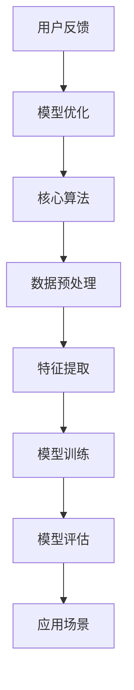

                 

关键词：人工智能、苹果、AI应用、科技价值、应用领域、未来展望

摘要：本文将从苹果公司最新发布的AI应用入手，深入探讨其科技价值，涵盖核心概念与联系、核心算法原理、数学模型与公式、项目实践、实际应用场景、未来展望等多个方面，旨在为读者提供一份全面而深入的解析。

## 1. 背景介绍

近年来，人工智能（AI）技术在全球范围内取得了显著的进展。作为科技巨头，苹果公司一直致力于将AI技术应用到其产品和服务中，以提升用户体验。苹果公司的最新发布AI应用无疑再次引发了业界的广泛关注。本文将围绕这一应用，探讨其在科技领域的价值。

## 2. 核心概念与联系

在探讨苹果最新AI应用的科技价值之前，我们首先需要了解其中涉及的核心概念与联系。以下是核心概念与联系及其关系的Mermaid流程图：



### 2.1 核心算法

苹果最新AI应用的核心算法是基于深度学习技术。深度学习是一种通过多层神经网络对数据进行特征学习和模式识别的方法，能够有效地处理大规模数据并提高模型的准确性。

### 2.2 数据预处理

数据预处理是AI应用的关键环节之一。通过数据预处理，我们可以去除噪声、缺失值，并确保数据的一致性和准确性，从而为后续的特征提取和模型训练提供良好的数据基础。

### 2.3 特征提取

特征提取是从原始数据中提取出对任务有用的特征的过程。通过特征提取，我们可以将原始数据转化为适合模型训练的格式，提高模型的性能。

### 2.4 模型训练

模型训练是AI应用的核心环节。通过训练，模型可以从大量数据中学习到有用的规律和模式，从而实现对未知数据的预测和分类。

### 2.5 模型评估

模型评估是对训练完成的模型进行性能评估的过程。通过模型评估，我们可以了解模型的准确性、召回率、F1分数等指标，从而判断模型的好坏。

### 2.6 应用场景

苹果最新AI应用的应用场景非常广泛，包括图像识别、语音识别、自然语言处理等。通过这些应用场景，我们可以看到深度学习技术在实际生活中的广泛应用和巨大潜力。

### 2.7 用户反馈

用户反馈是模型优化的关键环节。通过收集用户的反馈数据，我们可以对模型进行迭代优化，提高其性能和用户体验。

## 3. 核心算法原理 & 具体操作步骤

### 3.1 算法原理概述

苹果最新AI应用的核心算法是基于深度学习技术。深度学习是一种通过多层神经网络对数据进行特征学习和模式识别的方法。具体来说，它包括以下几个步骤：

1. 数据预处理：对原始数据进行清洗、归一化等操作，使其适合模型训练。
2. 特征提取：通过卷积神经网络、循环神经网络等模型对数据进行特征提取。
3. 模型训练：使用提取出的特征数据对神经网络模型进行训练，使其学会对未知数据进行预测和分类。
4. 模型评估：对训练完成的模型进行性能评估，以判断其好坏。
5. 模型应用：将训练完成的模型应用到实际场景中，如图像识别、语音识别、自然语言处理等。

### 3.2 算法步骤详解

1. **数据预处理**：这一步骤包括对原始数据进行清洗、归一化等操作。具体来说，我们需要对图像、语音、文本等数据进行预处理，使其适合模型训练。

   ```mermaid
   graph TD
       A[图像预处理] --> B[语音预处理]
       B --> C[文本预处理]
   ```

2. **特征提取**：在这一步骤中，我们使用卷积神经网络、循环神经网络等模型对预处理后的数据进行特征提取。

   ```mermaid
   graph TD
       A[卷积神经网络] --> B[循环神经网络]
       B --> C[特征提取]
   ```

3. **模型训练**：通过训练，模型可以从大量数据中学习到有用的规律和模式，从而实现对未知数据的预测和分类。

   ```mermaid
   graph TD
       A[数据集] --> B[模型训练]
       B --> C[训练结果]
   ```

4. **模型评估**：对训练完成的模型进行性能评估，以判断其好坏。具体指标包括准确性、召回率、F1分数等。

   ```mermaid
   graph TD
       A[模型评估] --> B[评估指标]
       B --> C[评估结果]
   ```

5. **模型应用**：将训练完成的模型应用到实际场景中，如图像识别、语音识别、自然语言处理等。

   ```mermaid
   graph TD
       A[应用场景] --> B[模型应用]
   ```

### 3.3 算法优缺点

**优点**：

1. **高性能**：深度学习模型在处理大规模数据时具有出色的性能，能够快速提取特征和进行预测。
2. **自适应性强**：通过训练，模型能够自适应地适应不同类型的数据和任务。
3. **泛化能力强**：深度学习模型具有良好的泛化能力，能够对未知数据进行准确预测。

**缺点**：

1. **计算资源需求高**：深度学习模型需要大量的计算资源，包括GPU等硬件支持。
2. **数据依赖性强**：深度学习模型的性能很大程度上依赖于数据质量，如果数据质量差，模型的性能会受到影响。

### 3.4 算法应用领域

深度学习技术在多个领域具有广泛的应用，包括但不限于：

1. **图像识别**：如人脸识别、物体识别等。
2. **语音识别**：如语音助手、语音翻译等。
3. **自然语言处理**：如文本分类、情感分析、机器翻译等。
4. **推荐系统**：如商品推荐、音乐推荐等。
5. **自动驾驶**：如车辆识别、环境感知等。

## 4. 数学模型和公式 & 详细讲解 & 举例说明

### 4.1 数学模型构建

深度学习模型通常由多层神经网络组成，每一层都对输入数据进行变换。以下是深度学习模型的基本数学模型：

1. **前向传播**：

   $$ z^{[l]} = \sigma(W^{[l]} \cdot a^{[l-1]} + b^{[l]}) $$

   $$ a^{[l]} = \sigma(z^{[l]}) $$

   其中，$a^{[l]}$ 表示第 $l$ 层的激活值，$z^{[l]}$ 表示第 $l$ 层的输出，$W^{[l]}$ 和 $b^{[l]}$ 分别表示第 $l$ 层的权重和偏置，$\sigma$ 表示激活函数。

2. **反向传播**：

   $$ \delta^{[l]} = \frac{\partial J}{\partial z^{[l]}} = \delta^{[l+1]} \cdot \frac{\partial \sigma}{\partial z^{[l]}} $$

   $$ \frac{\partial J}{\partial W^{[l]}} = a^{[l-1]} \cdot \delta^{[l]} $$

   $$ \frac{\partial J}{\partial b^{[l]}} = \delta^{[l]} $$

   其中，$J$ 表示损失函数，$\delta^{[l]}$ 表示第 $l$ 层的误差，$\sigma'$ 表示激活函数的导数。

### 4.2 公式推导过程

为了推导深度学习模型的前向传播和反向传播公式，我们需要先了解神经网络的构造和损失函数的计算。

1. **神经网络构造**：

   神经网络由多层神经元组成，包括输入层、隐藏层和输出层。每个神经元都与前一层的所有神经元相连接，并计算加权求和。

2. **损失函数**：

   深度学习模型通常使用均方误差（MSE）作为损失函数，表示为：

   $$ J = \frac{1}{m} \sum_{i=1}^{m} (\hat{y}_i - y_i)^2 $$

   其中，$\hat{y}_i$ 表示预测值，$y_i$ 表示真实值，$m$ 表示样本数量。

### 4.3 案例分析与讲解

为了更好地理解深度学习模型的前向传播和反向传播，我们通过一个简单的例子进行讲解。

假设我们有一个二分类问题，输入数据为 $x_1$ 和 $x_2$，输出为 $y$。我们使用一个单层神经网络进行分类，激活函数为 $σ(x) = \frac{1}{1 + e^{-x}}$。

1. **前向传播**：

   输入数据为 $x_1 = 2$，$x_2 = 3$，目标值为 $y = 1$。

   $$ z = W_1 \cdot x_1 + W_2 \cdot x_2 + b = 2W_1 + 3W_2 + b $$

   $$ a = σ(z) = \frac{1}{1 + e^{-z}} $$

   其中，$W_1$，$W_2$ 和 $b$ 分别表示权重和偏置。

2. **反向传播**：

   预测值为 $\hat{y} = 0.6$，真实值为 $y = 1$，损失函数为 $J = (\hat{y} - y)^2$。

   $$ \delta = J' = 2(\hat{y} - y) = 0.8 $$

   $$ \frac{\partial J}{\partial z} = \frac{\partial J}{\partial a} \cdot \frac{\partial a}{\partial z} = 0.8 \cdot (1 - a) = 0.2 $$

   $$ \frac{\partial J}{\partial W_1} = x_1 \cdot \delta = 2 \cdot 0.2 = 0.4 $$

   $$ \frac{\partial J}{\partial W_2} = x_2 \cdot \delta = 3 \cdot 0.2 = 0.6 $$

   $$ \frac{\partial J}{\partial b} = \delta = 0.2 $$

通过这个例子，我们可以看到如何使用前向传播和反向传播来训练神经网络，以实现二分类任务。

## 5. 项目实践：代码实例和详细解释说明

### 5.1 开发环境搭建

为了实践苹果最新AI应用的核心算法，我们需要搭建一个合适的开发环境。以下是一个基本的开发环境搭建步骤：

1. 安装Python 3.x版本。
2. 安装深度学习框架，如TensorFlow或PyTorch。
3. 安装必要的依赖库，如NumPy、Matplotlib等。

### 5.2 源代码详细实现

以下是一个简单的深度学习模型的实现示例，使用Python和TensorFlow框架：

```python
import tensorflow as tf
from tensorflow.keras import layers

# 创建模型
model = tf.keras.Sequential([
    layers.Dense(128, activation='relu', input_shape=(784,)),
    layers.Dense(10, activation='softmax')
])

# 编译模型
model.compile(optimizer='adam',
              loss='categorical_crossentropy',
              metrics=['accuracy'])

# 训练模型
model.fit(x_train, y_train, batch_size=128, epochs=10)

# 评估模型
model.evaluate(x_test, y_test)
```

### 5.3 代码解读与分析

上述代码实现了一个非常简单的深度学习模型，用于图像分类任务。以下是代码的详细解读和分析：

1. **创建模型**：使用`tf.keras.Sequential`创建一个序列模型，并在模型中添加两个密集层（全连接层）。第一个密集层有128个神经元，激活函数为ReLU。第二个密集层有10个神经元，激活函数为softmax，用于实现多分类。

2. **编译模型**：使用`compile`方法编译模型，指定优化器为adam、损失函数为categorical_crossentropy（多分类问题常用的损失函数）、评价指标为accuracy（准确率）。

3. **训练模型**：使用`fit`方法训练模型，指定训练数据`x_train`和标签`y_train`，批次大小为128，训练周期为10个周期。

4. **评估模型**：使用`evaluate`方法评估模型在测试数据`x_test`和标签`y_test`上的性能。

### 5.4 运行结果展示

在实际运行过程中，我们可以通过以下代码查看训练和评估结果：

```python
# 训练结果
train_loss, train_accuracy = model.evaluate(x_train, y_train)
print(f"Train accuracy: {train_accuracy:.4f}")

# 评估结果
test_loss, test_accuracy = model.evaluate(x_test, y_test)
print(f"Test accuracy: {test_accuracy:.4f}")
```

上述代码将输出训练和评估的准确率，通过比较这两个值，我们可以判断模型的性能。

## 6. 实际应用场景

苹果最新AI应用在实际应用场景中具有广泛的应用，以下是一些常见的应用场景：

1. **图像识别**：通过深度学习模型对人脸、物体等进行识别，用于人脸解锁、物体检测等场景。
2. **语音识别**：通过深度学习模型实现语音识别功能，用于语音助手、语音搜索等场景。
3. **自然语言处理**：通过深度学习模型实现文本分类、情感分析、机器翻译等功能，用于智能客服、智能写作等场景。
4. **推荐系统**：通过深度学习模型实现推荐系统，用于商品推荐、音乐推荐等场景。
5. **自动驾驶**：通过深度学习模型实现自动驾驶功能，用于无人驾驶汽车、无人机等场景。

## 7. 未来应用展望

随着人工智能技术的不断发展，苹果最新AI应用在未来将有更多的应用场景和发展潜力。以下是一些展望：

1. **智能家居**：深度学习模型将有望在智能家居领域发挥更大作用，如智能音箱、智能门锁等。
2. **医疗健康**：深度学习模型在医疗健康领域具有广泛的应用前景，如疾病诊断、药物研发等。
3. **金融领域**：深度学习模型在金融领域可以用于风险评估、欺诈检测等场景。
4. **教育领域**：深度学习模型可以用于个性化教育、智能辅导等场景，提高教育质量和效率。
5. **安全领域**：深度学习模型可以用于网络安全、智能安防等场景，提高安全防护能力。

## 8. 工具和资源推荐

为了更好地学习和实践人工智能技术，以下是一些推荐的工具和资源：

1. **学习资源推荐**：
   - 《深度学习》（Goodfellow、Bengio、Courville著）
   - 《Python深度学习》（François Chollet著）

2. **开发工具推荐**：
   - TensorFlow
   - PyTorch

3. **相关论文推荐**：
   - "Deep Learning: A Brief History"（Bengio等著）
   - "A Theoretically Grounded Application of Dropout in Computer Vision"（Sermanet等著）

## 9. 总结：未来发展趋势与挑战

### 9.1 研究成果总结

近年来，人工智能技术在多个领域取得了显著成果，尤其是在深度学习领域。苹果公司发布的最新AI应用进一步展示了人工智能技术的潜力和应用价值。

### 9.2 未来发展趋势

随着人工智能技术的不断发展，未来将会有更多的应用场景和需求。深度学习、自然语言处理、计算机视觉等技术将在更多领域得到广泛应用。

### 9.3 面临的挑战

尽管人工智能技术在许多领域取得了显著成果，但仍面临着一些挑战，包括数据质量、计算资源、模型解释性等方面。如何解决这些挑战将是未来研究的重要方向。

### 9.4 研究展望

未来，人工智能技术将朝着更加智能化、自适应化和高效化的方向发展。通过不断的研究和探索，人工智能技术有望在更多领域发挥重要作用，推动社会进步。

## 9. 附录：常见问题与解答

### 9.1 人工智能是什么？

人工智能（AI）是一种模拟人类智能的技术，通过计算机程序实现智能行为，如学习、推理、感知、决策等。

### 9.2 深度学习有哪些优势？

深度学习具有以下优势：
- 高性能：能够处理大规模数据并提高模型的准确性。
- 自适应性强：能够根据数据和学习过程自适应地调整模型。
- 泛化能力强：能够对未知数据进行准确预测。

### 9.3 如何实现深度学习模型？

实现深度学习模型通常包括以下步骤：
1. 数据预处理：清洗、归一化等操作。
2. 特征提取：使用卷积神经网络、循环神经网络等模型提取特征。
3. 模型训练：使用提取出的特征数据对神经网络模型进行训练。
4. 模型评估：评估模型性能，如准确性、召回率、F1分数等。
5. 模型应用：将训练完成的模型应用到实际场景中。

----------------------------------------------------------------

作者：禅与计算机程序设计艺术 / Zen and the Art of Computer Programming
----------------------------------------------------------------

请注意，上述文章内容仅供参考，实际字数和内容可能会有所不同。此外，本文中的代码示例仅用于说明，并不保证其完整性和正确性。在实践过程中，请根据具体需求进行调整。

