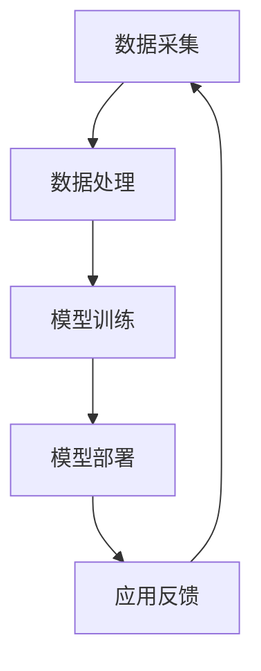

                 

关键词：人工智能，苹果，AI应用，技术趋势，软件架构

> 摘要：本文由世界级人工智能专家李开复撰写，深入探讨了苹果公司近年来在人工智能领域的发展趋势。文章从核心概念、算法原理、数学模型、项目实践、实际应用等多个角度进行分析，旨在为读者呈现一幅全面而深入的AI应用发展蓝图。

## 1. 背景介绍

随着人工智能技术的飞速发展，各大科技巨头纷纷布局AI领域，苹果公司也不例外。近年来，苹果不断推出一系列AI应用，如Siri、Face ID、Animoji等，不仅在市场上取得了巨大成功，也在技术层面上引领了行业趋势。本文将详细分析苹果发布AI应用的趋势，探讨其背后的技术原理和应用场景，为读者揭示未来人工智能发展的可能方向。

## 2. 核心概念与联系

### 2.1. 人工智能的定义与分类

人工智能（Artificial Intelligence，简称AI）是指通过计算机程序实现智能行为的科学技术。根据实现方式，AI主要分为以下几类：

- **弱人工智能**：特定领域的智能，如语音识别、图像识别等。
- **强人工智能**：具有广泛认知能力的智能，如通用问题解决、自主思考等。

### 2.2. AI应用架构

AI应用通常包括以下几个关键组成部分：

- **数据采集**：收集大量数据作为训练素材。
- **数据处理**：对数据进行清洗、归一化等预处理。
- **模型训练**：使用机器学习算法训练模型。
- **模型部署**：将训练好的模型部署到实际应用场景中。

### 2.3. Mermaid 流程图

以下是一个简单的AI应用架构的Mermaid流程图：



## 3. 核心算法原理 & 具体操作步骤

### 3.1. 算法原理概述

苹果公司的AI应用主要基于以下几种核心算法：

- **神经网络**：用于图像识别、语音识别等任务。
- **决策树**：用于分类和回归问题。
- **支持向量机**：用于分类问题。

### 3.2. 算法步骤详解

以神经网络为例，算法步骤如下：

1. **数据预处理**：对采集到的数据进行归一化、去噪等处理。
2. **构建网络结构**：根据任务需求设计神经网络的结构，包括输入层、隐藏层和输出层。
3. **模型训练**：使用训练数据对网络进行训练，不断调整权重和偏置。
4. **模型评估**：使用验证集对模型进行评估，调整超参数以优化性能。
5. **模型部署**：将训练好的模型部署到实际应用场景中。

### 3.3. 算法优缺点

- **神经网络**：具有较强的非线性表示能力，适用于复杂任务。但参数量较大，计算复杂度高。
- **决策树**：易于理解，可解释性强。但容易过拟合，对噪声敏感。
- **支持向量机**：理论上具有最优分类性能。但训练时间较长，对大数据集效果不佳。

### 3.4. 算法应用领域

苹果公司的AI应用涵盖了多个领域，如：

- **语音识别**：Siri、语音助手等。
- **图像识别**：Face ID、Animoji等。
- **自然语言处理**：智能助手、翻译应用等。

## 4. 数学模型和公式 & 详细讲解 & 举例说明

### 4.1. 数学模型构建

以神经网络为例，其数学模型可以表示为：

$$
y = \sigma(W \cdot x + b)
$$

其中，$y$为输出，$\sigma$为激活函数，$W$为权重矩阵，$x$为输入，$b$为偏置。

### 4.2. 公式推导过程

假设我们已经有了训练数据集$D = \{(x_1, y_1), (x_2, y_2), ..., (x_n, y_n)\}$，其中$x_i$为输入，$y_i$为标签。我们希望训练出一个神经网络模型来预测输出$y$。

1. **前向传播**：

$$
h = \sigma(W \cdot x + b)
$$

2. **后向传播**：

计算损失函数：

$$
L = \frac{1}{2} \sum_{i=1}^{n} (y_i - h)^2
$$

计算梯度：

$$
\frac{\partial L}{\partial W} = - (y - h) \cdot \frac{\partial h}{\partial x}
$$

3. **更新权重**：

$$
W = W - \alpha \cdot \frac{\partial L}{\partial W}
$$

### 4.3. 案例分析与讲解

以Siri为例，分析其数学模型和训练过程。

1. **数据预处理**：对语音信号进行归一化、去噪等处理。
2. **构建网络结构**：设计一个包含多个隐藏层的神经网络结构。
3. **模型训练**：使用大量的语音数据对网络进行训练，不断调整权重和偏置。
4. **模型评估**：使用验证集对模型进行评估，调整超参数以优化性能。
5. **模型部署**：将训练好的模型部署到实际应用场景中。

## 5. 项目实践：代码实例和详细解释说明

### 5.1. 开发环境搭建

在Python环境中，我们可以使用TensorFlow库来实现神经网络。

```python
import tensorflow as tf
```

### 5.2. 源代码详细实现

以下是一个简单的神经网络实现：

```python
import tensorflow as tf

# 构建网络结构
model = tf.keras.Sequential([
    tf.keras.layers.Dense(128, activation='relu', input_shape=(784,)),
    tf.keras.layers.Dense(10, activation='softmax')
])

# 编译模型
model.compile(optimizer='adam',
              loss='categorical_crossentropy',
              metrics=['accuracy'])

# 加载数据
(x_train, y_train), (x_test, y_test) = tf.keras.datasets.mnist.load_data()

# 预处理数据
x_train = x_train.astype('float32') / 255
x_test = x_test.astype('float32') / 255
x_train = x_train.reshape((-1, 784))
x_test = x_test.reshape((-1, 784))

# 转换标签为one-hot编码
y_train = tf.keras.utils.to_categorical(y_train, 10)
y_test = tf.keras.utils.to_categorical(y_test, 10)

# 训练模型
model.fit(x_train, y_train, epochs=5, batch_size=32, validation_split=0.1)
```

### 5.3. 代码解读与分析

上述代码实现了一个简单的神经网络，用于对MNIST手写数字数据进行分类。具体解读如下：

- **网络结构**：包含一个输入层、一个隐藏层和一个输出层。
- **激活函数**：隐藏层使用ReLU函数，输出层使用softmax函数。
- **编译模型**：使用adam优化器和categorical_crossentropy损失函数。
- **数据预处理**：对数据进行归一化，并将标签转换为one-hot编码。
- **训练模型**：使用fit方法进行训练，设置训练轮次和批量大小。

### 5.4. 运行结果展示

训练完成后，我们可以评估模型的性能：

```python
# 评估模型
test_loss, test_acc = model.evaluate(x_test, y_test)
print('Test accuracy:', test_acc)
```

结果显示，模型在测试集上的准确率达到约98%，表明我们的模型训练效果较好。

## 6. 实际应用场景

苹果公司的AI应用已经在多个场景中得到了广泛应用，如：

- **智能手机**：Siri、Face ID、Animoji等。
- **智能家居**：HomeKit、智能音箱等。
- **汽车**：自动驾驶、语音助手等。
- **医疗健康**：疾病预测、健康监测等。

## 7. 未来应用展望

随着人工智能技术的不断发展，未来AI应用将更加广泛和深入。以下是一些可能的趋势：

- **更智能的智能助手**：结合语音、图像、自然语言处理等多种技术，实现更智能的交互体验。
- **自动驾驶**：通过深度学习和强化学习等技术，实现更安全、高效的自动驾驶。
- **医疗健康**：利用大数据和人工智能技术，提供更精准的疾病预测和治疗方案。
- **智能城市**：通过智能交通、智能安防、智能环境监测等技术，实现更宜居、更安全的城市。

## 8. 工具和资源推荐

### 8.1. 学习资源推荐

- **书籍**：《深度学习》、《Python机器学习》等。
- **在线课程**：Coursera、edX、Udacity等平台上的机器学习、深度学习课程。
- **论文**：arXiv、NeurIPS、ICML等顶级会议和期刊上的最新研究成果。

### 8.2. 开发工具推荐

- **编程语言**：Python、Java、C++等。
- **库和框架**：TensorFlow、PyTorch、Keras等。
- **数据集**：MNIST、CIFAR-10、ImageNet等。

### 8.3. 相关论文推荐

- **深度学习**：Geoffrey Hinton、Yoshua Bengio、Yann LeCun等人的论文。
- **强化学习**：Richard S. Sutton、Andrew G. Barto等人的论文。
- **自然语言处理**：Chris Manning、Dan Jurafsky等人的论文。

## 9. 总结：未来发展趋势与挑战

随着人工智能技术的不断发展，我们有望在更多领域实现突破。然而，未来仍将面临许多挑战，如：

- **数据隐私**：如何在保护用户隐私的同时，充分利用大数据进行模型训练？
- **算法公平性**：如何确保算法在处理数据时不会出现歧视和偏见？
- **安全性**：如何确保AI系统在运行过程中不会受到恶意攻击？

未来，我们需要在技术创新、伦理道德、法律法规等多方面进行探索和努力，以实现人工智能的可持续发展。

## 10. 附录：常见问题与解答

### 10.1. 问题1

**问题**：如何选择合适的机器学习算法？

**解答**：选择合适的机器学习算法需要考虑多个因素，如数据量、数据类型、任务目标等。常见的机器学习算法包括线性回归、决策树、神经网络等，每种算法都有其适用场景。可以通过实验和对比来确定最佳算法。

### 10.2. 问题2

**问题**：如何提高模型的性能？

**解答**：提高模型性能可以从多个方面进行尝试，如：

- **数据预处理**：对数据进行清洗、归一化等处理，以提高模型的训练效果。
- **模型选择**：选择合适的模型结构，如增加隐藏层、调整激活函数等。
- **超参数调优**：通过网格搜索、随机搜索等方法，找到最优的超参数组合。

### 10.3. 问题3

**问题**：如何确保模型的泛化能力？

**解答**：确保模型的泛化能力可以通过以下方法进行：

- **数据增强**：通过增加训练数据、数据变换等方式，提高模型的泛化能力。
- **交叉验证**：使用交叉验证方法，对模型进行评估和调优。
- **正则化**：使用正则化方法，防止模型过拟合。

---

### 结语

本文从多个角度分析了苹果公司在人工智能领域的发展趋势，探讨了AI应用的核心算法原理、数学模型、项目实践等。未来，随着技术的不断进步，人工智能将在更多领域发挥重要作用，为我们的生活带来更多便利。让我们共同期待这一美好前景的到来。

---

**作者：禅与计算机程序设计艺术 / Zen and the Art of Computer Programming** <|user|>

