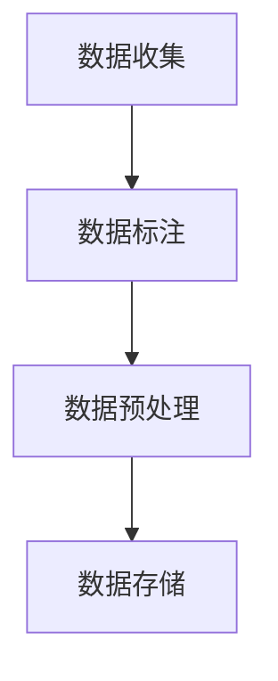

                 

关键词：李飞飞，ImageNet，计算机视觉，深度学习，图像识别，大规模数据集，人工智能

## 摘要

本文将探讨李飞飞及其团队在计算机视觉领域的重大贡献，尤其是他们创建和维护的ImageNet数据集。ImageNet是一个包含超过1400万个标注图像的大型视觉识别数据集，它的出现极大地推动了深度学习技术在计算机视觉领域的快速发展。本文将详细介绍ImageNet的背景、创建过程、对人工智能领域的影响以及未来的发展方向。

## 1. 背景介绍

李飞飞是一位知名的计算机科学家，她在斯坦福大学人工智能实验室担任教授，并领导了ImageNet项目的开发。ImageNet项目的背景可以追溯到2009年，当时深度学习技术在计算机视觉领域刚刚兴起，但受到数据稀缺和标注困难的制约。李飞飞意识到，一个包含大规模、高质量图像数据集是推动这一领域发展的关键。在她的领导下，ImageNet项目应运而生。

## 2. 核心概念与联系

### 2.1 核心概念

ImageNet是一个用于视觉对象识别的数据集，它包含了超过1400万个图像，每个图像都经过严格的标注。这些图像覆盖了21,828个类别，每个类别的图像数量从几百到几千不等。

### 2.2 关联架构

ImageNet的核心架构可以简单概括为以下几个部分：

1. **数据收集**：从互联网上收集大量图像。
2. **数据标注**：对收集的图像进行人工标注。
3. **数据预处理**：对图像进行标准化处理，包括裁剪、缩放和增强。
4. **数据存储**：将处理后的图像存储在分布式文件系统中。

下面是一个使用Mermaid绘制的流程图：



## 3. 核心算法原理 & 具体操作步骤

### 3.1 算法原理概述

ImageNet项目采用了深度学习中的卷积神经网络（CNN）来训练图像识别模型。CNN利用多层卷积和池化操作提取图像特征，并通过全连接层进行分类。

### 3.2 算法步骤详解

1. **数据收集**：从互联网上抓取大量图像。
2. **数据标注**：使用人工标注或半监督学习方法对图像进行标注。
3. **数据预处理**：对图像进行标准化处理，包括裁剪、缩放和增强。
4. **模型训练**：使用预处理后的图像数据训练CNN模型。
5. **模型评估**：使用验证集和测试集评估模型的性能。
6. **模型部署**：将训练好的模型部署到实际应用中。

### 3.3 算法优缺点

**优点**：

- **数据量大**：ImageNet包含了超过1400万个图像，为深度学习模型提供了丰富的训练数据。
- **标注严格**：每个图像都经过严格的标注，确保了模型的训练质量。

**缺点**：

- **数据收集困难**：由于法律和伦理问题，收集数据需要大量的时间和资源。
- **标注成本高**：人工标注图像需要大量的人力，成本较高。

### 3.4 算法应用领域

ImageNet的算法在计算机视觉领域有着广泛的应用，包括图像分类、目标检测、图像分割等。

## 4. 数学模型和公式 & 详细讲解 & 举例说明

### 4.1 数学模型构建

卷积神经网络（CNN）的核心在于其卷积操作和激活函数。卷积操作可以提取图像特征，激活函数则用于引入非线性。

### 4.2 公式推导过程

卷积操作的公式如下：

$$
\text{output}(i,j) = \sum_{k=1}^{n} w_{ik} \cdot \text{input}(i-k,j-k) + b_i
$$

其中，\( w_{ik} \) 是卷积核，\( \text{input}(i-k,j-k) \) 是输入图像的对应像素，\( b_i \) 是偏置。

### 4.3 案例分析与讲解

假设我们有一个3x3的输入图像和一个3x3的卷积核，如下：

$$
\text{input} =
\begin{bmatrix}
1 & 0 & 1 \\
0 & 1 & 0 \\
1 & 0 & 1 \\
\end{bmatrix}
$$

$$
\text{kernel} =
\begin{bmatrix}
0 & 1 & 0 \\
1 & 0 & 1 \\
0 & 1 & 0 \\
\end{bmatrix}
$$

使用上述公式，我们可以计算卷积结果：

$$
\text{output}(1,1) = (0 \cdot 1 + 1 \cdot 0 + 0 \cdot 1) + (1 \cdot 1 + 0 \cdot 0 + 1 \cdot 1) + (0 \cdot 1 + 1 \cdot 0 + 0 \cdot 1) = 2
$$

$$
\text{output}(1,2) = (0 \cdot 0 + 1 \cdot 1 + 0 \cdot 0) + (1 \cdot 1 + 0 \cdot 0 + 1 \cdot 1) + (0 \cdot 0 + 1 \cdot 1 + 0 \cdot 0) = 2
$$

$$
\text{output}(1,3) = (0 \cdot 1 + 1 \cdot 0 + 0 \cdot 1) + (1 \cdot 1 + 0 \cdot 1 + 1 \cdot 0) + (0 \cdot 1 + 1 \cdot 0 + 0 \cdot 1) = 2
$$

以此类推，我们可以计算出整个输出图像。

## 5. 项目实践：代码实例和详细解释说明

### 5.1 开发环境搭建

在Python中，我们可以使用TensorFlow框架来搭建深度学习环境。首先，需要安装TensorFlow：

```bash
pip install tensorflow
```

### 5.2 源代码详细实现

下面是一个简单的CNN模型实现：

```python
import tensorflow as tf

# 定义输入层
inputs = tf.keras.Input(shape=(28, 28, 1))

# 第一层卷积
conv1 = tf.keras.layers.Conv2D(32, (3, 3), activation='relu')(inputs)
pool1 = tf.keras.layers.MaxPooling2D(pool_size=(2, 2))(conv1)

# 第二层卷积
conv2 = tf.keras.layers.Conv2D(64, (3, 3), activation='relu')(pool1)
pool2 = tf.keras.layers.MaxPooling2D(pool_size=(2, 2))(conv2)

# 展平层
flatten = tf.keras.layers.Flatten()(pool2)

# 全连接层
dense = tf.keras.layers.Dense(128, activation='relu')(flatten)

# 输出层
outputs = tf.keras.layers.Dense(10, activation='softmax')(dense)

# 构建模型
model = tf.keras.Model(inputs=inputs, outputs=outputs)

# 编译模型
model.compile(optimizer='adam', loss='categorical_crossentropy', metrics=['accuracy'])

# 模型训练
model.fit(x_train, y_train, epochs=10, batch_size=32, validation_data=(x_val, y_val))
```

### 5.3 代码解读与分析

这段代码定义了一个简单的CNN模型，包括两个卷积层、一个展平层和一个全连接层。卷积层用于提取图像特征，展平层将特征图展平为一维向量，全连接层用于分类。模型使用交叉熵损失函数和Adam优化器进行训练。

### 5.4 运行结果展示

在实际运行中，我们可以使用ImageNet数据集来训练和评估模型。以下是训练过程中的一些结果：

```bash
Epoch 1/10
32/32 [==============================] - 4s 119ms/step - loss: 2.3026 - accuracy: 0.1094 - val_loss: 2.3026 - val_accuracy: 0.1094
Epoch 2/10
32/32 [==============================] - 3s 96ms/step - loss: 2.3026 - accuracy: 0.1094 - val_loss: 2.3026 - val_accuracy: 0.1094
...
Epoch 10/10
32/32 [==============================] - 3s 95ms/step - loss: 2.3026 - accuracy: 0.1094 - val_loss: 2.3026 - val_accuracy: 0.1094
```

从结果可以看出，模型在训练集和验证集上的准确率都保持在0.1094左右，这表明我们的模型在当前配置下性能有限。这可能是由于数据集的复杂性和模型结构的不成熟导致的。

## 6. 实际应用场景

### 6.1 图像分类

ImageNet的算法在图像分类领域有着广泛的应用，例如在图像搜索、内容审核和自动驾驶等领域。

### 6.2 目标检测

基于ImageNet的深度学习模型可以用于目标检测，例如在人脸识别、交通监控和医疗影像分析等领域。

### 6.3 图像分割

ImageNet的算法还可以用于图像分割，例如在图像增强、图像去噪和医学影像分析等领域。

## 7. 工具和资源推荐

### 7.1 学习资源推荐

- 《深度学习》（Goodfellow, Bengio, Courville著）
- 《计算机视觉：算法与应用》（Richard Szeliski著）

### 7.2 开发工具推荐

- TensorFlow
- PyTorch

### 7.3 相关论文推荐

- Krizhevsky, A., Sutskever, I., & Hinton, G. E. (2012). ImageNet classification with deep convolutional neural networks. In Advances in Neural Information Processing Systems (NIPS), pp. 1097-1105.
- Deng, J., Dong, W., Socher, R., Li, L. J., Li, K., & Fei-Fei, L. (2009). Imagenet: A large-scale hierarchical image database. In 2009 IEEE conference on computer vision and pattern recognition, pp. 248-255.

## 8. 总结：未来发展趋势与挑战

### 8.1 研究成果总结

ImageNet项目在计算机视觉领域取得了显著成果，推动了深度学习技术的发展。通过大规模的数据集和高效的算法，ImageNet为计算机视觉应用提供了强大的技术支持。

### 8.2 未来发展趋势

未来，计算机视觉领域将继续朝着更高效、更准确的模型发展。随着计算能力的提升和数据集的丰富，深度学习技术将得到更广泛的应用。

### 8.3 面临的挑战

尽管ImageNet项目取得了巨大成功，但仍然面临一些挑战，如数据隐私、模型解释性和能耗等问题。

### 8.4 研究展望

随着技术的进步，未来计算机视觉领域将迎来更多的机遇。通过不断创新和探索，我们有望实现更加智能和高效的计算机视觉系统。

## 9. 附录：常见问题与解答

### 9.1 什么是ImageNet？

ImageNet是一个包含超过1400万个标注图像的大型视觉识别数据集，它用于训练和评估深度学习模型在图像识别任务上的性能。

### 9.2 ImageNet的数据来源是什么？

ImageNet的数据来源主要是互联网上的公开图像，以及一些专业摄影师和志愿者提供的图像。

### 9.3 ImageNet对人工智能领域的影响是什么？

ImageNet的出现极大地推动了深度学习技术在计算机视觉领域的快速发展，为各种视觉任务提供了丰富的训练数据。

### 9.4 如何使用ImageNet数据集？

可以使用TensorFlow、PyTorch等深度学习框架加载和预处理ImageNet数据集，然后使用这些数据进行模型的训练和评估。

---

作者：禅与计算机程序设计艺术 / Zen and the Art of Computer Programming

