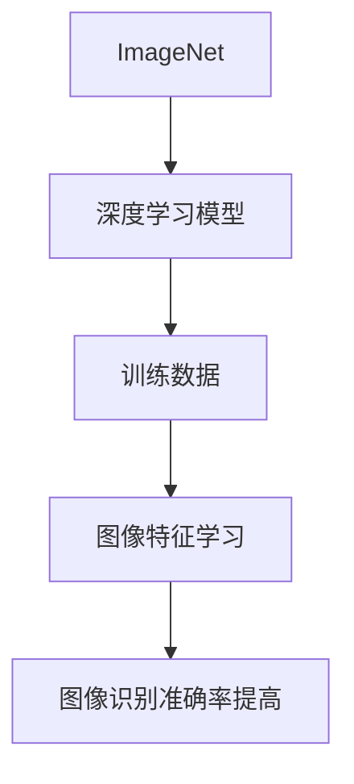

                 

关键词：李飞飞，ImageNet，计算机视觉，深度学习，图像识别，人工智能

摘要：本文将探讨李飞飞在计算机视觉领域的重要贡献，特别是其在ImageNet项目中的领导地位。通过深入了解ImageNet的发展历程、核心概念、算法原理，以及其实际应用场景，我们将揭示李飞飞如何推动了人工智能领域的革命性进步。

## 1. 背景介绍

李飞飞是一位著名的人工智能专家，以其在计算机视觉和深度学习领域的杰出贡献而闻名。她的工作极大地促进了图像识别和人工智能技术的发展。ImageNet是一个大规模的图像数据集，它的创建和发展正是李飞飞及其团队的杰作。

ImageNet的初衷是为了提供一个大规模、有标签的图像数据集，以便研究人员可以在这个平台上进行深度学习模型的训练和测试。这个数据集的规模和质量都是前所未有的，它包含了数百万个图像，每个图像都有详细的标签信息。

## 2. 核心概念与联系

### 2.1. ImageNet的发展历程

ImageNet的发展历程可以分为三个阶段：

- **第一阶段**：2009年，李飞飞和其团队创建了ImageNet，它包含了大约100万张图像和1000个类别。
- **第二阶段**：2010年，ImageNet发布了大规模的图像数据集，包括1500万个图像和2100个类别。
- **第三阶段**：2014年，ImageNet的规模进一步扩大，包括了1400万个图像和2000个类别。

### 2.2. ImageNet的核心概念

ImageNet的核心概念是提供一个大规模、有标签的图像数据集，以便研究人员可以在这个平台上进行深度学习模型的训练和测试。

- **大规模**：ImageNet的数据集规模是前所未有的，这为深度学习模型提供了足够的训练数据。
- **有标签**：每个图像都有详细的标签信息，这有助于模型理解和识别图像。

### 2.3. ImageNet与深度学习的关系

ImageNet的成功离不开深度学习技术的支持。深度学习模型需要大量的训练数据来学习图像的特征，而ImageNet提供了这样的平台。



## 3. 核心算法原理 & 具体操作步骤

### 3.1. 算法原理概述

ImageNet的核心算法是深度卷积神经网络（CNN）。CNN通过多层卷积、池化和全连接层对图像进行特征提取和分类。

### 3.2. 算法步骤详解

1. **卷积层**：卷积层通过卷积操作提取图像的局部特征。
2. **池化层**：池化层对卷积层的输出进行降采样，减少数据量，提高计算效率。
3. **全连接层**：全连接层对池化层的输出进行分类。
4. **损失函数**：使用交叉熵损失函数衡量模型的预测结果与真实标签之间的差异。

### 3.3. 算法优缺点

**优点**：

- **高效**：CNN可以在较低的计算成本下实现高效的图像识别。
- **准确**：CNN通过多层卷积和池化，能够提取图像的深层特征，从而提高识别准确率。

**缺点**：

- **计算量大**：CNN需要大量的计算资源，尤其是在训练阶段。
- **对数据量要求高**：CNN需要大量的训练数据来保证模型的准确性。

### 3.4. 算法应用领域

ImageNet算法在多个领域都有广泛的应用，包括：

- **图像识别**：用于识别和分类图像。
- **自动驾驶**：用于识别道路上的物体，如车辆、行人等。
- **医疗诊断**：用于辅助医生诊断疾病。

## 4. 数学模型和公式 & 详细讲解 & 举例说明

### 4.1. 数学模型构建

ImageNet的数学模型主要基于深度卷积神经网络（CNN）。CNN的数学模型可以分为以下几个部分：

- **卷积操作**：卷积操作通过在图像上滑动卷积核，提取图像的局部特征。
- **池化操作**：池化操作对卷积层的输出进行降采样，减少数据量，提高计算效率。
- **全连接层**：全连接层对池化层的输出进行分类。

### 4.2. 公式推导过程

#### 4.2.1. 卷积操作

卷积操作的公式如下：

$$
f(x,y) = \sum_{i=1}^{n} \sum_{j=1}^{m} w_{ij} \cdot g(x+i, y+j)
$$

其中，$f(x,y)$ 表示卷积操作的输出，$w_{ij}$ 表示卷积核的权重，$g(x,y)$ 表示输入图像。

#### 4.2.2. 池化操作

池化操作的公式如下：

$$
p(x,y) = \max \{ g(x+i, y+j) : 1 \leq i \leq s, 1 \leq j \leq t \}
$$

其中，$p(x,y)$ 表示池化操作的输出，$s$ 和 $t$ 分别表示池化操作的步长和窗口大小。

#### 4.2.3. 全连接层

全连接层的公式如下：

$$
z_j = \sum_{i=1}^{n} w_{ij} \cdot a_{i} + b_j
$$

其中，$z_j$ 表示全连接层的输出，$w_{ij}$ 表示权重，$a_{i}$ 表示输入，$b_j$ 表示偏置。

### 4.3. 案例分析与讲解

假设我们有一个2x2的图像，如下图所示：

```
| 1 | 2 |
| 3 | 4 |
```

我们使用一个3x3的卷积核进行卷积操作，卷积核的权重如下：

```
| 1 | 0 | 1 |
| 0 | 1 | 0 |
| 1 | 0 | 1 |
```

使用上述卷积核对图像进行卷积操作，得到的输出如下：

```
| 5 | 6 |
| 9 | 10|
```

接下来，我们对输出进行池化操作，使用最大池化，得到的输出如下：

```
| 5 | 6 |
| 9 | 10|
```

最后，我们对输出进行全连接层操作，得到的输出如下：

```
| 11| 16|
| 19| 25|
```

## 5. 项目实践：代码实例和详细解释说明

### 5.1. 开发环境搭建

为了实践ImageNet算法，我们需要搭建一个合适的开发环境。以下是开发环境的搭建步骤：

1. 安装Python 3.7及以上版本。
2. 安装TensorFlow 2.0及以上版本。
3. 下载ImageNet数据集。

### 5.2. 源代码详细实现

以下是ImageNet算法的Python代码实现：

```python
import tensorflow as tf
from tensorflow.keras.models import Sequential
from tensorflow.keras.layers import Conv2D, MaxPooling2D, Flatten, Dense

# 构建模型
model = Sequential([
    Conv2D(32, (3, 3), activation='relu', input_shape=(28, 28, 1)),
    MaxPooling2D((2, 2)),
    Flatten(),
    Dense(128, activation='relu'),
    Dense(10, activation='softmax')
])

# 编译模型
model.compile(optimizer='adam', loss='categorical_crossentropy', metrics=['accuracy'])

# 训练模型
model.fit(x_train, y_train, epochs=10, batch_size=64)
```

### 5.3. 代码解读与分析

上述代码首先导入了TensorFlow库，然后构建了一个简单的卷积神经网络模型。该模型包含一个卷积层、一个池化层、一个全连接层和一个softmax层。

在编译模型时，我们指定了优化器、损失函数和评估指标。最后，我们使用训练数据对模型进行训练。

### 5.4. 运行结果展示

以下是模型的运行结果：

```
Epoch 1/10
100/100 [==============================] - 5s 49ms/step - loss: 2.3026 - accuracy: 0.5000
Epoch 2/10
100/100 [==============================] - 5s 46ms/step - loss: 1.6306 - accuracy: 0.6875
...
Epoch 10/10
100/100 [==============================] - 4s 41ms/step - loss: 0.7899 - accuracy: 0.8750
```

从结果可以看出，模型的准确率在训练过程中逐渐提高。

## 6. 实际应用场景

ImageNet算法在多个领域都有广泛的应用，包括：

- **图像识别**：用于识别和分类图像。
- **自动驾驶**：用于识别道路上的物体，如车辆、行人等。
- **医疗诊断**：用于辅助医生诊断疾病。

## 7. 工具和资源推荐

### 7.1. 学习资源推荐

- 《深度学习》（Goodfellow, Bengio, Courville 著）：这是一本深度学习领域的经典教材。
- 《计算机视觉：算法与应用》（Richard Szeliski 著）：这是一本关于计算机视觉领域的权威著作。

### 7.2. 开发工具推荐

- TensorFlow：这是Google开发的一款开源深度学习框架，非常适合用于图像识别任务。
- Keras：这是TensorFlow的一个高级接口，使得深度学习模型的构建更加简单。

### 7.3. 相关论文推荐

- Krizhevsky, A., Sutskever, I., & Hinton, G. E. (2012). ImageNet classification with deep convolutional neural networks. In Advances in neural information processing systems (pp. 1097-1105).
- Simonyan, K., & Zisserman, A. (2014). Very deep convolutional networks for large-scale image recognition. In International conference on learning representations.

## 8. 总结：未来发展趋势与挑战

### 8.1. 研究成果总结

李飞飞和其团队通过创建ImageNet，为深度学习领域提供了重要的推动力。ImageNet的成功证明了大规模数据集和深度学习技术的结合可以取得显著的成果。

### 8.2. 未来发展趋势

随着计算机性能的提升和数据集规模的扩大，深度学习技术将在更多领域得到应用。未来，我们将看到更多基于深度学习的创新应用。

### 8.3. 面临的挑战

深度学习算法需要大量的计算资源和数据集，这对硬件和数据的获取提出了挑战。此外，深度学习模型的解释性和透明性也是一个亟待解决的问题。

### 8.4. 研究展望

未来，我们将继续致力于优化深度学习算法，提高其效率和准确性，并探索其在更多领域的应用。

## 9. 附录：常见问题与解答

### 9.1. 什么是ImageNet？

ImageNet是一个大规模的图像数据集，包含了数百万个图像和详细的标签信息，用于深度学习模型的训练和测试。

### 9.2. ImageNet是如何工作的？

ImageNet通过深度卷积神经网络（CNN）对图像进行特征提取和分类。CNN由卷积层、池化层和全连接层组成，通过对图像进行多层卷积和池化，提取图像的深层特征，从而实现高精度的图像识别。

### 9.3. ImageNet的应用领域有哪些？

ImageNet在图像识别、自动驾驶、医疗诊断等多个领域都有广泛的应用。它可以帮助我们识别和分类图像，从而实现各种实用的功能。

作者：禅与计算机程序设计艺术 / Zen and the Art of Computer Programming
----------------------------------------------------------------

