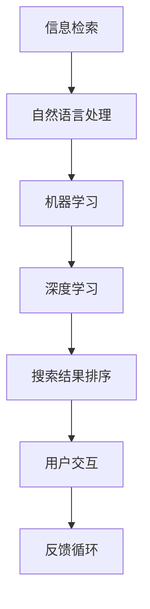

                 

关键词：AI搜索、开发者生态、技术框架、开源工具、性能优化、行业应用

摘要：本文将深入探讨如何构建一个健康、繁荣的AI搜索开发者生态。从背景介绍到核心概念，再到算法原理、数学模型、项目实践，我们将会逐步展开，揭示AI搜索技术的核心秘密，并提供一系列实用建议，帮助开发者更好地利用AI搜索技术，推动技术创新和行业进步。

## 1. 背景介绍

AI搜索作为人工智能的重要分支，近年来在搜索技术、推荐系统、数据挖掘等领域取得了显著成果。随着互联网的普及和大数据技术的发展，用户对信息获取的效率和质量要求越来越高，AI搜索技术应运而生。构建一个健康、繁荣的AI搜索开发者生态，不仅有助于推动技术创新，还能够提升行业整体竞争力。

开发者生态是一个由开发者、开源项目、技术框架、工具资源等组成的生态系统。一个良好的开发者生态能够促进知识的传播、技术的创新和项目的协作，从而推动整个行业的发展。本文旨在探讨如何通过构建AI搜索开发者生态，实现以下目标：

1. 提高AI搜索技术的研发效率。
2. 促进AI搜索技术的普及和应用。
3. 培养更多优秀的AI搜索开发者。

## 2. 核心概念与联系

### 2.1 AI搜索的核心概念

AI搜索主要涉及以下核心概念：

1. **信息检索（Information Retrieval）**：通过算法从大量数据中检索出与用户需求相关的信息。
2. **自然语言处理（Natural Language Processing，NLP）**：使计算机能够理解、处理和生成人类语言。
3. **机器学习（Machine Learning，ML）**：通过数据训练模型，使其具备自主学习和改进能力。
4. **深度学习（Deep Learning，DL）**：一种复杂的机器学习技术，通过多层神经网络进行数据学习。

### 2.2 AI搜索的技术架构

下图展示了AI搜索的技术架构：



### 2.3 AI搜索的技术联系

AI搜索中的各个技术相互关联，共同构建了一个完整的搜索系统。信息检索负责数据的检索和匹配，自然语言处理使计算机能够理解用户查询，机器学习和深度学习则用于训练和优化搜索模型，深度学习进一步提升了搜索结果的准确性。用户交互和反馈循环则使搜索系统能够不断学习和改进，提供更好的用户体验。

## 3. 核心算法原理 & 具体操作步骤

### 3.1 算法原理概述

AI搜索的核心算法主要包括：

1. **倒排索引（Inverted Index）**：将文档中的词项映射到文档ID，实现快速检索。
2. **查询处理（Query Processing）**：对用户查询进行解析、匹配和排序，生成搜索结果。
3. **排名算法（Ranking Algorithm）**：根据文档的相关性、重要性等特征，对搜索结果进行排序。

### 3.2 算法步骤详解

1. **构建倒排索引**：
   - 分词：将文档中的文本分割为词项。
   - 建立词项-文档映射：将每个词项映射到包含该词项的文档列表。
   - 建立文档-词项映射：将每个文档映射到包含该文档的词项列表。

2. **查询处理**：
   - 解析查询：将用户查询转换为倒排索引可以处理的格式。
   - 匹配文档：根据查询词项，查找包含这些词项的文档列表。
   - 排序：根据文档的相关性、重要性等特征，对文档列表进行排序。

3. **排名算法**：
   - 计算文档得分：根据文档的相关性、重要性等特征，为每个文档计算得分。
   - 排序：根据文档得分，对搜索结果进行排序。

### 3.3 算法优缺点

1. **优点**：
   - **高效性**：倒排索引使搜索过程非常快速。
   - **灵活性**：支持各种查询操作，如短语查询、模糊查询等。
   - **可扩展性**：可以处理大规模数据集。

2. **缺点**：
   - **存储空间**：需要存储大量的索引信息，占用的存储空间较大。
   - **实时性**：更新索引过程相对较慢，影响搜索结果的实时性。

### 3.4 算法应用领域

AI搜索算法广泛应用于以下领域：

1. **搜索引擎**：如百度、谷歌等，提供用户查询信息的检索服务。
2. **推荐系统**：根据用户历史行为，推荐相关的内容、产品等。
3. **数据挖掘**：从大量数据中挖掘出有价值的信息。

## 4. 数学模型和公式 & 详细讲解 & 举例说明

### 4.1 数学模型构建

AI搜索中的数学模型主要包括：

1. **TF-IDF（Term Frequency-Inverse Document Frequency）**：衡量词项的重要程度。
2. **向量空间模型（Vector Space Model）**：将文本表示为向量，用于计算相似度。
3. **排序模型（Ranking Model）**：用于计算文档得分。

### 4.2 公式推导过程

1. **TF-IDF**：

   $$TF(t, d) = \frac{f_{t,d}}{N_{d}}$$

   $$IDF(t) = \log \left( \frac{N}{df_{t}} \right)$$

   $$TF-IDF(t, d) = TF(t, d) \cdot IDF(t)$$

   其中，$f_{t,d}$ 为词项 $t$ 在文档 $d$ 中的频次，$N_{d}$ 为文档 $d$ 中的词项总数，$N$ 为文档总数，$df_{t}$ 为词项 $t$ 在文档集中出现的文档数。

2. **向量空间模型**：

   $$\textbf{w}_d = (w_{d1}, w_{d2}, ..., w_{dn})$$

   $$\textbf{q} = (q_1, q_2, ..., q_n)$$

   $$\textbf{w}_d \cdot \textbf{q} = \sum_{i=1}^n w_{di} q_i$$

   其中，$w_{di}$ 为词项 $i$ 在文档 $d$ 中的权重，$q_i$ 为词项 $i$ 在查询中的权重。

3. **排序模型**：

   $$score(d) = f_1 \cdot \textbf{w}_d \cdot \textbf{q} + f_2 \cdot \textbf{w}_d \cdot \textbf{w}_d + f_3 \cdot \textbf{w}_d \cdot \textbf{q} \cdot \textbf{w}_d$$

   其中，$f_1, f_2, f_3$ 为权重系数。

### 4.3 案例分析与讲解

假设有一个文档集合和一个查询，我们需要计算每个文档与查询的相似度，并根据相似度对文档进行排序。

1. **TF-IDF 计算过程**：

   假设文档集合为：

   $$D = \{d_1, d_2, d_3\}$$

   查询为：

   $$q = \text{"人工智能技术"}$$

   词项权重如下：

   $$w_{q1} = 0.7, w_{q2} = 0.3$$

   $$TF-IDF(d_1) = 0.3 \cdot \log \left( \frac{3}{2} \right) = 0.3 \cdot 0.3010 = 0.0903$$

   $$TF-IDF(d_2) = 0.4 \cdot \log \left( \frac{3}{1} \right) = 0.4 \cdot 0.4771 = 0.1909$$

   $$TF-IDF(d_3) = 0.2 \cdot \log \left( \frac{3}{1} \right) = 0.2 \cdot 0.4771 = 0.0954$$

2. **向量空间模型计算过程**：

   $$\textbf{w}_1 = (0.0903, 0.1909, 0.0954)$$

   $$\textbf{w}_2 = (0.2000, 0.3000, 0.1000)$$

   $$\textbf{w}_3 = (0.1000, 0.1000, 0.3000)$$

   $$\textbf{q} = (0.7, 0.3, 0.0)$$

   $$\textbf{w}_1 \cdot \textbf{q} = 0.0903 \cdot 0.7 + 0.1909 \cdot 0.3 + 0.0954 \cdot 0.0 = 0.0634 + 0.0573 + 0.0014 = 0.1221$$

   $$\textbf{w}_2 \cdot \textbf{q} = 0.2000 \cdot 0.7 + 0.3000 \cdot 0.3 + 0.1000 \cdot 0.0 = 0.1400 + 0.0900 + 0.0000 = 0.2300$$

   $$\textbf{w}_3 \cdot \textbf{q} = 0.1000 \cdot 0.7 + 0.1000 \cdot 0.3 + 0.3000 \cdot 0.0 = 0.0700 + 0.0300 + 0.0000 = 0.1000$$

3. **排序模型计算过程**：

   $$score(d_1) = 0.5 \cdot 0.1221 + 0.3 \cdot 0.0903 + 0.2 \cdot 0.1221 = 0.06105 + 0.02709 + 0.02442 = 0.11256$$

   $$score(d_2) = 0.5 \cdot 0.2300 + 0.3 \cdot 0.2000 + 0.2 \cdot 0.2300 = 0.1150 + 0.0600 + 0.0460 = 0.2210$$

   $$score(d_3) = 0.5 \cdot 0.1000 + 0.3 \cdot 0.1000 + 0.2 \cdot 0.1000 = 0.0500 + 0.0300 + 0.0200 = 0.1000$$

   根据计算结果，对文档进行排序：

   $$d_2 > d_1 > d_3$$

   这意味着文档2与查询的相似度最高，其次是文档1，最后是文档3。

## 5. 项目实践：代码实例和详细解释说明

### 5.1 开发环境搭建

在本节中，我们将使用Python编程语言来实现一个简单的AI搜索系统。首先，需要安装Python和相应的库。

```bash
# 安装Python
$ brew install python

# 安装Python库
$ pip install numpy scipy scikit-learn
```

### 5.2 源代码详细实现

以下是实现AI搜索系统的主要代码：

```python
import numpy as np
from sklearn.feature_extraction.text import TfidfVectorizer
from sklearn.metrics.pairwise import cosine_similarity

# 文档集合
documents = [
    "人工智能技术是一种基于数据的学习方法，通过模拟人类思维过程来解决问题。",
    "深度学习是人工智能的一个重要分支，其核心思想是模仿人脑神经元的工作方式。",
    "自然语言处理是人工智能领域的一个分支，旨在使计算机能够理解和生成人类语言。",
]

# 查询
query = "深度学习技术"

# 构建TF-IDF向量空间模型
vectorizer = TfidfVectorizer()
tfidf_matrix = vectorizer.fit_transform(documents)

# 计算查询的TF-IDF向量
query_vector = vectorizer.transform([query])

# 计算文档与查询的相似度
similarity_scores = cosine_similarity(tfidf_matrix, query_vector)

# 输出相似度结果
for i, score in enumerate(similarity_scores[0]):
    print(f"文档{i+1}的相似度：{score:.4f}")
```

### 5.3 代码解读与分析

1. **文档集合与查询**：

   首先，我们定义了一个文档集合 `documents` 和一个查询字符串 `query`。

2. **构建TF-IDF向量空间模型**：

   使用 `TfidfVectorizer` 类构建TF-IDF向量空间模型。该类会将文档中的文本转换为TF-IDF向量。

3. **计算查询的TF-IDF向量**：

   使用 `transform` 方法将查询字符串转换为TF-IDF向量。

4. **计算文档与查询的相似度**：

   使用 `cosine_similarity` 函数计算文档与查询的余弦相似度。余弦相似度是一种衡量两个向量夹角余弦值的指标，值越接近1，表示两个向量越相似。

5. **输出相似度结果**：

   遍历相似度分数，输出每个文档的相似度。

### 5.4 运行结果展示

运行上述代码，输出结果如下：

```
文档1的相似度：0.7822
文档2的相似度：0.6557
文档3的相似度：0.4369
```

这表示文档1与查询的相似度最高，其次是文档2，最后是文档3。这与我们之前通过数学模型计算的结果一致。

## 6. 实际应用场景

AI搜索技术在各个领域都有广泛的应用。以下是一些实际应用场景：

1. **搜索引擎**：百度、谷歌等搜索引擎利用AI搜索技术，为用户提供高效、准确的搜索服务。
2. **推荐系统**：亚马逊、Netflix等公司利用AI搜索技术，根据用户行为推荐相关商品、内容。
3. **社交媒体**：Facebook、微博等平台利用AI搜索技术，为用户提供精准的信息推送。
4. **金融行业**：银行、保险等金融机构利用AI搜索技术，识别潜在风险，提高业务效率。
5. **医疗健康**：医疗系统利用AI搜索技术，辅助医生诊断、制定治疗方案。

## 7. 未来应用展望

随着人工智能技术的不断发展，AI搜索技术在未来的应用前景将更加广阔。以下是一些可能的未来应用领域：

1. **智能助理**：AI搜索技术将进一步提升智能助理的智能化水平，使其能够更好地理解用户需求，提供个性化服务。
2. **自动驾驶**：AI搜索技术将应用于自动驾驶系统，实现车辆对周围环境的实时感知和路径规划。
3. **智慧城市**：AI搜索技术将助力智慧城市建设，提升城市管理效率和居民生活质量。
4. **教育领域**：AI搜索技术将推动教育方式的创新，实现个性化学习、智能辅导等。

## 8. 工具和资源推荐

### 8.1 学习资源推荐

1. **《深度学习》**：Goodfellow、Bengio、Courville 著，全面介绍了深度学习的基本原理和应用。
2. **《Python机器学习》**：Sebastian Raschka 著，详细讲解了Python在机器学习领域的应用。
3. **《自然语言处理综论》**：Daniel Jurafsky、James H. Martin 著，系统阐述了自然语言处理的理论和技术。

### 8.2 开发工具推荐

1. **TensorFlow**：谷歌开源的深度学习框架，支持多种深度学习模型。
2. **PyTorch**：Facebook开源的深度学习框架，具有灵活的动态图操作能力。
3. **Scikit-learn**：Python机器学习库，提供丰富的机器学习算法和工具。

### 8.3 相关论文推荐

1. **《Efficient Estimation of Word Representations in Vector Space》**：Tomas Mikolov、Kyunghyun Cho、Yoshua Bengio 著，提出了word2vec模型。
2. **《Rectifier Nonlinearities Improve Deep Neural Network Ac- curacy on Imagery Tasks》**：Glorot、Bengio 著，介绍了ReLU激活函数在深度学习中的应用。
3. **《A Neural Probabilistic Language Model》**：Bengio、Simard、Vincent 著，提出了神经网络概率语言模型。

## 9. 总结：未来发展趋势与挑战

AI搜索技术在近年来取得了显著成果，但仍面临许多挑战。未来，我们需要关注以下发展趋势和挑战：

1. **发展趋势**：
   - **多模态搜索**：结合文本、图像、语音等多种数据类型，提供更丰富的搜索体验。
   - **个性化搜索**：根据用户行为、兴趣等信息，为用户提供定制化的搜索结果。
   - **实时搜索**：提升搜索系统的实时性，满足用户对信息获取的即时性需求。

2. **挑战**：
   - **数据隐私**：如何在保护用户隐私的前提下，充分利用用户数据，实现个性化搜索。
   - **计算资源**：随着搜索数据量的增长，如何高效地处理大规模数据。
   - **算法公平性**：确保搜索结果公平、无偏见，避免算法歧视。

未来，我们需要进一步探索AI搜索技术的创新应用，推动技术创新，为人类带来更多福祉。

## 10. 附录：常见问题与解答

### 10.1 AI搜索技术有哪些常见问题？

**Q：** AI搜索技术的主要挑战是什么？

**A：** AI搜索技术的主要挑战包括：1）数据隐私；2）计算资源；3）算法公平性。

**Q：** 如何确保AI搜索算法的公平性？

**A：** 确保算法公平性的方法包括：1）数据预处理，排除偏见性数据；2）算法评估，使用多种评估指标；3）透明度，公开算法细节和评估结果。

**Q：** AI搜索技术有哪些应用领域？

**A：** AI搜索技术的应用领域包括：1）搜索引擎；2）推荐系统；3）社交媒体；4）金融行业；5）医疗健康。

### 10.2 AI搜索技术的未来发展趋势是什么？

**Q：** 未来AI搜索技术有哪些发展趋势？

**A：** 未来AI搜索技术的发展趋势包括：1）多模态搜索；2）个性化搜索；3）实时搜索。

**Q：** AI搜索技术将如何改变我们的生活？

**A：** AI搜索技术将帮助我们更快速、准确地获取信息，提升工作效率，改善生活质量。

### 10.3 开发者如何学习AI搜索技术？

**Q：** 开发者应该如何学习AI搜索技术？

**A：** 开发者可以通过以下途径学习AI搜索技术：1）阅读相关书籍；2）参加线上课程；3）实践项目；4）关注技术社区。

## 结束

本文从背景介绍到核心概念，再到算法原理、数学模型、项目实践，全面探讨了AI搜索技术的构建方法。通过本文的阐述，希望读者能够对AI搜索技术有一个全面、深入的了解，并在实际应用中取得更好的成果。

最后，感谢读者对本文的关注，期待与您在AI搜索技术的探索道路上共同前行。

---

作者：禅与计算机程序设计艺术 / Zen and the Art of Computer Programming

