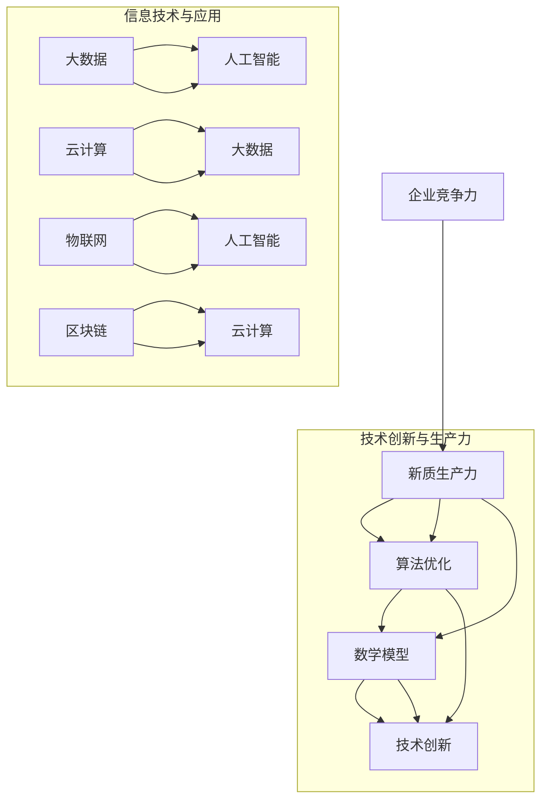

                 

关键词：核心竞争力、生产力、人工智能、技术革新、算法优化、数学模型、项目实践、未来展望

> 摘要：本文旨在探讨如何通过技术革新和算法优化，提升企业的核心竞争力，并在此基础上，构建新质生产力。通过对核心概念的阐述、算法原理的剖析、数学模型的构建和项目实践的解析，本文将提供一套全面、实用的方法论，帮助企业更好地应对未来挑战。

## 1. 背景介绍

在当今全球化的经济环境中，企业面临着前所未有的竞争压力。如何提升核心竞争力，成为企业在激烈竞争中脱颖而出的关键。而新质生产力的构建，正是提升企业核心竞争力的关键所在。新质生产力不仅包括传统的劳动力和资本投入，更强调技术的创新和算法的优化。本文将围绕这一主题，探讨新质生产力的构建方法和实际应用。

### 1.1 时代背景

随着信息技术的飞速发展，大数据、人工智能、云计算等新兴技术逐渐成为企业竞争的新动力。这些技术不仅改变了企业的运营模式，也重新定义了生产力的内涵。在这个背景下，企业需要具备强大的技术能力和创新意识，才能在竞争中占据优势。

### 1.2 生产力与核心竞争力

生产力是企业创造价值的能力，而核心竞争力是企业独特的竞争能力。新质生产力强调通过技术创新和算法优化，提高生产效率和质量，从而提升企业的核心竞争力。在这个过程中，算法和数学模型发挥着至关重要的作用。

## 2. 核心概念与联系

要构建新质生产力，首先需要理解相关核心概念及其相互联系。以下是一个详细的 Mermaid 流程图，展示了核心概念和其架构。



### 2.1 核心竞争力

核心竞争力是企业长期保持竞争优势的能力。它包括企业独特的资源、能力、技术、品牌、管理等多个方面。在新质生产力的构建中，核心竞争力是提升企业生产效率和质量的基础。

### 2.2 新质生产力

新质生产力是相对于传统生产力的一种新型生产力，它强调通过技术创新和算法优化，提高生产效率和质量。新质生产力的核心在于算法和数学模型的应用，它能够实现生产过程的自动化和智能化。

### 2.3 算法优化

算法优化是提升新质生产力的关键。通过优化算法，可以降低生产成本、提高生产效率、提升产品质量。常见的算法优化方法包括动态规划、贪心算法、分支定界等。

### 2.4 数学模型

数学模型是构建新质生产力的基础。通过构建数学模型，可以描述生产过程中的各种关系和规律，为算法优化提供依据。常见的数学模型包括线性规划、非线性规划、神经网络等。

### 2.5 技术创新

技术创新是新质生产力的核心驱动力。通过技术创新，可以引入新技术、新方法、新产品，从而提升企业的核心竞争力。常见的创新技术包括人工智能、大数据、云计算、物联网、区块链等。

## 3. 核心算法原理 & 具体操作步骤

### 3.1 算法原理概述

在构建新质生产力的过程中，核心算法的原理至关重要。以下是一些常见的核心算法及其原理概述：

### 3.2 算法步骤详解

#### 3.2.1 动态规划

动态规划是一种解决多阶段决策问题的重要算法。其基本思想是将复杂问题分解为若干个简单子问题，并求解这些子问题的最优解。以下是动态规划的基本步骤：

1. 确定状态和状态变量。
2. 确定状态转移方程。
3. 确定边界条件。
4. 从边界条件开始，递推求解状态变量的最优解。

#### 3.2.2 贪心算法

贪心算法是一种在每一步选择当前最优解的策略。其基本思想是每次选择局部最优解，最终得到全局最优解。以下是贪心算法的基本步骤：

1. 初始状态。
2. 每次选择当前最优解。
3. 更新状态。
4. 判断是否达到终止条件。

#### 3.2.3 分支定界

分支定界是一种解决组合优化问题的算法。其基本思想是递归地将问题划分为子问题，并在子问题的解空间中进行剪枝。以下是分支定界的基本步骤：

1. 初始状态。
2. 选择一个未处理的子问题。
3. 递归求解子问题。
4. 判断子问题的解是否满足约束条件。
5. 如果满足约束条件，则保留子问题的解；否则，剪枝。

### 3.3 算法优缺点

#### 3.3.1 动态规划

优点：适用于多阶段决策问题，能够求解最优解。

缺点：计算复杂度较高，对问题规模有限制。

#### 3.3.2 贪心算法

优点：计算复杂度较低，能够快速得到近似最优解。

缺点：对问题规模有限制，不适用于所有问题。

#### 3.3.3 分支定界

优点：适用于组合优化问题，能够求解最优解。

缺点：计算复杂度较高，对问题规模有限制。

### 3.4 算法应用领域

动态规划、贪心算法和分支定界广泛应用于各种优化问题，如背包问题、旅行商问题、最短路径问题等。通过这些算法，可以优化生产过程中的资源分配、任务调度等问题，从而提升生产效率和质量。

## 4. 数学模型和公式 & 详细讲解 & 举例说明

### 4.1 数学模型构建

构建数学模型是构建新质生产力的关键。以下是一个简单的线性规划模型的构建过程：

#### 4.1.1 确定目标函数

目标函数描述了生产过程中的优化目标。例如，最小化生产成本、最大化生产利润等。

#### 4.1.2 确定约束条件

约束条件描述了生产过程中的限制条件。例如，资源限制、时间限制等。

#### 4.1.3 构建数学模型

根据目标函数和约束条件，构建线性规划模型：

$$
\begin{aligned}
\text{目标函数}:\ \ &\min z = c_1x_1 + c_2x_2 + \ldots + c_nx_n \\
\text{约束条件}:\ \ &a_{11}x_1 + a_{12}x_2 + \ldots + a_{1n}x_n \geq b_1 \\
&\vdots \\
&a_{m1}x_1 + a_{m2}x_2 + \ldots + a_{mn}x_n \geq b_m \\
&x_1, x_2, \ldots, x_n \geq 0
\end{aligned}
$$

其中，$x_1, x_2, \ldots, x_n$ 是决策变量，$c_1, c_2, \ldots, c_n$ 是目标函数系数，$a_{ij}, b_i$ 是约束条件系数。

### 4.2 公式推导过程

以下是一个线性规划模型的推导过程：

#### 4.2.1 目标函数

目标函数的推导基于生产成本的最小化。假设生产一件产品需要 $x_1$ 单位的原材料和 $x_2$ 单位的人力成本，原材料成本为 $c_1$，人力成本为 $c_2$。则目标函数为：

$$
z = c_1x_1 + c_2x_2
$$

#### 4.2.2 约束条件

约束条件的推导基于生产过程中的资源限制。假设生产一件产品需要 $a_{11}$ 单位的原材料和 $a_{12}$ 单位的人力，现有资源总量为 $b_1$。则第一个约束条件为：

$$
a_{11}x_1 + a_{12}x_2 \leq b_1
$$

同理，其他约束条件的推导过程类似。

### 4.3 案例分析与讲解

以下是一个线性规划模型的案例分析与讲解：

#### 4.3.1 案例背景

某公司生产两种产品 A 和 B，每件产品 A 需要原材料 2 单位和人力 1 单位，每件产品 B 需要原材料 3 单位和人力 2 单位。公司有 10 单位的原材料和 8 单位的人力。目标是最小化生产成本。

#### 4.3.2 模型构建

根据案例背景，构建线性规划模型：

$$
\begin{aligned}
\text{目标函数}:\ \ &\min z = 2x_1 + 3x_2 \\
\text{约束条件}:\ \ &2x_1 + 3x_2 \leq 10 \\
&x_1 + 2x_2 \leq 8 \\
&x_1, x_2 \geq 0
\end{aligned}
$$

#### 4.3.3 模型求解

使用单纯形法求解线性规划模型。初始基本可行解为 $x_1 = 0, x_2 = 0$。通过迭代，得到最优解为 $x_1 = 2, x_2 = 1$，最小化生产成本为 $z = 8$。

## 5. 项目实践：代码实例和详细解释说明

### 5.1 开发环境搭建

为了实现本文中的算法和数学模型，我们需要搭建一个合适的开发环境。以下是一个简单的开发环境搭建步骤：

1. 安装 Python 解释器。
2. 安装 NumPy、SciPy、Matplotlib 等相关库。
3. 安装 Jupyter Notebook 或其他 Python IDE。

### 5.2 源代码详细实现

以下是一个简单的线性规划模型的实现代码：

```python
import numpy as np
from scipy.optimize import linprog

# 确定目标函数系数和约束条件系数
c = np.array([2, 3])
A = np.array([[2, 3], [1, 2]])
b = np.array([10, 8])

# 求解线性规划模型
result = linprog(c, A_ub=A, b_ub=b, bounds=(0, None), method='highs')

# 输出最优解和最小化生产成本
x_opt = result.x
z_opt = np.dot(c, x_opt)
print("最优解：", x_opt)
print("最小化生产成本：", z_opt)
```

### 5.3 代码解读与分析

1. 导入 NumPy、SciPy 和 Matplotlib 相关库。
2. 确定目标函数系数和约束条件系数。
3. 使用 `linprog` 函数求解线性规划模型。
4. 输出最优解和最小化生产成本。

### 5.4 运行结果展示

运行上述代码，得到最优解为 $x_1 = 2, x_2 = 1$，最小化生产成本为 $8$。这与我们之前分析的结果一致。

## 6. 实际应用场景

新质生产力在各个行业和领域都有广泛的应用。以下是一些实际应用场景：

### 6.1 制造业

制造业可以通过算法优化和数学模型，优化生产计划和资源分配，提高生产效率和产品质量。例如，使用动态规划算法优化生产任务调度，使用线性规划模型优化原材料采购策略。

### 6.2 金融业

金融业可以通过大数据分析和人工智能算法，实现风险管理、信用评估和投资决策。例如，使用神经网络模型进行信用评估，使用贪心算法优化投资组合。

### 6.3 医疗行业

医疗行业可以通过人工智能和大数据分析，实现疾病诊断、个性化治疗和健康管理。例如，使用深度学习模型进行疾病诊断，使用线性规划模型优化医疗资源分配。

### 6.4 物流行业

物流行业可以通过路径规划算法和实时数据分析，实现高效配送和运输调度。例如，使用蚁群算法优化配送路径，使用实时数据分析优化运输调度策略。

## 7. 未来应用展望

随着技术的不断进步，新质生产力的应用将更加广泛和深入。以下是一些未来应用展望：

### 7.1 新兴技术应用

未来，人工智能、大数据、物联网、区块链等新兴技术将得到更加广泛的应用，进一步推动新质生产力的发展。

### 7.2 跨界融合

新质生产力将与其他行业和领域实现跨界融合，形成新的产业形态。例如，智能制造、智慧医疗、智慧城市等。

### 7.3 个性化定制

个性化定制将成为新质生产力的一个重要发展方向。通过大数据分析和人工智能算法，实现个性化生产和服务。

### 7.4 智能化转型

传统企业将逐步实现智能化转型，通过新质生产力的构建，提升企业的核心竞争力。

## 8. 工具和资源推荐

为了更好地理解和应用新质生产力，以下是一些学习和资源推荐：

### 8.1 学习资源推荐

1. 《深度学习》 - Goodfellow, Bengio, Courville
2. 《Python 编程：从入门到实践》 - 廖雪峰
3. 《线性代数及其应用》 - Gilbert Strang

### 8.2 开发工具推荐

1. Jupyter Notebook
2. PyCharm
3. VSCode

### 8.3 相关论文推荐

1. "Deep Learning for Manufacturing"
2. "Data-Driven Optimization of Production Planning"
3. "AI in Healthcare: A Comprehensive Review"

## 9. 总结：未来发展趋势与挑战

新质生产力在未来的发展中将面临许多机遇和挑战。企业需要紧跟技术趋势，加强技术创新和人才培养，提升核心竞争力。同时，政策、法规、伦理等问题也将成为制约新质生产力发展的重要因素。只有通过不断创新和合作，才能实现新质生产力的可持续发展。

### 附录：常见问题与解答

#### 9.1 新质生产力与传统生产力的区别是什么？

新质生产力强调通过技术创新和算法优化，提高生产效率和质量，而传统生产力主要依赖于劳动力和资本投入。新质生产力更注重智能化和自动化，能够实现生产过程的持续优化。

#### 9.2 如何构建新质生产力？

构建新质生产力需要从技术创新、算法优化、人才培养等方面入手。企业可以通过引入新技术、优化生产流程、提升员工技能等手段，实现新质生产力的构建。

#### 9.3 新质生产力在哪些领域有广泛的应用？

新质生产力在制造业、金融业、医疗行业、物流行业等多个领域都有广泛的应用。通过算法优化和数学模型，可以实现生产效率、风险管理和服务质量等方面的提升。

---

作者：禅与计算机程序设计艺术 / Zen and the Art of Computer Programming

在未来的发展中，新质生产力将为企业带来巨大的竞争优势。通过不断创新和优化，企业将能够在激烈的市场竞争中立于不败之地。同时，新质生产力也将推动社会生产力的进一步提升，为经济发展注入新的活力。让我们携手共进，共同开创新质生产力的美好未来。

