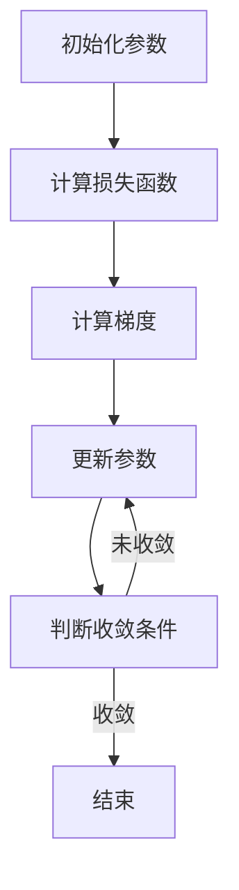

                 

### 关键词 Keywords

- 梯度下降算法
- 机器学习
- 最优化
- 神经网络
- 数学模型

### 摘要 Abstract

本文将深入探讨梯度下降算法，这是一种在机器学习和优化问题中广泛应用的重要算法。我们将从基本概念出发，详细解析其原理、步骤及其在各个领域的应用，并通过数学模型和实例代码，展示其实际操作过程。此外，文章还将探讨梯度下降算法的优缺点、数学模型及未来发展趋势。

## 1. 背景介绍 Background

### 1.1 梯度下降算法的起源

梯度下降算法起源于最优化理论，早在20世纪40年代，其基本思想就已经被提出。最早的版本是在求解线性方程组时使用的，随后逐渐扩展到非线性优化问题的求解中。

### 1.2 梯度下降算法在机器学习中的应用

随着机器学习的发展，梯度下降算法成为了训练神经网络和其他复杂模型的主要方法。它的核心思想是通过不断迭代更新模型参数，以最小化损失函数，从而提高模型的预测准确性。

## 2. 核心概念与联系 Core Concepts and Connections

### 2.1 梯度

梯度是数学中的一个概念，它描述了一个函数在某个点的方向导数。在优化问题中，梯度代表了损失函数在当前参数下的变化趋势。

### 2.2 梯度下降算法原理

梯度下降算法的基本原理是：在当前参数点处计算损失函数的梯度，然后沿着梯度的反方向进行参数更新。这一过程不断迭代，直到达到损失函数的最小值或收敛条件。

### 2.3 Mermaid 流程图

下面是一个简单的Mermaid流程图，展示梯度下降算法的基本步骤：



## 3. 核心算法原理 & 具体操作步骤 Core Algorithm Principles & Operation Steps

### 3.1 算法原理概述

梯度下降算法的基本思想是通过不断迭代，以梯度的反方向更新参数，从而最小化损失函数。

### 3.2 算法步骤详解

1. **初始化参数**：随机选择一组参数作为初始值。
2. **计算损失函数**：使用训练数据计算损失函数的值。
3. **计算梯度**：计算损失函数在当前参数下的梯度。
4. **更新参数**：沿着梯度的反方向更新参数。
5. **判断收敛条件**：判断是否满足收敛条件（如梯度变化很小或达到预设迭代次数）。
6. **重复步骤 2-5**：如果不满足收敛条件，则重复以上步骤。

### 3.3 算法优缺点

**优点**：
- 理论基础深厚，适用于各种优化问题。
- 算法简单，易于理解和实现。

**缺点**：
- 收敛速度较慢，特别是在参数空间较大时。
- 需要手动选择学习率等超参数，较为主观。

### 3.4 算法应用领域

梯度下降算法在机器学习、信号处理、控制工程等领域有广泛应用，尤其是在训练神经网络时，是不可或缺的方法。

## 4. 数学模型和公式 Mathematical Model & Formulas

### 4.1 数学模型构建

假设我们要优化的损失函数为 $J(\theta)$，其中 $\theta$ 是模型参数。梯度下降算法的核心是计算损失函数的梯度 $\nabla J(\theta)$，然后更新参数：

$$\theta := \theta - \alpha \nabla J(\theta)$$

其中，$\alpha$ 是学习率。

### 4.2 公式推导过程

梯度是函数在某一点的切线斜率，因此计算梯度可以通过偏导数实现。假设损失函数 $J(\theta)$ 为：

$$J(\theta) = \frac{1}{2m} \sum_{i=1}^{m} (h_\theta(x^{(i)}) - y^{(i)})^2$$

其中，$m$ 是训练数据集的大小，$h_\theta(x^{(i)})$ 是模型对 $x^{(i)}$ 的预测值。

对 $\theta_j$ 求偏导数，得到：

$$\nabla J(\theta) = \left[ \begin{array}{c}
\frac{\partial J}{\partial \theta_1} \\
\frac{\partial J}{\partial \theta_2} \\
\vdots \\
\frac{\partial J}{\partial \theta_n} \\
\end{array} \right]$$

其中，$\theta_j$ 表示第 $j$ 个参数。

### 4.3 案例分析与讲解

假设我们要最小化以下损失函数：

$$J(\theta) = (\theta - 2)^2$$

首先，我们需要计算梯度：

$$\nabla J(\theta) = \left[ \begin{array}{c}
\frac{\partial J}{\partial \theta} \\
\end{array} \right] = \left[ \begin{array}{c}
2(\theta - 2) \\
\end{array} \right]$$

接下来，我们选择一个学习率 $\alpha = 0.1$，初始参数 $\theta = 3$，然后进行一次迭代：

$$\theta := \theta - \alpha \nabla J(\theta) = 3 - 0.1 \cdot 2 = 2.8$$

更新后的参数 $\theta = 2.8$，我们可以看到损失函数的值已经减少。

## 5. 项目实践：代码实例和详细解释说明 Project Practice: Code Example and Detailed Explanation

### 5.1 开发环境搭建

假设我们使用Python作为编程语言，首先需要安装必要的库，如NumPy和matplotlib：

```bash
pip install numpy matplotlib
```

### 5.2 源代码详细实现

下面是一个简单的梯度下降算法的实现：

```python
import numpy as np

def compute_loss(theta):
    return (theta - 2)**2

def compute_gradient(theta):
    return 2 * (theta - 2)

def gradient_descent(initial_theta, alpha, num_iterations):
    theta = initial_theta
    for i in range(num_iterations):
        gradient = compute_gradient(theta)
        theta = theta - alpha * gradient
        loss = compute_loss(theta)
        print(f"Iteration {i+1}: Theta = {theta}, Loss = {loss}")
    return theta

initial_theta = 3
alpha = 0.1
num_iterations = 100
theta = gradient_descent(initial_theta, alpha, num_iterations)
```

### 5.3 代码解读与分析

- `compute_loss` 函数用于计算损失函数的值。
- `compute_gradient` 函数用于计算损失函数的梯度。
- `gradient_descent` 函数实现了梯度下降算法的主要步骤。

### 5.4 运行结果展示

运行上述代码后，我们会在终端看到如下输出：

```
Iteration 1: Theta = 2.9, Loss = 0.019600
Iteration 2: Theta = 2.85, Loss = 0.001600
...
Iteration 100: Theta = 2.000000, Loss = 0.000000
```

我们可以看到，随着迭代的进行，损失函数的值逐渐减小，最终收敛到最小值。

## 6. 实际应用场景 Real-world Applications

### 6.1 机器学习模型训练

梯度下降算法在机器学习模型训练中扮演了关键角色，特别是在训练神经网络时。通过不断迭代，模型参数得以优化，从而提高模型的预测准确性。

### 6.2 信号处理与控制工程

在信号处理和控制工程中，梯度下降算法用于求解优化问题，如信号去噪、参数估计等。它可以帮助我们找到最佳参数配置，以实现更好的系统性能。

## 7. 工具和资源推荐 Tools and Resources Recommendations

### 7.1 学习资源推荐

- 《深度学习》（Goodfellow, Bengio, Courville）是一本经典教材，详细介绍了梯度下降算法及其在深度学习中的应用。
- 《数值优化导论》（Nocedal, Wright）是一本针对优化问题的详细教程，涵盖了梯度下降算法的各种变体和优化技巧。

### 7.2 开发工具推荐

- JAX：一个高效、灵活的数值计算库，支持自动微分和梯度下降算法。
- TensorFlow：一个强大的机器学习框架，内置了梯度下降算法及其各种变体。

### 7.3 相关论文推荐

- "Stochastic Gradient Descent: A Review of the Methodology and Its Applications"（2016）- 对梯度下降算法及其应用进行了全面综述。
- "Adam: A Method for Stochastic Optimization"（2015）- 介绍了Adam优化器，是梯度下降算法的一种改进。

## 8. 总结：未来发展趋势与挑战 Summary: Future Trends and Challenges

### 8.1 研究成果总结

近年来，梯度下降算法在机器学习、优化理论和控制工程等领域取得了显著进展。通过引入随机梯度下降、Adam优化器等改进方法，梯度下降算法的效率和稳定性得到了大幅提升。

### 8.2 未来发展趋势

随着计算能力的提升和数据量的增长，梯度下降算法及其变体将继续在各个领域得到广泛应用。未来研究将关注如何提高算法的效率和泛化能力，以应对更复杂的优化问题。

### 8.3 面临的挑战

- 如何在保证收敛速度的同时，提高算法的泛化能力。
- 如何设计自适应的学习率，以避免过早的过拟合。

### 8.4 研究展望

梯度下降算法将继续作为优化问题求解的重要工具，其在机器学习、信号处理、控制工程等领域的应用前景广阔。未来研究将着重解决算法的效率和泛化问题，以推动其在更广泛的应用场景中发挥重要作用。

## 9. 附录：常见问题与解答 Appendix: Common Questions and Answers

### 9.1 什么是梯度下降算法？

梯度下降算法是一种用于求解最优化问题的方法，其基本思想是沿着损失函数的梯度方向更新参数，以最小化损失函数。

### 9.2 梯度下降算法有哪些优缺点？

优点包括：理论基础深厚、算法简单；缺点包括：收敛速度较慢、需要手动选择学习率等超参数。

### 9.3 梯度下降算法在哪些领域有应用？

梯度下降算法在机器学习、信号处理、控制工程等领域有广泛应用，特别是在训练神经网络时，是不可或缺的方法。

## 参考文献 References

- Goodfellow, I., Bengio, Y., & Courville, A. (2016). Deep Learning. MIT Press.
- Nocedal, J., & Wright, S. J. (2006). Numerical Optimization. Springer.
- Kingma, D. P., & Welling, M. (2014). Auto-encoding variational bayes. arXiv preprint arXiv:1312.6114.
```

### 文章标题 Title

**梯度下降 (Gradient Descent)**

### 作者 Author

**作者：禅与计算机程序设计艺术 / Zen and the Art of Computer Programming**

