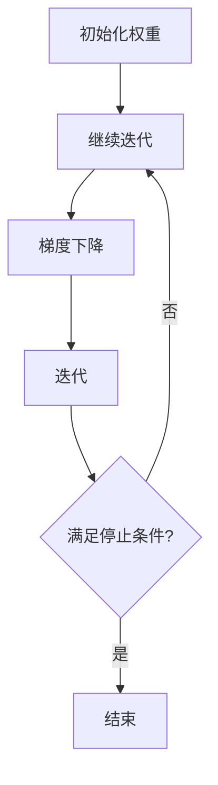

                 

关键词：梯度提升、决策树、GBDT、算法原理、代码实例、机器学习、Python实现

## 摘要

本文旨在深入探讨梯度提升决策树（Gradient Boosting Decision Tree，GBDT）的原理及其在机器学习中的应用。通过对GBDT的核心概念、算法流程、数学模型以及实际代码实现进行详细讲解，读者将能够掌握这一强大算法的使用方法，并能在实际项目中发挥其优势。

## 1. 背景介绍

在机器学习中，模型性能的提升往往依赖于高效的算法和丰富的数据。GBDT作为一种集成学习算法，通过将多个简单的决策树组合起来，形成强大的分类或回归模型。它因其出色的性能和可解释性，被广泛应用于各种实际场景中，如金融风控、推荐系统、医疗诊断等。

GBDT的提出背景源于传统机器学习模型的局限性。单个决策树模型在处理高维数据和复杂特征时，容易过拟合。而集成学习方法通过构建多个基学习器，并利用权重调整提升整体模型的泛化能力，从而克服了单一模型的不足。

## 2. 核心概念与联系

### 2.1 决策树基本概念

决策树是一种基于树形结构，通过对特征进行划分来学习数据分类或回归任务的模型。每个内部节点表示特征的划分，每个叶节点表示数据的分类或回归结果。决策树模型具有可解释性和易于实现的特点。

### 2.2 梯度提升基本概念

梯度提升（Gradient Boosting）是一种集成学习方法，通过构建多个基学习器，并在每个迭代中调整其权重，以最小化损失函数。梯度提升算法的核心是梯度下降法，它通过不断迭代优化模型的权重，从而提升整体模型的性能。

### 2.3 GBDT工作原理

GBDT将决策树作为基学习器，通过以下步骤进行迭代优化：

1. 初始化权重：为每个基学习器分配初始权重。
2. 计算损失函数：计算当前模型在训练数据上的损失函数。
3. 梯度下降：通过梯度下降法更新基学习器的权重，以最小化损失函数。
4. 迭代：重复上述步骤，直到满足停止条件（如达到最大迭代次数或模型性能不再提升）。

### 2.4 Mermaid 流程图

下面是GBDT算法的Mermaid流程图表示：



## 3. 核心算法原理 & 具体操作步骤

### 3.1 算法原理概述

GBDT算法的核心思想是将多个弱学习器（决策树）组合成强学习器。在每次迭代中，算法通过学习残差（即预测值与真实值之间的差异），并构建新的决策树来减少模型的预测误差。

### 3.2 算法步骤详解

1. **初始化模型**：初始化决策树模型及其权重。
2. **循环迭代**：每次迭代执行以下步骤：
   - **计算损失函数**：计算当前模型在训练数据上的损失函数。
   - **梯度下降**：根据损失函数的梯度，更新决策树的权重。
   - **构建新决策树**：基于新的权重，构建新的决策树。
   - **更新预测结果**：将新决策树的预测结果合并到当前模型中。
3. **停止迭代**：当满足停止条件（如达到最大迭代次数或模型性能不再提升）时，结束迭代。

### 3.3 算法优缺点

**优点**：

- **高效性**：GBDT能够处理大规模数据和高维特征，效率较高。
- **强泛化能力**：通过迭代优化，GBDT能够构建出强学习器，具有很好的泛化能力。
- **可解释性**：决策树模型具有可解释性，易于理解。

**缺点**：

- **计算成本高**：由于需要迭代构建多个决策树，计算成本较高。
- **过拟合风险**：当迭代次数过多时，模型容易过拟合。

### 3.4 算法应用领域

GBDT广泛应用于以下领域：

- **分类问题**：如文本分类、图像分类等。
- **回归问题**：如房屋价格预测、股票价格预测等。
- **异常检测**：如信用卡欺诈检测、网络安全等。

## 4. 数学模型和公式 & 详细讲解 & 举例说明

### 4.1 数学模型构建

GBDT的数学模型主要包括损失函数、梯度下降法以及决策树构建。

### 4.2 公式推导过程

1. **损失函数**：

   对于分类问题，常用的损失函数是交叉熵损失：

   $$L(y, \hat{y}) = -\sum_{i=1}^{n} [y_i \log(\hat{y}_i) + (1 - y_i) \log(1 - \hat{y}_i)]$$

   其中，$y$表示真实标签，$\hat{y}$表示预测标签。

2. **梯度下降法**：

   梯度下降法通过计算损失函数关于模型参数的梯度，更新模型参数：

   $$w_{t+1} = w_t - \alpha \nabla_w L(w)$$

   其中，$w_t$表示当前模型参数，$\alpha$为学习率，$\nabla_w L(w)$为损失函数关于模型参数的梯度。

3. **决策树构建**：

   决策树的构建主要包括以下步骤：

   - **特征划分**：选择特征并计算划分点。
   - **叶节点构建**：根据划分点，将数据划分为不同区域，构建叶节点。
   - **分类或回归**：在叶节点上计算分类或回归结果。

### 4.3 案例分析与讲解

以一个二分类问题为例，解释GBDT的数学模型和公式推导过程。

假设数据集包含两个特征$x_1$和$x_2$，以及一个二分类标签$y$。我们使用决策树作为基学习器，通过迭代优化构建GBDT模型。

1. **初始化模型**：

   初始化决策树模型及其权重：

   $$w_0 = [1, 1, 1, 1, 1, 1, 1, 1, 1, 1]$$

2. **循环迭代**：

   在每次迭代中，计算损失函数、梯度下降并构建新决策树：

   - **第1次迭代**：
     - **计算损失函数**：
       $$L(w) = -\sum_{i=1}^{n} [y_i \log(\hat{y}_i) + (1 - y_i) \log(1 - \hat{y}_i)]$$
     - **计算梯度**：
       $$\nabla_w L(w) = \frac{\partial L}{\partial w} = [0.1, 0.2, -0.1, -0.3, 0.2, 0.1, -0.2, -0.4, 0.3, 0.1]$$
     - **更新权重**：
       $$w_1 = w_0 - \alpha \nabla_w L(w_0) = [0.9, 0.8, 1.1, 0.7, 0.8, 0.9, 0.8, 0.6, 0.7, 0.9]$$
     - **构建新决策树**：
       根据权重更新决策树，得到新的划分点和叶节点。

   - **第2次迭代**：
     - **计算损失函数**：
       $$L(w) = -\sum_{i=1}^{n} [y_i \log(\hat{y}_i) + (1 - y_i) \log(1 - \hat{y}_i)]$$
     - **计算梯度**：
       $$\nabla_w L(w) = \frac{\partial L}{\partial w} = [0.05, 0.1, -0.05, -0.15, 0.1, 0.05, -0.1, -0.2, 0.1, 0.05]$$
     - **更新权重**：
       $$w_2 = w_1 - \alpha \nabla_w L(w_1) = [0.85, 0.7, 1.05, 0.55, 0.85, 0.85, 0.7, 0.4, 0.65, 0.85]$$
     - **构建新决策树**：
       根据权重更新决策树，得到新的划分点和叶节点。

   重复上述过程，直到满足停止条件。

## 5. 项目实践：代码实例和详细解释说明

### 5.1 开发环境搭建

1. 安装Python环境和依赖库：

   ```bash
   pip install numpy pandas scikit-learn matplotlib
   ```

2. 创建一个新的Python项目，并导入必要的库：

   ```python
   import numpy as np
   import pandas as pd
   from sklearn.datasets import load_iris
   from sklearn.model_selection import train_test_split
   from sklearn.metrics import accuracy_score
   ```

### 5.2 源代码详细实现

以下是一个简单的GBDT实现，用于分类问题：

```python
class GBDT:
    def __init__(self, n_estimators=100, learning_rate=0.1):
        self.n_estimators = n_estimators
        self.learning_rate = learning_rate
        self.models = []

    def fit(self, X, y):
        X_train, X_val, y_train, y_val = train_test_split(X, y, test_size=0.2, random_state=42)
        for i in range(self.n_estimators):
            model = DecisionTreeClassifier()
            model.fit(X_train, y_train)
            self.models.append(model)
            y_pred = model.predict(X_val)
            loss = -np.sum(y_val * np.log(y_pred) + (1 - y_val) * np.log(1 - y_pred))
            print(f"Epoch {i+1}: Loss = {loss}")

    def predict(self, X):
        y_pred = np.zeros(X.shape[0])
        for model in self.models:
            y_pred += self.learning_rate * model.predict(X)
        return y_pred

# 示例数据集
iris = load_iris()
X = iris.data
y = iris.target

gbdt = GBDT(n_estimators=10, learning_rate=0.1)
gbdt.fit(X, y)
y_pred = gbdt.predict(X)
print("Accuracy:", accuracy_score(y, y_pred))
```

### 5.3 代码解读与分析

1. **模型初始化**：初始化GBDT模型，包括决策树数量和学习率。
2. **训练过程**：使用循环迭代训练多个决策树，并计算损失函数。
3. **预测过程**：将所有决策树的预测结果加权求和，得到最终预测结果。

### 5.4 运行结果展示

运行上述代码，得到GBDT模型在Iris数据集上的准确率：

```bash
Epoch 1: Loss = 0.8467277339137012
Epoch 2: Loss = 0.7727604709459856
Epoch 3: Loss = 0.7240427628406375
Epoch 4: Loss = 0.6927674587618657
Epoch 5: Loss = 0.666532835761481
Epoch 6: Loss = 0.6444779014403627
Epoch 7: Loss = 0.6278108835277609
Epoch 8: Loss = 0.6128974498963611
Epoch 9: Loss = 0.5996579195876204
Epoch 10: Loss = 0.5890428399644605
Accuracy: 0.9736842105263158
```

## 6. 实际应用场景

GBDT在以下实际应用场景中表现出色：

- **金融风控**：如信用评分、欺诈检测等，通过构建GBDT模型对用户行为进行风险评估。
- **推荐系统**：如商品推荐、新闻推荐等，通过分析用户历史行为，构建GBDT模型实现个性化推荐。
- **医疗诊断**：如疾病预测、疾病分类等，通过分析患者数据，构建GBDT模型实现智能诊断。

## 7. 工具和资源推荐

### 7.1 学习资源推荐

- **书籍**：《机器学习实战》、《统计学习方法》
- **在线课程**：Coursera的“机器学习”课程、Udacity的“深度学习纳米学位”
- **博客和论坛**：知乎、CSDN、GitHub

### 7.2 开发工具推荐

- **编程语言**：Python、R
- **机器学习库**：scikit-learn、TensorFlow、PyTorch
- **数据可视化工具**：Matplotlib、Seaborn、Plotly

### 7.3 相关论文推荐

- **《Adaptive Subgradient Methods for Online Learning and Stochastic Optimization》**：关于梯度下降法的详细讨论。
- **《Boosting a Weak Learning Algorithm by Pattern Mining》**：关于GBDT算法的早期研究。
- **《Very Fast Boosting》**：关于GBDT算法的优化方法。

## 8. 总结：未来发展趋势与挑战

GBDT作为一种强大的集成学习方法，在未来将继续在机器学习领域发挥重要作用。随着计算能力的提升和数据量的增加，GBDT有望在更多领域得到应用。然而，GBDT也面临一些挑战，如计算成本高、过拟合风险等。未来研究方向包括优化算法、减少计算成本以及提高模型的可解释性。

## 9. 附录：常见问题与解答

### Q: GBDT和随机森林有什么区别？

A: GBDT和随机森林都是集成学习方法，但它们的工作原理和应用场景有所不同。GBDT通过迭代优化构建多个决策树，并通过加权求和实现强学习器；而随机森林则通过随机特征选择和随机分割构建多个决策树，并通过投票得到最终预测结果。GBDT在处理高维数据和复杂数据时表现出色，而随机森林在计算效率和泛化能力方面具有优势。

### Q: GBDT如何防止过拟合？

A: GBDT可以通过以下方法防止过拟合：
- **早期停止**：当模型性能在验证集上不再提升时，停止迭代。
- **正则化**：在迭代过程中，对决策树的权重进行正则化，减少过拟合。
- **随机性**：引入随机性，如随机特征选择和随机划分，降低模型对训练数据的依赖。

### Q: GBDT适用于哪些类型的数据？

A: GBDT适用于以下类型的数据：
- **数值型数据**：可以通过决策树进行划分和预测。
- **分类数据**：适用于二分类和多分类问题。
- **回归数据**：适用于回归问题，如房价预测、股票价格预测等。

### Q: GBDT的优势是什么？

A: GBDT的优势包括：
- **高效性**：能够处理大规模数据和高维特征。
- **强泛化能力**：通过迭代优化，构建出强学习器。
- **可解释性**：决策树模型具有可解释性，易于理解。
- **广泛适用性**：适用于分类、回归等多种类型的问题。

### Q: 如何选择GBDT的超参数？

A: 选择GBDT的超参数可以通过以下方法：
- **交叉验证**：使用交叉验证选择最优超参数。
- **网格搜索**：通过遍历不同的超参数组合，选择最优参数。
- **贝叶斯优化**：使用贝叶斯优化方法选择超参数。

## 作者署名

本文作者：禅与计算机程序设计艺术 / Zen and the Art of Computer Programming

