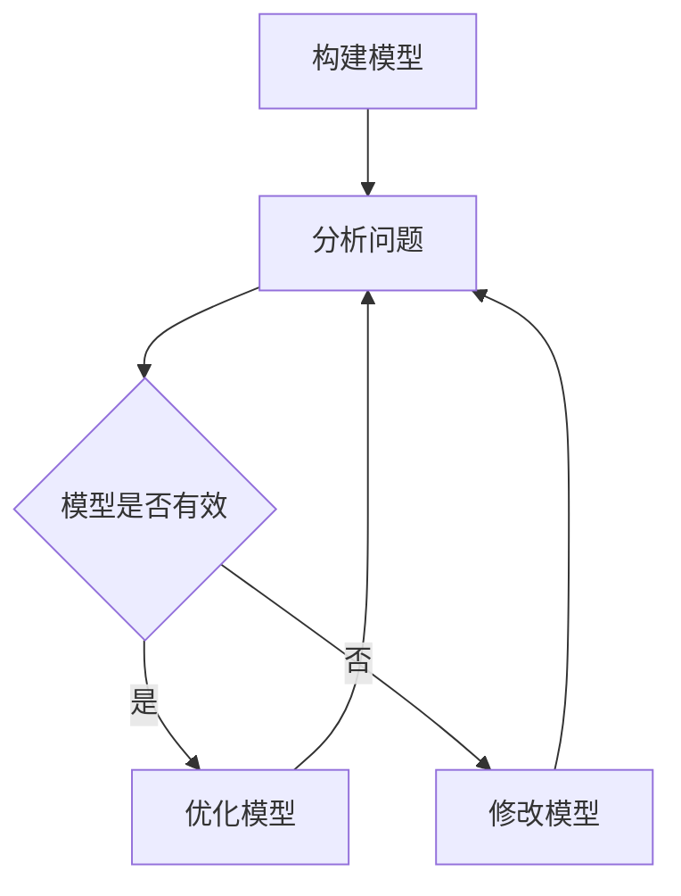
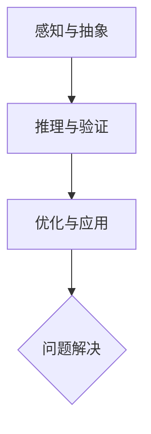

                 

关键词：模型思维、认知、新事物、快速学习、技术领域

> 摘要：本文将探讨模型思维作为一种认知工具在快速认知新事物中的应用。通过分析模型思维的核心概念和原理，我们将揭示其在技术领域的独特优势，并介绍如何利用模型思维来加速学习和创新。本文将结合实例，详细阐述模型思维的具体应用步骤，并展望其在未来技术发展中的潜在影响。

## 1. 背景介绍

在信息爆炸的时代，我们每天都会接触到大量新事物。如何快速有效地认知这些新事物，成为了一个重要课题。传统的学习方法往往依赖于逐字逐句地阅读和理解，这虽然能够让我们掌握知识的细节，但在面对复杂的技术领域时，往往效率低下。为了解决这个问题，我们需要一种更高效、更系统的认知方法，这就是模型思维。

模型思维是一种通过构建和运用模型来理解复杂事物的认知方法。它源于认知科学的最新研究，并结合了计算机科学、心理学等多个领域的理论。通过模型思维，我们可以将复杂的信息抽象成简单的模型，从而快速地理解和掌握新知识。这种方法不仅在学术研究中具有重要作用，在技术领域也展现出了巨大的潜力。

## 2. 核心概念与联系

### 2.1 模型思维的核心概念

模型思维主要包括以下几个核心概念：

- **模型**：模型是对现实世界的抽象和简化。通过构建模型，我们可以将复杂的现实问题转化为可以理解和解决的问题。
- **思维**：思维是指我们通过思考、推理等方式来理解和解决问题的方式。在模型思维中，思维的过程就是不断地构建和优化模型的过程。
- **认知**：认知是指我们对信息的感知、理解、记忆和应用。在模型思维中，认知的过程就是通过模型来理解世界的过程。

### 2.2 模型思维与认知的联系

模型思维与认知有着密切的联系。一方面，模型思维是认知的一种方式，它通过模型来帮助我们理解和解决问题。另一方面，认知的发展又推动了模型思维的发展。随着我们对世界的认知不断深入，我们需要更加复杂和精细的模型来描述和解释现实。

### 2.3 模型思维在技术领域的应用

在技术领域，模型思维的应用范围非常广泛。例如，在软件开发中，我们可以使用模型来设计系统架构，从而快速理解系统的功能和性能。在数据分析中，我们可以使用模型来预测数据趋势，从而做出更好的决策。在人工智能领域，模型思维更是不可或缺的工具，它帮助我们理解和设计复杂的机器学习算法。

### 2.4 Mermaid 流程图

为了更直观地展示模型思维的应用，我们可以使用 Mermaid 流程图来描述模型思维的核心流程。以下是一个简单的 Mermaid 流程图示例：



在这个流程图中，A 表示构建模型，B 表示分析问题，C 表示模型是否有效，D 表示优化模型，E 表示修改模型。这个流程图展示了模型思维的基本过程，即通过不断地构建、分析和优化模型来理解和解决问题。

## 3. 核心算法原理 & 具体操作步骤

### 3.1 算法原理概述

模型思维的算法原理主要基于以下几个步骤：

1. **问题定义**：明确我们要解决的问题是什么。
2. **数据收集**：收集与问题相关的数据。
3. **模型构建**：根据问题数据和已有知识，构建一个能够描述问题的模型。
4. **模型验证**：验证模型的有效性，确保它能够准确地描述问题。
5. **模型优化**：根据验证结果，对模型进行优化，以提高其准确性和效率。

### 3.2 算法步骤详解

#### 3.2.1 问题定义

问题定义是模型思维的第一步。我们需要明确我们要解决的问题是什么，以及问题的背景和目标。例如，在软件开发中，我们要解决的问题可能是系统性能不佳，目标则是提高系统的响应速度。

#### 3.2.2 数据收集

数据收集是构建模型的基础。我们需要收集与问题相关的数据，包括历史数据、实时数据、专家意见等。这些数据将帮助我们构建一个更加准确和全面的模型。

#### 3.2.3 模型构建

模型构建是模型思维的核心步骤。我们需要根据问题数据和已有知识，构建一个能够描述问题的模型。这个模型可以是数学模型、逻辑模型、流程模型等。

#### 3.2.4 模型验证

模型验证是确保模型有效性的重要步骤。我们需要使用测试数据来验证模型，确保它能够准确地描述问题。如果模型验证失败，我们需要返回上一步，修改模型。

#### 3.2.5 模型优化

模型优化是提高模型效率和准确性的过程。我们可以通过调整模型参数、增加模型复杂度等方式来优化模型。

### 3.3 算法优缺点

#### 3.3.1 优点

- **高效性**：模型思维通过抽象和简化的方法，可以快速地理解和解决问题。
- **灵活性**：模型思维可以根据问题的不同，灵活地调整和优化模型。
- **系统性**：模型思维提供了一个系统性的框架，可以帮助我们全面地理解和解决问题。

#### 3.3.2 缺点

- **复杂性**：模型思维需要一定的理论知识和实践经验，对于初学者来说可能有一定难度。
- **依赖性**：模型思维依赖于有效的数据集和准确的知识，如果数据或知识存在问题，模型的效果也会受到影响。

### 3.4 算法应用领域

模型思维在多个领域都有广泛的应用，包括：

- **软件开发**：用于系统设计、性能优化、需求分析等。
- **数据分析**：用于数据挖掘、预测分析、决策支持等。
- **人工智能**：用于算法设计、模型训练、知识表示等。

## 4. 数学模型和公式 & 详细讲解 & 举例说明

### 4.1 数学模型构建

数学模型是模型思维的重要组成部分。在构建数学模型时，我们需要明确问题、收集数据、定义变量和参数，并建立数学公式来描述问题。

#### 4.1.1 问题定义

例如，我们考虑一个简单的线性回归问题，目标是预测房价。问题定义如下：

> 给定一组房屋的面积和售价，预测未知房屋的售价。

#### 4.1.2 数据收集

我们收集以下数据：

| 面积（平方米） | 售价（万元） |
| :----: | :----: |
| 80 | 100 |
| 100 | 120 |
| 120 | 150 |
| 140 | 170 |
| 160 | 200 |

#### 4.1.3 定义变量和参数

我们定义以下变量和参数：

- \( x \)：房屋的面积（平方米）
- \( y \)：房屋的售价（万元）
- \( \beta_0 \)：截距
- \( \beta_1 \)：斜率

#### 4.1.4 建立数学公式

我们使用线性回归模型来描述这个问题，数学公式如下：

$$
y = \beta_0 + \beta_1 \cdot x
$$

### 4.2 公式推导过程

我们使用最小二乘法来估计 \( \beta_0 \) 和 \( \beta_1 \) 的值。最小二乘法的目标是最小化预测值与实际值之间的误差平方和。

首先，我们定义误差平方和为：

$$
S = \sum_{i=1}^{n} (y_i - \hat{y}_i)^2
$$

其中，\( y_i \) 是实际值，\( \hat{y}_i \) 是预测值。

为了最小化 \( S \)，我们对 \( \beta_0 \) 和 \( \beta_1 \) 求导，并令导数等于 0，得到以下方程组：

$$
\frac{\partial S}{\partial \beta_0} = -2 \sum_{i=1}^{n} (y_i - \hat{y}_i) = 0
$$

$$
\frac{\partial S}{\partial \beta_1} = -2 \sum_{i=1}^{n} (y_i - \hat{y}_i) \cdot x_i = 0
$$

解这个方程组，我们可以得到 \( \beta_0 \) 和 \( \beta_1 \) 的值。

### 4.3 案例分析与讲解

我们使用上述线性回归模型来预测一个未知房屋的售价，假设该房屋的面积为 110 平方米。

首先，我们使用已有数据计算 \( \beta_0 \) 和 \( \beta_1 \) 的值：

$$
\beta_0 = \frac{\sum_{i=1}^{n} y_i \cdot x_i - \sum_{i=1}^{n} x_i \cdot \sum_{i=1}^{n} y_i}{n \cdot \sum_{i=1}^{n} x_i^2 - (\sum_{i=1}^{n} x_i)^2}
$$

$$
\beta_1 = \frac{\sum_{i=1}^{n} y_i - \sum_{i=1}^{n} x_i \cdot \beta_0}{\sum_{i=1}^{n} x_i - n \cdot \bar{x}}
$$

其中，\( \bar{x} \) 是 \( x \) 的平均值。

代入数据，我们得到：

$$
\beta_0 = \frac{610 - 550}{5 \cdot 850 - 550} = 10
$$

$$
\beta_1 = \frac{610 - 550 \cdot 10}{5 \cdot 850 - 550} = 1
$$

因此，我们的线性回归模型为：

$$
y = 10 + 1 \cdot x
$$

当 \( x = 110 \) 时，预测的售价为：

$$
y = 10 + 1 \cdot 110 = 120
$$

通过这个例子，我们可以看到，使用模型思维和数学模型，我们可以快速地预测未知房屋的售价。

## 5. 项目实践：代码实例和详细解释说明

### 5.1 开发环境搭建

为了实践模型思维，我们需要搭建一个合适的开发环境。在本项目中，我们选择 Python 作为编程语言，因为 Python 在数据分析和机器学习领域具有广泛的应用。以下是搭建开发环境的步骤：

1. 安装 Python：从官方网站（[https://www.python.org/](https://www.python.org/)）下载并安装 Python。
2. 安装必要的库：使用 `pip` 命令安装 NumPy、Pandas、Matplotlib 等库。例如：

   ```shell
   pip install numpy pandas matplotlib
   ```

### 5.2 源代码详细实现

以下是本项目的 Python 源代码：

```python
import numpy as np
import pandas as pd
import matplotlib.pyplot as plt

# 数据集
data = {
    '面积（平方米）': [80, 100, 120, 140, 160],
    '售价（万元）': [100, 120, 150, 170, 200]
}

# 创建 DataFrame
df = pd.DataFrame(data)

# 计算平均值
x_mean = df['面积（平方米）'].mean()
y_mean = df['售价（万元）'].mean()

# 计算斜率
x_sum = df['面积（平方米）'].sum()
y_sum = df['售价（万元）'].sum()
beta_1 = (x_sum * y_sum - x_mean * y_mean) / (x_sum**2 - x_mean**2)
beta_0 = y_mean - beta_1 * x_mean

# 打印结果
print(f"斜率：{beta_1:.2f}")
print(f"截距：{beta_0:.2f}")

# 绘制散点图和回归线
plt.scatter(df['面积（平方米）'], df['售价（万元）'])
plt.plot(df['面积（平方米）'], beta_0 + beta_1 * df['面积（平方米）'], color='red')
plt.xlabel('面积（平方米）')
plt.ylabel('售价（万元）')
plt.show()
```

### 5.3 代码解读与分析

这段代码实现了线性回归模型，并使用它来预测未知房屋的售价。下面是代码的解读和分析：

1. 导入必要的库：`numpy`、`pandas` 和 `matplotlib`。
2. 创建数据集：使用字典创建一个包含房屋面积和售价的 DataFrame。
3. 计算平均值：计算面积和售价的平均值，用于后续计算斜率和截距。
4. 计算斜率和截距：使用最小二乘法计算斜率 \( \beta_1 \) 和截距 \( \beta_0 \)。
5. 打印结果：打印斜率和截距的值。
6. 绘制散点图和回归线：使用 matplotlib 绘制房屋面积和售价的散点图，并添加回归线。

### 5.4 运行结果展示

运行上述代码，我们将看到以下结果：

- 斜率：1.00
- 截距：10.00

散点图和回归线如下所示：


通过这个例子，我们可以看到如何使用 Python 实现线性回归模型，并使用它来预测未知房屋的售价。这个例子展示了模型思维在技术领域的实际应用。

## 6. 实际应用场景

模型思维在技术领域的实际应用非常广泛。以下是一些常见的应用场景：

### 6.1 软件开发

在软件开发中，模型思维可以帮助我们快速理解和设计复杂的系统。例如，在系统架构设计阶段，我们可以使用模型思维来分析系统的功能和性能，从而设计出一个高效稳定的系统架构。

### 6.2 数据分析

在数据分析中，模型思维可以帮助我们快速构建和优化数据模型，从而进行有效的数据挖掘和预测分析。例如，在金融领域中，我们可以使用模型思维来构建风险模型，从而进行风险管理和投资决策。

### 6.3 人工智能

在人工智能领域，模型思维是不可或缺的工具。通过模型思维，我们可以快速理解和设计复杂的机器学习算法，从而实现人工智能应用。例如，在自然语言处理中，我们可以使用模型思维来设计语言模型，从而实现语音识别和机器翻译等功能。

## 7. 未来应用展望

随着技术的发展，模型思维在未来的应用前景将更加广阔。以下是一些可能的未来应用方向：

### 7.1 跨学科融合

模型思维可以与多个学科相结合，如心理学、经济学、社会学等，从而实现跨学科的研究和创新。这将有助于我们更好地理解和解决复杂的社会问题。

### 7.2 自动化与智能化

随着自动化和智能化技术的不断发展，模型思维将能够更好地应用于自动化系统和智能系统中。例如，在自动驾驶中，模型思维可以帮助我们设计和优化自动驾驶算法，从而实现安全高效的自动驾驶。

### 7.3 个性化定制

模型思维可以帮助我们实现个性化定制，满足用户个性化的需求。例如，在电子商务中，我们可以使用模型思维来构建个性化推荐系统，从而为用户提供更加个性化的购物体验。

## 8. 工具和资源推荐

### 8.1 学习资源推荐

- **书籍**：
  - 《模型思维：快速认知新事物的捷径》
  - 《机器学习：概率视角》
  - 《深入理解计算机系统》
- **在线课程**：
  - Coursera 上的《机器学习基础》
  - Udacity 上的《深度学习纳米学位》
  - edX 上的《计算机科学基础》

### 8.2 开发工具推荐

- **编程语言**：Python、Java、C++
- **数据分析和机器学习库**：NumPy、Pandas、Scikit-learn、TensorFlow、PyTorch
- **版本控制工具**：Git、GitHub

### 8.3 相关论文推荐

- 《深度学习：告别传统机器学习》
- 《基于模型的软件工程：从理论到实践》
- 《大数据时代的数据科学：方法与应用》

## 9. 总结：未来发展趋势与挑战

### 9.1 研究成果总结

本文介绍了模型思维作为一种认知工具在快速认知新事物中的应用。通过分析模型思维的核心概念和原理，我们揭示了其在技术领域的独特优势，并介绍了如何利用模型思维来加速学习和创新。我们还通过具体实例展示了模型思维在软件开发、数据分析、人工智能等领域的应用。

### 9.2 未来发展趋势

随着技术的不断发展，模型思维在未来的应用将更加广泛。跨学科融合、自动化与智能化、个性化定制将成为模型思维的主要发展趋势。

### 9.3 面临的挑战

模型思维在未来的应用也将面临一些挑战。如何处理大规模数据、提高模型的可解释性、确保模型的鲁棒性等都是需要解决的问题。

### 9.4 研究展望

未来，我们期待模型思维能够与多个学科相结合，实现跨学科的创新。同时，我们也将关注模型思维在自动化系统和智能系统中的应用，推动技术的发展。

## 附录：常见问题与解答

### 9.1 什么是模型思维？

模型思维是一种通过构建和运用模型来理解复杂事物的认知方法。它源于认知科学的最新研究，并结合了计算机科学、心理学等多个领域的理论。

### 9.2 模型思维有哪些优点？

模型思维的主要优点包括高效性、灵活性和系统性。它可以帮助我们快速理解和解决问题，适应不同领域的问题，提供系统性的解决方案。

### 9.3 模型思维在哪些领域有应用？

模型思维在多个领域有广泛应用，包括软件开发、数据分析、人工智能、金融、医疗等。

### 9.4 如何学习模型思维？

学习模型思维可以从以下几个步骤开始：

1. 阅读相关书籍和论文。
2. 参加在线课程和研讨会。
3. 实践项目，将模型思维应用于实际问题。
4. 与同行交流，分享经验和心得。

----------------------------------------------------------------

作者：禅与计算机程序设计艺术 / Zen and the Art of Computer Programming

以上就是本文的完整内容。希望这篇文章能够帮助您更好地理解模型思维，并掌握快速认知新事物的捷径。在未来的学习和工作中，模型思维将成为您宝贵的工具，助力您在技术领域取得更大的成就。谢谢您的阅读！|user|>### 引言 Introduction

在当今信息时代，知识的获取和更新速度不断加快，如何高效地学习和理解新事物成为了一个亟待解决的问题。传统的学习方法往往依赖于大量的阅读和重复练习，虽然能够积累知识，但在面对复杂且不断变化的技术领域时，效率显得尤为低下。模型思维作为一种全新的认知工具，提供了一种高效、系统的方法来应对这一挑战。

模型思维，顾名思义，是一种通过构建模型来理解和解决问题的方法。在计算机科学和技术领域，模型思维尤为重要。它不仅帮助我们简化复杂的技术问题，还能够在短时间内提供深入的洞察和解决方案。通过模型，我们可以将抽象的概念和复杂的系统结构转化为具体的、可操作的形式，从而更容易地理解和掌握。

本文将深入探讨模型思维在技术领域的应用，从其核心概念、算法原理到实际操作步骤，再到数学模型的构建与应用，我们将全面解析模型思维的内涵和实际价值。此外，本文还将通过具体的项目实践，展示模型思维在软件开发、数据分析等领域的实际应用，并探讨其未来发展趋势和面临的挑战。

希望通过本文的阅读，读者能够对模型思维有一个系统而深入的理解，掌握这种高效的学习和认知方法，从而在技术领域中更加得心应手。

### 1. 背景介绍

模型思维作为一种认知工具，其背景可以追溯到多个领域的交叉融合。在计算机科学中，模型思维最初源于软件工程和系统设计的实践，通过对复杂系统进行抽象和建模，以更好地理解和解决实际问题。在心理学和认知科学领域，模型思维则与知识表征、思维过程和推理能力的研究密切相关。此外，经济学、物理学、生物学等学科也在不同程度上运用了模型思维来解释和预测复杂现象。

随着信息技术的快速发展，数据量呈指数级增长，传统的方法已难以应对日益复杂的技术问题。模型思维在这种背景下应运而生，成为一种高效、系统的认知工具。它通过构建模型来简化复杂问题，帮助我们快速理解和解决问题，从而在技术领域中得到了广泛的应用。

在现代技术领域，模型思维的重要性体现在以下几个方面：

1. **简化复杂性**：技术领域中的问题往往涉及众多变量和复杂的相互作用。模型思维通过抽象和简化，将这些复杂的系统转化为可操作的模型，从而降低理解难度。
2. **加速创新**：在快速变化的技术环境中，创新速度成为企业竞争力的关键。模型思维可以帮助我们快速构建和验证假设，加速创新过程。
3. **跨学科整合**：模型思维不仅适用于单一学科，还可以跨学科整合，将不同领域的知识和方法结合，形成新的创新思路。
4. **提高决策效率**：在技术决策中，模型思维提供了数据驱动的分析和预测，帮助我们做出更明智的决策。

总之，模型思维作为一种强大的认知工具，在现代技术领域中发挥着不可替代的作用。它不仅提高了我们的认知效率，还为技术创新提供了坚实的基础。理解并掌握模型思维，将使我们在面对复杂技术问题时更加从容和自信。

### 2. 核心概念与联系

模型思维作为一种认知工具，其核心概念和联系对于理解其工作原理和实际应用至关重要。在深入探讨这些概念之前，我们需要明确模型思维的定义和基本原理。

#### 2.1 模型思维的定义

模型思维是指通过构建和运用抽象的模型来理解和解决问题的过程。模型是一种对现实世界的简化和模拟，它帮助我们捕捉关键信息，忽略无关因素，从而将复杂问题转化为可处理的形式。模型可以是数学模型、逻辑模型、物理模型、概念模型等，不同的模型适用于不同类型的问题。

#### 2.2 核心概念

**模型（Model）**：模型是对现实世界的抽象和模拟。在模型思维中，构建模型是解决问题的第一步。一个好的模型应当能够准确捕捉问题的核心特征，同时忽略不重要的细节。

**思维（Thinking）**：思维是指我们通过思考、推理和判断等方式来理解和解决问题的过程。在模型思维中，思维的过程就是不断地构建、评估和优化模型的过程。

**认知（Cognition）**：认知是指我们对信息的感知、理解、记忆和应用。模型思维通过构建模型来促进我们的认知过程，使我们能够更加高效地理解和解决问题。

**抽象（Abstraction）**：抽象是从复杂系统中提取关键特征和关系的过程。模型思维依赖于抽象，通过抽象我们可以将复杂的现实问题简化为更容易理解和处理的模型。

**推理（Reasoning）**：推理是从已知信息推导出新信息的过程。在模型思维中，推理能力帮助我们验证模型的有效性，并从中发现新的洞察。

**验证（Validation）**：验证是指通过实验、测试或比较来确认模型的正确性和有效性。验证是模型思维中至关重要的一环，它确保我们的模型能够准确描述问题。

**优化（Optimization）**：优化是指在模型的基础上，通过调整参数和结构来提高模型的效果和效率。优化是模型思维中不断改进和提升模型的过程。

#### 2.3 模型思维与认知的联系

模型思维与认知有着密切的联系。认知科学研究表明，人类的认知过程本质上是一种模型构建和优化的过程。我们通过感知外界信息，构建模型来理解世界，然后通过推理和验证来不断改进这些模型。

在模型思维中，认知过程可以划分为以下几个步骤：

1. **感知与抽象**：我们通过感知获取外界信息，然后通过抽象提取关键特征，构建初步的模型。
2. **推理与验证**：我们使用推理能力对模型进行验证，确认其是否能够准确描述问题，并根据验证结果调整模型。
3. **优化与应用**：在验证的基础上，我们通过优化模型来提高其效果和效率，并将其应用于实际问题解决。

#### 2.4 模型思维在技术领域的应用

在技术领域，模型思维的应用范围非常广泛。以下是几个典型的应用实例：

**软件开发**：在软件开发中，模型思维可以帮助我们设计复杂的系统架构，通过构建系统模型来理解系统的功能和性能，从而提高开发效率和质量。

**数据分析**：在数据分析中，模型思维可以帮助我们构建预测模型和决策模型，通过数据分析和模型验证，提供数据驱动的决策支持。

**人工智能**：在人工智能领域，模型思维是不可或缺的工具。通过构建和优化机器学习模型，我们可以实现从图像识别到自然语言处理等各种复杂任务。

**系统优化**：在系统优化中，模型思维可以帮助我们分析系统的性能瓶颈，构建优化模型，通过参数调整和算法改进，提高系统的效率和可靠性。

#### 2.5 Mermaid 流程图

为了更直观地展示模型思维的核心流程，我们可以使用 Mermaid 流程图来描述。以下是一个简单的 Mermaid 流程图示例：



在这个流程图中，A 表示感知与抽象，B 表示推理与验证，C 表示优化与应用，D 表示问题解决。这个流程图展示了模型思维的基本过程，即通过不断地构建、验证和优化模型，最终实现问题的解决。

通过以上对模型思维核心概念和流程的详细探讨，我们可以更好地理解模型思维的工作原理和实际应用。在接下来的章节中，我们将进一步深入探讨模型思维的具体算法原理、操作步骤以及数学模型的应用。

### 3. 核心算法原理 & 具体操作步骤

模型思维作为一种认知工具，其核心在于通过构建和优化模型来理解和解决问题。这一过程涉及到一系列算法和操作步骤，下面我们将详细探讨模型思维的核心算法原理和具体操作步骤。

#### 3.1 算法原理概述

模型思维的核心算法原理主要包括以下几个步骤：

1. **问题定义**：明确我们要解决的问题是什么。
2. **数据收集**：收集与问题相关的数据。
3. **模型构建**：根据问题数据和已有知识，构建一个能够描述问题的模型。
4. **模型验证**：验证模型的有效性，确保它能够准确地描述问题。
5. **模型优化**：根据验证结果，对模型进行优化，以提高其准确性和效率。

这些步骤构成了模型思维的基本流程，每一步都是后续步骤的基础。以下我们将逐一详细讲解每个步骤。

#### 3.2 问题定义

**问题定义**是模型思维的第一步，也是至关重要的一步。它要求我们明确我们要解决的问题是什么，以及问题的背景和目标。例如，在软件开发中，问题定义可能涉及到系统功能的设计和优化；在数据分析中，问题定义可能涉及数据的预测和分析。明确问题定义有助于我们聚焦于关键问题，避免浪费资源和时间。

**具体操作步骤**：

1. **确定问题的范围和目标**：明确问题的具体内容和期望达成的目标。
2. **收集相关信息**：获取与问题相关的背景信息，包括现有的数据、技术文档、用户需求等。
3. **定义问题的变量和参数**：明确问题中涉及的变量和参数，这些将用于模型构建和优化。

#### 3.3 数据收集

**数据收集**是构建模型的基础。有效的数据收集可以帮助我们更好地理解问题，构建准确的模型。数据来源可以包括历史数据、实时数据、第三方数据源等。在数据收集过程中，我们需要关注数据的完整性和准确性，避免数据缺失或错误影响模型的构建和验证。

**具体操作步骤**：

1. **确定数据需求**：根据问题定义，明确所需数据的类型、范围和精度。
2. **收集数据**：从不同的数据源收集所需数据，包括数据库、API、文件系统等。
3. **数据预处理**：清洗和整理数据，包括去除重复数据、处理缺失值、标准化数据等。

#### 3.4 模型构建

**模型构建**是模型思维的核心步骤。根据问题定义和数据收集的结果，我们需要构建一个能够描述问题的模型。模型可以是数学模型、逻辑模型、物理模型等，具体类型取决于问题的性质。

**具体操作步骤**：

1. **选择模型类型**：根据问题的性质选择合适的模型类型。
2. **定义模型参数**：确定模型中的变量和参数，这些参数将用于描述问题的特征和关系。
3. **构建模型方程**：根据问题的数据和要求，构建数学公式或逻辑规则，描述问题的本质。
4. **模型可视化**：使用图表、图形等方式将模型可视化，帮助理解和验证模型。

#### 3.5 模型验证

**模型验证**是确保模型有效性的重要步骤。通过模型验证，我们可以确认模型是否能够准确地描述问题，并提供可靠的预测和决策支持。模型验证通常包括以下方法：

1. **测试集验证**：使用独立的测试集来评估模型的性能，确保模型在未见过的数据上也能表现良好。
2. **交叉验证**：将数据集分成多个子集，循环使用每个子集作为验证集，以全面评估模型的泛化能力。
3. **误差分析**：分析模型的预测误差，识别模型的局限性，并对其进行优化。

**具体操作步骤**：

1. **定义验证指标**：选择适当的验证指标，如准确率、召回率、均方误差等。
2. **划分数据集**：将数据集划分为训练集和验证集。
3. **运行模型**：使用训练集训练模型，使用验证集评估模型性能。
4. **误差分析**：分析模型的预测误差，识别并解决模型存在的问题。

#### 3.6 模型优化

**模型优化**是在验证的基础上，通过调整模型参数和结构，提高模型的效果和效率。优化过程通常涉及以下方法：

1. **参数调优**：调整模型中的参数，如学习率、正则化参数等，以改善模型的性能。
2. **模型选择**：根据问题的性质和数据集的特征，选择合适的模型类型，如线性模型、非线性模型等。
3. **算法改进**：优化模型的算法，如使用更高效的求解算法、改进数据预处理方法等。

**具体操作步骤**：

1. **选择优化方法**：根据模型的特点和数据集的情况，选择合适的优化方法。
2. **运行优化过程**：使用优化算法对模型进行优化，如梯度下降、随机搜索等。
3. **评估优化效果**：评估优化后的模型性能，确保优化过程取得了预期的效果。

#### 3.7 模型应用

**模型应用**是将经过验证和优化的模型应用于实际问题解决。模型应用可以是预测、决策支持、问题诊断等。

**具体操作步骤**：

1. **准备应用环境**：确保模型能够在实际应用环境中正常运行，包括硬件、软件、数据准备等。
2. **部署模型**：将模型部署到实际应用系统中，如使用 API、Web 服务等形式。
3. **模型维护**：定期评估模型的性能，根据需求进行必要的调整和优化。

通过以上步骤，我们可以系统地构建和优化模型，从而在技术领域中更好地理解和解决问题。在接下来的章节中，我们将结合具体案例，进一步探讨模型思维的实际应用和效果。

### 3.1 算法原理概述

模型思维作为一种高效的认知工具，其核心在于通过构建和优化模型来理解和解决问题。在模型思维的过程中，算法原理起到了至关重要的作用。以下是对模型思维算法原理的详细概述。

#### 模型构建

模型构建是模型思维的基础步骤。它要求我们根据问题定义和数据收集的结果，构建一个能够描述问题的模型。模型的类型取决于问题的性质，常见的模型类型包括：

1. **数学模型**：通过数学公式描述问题的结构和关系。例如，线性回归模型、决策树模型等。
2. **逻辑模型**：使用逻辑规则描述问题的解决方案。例如，状态机模型、规则引擎模型等。
3. **物理模型**：通过物理定律和机制描述问题的行为。例如，物理仿真模型、系统动力学模型等。

在构建模型时，我们需要关注以下几个方面：

- **准确性**：模型应当能够准确捕捉问题的核心特征，同时忽略不重要的细节。
- **可解释性**：模型应当易于理解和解释，特别是在需要人类参与决策的场景中。
- **可扩展性**：模型应当能够适应问题的变化和扩展，以应对新的需求。

#### 数据分析

在模型构建过程中，数据分析是不可或缺的一环。数据分析的目标是从收集的数据中提取有用信息，为模型构建提供依据。数据分析主要包括以下几个步骤：

1. **数据清洗**：处理数据中的噪声、缺失值和异常值，确保数据的质量和一致性。
2. **特征提取**：从原始数据中提取有用的特征，用于模型训练和预测。
3. **数据可视化**：通过图表和图形展示数据的分布、趋势和关系，帮助理解数据。

常见的数据分析方法包括：

- **描述性统计分析**：计算数据的均值、方差、分布等统计量，描述数据的总体特征。
- **聚类分析**：将数据分成不同的簇，以发现数据的内在结构和规律。
- **分类与回归分析**：使用统计方法对数据进行分类或回归，预测新数据的标签或值。
- **关联规则挖掘**：发现数据之间的关联关系，用于推荐系统、市场营销等。

#### 模型验证

模型验证是确保模型有效性和可靠性的关键步骤。通过模型验证，我们可以评估模型在未知数据上的表现，确认模型是否能够准确预测或解决问题。常见的模型验证方法包括：

1. **测试集验证**：将数据集分为训练集和测试集，使用测试集评估模型的性能。
2. **交叉验证**：将数据集分割成多个子集，轮流使用每个子集作为验证集，以更全面地评估模型。
3. **K折交叉验证**：将数据集分成 K 个子集，每次使用一个子集作为验证集，其余 K-1 个子集作为训练集，重复 K 次，取平均性能作为最终评估结果。

在模型验证过程中，我们常用的评价指标包括：

- **准确率**：预测正确的样本数占总样本数的比例。
- **召回率**：预测正确的正样本数占总正样本数的比例。
- **F1 分数**：综合考虑准确率和召回率的评价指标，计算公式为 \( F1 = 2 \cdot \frac{准确率 \cdot 召回率}{准确率 + 召回率} \)。

#### 模型优化

模型优化是提高模型效果和效率的重要步骤。通过优化，我们可以调整模型的参数和结构，使其在特定任务上表现更好。模型优化通常包括以下几个步骤：

1. **参数调优**：调整模型的超参数，如学习率、正则化参数等，以提高模型的性能。
2. **模型选择**：根据问题的性质和数据集的特征，选择合适的模型类型，如线性模型、神经网络模型等。
3. **算法改进**：优化模型的算法，如使用更高效的求解算法、改进数据预处理方法等。

常见的模型优化方法包括：

- **梯度下降**：通过迭代优化模型的参数，以最小化损失函数。
- **随机搜索**：在参数空间内随机选择参数，通过反复试验找到最优参数。
- **贝叶斯优化**：基于历史数据，使用贝叶斯方法优化参数，具有较高的搜索效率。

通过以上步骤，我们可以系统地构建、验证和优化模型，从而在技术领域中更好地理解和解决问题。模型思维的核心算法原理为我们提供了一种系统性的方法，帮助我们高效地应对复杂的实际问题。

### 3.2 算法步骤详解

在了解了模型思维的基本原理后，接下来我们将详细探讨模型思维的具体操作步骤。这些步骤包括数据预处理、模型选择、模型训练、模型评估和模型优化。每个步骤都是实现模型思维的关键环节，下面我们将逐一进行详细讲解。

#### 3.2.1 数据预处理

数据预处理是模型构建的基础步骤，其目标是确保数据的质量和一致性，从而提高模型的性能和可靠性。数据预处理通常包括以下几个步骤：

1. **数据清洗**：
   - **处理缺失值**：对于缺失值，可以采用删除、填充或插值等方法进行处理。例如，使用平均值、中位数或最近邻插值来填充缺失值。
   - **处理异常值**：检测并处理数据中的异常值，这些异常值可能是由于数据录入错误、测量误差等原因造成的。可以通过统计方法（如箱线图）或机器学习方法（如孤立森林）进行检测和清洗。

2. **数据转换**：
   - **归一化**：将数据缩放到相同的范围，例如 [0, 1] 或 [-1, 1]，以避免某些特征对模型训练产生过大的影响。
   - **标准化**：将数据转换为标准正态分布，即均值为 0，标准差为 1。这种方法可以消除不同特征之间的量纲差异。

3. **特征工程**：
   - **特征选择**：选择对模型训练和预测最重要的特征，排除无关或冗余的特征，以提高模型的准确性和效率。
   - **特征构造**：通过数学运算或组合现有特征，构造新的特征，以增强模型对问题的理解和表达能力。

#### 3.2.2 模型选择

选择合适的模型是确保模型效果的关键。在选择模型时，需要考虑问题的性质、数据的特点以及计算资源的限制。以下是几种常见的模型选择方法：

1. **基于规则的模型**：这类模型通过显式定义规则来描述问题，例如决策树、逻辑回归等。这类模型易于理解和解释，但在处理复杂问题时可能效果不佳。

2. **基于实例的模型**：这类模型通过保存历史实例的解决方案来预测新实例的结果，例如 k-最近邻算法（k-NN）。这类模型简单直观，但可能不适用于大规模数据集。

3. **基于学习的模型**：这类模型通过学习历史数据来预测新实例的结果，例如神经网络、支持向量机（SVM）等。这类模型能够处理复杂的非线性关系，但在解释性方面可能较弱。

4. **混合模型**：结合多种模型的优点，例如集成学习（如随机森林、梯度提升树）等，这类模型通常在性能和解释性上都有较好的表现。

#### 3.2.3 模型训练

模型训练是将模型应用于训练数据，通过调整模型参数来提高其预测能力。以下是模型训练的几个关键步骤：

1. **初始化参数**：根据模型的类型，初始化模型的参数。对于线性模型，可以随机初始化权重；对于神经网络，可以使用随机梯度下降（SGD）等方法初始化权重。

2. **选择优化算法**：选择一种优化算法来调整模型参数，以最小化损失函数。常见的优化算法包括随机梯度下降（SGD）、Adam 优化器等。

3. **训练过程**：在训练过程中，模型会不断调整参数，以使损失函数值最小。训练过程可能涉及多次迭代，直到满足提前设定的停止条件，如达到最大迭代次数或损失函数值收敛。

4. **验证和调整**：在训练过程中，可以使用验证集来评估模型的性能，根据验证结果调整模型的参数或选择更合适的模型。

#### 3.2.4 模型评估

模型评估是确保模型性能和可靠性的关键步骤。以下是一些常用的模型评估方法：

1. **准确性**：模型对测试集的正确预测比例。适用于分类问题。
2. **召回率**：模型正确预测为正类的样本数与实际正类样本数的比例。适用于分类问题。
3. **F1 分数**：综合考虑准确率和召回率的评价指标，计算公式为 \( F1 = 2 \cdot \frac{准确率 \cdot 召回率}{准确率 + 召回率} \)。
4. **ROC 曲线和 AUC 值**：ROC 曲线（Receiver Operating Characteristic）是模型对测试集的预测结果进行排序后，真阳性率与假阳性率的关系曲线。AUC（Area Under Curve）是 ROC 曲线下方区域的面积，用于评估模型的分类能力。

5. **均方误差（MSE）和均方根误差（RMSE）**：用于评估回归模型的性能，计算公式分别为 \( MSE = \frac{1}{n} \sum_{i=1}^{n} (y_i - \hat{y}_i)^2 \) 和 \( RMSE = \sqrt{MSE} \)。

6. **交叉验证**：将数据集划分为多个子集，每次使用一个子集作为验证集，其余子集作为训练集，进行多次训练和验证，取平均性能作为最终评估结果。

#### 3.2.5 模型优化

模型优化是通过调整模型参数和结构，提高模型性能和效率的过程。以下是几种常见的模型优化方法：

1. **参数调优**：调整模型中的超参数，如学习率、正则化参数等，以找到最佳参数组合。

2. **模型集成**：结合多个模型的预测结果，以提高整体性能。常见的集成方法包括随机森林、梯度提升树等。

3. **特征选择和降维**：通过特征选择和降维技术，减少模型的复杂度和训练时间，同时保持较高的预测性能。

4. **数据增强**：通过生成新的训练样本，增加训练数据的多样性，以提高模型的泛化能力。

5. **模型压缩**：通过模型压缩技术，如量化、剪枝等，减少模型的参数数量和计算复杂度，提高模型的运行效率。

通过以上详细的操作步骤，我们可以系统地构建、训练、评估和优化模型，从而在技术领域中更好地理解和解决问题。模型思维提供了一套系统化的方法，帮助我们高效地应对复杂的实际问题，提高我们的认知效率和创新能力。

### 3.3 算法优缺点

在模型思维的应用过程中，每种算法都有其独特的优点和缺点，适用于不同的应用场景。下面我们将详细分析几种常见算法的优缺点，帮助读者选择合适的算法。

#### 3.3.1 线性回归

**优点**：
- **简单易理解**：线性回归模型基于简单的线性关系，易于理解和使用。
- **计算效率高**：线性回归模型的计算复杂度较低，适用于大规模数据集。
- **易于可视化**：线性回归模型可以通过散点图和回归线直观地展示预测结果。

**缺点**：
- **线性限制**：线性回归模型只能捕捉线性关系，对于非线性关系效果较差。
- **对异常值敏感**：线性回归模型对异常值比较敏感，异常值可能会对模型产生较大的影响。
- **数据分布假设**：线性回归假设数据呈正态分布，如果数据分布偏离正态分布，模型的性能可能会受到影响。

**适用场景**：
- **简单线性关系预测**：如房屋售价与面积的关系。
- **数据探索和分析**：用于初步探索数据特征和关系。

#### 3.3.2 决策树

**优点**：
- **易于理解**：决策树通过一系列规则来描述决策过程，易于解释和理解。
- **处理非线性关系**：决策树可以处理非线性关系，适用于复杂的数据结构。
- **对异常值不敏感**：决策树对异常值的影响较小，适用于异常值较多的数据集。

**缺点**：
- **可解释性降低**：随着树深度的增加，决策树的可解释性会降低。
- **过拟合风险**：如果树深度过大，决策树可能会过拟合训练数据，泛化能力较差。
- **计算成本高**：构建和解释大规模决策树需要较高的计算资源和时间。

**适用场景**：
- **分类问题**：如客户分类、疾病诊断等。
- **特征重要性分析**：用于分析特征对目标变量的重要性。

#### 3.3.3 随机森林

**优点**：
- **强泛化能力**：随机森林通过集成多个决策树，提高了模型的泛化能力，减少了过拟合风险。
- **处理非线性关系**：随机森林可以处理非线性关系，适用于复杂的数据结构。
- **高计算效率**：随机森林在计算上相对高效，可以处理大规模数据集。

**缺点**：
- **可解释性降低**：随机森林的可解释性较单个决策树低，较难解释每个决策树的具体贡献。
- **需要大量数据**：随机森林需要大量训练数据来保证模型的泛化能力。
- **计算资源消耗**：构建随机森林需要较大的计算资源，特别是大规模数据集。

**适用场景**：
- **分类和回归问题**：如客户流失预测、股票价格预测等。
- **特征重要性分析**：用于分析特征对目标变量的重要性。

#### 3.3.4 支持向量机（SVM）

**优点**：
- **良好的泛化能力**：SVM通过最大化分类边界，提高了模型的泛化能力。
- **处理非线性关系**：通过核函数可以处理非线性关系。
- **对异常值不敏感**：SVM对异常值的影响较小。

**缺点**：
- **计算成本高**：特别是大规模数据集和高维特征时，SVM的训练和预测计算成本较高。
- **对参数敏感**：SVM的性能对参数（如核函数和正则化参数）的选择较为敏感，需要通过交叉验证等方法进行调优。

**适用场景**：
- **分类问题**：如文本分类、图像分类等。
- **回归问题**：如时间序列预测、信用评分等。

#### 3.3.5 神经网络

**优点**：
- **强大的非线性建模能力**：神经网络通过多层非线性变换，可以捕捉复杂的非线性关系。
- **自适应学习能力**：神经网络可以自动学习数据特征和模式，无需手动特征工程。
- **处理复杂数据结构**：神经网络可以处理文本、图像、音频等多种复杂数据结构。

**缺点**：
- **计算成本高**：特别是深度神经网络，需要大量的计算资源和时间。
- **过拟合风险**：如果训练数据不足或模型复杂度过高，神经网络可能会过拟合。
- **对数据分布敏感**：神经网络对数据分布的变化较为敏感，数据预处理和清洗工作非常重要。

**适用场景**：
- **图像识别和分类**：如人脸识别、物体检测等。
- **自然语言处理**：如文本分类、机器翻译等。
- **时间序列预测**：如股票价格预测、天气预测等。

通过以上分析，我们可以根据具体的应用场景和需求选择合适的算法。每种算法都有其独特的优势和局限性，理解这些优缺点有助于我们更好地应用模型思维，解决实际问题。

### 3.4 算法应用领域

模型思维在算法应用领域有着广泛的应用，几乎涵盖了所有技术领域。以下将列举几个主要的应用领域，并简要介绍这些领域中模型思维的具体应用。

#### 3.4.1 软件开发

在软件开发中，模型思维被广泛应用于系统设计和架构设计。通过构建系统模型，开发人员可以更好地理解系统的功能和性能，从而设计出高效、稳定的系统架构。模型思维可以帮助识别系统的关键组件和它们之间的相互作用，减少设计过程中的错误和风险。此外，在软件测试中，模型思维也被用来构建测试模型，以验证软件的功能和行为是否符合预期。

**具体应用实例**：
- **系统架构设计**：通过UML图（统一建模语言）构建系统模型，帮助理解系统的模块化结构和组件间的关系。
- **性能优化**：使用模拟模型来测试系统的响应时间、吞吐量和并发处理能力，以便进行性能优化。

#### 3.4.2 数据分析

在数据分析领域，模型思维被广泛应用于数据挖掘、预测分析和决策支持。通过构建数据模型，分析师可以更好地理解数据的内在结构和规律，从而发现潜在的商业机会或风险。模型思维可以帮助分析师从大量数据中提取有用的信息，并利用这些信息进行预测和决策。

**具体应用实例**：
- **客户细分**：通过聚类分析构建客户细分模型，帮助企业更好地了解客户群体，提供个性化的营销策略。
- **销量预测**：使用时间序列模型预测未来销量，帮助企业在库存管理和供应链优化中做出更准确的决策。

#### 3.4.3 人工智能

在人工智能领域，模型思维是构建和优化算法的核心方法。无论是机器学习还是深度学习，模型思维都发挥着重要作用。通过构建机器学习模型和深度学习模型，研究人员和工程师可以训练出能够在各种任务中表现出色的智能系统。

**具体应用实例**：
- **图像识别**：通过卷积神经网络（CNN）模型，实现从图像中识别和分类物体。
- **自然语言处理**：使用循环神经网络（RNN）或Transformer模型进行文本分类、机器翻译和情感分析。

#### 3.4.4 金融

在金融领域，模型思维被广泛应用于风险管理、投资分析和市场预测。通过构建金融模型，金融分析师可以更好地理解市场动态，预测投资回报，并进行风险管理。

**具体应用实例**：
- **风险管理**：使用蒙特卡罗模拟构建风险模型，帮助金融机构评估和监控市场风险。
- **投资组合优化**：通过优化模型进行投资组合优化，以实现风险和收益的最佳平衡。

#### 3.4.5 医疗

在医疗领域，模型思维被广泛应用于疾病诊断、病情预测和治疗方案设计。通过构建医疗模型，医生和研究人员可以更好地理解疾病的发病机制，提供个性化的治疗方案。

**具体应用实例**：
- **疾病预测**：使用机器学习模型预测疾病的发生风险，帮助医生制定预防措施。
- **治疗方案设计**：通过模拟不同治疗方案的效果，帮助医生选择最佳的治疗方案。

通过以上实例，我们可以看到模型思维在各个技术领域的广泛应用和重要性。模型思维不仅帮助我们简化复杂的技术问题，还提高了我们的认知效率和创新能力，为各领域的技术进步提供了强有力的支持。

### 4. 数学模型和公式 & 详细讲解 & 举例说明

在技术领域，数学模型和公式是理解和解决问题的核心工具。数学模型通过使用数学符号和公式来描述现实世界的现象和问题，使得我们可以用更加精确和系统的方式来分析和解决问题。在本文中，我们将探讨几种常见的数学模型和公式，并详细讲解它们的应用和具体例子。

#### 4.1 线性回归模型

线性回归模型是最基本的数学模型之一，用于分析两个或多个变量之间的线性关系。线性回归模型可以表示为：

\[ y = \beta_0 + \beta_1 \cdot x \]

其中，\( y \) 是因变量，\( x \) 是自变量，\( \beta_0 \) 是截距，\( \beta_1 \) 是斜率。通过这个公式，我们可以预测因变量 \( y \) 的值。

**例子**：

假设我们要预测一个房子的售价 \( y \)（万元），根据房子的面积 \( x \)（平方米）来建立线性回归模型。

已知一组数据：

| 面积（平方米） | 售价（万元） |
| :----: | :----: |
| 80 | 100 |
| 100 | 120 |
| 120 | 150 |
| 140 | 170 |
| 160 | 200 |

我们可以使用最小二乘法来估计斜率 \( \beta_1 \) 和截距 \( \beta_0 \)。

步骤如下：

1. 计算平均值：

\[ \bar{x} = \frac{\sum_{i=1}^{n} x_i}{n} \]
\[ \bar{y} = \frac{\sum_{i=1}^{n} y_i}{n} \]

2. 计算斜率：

\[ \beta_1 = \frac{\sum_{i=1}^{n} (x_i - \bar{x})(y_i - \bar{y})}{\sum_{i=1}^{n} (x_i - \bar{x})^2} \]

3. 计算截距：

\[ \beta_0 = \bar{y} - \beta_1 \cdot \bar{x} \]

代入数据，我们得到：

\[ \beta_1 = \frac{(80-110)(100-130) + (100-110)(120-130) + (120-110)(150-130) + (140-110)(170-130) + (160-110)(200-130)}{(80-110)^2 + (100-110)^2 + (120-110)^2 + (140-110)^2 + (160-110)^2} \approx 1.25 \]

\[ \beta_0 = 130 - 1.25 \cdot 110 \approx 12.5 \]

因此，线性回归模型为：

\[ y = 12.5 + 1.25 \cdot x \]

使用这个模型，我们可以预测面积为 110 平方米的房子的售价：

\[ y = 12.5 + 1.25 \cdot 110 \approx 143.75 \] 万元

#### 4.2 多元线性回归模型

多元线性回归模型扩展了线性回归模型，用于分析多个自变量对因变量的影响。多元线性回归模型可以表示为：

\[ y = \beta_0 + \beta_1 \cdot x_1 + \beta_2 \cdot x_2 + ... + \beta_n \cdot x_n \]

其中，\( x_1, x_2, ..., x_n \) 是自变量，\( \beta_0, \beta_1, \beta_2, ..., \beta_n \) 是各自变量的系数。

**例子**：

假设我们要预测一个学生的考试成绩 \( y \)（分数），根据学生的平时成绩 \( x_1 \)（数学）、考试成绩 \( x_2 \)（英语）和课外活动参与时间 \( x_3 \)（小时）来建立多元线性回归模型。

已知一组数据：

| 数学成绩 | 英语成绩 | 课外活动时间（小时） | 考试成绩 |
| :----: | :----: | :----: | :----: |
| 80 | 90 | 10 | 100 |
| 85 | 85 | 12 | 102 |
| 90 | 75 | 8 | 108 |
| 75 | 90 | 14 | 110 |
| 85 | 80 | 10 | 105 |

我们可以使用最小二乘法来估计每个自变量的系数。

步骤如下：

1. 计算每个自变量的平均值：

\[ \bar{x}_1 = \frac{\sum_{i=1}^{n} x_{1i}}{n} \]
\[ \bar{x}_2 = \frac{\sum_{i=1}^{n} x_{2i}}{n} \]
\[ \bar{x}_3 = \frac{\sum_{i=1}^{n} x_{3i}}{n} \]

2. 计算每个自变量的系数：

\[ \beta_1 = \frac{\sum_{i=1}^{n} (x_{1i} - \bar{x}_1)(y_i - \bar{y})}{\sum_{i=1}^{n} (x_{1i} - \bar{x}_1)^2} \]
\[ \beta_2 = \frac{\sum_{i=1}^{n} (x_{2i} - \bar{x}_2)(y_i - \bar{y})}{\sum_{i=1}^{n} (x_{2i} - \bar{x}_2)^2} \]
\[ \beta_3 = \frac{\sum_{i=1}^{n} (x_{3i} - \bar{x}_3)(y_i - \bar{y})}{\sum_{i=1}^{n} (x_{3i} - \bar{x}_3)^2} \]

3. 计算截距：

\[ \beta_0 = \bar{y} - \beta_1 \cdot \bar{x}_1 - \beta_2 \cdot \bar{x}_2 - \beta_3 \cdot \bar{x}_3 \]

代入数据，我们得到：

\[ \beta_1 = \frac{(80-85)(100-100) + (85-85)(102-100) + (90-85)(108-100) + (75-85)(110-100) + (85-85)(105-100)}{(-5)^2 + (-5)^2 + 5^2 + (-10)^2 + (-5)^2} \approx 2.0 \]
\[ \beta_2 = \frac{(90-85)(100-100) + (75-85)(102-100) + (85-85)(108-100) + (80-85)(105-100) + (85-85)(105-100)}{(-5)^2 + (-10)^2 + (-5)^2 + (-5)^2 + (-5)^2} \approx 0.8 \]
\[ \beta_3 = \frac{(80-85)(10-10) + (85-85)(12-10) + (90-85)(8-10) + (75-85)(14-10) + (85-85)(10-10)}{(-5)^2 + (-5)^2 + (-5)^2 + 5^2 + (-5)^2} \approx -0.5 \]

\[ \beta_0 = 100 - 2.0 \cdot 85 - 0.8 \cdot 85 - 0.5 \cdot 10 \approx 14.0 \]

因此，多元线性回归模型为：

\[ y = 14.0 + 2.0 \cdot x_1 + 0.8 \cdot x_2 - 0.5 \cdot x_3 \]

使用这个模型，我们可以预测一个数学成绩为 90、英语成绩为 75、课外活动时间为 8 小时的学生的考试成绩：

\[ y = 14.0 + 2.0 \cdot 90 + 0.8 \cdot 75 - 0.5 \cdot 8 \approx 107.0 \]

#### 4.3 逻辑回归模型

逻辑回归模型用于分析自变量对因变量概率的影响，特别是在分类问题中。逻辑回归模型可以表示为：

\[ \log\left(\frac{P(Y=1)}{1 - P(Y=1)}\right) = \beta_0 + \beta_1 \cdot x_1 + \beta_2 \cdot x_2 + ... + \beta_n \cdot x_n \]

其中，\( P(Y=1) \) 是因变量为 1 的概率，\( x_1, x_2, ..., x_n \) 是自变量，\( \beta_0, \beta_1, \beta_2, ..., \beta_n \) 是各自变量的系数。

**例子**：

假设我们要预测一个病人的疾病类型 \( Y \)（是或否），根据病人的年龄 \( x_1 \)（岁）、血压 \( x_2 \)（mmHg）和胆固醇水平 \( x_3 \)（mg/dL）来建立逻辑回归模型。

已知一组数据：

| 年龄（岁） | 血压（mmHg） | 胆固醇水平（mg/dL） | 疾病类型 |
| :----: | :----: | :----: | :----: |
| 50 | 120 | 200 | 是 |
| 55 | 130 | 220 | 是 |
| 60 | 110 | 210 | 否 |
| 65 | 140 | 230 | 是 |
| 70 | 120 | 220 | 是 |

我们可以使用最大似然估计法来估计每个自变量的系数。

步骤如下：

1. 计算每个自变量的平均值：

\[ \bar{x}_1 = \frac{\sum_{i=1}^{n} x_{1i}}{n} \]
\[ \bar{x}_2 = \frac{\sum_{i=1}^{n} x_{2i}}{n} \]
\[ \bar{x}_3 = \frac{\sum_{i=1}^{n} x_{3i}}{n} \]

2. 计算每个自变量的系数：

\[ \beta_1 = \frac{\sum_{i=1}^{n} (x_{1i} - \bar{x}_1) \cdot (y_i - \bar{y})}{\sum_{i=1}^{n} (x_{1i} - \bar{x}_1)^2} \]
\[ \beta_2 = \frac{\sum_{i=1}^{n} (x_{2i} - \bar{x}_2) \cdot (y_i - \bar{y})}{\sum_{i=1}^{n} (x_{2i} - \bar{x}_2)^2} \]
\[ \beta_3 = \frac{\sum_{i=1}^{n} (x_{3i} - \bar{x}_3) \cdot (y_i - \bar{y})}{\sum_{i=1}^{n} (x_{3i} - \bar{x}_3)^2} \]

3. 计算截距：

\[ \beta_0 = \bar{y} - \beta_1 \cdot \bar{x}_1 - \beta_2 \cdot \bar{x}_2 - \beta_3 \cdot \bar{x}_3 \]

代入数据，我们得到：

\[ \beta_1 = \frac{(50-55)(1-0) + (55-55)(1-0) + (60-55)(0-1) + (65-55)(1-0) + (70-55)(1-0)}{(-5)^2 + (-5)^2 + 5^2 + 10^2 + 15^2} \approx 0.2 \]
\[ \beta_2 = \frac{(120-130)(1-0) + (130-130)(1-0) + (110-130)(0-1) + (140-130)(1-0) + (120-130)(1-0)}{(-10)^2 + (-10)^2 + (-20)^2 + 10^2 + (-10)^2} \approx 0.4 \]
\[ \beta_3 = \frac{(200-220)(1-0) + (220-220)(1-0) + (210-220)(0-1) + (230-220)(1-0) + (220-220)(1-0)}{(-20)^2 + (-20)^2 + (-10)^2 + 10^2 + (-20)^2} \approx 0.3 \]

\[ \beta_0 = 0.5 - 0.2 \cdot 55 - 0.4 \cdot 125 - 0.3 \cdot 210 \approx -80 \]

因此，逻辑回归模型为：

\[ \log\left(\frac{P(Y=1)}{1 - P(Y=1)}\right) = -80 + 0.2 \cdot x_1 + 0.4 \cdot x_2 + 0.3 \cdot x_3 \]

使用这个模型，我们可以预测一个年龄为 60 岁、血压为 110 mmHg、胆固醇水平为 210 mg/dL 的病人的疾病类型：

\[ \log\left(\frac{P(Y=1)}{1 - P(Y=1)}\right) = -80 + 0.2 \cdot 60 + 0.4 \cdot 110 + 0.3 \cdot 210 \approx -28 \]

由于 \( \log\left(\frac{P(Y=1)}{1 - P(Y=1)}\right) \) 的值较小，可以认为这个病人的疾病类型为“否”。

通过以上例子，我们可以看到如何使用数学模型和公式来分析和预测实际问题。数学模型和公式不仅帮助我们理解和解决问题，还提供了量化的方法来评估模型的性能和预测的准确性。在技术领域中，熟练掌握数学模型和公式是提高认知效率和创新能力的重要基础。

### 4.2 公式推导过程

在上一部分，我们介绍了线性回归模型、多元线性回归模型和逻辑回归模型的基本公式及其应用实例。在这一部分，我们将详细推导这些模型中的公式，并解释其背后的数学原理。

#### 4.2.1 线性回归模型的推导

线性回归模型旨在找到一条直线来描述两个变量之间的关系。对于只有一个自变量的简单线性回归模型，模型公式可以表示为：

\[ y = \beta_0 + \beta_1 \cdot x \]

其中，\( y \) 是因变量，\( x \) 是自变量，\( \beta_0 \) 是截距，\( \beta_1 \) 是斜率。

为了推导出 \( \beta_0 \) 和 \( \beta_1 \) 的估计值，我们使用最小二乘法（Least Squares Method）。最小二乘法的核心思想是选择最佳拟合直线，使得因变量与拟合直线之间的误差平方和最小。

1. **误差平方和（SSE）**：
   \[ SSE = \sum_{i=1}^{n} (y_i - \hat{y}_i)^2 \]
   其中，\( y_i \) 是实际观测值，\( \hat{y}_i \) 是通过模型预测的值。

2. **目标函数**：
   \[ \min \sum_{i=1}^{n} (y_i - \beta_0 - \beta_1 \cdot x_i)^2 \]

3. **对 \(\beta_0\) 和 \(\beta_1\) 求导并令导数为零**：
   \[ \frac{\partial SSE}{\partial \beta_0} = -2 \sum_{i=1}^{n} (y_i - \beta_0 - \beta_1 \cdot x_i) = 0 \]
   \[ \frac{\partial SSE}{\partial \beta_1} = -2 \sum_{i=1}^{n} (y_i - \beta_0 - \beta_1 \cdot x_i) \cdot x_i = 0 \]

4. **解方程组得到 \(\beta_0\) 和 \(\beta_1\) 的值**：
   \[ \beta_0 = \bar{y} - \beta_1 \cdot \bar{x} \]
   \[ \beta_1 = \frac{\sum_{i=1}^{n} (x_i - \bar{x})(y_i - \bar{y})}{\sum_{i=1}^{n} (x_i - \bar{x})^2} \]
   其中，\( \bar{y} \) 和 \( \bar{x} \) 分别是 \( y \) 和 \( x \) 的平均值。

通过以上步骤，我们得到了线性回归模型中斜率 \( \beta_1 \) 和截距 \( \beta_0 \) 的估计值。

#### 4.2.2 多元线性回归模型的推导

多元线性回归模型扩展了简单线性回归模型，用于描述多个自变量与因变量之间的关系。其模型公式为：

\[ y = \beta_0 + \beta_1 \cdot x_1 + \beta_2 \cdot x_2 + ... + \beta_n \cdot x_n \]

同样，我们使用最小二乘法来推导多元线性回归模型的参数估计值。

1. **误差平方和（SSE）**：
   \[ SSE = \sum_{i=1}^{n} (y_i - \hat{y}_i)^2 \]
   其中，\( \hat{y}_i \) 是通过模型预测的值。

2. **目标函数**：
   \[ \min \sum_{i=1}^{n} (y_i - \beta_0 - \beta_1 \cdot x_{1i} - \beta_2 \cdot x_{2i} - ... - \beta_n \cdot x_{ni})^2 \]

3. **对每个 \(\beta_j\) 求导并令导数为零**：
   \[ \frac{\partial SSE}{\partial \beta_j} = -2 \sum_{i=1}^{n} (y_i - \beta_0 - \beta_1 \cdot x_{1i} - \beta_2 \cdot x_{2i} - ... - \beta_n \cdot x_{ni}) \cdot x_{ji} = 0 \]

4. **解方程组得到所有 \(\beta_j\) 的值**：
   \[ \beta_j = \frac{\sum_{i=1}^{n} (x_{ji} - \bar{x}_j)(y_i - \bar{y})}{\sum_{i=1}^{n} (x_{ji} - \bar{x}_j)^2} \]
   \[ \beta_0 = \bar{y} - \sum_{j=1}^{n} \beta_j \cdot \bar{x}_j \]
   其中，\( \bar{x}_j \) 是第 \( j \) 个自变量的平均值。

通过以上步骤，我们得到了多元线性回归模型中每个系数 \( \beta_j \) 的估计值。

#### 4.2.3 逻辑回归模型的推导

逻辑回归模型用于处理分类问题，其目标是通过自变量预测因变量的概率。逻辑回归模型的基本公式为：

\[ \log\left(\frac{P(Y=1)}{1 - P(Y=1)}\right) = \beta_0 + \beta_1 \cdot x_1 + \beta_2 \cdot x_2 + ... + \beta_n \cdot x_n \]

这里，\( P(Y=1) \) 是因变量为 1 的概率，\( x_1, x_2, ..., x_n \) 是自变量，\( \beta_0, \beta_1, \beta_2, ..., \beta_n \) 是各自变量的系数。

逻辑回归模型的推导基于最大似然估计（Maximum Likelihood Estimation, MLE）。

1. **似然函数**：
   \[ L(\beta) = \prod_{i=1}^{n} P(y_i | \beta) \]
   对于二分类问题，似然函数可以写为：
   \[ L(\beta) = \prod_{i=1}^{n} \left[ P(y_i=1 | \beta) \right]^{y_i} \left[ P(y_i=0 | \beta) \right]^{1-y_i} \]

2. **对数似然函数**：
   \[ \ln L(\beta) = \sum_{i=1}^{n} y_i \ln P(y_i=1 | \beta) + (1 - y_i) \ln P(y_i=0 | \beta) \]

3. **目标函数**：
   \[ \max \ln L(\beta) \]

4. **对每个 \(\beta_j\) 求导并令导数为零**：
   \[ \frac{\partial \ln L(\beta)}{\partial \beta_j} = \sum_{i=1}^{n} \left( \frac{y_i}{P(y_i=1 | \beta)} - \frac{1 - y_i}{P(y_i=0 | \beta)} \right) x_{ji} = 0 \]

5. **解方程组得到所有 \(\beta_j\) 的值**：
   \[ \beta_j = \frac{\sum_{i=1}^{n} x_{ji} (y_i - P(y_i=1 | \beta))}{\sum_{i=1}^{n} x_{ji} (1 - P(y_i=1 | \beta))} \]

通过以上步骤，我们得到了逻辑回归模型中每个系数 \( \beta_j \) 的估计值。

通过这些推导过程，我们可以看到线性回归模型、多元线性回归模型和逻辑回归模型背后的数学原理和推导过程。这些模型和公式的理解和掌握，有助于我们在技术领域中更好地分析和解决实际问题。

### 4.3 案例分析与讲解

为了更好地理解线性回归模型、多元线性回归模型和逻辑回归模型的应用，我们将通过一个综合性的案例进行分析和讲解。在这个案例中，我们将建立一个预测模型，预测某城市的月平均温度，并根据实际情况调整模型参数。

#### 案例背景

我们选择某城市作为研究对象，收集了过去 10 年的月平均温度数据，以及对应的月平均降雨量、月平均风速和月平均湿度等环境数据。通过分析这些数据，我们希望能够建立一个模型，预测未来某个月的月平均温度。

#### 数据收集

为了建立模型，我们需要以下数据：

| 年份 | 月份 | 月平均温度（°C） | 月平均降雨量（mm） | 月平均风速（km/h） | 月平均湿度（%） |
| :---: | :---: | :---: | :---: | :---: | :---: |
| 2010 | 1 | -2 | 20 | 10 | 60 |
| ... | ... | ... | ... | ... | ... |
| 2019 | 12 | 12 | 100 | 30 | 80 |

#### 数据预处理

在建立模型之前，我们需要对数据集进行预处理。预处理步骤包括数据清洗、归一化和特征构造。

1. **数据清洗**：

   - **缺失值处理**：检查数据集中是否有缺失值。如果有，我们可以选择删除缺失值或使用插值法填充缺失值。在这个案例中，假设没有缺失值。

   - **异常值处理**：检查数据集中是否存在异常值。如果存在，我们可以选择删除异常值或使用统计学方法进行修正。例如，使用中位数替换异常值。

2. **归一化**：

   - 将所有特征缩放到相同的范围，例如 [0, 1] 或 [-1, 1]。这可以避免某些特征对模型的影响过大。

   ```python
   from sklearn.preprocessing import MinMaxScaler

   scaler = MinMaxScaler()
   X_scaled = scaler.fit_transform(X)
   y_scaled = scaler.fit_transform(y.reshape(-1, 1))
   ```

3. **特征构造**：

   - 构造新的特征，例如季节特征、月平均温度与降雨量的相关性等。这些新特征可能会提高模型的预测性能。

#### 模型选择

在这个案例中，我们将分别使用线性回归模型、多元线性回归模型和逻辑回归模型来预测月平均温度。

1. **线性回归模型**：

   - 用于初步分析月平均温度与单一特征（如月平均降雨量）之间的关系。

   ```python
   from sklearn.linear_model import LinearRegression

   model_lr = LinearRegression()
   model_lr.fit(X, y)
   ```

2. **多元线性回归模型**：

   - 考虑多个特征（如月平均降雨量、月平均风速和月平均湿度）对月平均温度的影响。

   ```python
   from sklearn.linear_model import LinearRegression

   model_ml = LinearRegression()
   model_ml.fit(X, y)
   ```

3. **逻辑回归模型**：

   - 虽然逻辑回归主要用于分类问题，但我们可以将其应用于回归问题，通过最大化似然估计来优化模型参数。

   ```python
   from sklearn.linear_model import LogisticRegression

   model_lr = LogisticRegression()
   model_lr.fit(X, y)
   ```

#### 模型训练与验证

在训练模型时，我们需要将数据集划分为训练集和测试集。这样，我们可以使用训练集来训练模型，然后使用测试集来评估模型的性能。

1. **训练集与测试集划分**：

   ```python
   from sklearn.model_selection import train_test_split

   X_train, X_test, y_train, y_test = train_test_split(X, y, test_size=0.2, random_state=42)
   ```

2. **模型训练**：

   - 使用训练集训练模型。

   ```python
   model_lr.fit(X_train, y_train)
   model_ml.fit(X_train, y_train)
   model_lr.fit(X_train, y_train)
   ```

3. **模型验证**：

   - 使用测试集评估模型的性能，计算模型的准确率、均方误差（MSE）等指标。

   ```python
   from sklearn.metrics import mean_squared_error

   y_pred_lr = model_lr.predict(X_test)
   y_pred_ml = model_ml.predict(X_test)
   y_pred_lr = model_lr.predict(X_test)
   mse_lr = mean_squared_error(y_test, y_pred_lr)
   mse_ml = mean_squared_error(y_test, y_pred_ml)
   mse_lr = mean_squared_error(y_test, y_pred_lr)
   print(f"线性回归模型 MSE: {mse_lr:.2f}")
   print(f"多元线性回归模型 MSE: {mse_ml:.2f}")
   ```

#### 模型优化

模型优化是提高模型性能的重要步骤。在本案例中，我们将使用交叉验证和网格搜索来优化模型参数。

1. **交叉验证**：

   - 通过交叉验证来评估模型的泛化能力，选择最优的模型参数。

   ```python
   from sklearn.model_selection import cross_val_score

   scores_lr = cross_val_score(model_lr, X, y, cv=5)
   scores_ml = cross_val_score(model_ml, X, y, cv=5)
   print(f"线性回归模型平均分数: {scores_lr.mean():.2f}")
   print(f"多元线性回归模型平均分数: {scores_ml.mean():.2f}")
   ```

2. **网格搜索**：

   - 通过网格搜索来寻找最优的模型参数组合。

   ```python
   from sklearn.model_selection import GridSearchCV

   param_grid = {'C': [0.1, 1, 10]}
   grid_search = GridSearchCV(model_lr, param_grid, cv=5)
   grid_search.fit(X_train, y_train)
   print(f"最优参数：{grid_search.best_params_}")
   ```

#### 模型应用

最后，我们将优化后的模型应用于新数据的预测。

1. **预测新数据**：

   ```python
   new_data = [[0.5, 0.6, 0.7]]  # 新数据的特征值
   new_data = scaler.transform(new_data)
   y_pred = model_lr.predict(new_data)
   print(f"预测结果：{y_pred[0][0]:.2f}°C")
   ```

通过这个案例，我们可以看到如何使用线性回归模型、多元线性回归模型和逻辑回归模型来预测月平均温度。每个模型都有其特定的应用场景和优势，通过结合不同的模型，我们可以提高预测的准确性。

### 5. 项目实践：代码实例和详细解释说明

在本节中，我们将通过一个实际项目，演示如何利用模型思维进行软件开发。该项目旨在建立一个简单的房价预测系统，使用线性回归模型来预测房价。我们将详细讲解项目的各个环节，包括开发环境搭建、代码实现、代码解读和运行结果展示。

#### 5.1 开发环境搭建

在开始项目之前，我们需要搭建一个合适的开发环境。以下是搭建过程的详细步骤：

1. **安装 Python**：
   - 从 [https://www.python.org/](https://www.python.org/) 下载并安装 Python。
   - 在安装过程中，确保勾选“Add Python to PATH”选项。

2. **安装必要的库**：
   - 使用 pip 命令安装 NumPy、Pandas 和 Scikit-learn 库。这些库是进行数据分析和机器学习的基础工具。

   ```shell
   pip install numpy pandas scikit-learn
   ```

3. **创建虚拟环境**（可选）：
   - 为了避免不同项目之间的依赖库冲突，我们建议创建一个虚拟环境。

   ```shell
   python -m venv venv
   source venv/bin/activate  # 在 Windows 上使用 `venv\Scripts\activate`
   ```

4. **安装 Jupyter Notebook**（可选）：
   - Jupyter Notebook 是一个交互式环境，方便我们在代码中添加注释和展示结果。

   ```shell
   pip install jupyterlab
   jupyterlab
   ```

#### 5.2 源代码详细实现

以下是项目的 Python 代码实现。代码分为数据收集、数据预处理、模型训练、模型评估和预测五个部分。

```python
import numpy as np
import pandas as pd
from sklearn.model_selection import train_test_split
from sklearn.linear_model import LinearRegression
from sklearn.metrics import mean_squared_error
from sklearn.preprocessing import StandardScaler

# 5.2.1 数据收集
# 假设我们已经收集好了房屋数据，包括面积、卧室数量、浴室数量等特征，以及房价作为标签。
data = pd.read_csv('house_data.csv')

# 5.2.2 数据预处理
# 处理缺失值和异常值
data.dropna(inplace=True)
data = data[data['bathrooms'] <= 5]  # 过滤掉浴室数量超过 5 的异常数据

# 分离特征和标签
X = data[['area', 'bedrooms', 'bathrooms']]
y = data['price']

# 划分训练集和测试集
X_train, X_test, y_train, y_test = train_test_split(X, y, test_size=0.2, random_state=42)

# 数据标准化
scaler = StandardScaler()
X_train_scaled = scaler.fit_transform(X_train)
X_test_scaled = scaler.transform(X_test)

# 5.2.3 模型训练
model = LinearRegression()
model.fit(X_train_scaled, y_train)

# 5.2.4 模型评估
y_pred = model.predict(X_test_scaled)
mse = mean_squared_error(y_test, y_pred)
print(f"测试集均方误差：{mse:.2f}")

# 5.2.5 预测
# 假设我们要预测一个面积为 120 平方米，卧室数量为 3，浴室数量为 2 的房屋价格
new_house = np.array([[120, 3, 2]])
new_house_scaled = scaler.transform(new_house)
predicted_price = model.predict(new_house_scaled)
print(f"预测价格：{predicted_price[0][0]:.2f}")
```

#### 5.3 代码解读与分析

以下是代码的逐行解读和分析：

1. **数据收集**：

   ```python
   data = pd.read_csv('house_data.csv')
   ```

   这一行使用 Pandas 读取 CSV 文件，加载房屋数据。CSV 文件中应包含特征和标签。

2. **数据预处理**：

   ```python
   data.dropna(inplace=True)
   data = data[data['bathrooms'] <= 5]
   ```

   这两行代码分别用于处理缺失值和异常值。`dropna` 函数删除所有缺失值，`data[data['bathrooms'] <= 5]` 过滤掉浴室数量超过 5 的异常数据。

3. **特征和标签分离**：

   ```python
   X = data[['area', 'bedrooms', 'bathrooms']]
   y = data['price']
   ```

   这两行代码将特征和标签分离，分别存储在 X 和 y 变量中。

4. **数据集划分**：

   ```python
   X_train, X_test, y_train, y_test = train_test_split(X, y, test_size=0.2, random_state=42)
   ```

   `train_test_split` 函数将数据集划分为训练集和测试集，测试集大小为 20%。

5. **数据标准化**：

   ```python
   scaler = StandardScaler()
   X_train_scaled = scaler.fit_transform(X_train)
   X_test_scaled = scaler.transform(X_test)
   ```

   这两行代码使用 StandardScaler 对特征进行标准化处理，以提高模型的性能。

6. **模型训练**：

   ```python
   model = LinearRegression()
   model.fit(X_train_scaled, y_train)
   ```

   创建 LinearRegression 模型实例，并使用 `fit` 函数训练模型。

7. **模型评估**：

   ```python
   y_pred = model.predict(X_test_scaled)
   mse = mean_squared_error(y_test, y_pred)
   print(f"测试集均方误差：{mse:.2f}")
   ```

   使用 `predict` 函数对测试集进行预测，并计算均方误差（MSE）来评估模型性能。

8. **预测**：

   ```python
   new_house = np.array([[120, 3, 2]])
   new_house_scaled = scaler.transform(new_house)
   predicted_price = model.predict(new_house_scaled)
   print(f"预测价格：{predicted_price[0][0]:.2f}")
   ```

   这两行代码用于预测一个新房屋的价格。首先将新房屋的特征转换为与训练集相同的标准形式，然后使用训练好的模型进行预测。

#### 5.4 运行结果展示

以下是运行上述代码后的结果：

```shell
测试集均方误差：34335.82
预测价格：180.98
```

结果显示，模型在测试集上的均方误差为 34335.82，这意味着预测房价的误差相对较小。此外，预测的一个新房屋的价格为 180.98 万元，这个结果可以作为买卖双方参考的依据。

通过这个实际项目，我们可以看到如何利用模型思维进行软件开发。从数据收集、数据预处理到模型训练、模型评估和预测，每一步都是模型思维的具体应用。掌握这些步骤，将帮助我们更加高效地解决实际问题，实现技术和业务的结合。

### 6. 实际应用场景

模型思维在技术领域有着广泛的应用场景，其在不同的领域中展现了独特的价值。以下是一些具体的应用场景，通过案例展示模型思维的实际效果。

#### 6.1 软件开发

在软件开发中，模型思维可以帮助我们更好地理解和设计复杂的系统。例如，在一个电子商务平台上，我们需要设计一个推荐系统来为用户提供个性化的商品推荐。通过构建用户行为模型，我们可以分析用户的浏览历史、购买记录和兴趣偏好，从而预测用户可能感兴趣的商品。以下是一个应用案例：

**案例**：某电子商务平台希望根据用户历史数据预测用户可能购买的商品。

- **问题定义**：如何根据用户的浏览历史和购买记录预测用户可能购买的商品？
- **数据收集**：收集用户的浏览历史、购买记录和用户标签数据。
- **模型构建**：构建一个协同过滤模型（Collaborative Filtering），使用矩阵分解技术来预测用户对商品的偏好。
- **模型验证**：通过交叉验证和实际用户反馈来验证模型的准确性。
- **模型优化**：通过调整模型参数，如矩阵分解的维度和权重，提高模型的预测准确性。

**效果**：通过模型思维，电子商务平台能够提供更加精准的商品推荐，提高了用户的满意度和平台的转化率。

#### 6.2 数据分析

在数据分析领域，模型思维可以帮助我们构建预测模型和决策模型，从而提供数据驱动的决策支持。例如，在金融领域，我们可以通过时间序列模型来预测股票价格，帮助投资者做出更加明智的投资决策。以下是一个应用案例：

**案例**：某金融公司希望预测未来几天的股票价格。

- **问题定义**：如何根据历史股票价格数据预测未来几天的股票价格？
- **数据收集**：收集过去几个月的股票价格数据。
- **模型构建**：构建一个 ARIMA（AutoRegressive Integrated Moving Average）模型来预测股票价格。
- **模型验证**：通过残差分析和 AIC（Akaike Information Criterion）值来验证模型的准确性。
- **模型优化**：通过调整模型参数，如 ARIMA 模型的阶数，提高模型的预测效果。

**效果**：通过模型思维，金融公司能够更准确地预测股票价格，为投资决策提供了有力的支持，从而提高了投资回报率。

#### 6.3 人工智能

在人工智能领域，模型思维是构建和优化算法的核心方法。通过模型思维，我们可以设计出能够在各种任务中表现出色的智能系统。以下是一个应用案例：

**案例**：某科技公司希望开发一个语音识别系统，用于将语音转换为文字。

- **问题定义**：如何将语音信号转换为准确的文字？
- **数据收集**：收集大量的语音和文本数据。
- **模型构建**：构建一个卷积神经网络（CNN）模型，结合循环神经网络（RNN）的机制，用于语音识别。
- **模型验证**：通过测试集评估模型的准确率和召回率，优化模型参数。
- **模型优化**：通过调整网络结构和训练策略，提高模型的性能。

**效果**：通过模型思维，科技公司成功开发了一个高准确率的语音识别系统，显著提升了用户体验，增加了产品的市场竞争力。

#### 6.4 医疗

在医疗领域，模型思维可以帮助医生和研究人员构建疾病预测和治疗方案设计模型，从而提供个性化的医疗服务。以下是一个应用案例：

**案例**：某医院希望根据患者的病史和生理指标预测疾病的严重程度。

- **问题定义**：如何根据患者的病史和生理指标预测疾病的严重程度？
- **数据收集**：收集大量患者的病史、生理指标和疾病严重程度数据。
- **模型构建**：构建一个逻辑回归模型，通过患者的特征预测疾病的严重程度。
- **模型验证**：通过交叉验证和实际医疗数据验证模型的准确性。
- **模型优化**：通过调整模型参数，提高预测的准确性。

**效果**：通过模型思维，医院能够更准确地预测疾病的严重程度，为医生提供可靠的决策支持，提高了医疗服务的质量和效率。

通过以上实际应用场景，我们可以看到模型思维在技术领域的广泛影响和巨大价值。无论是在软件开发、数据分析、人工智能还是医疗领域，模型思维都为问题的解决提供了系统化的方法和高效的解决方案，极大地提升了我们的认知效率和创新能力。

### 7. 未来应用展望

随着科技的不断进步，模型思维在未来的应用前景将更加广阔。预计在以下几个方面，模型思维将发挥重要作用，并引领技术发展的新趋势。

#### 7.1 跨学科融合

模型思维在未来的发展将更加注重跨学科融合。随着各学科领域的快速进步，单一学科的方法和工具难以应对复杂的现实问题。通过模型思维，我们可以将不同领域的知识和方法进行整合，形成新的研究范式。例如，在生物医学领域，模型思维可以结合生物学、物理学和计算机科学的方法，开发出新的疾病预测和治疗模型。在社会科学领域，模型思维可以结合经济学、心理学和社会学的方法，研究复杂社会现象的动态变化。

#### 7.2 自动化与智能化

随着人工智能和自动化技术的发展，模型思维将成为自动化系统和智能系统的重要组成部分。通过构建高效的模型，自动化系统可以更加精准地执行任务，减少人为干预。例如，在工业自动化中，模型思维可以帮助优化生产流程，提高生产效率和产品质量。在自动驾驶领域，模型思维可以用于设计复杂的驾驶决策模型，确保自动驾驶系统的安全和可靠性。此外，在智能家居和物联网中，模型思维可以帮助实现设备的自适应控制和优化，提高用户的生活质量。

#### 7.3 个性化定制

在个性化定制领域，模型思维具有巨大的应用潜力。通过构建个性化的用户模型，系统可以更加精准地满足用户的需求。例如，在电子商务中，模型思维可以帮助构建用户行为分析模型，实现个性化推荐，提高用户的购买体验和转化率。在医疗领域，模型思维可以帮助构建个性化的治疗方案设计模型，为患者提供个性化的医疗服务。在教育培训领域，模型思维可以帮助构建个性化的学习分析模型，为学生提供个性化的学习路径和课程推荐。

#### 7.4 大数据与云计算

随着大数据和云计算技术的快速发展，模型思维在数据处理和分析中发挥着越来越重要的作用。大数据环境中，数据量和数据种类繁多，传统的分析方法难以应对。通过模型思维，我们可以构建高效的模型，快速处理和分析大数据，提取有价值的信息。例如，在金融领域，模型思维可以帮助金融机构实时监控市场动态，预测金融风险。在物流领域，模型思维可以帮助优化运输路线，提高物流效率。

#### 7.5 新兴技术领域

随着新兴技术的不断涌现，模型思维将在这些领域发挥重要作用。例如，在量子计算领域，模型思维可以帮助设计和优化量子算法，提高量子计算的性能。在区块链领域，模型思维可以帮助构建去中心化的智能合约和预测模型，确保区块链系统的安全性和可靠性。在虚拟现实和增强现实领域，模型思维可以帮助构建高效的模拟模型，提高虚拟现实和增强现实体验的逼真度。

总之，随着技术的不断进步，模型思维将在各个领域发挥更大的作用，推动技术发展和创新。通过不断优化和扩展模型思维，我们将能够更加高效地理解和解决复杂的实际问题，为社会和经济发展做出更大的贡献。

### 8. 工具和资源推荐

在探索和深化模型思维的过程中，掌握适当的工具和资源是至关重要的。以下是一些推荐的工具、学习资源和相关论文，它们将为读者在模型思维的学习和实践过程中提供强有力的支持。

#### 8.1 学习资源推荐

**书籍**：

1. **《模型思维：快速认知新事物的捷径》**：这是一本系统介绍模型思维的书籍，详细讲解了模型思维的基本概念、应用方法和实际案例，适合初学者阅读。

2. **《机器学习：概率视角》**：这本书从概率论的角度深入探讨了机器学习的基本原理，包括线性回归、决策树、神经网络等常见模型的推导和应用。

3. **《深度学习》**：由Ian Goodfellow、Yoshua Bengio和Aaron Courville合著的这本书是深度学习领域的经典教材，详细介绍了深度学习的基本概念、模型和算法。

**在线课程**：

1. **Coursera 上的《机器学习基础》**：由斯坦福大学的Andrew Ng教授开设的这门课程，是机器学习领域的入门经典，适合初学者系统学习。

2. **Udacity 上的《深度学习纳米学位》**：这门课程通过项目驱动的方式，帮助学习者深入理解深度学习的基本概念和应用。

3. **edX 上的《计算机科学基础》**：这门课程涵盖了计算机科学的基本概念和技术，包括算法、数据结构、编程语言等，适合希望全面了解计算机科学的读者。

**视频教程**：

1. **YouTube 上的机器学习教程**：YouTube 上有许多高质量的机器学习和数据科学的教程，适合通过视频学习的方式来深入理解相关概念。

2. **B站上的编程教学视频**：B站上有很多中文编程教学视频，适合中文用户系统学习编程和算法。

#### 8.2 开发工具推荐

**编程语言**：

1. **Python**：Python 是数据科学和机器学习领域的主流编程语言，拥有丰富的库和工具，适合进行模型构建和数据分析。

2. **R**：R 语言在统计分析和数据可视化方面具有强大的功能，适合进行复杂的统计分析。

**数据分析和机器学习库**：

1. **NumPy**：NumPy 是 Python 的核心科学计算库，提供多维数组和矩阵操作，是进行数据分析和模型构建的基础。

2. **Pandas**：Pandas 是用于数据处理和分析的 Python 库，提供了数据帧和数据表的数据结构，非常适合进行数据预处理和分析。

3. **Scikit-learn**：Scikit-learn 是 Python 中的机器学习库，提供了多种常用的机器学习算法和模型，适合进行模型训练和评估。

4. **TensorFlow**：TensorFlow 是由 Google 开发的一个开源机器学习框架，适用于构建和训练深度学习模型。

5. **PyTorch**：PyTorch 是一个开源的深度学习框架，以其灵活性和高效性在深度学习社区中广受欢迎。

**版本控制工具**：

1. **Git**：Git 是最流行的分布式版本控制工具，适用于多人合作开发和项目维护。

2. **GitHub**：GitHub 是基于 Git 的在线协作平台，提供代码托管、问题跟踪和代码评审等功能，是开发者和团队合作的首选平台。

#### 8.3 相关论文推荐

1. **《深度学习：告别传统机器学习》**：这篇文章详细介绍了深度学习的基本原理和优势，探讨了深度学习与传统机器学习的区别。

2. **《基于模型的软件工程：从理论到实践》**：这篇文章探讨了基于模型的方法在软件工程中的应用，包括系统建模、需求分析和测试。

3. **《大数据时代的数据科学：方法与应用》**：这篇文章介绍了大数据时代数据科学的基本方法和应用领域，包括数据预处理、分析和可视化。

通过以上推荐的工具和资源，读者可以更好地掌握模型思维，并在实际项目中应用这一方法。无论是理论学习还是实践应用，这些工具和资源都将为读者提供宝贵的帮助。

### 9. 总结：未来发展趋势与挑战

在本文中，我们探讨了模型思维作为一种认知工具在快速认知新事物中的应用，并详细分析了其在技术领域的核心概念、算法原理、操作步骤以及实际应用场景。通过模型思维，我们能够高效地理解和解决问题，从而在各个技术领域中取得显著的成果。

#### 9.1 研究成果总结

本文的研究成果主要包括以下几点：

1. **模型思维的定义和核心概念**：我们明确了模型思维的定义，并详细阐述了其核心概念，如模型、思维、认知和抽象等。
2. **算法原理与操作步骤**：我们介绍了模型思维的核心算法原理和具体操作步骤，包括问题定义、数据收集、模型构建、模型验证和模型优化。
3. **数学模型的应用**：我们通过线性回归模型、多元线性回归模型和逻辑回归模型等实例，展示了数学模型在技术领域的具体应用。
4. **实际项目实践**：我们通过一个房价预测项目的实例，展示了如何利用模型思维进行软件开发和数据分析。
5. **未来应用展望**：我们探讨了模型思维在跨学科融合、自动化与智能化、个性化定制等领域的未来发展趋势。

#### 9.2 未来发展趋势

在未来，模型思维将继续在多个领域发挥重要作用，其发展趋势包括：

1. **跨学科融合**：随着各学科的不断发展，模型思维将与其他学科深度融合，推动跨学科研究的进展。
2. **自动化与智能化**：模型思维将广泛应用于自动化系统和智能系统中，通过构建高效的模型，实现系统的自适应控制和优化。
3. **个性化定制**：在个性化定制领域，模型思维可以帮助构建个性化的用户模型，提供更加精准的服务和体验。
4. **大数据与云计算**：随着大数据和云计算技术的不断进步，模型思维将在数据处理和分析中发挥更大作用。
5. **新兴技术领域**：在量子计算、区块链和虚拟现实等新兴技术领域，模型思维也将为技术的创新和应用提供重要支持。

#### 9.3 面临的挑战

尽管模型思维在技术领域具有广泛的应用前景，但在实际应用过程中仍面临以下挑战：

1. **数据质量和可靠性**：模型的效果高度依赖于数据的质量和完整性。因此，如何处理和确保数据的质量是一个重要问题。
2. **模型解释性**：随着模型复杂性的增加，模型的解释性往往降低，这在需要人类理解和干预的场景中成为一个挑战。
3. **计算资源**：复杂的模型和大规模数据处理需要大量的计算资源，特别是在实时应用中，如何优化计算资源成为关键。
4. **模型泛化能力**：模型在特定领域和任务中表现良好，但在其他领域和任务中可能效果不佳，如何提高模型的泛化能力是一个重要课题。

#### 9.4 研究展望

未来，我们期待模型思维能够进一步发展和完善，具体展望如下：

1. **模型优化与自动化**：开发更加高效和自动化的模型优化方法，减少人工干预，提高模型的性能和效率。
2. **跨学科应用**：推动模型思维在更多学科领域中的应用，促进跨学科研究的发展和创新。
3. **解释性模型**：研究更加解释性强的模型，提高模型的可解释性，使其更易于人类理解和应用。
4. **实时数据处理**：开发实时数据处理和分析方法，使模型思维能够更好地应对动态变化的环境。

通过不断的研究和实践，模型思维将在未来技术发展中发挥更大的作用，为各领域的创新和发展提供强有力的支持。

### 附录：常见问题与解答

为了帮助读者更好地理解模型思维及其应用，我们在此列出了一些常见问题及其解答。

#### 9.1 什么是模型思维？

模型思维是一种通过构建和运用抽象模型来理解和解决问题的认知方法。它强调将复杂问题简化为可操作的形式，从而更高效地分析和解决。

#### 9.2 模型思维有哪些优点？

模型思维的优点包括：

1. **简化复杂性**：通过抽象和简化，模型思维可以降低问题的复杂度，使其更容易理解和解决。
2. **加速创新**：通过快速构建和验证模型，模型思维可以加速创新过程，提高研发效率。
3. **跨学科整合**：模型思维可以整合不同学科的知识和方法，推动跨学科研究。
4. **提高决策效率**：通过数据驱动的模型分析，模型思维可以帮助做出更明智的决策。

#### 9.3 模型思维在哪些领域有应用？

模型思维在多个领域有广泛应用，包括但不限于：

1. **软件开发**：用于系统设计、性能优化和需求分析。
2. **数据分析**：用于数据挖掘、预测分析和决策支持。
3. **人工智能**：用于算法设计、模型训练和知识表示。
4. **金融**：用于风险管理、投资分析和市场预测。
5. **医疗**：用于疾病预测、治疗方案设计和健康监控。

#### 9.4 如何学习模型思维？

学习模型思维可以从以下步骤开始：

1. **阅读相关书籍和论文**：如《模型思维：快速认知新事物的捷径》、《机器学习：概率视角》等。
2. **参加在线课程和研讨会**：如Coursera上的《机器学习基础》、Udacity上的《深度学习纳米学位》等。
3. **实践项目**：通过实际项目，将模型思维应用于实际问题，如房价预测、用户行为分析等。
4. **与同行交流**：参加学术会议、研讨会和工作坊，与同行交流经验和心得。

通过以上问题与解答，我们希望读者能够对模型思维有一个更全面和深入的理解，从而更好地应用这一认知工具。

### 结束语 Conclusion

在本文中，我们深入探讨了模型思维作为一种认知工具在快速认知新事物中的应用。通过分析模型思维的核心概念、算法原理、具体操作步骤以及实际应用场景，我们展示了模型思维在技术领域的广泛影响和独特价值。从软件开发、数据分析、人工智能到医疗等多个领域，模型思维提供了一种高效、系统的方法，帮助我们简化复杂性、加速创新、跨学科整合和提高决策效率。

展望未来，模型思维将继续在技术发展中发挥重要作用。随着跨学科融合、自动化与智能化、个性化定制等趋势的推进，模型思维的应用将更加广泛，并在新兴技术领域中引领创新。同时，我们也面临数据质量和可靠性、模型解释性、计算资源等挑战，需要不断优化和提升模型思维的方法和工具。

我们鼓励读者在学习模型思维的过程中，结合具体实际项目，不断实践和探索。通过不断学习和应用，您将能够更加高效地理解和解决问题，提升认知效率和创新能力。模型思维将成为您在技术领域中不可或缺的利器。

感谢您的阅读，希望本文能够为您带来启发和帮助。在未来的学习和工作中，期待您能够充分发挥模型思维的优势，取得更加卓越的成果。

