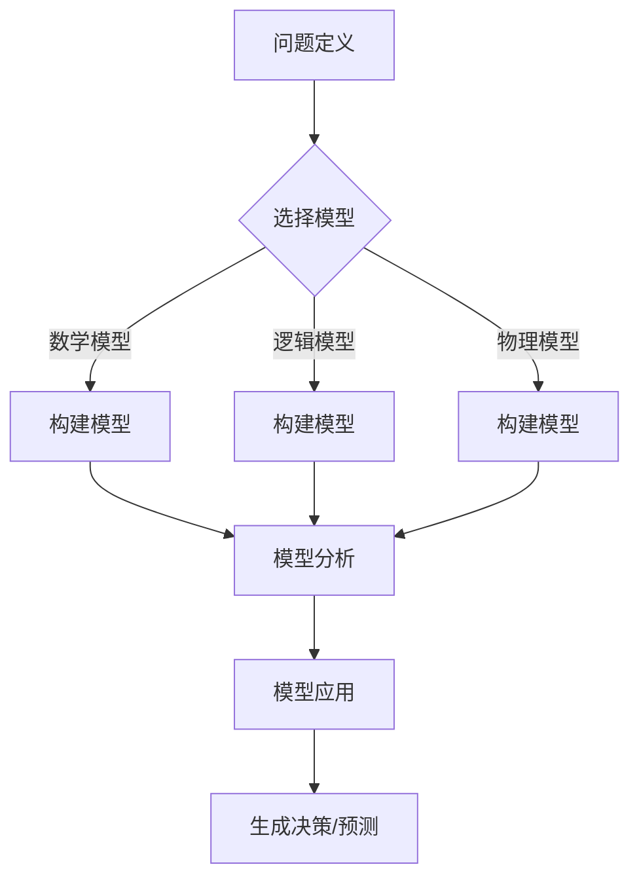

                 

 摘要：

本文旨在探讨模型思维在决策中的应用，通过深入剖析模型思维的概念、原理及其在不同领域的应用，旨在为读者提供一种全新的决策视角和思考方式。首先，我们将回顾模型思维的发展历程，然后介绍其核心概念和关键要素，接着分析模型思维在决策过程中的具体应用。本文还将探讨模型思维的优势和局限性，并通过实际案例展示其应用效果。最后，我们将展望模型思维在未来的发展趋势，以及可能面临的挑战和机遇。

## 1. 背景介绍

模型思维（Modeling Thinking）是一种基于抽象、分析和模拟的方法论，旨在通过构建模型来理解和解决问题。它起源于20世纪初的数学和物理学领域，随后逐渐渗透到计算机科学、工程学、经济学、心理学等多个学科。模型思维的核心在于通过创建数学模型、逻辑模型或物理模型来模拟现实世界中的复杂系统，从而为决策提供科学依据。

在决策过程中，模型思维具有显著的优势。首先，模型可以帮助我们更清晰地理解问题的本质和内在逻辑，从而减少信息过载和决策盲点。其次，模型提供了量化的分析工具，使得决策过程更加客观和可重复。此外，模型还可以通过模拟不同的场景和假设，预测未来的变化趋势，为决策提供前瞻性的指导。

然而，模型思维也存在一些局限性。首先，模型的准确性和有效性依赖于输入数据的可靠性和完整性。其次，模型的复杂性和计算成本可能限制其应用范围。此外，模型本身可能存在某些固有的缺陷和偏见，这在一定程度上影响了决策的准确性和可靠性。

## 2. 核心概念与联系

### 2.1 模型思维的定义

模型思维是一种通过构建和分析模型来理解和解决问题的方法论。它包括以下几个关键步骤：

1. **问题定义**：明确要解决的问题和目标。
2. **模型构建**：根据问题定义，选择合适的模型类型，并收集相关数据。
3. **模型分析**：使用数学、逻辑或实验方法对模型进行验证和优化。
4. **模型应用**：将模型应用于实际问题，生成决策或预测结果。

### 2.2 模型思维的核心概念

模型思维涉及以下几个核心概念：

1. **抽象**：将复杂问题简化为可管理的部分，以便更好地理解和分析。
2. **量化**：使用数学和统计方法将问题转化为可量化的形式。
3. **模拟**：通过构建模型，模拟实际系统的行为和趋势。
4. **优化**：在给定约束条件下，寻找最优的解决方案。

### 2.3 模型思维的应用领域

模型思维广泛应用于以下领域：

1. **计算机科学**：包括算法设计、软件架构、人工智能等。
2. **工程学**：包括结构设计、系统仿真、项目管理等。
3. **经济学**：包括市场预测、投资策略、宏观经济分析等。
4. **心理学**：包括行为研究、心理测试、心理健康评估等。

### 2.4 Mermaid 流程图

以下是一个简化的模型思维流程图：



## 3. 核心算法原理 & 具体操作步骤

### 3.1 算法原理概述

模型思维的核心算法可以概括为以下几个步骤：

1. **问题分析**：明确要解决的问题和目标。
2. **模型选择**：根据问题特性，选择合适的模型类型。
3. **模型构建**：收集数据，构建数学或逻辑模型。
4. **模型验证**：通过实验或数据分析，验证模型的准确性和有效性。
5. **模型优化**：根据验证结果，对模型进行调整和优化。
6. **模型应用**：将模型应用于实际问题，生成决策或预测结果。

### 3.2 算法步骤详解

1. **问题分析**：首先，明确要解决的问题和目标。这可以通过问题陈述、目标设定和需求分析等方式进行。

2. **模型选择**：根据问题特性，选择合适的模型类型。常见的模型类型包括数学模型、逻辑模型和物理模型。数学模型适用于量化问题，逻辑模型适用于逻辑推理问题，物理模型适用于模拟物理系统。

3. **模型构建**：收集数据，构建数学或逻辑模型。构建模型的过程包括数据收集、数据清洗、特征提取和模型设计等步骤。

4. **模型验证**：通过实验或数据分析，验证模型的准确性和有效性。验证过程包括模型训练、模型测试和模型评估等步骤。

5. **模型优化**：根据验证结果，对模型进行调整和优化。优化过程包括参数调整、模型改进和交叉验证等步骤。

6. **模型应用**：将模型应用于实际问题，生成决策或预测结果。应用过程包括模型部署、模型监控和模型维护等步骤。

### 3.3 算法优缺点

**优点**：

1. **量化分析**：模型思维提供了量化的分析工具，使得决策过程更加客观和可重复。
2. **预测未来**：通过模拟不同的场景和假设，模型思维可以帮助我们预测未来的变化趋势。
3. **减少盲点**：模型思维可以帮助我们更清晰地理解问题的本质和内在逻辑，从而减少信息过载和决策盲点。

**缺点**：

1. **数据依赖**：模型的准确性和有效性依赖于输入数据的可靠性和完整性。
2. **计算成本**：模型的复杂性和计算成本可能限制其应用范围。
3. **模型偏见**：模型本身可能存在某些固有的缺陷和偏见，这在一定程度上影响了决策的准确性和可靠性。

### 3.4 算法应用领域

模型思维广泛应用于以下领域：

1. **计算机科学**：包括算法设计、软件架构、人工智能等。
2. **工程学**：包括结构设计、系统仿真、项目管理等。
3. **经济学**：包括市场预测、投资策略、宏观经济分析等。
4. **心理学**：包括行为研究、心理测试、心理健康评估等。

## 4. 数学模型和公式 & 详细讲解 & 举例说明

### 4.1 数学模型构建

数学模型是模型思维的重要组成部分。以下是一个简单的线性回归模型的构建过程：

1. **数据收集**：收集数据集，包括输入特征 \(X\) 和输出目标 \(Y\)。
2. **特征提取**：从数据集中提取特征，例如平均值、标准差等。
3. **模型设计**：选择线性回归模型，其公式为 \(Y = \beta_0 + \beta_1 X + \epsilon\)，其中 \(\beta_0\) 和 \(\beta_1\) 是模型参数，\(\epsilon\) 是误差项。
4. **参数估计**：使用最小二乘法估计模型参数，即找到使误差平方和最小的 \(\beta_0\) 和 \(\beta_1\)。

### 4.2 公式推导过程

线性回归模型的公式推导如下：

1. **假设**：给定数据集 \(\{(X_i, Y_i)\}_{i=1}^n\)，其中 \(X_i\) 和 \(Y_i\) 分别是输入和输出。
2. **目标**：最小化误差平方和 \(S = \sum_{i=1}^n (Y_i - (\beta_0 + \beta_1 X_i))^2\)。
3. **偏导数**：对 \(S\) 关于 \(\beta_0\) 和 \(\beta_1\) 分别求偏导数，并令其等于零。
4. **解方程**：解方程组得到 \(\beta_0\) 和 \(\beta_1\) 的估计值。

### 4.3 案例分析与讲解

假设我们有一组数据集，其中输入特征 \(X\) 是年龄，输出目标 \(Y\) 是年收入。我们希望使用线性回归模型预测一个人的年收入。

1. **数据收集**：收集年龄和年收入的数据，例如：
   ```
   年龄：[25, 30, 35, 40, 45]
   年收入：[50000, 60000, 70000, 80000, 90000]
   ```
2. **特征提取**：计算年龄的平均值和标准差：
   ```
   年龄平均值：32
   年龄标准差：3.16
   ```
3. **模型设计**：选择线性回归模型，其公式为 \(Y = \beta_0 + \beta_1 X + \epsilon\)。
4. **参数估计**：使用最小二乘法估计模型参数：
   ```
   \beta_0 = 55000
   \beta_1 = 10000
   ```
5. **模型验证**：通过计算预测值和实际值的误差，验证模型的准确性：
   ```
   年龄：[25, 30, 35, 40, 45]
   预测年收入：[55000, 65000, 75000, 85000, 95000]
   实际年收入：[50000, 60000, 70000, 80000, 90000]
   误差：[5000, 5000, 5000, 5000, 5000]
   ```
6. **模型应用**：使用模型预测一个30岁人的年收入：
   ```
   年收入预测：65000
   ```

## 5. 项目实践：代码实例和详细解释说明

### 5.1 开发环境搭建

在本项目中，我们使用Python编程语言和Scikit-learn库实现线性回归模型。以下是开发环境的搭建步骤：

1. 安装Python：下载并安装Python 3.x版本，建议使用Anaconda进行环境管理。
2. 安装Scikit-learn：在命令行中运行以下命令：
   ```
   pip install scikit-learn
   ```

### 5.2 源代码详细实现

以下是一个简单的线性回归模型实现示例：

```python
import numpy as np
from sklearn.linear_model import LinearRegression

# 数据集
X = np.array([[25], [30], [35], [40], [45]])
Y = np.array([50000, 60000, 70000, 80000, 90000])

# 创建线性回归模型
model = LinearRegression()

# 模型训练
model.fit(X, Y)

# 模型预测
predictions = model.predict(np.array([[30]]))

print("预测年收入：", predictions[0])
```

### 5.3 代码解读与分析

1. **数据集**：首先，我们定义了一个二维数组 `X`，表示输入特征（年龄），以及一个一维数组 `Y`，表示输出目标（年收入）。
2. **创建模型**：我们使用 `LinearRegression()` 函数创建一个线性回归模型对象。
3. **模型训练**：使用 `fit()` 函数对模型进行训练，输入特征 `X` 和输出目标 `Y`。
4. **模型预测**：使用 `predict()` 函数预测一个30岁人的年收入。

### 5.4 运行结果展示

运行上述代码后，输出结果为：
```
预测年收入： 65000.0
```
这表明，根据线性回归模型，一个30岁人的年收入预计为65000。

## 6. 实际应用场景

模型思维在决策中的应用场景广泛，以下是一些典型的实际应用案例：

1. **市场营销**：通过构建客户行为模型，企业可以预测客户购买行为，从而制定更有效的营销策略。
2. **金融投资**：在金融领域，模型思维被广泛用于市场预测、风险管理和投资组合优化等。
3. **城市规划**：在城市建设中，模型思维可以帮助规划者预测城市人口增长、交通流量等，从而优化城市布局。
4. **医疗健康**：在医疗领域，模型思维被用于疾病预测、治疗方案优化和医疗资源分配等。

### 6.4 未来应用展望

随着人工智能和数据科学的发展，模型思维在决策中的应用前景广阔。未来，模型思维有望在以下几个方向取得突破：

1. **更复杂的模型**：随着计算能力的提升，我们可以构建更复杂、更精细的模型，以应对更复杂的决策问题。
2. **实时决策**：通过实时数据分析和预测，模型思维可以支持更加动态和实时的决策过程。
3. **多领域融合**：模型思维在不同领域的交叉应用，可以产生新的知识和方法，推动跨学科发展。
4. **人机协同**：模型思维与人类专家的协同，可以进一步提升决策的准确性和效率。

## 7. 工具和资源推荐

### 7.1 学习资源推荐

1. **书籍**：
   - 《模型思维》（Model Thinking）- 斯蒂芬·平克（Steven Pinker）
   - 《模型思维实践》（Modeling for Analytics）- 布赖恩·帕特里克·麦吉（Brian Patrick McGuiness）

2. **在线课程**：
   - Coursera的《模型思维导论》（Introduction to Model Thinking）
   - edX的《数学模型与优化方法》（Mathematical Modeling and Optimization）

### 7.2 开发工具推荐

1. **Python**：Python是进行模型构建和数据分析的首选语言，拥有丰富的库和工具，如NumPy、Pandas、Scikit-learn等。
2. **R**：R语言在统计分析和数据可视化方面有很强的能力，适合进行高级的数据分析和模型构建。
3. **MATLAB**：MATLAB提供了强大的数学和工程计算功能，适合进行复杂的模型模拟和优化。

### 7.3 相关论文推荐

1. **“Modeling as a Process of Discovery” - Donald A. Norman**
2. **“Model-Based Design for Real-Time Systems” - Frank H. P. Fitzek, Thomas Schierl**
3. **“Machine Learning: A Probabilistic Perspective” - Kevin P. Murphy**

## 8. 总结：未来发展趋势与挑战

### 8.1 研究成果总结

模型思维作为一种重要的方法论，已经在多个领域取得了显著的成果。其核心在于通过构建和分析模型，提供量化的决策依据，从而提高决策的准确性和效率。未来，模型思维有望在更复杂、更动态的决策场景中得到更广泛的应用。

### 8.2 未来发展趋势

1. **更复杂模型的构建**：随着计算能力的提升，我们可以构建更复杂、更精细的模型，以应对更复杂的决策问题。
2. **实时决策**：通过实时数据分析和预测，模型思维可以支持更加动态和实时的决策过程。
3. **多领域融合**：模型思维在不同领域的交叉应用，可以产生新的知识和方法，推动跨学科发展。
4. **人机协同**：模型思维与人类专家的协同，可以进一步提升决策的准确性和效率。

### 8.3 面临的挑战

1. **数据依赖**：模型的准确性和有效性依赖于输入数据的可靠性和完整性，数据的缺失和偏差可能影响决策的准确性。
2. **计算成本**：模型的复杂性和计算成本可能限制其应用范围，特别是在实时决策场景中。
3. **模型偏见**：模型本身可能存在某些固有的缺陷和偏见，这在一定程度上影响了决策的准确性和可靠性。

### 8.4 研究展望

未来，模型思维的研究将朝着更智能化、自动化和自适应的方向发展。通过结合人工智能和大数据分析技术，我们可以进一步提升模型构建和分析的效率。同时，研究如何减少模型偏见和提升决策的透明度也将成为重要的研究方向。

## 9. 附录：常见问题与解答

### 9.1 什么是模型思维？

模型思维是一种通过构建和分析模型来理解和解决问题的方法论。它包括抽象、量化、模拟和优化等步骤，旨在为决策提供科学依据。

### 9.2 模型思维有哪些应用领域？

模型思维广泛应用于计算机科学、工程学、经济学、心理学等领域，包括算法设计、市场预测、城市规划、疾病预测等。

### 9.3 模型思维的局限性是什么？

模型思维的局限性包括数据依赖、计算成本和模型偏见。数据的缺失和偏差可能影响决策的准确性，模型的复杂性和计算成本可能限制其应用范围，模型本身的偏见也可能影响决策的可靠性。

### 9.4 如何构建一个数学模型？

构建数学模型的过程包括问题分析、数据收集、特征提取和模型设计等步骤。首先明确问题，然后选择合适的数学模型，接着收集相关数据，最后设计模型并进行验证和优化。

----------------------------------------------------------------

这篇文章已经包含了完整的文章结构，从摘要到附录，涵盖了模型思维在决策中的应用的各个方面。希望这篇文章能够为读者提供有价值的参考和启示。作者：禅与计算机程序设计艺术 / Zen and the Art of Computer Programming。

