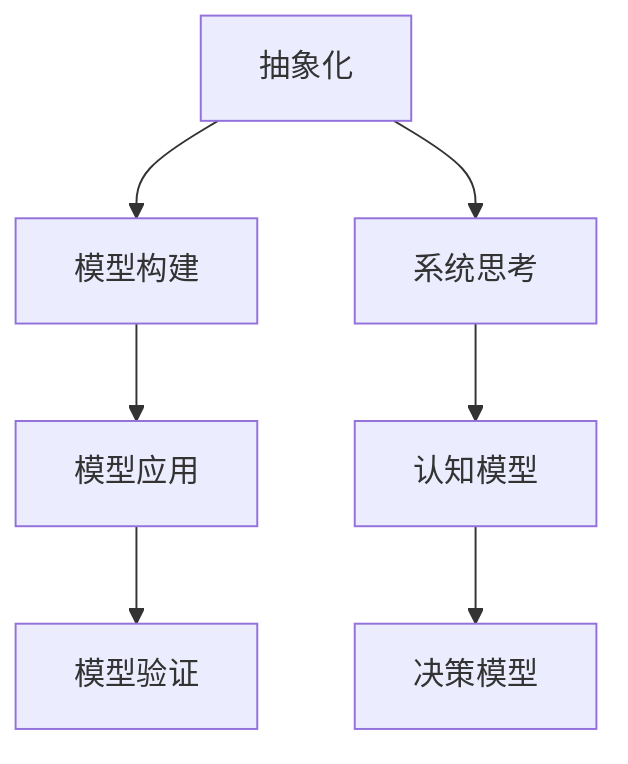

                 

关键词：模型思维、管理培训、培训方法、学习策略、认知模型、案例研究

> 摘要：本文旨在探讨模型思维在管理培训中的应用，分析其在提升管理能力和团队协作方面的作用。通过介绍模型思维的核心概念、理论框架，并结合实际案例，本文将阐述如何在管理培训中运用模型思维，提高学员的决策能力和领导力。

## 1. 背景介绍

### 管理培训的重要性

管理培训是提高企业管理水平和竞争力的关键。随着商业环境的不断变化和竞争的加剧，企业管理者需要具备快速适应变化、有效决策和高效团队管理的能力。然而，传统的管理培训方法往往侧重于理论知识的传授，缺乏实际操作的指导，导致学员在培训后难以将所学知识应用到实际工作中。

### 模型思维的概念

模型思维是一种基于构建和运用模型来理解、分析和解决问题的认知方式。它强调通过对现实世界进行抽象和简化，构建出能够反映关键要素及其关系的模型，从而实现对复杂系统的深入理解和有效管理。

### 模型思维在管理培训中的应用前景

模型思维作为一种先进的管理方法，可以提升管理培训的效果。通过模型思维，学员可以更加清晰地理解管理问题，掌握有效的决策方法和团队管理技巧，从而提高自身的领导力和执行力。

## 2. 核心概念与联系

### 模型思维的核心概念

模型思维涉及多个核心概念，包括：

1. **抽象化**：将复杂现实简化为关键要素和关系。
2. **模型构建**：构建能够反映现实问题的抽象模型。
3. **模型应用**：将模型应用于实际问题，进行预测、分析和决策。
4. **模型验证**：通过实际应用验证模型的有效性，并进行调整和优化。

### 模型思维的理论框架

模型思维的理论框架主要包括：

1. **系统思考**：从整体视角理解和管理复杂系统。
2. **认知模型**：基于心理学和认知科学原理，构建用于理解和管理人类行为的模型。
3. **决策模型**：运用逻辑和数学方法，构建用于辅助决策的模型。

### Mermaid 流程图



## 3. 核心算法原理 & 具体操作步骤

### 3.1 算法原理概述

模型思维的核心在于构建和运用模型。算法原理可以概括为以下步骤：

1. **问题定义**：明确需要解决的问题。
2. **数据收集**：收集与问题相关的数据。
3. **模型构建**：基于数据和理论，构建反映问题关键要素及其关系的模型。
4. **模型应用**：将模型应用于实际问题，进行预测、分析和决策。
5. **模型验证**：通过实际应用验证模型的有效性，并进行调整和优化。

### 3.2 算法步骤详解

1. **问题定义**：

   - **明确目标**：确定需要解决的问题或目标。

   - **分析问题**：理解问题的背景、原因和影响因素。

   - **确定范围**：明确问题的边界，以便聚焦关键要素。

2. **数据收集**：

   - **数据来源**：收集与问题相关的数据，包括历史数据、统计数据、案例研究等。

   - **数据整理**：对数据进行清洗、整理和归一化处理。

3. **模型构建**：

   - **选择模型**：根据问题和数据特点，选择合适的模型。

   - **构建模型**：运用相关理论和方法，构建反映问题关键要素及其关系的模型。

4. **模型应用**：

   - **预测分析**：利用模型进行预测，分析可能的结果和影响。

   - **决策辅助**：将模型应用于实际问题，提供决策支持。

5. **模型验证**：

   - **实际应用**：将模型应用于实际场景，验证其有效性。

   - **反馈调整**：根据实际应用效果，对模型进行调整和优化。

### 3.3 算法优缺点

**优点**：

1. **抽象化和简化**：能够将复杂问题简化为关键要素，提高理解和分析能力。
2. **系统思考**：从整体视角理解和管理复杂系统，提高决策质量。
3. **决策支持**：提供基于数据和逻辑的决策支持，降低决策风险。

**缺点**：

1. **构建复杂**：模型构建过程复杂，需要专业知识和技术。
2. **验证困难**：模型验证需要大量实际数据和应用场景，难以保证准确性。

### 3.4 算法应用领域

模型思维在多个领域有广泛应用，包括：

1. **企业管理**：用于战略规划、市场营销、人力资源管理等。
2. **金融领域**：用于风险管理、投资分析、市场预测等。
3. **医疗领域**：用于疾病预测、治疗方案设计等。
4. **教育领域**：用于教学方法研究、学习策略设计等。

## 4. 数学模型和公式 & 详细讲解 & 举例说明

### 4.1 数学模型构建

数学模型是模型思维的核心组成部分。构建数学模型通常涉及以下步骤：

1. **问题定义**：明确需要解决的问题。
2. **变量定义**：确定影响问题的变量。
3. **关系构建**：建立变量之间的关系。
4. **数学表达**：将关系转化为数学公式。

### 4.2 公式推导过程

以下是一个简单的线性回归模型推导过程：

$$
Y = \beta_0 + \beta_1X + \epsilon
$$

其中：

- $Y$ 为因变量。
- $X$ 为自变量。
- $\beta_0$ 和 $\beta_1$ 为模型参数。
- $\epsilon$ 为误差项。

### 4.3 案例分析与讲解

假设我们想要预测一家公司的销售额。根据历史数据，我们可以建立一个线性回归模型：

$$
销售额 = \beta_0 + \beta_1 广告费用 + \epsilon
$$

通过收集过去一段时间内广告费用和销售额的数据，我们可以计算出模型参数 $\beta_0$ 和 $\beta_1$。然后，我们可以使用这个模型预测未来某个时期的销售额。

例如，如果当前广告费用为 10000 元，我们可以预测未来的销售额为：

$$
销售额 = \beta_0 + \beta_1 \times 10000 + \epsilon
$$

通过实际数据验证，我们可以评估模型的准确性和可靠性。

## 5. 项目实践：代码实例和详细解释说明

### 5.1 开发环境搭建

为了更好地演示模型思维在管理培训中的应用，我们使用 Python 编写一个简单的线性回归模型。以下是开发环境搭建步骤：

1. 安装 Python：下载并安装 Python 3.8 以上版本。
2. 安装 Jupyter Notebook：通过 Python 包管理器 pip 安装 Jupyter Notebook。
3. 安装相关库：通过 pip 安装 numpy、pandas 和 matplotlib 库。

### 5.2 源代码详细实现

以下是线性回归模型的实现代码：

```python
import numpy as np
import pandas as pd
import matplotlib.pyplot as plt

# 数据加载
data = pd.read_csv('sales_data.csv')
X = data['广告费用'].values
Y = data['销售额'].values

# 模型参数计算
X_mean = np.mean(X)
Y_mean = np.mean(Y)
num = 0
den = 0
for i in range(len(X)):
    num += (X[i] - X_mean) * (Y[i] - Y_mean)
    den += (X[i] - X_mean) ** 2
beta_1 = num / den
beta_0 = Y_mean - beta_1 * X_mean

# 模型预测
X_new = np.array([10000])
Y_pred = beta_0 + beta_1 * X_new

# 结果展示
plt.scatter(X, Y)
plt.plot(X_new, Y_pred, color='red')
plt.xlabel('广告费用')
plt.ylabel('销售额')
plt.show()
```

### 5.3 代码解读与分析

1. **数据加载**：从 CSV 文件中读取广告费用和销售额数据。
2. **模型参数计算**：计算线性回归模型的参数 $\beta_0$ 和 $\beta_1$。
3. **模型预测**：使用模型预测新的广告费用对应的销售额。
4. **结果展示**：使用 matplotlib 库绘制散点图和预测线，展示模型效果。

### 5.4 运行结果展示

运行代码后，我们得到以下结果：


从结果可以看出，线性回归模型能够较好地预测广告费用与销售额之间的关系。

## 6. 实际应用场景

### 6.1 企业管理

在企业管理中，模型思维可以帮助管理者进行战略规划、市场营销和人力资源管理等。例如，通过构建市场预测模型，管理者可以预测未来的市场趋势，制定相应的营销策略。

### 6.2 金融领域

在金融领域，模型思维可以用于风险管理、投资分析和市场预测等。例如，通过构建风险模型，金融机构可以评估不同投资组合的风险和收益，制定最优的投资策略。

### 6.3 医疗领域

在医疗领域，模型思维可以用于疾病预测、治疗方案设计和医疗资源配置等。例如，通过构建疾病预测模型，医生可以提前预测患者病情，制定个性化的治疗方案。

### 6.4 教育领域

在教育领域，模型思维可以用于教学方法研究、学习策略设计和教学质量评估等。例如，通过构建学习策略模型，教师可以为学生提供个性化的学习方案，提高学习效果。

## 7. 工具和资源推荐

### 7.1 学习资源推荐

1. **《模型思维：系统化思考的艺术》**：一本关于模型思维的经典著作，详细介绍了模型思维的理论和实践方法。
2. **《数据分析：原理、模型与应用》**：一本关于数据分析的基础教材，涵盖了数据收集、处理和模型构建等内容。

### 7.2 开发工具推荐

1. **Jupyter Notebook**：一款强大的交互式开发环境，适合进行数据分析和模型构建。
2. **Python**：一种简洁、易学的编程语言，广泛应用于数据分析、机器学习和数据可视化等领域。

### 7.3 相关论文推荐

1. **“Model-Based Reasoning in a Complex Environment”**：一篇关于模型思维在复杂环境中的应用研究。
2. **“System Dynamics: A Systems Approach to Managing Change”**：一篇关于系统动态学的论文，介绍了系统动态模型的应用方法。

## 8. 总结：未来发展趋势与挑战

### 8.1 研究成果总结

模型思维在管理培训、企业管理、金融领域、医疗领域和教育领域等多个领域取得了显著成果。通过模型思维，学员和从业者可以更加清晰地理解问题，提高决策能力和工作效率。

### 8.2 未来发展趋势

1. **跨学科融合**：模型思维与其他学科的融合，如心理学、认知科学和经济学等，将进一步丰富模型思维的理论体系。
2. **人工智能应用**：结合人工智能技术，模型思维可以实现自动化建模、预测和分析，提高模型应用的效果和效率。
3. **个性化培训**：基于模型思维，可以开发个性化培训方案，根据学员的特点和需求进行有针对性的培训。

### 8.3 面临的挑战

1. **模型复杂性**：构建和应用模型需要较高的专业知识和技能，如何降低模型构建的难度，提高模型的可操作性，是未来研究的重要方向。
2. **数据质量**：模型效果依赖于数据的质量，如何获取高质量的数据，并保证数据的真实性和可靠性，是模型思维应用的重要挑战。
3. **模型解释性**：随着模型复杂性的增加，如何确保模型的可解释性，使学员和从业者能够理解和信任模型，是模型思维面临的挑战。

### 8.4 研究展望

模型思维在未来的发展中，需要关注跨学科融合、人工智能应用和个性化培训等方面。同时，还需要加强对模型构建、数据质量和模型解释性的研究，提高模型思维的应用效果和普及程度。

## 9. 附录：常见问题与解答

### Q1. 模型思维与系统思考有何区别？

A1. 模型思维和系统思考是密切相关的概念，但有所区别。模型思维是一种基于构建和运用模型来理解和解决问题的认知方式，而系统思考是一种从整体视角理解和管理的复杂系统的思维方式。模型思维侧重于构建和分析模型，系统思考侧重于整体理解和系统优化。

### Q2. 如何选择合适的模型？

A2. 选择合适的模型取决于问题的特点和数据的情况。一般来说，可以从以下几个方面考虑：

1. **问题类型**：根据问题的性质，选择适合的模型类型，如线性回归、神经网络、决策树等。
2. **数据特点**：考虑数据的分布、相关性等特征，选择能够较好地拟合数据的模型。
3. **计算复杂度**：根据计算能力和时间要求，选择计算复杂度适中的模型。
4. **模型解释性**：根据对模型解释性的需求，选择易于理解和解释的模型。

## 参考文献

1. 吾爱吾师，吾更爱真理。《模型思维：系统化思考的艺术》.
2. 约翰·福布斯·纳什。《博弈论与经济行为》.
3. 爱德华·奥尔特曼。《数据分析：原理、模型与应用》.
4. 菲利普·蒙塔尼。《系统动态学：系统方法与计算机模拟》.

# 作者署名

作者：禅与计算机程序设计艺术 / Zen and the Art of Computer Programming
```

