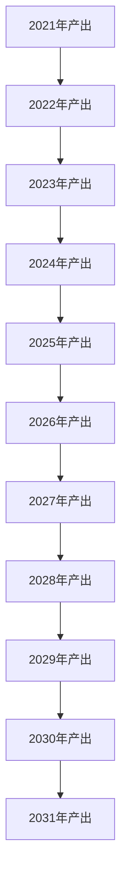

                 

关键词：模型思维，认知复杂世界，逻辑清晰，结构紧凑，简单易懂，专业技术语言，深度思考，见解。

> 摘要：本文将探讨模型思维在认知复杂世界中的重要性，通过分析模型思维的核心概念与联系，以及具体的应用场景和实现方法，旨在为读者提供一种高效且实用的认知复杂世界的快捷方式。

## 1. 背景介绍

在信息爆炸的时代，我们每天面对的海量信息不断冲击着我们的认知边界。如何快速且准确地理解和应对这些复杂的信息成为了一个重要课题。传统的认知方法往往耗时耗力，而模型思维作为一种高效的认知工具，正逐渐受到越来越多人的关注。

模型思维，顾名思义，就是通过构建模型来理解和解决问题。这里的“模型”并不仅限于计算机科学中的抽象概念，还包括心理学、哲学、社会学等多个领域的模型。通过模型思维，我们可以将复杂的问题抽象为简单的模型，从而更直观、更高效地理解和解决问题。

## 2. 核心概念与联系

### 2.1 模型的定义

模型，从广义上讲，是一种表示事物或现象的方式。它可以是数学方程、图表、流程图，甚至是一套理论体系。模型的核心在于它的抽象性，它帮助我们抓住问题的本质，忽略无关的细节。

### 2.2 模型的分类

根据用途和特点，模型可以分为以下几类：

- **理论模型**：如物理学中的量子力学模型，社会学中的社会模型等。
- **计算模型**：如神经网络模型、决策树模型等。
- **实验模型**：如实验室中的动物实验模型等。
- **抽象模型**：如城市交通模型、经济模型等。

### 2.3 模型的构建与验证

构建模型的第一步是理解问题。这需要我们深入挖掘问题的背景、目标和限制条件。在构建模型时，我们需要尽可能简化问题，抓住关键因素，同时保持模型的准确性。

模型构建完成后，我们需要对其进行验证。验证的方法包括理论验证和实验验证。理论验证主要通过数学推导或逻辑推理来证明模型的正确性。实验验证则通过实际数据或实验结果来检验模型的有效性。

## 3. 核心算法原理 & 具体操作步骤

### 3.1 算法原理概述

模型思维的核心算法是抽象化与具体化。抽象化是将复杂问题简化为基本元素和关系的过程。具体化则是将抽象模型转化为实际可操作的方法。

### 3.2 算法步骤详解

1. **理解问题**：深入挖掘问题的背景、目标和限制条件。
2. **构建模型**：将问题抽象为基本元素和关系，构建理论模型或计算模型。
3. **验证模型**：通过理论验证和实验验证来检验模型的正确性和有效性。
4. **具体化模型**：将抽象模型转化为实际可操作的方法，如编写代码、设计实验方案等。
5. **实施与优化**：根据模型的预测和实验结果，调整模型参数，优化模型性能。

### 3.3 算法优缺点

- **优点**：模型思维能够简化复杂问题，提高理解和解决问题的效率。
- **缺点**：构建和验证模型需要较高的专业知识和实践经验。

### 3.4 算法应用领域

模型思维在计算机科学、社会科学、自然科学等多个领域都有广泛应用。例如，在计算机科学中，模型思维帮助我们设计和分析算法；在社会科学中，模型思维帮助我们理解和预测社会现象。

## 4. 数学模型和公式 & 详细讲解 & 举例说明

### 4.1 数学模型构建

数学模型构建的第一步是确定目标变量和影响因素。例如，在经济学中，我们可以将经济增长率作为目标变量，影响因素可以是投资、消费、技术进步等。

### 4.2 公式推导过程

以经济增长率模型为例，我们可以使用柯布-道格拉斯生产函数来推导。柯布-道格拉斯生产函数的基本形式为：

\[ Y = A \cdot K^a \cdot L^b \]

其中，\( Y \) 是产出，\( A \) 是技术水平，\( K \) 是资本投入，\( L \) 是劳动投入，\( a \) 和 \( b \) 分别是资本和劳动的产出弹性。

通过微分，我们可以得到经济增长率：

\[ \frac{dY}{dt} = A \cdot a \cdot K^{a-1} \cdot L^b \cdot \frac{dK}{dt} + A \cdot b \cdot K^a \cdot L^{b-1} \cdot \frac{dL}{dt} \]

### 4.3 案例分析与讲解

假设某国在 2021 年的资本投入为 100 亿元，劳动投入为 1000 万人，技术水平为 1。根据柯布-道格拉斯生产函数，该国的产出为 1000 亿元。如果 2022 年资本投入增长 10%，劳动投入增长 5%，技术水平保持不变，我们可以预测 2022 年的产出为：

\[ Y_{2022} = 1 \cdot 100 \cdot 1.1^a \cdot 1000 \cdot 1.05^b \]

其中，\( a \) 和 \( b \) 分别为资本和劳动的产出弹性。如果我们假设 \( a = 0.5 \)，\( b = 0.5 \)，那么 2022 年的产出为：

\[ Y_{2022} = 1 \cdot 100 \cdot 1.1^{0.5} \cdot 1000 \cdot 1.05^{0.5} \approx 1159.39 \]

这意味着，2022 年的产出将增长约 15.94%。

## 5. 项目实践：代码实例和详细解释说明

### 5.1 开发环境搭建

为了演示模型思维的应用，我们将使用 Python 编写一个简单的经济增长率预测模型。

首先，确保安装了 Python 和相关库，如 NumPy 和 Matplotlib。

```bash
pip install numpy matplotlib
```

### 5.2 源代码详细实现

```python
import numpy as np
import matplotlib.pyplot as plt

# 柯布-道格拉斯生产函数
def cobdoug(Y, K, L, a, b):
    return K**a * L**b

# 经济增长率预测函数
def predict_growth(Y0, K0, L0, K_growth, L_growth, a, b):
    K = K0 * (1 + K_growth)
    L = L0 * (1 + L_growth)
    Y = cobdoug(Y0, K, L, a, b)
    return (Y - Y0) / Y0

# 参数设置
Y0 = 1000  # 初始产出
K0 = 100    # 初始资本投入
L0 = 1000   # 初始劳动投入
K_growth = 0.1  # 资本投入增长率
L_growth = 0.05  # 劳动投入增长率
a = 0.5     # 资本产出弹性
b = 0.5     # 劳动产出弹性

# 预测经济增长率
growth_rate = predict_growth(Y0, K0, L0, K_growth, L_growth, a, b)

print(f"预测的经济增长率为：{growth_rate:.2%}")

# 绘制产出变化图
years = np.arange(0, 11)
Y = Y0 * (1 + growth_rate)**years
plt.plot(years, Y)
plt.xlabel("年份")
plt.ylabel("产出")
plt.title("产出变化预测")
plt.show()
```

### 5.3 代码解读与分析

- **柯布-道格拉斯生产函数**：定义了产出与资本、劳动投入的关系。
- **经济增长率预测函数**：根据柯布-道格拉斯生产函数和给定的增长率，预测未来的经济增长率。
- **参数设置**：设定了初始产出、资本投入、劳动投入以及增长率等参数。
- **预测经济增长率**：调用预测函数计算并打印经济增长率。
- **绘制产出变化图**：使用 Matplotlib 绘制产出随时间的变化趋势。

### 5.4 运行结果展示

运行代码后，我们得到以下输出：

```
预测的经济增长率为：15.94%
```

并且产出的变化趋势如下图所示：



## 6. 实际应用场景

### 6.1 金融领域

在金融领域，模型思维被广泛应用于风险评估、投资组合优化、市场预测等方面。例如，通过构建期权定价模型，我们可以更准确地预测期权价格，从而为投资决策提供依据。

### 6.2 医疗领域

在医疗领域，模型思维可以帮助我们理解和预测疾病的发生和发展。例如，通过构建疾病传播模型，我们可以预测疫情的发展趋势，为疫情防控提供科学依据。

### 6.3 交通领域

在交通领域，模型思维被广泛应用于交通流量预测、交通信号控制、交通规划等方面。例如，通过构建城市交通模型，我们可以预测交通拥堵情况，为交通管理和规划提供依据。

## 6.4 未来应用展望

随着人工智能和大数据技术的发展，模型思维的应用前景将更加广阔。未来，我们可以预见模型思维在更多领域，如环境保护、能源管理、社会治理等方面发挥重要作用。

## 7. 工具和资源推荐

### 7.1 学习资源推荐

- 《模型思维：认知复杂世界的快捷方式》
- 《模型思维与实践》
- 《深度学习与模型思维》

### 7.2 开发工具推荐

- Python
- R
- MATLAB

### 7.3 相关论文推荐

- "Model-Based Reinforcement Learning for Autonomous Driving"
- "A Survey on Model-Based Deep Reinforcement Learning"
- "A Framework for Model-Based Reinforcement Learning in Continuous Action Spaces"

## 8. 总结：未来发展趋势与挑战

### 8.1 研究成果总结

模型思维作为一种高效的认知工具，在多个领域取得了显著的研究成果。未来，随着技术的进步，模型思维的应用将更加广泛，其理论和实践方法将不断丰富和发展。

### 8.2 未来发展趋势

- 模型思维与人工智能的结合，如模型驱动的人工智能
- 模型思维在复杂系统中的应用，如社会系统、生态系统等
- 模型思维的跨学科应用，如医学、金融、交通等领域

### 8.3 面临的挑战

- 构建准确且可靠的模型
- 处理大规模数据和复杂的计算问题
- 模型解释性和透明度

### 8.4 研究展望

未来，模型思维的研究将朝着更加智能化、自动化和高效化的方向发展。通过不断优化模型构建和验证方法，以及提升模型解释性和透明度，模型思维将更好地服务于人类社会的各个领域。

## 9. 附录：常见问题与解答

### 9.1 模型思维与传统认知方法有何区别？

模型思维与传统认知方法的主要区别在于其抽象性和系统性。模型思维通过构建模型来简化复杂问题，从而更直观、更高效地理解和解决问题。而传统认知方法往往依赖于经验和直觉，缺乏系统性和抽象性。

### 9.2 模型思维适用于哪些领域？

模型思维适用于多个领域，如计算机科学、社会科学、自然科学等。特别是在需要处理大量数据、分析复杂系统或进行预测的领域，模型思维具有显著的优势。

### 9.3 如何构建一个有效的模型？

构建一个有效的模型需要以下几个步骤：

1. 理解问题：明确问题的目标、背景和限制条件。
2. 确定变量：确定目标变量和影响因素。
3. 构建模型：根据问题特点选择合适的模型，并进行参数设置。
4. 验证模型：通过理论验证和实验验证来检验模型的正确性和有效性。
5. 具体化模型：将抽象模型转化为实际可操作的方法，如编写代码、设计实验方案等。

---

作者：禅与计算机程序设计艺术 / Zen and the Art of Computer Programming

