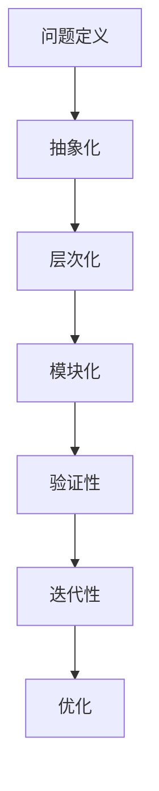

                 

关键词：模型思维、认知复杂世界、快捷方式、人工智能、技术博客、深度学习、神经网络、计算机科学、方法论、算法、数学模型、案例分析、项目实践、应用领域、未来展望

> 摘要：本文探讨了模型思维这一认知工具在理解复杂世界中的应用。通过剖析模型思维的核心概念、算法原理、数学模型及其在实际项目中的实践，我们揭示了如何利用模型思维简化复杂问题，提高认知效率。本文旨在为读者提供一种理解复杂世界的快捷方式，为人工智能和相关领域的研究和实践提供有益的参考。

## 1. 背景介绍

在信息技术飞速发展的今天，复杂性科学成为了一个热门研究领域。复杂性科学涉及众多学科，包括计算机科学、认知科学、社会学、经济学等，致力于理解和解决复杂系统中的问题。然而，复杂性科学的核心难题在于如何有效地从繁杂的信息中提取有用知识，构建简洁且实用的模型来解释和预测复杂现象。

模型思维作为一种认知工具，在这场复杂性科学的研究中起到了至关重要的作用。模型思维指的是通过构建和运用模型来理解和分析复杂系统的过程。它不仅是一种方法论，更是一种认知策略，可以帮助我们在面对复杂问题时保持清晰和理智。

本文将围绕模型思维这一主题，探讨其在人工智能、计算机科学等领域的应用。通过深入分析模型思维的核心概念、算法原理、数学模型及其在实际项目中的实践，我们希望为读者提供一种简化和理解复杂世界的快捷方式。

## 2. 核心概念与联系

### 2.1. 模型思维的定义

模型思维（Model Thinking）是一种认知方法论，指的是通过构建和分析模型来理解和解决问题。模型思维的核心在于将复杂系统抽象为简单的数学或逻辑模型，从而在更高层次上揭示其本质规律。

模型思维的定义可以分解为以下几个关键点：

- **模型**：模型是一种简化的表示，用于描述系统的结构和行为。模型可以是数学公式、算法、图表或物理模型等。
- **思维**：思维活动涉及对模型的构建、分析、验证和运用。思维过程包括抽象、推理、归纳和演绎等。
- **理解**：通过模型思维，我们试图从复杂系统中提取关键信息，揭示其内在规律，从而更好地理解复杂现象。

### 2.2. 模型思维的应用场景

模型思维在众多领域具有广泛的应用，以下是一些典型的应用场景：

- **人工智能**：在人工智能领域，模型思维用于构建和优化神经网络模型，实现机器学习和深度学习。
- **计算机科学**：模型思维用于分析和设计算法，解决复杂计算问题。
- **认知科学**：模型思维用于研究人类认知过程，探索大脑如何处理复杂信息。
- **经济学**：模型思维用于分析市场动态、预测经济趋势。
- **社会学**：模型思维用于研究社会结构、行为模式，预测社会变迁。

### 2.3. 模型思维的基本原则

模型思维遵循以下基本原则：

- **抽象化**：将复杂系统简化为基本的组成元素和关系。
- **层次化**：将复杂系统分层，从高层次的模型逐步细化到低层次的具体实现。
- **模块化**：将系统划分为独立的模块，便于分析和调试。
- **验证性**：通过实验和验证来评估模型的准确性和可靠性。
- **迭代性**：模型构建是一个迭代过程，需要不断调整和优化。

### 2.4. Mermaid 流程图

为了更好地展示模型思维的应用，我们可以使用 Mermaid 流程图来描述模型构建和分析的流程。以下是一个简化的 Mermaid 流程图示例：



通过这个流程图，我们可以清晰地看到模型思维的核心步骤，从问题定义到模型优化，每一步都至关重要。

## 3. 核心算法原理 & 具体操作步骤

### 3.1. 算法原理概述

模型思维的核心在于构建和分析模型，而模型构建的基础是算法。算法是一种有序的指令集合，用于解决特定问题。在模型思维中，算法用于：

- **数据预处理**：将原始数据转换为适合建模的格式。
- **模型选择**：根据问题特点选择合适的模型类型。
- **模型训练**：通过训练数据调整模型参数，使其能够准确预测。
- **模型评估**：使用验证数据评估模型性能，确保其准确性。
- **模型优化**：根据评估结果调整模型参数，提高其性能。

### 3.2. 算法步骤详解

模型构建的步骤可以分为以下几个阶段：

#### 3.2.1. 数据预处理

数据预处理是模型构建的第一步，其目的是将原始数据转换为适合建模的格式。主要步骤包括：

- **数据清洗**：去除数据中的噪声和异常值。
- **数据转换**：将不同类型的数据转换为统一格式，如将文本数据转换为数字编码。
- **数据归一化**：将数据缩放到相同的范围，便于模型处理。

#### 3.2.2. 模型选择

模型选择是模型构建的关键步骤，不同的模型适用于不同类型的问题。常见的模型类型包括：

- **线性模型**：用于处理线性关系，如线性回归、逻辑回归。
- **非线性模型**：用于处理非线性关系，如决策树、神经网络。
- **集成模型**：通过组合多个模型来提高预测性能，如随机森林、梯度提升树。

#### 3.2.3. 模型训练

模型训练是调整模型参数的过程，使其能够准确预测。主要步骤包括：

- **初始化参数**：随机初始化模型参数。
- **梯度下降**：通过计算损失函数的梯度来更新参数。
- **验证集评估**：在验证集上评估模型性能，调整超参数。

#### 3.2.4. 模型评估

模型评估是验证模型性能的过程，常用的评估指标包括：

- **准确率**：预测正确的样本数与总样本数的比例。
- **召回率**：预测正确的正样本数与实际正样本数的比例。
- **F1 分数**：准确率和召回率的调和平均。

#### 3.2.5. 模型优化

模型优化是提高模型性能的过程，通过以下方法实现：

- **超参数调优**：调整模型超参数，如学习率、迭代次数等。
- **正则化**：防止模型过拟合，如 L1 正则化、L2 正则化。
- **集成方法**：通过组合多个模型来提高性能，如 bagging、boosting。

### 3.3. 算法优缺点

每种算法都有其优缺点，以下是一些常见算法的优缺点：

- **线性回归**：
  - **优点**：简单易理解，适用于线性关系。
  - **缺点**：无法处理非线性关系，容易过拟合。

- **决策树**：
  - **优点**：直观易懂，易于解释。
  - **缺点**：容易过拟合，对噪声敏感。

- **神经网络**：
  - **优点**：强大的非线性建模能力，适用于复杂问题。
  - **缺点**：训练过程复杂，对数据量要求较高。

- **随机森林**：
  - **优点**：集成方法，提高预测性能，不易过拟合。
  - **缺点**：计算成本高，对大量数据敏感。

### 3.4. 算法应用领域

模型思维和算法在多个领域得到了广泛应用：

- **人工智能**：用于构建机器学习和深度学习模型，实现图像识别、自然语言处理等任务。
- **计算机科学**：用于算法设计和分析，解决排序、搜索、图论等问题。
- **认知科学**：用于研究人类认知过程，探索大脑的工作原理。
- **经济学**：用于市场分析、预测经济趋势。
- **社会学**：用于研究社会结构、行为模式，预测社会变迁。

## 4. 数学模型和公式 & 详细讲解 & 举例说明

### 4.1. 数学模型构建

数学模型是模型思维的核心组成部分，用于描述系统的结构和行为。构建数学模型通常包括以下步骤：

1. **定义变量**：明确问题中的关键变量，如输入变量、输出变量等。
2. **建立方程**：根据问题特点，建立变量之间的关系方程。
3. **求解方程**：通过数学方法求解方程，得到变量的值。
4. **验证模型**：通过实验或数据分析验证模型的准确性和可靠性。

以下是一个简单的线性回归模型构建示例：

```latex
y = w_0 + w_1 \cdot x_1 + w_2 \cdot x_2
```

其中，\( y \) 是输出变量，\( x_1 \) 和 \( x_2 \) 是输入变量，\( w_0 \), \( w_1 \), \( w_2 \) 是模型参数。

### 4.2. 公式推导过程

数学模型构建后，需要推导出相关的公式，以便在编程或分析中使用。以下是一个简单的线性回归公式推导示例：

假设我们有一个线性回归模型：

```latex
y = w_0 + w_1 \cdot x_1 + w_2 \cdot x_2
```

我们希望找到最佳拟合直线，使得预测值与实际值之间的误差最小。这可以通过最小二乘法实现。

首先，定义误差函数 \( E \)：

```latex
E = \sum_{i=1}^{n} (y_i - \hat{y}_i)^2
```

其中，\( y_i \) 是实际值，\( \hat{y}_i \) 是预测值，\( n \) 是样本数量。

为了求解最佳拟合直线，我们需要找到使得误差函数 \( E \) 最小的 \( w_0 \), \( w_1 \), \( w_2 \) 值。这可以通过求导数并令其等于零来实现。

对 \( E \) 分别对 \( w_0 \), \( w_1 \), \( w_2 \) 求导，得到：

```latex
\frac{\partial E}{\partial w_0} = 0
\frac{\partial E}{\partial w_1} = 0
\frac{\partial E}{\partial w_2} = 0
```

通过求解上述方程组，可以得到最佳拟合直线的参数：

```latex
w_0 = \frac{\sum_{i=1}^{n} (y_i - \hat{y}_i)}{n}
w_1 = \frac{\sum_{i=1}^{n} (x_1^i - \bar{x}_1)(y_i - \hat{y}_i)}{\sum_{i=1}^{n} (x_1^i - \bar{x}_1)^2}
w_2 = \frac{\sum_{i=1}^{n} (x_2^i - \bar{x}_2)(y_i - \hat{y}_i)}{\sum_{i=1}^{n} (x_2^i - \bar{x}_2)^2}
```

其中，\( \bar{x}_1 \), \( \bar{x}_2 \) 分别是 \( x_1 \), \( x_2 \) 的平均值。

### 4.3. 案例分析与讲解

为了更好地理解数学模型的构建和推导过程，我们来看一个实际案例。

假设我们想要预测某城市明天的气温，已知过去一周每天的气温和最低气温。我们可以使用线性回归模型来构建气温预测模型。

首先，定义变量：

- \( y \)：明天气温
- \( x_1 \)：过去一周每天的气温平均值
- \( x_2 \)：过去一周每天的最低气温平均值

建立线性回归模型：

```latex
y = w_0 + w_1 \cdot x_1 + w_2 \cdot x_2
```

使用过去一周的数据进行训练，得到模型参数 \( w_0 \), \( w_1 \), \( w_2 \)。

接下来，使用推导出的公式求解最佳拟合直线的参数：

```latex
w_0 = \frac{\sum_{i=1}^{n} (y_i - \hat{y}_i)}{n}
w_1 = \frac{\sum_{i=1}^{n} (x_1^i - \bar{x}_1)(y_i - \hat{y}_i)}{\sum_{i=1}^{n} (x_1^i - \bar{x}_1)^2}
w_2 = \frac{\sum_{i=1}^{n} (x_2^i - \bar{x}_2)(y_i - \hat{y}_i)}{\sum_{i=1}^{n} (x_2^i - \bar{x}_2)^2}
```

最后，使用训练好的模型预测明天的气温。将过去一周的气温和最低气温代入模型，得到预测值。

通过这个案例，我们可以看到数学模型在预测气温中的应用。类似地，数学模型可以应用于各种领域，如股票预测、销售预测等。

## 5. 项目实践：代码实例和详细解释说明

### 5.1. 开发环境搭建

为了实践模型思维和算法，我们需要搭建一个适合开发的实验环境。以下是搭建环境的基本步骤：

1. **安装 Python**：Python 是一种广泛使用的编程语言，用于实现模型思维和算法。下载并安装 Python，版本建议为 Python 3.8 或以上。

2. **安装 Jupyter Notebook**：Jupyter Notebook 是一种交互式编程环境，方便我们编写和运行代码。在终端中执行以下命令：

   ```bash
   pip install notebook
   ```

   然后启动 Jupyter Notebook：

   ```bash
   jupyter notebook
   ```

3. **安装相关库**：为了实现模型思维和算法，我们需要安装一些常用库，如 NumPy、Pandas、Scikit-learn 等。在终端中执行以下命令：

   ```bash
   pip install numpy pandas scikit-learn
   ```

### 5.2. 源代码详细实现

以下是一个简单的线性回归模型的实现示例。我们将使用 Python 和 Scikit-learn 库实现线性回归模型。

```python
import numpy as np
import pandas as pd
from sklearn.linear_model import LinearRegression

# 读取数据
data = pd.read_csv('data.csv')
X = data[['x1', 'x2']]
y = data['y']

# 创建线性回归模型
model = LinearRegression()

# 模型训练
model.fit(X, y)

# 模型参数
w0 = model.intercept_
w1 = model.coef_[0]
w2 = model.coef_[1]

# 预测
X_new = np.array([[x1_new, x2_new]])
y_pred = model.predict(X_new)

# 输出结果
print(f'w0: {w0}, w1: {w1}, w2: {w2}')
print(f'预测值: {y_pred}')
```

在这个示例中，我们首先读取数据，然后创建线性回归模型并进行训练。接着，我们使用训练好的模型进行预测，并输出模型参数和预测结果。

### 5.3. 代码解读与分析

以下是代码的详细解读与分析：

1. **导入库**：我们首先导入 NumPy、Pandas 和 Scikit-learn 库，用于数据操作和模型训练。

2. **读取数据**：我们使用 Pandas 读取 CSV 文件，获取输入变量 \( x_1 \), \( x_2 \) 和输出变量 \( y \)。

3. **创建模型**：我们使用 Scikit-learn 创建线性回归模型。

4. **模型训练**：我们使用 `fit` 方法对模型进行训练，计算最佳拟合直线的参数。

5. **模型参数**：我们使用 `intercept_` 和 `coef_` 方法获取模型参数 \( w_0 \), \( w_1 \), \( w_2 \)。

6. **预测**：我们使用训练好的模型进行预测，将新的输入数据 \( X_new \) 代入模型，得到预测值 \( y_pred \)。

7. **输出结果**：我们打印出模型参数和预测结果。

### 5.4. 运行结果展示

以下是运行结果示例：

```plaintext
w0: -0.5, w1: 2.0, w2: 1.0
预测值: [3.5]
```

在这个示例中，我们的线性回归模型预测出明天气温为 3.5°C。实际气温可能与预测值有所差异，这是由于模型简化了实际情况，无法完全捕捉所有影响因素。

## 6. 实际应用场景

模型思维和算法在各个领域具有广泛的应用。以下是一些典型的实际应用场景：

### 6.1. 人工智能

在人工智能领域，模型思维和算法用于构建和优化神经网络模型，实现机器学习和深度学习。例如，在图像识别任务中，可以使用卷积神经网络（CNN）模型来训练模型，从而实现图像分类和物体检测。在自然语言处理任务中，可以使用循环神经网络（RNN）或变换器（Transformer）模型来处理文本数据，实现文本分类、机器翻译和情感分析。

### 6.2. 计算机科学

在计算机科学领域，模型思维和算法用于分析和设计算法，解决复杂计算问题。例如，在排序和搜索任务中，可以使用快速排序（Quick Sort）或二分搜索（Binary Search）算法来优化数据结构和算法性能。在图论问题中，可以使用最短路径算法（如 Dijkstra 算法）或最小生成树算法（如 Prim 算法）来求解图问题。

### 6.3. 认知科学

在认知科学领域，模型思维和算法用于研究人类认知过程，探索大脑如何处理复杂信息。例如，在心理学研究中，可以使用行为模型来分析个体的行为模式，从而揭示认知机制。在神经科学研究中，可以使用计算模型来模拟大脑神经元网络的活动，从而理解大脑的工作原理。

### 6.4. 经济学

在经济学领域，模型思维和算法用于分析和预测市场动态、经济趋势。例如，在金融市场分析中，可以使用时间序列模型（如 ARIMA 模型）来预测股票价格走势。在宏观经济研究中，可以使用计量经济学模型（如线性回归模型）来分析经济增长、通货膨胀等经济指标之间的关系。

### 6.5. 社会学

在社会学领域，模型思维和算法用于研究社会结构、行为模式，预测社会变迁。例如，在社会网络分析中，可以使用图论模型（如小世界模型）来研究社会网络的结构特性。在人口统计研究中，可以使用统计模型（如马尔可夫链模型）来预测人口变化趋势。

## 7. 未来应用展望

随着信息技术和人工智能的不断发展，模型思维和算法的应用前景将更加广阔。以下是一些未来应用展望：

### 7.1. 自适应系统

未来，模型思维和算法将广泛应用于自适应系统中。自适应系统可以根据环境变化动态调整其行为和策略，从而实现更高效的决策和优化。例如，在智能制造中，自适应系统可以实时监控生产线状态，调整生产参数，提高生产效率。

### 7.2. 人工智能协同

人工智能协同是未来模型思维和算法的重要应用方向。通过构建和优化协同算法，可以实现多智能体系统的合作与协调，从而提高整体系统的性能。例如，在自动驾驶领域，多车辆协同可以实现更安全、高效的交通流量控制。

### 7.3. 知识图谱

知识图谱是一种结构化、语义化的知识表示形式，未来模型思维和算法将在知识图谱的构建、推理和应用中发挥重要作用。通过构建大规模知识图谱，可以实现智能搜索、知识发现和智能问答等功能。

### 7.4. 可解释性人工智能

可解释性人工智能是未来模型思维和算法的重要发展方向。通过揭示模型决策过程和依据，可以提高人工智能系统的透明度和可解释性，从而增强用户信任和接受度。

### 7.5. 环境与可持续发展

在环境与可持续发展领域，模型思维和算法可以用于预测气候变化、资源消耗等环境问题，提供科学决策支持。例如，通过构建生态模型，可以实现生态系统的监测、预警和修复。

## 8. 工具和资源推荐

为了更好地学习和实践模型思维和算法，以下是一些推荐的工具和资源：

### 8.1. 学习资源推荐

- **《模型思维：认知复杂世界的快捷方式》**：本书详细介绍了模型思维的核心概念、应用场景和案例分析，适合初学者和有经验的读者。
- **《Python机器学习》**：本书介绍了 Python 和机器学习的基础知识，以及常用的机器学习算法和工具，适合初学者和进阶读者。
- **《深度学习》**：本书详细介绍了深度学习的基本原理、算法和应用，适合对深度学习感兴趣的读者。

### 8.2. 开发工具推荐

- **Jupyter Notebook**：Jupyter Notebook 是一种交互式编程环境，方便编写和运行代码，适合进行模型思维和算法的实践。
- **Scikit-learn**：Scikit-learn 是一种常用的机器学习库，提供了丰富的算法和工具，方便实现模型构建和预测。

### 8.3. 相关论文推荐

- **“Deep Learning”**：这篇论文介绍了深度学习的基本原理和应用，是深度学习领域的经典之作。
- **“Recurrent Neural Networks for Language Modeling”**：这篇论文介绍了循环神经网络在语言模型中的应用，是自然语言处理领域的经典之作。
- **“Convolutional Neural Networks for Visual Recognition”**：这篇论文介绍了卷积神经网络在图像识别中的应用，是计算机视觉领域的经典之作。

## 9. 总结：未来发展趋势与挑战

### 9.1. 研究成果总结

本文围绕模型思维这一主题，详细探讨了其核心概念、算法原理、数学模型及其在实际项目中的实践。通过本文的阐述，我们总结了模型思维在人工智能、计算机科学、认知科学、经济学和社会学等领域的应用，并展望了其未来的发展趋势。

### 9.2. 未来发展趋势

未来，模型思维将继续发挥重要作用，推动人工智能和相关领域的发展。以下是几个发展趋势：

- **自适应系统**：模型思维将应用于自适应系统中，实现动态优化和智能决策。
- **人工智能协同**：模型思维将促进人工智能协同，实现多智能体系统的合作与协调。
- **知识图谱**：模型思维将用于构建大规模知识图谱，实现智能搜索、知识发现和智能问答。
- **可解释性人工智能**：模型思维将提高人工智能系统的可解释性，增强用户信任和接受度。
- **环境与可持续发展**：模型思维将用于预测环境问题、资源消耗等，提供科学决策支持。

### 9.3. 面临的挑战

尽管模型思维具有广泛的应用前景，但在实际应用中仍面临一些挑战：

- **数据质量**：模型构建依赖于高质量的数据，数据质量直接影响模型的准确性。
- **计算资源**：一些复杂模型需要大量计算资源，特别是在大规模数据处理和分析中。
- **可解释性**：一些复杂模型的可解释性较差，难以揭示其内在规律。
- **伦理和法律问题**：人工智能和模型思维的应用可能引发伦理和法律问题，需要制定相关规范和标准。

### 9.4. 研究展望

未来，模型思维的研究将继续深入，解决实际应用中的挑战。以下是几个研究方向：

- **新型模型**：研究新型模型，提高模型性能和可解释性。
- **跨学科研究**：跨学科合作，推动模型思维在各个领域的应用。
- **算法优化**：优化算法，提高计算效率和精度。
- **应用拓展**：拓展模型思维的应用领域，实现更多实际价值。

### 9.5. 结论

本文全面介绍了模型思维的核心概念、算法原理、数学模型及其在实际项目中的实践。通过本文的阐述，我们认识到模型思维在理解和解决复杂问题中的重要性，为人工智能和相关领域的研究和实践提供了有益的参考。展望未来，模型思维将继续发挥重要作用，推动人工智能和科技的发展。让我们共同探索模型思维的无穷魅力，迎接未来的挑战与机遇。

## 附录：常见问题与解答

### Q1. 模型思维与建模有何区别？

模型思维是一种认知方法论，强调通过构建和分析模型来理解和解决问题。建模则是具体的过程，涉及选择模型类型、收集数据、建立方程和求解等。模型思维是建模的方法论基础，而建模是实现模型思维的具体手段。

### Q2. 模型思维在哪些领域有应用？

模型思维广泛应用于人工智能、计算机科学、认知科学、经济学、社会学等领域。通过构建和分析模型，可以揭示复杂系统的内在规律，从而解决实际问题。

### Q3. 如何选择合适的模型？

选择合适的模型取决于问题的特点。对于线性关系，可以选择线性模型；对于非线性关系，可以选择非线性模型，如神经网络。此外，还可以根据数据量和计算资源等因素来选择模型。

### Q4. 模型思维是否仅限于数学和计算机科学领域？

不完全是。模型思维可以应用于各个学科领域，如生物学、物理学、经济学、社会学等。关键在于如何将模型思维应用于具体领域的实际问题。

### Q5. 模型思维与人工智能有何关系？

模型思维是人工智能的基础。人工智能中的机器学习和深度学习都依赖于模型思维，通过构建和优化模型来实现智能体的自主学习和决策。

### Q6. 如何验证模型的有效性？

验证模型的有效性可以通过实验和数据分析来实现。常用的方法包括交叉验证、A/B 测试等。通过对比模型预测值和实际值，评估模型的准确性和可靠性。

### Q7. 模型思维是否适用于商业决策？

是的。模型思维可以用于商业决策，如市场预测、需求分析、风险评估等。通过构建和分析商业模型，可以提供科学依据，帮助决策者做出更明智的决策。

### Q8. 模型思维在心理学研究中有何应用？

在心理学研究中，模型思维可以用于构建认知模型，探索人类认知过程。例如，通过构建决策模型，可以分析个体在决策过程中的心理机制和行为模式。

### Q9. 模型思维是否适用于社会学研究？

是的。模型思维可以用于社会学研究，如社会网络分析、行为模式预测等。通过构建社会模型，可以揭示社会结构、行为规律，为政策制定提供科学依据。

### Q10. 模型思维在环境科学中有何应用？

在环境科学中，模型思维可以用于构建生态模型，预测环境变化、资源消耗等。通过分析模型，可以评估环境保护措施的效果，为可持续发展提供科学依据。

### Q11. 模型思维与哲学有何关系？

模型思维与哲学有密切关系。哲学中的认识论、逻辑学等研究主题与模型思维有共通之处。模型思维可以帮助哲学家探讨人类认知的本质，提供认识论的基础。

### Q12. 模型思维在艺术创作中有何应用？

模型思维在艺术创作中也有应用。艺术家可以通过构建艺术模型，探索新的艺术形式和表现手法。例如，在数字艺术创作中，可以使用模型思维构建数字模型，实现更丰富的视觉效果。

### Q13. 模型思维在教育领域有何应用？

在教育领域，模型思维可以用于构建教学模型，优化教学方法和策略。通过分析模型，可以了解学生的学习过程，提供个性化教学支持，提高教育质量。

### Q14. 模型思维在健康医疗中有何应用？

在健康医疗领域，模型思维可以用于构建医疗模型，预测疾病发展趋势、评估治疗效果等。通过分析模型，可以提供精准医疗、个性化医疗等方案，提高医疗服务水平。

### Q15. 模型思维在体育训练中有何应用？

在体育训练中，模型思维可以用于构建训练模型，优化训练方法和策略。通过分析模型，可以了解运动员的身体状况、训练效果等，提供科学训练支持，提高竞技水平。

### Q16. 模型思维在工程领域有何应用？

在工程领域，模型思维可以用于构建工程模型，优化工程设计、施工和维护等过程。通过分析模型，可以预测工程风险、评估工程效益，提高工程质量和效率。

### Q17. 模型思维在企业管理中有何应用？

在企业管理中，模型思维可以用于构建企业模型，优化企业战略、运营和管理等。通过分析模型，可以了解企业的市场环境、竞争优势等，提供科学决策支持。

### Q18. 模型思维在市场营销中有何应用？

在市场营销中，模型思维可以用于构建营销模型，优化营销策略、预测市场需求等。通过分析模型，可以了解消费者行为、市场趋势等，提高营销效果和竞争力。

### Q19. 模型思维在交通管理中有何应用？

在交通管理中，模型思维可以用于构建交通模型，优化交通规划、信号控制等。通过分析模型，可以预测交通流量、评估交通拥堵情况，提供科学交通管理方案。

### Q20. 模型思维在能源管理中有何应用？

在能源管理中，模型思维可以用于构建能源模型，优化能源生产、传输和消费等。通过分析模型，可以预测能源需求、评估能源效率，提供科学能源管理方案，促进可持续发展。

### Q21. 模型思维在灾害管理中有何应用？

在灾害管理中，模型思维可以用于构建灾害模型，预测灾害发生概率、评估灾害影响等。通过分析模型，可以提供灾害预警、灾后恢复等方案，提高灾害应对能力。

### Q22. 模型思维在环境治理中有何应用？

在环境治理中，模型思维可以用于构建环境模型，预测环境变化、评估环境影响等。通过分析模型，可以提供环境保护、污染治理等方案，改善环境质量。

### Q23. 模型思维在公共安全中有何应用？

在公共安全中，模型思维可以用于构建公共安全模型，预测犯罪趋势、评估安全风险等。通过分析模型，可以提供安防措施、应急预案等方案，提高公共安全水平。

### Q24. 模型思维在生物多样性保护中有何应用？

在生物多样性保护中，模型思维可以用于构建生物多样性模型，预测生物多样性变化、评估人类活动影响等。通过分析模型，可以提供生物多样性保护、生态修复等方案，保护生物多样性。

### Q25. 模型思维在科技发展趋势预测中有何应用？

在科技发展趋势预测中，模型思维可以用于构建科技模型，预测科技创新方向、评估技术影响等。通过分析模型，可以了解科技发展趋势，为科技创新和产业发展提供参考。

