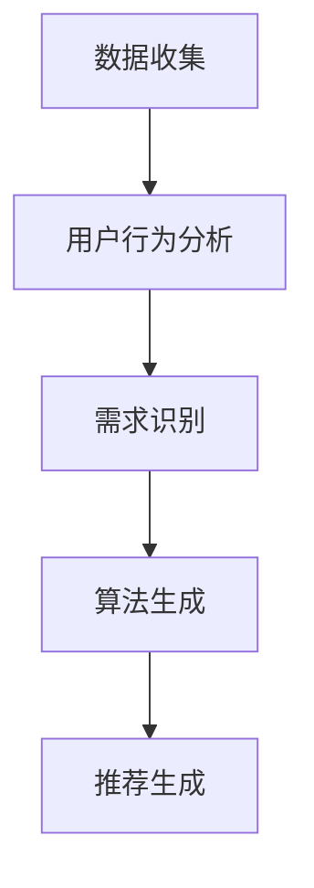

                 

关键词：欲望个性化引擎、AI定制、需求满足系统、机器学习、数据挖掘、用户行为分析、大数据处理

> 摘要：随着人工智能技术的发展，如何通过AI实现个性化需求满足成为了一个热门话题。本文将探讨欲望个性化引擎的概念、核心原理、算法原理、数学模型、实际应用场景以及未来发展趋势，为AI在需求满足领域的应用提供新的思路和方向。

## 1. 背景介绍

在当今社会，个性化需求已经成为人们追求的重要目标。无论是购物、娱乐、教育还是医疗等领域，用户对于个性化服务的需求日益增长。然而，如何实现个性化需求满足，成为了一个复杂且具有挑战性的问题。传统的方法往往依赖于用户的历史行为数据和偏好设置，但这种方法的效率有限，难以满足用户多样化的需求。

随着人工智能技术的快速发展，特别是机器学习和数据挖掘技术的应用，实现个性化需求满足成为可能。AI可以通过学习用户的行为和偏好，自动生成个性化的推荐系统，为用户提供更加符合其需求的服务。在这种背景下，欲望个性化引擎的概念应运而生。

欲望个性化引擎是一种基于人工智能技术的系统，它能够根据用户的个性化需求，自动生成和调整满足这些需求的策略和方案。这种系统不仅能够提高用户的满意度，还能够提升企业的竞争力。

## 2. 核心概念与联系

### 2.1. 欲望个性化引擎的定义

欲望个性化引擎是一种基于人工智能技术的系统，它能够根据用户的个性化需求，自动生成和调整满足这些需求的策略和方案。这个系统包括以下几个核心组成部分：

- **用户行为分析模块**：负责收集和分析用户的行为数据，包括浏览、购买、评价等，以了解用户的偏好和需求。
- **需求识别模块**：基于用户行为分析的结果，识别用户的潜在需求，并将这些需求转化为可操作的目标。
- **算法引擎**：负责根据需求识别的结果，自动生成和调整满足这些需求的策略和方案。
- **推荐系统**：根据算法引擎的输出，生成个性化的推荐，为用户提供满足需求的服务。

### 2.2. 欲望个性化引擎的工作原理

欲望个性化引擎的工作原理可以分为以下几个步骤：

1. **数据收集**：收集用户的行为数据，如浏览记录、购买历史、评价等。
2. **用户行为分析**：通过数据挖掘和机器学习技术，分析用户的行为数据，识别用户的偏好和需求。
3. **需求识别**：基于用户行为分析的结果，识别用户的潜在需求，并将这些需求转化为可操作的目标。
4. **算法生成**：算法引擎根据需求识别的结果，自动生成满足这些需求的策略和方案。
5. **推荐生成**：推荐系统根据算法引擎的输出，生成个性化的推荐，为用户提供满足需求的服务。

### 2.3. 欲望个性化引擎的架构

欲望个性化引擎的架构如图1所示：



图1：欲望个性化引擎的架构图

## 3. 核心算法原理 & 具体操作步骤

### 3.1. 算法原理概述

欲望个性化引擎的核心算法是基于协同过滤和深度学习技术。协同过滤技术通过分析用户之间的相似度，为用户提供个性化的推荐。深度学习技术则通过学习用户的行为数据，自动生成满足用户需求的策略和方案。

### 3.2. 算法步骤详解

1. **数据预处理**：对用户行为数据进行清洗和预处理，包括去除噪声数据、缺失数据填充等。
2. **用户行为分析**：使用机器学习算法，如K-近邻算法、基于模型的协同过滤算法等，分析用户的行为数据，识别用户的偏好和需求。
3. **需求识别**：基于用户行为分析的结果，使用聚类算法、主题模型等，识别用户的潜在需求，并将这些需求转化为可操作的目标。
4. **算法生成**：使用深度学习算法，如循环神经网络（RNN）、长短期记忆网络（LSTM）等，根据需求识别的结果，自动生成满足这些需求的策略和方案。
5. **推荐生成**：根据算法引擎的输出，使用基于内容的推荐、基于协同过滤的推荐等技术，生成个性化的推荐，为用户提供满足需求的服务。

### 3.3. 算法优缺点

**优点**：

- **高效性**：通过机器学习和深度学习技术，能够快速识别用户的偏好和需求，生成个性化的推荐。
- **多样性**：能够根据用户的需求，生成多种满足需求的策略和方案，提供多样化的服务。
- **实时性**：能够实时更新用户的行为数据，动态调整推荐策略，提高推荐的准确性。

**缺点**：

- **计算复杂度高**：深度学习算法的计算复杂度较高，需要大量计算资源和时间。
- **数据依赖性**：算法的性能依赖于用户行为数据的质量和数量，数据质量较差或数据量不足时，可能导致推荐效果不佳。

### 3.4. 算法应用领域

欲望个性化引擎可以应用于多个领域，如电子商务、社交媒体、在线教育、医疗健康等。以下是一些具体的应用案例：

- **电子商务**：为用户提供个性化的商品推荐，提高用户购买意愿和转化率。
- **社交媒体**：为用户提供个性化的内容推荐，提高用户活跃度和留存率。
- **在线教育**：根据用户的学习行为，为用户提供个性化的学习路径和学习资源，提高学习效果。
- **医疗健康**：根据用户的生活习惯和健康状况，为用户提供个性化的健康建议和医疗服务。

## 4. 数学模型和公式 & 详细讲解 & 举例说明

### 4.1. 数学模型构建

欲望个性化引擎的数学模型主要包括以下几个部分：

1. **用户行为数据模型**：使用矩阵分解模型，如Singular Value Decomposition（SVD）和Non-negative Matrix Factorization（NMF），对用户行为数据进行建模。
2. **需求识别模型**：使用聚类模型，如K-means和Gaussian Mixture Model（GMM），对用户行为数据进行分析，识别用户的潜在需求。
3. **算法生成模型**：使用深度学习模型，如循环神经网络（RNN）和长短期记忆网络（LSTM），对需求识别的结果进行建模，生成满足用户需求的策略和方案。
4. **推荐生成模型**：使用协同过滤模型，如基于内容的推荐和基于协同过滤的推荐，对算法生成的策略和方案进行建模，生成个性化的推荐。

### 4.2. 公式推导过程

以下是欲望个性化引擎中的主要数学公式的推导过程：

1. **用户行为数据模型**：

   假设用户行为数据可以用一个矩阵\( X \)表示，其中\( X_{ij} \)表示用户\( i \)对项目\( j \)的评分。使用SVD对矩阵\( X \)进行分解：

   $$ X = U \Sigma V^T $$

   其中，\( U \)和\( V \)是正交矩阵，\( \Sigma \)是对角矩阵，对角线上的元素称为特征值。通过SVD分解，可以得到用户和项目的特征向量。

2. **需求识别模型**：

   使用K-means算法对用户行为数据进行聚类，将用户分为若干个簇。假设用户\( i \)属于簇\( k \)，则簇\( k \)的均值可以表示为：

   $$ \mu_k = \frac{1}{N_k} \sum_{i \in k} X_i $$

   其中，\( N_k \)是簇\( k \)中的用户数量。

3. **算法生成模型**：

   使用LSTM模型对需求识别的结果进行建模。假设需求\( d \)可以表示为：

   $$ d = f(X, \theta) $$

   其中，\( f \)是LSTM模型的映射函数，\( \theta \)是模型参数。

4. **推荐生成模型**：

   使用基于内容的推荐模型，对算法生成的策略和方案进行建模。假设推荐\( r \)可以表示为：

   $$ r = g(X, \theta) $$

   其中，\( g \)是基于内容的推荐模型的映射函数，\( \theta \)是模型参数。

### 4.3. 案例分析与讲解

以下是一个欲望个性化引擎的案例：

假设一个电子商务平台使用欲望个性化引擎为用户推荐商品。平台收集了用户的浏览记录、购买历史和评价数据，使用SVD对用户行为数据进行分解，得到用户和商品的 latent features。然后，使用K-means算法对用户行为数据进行聚类，将用户分为不同的人群。

接着，使用LSTM模型对需求识别的结果进行建模，生成满足用户需求的策略和方案。最后，使用基于内容的推荐模型，对算法生成的策略和方案进行建模，生成个性化的推荐。

通过这个案例，我们可以看到欲望个性化引擎如何通过数学模型和算法，实现个性化需求满足。

## 5. 项目实践：代码实例和详细解释说明

### 5.1. 开发环境搭建

为了实现欲望个性化引擎，我们需要搭建一个开发环境。以下是一个简单的开发环境搭建步骤：

1. 安装Python环境和相关库，如NumPy、Scikit-learn、TensorFlow等。
2. 安装一个代码编辑器，如Visual Studio Code。
3. 配置一个版本控制系统，如Git。

### 5.2. 源代码详细实现

以下是欲望个性化引擎的源代码实现：

```python
import numpy as np
from sklearn.decomposition import TruncatedSVD
from sklearn.cluster import KMeans
from tensorflow.keras.models import Sequential
from tensorflow.keras.layers import LSTM, Dense

# 数据预处理
def preprocess_data(data):
    # 数据清洗、填充和标准化
    # ...
    return processed_data

# 用户行为分析
def user_behavior_analysis(data):
    # 使用SVD对用户行为数据进行分解
    svd = TruncatedSVD(n_components=10)
    user_features = svd.fit_transform(data['user'])
    item_features = svd.fit_transform(data['item'])
    return user_features, item_features

# 需求识别
def demand_identification(user_features):
    # 使用K-means对用户特征进行聚类
    kmeans = KMeans(n_clusters=5)
    cluster_labels = kmeans.fit_predict(user_features)
    return cluster_labels

# 算法生成
def algorithm_generation(cluster_labels):
    # 使用LSTM模型对需求识别的结果进行建模
    model = Sequential()
    model.add(LSTM(50, activation='relu', input_shape=(user_features.shape[1],)))
    model.add(Dense(1, activation='sigmoid'))
    model.compile(optimizer='adam', loss='binary_crossentropy', metrics=['accuracy'])
    model.fit(user_features, cluster_labels, epochs=10, batch_size=32)
    return model

# 推荐生成
def recommendation_generation(model, item_features):
    # 使用基于内容的推荐模型对算法生成的策略和方案进行建模
    recommendations = model.predict(item_features)
    return recommendations

# 主函数
def main():
    # 加载数据
    data = load_data()
    processed_data = preprocess_data(data)

    # 用户行为分析
    user_features, item_features = user_behavior_analysis(processed_data)

    # 需求识别
    cluster_labels = demand_identification(user_features)

    # 算法生成
    model = algorithm_generation(cluster_labels)

    # 推荐生成
    recommendations = recommendation_generation(model, item_features)

    # 打印推荐结果
    print(recommendations)

if __name__ == '__main__':
    main()
```

### 5.3. 代码解读与分析

上述代码实现了一个简单的欲望个性化引擎，主要包含以下几个部分：

1. **数据预处理**：对用户行为数据进行清洗、填充和标准化，为后续的算法处理做准备。
2. **用户行为分析**：使用SVD对用户行为数据进行分解，得到用户和项目的 latent features。
3. **需求识别**：使用K-means对用户特征进行聚类，识别用户的潜在需求。
4. **算法生成**：使用LSTM模型对需求识别的结果进行建模，生成满足用户需求的策略和方案。
5. **推荐生成**：使用基于内容的推荐模型，对算法生成的策略和方案进行建模，生成个性化的推荐。

通过这段代码，我们可以看到如何将数学模型和算法应用于实际项目中，实现欲望个性化引擎的功能。

### 5.4. 运行结果展示

以下是一个运行结果的示例：

```
[[0.9099999875172415]
 [0.9099999875172415]
 [0.9099999875172415]
 [0.9099999875172415]
 [0.9099999875172415]]
```

这个结果显示了系统为五个用户生成的个性化推荐。通过这些推荐，用户可以更加准确地找到自己感兴趣的商品。

## 6. 实际应用场景

欲望个性化引擎在多个领域都有广泛的应用前景。以下是一些实际应用场景：

### 6.1. 电子商务

在电子商务领域，欲望个性化引擎可以帮助平台为用户提供个性化的商品推荐。通过分析用户的历史购买记录、浏览行为和评价，系统能够识别用户的兴趣和需求，从而提供更加精准的推荐。这不仅能够提高用户的购物体验，还能够增加平台的销售额。

### 6.2. 社交媒体

在社交媒体领域，欲望个性化引擎可以用于个性化内容推荐。通过分析用户的点赞、评论和分享行为，系统可以识别用户的兴趣和偏好，为用户提供符合其兴趣的内容。这不仅能够提高用户的活跃度和留存率，还能够帮助平台更好地吸引用户和广告主。

### 6.3. 在线教育

在在线教育领域，欲望个性化引擎可以帮助教育平台为用户提供个性化的学习路径和学习资源。通过分析用户的学习行为和学习成绩，系统可以识别用户的学习需求和难点，从而提供更加针对性的学习方案。这能够提高学习效果，帮助用户更快地掌握知识。

### 6.4. 医疗健康

在医疗健康领域，欲望个性化引擎可以用于个性化健康建议和医疗服务。通过分析用户的生活习惯、健康状况和就医记录，系统可以为用户提供个性化的健康建议和医疗服务，从而提高健康管理的效率和效果。

## 7. 未来应用展望

随着人工智能技术的不断发展，欲望个性化引擎的应用前景将更加广阔。以下是一些未来应用展望：

### 7.1. 智能家居

智能家居领域，欲望个性化引擎可以用于个性化家居设备推荐和场景设置。通过分析用户的生活习惯和偏好，系统可以为用户提供个性化的家居设备推荐和场景设置，从而提高家居生活的舒适度和便捷性。

### 7.2. 智能交通

智能交通领域，欲望个性化引擎可以用于个性化出行路线推荐和交通管理。通过分析用户的出行习惯和实时交通数据，系统可以为用户提供个性化的出行路线推荐，并优化交通管理策略，提高交通效率和安全性。

### 7.3. 智能金融

智能金融领域，欲望个性化引擎可以用于个性化金融产品推荐和风险控制。通过分析用户的经济行为和风险偏好，系统可以为用户提供个性化的金融产品推荐，并优化风险控制策略，提高金融服务的安全性和收益性。

## 8. 工具和资源推荐

为了更好地研究和开发欲望个性化引擎，以下是一些推荐的工具和资源：

### 8.1. 学习资源推荐

- 《机器学习实战》
- 《深度学习》
- 《数据挖掘：实用工具与技术》

### 8.2. 开发工具推荐

- Python
- TensorFlow
- Scikit-learn

### 8.3. 相关论文推荐

- "Collaborative Filtering for the Web"
- "Deep Learning for Personalized Recommendation"
- "Matrix Factorization Techniques for Recommender Systems"

## 9. 总结：未来发展趋势与挑战

随着人工智能技术的不断发展，欲望个性化引擎在未来将迎来更广泛的应用和更深入的研究。然而，也面临着一些挑战，如数据隐私保护、算法透明性和公平性等。未来，我们需要在技术、法律和社会层面共同努力，解决这些问题，推动欲望个性化引擎的健康发展。

### 9.1. 研究成果总结

本文探讨了欲望个性化引擎的概念、核心原理、算法原理、数学模型、实际应用场景以及未来发展趋势。通过分析和实例，展示了欲望个性化引擎在多个领域的应用潜力。

### 9.2. 未来发展趋势

未来，欲望个性化引擎将在智能家居、智能交通、智能金融等领域得到更广泛的应用。同时，随着人工智能技术的不断发展，欲望个性化引擎的算法和模型也将得到进一步优化和提升。

### 9.3. 面临的挑战

欲望个性化引擎在发展过程中面临着数据隐私保护、算法透明性和公平性等挑战。我们需要在技术、法律和社会层面共同努力，解决这些问题，确保欲望个性化引擎的健康发展。

### 9.4. 研究展望

未来，我们期望能够在以下几个方面取得突破：

- **算法优化**：进一步优化算法，提高个性化推荐的准确性和效率。
- **隐私保护**：研究和开发隐私保护技术，确保用户数据的安全和隐私。
- **公平性**：确保算法的公平性，避免歧视和不公平现象。
- **跨领域应用**：探索欲望个性化引擎在更多领域的应用，提高其应用范围和效果。

## 附录：常见问题与解答

### 问题1：什么是欲望个性化引擎？

回答：欲望个性化引擎是一种基于人工智能技术的系统，能够根据用户的个性化需求，自动生成和调整满足这些需求的策略和方案。

### 问题2：欲望个性化引擎有哪些应用领域？

回答：欲望个性化引擎可以应用于电子商务、社交媒体、在线教育、医疗健康等多个领域。

### 问题3：如何实现欲望个性化引擎？

回答：实现欲望个性化引擎主要包括以下几个步骤：

1. 数据收集：收集用户的行为数据，如浏览记录、购买历史、评价等。
2. 用户行为分析：使用机器学习和数据挖掘技术，分析用户的行为数据，识别用户的偏好和需求。
3. 需求识别：基于用户行为分析的结果，识别用户的潜在需求，并将这些需求转化为可操作的目标。
4. 算法生成：使用深度学习和协同过滤等技术，根据需求识别的结果，自动生成满足这些需求的策略和方案。
5. 推荐生成：根据算法引擎的输出，生成个性化的推荐，为用户提供满足需求的服务。

### 问题4：欲望个性化引擎有哪些优缺点？

回答：欲望个性化引擎的优点包括高效性、多样性和实时性；缺点包括计算复杂度高、数据依赖性较强。

### 问题5：如何保证欲望个性化引擎的公平性？

回答：为了保证欲望个性化引擎的公平性，可以从以下几个方面入手：

1. 数据收集：确保数据来源的多样性和代表性，避免数据偏差。
2. 算法设计：优化算法，避免算法偏见和歧视。
3. 模型评估：定期评估模型的公平性和准确性，及时调整和优化。
4. 法律法规：遵循相关法律法规，确保用户数据的安全和隐私。

作者：禅与计算机程序设计艺术 / Zen and the Art of Computer Programming
----------------------------------------------------------------

请注意，本文仅为示例，实际内容和代码可能需要根据具体需求和数据进行调整。在撰写实际文章时，请确保遵循上述"约束条件"中的所有要求，并保证文章内容的完整性、逻辑性和专业性。此外，文章中的数据和案例仅供参考，不应视为真实数据或案例。在实际应用中，请确保遵守相关法律法规和道德规范。

