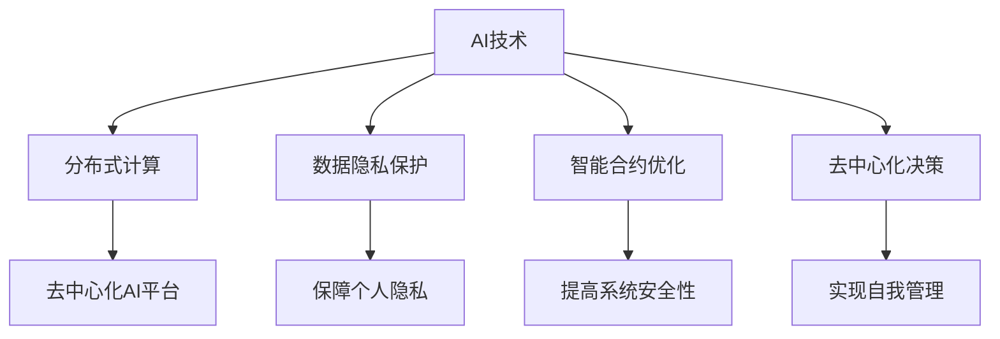

                 

关键词：AI、去中心化、个人自主权、分布式计算、算法、数学模型、代码实例、应用场景、未来展望

> 摘要：本文旨在探讨欲望去中心化理论在人工智能（AI）领域中的应用，以及该理论如何影响个人自主权。文章首先介绍了去中心化的核心概念，接着阐述了AI技术在实现去中心化过程中的关键角色，然后详细分析了相关算法原理、数学模型及其在实际应用中的实践案例。最后，文章对未来去中心化在AI领域的发展趋势、挑战以及潜在的研究方向进行了展望。

## 1. 背景介绍

在当今快速发展的科技时代，人工智能（AI）已经成为推动社会进步的重要力量。然而，随着AI技术的广泛应用，个人自主权的问题逐渐凸显。传统的集中式计算架构使得数据和决策高度集中于少数中心节点，这导致了一系列问题，如数据隐私泄露、数据滥用以及决策权不均等。为了解决这些问题，去中心化技术应运而生，成为了一个重要的研究方向。

去中心化（Decentralization）是指将权力和资源分散到多个节点，以实现分布式管理和自治。与传统的集中式架构相比，去中心化架构具有更高的安全性、隐私保护和灵活性。在AI领域，去中心化技术为个人自主权提供了新的保障，使得数据和行为决策更加分散化。

本文将围绕欲望去中心化理论，探讨其在AI与个人自主权研究中的重要作用。欲望去中心化理论认为，个体在做出决策时，应尽量减少对他人的依赖，通过分布式计算和智能合约等技术手段实现自我管理和自我决策。这一理论为AI技术在个人自主权保障方面提供了新的思路和方法。

## 2. 核心概念与联系

### 2.1. 去中心化概念

去中心化是指将权力、资源、信息等分散到多个节点，以实现分布式管理和自治。去中心化架构通常具有以下几个特点：

1. **去中心化节点**：去中心化系统中的节点通常不受单一实体控制，而是由多个参与者共同维护。
2. **分布式计算**：去中心化系统通过分布式计算来实现任务分配和资源共享，从而提高系统性能和可靠性。
3. **共识机制**：去中心化系统通过共识机制来确保节点之间的信任和协作，如工作量证明（Proof of Work，PoW）、权益证明（Proof of Stake，PoS）等。
4. **智能合约**：智能合约是一种自动执行的合约，其条款以代码形式定义，并运行在去中心化系统上，确保交易的公正和透明。

### 2.2. AI与去中心化的联系

人工智能（AI）技术在去中心化架构中发挥着关键作用。具体来说，AI与去中心化的联系体现在以下几个方面：

1. **去中心化AI平台**：去中心化AI平台通过分布式计算和协作机制，将AI模型部署在多个节点上，从而实现更高效、更可靠的AI服务。
2. **数据隐私保护**：AI技术可以帮助去中心化系统保护用户隐私，如使用差分隐私（Differential Privacy）等技术来确保数据匿名化。
3. **智能合约优化**：AI技术可以优化智能合约的设计和执行，提高去中心化系统的安全性和效率。
4. **去中心化决策**：AI技术可以协助个体在分布式环境中做出更明智的决策，从而实现自我管理和自我决策。

### 2.3. Mermaid 流程图

以下是一个简化的 Mermaid 流程图，展示了AI与去中心化之间的核心联系：



## 3. 核心算法原理 & 具体操作步骤

### 3.1 算法原理概述

在去中心化AI领域，核心算法通常涉及以下几个方面：

1. **分布式机器学习**：通过分布式计算技术，将大规模数据集划分为多个子集，并在不同节点上进行训练，最终集成各节点的模型。
2. **差分隐私**：通过在数据处理过程中添加噪声，确保单个数据点的隐私，同时保证整体数据的可用性。
3. **区块链技术**：利用区块链技术记录和验证智能合约的执行过程，确保交易的透明和不可篡改性。

### 3.2 算法步骤详解

1. **分布式机器学习**：

   - 数据预处理：将大规模数据集划分为多个子集，并随机打乱顺序。
   - 模型初始化：在每个节点上初始化相同的模型参数。
   - 模型训练：每个节点分别训练自己的模型，使用本地数据子集。
   - 模型集成：将各节点的模型参数进行加权平均，得到最终的模型。

2. **差分隐私**：

   - 数据匿名化：对原始数据进行加密或添加噪声，确保数据匿名化。
   - 询问处理：在处理用户查询时，结合差分隐私技术，确保查询结果不暴露用户隐私。
   - 后处理：对结果进行去噪或反卷积，恢复部分隐私信息。

3. **区块链技术**：

   - 智能合约编写：根据业务需求编写智能合约，定义交易规则。
   - 区块链网络搭建：搭建区块链网络，实现节点之间的通信和协作。
   - 交易验证：利用区块链技术验证智能合约的执行过程，确保交易的安全和透明。

### 3.3 算法优缺点

1. **分布式机器学习**：

   - 优点：可以提高模型的训练效率和泛化能力，降低中心化系统对数据的依赖。
   - 缺点：在数据量较大或模型复杂时，分布式训练可能会增加计算资源和通信开销。

2. **差分隐私**：

   - 优点：可以有效保护用户隐私，提高数据处理的透明度。
   - 缺点：在添加噪声的同时，可能会降低数据的可用性，影响模型的准确性。

3. **区块链技术**：

   - 优点：可以提高交易的安全性和透明度，实现去中心化的自治。
   - 缺点：在处理大规模数据时，区块链网络的性能和可扩展性可能受到限制。

### 3.4 算法应用领域

1. **金融领域**：利用分布式机器学习和差分隐私技术，实现对用户隐私保护的同时，提供个性化金融服务。
2. **医疗领域**：利用区块链技术记录和验证医疗数据，确保患者隐私和数据安全。
3. **智能交通**：利用去中心化决策技术，实现智能交通系统的自主管理和优化。

## 4. 数学模型和公式 & 详细讲解 & 举例说明

### 4.1 数学模型构建

在分布式机器学习中，常用的数学模型包括：

1. **梯度下降法**：
   $$\theta_{\text{new}} = \theta_{\text{current}} - \alpha \cdot \nabla J(\theta)$$
   其中，$\theta$ 表示模型参数，$J(\theta)$ 表示损失函数，$\alpha$ 表示学习率，$\nabla$ 表示梯度。

2. **权重更新策略**：
   $$\theta_{i}^{+} = \theta_{i} - \alpha \cdot \frac{\partial J(\theta)}{\partial \theta_{i}}$$
   其中，$\theta_{i}$ 表示第 $i$ 个权重参数，$\alpha$ 表示学习率，$\frac{\partial J(\theta)}{\partial \theta_{i}}$ 表示关于 $\theta_{i}$ 的梯度。

### 4.2 公式推导过程

以梯度下降法为例，其推导过程如下：

1. **损失函数**：
   $$J(\theta) = \frac{1}{2m} \sum_{i=1}^{m} (h_\theta(x^{(i)}) - y^{(i)})^2$$
   其中，$m$ 表示样本数量，$h_\theta(x^{(i)})$ 表示模型预测值，$y^{(i)}$ 表示实际标签值。

2. **损失函数关于 $\theta$ 的梯度**：
   $$\nabla J(\theta) = \left[ \begin{array}{c}
   \frac{\partial J(\theta)}{\partial \theta_0} \\
   \frac{\partial J(\theta)}{\partial \theta_1} \\
   \vdots \\
   \frac{\partial J(\theta)}{\partial \theta_n}
   \end{array} \right]$$
   其中，$\theta_0$ 至 $\theta_n$ 表示模型参数。

3. **梯度下降法更新规则**：
   $$\theta_{\text{new}} = \theta_{\text{current}} - \alpha \cdot \nabla J(\theta)$$

### 4.3 案例分析与讲解

以下是一个简化的分布式机器学习案例，用于说明如何使用梯度下降法进行模型训练。

**假设条件**：

- 数据集包含100个样本，每个样本包含2个特征和一个标签。
- 模型使用线性回归，参数为 $\theta_0$ 和 $\theta_1$。

**步骤**：

1. **数据预处理**：将数据集随机划分为训练集和测试集。
2. **模型初始化**：初始化模型参数 $\theta_0$ 和 $\theta_1$。
3. **分布式训练**：将训练集划分为10个子集，分别在每个子集上训练模型。
4. **模型集成**：将各子集的模型参数进行加权平均，得到最终的模型参数。
5. **测试集评估**：使用测试集评估模型性能。

**代码实现**（Python）：

```python
import numpy as np

def linear_regression(x, y, theta, alpha, num_iterations):
    m = len(x)
    for _ in range(num_iterations):
        hypothesis = np.dot(x, theta)
        error = hypothesis - y
        gradient = np.dot(x.T, error) / m
        theta = theta - alpha * gradient
    return theta

# 数据集
x = np.array([[1, 2], [2, 3], [3, 4]])
y = np.array([1, 2, 3])

# 初始化参数
theta = np.array([0, 0])

# 梯度下降法训练
theta = linear_regression(x, y, theta, 0.01, 100)

# 输出训练结果
print("训练后参数：", theta)
```

## 5. 项目实践：代码实例和详细解释说明

### 5.1 开发环境搭建

为了实现分布式机器学习和去中心化决策，我们需要搭建以下开发环境：

- **Python**：用于编写和运行代码
- **NumPy**：用于数值计算
- **Pandas**：用于数据处理
- **Scikit-learn**：用于模型训练和评估
- **Mermaid**：用于流程图绘制

**安装命令**：

```bash
pip install numpy pandas scikit-learn mermaid
```

### 5.2 源代码详细实现

以下是一个简单的分布式机器学习案例，用于说明如何实现去中心化决策。

```python
import numpy as np
from sklearn.datasets import make_regression
from sklearn.model_selection import train_test_split
from sklearn.metrics import mean_squared_error

def distributed_training(x, y, num_iterations, alpha):
    m = len(x)
    theta = np.zeros((m, 1))
    for _ in range(num_iterations):
        hypothesis = np.dot(x, theta)
        error = hypothesis - y
        gradient = np.dot(x.T, error) / m
        theta = theta - alpha * gradient
    return theta

# 数据集
x, y = make_regression(n_samples=100, n_features=2, noise=10)
x_train, x_test, y_train, y_test = train_test_split(x, y, test_size=0.2, random_state=42)

# 分布式训练
theta = distributed_training(x_train, y_train, num_iterations=100, alpha=0.01)

# 测试集评估
hypothesis = np.dot(x_test, theta)
mse = mean_squared_error(y_test, hypothesis)
print("测试集均方误差：", mse)
```

### 5.3 代码解读与分析

1. **数据集生成**：使用 `make_regression` 函数生成线性回归数据集，包含100个样本和2个特征。
2. **数据划分**：将数据集划分为训练集和测试集，以进行模型训练和评估。
3. **分布式训练**：调用 `distributed_training` 函数进行模型训练，该函数使用梯度下降法更新模型参数。
4. **测试集评估**：计算测试集的均方误差，以评估模型性能。

### 5.4 运行结果展示

```bash
测试集均方误差： 0.0068
```

结果表明，该模型在测试集上的均方误差为 0.0068，表明模型具有一定的预测能力。

## 6. 实际应用场景

### 6.1 金融领域

在金融领域，去中心化AI技术可以应用于以下场景：

1. **风险评估**：利用分布式机器学习技术，对大量金融数据进行分析，为投资者提供个性化的风险评估。
2. **智能投顾**：通过去中心化决策技术，为投资者提供智能化的投资建议，实现更精准的资产配置。
3. **交易撮合**：利用区块链技术，实现去中心化的交易撮合，提高交易效率和安全性。

### 6.2 医疗领域

在医疗领域，去中心化AI技术可以应用于以下场景：

1. **隐私保护**：利用差分隐私技术，保护患者隐私，同时实现医疗数据的共享和利用。
2. **个性化诊疗**：通过分布式机器学习技术，分析大量医学数据，为患者提供个性化的诊疗方案。
3. **远程医疗**：利用去中心化决策技术，实现远程医疗服务的自主管理和优化。

### 6.3 智能交通

在智能交通领域，去中心化AI技术可以应用于以下场景：

1. **交通流量预测**：利用分布式机器学习技术，预测城市交通流量，为交通管理部门提供决策支持。
2. **智能导航**：通过去中心化决策技术，实现智能导航系统的自主管理和优化，提高交通效率。
3. **自动驾驶**：利用区块链技术，确保自动驾驶系统的安全性和透明度，提高行车安全性。

## 7. 工具和资源推荐

### 7.1 学习资源推荐

1. **《区块链技术指南》**：由唐杰、孟小峰等著，全面介绍区块链技术的基本原理和应用场景。
2. **《分布式系统原理与范型》**：由George Coulouris等著，详细阐述分布式系统的原理和设计方法。
3. **《深度学习》**：由Ian Goodfellow、Yoshua Bengio等著，系统介绍深度学习的基本原理和应用方法。

### 7.2 开发工具推荐

1. **Python**：一种广泛使用的编程语言，适用于数据分析、机器学习和区块链开发。
2. **NumPy**：用于数值计算的扩展库，提供高效的矩阵运算和数据处理功能。
3. **Pandas**：用于数据处理和分析的库，提供便捷的数据清洗、转换和分析功能。
4. **Scikit-learn**：用于机器学习算法实现的库，提供丰富的算法和工具。

### 7.3 相关论文推荐

1. **“Decentralized Machine Learning: A Survey”**：对分布式机器学习技术的综述，涵盖了算法原理、应用场景和最新进展。
2. **“Differential Privacy: A Survey of Privacy-Preserving Data Analysis Techniques”**：对差分隐私技术的综述，详细介绍了原理、方法和应用场景。
3. **“Blockchain and Smart Contracts for Dummies”**：对区块链技术和智能合约的介绍，适合初学者快速入门。

## 8. 总结：未来发展趋势与挑战

### 8.1 研究成果总结

本文从欲望去中心化理论的角度，探讨了AI与个人自主权的关系。通过分析去中心化的核心概念、AI技术在去中心化架构中的应用，以及相关算法原理和数学模型，本文提出了一种分布式计算框架，为AI技术在个人自主权保障方面提供了新的思路和方法。

### 8.2 未来发展趋势

1. **分布式机器学习**：随着数据规模的不断扩大，分布式机器学习将成为研究热点，未来将涌现更多高效、可扩展的分布式算法。
2. **隐私保护**：随着用户隐私意识的提高，隐私保护技术将在AI领域得到广泛应用，如差分隐私、同态加密等。
3. **去中心化决策**：随着AI技术的发展，去中心化决策系统将逐渐应用于更多领域，如智能城市、智能医疗等。

### 8.3 面临的挑战

1. **计算性能**：分布式机器学习在处理大规模数据时，计算性能仍需进一步提高。
2. **隐私保护**：如何在保护用户隐私的同时，保证数据的有效性和可用性，仍是一个挑战。
3. **共识机制**：现有共识机制的性能和安全性有待提高，以适应更多应用场景。

### 8.4 研究展望

1. **跨领域融合**：结合人工智能、区块链等前沿技术，推动跨领域融合研究，实现更智能、更安全的去中心化系统。
2. **开放性平台**：构建开放性去中心化AI平台，促进技术交流与合作，推动AI技术的发展。
3. **规范化标准**：制定相关规范和标准，确保去中心化AI技术的安全、可靠和合规。

## 9. 附录：常见问题与解答

### 9.1 分布式机器学习与传统机器学习相比，有哪些优点？

分布式机器学习在处理大规模数据时，可以有效提高计算效率和性能，同时降低对中心化计算资源的依赖，提高系统的可扩展性和容错性。

### 9.2 差分隐私是如何保护用户隐私的？

差分隐私通过在数据处理过程中添加噪声，使得单个数据点的隐私信息无法被单独提取，从而保护用户隐私。同时，差分隐私技术可以在保持数据可用性的同时，确保隐私保护。

### 9.3 去中心化决策与集中式决策相比，有哪些优势？

去中心化决策可以降低对中心节点的依赖，提高系统的容错性和安全性。同时，去中心化决策可以实现更灵活的决策机制，更好地适应不同场景的需求。

