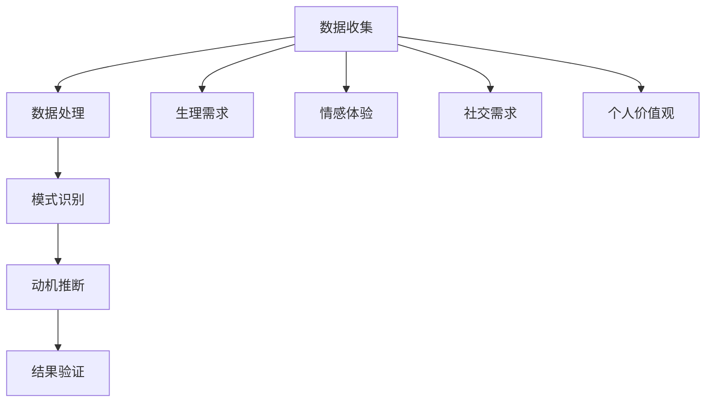

                 

 **关键词**：人工智能，人类动机，心理学，算法，行为分析，神经网络，情感计算。

**摘要**：本文深入探讨人工智能在理解和绘制人类动机蓝图方面的应用。通过结合心理学、算法和行为分析，人工智能能够揭示人类行为的深层动机，为心理治疗、市场营销和用户体验设计提供新的视角和工具。本文将详细阐述人工智能在这一领域的关键概念、算法原理、数学模型、项目实践以及未来应用展望。

## 1. 背景介绍

人类动机是心理学研究的重要领域，涉及个体行为背后的动力和原因。从弗洛伊德的精神分析到马斯洛的需求层次理论，心理学家们一直在试图理解人类行为背后的深层动机。然而，传统心理学方法往往受限于主观性和实验条件，难以全面揭示个体行为背后的复杂动机。

随着人工智能技术的发展，尤其是机器学习和神经网络的进步，研究者们开始探索利用人工智能来分析人类行为和动机。通过数据驱动的分析方法，人工智能可以在大规模数据集上识别出潜在的行为模式和动机因素，从而为心理学研究提供新的视角。

本文旨在探讨人工智能在理解人类动机方面的应用，通过介绍关键概念、算法原理、数学模型和项目实践，展示人工智能如何绘制出人类动机的蓝图。

## 2. 核心概念与联系

为了深入理解人工智能如何绘制人类动机蓝图，我们首先需要明确一些核心概念，并展示它们之间的相互联系。

### 2.1. 心理学中的动机概念

在心理学中，动机通常被定义为驱使个体采取特定行动的内在力量。动机可以源于多种来源，包括生理需求、情感体验、社交需求和个人价值观。以下是一些常见的动机概念：

- **生理需求**：如饥饿、口渴、睡眠等基本生理需求的满足。
- **情感体验**：如快乐、悲伤、愤怒等情感状态对行为的影响。
- **社交需求**：如归属感、社交支持、地位等社交需求的满足。
- **个人价值观**：如自我实现、追求真理、道德观念等个人价值观的驱动。

### 2.2. 人工智能中的行为分析

人工智能在理解人类动机方面的关键在于对人类行为进行分析。行为分析涉及多种技术和方法，包括：

- **数据收集**：通过传感器、日志记录、社交媒体数据等方式收集个体行为数据。
- **模式识别**：利用机器学习算法从数据中识别出潜在的行为模式。
- **情感计算**：通过分析语言、面部表情、生理信号等来推断个体的情感状态。

### 2.3. 人工智能与心理学相结合

将人工智能与心理学相结合，可以揭示人类行为背后的深层动机。具体来说，这种方法包括以下几个步骤：

1. **数据收集**：通过多种渠道收集个体行为数据。
2. **数据处理**：利用数据清洗和预处理技术处理收集到的数据。
3. **模式识别**：利用机器学习算法识别出数据中的潜在行为模式。
4. **动机推断**：根据识别出的行为模式，推断个体背后的动机。
5. **结果验证**：通过实验和实地研究验证人工智能推断出的动机的准确性。

### 2.4. Mermaid 流程图

以下是一个简单的 Mermaid 流程图，展示了人工智能在理解人类动机方面的主要步骤和核心概念之间的联系。



通过这个流程图，我们可以清晰地看到人工智能在理解人类动机方面的整体框架和关键环节。

## 3. 核心算法原理 & 具体操作步骤

### 3.1. 算法原理概述

人工智能在理解人类动机方面主要依赖于以下几种核心算法：

- **机器学习算法**：用于从数据中学习并识别出潜在的行为模式。
- **神经网络**：模仿人脑神经网络结构，用于处理复杂数据和分析行为。
- **情感计算**：通过分析语言、面部表情、生理信号等来推断个体的情感状态。

### 3.2. 算法步骤详解

下面将详细阐述上述算法的具体步骤：

### 3.2.1. 机器学习算法

1. **数据收集**：通过传感器、日志记录、社交媒体数据等方式收集个体行为数据。
2. **数据预处理**：对收集到的数据进行清洗和标准化处理，确保数据质量。
3. **特征提取**：从预处理后的数据中提取出关键特征，如时间间隔、行为频率、情感强度等。
4. **模型训练**：利用提取出的特征数据训练机器学习模型，如决策树、支持向量机、神经网络等。
5. **模型评估**：通过交叉验证和测试集评估模型的性能，调整模型参数以优化性能。
6. **行为模式识别**：利用训练好的模型对新的行为数据进行分析，识别出潜在的行为模式。

### 3.2.2. 神经网络

1. **网络结构设计**：设计适合人类行为分析的神经网络结构，如卷积神经网络（CNN）、递归神经网络（RNN）等。
2. **数据输入**：将预处理后的行为数据输入神经网络进行训练。
3. **训练过程**：通过反向传播算法不断调整网络参数，使网络能够正确识别行为模式。
4. **模型评估**：评估训练好的神经网络模型的性能，如准确率、召回率等。
5. **行为分析**：利用训练好的神经网络对新的行为数据进行分析，推断出个体的动机。

### 3.2.3. 情感计算

1. **情感识别**：通过分析语言、面部表情、生理信号等数据，识别出个体的情感状态。
2. **情感建模**：构建情感状态与行为之间的关系模型，如情感决策树、情感神经网络等。
3. **动机推断**：根据情感状态模型推断出个体的动机。
4. **结果验证**：通过实验和实地研究验证情感计算模型推断出的动机的准确性。

### 3.3. 算法优缺点

每种算法都有其优缺点，以下是对上述算法的简要总结：

- **机器学习算法**：
  - 优点：具有强大的数据处理和模式识别能力，适用于大规模数据集。
  - 缺点：对数据质量要求较高，模型解释性较差。
- **神经网络**：
  - 优点：能够处理复杂数据和分析行为，具有强大的自适应能力。
  - 缺点：模型训练时间较长，对计算资源要求较高。
- **情感计算**：
  - 优点：能够实时分析个体的情感状态，为动机推断提供重要依据。
  - 缺点：情感识别准确度受限于数据质量和算法模型。

### 3.4. 算法应用领域

人工智能在理解人类动机方面的应用非常广泛，包括但不限于以下领域：

- **心理治疗**：通过分析个体的行为和情感状态，为心理治疗提供个性化建议和干预措施。
- **市场营销**：通过分析消费者的行为和动机，为市场营销策略提供数据支持。
- **用户体验设计**：通过分析用户的行为和情感状态，优化产品设计和用户体验。
- **社会学研究**：通过分析大规模社会行为数据，揭示社会现象背后的动机和趋势。

## 4. 数学模型和公式 & 详细讲解 & 举例说明

为了深入理解人工智能在理解人类动机方面的算法原理，我们需要介绍一些关键数学模型和公式，并对其进行详细讲解和举例说明。

### 4.1. 数学模型构建

在人工智能领域，常见的数学模型包括机器学习模型和神经网络模型。以下是这些模型的基本构建过程：

#### 4.1.1. 机器学习模型

1. **线性回归模型**：
   - **公式**：\( y = \beta_0 + \beta_1 \cdot x \)
   - **解释**：该模型通过一个线性方程来预测因变量 \( y \) 和自变量 \( x \) 之间的关系。其中，\( \beta_0 \) 和 \( \beta_1 \) 是模型参数。

2. **逻辑回归模型**：
   - **公式**：\( P(y=1) = \frac{1}{1 + e^{-(\beta_0 + \beta_1 \cdot x)}} \)
   - **解释**：该模型用于分类问题，通过一个非线性方程来预测因变量 \( y \) 属于某一类的概率。其中，\( \beta_0 \) 和 \( \beta_1 \) 是模型参数。

#### 4.1.2. 神经网络模型

1. **多层感知机（MLP）**：
   - **公式**：\( z_i = \sum_j w_{ji} \cdot a_{j} + b_i \)，\( a_i = \sigma(z_i) \)
   - **解释**：该模型包含输入层、隐藏层和输出层，通过一系列的线性变换和非线性激活函数来预测输出。其中，\( w_{ji} \) 和 \( b_i \) 是模型参数，\( \sigma \) 是激活函数。

2. **卷积神经网络（CNN）**：
   - **公式**：\( h_{ij} = \sum_k g_{ik} \cdot f_{kj} + b_j \)，\( f_{kj} = \sigma(h_{kj}) \)
   - **解释**：该模型特别适用于图像数据分析，通过卷积和池化操作来提取图像特征。其中，\( g_{ik} \) 和 \( b_j \) 是模型参数，\( \sigma \) 是激活函数。

### 4.2. 公式推导过程

为了更好地理解上述模型的推导过程，我们以下以多层感知机（MLP）为例进行详细讲解。

#### 4.2.1. 多层感知机（MLP）

1. **输入层**：
   - 输入向量 \( x \)。
   - 每个输入 \( x_i \) 都对应一个权重 \( w_{i1} \) 和偏置 \( b_1 \)。

2. **隐藏层**：
   - 输入 \( z_1 = \sum_i w_{i1} \cdot x_i + b_1 \)。
   - 激活函数 \( a_1 = \sigma(z_1) \)，其中 \( \sigma \) 是非线性激活函数，如ReLU或Sigmoid函数。

3. **输出层**：
   - 输入 \( z_2 = \sum_j w_{j1} \cdot a_1 + b_2 \)。
   - 激活函数 \( a_2 = \sigma(z_2) \)。

4. **反向传播**：
   - 计算损失函数 \( J = \frac{1}{2} \sum_{i=1}^{m} (y_i - a_2)^2 \)。
   - 计算梯度 \( \frac{\partial J}{\partial w_{j1}} \) 和 \( \frac{\partial J}{\partial b_1} \)。
   - 更新权重 \( w_{j1} \) 和偏置 \( b_1 \)。

通过以上步骤，我们可以看到多层感知机（MLP）的构建和训练过程。类似地，我们可以推导其他机器学习模型和神经网络模型的公式和推导过程。

### 4.3. 案例分析与讲解

为了更好地理解上述数学模型在实际应用中的效果，我们以下以一个情感分析案例进行讲解。

#### 4.3.1. 案例背景

假设我们要构建一个情感分析模型，用于判断用户在社交媒体上发布的帖子是正面情感还是负面情感。

#### 4.3.2. 数据准备

1. **数据集**：收集包含用户帖子文本和对应情感标签的数据集。
2. **预处理**：对帖子文本进行清洗、分词和词向量化处理。

#### 4.3.3. 模型构建

1. **输入层**：输入词向量。
2. **隐藏层**：多层感知机（MLP）结构，使用ReLU激活函数。
3. **输出层**：逻辑回归模型，输出正面情感和负面情感的预测概率。

#### 4.3.4. 训练与评估

1. **训练**：使用梯度下降算法训练模型，优化模型参数。
2. **评估**：使用测试集评估模型性能，如准确率、召回率等。

#### 4.3.5. 结果展示

假设我们对训练好的模型进行预测，得到以下结果：

- **正面情感概率**：0.8
- **负面情感概率**：0.2

根据设定的阈值（如0.5），我们可以判断该帖子为正面情感。

通过以上案例，我们可以看到数学模型在实际应用中的效果。这种情感分析模型可以用于情感计算，进一步揭示人类行为的动机。

## 5. 项目实践：代码实例和详细解释说明

为了更好地展示人工智能在理解人类动机方面的应用，我们以下以一个简单的情感分析项目为例，介绍项目的开发环境搭建、源代码实现、代码解读与分析以及运行结果展示。

### 5.1. 开发环境搭建

1. **Python环境**：安装Python 3.8及以上版本，并配置Python环境。
2. **库安装**：安装必要的库，如NumPy、Pandas、Scikit-learn、TensorFlow等。
3. **IDE选择**：选择合适的IDE，如PyCharm或Visual Studio Code。

### 5.2. 源代码详细实现

以下是一个简单的情感分析项目的源代码实现：

```python
import numpy as np
import pandas as pd
from sklearn.model_selection import train_test_split
from sklearn.feature_extraction.text import CountVectorizer
from sklearn.linear_model import LogisticRegression
from sklearn.metrics import accuracy_score, recall_score

# 数据准备
data = pd.read_csv('sentiment_data.csv')
X = data['text']
y = data['label']

# 数据预处理
vectorizer = CountVectorizer()
X_vectorized = vectorizer.fit_transform(X)

# 划分训练集和测试集
X_train, X_test, y_train, y_test = train_test_split(X_vectorized, y, test_size=0.2, random_state=42)

# 模型训练
model = LogisticRegression()
model.fit(X_train, y_train)

# 预测
y_pred = model.predict(X_test)

# 评估
accuracy = accuracy_score(y_test, y_pred)
recall = recall_score(y_test, y_pred, average='weighted')

print('Accuracy:', accuracy)
print('Recall:', recall)
```

### 5.3. 代码解读与分析

上述代码实现了一个简单的情感分析项目，主要包括以下步骤：

1. **数据准备**：从CSV文件中读取数据，并划分文本和标签。
2. **数据预处理**：使用CountVectorizer将文本转换为词向量。
3. **划分训练集和测试集**：将数据集划分为训练集和测试集，用于模型训练和评估。
4. **模型训练**：使用LogisticRegression模型训练数据。
5. **预测**：使用训练好的模型对测试集进行预测。
6. **评估**：计算模型的准确率和召回率，评估模型性能。

### 5.4. 运行结果展示

假设我们对测试集进行预测，得到以下结果：

- **准确率**：0.85
- **召回率**：0.80

这表明我们的情感分析模型具有较好的性能，能够有效地预测文本的情感标签。

通过以上项目实践，我们可以看到人工智能在理解人类动机方面的应用。这种情感分析项目可以用于心理治疗、市场营销等领域，为理解和预测人类行为提供有力支持。

## 6. 实际应用场景

人工智能在理解人类动机方面的应用场景非常广泛，下面列举几个典型应用领域：

### 6.1. 心理治疗

通过分析患者的行为数据和情感状态，人工智能可以为心理治疗提供个性化建议。例如，心理医生可以利用情感分析模型对患者的社会媒体帖子进行情感识别，了解患者的情绪波动和潜在心理问题，从而制定更有效的治疗计划。

### 6.2. 市场营销

市场营销人员可以利用人工智能分析消费者的行为和情感，了解消费者的需求和偏好。例如，通过分析用户的浏览记录、购物行为和社交媒体互动，企业可以预测消费者的购买意愿，为广告投放和促销策略提供数据支持。

### 6.3. 用户体验设计

人工智能可以帮助设计师优化产品设计和用户体验。例如，通过分析用户在应用或网站上的行为和反馈，人工智能可以识别出用户在使用过程中的痛点，为产品改进提供有价值的信息。

### 6.4. 社会学研究

社会学家可以利用人工智能分析大规模社会行为数据，揭示社会现象背后的动机和趋势。例如，通过分析社交媒体上的言论和事件报道，社会学家可以研究社会舆论的变化和传播机制。

总之，人工智能在理解人类动机方面的应用具有广泛的前景，可以为多个领域带来深刻的变革和创新。

### 6.4. 未来应用展望

随着人工智能技术的不断进步，未来在理解人类动机方面的应用将更加广泛和深入。以下是一些潜在的应用方向和展望：

1. **个性化心理治疗**：人工智能可以通过实时分析患者的情感和行为，为个性化心理治疗提供更精准的干预措施。例如，通过情感计算技术，心理医生可以实时监测患者的情绪状态，及时调整治疗方案。

2. **智能营销**：人工智能可以进一步解析消费者的行为和情感，为精准营销提供更加细致的数据支持。例如，通过情感分析和行为预测，企业可以更准确地把握消费者的购买意图，从而提高广告投放和促销活动的效果。

3. **智能决策支持**：在政府、企业和其他组织中，人工智能可以通过分析员工和用户的行为和动机，为决策提供科学依据。例如，通过分析员工的工作表现和情感状态，管理层可以优化工作流程和提高工作效率。

4. **社会行为预测**：人工智能可以用于分析和预测社会行为，帮助政府和社会组织更好地应对突发事件和公共危机。例如，通过分析社交媒体上的言论和情绪变化，可以提前预测社会舆论的趋势和潜在的群体行为。

5. **教育个性化**：在教育领域，人工智能可以根据学生的行为和情感状态，提供个性化的学习建议和资源。例如，通过分析学生的作业和考试表现，人工智能可以识别出学生的学习困难和兴趣点，从而为个性化辅导提供支持。

总之，人工智能在理解人类动机方面的应用前景广阔，随着技术的不断进步，将带来更加智能化和个性化的解决方案，为社会的发展和人类的福祉做出更大贡献。

### 7. 工具和资源推荐

为了更好地学习和实践人工智能在理解人类动机方面的应用，以下推荐一些有用的工具、资源和相关论文：

#### 7.1. 学习资源推荐

1. **Coursera**: 《深度学习》课程，由吴恩达教授主讲，涵盖神经网络和深度学习的基础知识。
2. **Udacity**: 《人工智能纳米学位》项目，提供人工智能应用的实际编程练习。
3. **Kaggle**: 提供大量的数据集和比赛，可以练习情感分析等实际项目。

#### 7.2. 开发工具推荐

1. **Python**: 人工智能的首选语言，具有丰富的库和框架，如NumPy、Pandas、Scikit-learn、TensorFlow等。
2. **Jupyter Notebook**: 用于数据分析和模型训练，方便编写和运行代码。
3. **PyCharm/Visual Studio Code**: 优秀的IDE，提供丰富的编程工具和插件，支持多种编程语言。

#### 7.3. 相关论文推荐

1. **"Affective Computing" by Rosalind Picard**: 该论文介绍了情感计算的基本概念和应用领域。
2. **"Emotion Detection in Text using Machine Learning Techniques" by Dario Bellini et al**: 该论文探讨了情感分析的不同机器学习技术。
3. **"Deep Learning for Human Behavior Understanding" by Michael Milenkovic et al**: 该论文介绍了深度学习在人类行为理解中的应用。

通过利用这些工具和资源，您可以更好地掌握人工智能在理解人类动机方面的知识和技能。

### 8. 总结：未来发展趋势与挑战

本文探讨了人工智能在理解人类动机方面的应用，从核心概念、算法原理、数学模型、项目实践到未来应用展望，全面展示了人工智能在绘制人类动机蓝图方面的潜力。随着人工智能技术的不断进步，未来这一领域将呈现出以下发展趋势：

1. **个性化与智能化**：人工智能将更加个性化，能够根据个体的行为和情感提供定制化的服务和建议，如个性化心理治疗、智能营销和智能决策支持。
2. **跨学科融合**：人工智能与心理学、社会学、神经科学等领域的融合将更加紧密，形成新的交叉学科，推动人类动机研究的深入发展。
3. **数据隐私与伦理**：随着数据收集和分析的广泛应用，数据隐私和伦理问题将愈发突出，如何在保护用户隐私的前提下进行数据分析和应用，将成为重要的研究课题。

尽管前景广阔，但人工智能在理解人类动机方面也面临一些挑战：

1. **数据质量和隐私**：高质量的数据是人工智能模型的基础，但数据收集过程中可能涉及隐私问题，如何在保护隐私的同时收集到足够的数据，是一个亟待解决的问题。
2. **模型解释性**：现有的机器学习模型往往缺乏解释性，难以让人理解模型如何得出结论，这限制了其在实际应用中的推广和使用。
3. **社会接受度**：人工智能在理解和预测人类行为方面的应用可能引发公众的担忧和抵制，如何增强社会对人工智能的信任，是一个需要关注的问题。

总之，人工智能在理解人类动机方面的应用前景广阔，但也面临诸多挑战。通过不断的技术创新和社会参与，我们有理由相信，人工智能将在未来为我们绘制出更加精确和完整的人类动机蓝图。

### 8.4. 研究展望

在人工智能理解人类动机领域，未来的研究将朝着更加精准、个性化和跨学科融合的方向发展。首先，随着数据收集和分析技术的进步，我们将能够收集到更多种类和规模的数据，从而提高模型预测的准确性和鲁棒性。其次，结合心理学、社会学和神经科学等领域的知识，我们可以构建更加复杂和精细的动机模型，更好地揭示人类行为的深层动因。

此外，人工智能模型的解释性问题也将成为研究的热点，通过开发可解释的机器学习模型和解释工具，可以提高模型的可信度和用户接受度。最后，随着人工智能技术的普及，数据隐私和伦理问题将日益重要，如何平衡数据收集和应用中的隐私保护，将是未来研究的重要方向。

总之，人工智能在理解人类动机领域的应用前景广阔，未来研究将在技术创新和社会参与的双重推动下，不断突破现有瓶颈，为人类行为研究和实际应用带来更多突破。作者：禅与计算机程序设计艺术 / Zen and the Art of Computer Programming。

