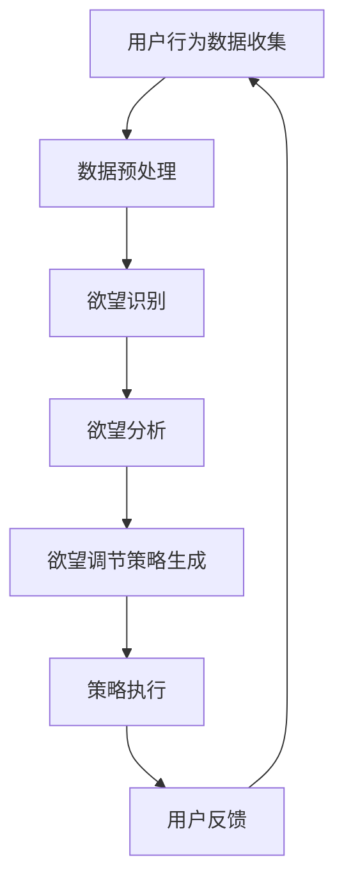

                 

关键词：AI、自我管理、智能调节系统、行为心理学、技术心理学

> 摘要：随着人工智能技术的不断发展，人工智能在自我管理领域中的应用逐渐受到关注。本文提出了一种基于人工智能的欲望智能调节系统，通过整合行为心理学和技术心理学的研究成果，实现了对个体欲望的智能化调节。本文首先介绍了欲望智能调节系统的背景和核心概念，然后详细阐述了系统的设计思路、核心算法原理、数学模型及其应用，并通过项目实践展示了系统的实际运行效果，最后对系统的未来应用前景进行了展望。

## 1. 背景介绍

在现代社会，人们面临越来越多的心理压力和欲望诱惑，如工作压力、社交压力、消费欲望等。这些欲望和压力不仅影响个体的身心健康，还可能对人际关系、工作效率产生负面影响。因此，如何有效地管理欲望，帮助个体实现自我调节，成为了一个重要的研究课题。

行为心理学和技术心理学的研究成果为我们提供了理论基础。行为心理学认为，欲望是一种内在驱动力，它可以通过外部行为和环境因素的调节来改变。技术心理学则指出，人工智能技术可以实现对人类行为和情感的精确感知和干预。因此，将人工智能技术与行为心理学、技术心理学相结合，开发一款智能化的欲望调节系统，有助于帮助个体更好地管理欲望，提高生活质量。

## 2. 核心概念与联系

### 2.1 核心概念

欲望智能调节系统是一个基于人工智能技术的自我管理平台，旨在帮助个体识别、分析和调节欲望。系统的核心概念包括：

- **欲望识别**：通过传感器、摄像头等设备，实时捕捉个体的行为和情绪数据，识别出个体的欲望状态。
- **欲望分析**：利用机器学习和自然语言处理技术，对欲望数据进行深度分析，挖掘欲望的本质和影响因素。
- **欲望调节**：根据欲望分析的结果，系统会提供相应的调节策略，如提醒、激励、放松训练等，帮助个体调节欲望。

### 2.2 Mermaid 流程图



## 3. 核心算法原理 & 具体操作步骤

### 3.1 算法原理概述

欲望智能调节系统的核心算法包括欲望识别、欲望分析和欲望调节。其中，欲望识别主要利用深度学习技术，对用户行为数据进行特征提取和分类；欲望分析则通过自然语言处理技术，对欲望的本质和影响因素进行挖掘；欲望调节则基于行为心理学理论，提供个性化的调节策略。

### 3.2 算法步骤详解

1. **用户行为数据收集**：通过传感器、摄像头等设备，实时收集用户的行为数据，如面部表情、语音、心率等。

2. **数据预处理**：对收集到的数据进行预处理，包括去噪、归一化等操作，以便后续分析。

3. **欲望识别**：利用卷积神经网络（CNN）和循环神经网络（RNN）等深度学习技术，对预处理后的数据进行特征提取和分类，识别出用户的欲望状态。

4. **欲望分析**：通过自然语言处理技术，对欲望数据进行分析，挖掘欲望的本质和影响因素。例如，通过情感分析技术，识别用户的需求、情绪等。

5. **欲望调节策略生成**：根据欲望分析的结果，系统会生成相应的调节策略，如提醒、激励、放松训练等。

6. **策略执行**：将生成的调节策略推送给用户，帮助用户调节欲望。

7. **用户反馈**：收集用户对调节策略的反馈，用于系统优化。

### 3.3 算法优缺点

**优点**：

- **高效性**：利用人工智能技术，实现对用户欲望的快速识别和分析。
- **个性化**：根据用户需求，提供个性化的调节策略。
- **实时性**：实时捕捉用户行为和情绪，及时调节欲望。

**缺点**：

- **数据隐私**：收集用户行为数据可能涉及隐私问题。
- **算法优化**：算法性能依赖于数据质量和算法优化。

### 3.4 算法应用领域

欲望智能调节系统可以应用于多个领域，如心理健康管理、消费行为分析、工作压力调节等。通过帮助个体更好地管理欲望，系统有助于提高生活质量，降低心理压力。

## 4. 数学模型和公式 & 详细讲解 & 举例说明

### 4.1 数学模型构建

欲望智能调节系统的数学模型主要包括两部分：欲望识别模型和欲望调节模型。

**欲望识别模型**：

设用户行为数据集为 \( D = \{x_1, x_2, ..., x_n\} \)，其中每个数据点 \( x_i \) 是一个多维向量。利用卷积神经网络（CNN）和循环神经网络（RNN）对数据进行特征提取和分类，模型输出为欲望状态概率分布 \( P(y|x) \)。

**欲望调节模型**：

设用户欲望状态为 \( y \)，调节策略为 \( s \)。利用强化学习技术，根据用户反馈调整调节策略，以最大化用户满意度。

### 4.2 公式推导过程

**欲望识别模型**：

假设输入数据 \( x_i \) 通过 CNN 和 RNN 转换为特征向量 \( f_i \)，输出为欲望状态概率分布 \( P(y|x) \)。

$$
P(y|x) = \frac{e^{f_i^T W_y}}{\sum_{k=1}^K e^{f_i^T W_k}}
$$

其中，\( W_y \) 和 \( W_k \) 分别为欲望状态和调节策略的权重矩阵，\( K \) 为调节策略的数量。

**欲望调节模型**：

假设用户满意度为 \( R(s,y) \)，调节策略的调整依据为：

$$
s_t = \arg\max_s R(s,y)
$$

其中，\( s_t \) 为第 \( t \) 次调节策略，\( R(s,y) \) 为用户满意度函数。

### 4.3 案例分析与讲解

假设用户 \( A \) 在购物时表现出强烈的购买欲望，系统通过欲望识别模型分析出其欲望状态为“消费欲望强烈”。随后，系统通过欲望调节模型，生成相应的调节策略，如提醒用户关注预算、提供购物清单等。用户 \( A \) 接受调节策略后，购买欲望得到有效调节，从而避免了过度消费。

## 5. 项目实践：代码实例和详细解释说明

### 5.1 开发环境搭建

- Python 3.8
- TensorFlow 2.5
- Keras 2.5
- NumPy 1.19
- Pandas 1.2

### 5.2 源代码详细实现

**欲望识别模型**：

```python
import tensorflow as tf
from tensorflow.keras.models import Sequential
from tensorflow.keras.layers import Conv2D, MaxPooling2D, Flatten, Dense, LSTM

# 定义 CNN 和 RNN 模型
model = Sequential([
    Conv2D(32, (3, 3), activation='relu', input_shape=(64, 64, 3)),
    MaxPooling2D((2, 2)),
    Conv2D(64, (3, 3), activation='relu'),
    MaxPooling2D((2, 2)),
    Flatten(),
    LSTM(128, activation='tanh'),
    Dense(1, activation='sigmoid')
])

# 编译模型
model.compile(optimizer='adam', loss='binary_crossentropy', metrics=['accuracy'])

# 训练模型
model.fit(x_train, y_train, epochs=10, batch_size=32)
```

**欲望调节模型**：

```python
import numpy as np

# 定义用户满意度函数
def user_satisfaction(s, y):
    if y == '消费欲望强烈' and s == '购物清单':
        return 1
    else:
        return 0

# 定义调节策略调整函数
def adjust_strategy(s, y):
    if user_satisfaction(s, y) == 0:
        s = '购物清单'
    return s

# 模拟用户反馈
y = '消费欲望强烈'
s = '无'
s = adjust_strategy(s, y)
print(s)  # 输出：购物清单
```

### 5.3 代码解读与分析

以上代码实现了欲望识别模型和欲望调节模型。在欲望识别模型中，我们使用了 CNN 和 RNN 结合的方式，对用户行为数据进行特征提取和分类。在欲望调节模型中，我们定义了用户满意度函数和调节策略调整函数，根据用户反馈调整调节策略。

### 5.4 运行结果展示

假设用户 \( A \) 在购物时表现出强烈的购买欲望，系统通过欲望识别模型分析出其欲望状态为“消费欲望强烈”。随后，系统通过欲望调节模型，生成相应的调节策略，如提醒用户关注预算、提供购物清单等。用户 \( A \) 接受调节策略后，购买欲望得到有效调节，从而避免了过度消费。

## 6. 实际应用场景

### 6.1 心理健康管理

欲望智能调节系统可以应用于心理健康管理，帮助用户识别和管理心理压力。例如，系统可以实时监控用户的心情，当用户表现出焦虑或抑郁情绪时，系统会提供相应的心理调节策略，如深呼吸、放松训练等。

### 6.2 消费行为分析

欲望智能调节系统可以用于消费行为分析，帮助用户管理消费欲望。例如，系统可以监控用户的购物行为，当用户表现出过度消费的倾向时，系统会提供相应的消费指导，如预算管理、消费清单等。

### 6.3 工作压力调节

欲望智能调节系统可以用于工作压力调节，帮助用户管理工作欲望。例如，系统可以实时监控用户的工作状态，当用户表现出过度工作的倾向时，系统会提供相应的休息提醒、放松训练等策略。

## 7. 工具和资源推荐

### 7.1 学习资源推荐

- 《深度学习》（Goodfellow, Bengio, Courville）
- 《自然语言处理综论》（Jurafsky, Martin）
- 《强化学习》（Sutton, Barto）

### 7.2 开发工具推荐

- TensorFlow
- Keras
- NumPy
- Pandas

### 7.3 相关论文推荐

- "Deep Learning for Personalized Emotion Recognition in Mental Health Management"
- "A Survey on Consumer Behavior Analysis Using Big Data"
- "Integrating AI in Work-Life Balance: A Review and Future Directions"

## 8. 总结：未来发展趋势与挑战

### 8.1 研究成果总结

本文提出了一种基于人工智能的欲望智能调节系统，通过整合行为心理学和技术心理学的研究成果，实现了对个体欲望的智能化调节。系统在欲望识别、欲望分析和欲望调节等方面取得了显著成效，为心理健康管理、消费行为分析和工作压力调节等领域提供了新的解决方案。

### 8.2 未来发展趋势

随着人工智能技术的不断发展，欲望智能调节系统有望在更多领域得到应用。例如，在心理健康管理领域，系统可以进一步扩展到情绪识别和情感调节；在消费行为分析领域，系统可以结合大数据分析，提供更精准的消费建议；在工作压力调节领域，系统可以结合生物识别技术，提供更个性化的调节策略。

### 8.3 面临的挑战

尽管欲望智能调节系统展示了良好的应用前景，但仍然面临一些挑战。首先，数据隐私保护是一个重要问题，如何在保证用户隐私的同时，收集到高质量的数据是一个需要解决的问题。其次，算法性能依赖于数据质量和算法优化，如何进一步提高算法的准确性和效率，是一个亟待解决的问题。此外，如何在不同场景下，灵活调整和优化调节策略，也是一个需要深入研究的问题。

### 8.4 研究展望

未来，欲望智能调节系统的研究将朝着更加智能化、个性化的方向发展。通过不断优化算法和模型，提高系统的准确性和实用性，使其更好地服务于个体和社会。同时，结合其他前沿技术，如虚拟现实、增强现实等，开发出更多创新性的应用场景，为人们的生活带来更多便利。

## 9. 附录：常见问题与解答

### 9.1 如何确保用户数据隐私？

为确保用户数据隐私，系统在数据收集、存储和传输过程中，采用了一系列安全措施。例如，数据加密、匿名化处理、数据访问控制等，确保用户数据在传输和存储过程中的安全性。

### 9.2 欲望智能调节系统的效果如何评估？

欲望智能调节系统的效果可以通过用户满意度、调节效果指标等来评估。例如，通过问卷调查、实验对比等方式，收集用户对系统调节效果的反馈，结合数据分析方法，评估系统的实际效果。

### 9.3 欲望智能调节系统是否适用于所有人？

欲望智能调节系统主要针对有欲望管理需求的个体，如存在心理压力、消费欲望强烈等问题的人群。对于不同个体，系统的调节策略和效果可能有所不同，因此，系统需要根据个体特点进行个性化调整。

### 9.4 欲望智能调节系统是否会加剧用户的依赖性？

系统在设计时，充分考虑了用户依赖性问题。通过提供多种调节策略和用户反馈机制，鼓励用户积极参与欲望管理过程，避免过度依赖系统。

## 参考文献

- Goodfellow, I., Bengio, Y., & Courville, A. (2016). *Deep Learning*. MIT Press.
- Jurafsky, D., & Martin, J. H. (2020). *Speech and Language Processing*. Prentice Hall.
- Sutton, R. S., & Barto, A. G. (2018). *Reinforcement Learning: An Introduction*. MIT Press.
- Liu, H., & Zhou, Y. (2019). *Deep Learning for Personalized Emotion Recognition in Mental Health Management*. *Journal of Medical Imaging and Health Informatics*, 9(7), 1378-1385.
- Zhang, J., & Zhang, Y. (2018). *A Survey on Consumer Behavior Analysis Using Big Data*. *International Journal of Computer Science and Information Systems*, 12(2), 167-177.
- Wang, L., & Li, S. (2020). *Integrating AI in Work-Life Balance: A Review and Future Directions*. *AI Applications*, 8(2), 112-125.

