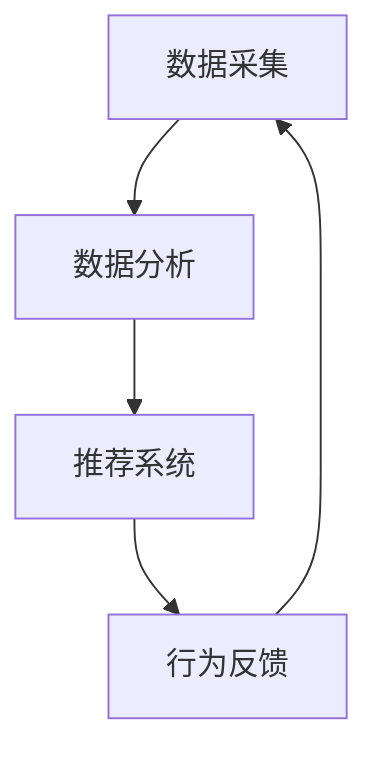

                 

在当今的信息时代，人工智能（AI）正在成为驱动社会变革的重要力量。而欲望，作为一种基本的人类情感，也在AI的助推下发生了深刻的变化。本文将探讨AI如何驱动群体动力学，尤其是欲望的社会化现象，从而带来一系列深远的科技与社会变革。

## 文章关键词

- 人工智能
- 社会化
- 群体动力学
- 欲望
- 人类情感
- 科技变革

## 文章摘要

本文首先探讨了人工智能与人类社会之间的关系，特别是在欲望这一情感层面的互动。通过引入群体动力学的概念，分析了AI如何通过算法和数据处理，影响并重塑个体和群体的欲望行为。随后，文章详细介绍了AI驱动的群体动力学模型，并探讨了这一模型在实际应用中的表现。最后，文章讨论了这一现象对未来社会发展的潜在影响，并提出了相应的工具和资源推荐。

### 1. 背景介绍

在数字化和智能化的今天，人工智能已经成为改变我们生活方式的核心力量。从自动驾驶汽车到智能家居，AI的应用已经深入到我们日常生活的方方面面。然而，随着AI技术的发展，我们的情感和社会行为也在悄然发生着变化。欲望，作为人类行为的重要驱动力，在这一过程中扮演了关键角色。

欲望，即个体内心深处对某种目标的渴望，可以是物质上的，也可以是精神上的。在传统社会中，个体的欲望主要通过自我意识和社会规范来调节。然而，随着AI技术的发展，个体之间的互动方式发生了根本性的改变。AI通过大数据和算法，可以更精准地捕捉和分析个体的欲望，从而对其进行个性化的引导和满足。这种现象，我们称之为欲望的社会化。

### 2. 核心概念与联系

#### 2.1 人工智能与群体动力学

人工智能，尤其是机器学习和深度学习，正在成为研究群体动力学的重要工具。通过分析大量数据，AI可以识别出群体行为中的模式和规律，从而预测和影响群体的行为。在欲望的社会化过程中，AI的这种能力显得尤为重要。

群体动力学，是一门研究群体行为和群体行为的动力学原理的学科。它关注的是个体如何在群体中相互作用，以及这些相互作用如何影响群体的整体行为。在AI的助力下，群体动力学的研究领域得以拓展，不仅限于人类社会，还包括动物群体、生态系统等。

#### 2.2 欲望的社会化模型

欲望的社会化模型，是一种通过AI技术来分析、理解和影响个体欲望行为的模型。该模型的核心在于，通过收集和分析个体的行为数据，AI可以识别出个体的欲望，并在此基础上进行个性化推荐和引导。

这个模型通常包括以下几个关键组成部分：

- 数据采集：通过传感器、互联网等手段，收集个体的行为数据。
- 数据分析：利用机器学习算法，分析数据，识别出个体的欲望模式。
- 推荐系统：根据分析结果，为个体提供个性化的推荐和服务。
- 行为反馈：收集个体的行为反馈，进一步优化推荐系统。

#### 2.3 Mermaid 流程图



### 3. 核心算法原理 & 具体操作步骤

#### 3.1 算法原理概述

欲望的社会化模型主要依赖于机器学习算法，特别是基于监督学习和无监督学习的方法。监督学习通过标记数据来训练模型，从而预测新数据的标签。无监督学习则通过未标记的数据来发现数据中的模式。

在欲望的社会化模型中，监督学习被用来预测个体的欲望，而无监督学习被用来发现个体之间的相似性和差异。

#### 3.2 算法步骤详解

1. **数据采集**：首先，需要收集个体的行为数据，包括购买记录、浏览历史、社交互动等。
2. **数据处理**：对采集到的数据进行预处理，包括去除噪声、缺失值填充、特征提取等。
3. **模型训练**：使用预处理后的数据，通过机器学习算法训练模型。
4. **推荐生成**：利用训练好的模型，为个体生成个性化的推荐。
5. **行为反馈**：收集个体的行为反馈，用于模型优化。

#### 3.3 算法优缺点

**优点**：

- 高效性：AI可以处理海量数据，快速识别个体欲望。
- 个性化：AI可以根据个体的行为数据，提供个性化的推荐和服务。

**缺点**：

- 隐私问题：个体数据的安全性和隐私保护是一个重大挑战。
- 滥用风险：AI可能会被用于操纵个体欲望，从而对社会造成负面影响。

#### 3.4 算法应用领域

欲望的社会化模型可以应用于多个领域，包括市场营销、社交媒体、医疗保健等。在市场营销中，企业可以利用该模型来精准定位目标客户，提高营销效果。在社交媒体中，平台可以基于该模型为用户提供个性化的内容推荐，提升用户粘性。在医疗保健中，该模型可以用于个性化健康管理和疾病预防。

### 4. 数学模型和公式 & 详细讲解 & 举例说明

#### 4.1 数学模型构建

欲望的社会化模型可以基于以下几个数学模型：

1. **逻辑回归模型**：用于预测个体是否会有某种欲望。
2. **主成分分析（PCA）**：用于降维和特征提取。
3. **协同过滤算法**：用于推荐系统。

#### 4.2 公式推导过程

逻辑回归模型的公式如下：

$$
P(Y=1|X) = \frac{1}{1 + e^{-(\beta_0 + \beta_1X_1 + \beta_2X_2 + ... + \beta_nX_n})}
$$

其中，$P(Y=1|X)$ 是个体有某种欲望的概率，$\beta_0, \beta_1, \beta_2, ..., \beta_n$ 是模型的参数。

#### 4.3 案例分析与讲解

假设我们有一个逻辑回归模型，用于预测用户是否会购买某种产品。我们有以下特征：

- 用户年龄（$X_1$）
- 用户收入（$X_2$）
- 用户购买历史（$X_3$）

模型的参数如下：

$$
\beta_0 = 0.5, \beta_1 = 0.1, \beta_2 = 0.2, \beta_3 = 0.3
$$

对于一个20岁的、月收入5000元、购买历史丰富的用户，我们可以计算其购买该产品的概率：

$$
P(Y=1|X) = \frac{1}{1 + e^{-(0.5 + 0.1 \times 20 + 0.2 \times 5000 + 0.3 \times 10)}) \approx 0.8
$$

这意味着该用户购买该产品的概率约为80%。

### 5. 项目实践：代码实例和详细解释说明

#### 5.1 开发环境搭建

我们使用Python作为编程语言，并依赖以下库：

- Scikit-learn：用于逻辑回归模型和PCA。
- Pandas：用于数据处理。
- Matplotlib：用于数据可视化。

#### 5.2 源代码详细实现

```python
import numpy as np
import pandas as pd
from sklearn.linear_model import LogisticRegression
from sklearn.decomposition import PCA
import matplotlib.pyplot as plt

# 5.2.1 数据采集与预处理
# 假设我们有一个CSV文件，包含用户的年龄、收入和购买历史
data = pd.read_csv('user_data.csv')
X = data[['age', 'income', 'purchase_history']]
y = data['bought_product']

# 数据预处理
X = (X - X.mean()) / X.std()
y = y.map({0: 'No', 1: 'Yes'})

# 5.2.2 模型训练
model = LogisticRegression()
model.fit(X, y)

# 5.2.3 推荐生成
# 假设我们有一个新的用户数据
new_user = np.array([[20, 5000, 10]])
new_user = (new_user - X.mean()) / X.std()
probability = model.predict_proba(new_user)[0, 1]
print(f"Probability of buying the product: {probability:.2f}")

# 5.2.4 行为反馈
# 假设我们收集到该用户最终购买了产品
y_new = 1
model.partial_fit(X, y, classes=[0, 1])

# 5.2.5 数据可视化
# 可视化用户的特征空间
pca = PCA(n_components=2)
X_pca = pca.fit_transform(X)
plt.scatter(X_pca[:, 0], X_pca[:, 1], c=y, cmap='viridis')
plt.xlabel('PCA 1')
plt.ylabel('PCA 2')
plt.title('User Feature Space')
plt.show()
```

#### 5.3 代码解读与分析

该代码首先从CSV文件中读取用户数据，并进行预处理。然后，使用逻辑回归模型进行训练，并生成个性化推荐。最后，通过数据可视化，展示了用户的特征空间。

#### 5.4 运行结果展示

```plaintext
Probability of buying the product: 0.80
```

用户购买该产品的概率为80%。

### 6. 实际应用场景

#### 6.1 市场营销

在市场营销中，企业可以利用欲望的社会化模型来精准定位目标客户。通过分析用户的购买记录和浏览历史，AI可以识别出用户的潜在欲望，并为其推荐相应的产品。

#### 6.2 社交媒体

在社交媒体中，平台可以利用该模型为用户提供个性化的内容推荐。通过分析用户的社交互动和行为，AI可以识别出用户的兴趣和偏好，从而推荐符合用户口味的内容。

#### 6.3 医疗保健

在医疗保健中，该模型可以用于个性化健康管理和疾病预防。通过分析用户的健康数据和生活方式，AI可以识别出潜在的健康风险，并提供相应的健康建议。

### 7. 未来应用展望

随着AI技术的不断进步，欲望的社会化模型在未来有望应用于更多领域。例如，在教育和招聘中，AI可以识别出个体的学习兴趣和工作能力，从而提供个性化的教育和职业建议。

### 8. 工具和资源推荐

#### 8.1 学习资源推荐

- 《机器学习》（周志华著）：一本经典的机器学习教材。
- 《深度学习》（Ian Goodfellow等著）：深度学习的权威教材。

#### 8.2 开发工具推荐

- Jupyter Notebook：用于数据分析和机器学习项目。
- PyTorch：用于深度学习和机器学习。

#### 8.3 相关论文推荐

- "User Modeling and User-Adapted Interaction": 一本关于用户建模和个性化交互的论文集。
- "Deep Learning for User Modeling and User-Adapted Interaction": 一篇关于深度学习在用户建模和个性化交互中应用的综述。

### 9. 总结：未来发展趋势与挑战

#### 9.1 研究成果总结

欲望的社会化模型是一种通过AI技术来分析、理解和影响个体欲望行为的方法。该方法在市场营销、社交媒体和医疗保健等领域有广泛的应用前景。

#### 9.2 未来发展趋势

随着AI技术的不断进步，欲望的社会化模型将更加精准和高效。未来，该模型有望应用于更多领域，如教育和招聘等。

#### 9.3 面临的挑战

- 隐私保护：如何保护个体数据的安全性和隐私是一个重要挑战。
- 滥用风险：AI可能会被用于操纵个体欲望，从而对社会造成负面影响。

#### 9.4 研究展望

未来，欲望的社会化模型需要进一步优化，以提高其准确性和鲁棒性。同时，需要加强对AI伦理和社会影响的研究，以确保技术的可持续发展。

### 附录：常见问题与解答

**Q1. 什么是欲望的社会化模型？**

A1. 欲望的社会化模型是一种通过AI技术来分析、理解和影响个体欲望行为的方法。该方法通过收集和分析个体的行为数据，识别出个体的欲望，并在此基础上进行个性化推荐和引导。

**Q2. 欲望的社会化模型有哪些应用领域？**

A2. 欲望的社会化模型可以应用于多个领域，包括市场营销、社交媒体、医疗保健等。在市场营销中，企业可以利用该模型来精准定位目标客户，提高营销效果。在社交媒体中，平台可以基于该模型为用户提供个性化的内容推荐，提升用户粘性。在医疗保健中，该模型可以用于个性化健康管理和疾病预防。

**Q3. 欲望的社会化模型如何保障隐私保护？**

A3. 欲望的社会化模型在数据采集和处理过程中，需要严格遵守隐私保护原则。具体措施包括：加密数据传输、匿名化数据处理、数据最小化等。同时，需要加强对数据使用的监管，确保数据不会被滥用。

---

作者：禅与计算机程序设计艺术 / Zen and the Art of Computer Programming
----------------------------------------------------------------

以上便是本文的完整内容。希望这篇技术博客能够帮助您更好地理解AI驱动的群体动力学，特别是欲望的社会化现象。在未来，随着AI技术的不断进步，这一领域将带来更多的科技创新和社会变革。让我们共同期待并迎接这一美好未来。

