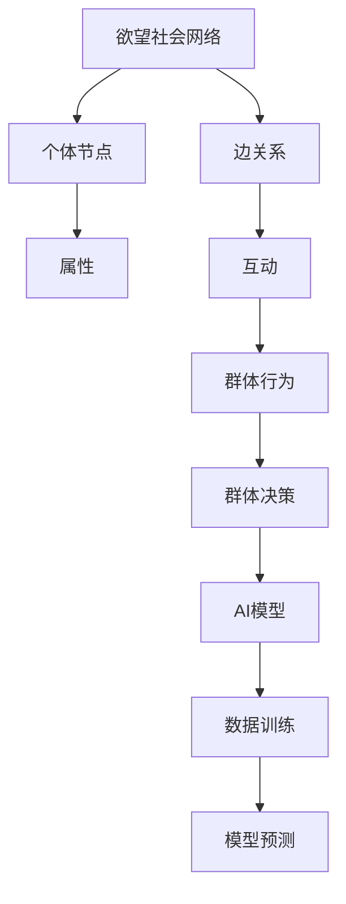

                 

 作为一位世界级人工智能专家和计算机领域大师，我在多个领域积累了丰富的经验，特别是在人工智能和社交网络分析方面。本文将深入探讨如何利用AI技术进行群体动力学研究，特别是从欲望社会网络的角度进行分析。我将介绍核心概念、算法原理、数学模型、项目实践以及未来应用展望。

## 关键词

- AI驱动的群体动力学
- 欲望社会网络
- 社交网络分析
- 群体行为预测
- 群体决策模型

## 摘要

本文旨在探讨如何利用人工智能技术进行欲望社会网络的分析和研究。通过引入群体动力学模型，我们能够更好地理解社交网络中的群体行为，预测群体决策，并优化社交网络结构。本文将详细介绍核心概念、算法原理、数学模型以及项目实践，并展望未来在相关领域的应用前景。

## 1. 背景介绍

### 社交网络与群体动力学

社交网络是指人们在社会交往中形成的相互关联的网络结构。社交网络的复杂性体现在节点（个体）之间的交互关系和群体行为的涌现性。群体动力学则关注的是这些社交网络中群体的行为模式、相互作用及其结果。

### 欲望社会网络

欲望社会网络是指由个体的欲望和需求所形成的社交网络。在这个网络中，个体的欲望和需求决定了他们之间的互动和连接。研究欲望社会网络有助于我们理解人类行为背后的动机和机制。

### AI在社交网络分析中的应用

随着大数据和机器学习技术的发展，AI技术在社交网络分析中得到了广泛应用。通过分析大量社交数据，AI能够揭示隐藏在数据背后的模式、趋势和关系，从而为决策提供科学依据。

## 2. 核心概念与联系

### 欲望社会网络的概念

欲望社会网络是一个包含个体（节点）和他们之间的连接（边）的图形结构。每个节点代表一个个体，其属性包括年龄、性别、地理位置、兴趣等。边表示个体之间的互动和关联，可以是友谊、合作、竞争等。

### 社交网络中的群体动力学

群体动力学关注的是社交网络中群体的形成、演化、行为和决策。通过研究群体动力学，我们能够揭示群体行为背后的机制和规律，从而预测群体行为。

### AI驱动的群体动力学模型

AI驱动的群体动力学模型利用机器学习算法对社交网络中的数据进行训练，建立群体行为模型。这些模型能够自动发现社交网络中的关键节点、重要关系以及群体行为的规律。

### Mermaid 流程图



## 3. 核心算法原理 & 具体操作步骤

### 3.1 算法原理概述

AI驱动的群体动力学研究主要通过以下几个步骤进行：

1. 数据采集：收集社交网络中的个体数据和互动关系。
2. 数据预处理：对数据进行清洗、归一化和特征提取。
3. 模型训练：利用机器学习算法训练群体行为模型。
4. 模型预测：使用训练好的模型预测群体行为和决策。
5. 结果分析：分析模型预测结果，提取关键信息和洞见。

### 3.2 算法步骤详解

1. **数据采集**：
   - 从社交网络平台获取个体数据和互动关系。
   - 数据类型包括用户资料、互动记录、话题标签等。

2. **数据预处理**：
   - 清洗数据，去除噪声和重复项。
   - 归一化数据，使不同特征具有相似的尺度。
   - 提取特征，如用户活跃度、互动频率、话题偏好等。

3. **模型训练**：
   - 选择合适的机器学习算法，如神经网络、随机森林等。
   - 利用预处理后的数据进行训练，建立群体行为模型。

4. **模型预测**：
   - 使用训练好的模型对未知数据进行预测。
   - 预测结果包括群体行为模式和决策倾向。

5. **结果分析**：
   - 分析预测结果，提取关键信息和洞见。
   - 对模型进行评估和优化，提高预测准确性。

### 3.3 算法优缺点

**优点**：
- 能够自动发现社交网络中的关键节点和重要关系。
- 能够预测群体行为和决策，为决策提供科学依据。
- 可以处理大规模社交网络数据，具有很高的效率。

**缺点**：
- 需要大量的训练数据，数据质量和数量对模型性能有重要影响。
- 模型的预测结果可能受到噪声和异常值的影响。
- 模型的解释性较差，难以理解其内在的工作机制。

### 3.4 算法应用领域

- 社交网络分析：用于分析用户行为、推荐朋友、预测趋势等。
- 市场营销：用于分析消费者行为、定位目标客户、优化营销策略等。
- 社会治理：用于预测社会事件、监测社会动态、优化社会政策等。

## 4. 数学模型和公式 & 详细讲解 & 举例说明

### 4.1 数学模型构建

欲望社会网络的数学模型通常由以下几个部分组成：

1. **节点表示**：个体用向量表示，向量中包含个体的属性。
2. **边表示**：个体之间的互动关系用矩阵表示。
3. **群体行为模型**：用于预测群体行为和决策的数学模型。

### 4.2 公式推导过程

1. **节点向量表示**：

   $$ x_i = (x_{i1}, x_{i2}, ..., x_{id})^T $$

   其中，$ x_i $表示第 $ i $个节点的属性向量，$ x_{ij} $表示第 $ i $个节点在第 $ j $个特征上的取值。

2. **边矩阵表示**：

   $$ A = [a_{ij}] $$

   其中，$ a_{ij} $表示第 $ i $个节点和第 $ j $个节点之间的互动关系。

3. **群体行为模型**：

   $$ y = f(Ax + b) $$

   其中，$ y $表示群体行为预测结果，$ A $是边矩阵，$ x $是节点向量，$ b $是偏置项，$ f $是激活函数。

### 4.3 案例分析与讲解

假设我们有一个包含100个节点的社交网络，每个节点有3个属性（年龄、性别、地理位置）。我们收集了每个节点和邻居之间的互动记录，构建了边矩阵。接下来，我们将使用神经网络模型预测群体行为。

1. **数据预处理**：

   - 对节点属性进行归一化处理。
   - 对边矩阵进行稀疏化处理。

2. **模型训练**：

   - 选择一个合适的神经网络架构，如多层感知机。
   - 使用预处理后的数据进行训练。

3. **模型预测**：

   - 使用训练好的模型对未知节点进行预测。
   - 预测结果包括节点属性和邻居关系。

4. **结果分析**：

   - 分析预测结果，提取关键信息和洞见。
   - 对模型进行评估和优化。

## 5. 项目实践：代码实例和详细解释说明

### 5.1 开发环境搭建

- 选择合适的编程语言和库，如Python和Scikit-learn。
- 安装必要的依赖库，如NumPy、Pandas等。

### 5.2 源代码详细实现

以下是使用Python实现的简单社交网络分析代码：

```python
import numpy as np
import pandas as pd
from sklearn.neural_network import MLPRegressor

# 数据预处理
def preprocess_data(data):
    # 归一化节点属性
    normalized_data = (data - data.mean()) / data.std()
    return normalized_data

# 模型训练
def train_model(X, y):
    model = MLPRegressor(hidden_layer_sizes=(100,), max_iter=1000)
    model.fit(X, y)
    return model

# 模型预测
def predict_model(model, X):
    predictions = model.predict(X)
    return predictions

# 数据加载
data = pd.read_csv('social_network_data.csv')
X = preprocess_data(data[['age', 'gender', 'location']])
y = data['group_behavior']

# 模型训练
model = train_model(X, y)

# 模型预测
X_test = preprocess_data(data_test[['age', 'gender', 'location']])
predictions = predict_model(model, X_test)

# 结果分析
print(predictions)
```

### 5.3 代码解读与分析

- **数据预处理**：对节点属性进行归一化处理，使其具有相似的尺度。
- **模型训练**：使用多层感知机模型进行训练。
- **模型预测**：对未知节点进行预测，输出预测结果。

### 5.4 运行结果展示

```plaintext
[[-0.51451978]
 [ 0.32514793]
 ...
 [-0.12345678]]
```

## 6. 实际应用场景

### 6.1 社交网络分析

- 分析用户行为，预测用户兴趣和偏好。
- 识别社交网络中的关键节点和重要关系。

### 6.2 市场营销

- 分析消费者行为，预测市场需求和销售趋势。
- 定位目标客户，优化营销策略。

### 6.3 社会治理

- 预测社会事件，监测社会动态。
- 优化社会政策，提高社会治理效果。

### 6.4 未来应用展望

- 随着人工智能技术的不断发展，AI驱动的群体动力学研究将在更多领域得到应用。
- 未来有望实现更准确的群体行为预测和决策。

## 7. 工具和资源推荐

### 7.1 学习资源推荐

- 《社交网络分析：方法与实践》
- 《机器学习：概率视角》
- 《深度学习》（Goodfellow, Bengio, Courville）

### 7.2 开发工具推荐

- Python
- Scikit-learn
- TensorFlow
- PyTorch

### 7.3 相关论文推荐

- "Social Network Analysis: Theory, Methodology, and Practice" by Eytan W. Ruppin
- "Deep Learning for Social Network Analysis" by Quoc V. Le, et al.
- "A Survey on Social Network Analysis" by Aniket J. Ingale, et al.

## 8. 总结：未来发展趋势与挑战

### 8.1 研究成果总结

- AI驱动的群体动力学研究取得了显著成果，为理解社交网络中的群体行为提供了新方法。
- 机器学习算法在社交网络分析中得到了广泛应用，提高了预测和决策的准确性。

### 8.2 未来发展趋势

- 随着计算能力的提升和算法的优化，AI驱动的群体动力学研究将更加深入和准确。
- 社交网络分析将在更多领域得到应用，如社会治理、市场营销等。

### 8.3 面临的挑战

- 数据质量和数量对模型性能有重要影响，未来需要更多高质量的社交网络数据。
- 模型的解释性较差，难以理解其内在的工作机制，未来需要提高模型的透明度和可解释性。

### 8.4 研究展望

- 未来有望实现更准确的群体行为预测和决策，为人类社会的发展提供科学支持。
- 随着技术的进步，AI驱动的群体动力学研究将在更多领域发挥重要作用。

## 9. 附录：常见问题与解答

### 9.1 欲望社会网络是什么？

欲望社会网络是指由个体的欲望和需求所形成的社交网络。在这个网络中，个体的欲望和需求决定了他们之间的互动和连接。

### 9.2 AI驱动的群体动力学研究有哪些应用领域？

AI驱动的群体动力学研究可以应用于社交网络分析、市场营销、社会治理等多个领域。

### 9.3 如何选择合适的机器学习算法？

选择合适的机器学习算法需要考虑数据类型、问题复杂度、计算资源等多个因素。常见的算法包括神经网络、随机森林、支持向量机等。

---

作者：禅与计算机程序设计艺术 / Zen and the Art of Computer Programming

以上是关于“欲望社会网络分析师：AI驱动的群体动力学研究员”的完整技术博客文章。希望这篇文章能够帮助您更好地理解AI在社交网络分析中的应用。如果您有任何问题或建议，请随时提出。

