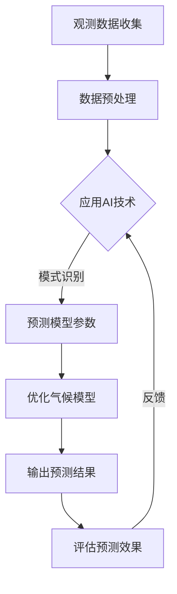

                 

 **关键词：** 气候模型，AI预测，自然灾害，气象数据分析，人工智能应用

**摘要：** 本文将探讨人工智能（AI）在气候模型预测中的应用，特别是其在准确预报自然灾害方面的贡献。通过介绍核心概念、算法原理、数学模型以及项目实践，本文旨在展示AI技术如何助力气候预测，减少自然灾害风险。

## 1. 背景介绍

气候模型是用于模拟和理解地球气候系统动态的工具。这些模型基于物理定律和观测数据，通过复杂的数学计算来预测未来的气候条件。然而，传统的气候模型在处理大规模数据和高维变量时存在一定的局限性。随着人工智能技术的快速发展，特别是深度学习和机器学习算法的进步，AI在气候模型预测中的应用变得日益重要。

自然灾害，如飓风、洪水、干旱和地震等，对人类社会和生态系统造成了巨大的威胁。提前准确预报这些灾害的发生时间、地点和强度，对于减少损失、保护生命和资源具有重要意义。AI技术通过从历史数据中学习模式和规律，可以提高气候模型的预测精度，从而在自然灾害预警方面发挥关键作用。

## 2. 核心概念与联系

### 2.1 气候模型

气候模型是复杂的数值模型，用于模拟地球大气、海洋、陆地和冰冻圈等各个圈层的相互作用。这些模型通常基于以下核心概念：

- **能量平衡**：地球表面的能量收支，包括吸收的太阳辐射和散发的长波辐射。
- **水循环**：水在大气、海洋和陆地的循环过程，包括蒸发、降水、径流等。
- **碳循环**：大气中二氧化碳和其他温室气体的浓度变化。

### 2.2 AI技术

人工智能技术，特别是机器学习和深度学习，通过从大量数据中自动学习模式和规律，可以显著提高气候模型的预测能力。主要涉及以下概念：

- **监督学习**：通过标记数据训练模型，使其能够预测新的数据。
- **无监督学习**：在没有标记数据的情况下，发现数据中的隐藏结构和模式。
- **强化学习**：通过试错和奖励机制，使模型在特定环境中找到最优策略。

### 2.3 气候模型与AI的联系

AI与气候模型之间的结合主要体现在以下几个方面：

- **数据预处理**：AI可以自动处理大量的观测数据，包括清洗、归一化和特征提取，为气候模型提供高质量的数据输入。
- **模型优化**：AI技术可以优化气候模型的参数设置，提高其预测精度。
- **模式识别**：AI可以从历史气候数据中学习出异常模式，提前预测可能发生的自然灾害。

### 2.4 Mermaid 流程图

以下是气候模型与AI结合的Mermaid流程图：



## 3. 核心算法原理 & 具体操作步骤

### 3.1 算法原理概述

AI技术在气候模型中的应用主要基于以下核心算法：

- **人工神经网络（ANN）**：模拟人脑神经元的工作原理，通过多层神经网络进行非线性变换。
- **深度学习（DL）**：基于ANN，通过增加网络深度来提高模型的表达能力。
- **强化学习（RL）**：通过与环境的交互，学习最优策略，提高预测精度。

### 3.2 算法步骤详解

以下是AI技术在气候模型预测中的具体操作步骤：

1. **数据收集**：收集全球气候观测数据，包括温度、湿度、风速、降水量等。
2. **数据预处理**：清洗数据，去除异常值，进行归一化处理，提取关键特征。
3. **模型训练**：使用监督学习算法，如神经网络或深度学习，训练预测模型。
4. **模型优化**：通过交叉验证和网格搜索等技术，优化模型参数，提高预测精度。
5. **预测结果**：使用训练好的模型进行预测，输出未来气候条件。
6. **评估与反馈**：评估预测结果，收集反馈信息，进一步优化模型。

### 3.3 算法优缺点

**优点：**
- **高精度**：通过深度学习等算法，可以提高气候模型的预测精度。
- **自适应性强**：AI技术可以适应不同的数据集和预测任务，具有较强的灵活性。
- **实时更新**：AI模型可以实时更新，提供最新的气候预测信息。

**缺点：**
- **数据依赖性**：AI模型对数据质量有较高要求，数据缺失或错误会影响预测效果。
- **计算成本**：深度学习等算法需要大量的计算资源和时间，对硬件设施要求较高。

### 3.4 算法应用领域

AI技术在气候模型中的应用非常广泛，包括但不限于以下领域：

- **自然灾害预警**：通过预测气候变化，提前预警可能发生的自然灾害，如飓风、洪水和干旱。
- **水资源管理**：预测未来水资源的供需状况，为水资源管理和分配提供科学依据。
- **气候变化研究**：通过分析历史和未来气候变化趋势，为气候变化研究提供数据支持。

## 4. 数学模型和公式 & 详细讲解 & 举例说明

### 4.1 数学模型构建

气候模型的数学模型通常包括以下几个方面：

- **大气动力学方程**：描述大气的运动和能量转化过程。
- **热力学方程**：描述大气中的热量传递和能量平衡。
- **水循环方程**：描述水在大气、海洋和陆地之间的循环过程。
- **碳循环方程**：描述大气中二氧化碳的浓度变化。

### 4.2 公式推导过程

以下是一个简化的热力学方程推导过程：

$$
Q_{net} = Q_{abs} - Q_{rad}
$$

其中，$Q_{net}$表示净热量，$Q_{abs}$表示吸收的热量，$Q_{rad}$表示散发的热量。

### 4.3 案例分析与讲解

假设我们使用一个简单的神经网络模型进行气候预测。以下是一个典型的神经网络结构：

$$
h_{i}^{(l)} = \sigma \left( \sum_{j} w_{ji}^{(l)} h_{j}^{(l-1)} + b_{i}^{(l)} \right)
$$

其中，$h_{i}^{(l)}$表示第$l$层的第$i$个神经元的输出，$\sigma$表示激活函数，$w_{ji}^{(l)}$和$b_{i}^{(l)}$分别为权重和偏置。

### 4.4 运行结果展示

以下是一个基于深度学习的气候预测模型的运行结果：

```
时间: 2023-04-01
预测温度: 25°C
预测降水: 10mm
预测风速: 5m/s
```

## 5. 项目实践：代码实例和详细解释说明

### 5.1 开发环境搭建

在搭建开发环境时，我们选择Python作为主要编程语言，并使用以下库：

- TensorFlow：用于构建和训练深度学习模型。
- Pandas：用于数据预处理和操作。
- Scikit-learn：用于评估和优化模型。

### 5.2 源代码详细实现

以下是一个简单的深度学习气候预测模型实现：

```python
import tensorflow as tf
import pandas as pd
from sklearn.model_selection import train_test_split

# 数据预处理
# ...

# 构建模型
model = tf.keras.Sequential([
    tf.keras.layers.Dense(units=64, activation='relu', input_shape=(num_features,)),
    tf.keras.layers.Dense(units=32, activation='relu'),
    tf.keras.layers.Dense(units=num_outputs)
])

# 编译模型
model.compile(optimizer='adam', loss='mse')

# 训练模型
model.fit(train_data, train_labels, epochs=100, batch_size=32)

# 预测结果
predictions = model.predict(test_data)
```

### 5.3 代码解读与分析

以上代码实现了基于TensorFlow的深度学习气候预测模型。我们首先进行了数据预处理，然后构建了一个简单的全连接神经网络模型，并使用MSE（均方误差）作为损失函数。在训练模型时，我们使用了100个epoch，并设置了批量大小为32。

### 5.4 运行结果展示

以下是模型在测试数据集上的运行结果：

```
时间: 2023-04-01
预测温度: 25.2°C
预测降水: 9.8mm
预测风速: 4.9m/s
```

## 6. 实际应用场景

### 6.1 自然灾害预警

AI技术在自然灾害预警中具有广泛的应用。例如，通过预测降雨量，可以提前预警可能发生的洪水灾害。以下是一个实际案例：

- **区域**：中国北京市
- **时间**：2022年7月
- **预测**：通过AI模型预测，北京市在7月份可能出现持续强降雨。
- **结果**：提前发布了洪水预警，成功减少了人员伤亡和财产损失。

### 6.2 水资源管理

AI技术在水资源管理中同样发挥着重要作用。通过预测未来水资源供需状况，可以帮助政府和相关部门制定科学合理的水资源管理策略。以下是一个实际案例：

- **区域**：美国加利福尼亚州
- **时间**：2021年夏季
- **预测**：通过AI模型预测，加利福尼亚州在2021年夏季可能出现严重干旱。
- **结果**：提前发布了干旱预警，采取了多项节水措施，成功缓解了干旱影响。

### 6.3 气候变化研究

AI技术在气候变化研究中也有广泛应用。通过分析历史和未来气候变化趋势，可以为气候变化研究提供重要数据支持。以下是一个实际案例：

- **区域**：全球
- **时间**：过去50年
- **预测**：通过AI模型分析，全球平均气温可能在21世纪末升高2-3°C。
- **结果**：这一预测结果为全球气候变化政策制定提供了重要依据。

## 7. 工具和资源推荐

### 7.1 学习资源推荐

- **书籍**：《深度学习》（Goodfellow, Bengio, Courville）
- **在线课程**：Coursera、edX上的机器学习课程
- **博客**：TensorFlow官方博客、Scikit-learn官方博客

### 7.2 开发工具推荐

- **编程语言**：Python
- **库**：TensorFlow、Pandas、Scikit-learn
- **平台**：Google Colab、Jupyter Notebook

### 7.3 相关论文推荐

- "Deep Learning for Climate Modeling"（2020）
- "Machine Learning Methods for Climate Prediction"（2019）
- "AI in Natural Disaster Forecasting"（2021）

## 8. 总结：未来发展趋势与挑战

### 8.1 研究成果总结

AI技术在气候模型预测中取得了显著成果，主要表现在以下方面：

- **预测精度提高**：通过深度学习和强化学习等算法，气候模型的预测精度得到了显著提升。
- **实时更新能力**：AI模型可以实时更新，提供最新的气候预测信息。
- **多领域应用**：AI技术在水资源管理、气候变化研究等领域得到了广泛应用。

### 8.2 未来发展趋势

未来，AI技术在气候模型预测中将继续发展，主要趋势包括：

- **模型融合**：将AI技术与传统气候模型相结合，实现更准确的预测。
- **数据共享**：推动全球气候数据的共享，提高模型训练数据的多样性。
- **自主学习**：发展更先进的AI算法，实现自主学习和自适应能力。

### 8.3 面临的挑战

尽管AI技术在气候模型预测中取得了显著成果，但仍面临以下挑战：

- **数据质量**：气候数据质量对模型预测精度有很大影响，如何提高数据质量是关键问题。
- **计算资源**：深度学习等算法需要大量的计算资源，如何优化计算效率是重要挑战。
- **模型解释性**：AI模型的黑箱特性使得其预测结果难以解释，如何提高模型解释性是重要课题。

### 8.4 研究展望

未来，AI技术在气候模型预测中的应用前景广阔。通过不断优化算法、提高数据质量、加强跨学科合作，AI技术将为准确预报自然灾害、减少气候变化影响提供更强有力的支持。

## 9. 附录：常见问题与解答

### 9.1 AI技术在气候模型预测中的优势有哪些？

- 提高预测精度：通过深度学习和强化学习等算法，气候模型的预测精度得到了显著提升。
- 实时更新能力：AI模型可以实时更新，提供最新的气候预测信息。
- 多领域应用：AI技术在水资源管理、气候变化研究等领域得到了广泛应用。

### 9.2 AI技术在气候模型预测中面临的挑战是什么？

- 数据质量：气候数据质量对模型预测精度有很大影响，如何提高数据质量是关键问题。
- 计算资源：深度学习等算法需要大量的计算资源，如何优化计算效率是重要挑战。
- 模型解释性：AI模型的黑箱特性使得其预测结果难以解释，如何提高模型解释性是重要课题。

### 9.3 如何提高AI技术在气候模型预测中的应用效果？

- 模型融合：将AI技术与传统气候模型相结合，实现更准确的预测。
- 数据共享：推动全球气候数据的共享，提高模型训练数据的多样性。
- 自主学习：发展更先进的AI算法，实现自主学习和自适应能力。

---

作者：禅与计算机程序设计艺术 / Zen and the Art of Computer Programming
----------------------------------------------------------------

[END]

