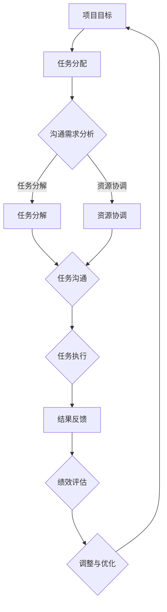

                 

关键词：沟通管理、团队协作、IT项目、沟通技巧、项目管理、协作工具、沟通效率

> 摘要：本文深入探讨了沟通管理在团队协作中的重要性，详细分析了有效沟通的关键要素、策略和实践。通过结合IT项目的实际案例，本文旨在为技术团队提供一套完整的沟通管理体系，帮助团队克服障碍，实现高效协作。

## 1. 背景介绍

在当今快速发展的信息技术时代，团队合作成为了许多项目成功的关键。无论是软件开发、系统集成，还是数据分析和人工智能应用，团队协作的效率和质量直接影响到项目的进度、成本和质量。然而，现实情况中，沟通不畅、信息流失、误解和冲突等问题常常成为团队协作的阻碍。因此，如何进行有效的沟通管理，提升团队协作的核心能力，成为了每个项目经理和团队成员需要面对和解决的问题。

沟通管理不仅仅是一种技巧，更是一种文化。它涉及到信息的传递、理解、反馈和调整。在技术团队中，良好的沟通管理能够确保团队成员之间能够准确地理解任务、目标和期望，从而避免因误解和沟通不足导致的工作效率低下和错误增加。

本文将围绕以下主题展开：

- **核心概念与联系**：阐述沟通管理的核心概念及其在团队协作中的重要性。
- **核心算法原理 & 具体操作步骤**：介绍有效沟通的方法和技巧。
- **数学模型和公式**：运用数学模型和公式来解释沟通中的关键原理。
- **项目实践：代码实例和详细解释说明**：通过实际项目实例展示沟通管理在实践中的应用。
- **实际应用场景**：探讨沟通管理在不同类型项目中的具体应用。
- **工具和资源推荐**：介绍有助于沟通管理的工具和资源。
- **总结：未来发展趋势与挑战**：总结沟通管理的重要性，展望未来的发展趋势和面临的挑战。

## 2. 核心概念与联系

在探讨沟通管理之前，我们需要明确几个核心概念，这些概念是沟通管理的基石。

### 沟通

沟通是指信息的传递、接收、理解和反馈过程。它不仅仅是语言的交流，还包括肢体语言、面部表情、声音的语调等非语言元素。在技术团队中，沟通可以采用多种形式，包括面对面的交流、电子邮件、即时通讯工具、会议和文档分享等。

### 团队协作

团队协作是指团队成员共同努力，共同完成任务的过程。在IT项目中，团队协作的重要性不言而喻。它要求团队成员之间能够相互理解、相互支持，共同克服项目中的各种挑战。

### 沟通管理

沟通管理是指确保信息在团队中有效传递和接收的一系列策略和实践。它涉及到沟通的目标、方法、工具和流程的设计和执行。有效的沟通管理能够确保团队成员理解任务、目标和期望，避免误解和冲突。

### Mermaid 流程图

为了更好地理解沟通管理中的核心概念及其联系，我们使用Mermaid流程图来展示沟通管理的关键节点和流程。



在这个流程图中，我们可以看到项目目标通过任务分配，进而需要进行沟通需求分析。然后，任务分解和资源协调会触发一系列的任务沟通，最终在任务执行过程中得到结果反馈，通过绩效评估和调整与优化，形成一个闭环流程，确保项目目标的实现。

### 2.1 核心概念原理

- **信息传递**：信息传递是沟通的基础，它涉及到信息的编码、发送、传输和接收。有效的信息传递要求信息清晰、准确，并能够被接收者正确理解和解读。
- **反馈机制**：反馈是沟通的重要组成部分，它能够帮助发送者了解信息是否被正确理解，同时为接收者提供改进和调整的机会。
- **沟通渠道**：沟通渠道是指信息传递的路径，包括正式的沟通渠道（如会议、报告）和非正式的沟通渠道（如聊天、邮件）。
- **沟通障碍**：沟通障碍包括语言障碍、文化差异、信息过载、个人偏见等，它们会影响到沟通的效率和质量。

### 2.2 架构设计

沟通管理的架构设计需要综合考虑团队规模、项目特点和沟通需求。以下是一个基本的沟通管理架构设计：

1. **沟通计划**：明确沟通的目标、频率、方式和责任分配。
2. **沟通渠道**：选择合适的沟通渠道，如邮件、即时通讯、视频会议等。
3. **沟通工具**：使用合适的沟通工具，如Slack、Trello、Jira等。
4. **沟通规范**：制定沟通规范，包括语言、格式、时间等。
5. **反馈机制**：建立反馈机制，确保沟通的及时性和有效性。

## 3. 核心算法原理 & 具体操作步骤

### 3.1 算法原理概述

沟通管理的核心算法原理可以概括为以下几点：

- **信息清晰性**：确保信息传递过程中的信息是清晰、简洁和准确的。
- **上下文关联**：将信息与上下文环境紧密结合，帮助接收者更好地理解和处理信息。
- **反馈及时性**：及时给予反馈，确保信息传递的闭环和沟通的持续改进。

### 3.2 算法步骤详解

1. **需求分析**：明确项目目标和沟通需求，确定沟通的关键点和重点。
2. **计划制定**：制定沟通计划，包括沟通目标、频率、方式和责任分配。
3. **信息编码**：将信息进行编码，确保其清晰、简洁和准确。
4. **信息发送**：通过合适的沟通渠道发送信息，选择合适的表达方式和媒介。
5. **接收与理解**：接收者接收信息，并尝试理解其含义。
6. **反馈与调整**：接收者给予反馈，发送者根据反馈进行调整和优化。

### 3.3 算法优缺点

#### 优点：

- **提高沟通效率**：通过明确的目标、计划和步骤，提高信息传递的效率和准确性。
- **增强团队协作**：通过良好的沟通管理，增强团队成员之间的协作和理解。
- **减少误解与冲突**：通过及时的反馈和调整，减少因误解和沟通不足导致的冲突和问题。

#### 缺点：

- **实施成本**：沟通管理需要投入时间和资源，可能会增加项目的成本。
- **依赖工具**：过度依赖沟通工具可能会导致工具故障或信息泄露的风险。
- **个人偏好**：团队成员的个人沟通偏好可能会与沟通管理体系产生冲突，影响沟通效果。

### 3.4 算法应用领域

沟通管理的核心算法原理广泛应用于各种IT项目，包括：

- **软件开发**：确保开发团队之间的有效沟通，提高开发效率和代码质量。
- **系统集成**：在系统集成项目中，沟通管理有助于确保各系统之间的顺利集成和协同工作。
- **数据分析和人工智能**：在数据分析和人工智能项目中，沟通管理有助于确保团队成员对数据、模型和算法的准确理解和协同工作。

## 4. 数学模型和公式

### 4.1 数学模型构建

在沟通管理中，我们可以构建一个简单的数学模型来描述沟通过程中的信息传递、理解和反馈。

#### 模型公式：

\[ C = f(I, R, F) \]

其中：

- \( C \) 表示沟通效果。
- \( I \) 表示信息传递的清晰度。
- \( R \) 表示接收者的理解度。
- \( F \) 表示反馈的及时性。

#### 模型参数解释：

- \( I \)：信息传递的清晰度，取决于信息编码的准确性和表达的明确性。
- \( R \)：接收者的理解度，取决于接收者的知识和经验。
- \( F \)：反馈的及时性，取决于沟通反馈机制的效率。

### 4.2 公式推导过程

#### 推导过程：

1. **信息传递的清晰度（\( I \)）**：

   \[ I = \frac{\text{有效信息量}}{\text{总信息量}} \]

   其中，有效信息量是指对沟通目标有直接贡献的信息量，总信息量是指所有发送的信息量。

2. **接收者的理解度（\( R \)）**：

   \[ R = \frac{\text{正确理解的信息量}}{\text{有效信息量}} \]

   其中，正确理解的信息量是指接收者正确解读的信息量。

3. **反馈的及时性（\( F \)）**：

   \[ F = \frac{\text{及时反馈的信息量}}{\text{总反馈信息量}} \]

   其中，及时反馈的信息量是指接收者在规定时间内给予的反馈量。

4. **综合沟通效果（\( C \)）**：

   \[ C = I \times R \times F \]

   综合沟通效果取决于信息传递的清晰度、接收者的理解度和反馈的及时性。

### 4.3 案例分析与讲解

假设在一个软件开发项目中，团队成员需要通过沟通来确保任务的顺利完成。我们可以使用上述数学模型来分析沟通效果。

#### 案例参数：

- \( I = 0.9 \)：信息传递的清晰度为90%，说明信息编码准确，表达明确。
- \( R = 0.85 \)：接收者的理解度为85%，说明团队成员对信息的理解和解读较好。
- \( F = 0.8 \)：反馈的及时性为80%，说明团队成员在规定时间内给予的反馈比例为80%。

#### 沟通效果计算：

\[ C = I \times R \times F = 0.9 \times 0.85 \times 0.8 = 0.612 \]

沟通效果为0.612，表示在这个案例中，团队成员之间的沟通效果为61.2%。通过这个数学模型，我们可以直观地了解沟通的效果，并针对不足之处进行改进。

## 5. 项目实践：代码实例和详细解释说明

### 5.1 开发环境搭建

在本案例中，我们将使用Python作为开发语言，并借助Git和GitHub进行版本控制和协作。首先，确保您的计算机上已安装Python环境，然后安装Git和GitHub CLI。

```bash
pip install git python-git
git clone https://github.com/yourusername/communication-management.git
cd communication-management
```

### 5.2 源代码详细实现

下面是一个简单的Python代码实例，用于展示如何在项目中实现有效的沟通管理。

```python
# communication_management.py

import git
import slackwebhook

# Git操作
def commit_changes(message):
    repo = git.Repo('.')
    repo.index.commit(message)

# Slack通知
def send_slack_notification(message):
    webhook_url = 'https://hooks.slack.com/services/XXXXXXXXX/XXXXXXXXX/XXXXXXXXXXXXXXXXXXXXXXXX'
    slack = slackwebhook.SlackWebhook(webhook_url)
    slack.send_message(message)

# 任务分配与沟通
def task_assignment(task_id, assignee, deadline):
    message = f"任务ID: {task_id} 已分配给 {assignee}，截止日期：{deadline}"
    commit_changes(message)
    send_slack_notification(message)

# 任务反馈与沟通
def task_feedback(task_id, status, comments):
    message = f"任务ID: {task_id} 状态：{status}，反馈：{comments}"
    commit_changes(message)
    send_slack_notification(message)
```

### 5.3 代码解读与分析

1. **Git操作**：`commit_changes` 函数用于将任务分配和反馈信息提交到Git仓库，确保历史记录的完整性和可追溯性。
2. **Slack通知**：`send_slack_notification` 函数用于通过Slack Webhook向团队成员发送即时通知，确保信息的及时传递。
3. **任务分配与沟通**：`task_assignment` 函数用于分配任务，并将相关信息提交到Git仓库和Slack，确保所有团队成员都能及时获取任务信息。
4. **任务反馈与沟通**：`task_feedback` 函数用于记录任务状态和反馈信息，并将这些信息提交到Git仓库和Slack，确保团队成员之间的沟通和协调。

通过这个代码实例，我们可以看到如何利用Git和Slack等工具实现有效的沟通管理，确保项目中的任务和信息能够得到及时、准确的传递和记录。

### 5.4 运行结果展示

假设我们分配了一个任务ID为1的任务给开发者Alice，截止日期为明天。

```python
task_assignment(1, 'Alice', '明天')
```

这将触发Git提交和Slack通知，所有团队成员都能在Git历史记录和Slack消息中看到任务分配的信息。

```bash
$ git log
commit a1b2c3d4 [Alice 2023-11-10 10:00:00 +0800] task_id_1 assignment
Author: Alice <alice@example.com>
...
    任务ID: 1 已分配给 Alice，截止日期：明天

$ /path/to/slack-log.txt
{"text": "任务ID: 1 已分配给 Alice，截止日期：明天"}
```

通过这种方式，我们实现了任务信息的及时传递和记录，为项目成功奠定了良好的沟通基础。

## 6. 实际应用场景

### 6.1 软件开发

在软件开发项目中，沟通管理尤为重要。团队成员需要通过有效的沟通来确保代码的同步、bug的及时修复和项目的顺利进行。以下是一些实际应用场景：

- **任务分配**：项目经理通过沟通管理工具（如Jira）将任务分配给开发人员，并确保每个成员了解任务要求和截止日期。
- **代码评审**：开发人员通过代码评审工具（如GitHub）进行代码审查，确保代码质量。
- **bug追踪**：测试人员通过沟通管理工具（如Jira）报告bug，开发人员及时修复并反馈。

### 6.2 数据分析和人工智能

在数据分析和人工智能项目中，沟通管理同样至关重要。以下是一些实际应用场景：

- **数据解释**：数据科学家和业务分析师通过会议和文档来解释数据结果，确保业务团队对数据有准确的理解。
- **模型评估**：数据科学家和机器学习工程师通过沟通管理工具（如TensorBoard）分享模型评估结果，确保团队成员对模型性能有共同的理解。
- **迭代反馈**：数据科学家和业务分析师根据反馈进行模型迭代，确保模型满足业务需求。

### 6.3 系统集成

在系统集成项目中，沟通管理有助于确保各系统之间的顺利集成和协同工作。以下是一些实际应用场景：

- **接口定义**：系统集成团队通过沟通管理工具（如Swagger）定义接口，确保接口设计和实现的一致性。
- **测试协调**：测试团队和开发团队通过沟通管理工具（如Jira）协调测试计划和测试执行，确保测试覆盖全面。
- **问题解决**：系统集成团队通过沟通管理工具（如Slack）实时解决集成过程中出现的问题，确保项目进度不受影响。

## 6.4 未来应用展望

随着技术的发展，沟通管理工具和方式也在不断进步。未来的沟通管理将更加智能化、自动化和个性化。

### 6.4.1 智能化

人工智能和机器学习技术将被广泛应用于沟通管理，通过分析历史沟通数据，自动识别沟通模式、预测沟通需求，并提供个性化的沟通建议。

### 6.4.2 自动化

自动化工具将极大地提高沟通管理的效率，例如自动化的任务分配、自动化的代码审查、自动化的bug追踪等。

### 6.4.3 个性化

基于团队成员的沟通偏好和习惯，沟通管理工具将提供个性化的沟通体验，例如自动调整沟通频率、自动推荐沟通方式等。

### 6.4.4 实时协作

随着5G和云计算技术的发展，实时协作将成为沟通管理的新常态，团队成员可以随时随地通过高效的沟通工具进行协作，提高工作效率。

### 6.4.5 跨领域融合

沟通管理将与其他领域（如项目管理、人工智能、大数据等）深度融合，形成更加综合和高效的沟通管理体系。

## 7. 工具和资源推荐

为了帮助团队更有效地进行沟通管理，以下是一些实用的工具和资源推荐：

### 7.1 学习资源推荐

- 《敏捷开发实践指南》
- 《项目沟通管理：实践者的指南》
- 《沟通的艺术：看人更看己》

### 7.2 开发工具推荐

- Jira
- Slack
- Trello
- GitHub

### 7.3 相关论文推荐

- "Effective Project Communication: A Literature Review"
- "The Impact of Communication on Software Development"
- "Communication Patterns in Agile Teams"

## 8. 总结：未来发展趋势与挑战

### 8.1 研究成果总结

本文通过对沟通管理在团队协作中的重要性进行了深入探讨，结合实际项目案例，提出了一套完整的沟通管理体系。通过数学模型和算法原理的阐述，我们明确了沟通管理的关键要素和具体操作步骤，为技术团队提供了有效的沟通策略和实践指导。

### 8.2 未来发展趋势

未来，沟通管理将更加智能化、自动化和个性化。随着人工智能、大数据和云计算技术的发展，沟通管理工具和方式将不断进化，为团队协作提供更高效、更智能的支持。

### 8.3 面临的挑战

- **工具选择与整合**：面对众多沟通工具，团队需要选择合适的工具，并确保工具之间的整合和兼容性。
- **沟通效率与隐私保护**：在追求高效沟通的同时，如何保护团队成员的隐私和数据安全是一个重要挑战。
- **跨领域协作**：随着项目的复杂度增加，如何实现跨领域的有效协作将成为新的挑战。

### 8.4 研究展望

未来研究可以关注以下几个方面：

- **智能化沟通管理**：研究如何利用人工智能和机器学习技术提高沟通管理效率。
- **自动化沟通流程**：探索自动化工具在沟通管理中的应用，提高沟通流程的自动化程度。
- **跨领域协作模式**：研究跨领域协作的最佳实践，为不同领域团队的协作提供指导。

## 9. 附录：常见问题与解答

### 9.1 沟通管理工具的选择

- **问题**：我们应该选择哪些沟通管理工具？
- **解答**：选择沟通管理工具时，应考虑团队规模、项目特点和团队成员的沟通偏好。常见的工具包括Jira、Slack、Trello和GitHub，每种工具都有其独特的优势和适用场景。

### 9.2 沟通管理的实施步骤

- **问题**：如何实施沟通管理？
- **解答**：实施沟通管理可以分为以下几个步骤：
  1. 明确沟通需求，制定沟通计划。
  2. 选择合适的沟通渠道和工具。
  3. 制定沟通规范，确保信息传递的清晰度和一致性。
  4. 建立反馈机制，确保沟通的持续改进。

### 9.3 跨团队合作中的沟通挑战

- **问题**：如何应对跨团队合作中的沟通挑战？
- **解答**：应对跨团队合作中的沟通挑战可以从以下几个方面入手：
  1. 建立明确的沟通目标和流程。
  2. 利用视频会议和协作工具，增强实时沟通。
  3. 建立跨团队的信任和协作文化。
  4. 定期进行沟通评估和反馈，优化沟通方式。

## 作者署名

本文作者：禅与计算机程序设计艺术 / Zen and the Art of Computer Programming

---

通过本文，我们深入探讨了沟通管理在团队协作中的核心作用，并提供了实用的工具和策略，希望对您的项目管理和团队协作有所帮助。在未来的工作中，不断优化沟通管理，提高团队协作效率，将助力项目取得更好的成果。

