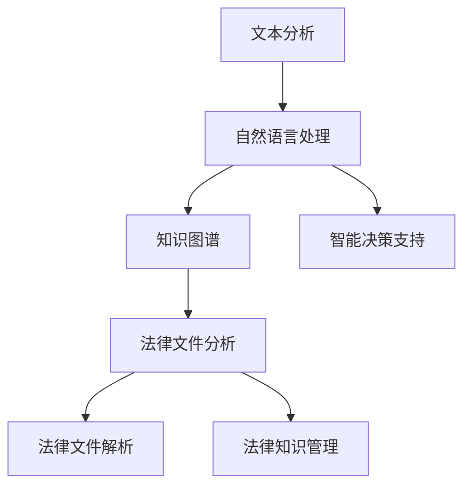

                 

关键词：法律文件分析、智能工具、市场需求、技术发展、应用场景、未来展望

>摘要：本文从法律文件智能分析工具的背景出发，探讨了其在当前市场中的需求与挑战。通过分析核心算法原理、数学模型及实际应用案例，本文旨在为相关领域的研究者和从业者提供有价值的参考。

## 1. 背景介绍

随着数字化时代的到来，法律文件的电子化处理已经成为必然趋势。然而，法律文件的复杂性以及数量庞大，使得传统的法律分析和处理方式面临巨大的挑战。为了解决这一问题，智能法律文件分析工具应运而生。这些工具利用人工智能技术，能够自动处理和解析大量的法律文件，提高法律工作的效率和准确性。

### 1.1 法律文件分析的需求

法律文件分析的需求主要来自于以下几个方面：

- **大量法律文件的解析与处理**：随着法律行业的不断发展和扩大，法律文件的数量和种类日益增多，传统的手工处理方式已经无法满足需求。
- **提高工作效率**：法律文件的自动化分析能够节省人力和时间成本，提高工作效率。
- **确保准确性**：人工智能系统能够通过学习和优化算法，提高法律文件分析的准确性，减少人为错误。

### 1.2 智能法律文件分析工具的发展

智能法律文件分析工具的发展可以分为以下几个阶段：

- **文本识别与预处理**：利用OCR（光学字符识别）技术对法律文件进行数字化处理，提取文本内容。
- **自然语言处理**：通过自然语言处理技术，对法律文件中的文本进行语义分析和理解，提取关键信息。
- **知识图谱构建**：利用知识图谱技术，将法律文件中的概念、关系和事实进行关联和可视化。
- **智能决策支持**：通过机器学习和深度学习技术，对法律文件进行智能分析和预测，为法律工作提供决策支持。

## 2. 核心概念与联系

在构建智能法律文件分析工具时，需要理解以下几个核心概念：

### 2.1 文本分析

文本分析是法律文件分析的基础，主要包括：

- **词频统计**：对法律文件中的词语出现频率进行统计，帮助理解文档的主要内容。
- **文本分类**：根据文档的内容和特征，将其归类到不同的类别中。
- **情感分析**：对法律文件中的文本进行情感倾向分析，判断作者的态度和观点。

### 2.2 自然语言处理

自然语言处理是法律文件分析的重要工具，主要包括：

- **命名实体识别**：识别法律文件中的名词、组织、人名等实体。
- **关系抽取**：提取法律文件中实体之间的关系，如合同中的条款和条件之间的关系。
- **文本生成**：根据法律文件中的内容，生成新的法律文件或摘要。

### 2.3 知识图谱

知识图谱是法律文件分析的高级形式，通过将法律文件中的概念、关系和事实进行关联和可视化，实现法律知识的结构化。

### 2.4 智能决策支持

智能决策支持是法律文件分析的高级目标，通过机器学习和深度学习技术，对法律文件进行智能分析和预测，为法律工作提供决策支持。

以下是一个简化的Mermaid流程图，展示了法律文件智能分析工具的核心概念和联系：



## 3. 核心算法原理 & 具体操作步骤

### 3.1 算法原理概述

法律文件智能分析工具的核心算法主要包括自然语言处理、机器学习和深度学习技术。以下是对这些算法原理的概述：

- **自然语言处理（NLP）**：NLP是一种让计算机能够理解和生成人类语言的技术。在法律文件分析中，NLP主要用于文本预处理、词性标注、实体识别、关系抽取等。
- **机器学习（ML）**：ML是一种通过数据训练模型，从而进行预测和分类的技术。在法律文件分析中，ML主要用于文本分类、情感分析、命名实体识别等。
- **深度学习（DL）**：DL是一种基于多层神经网络的学习方法。在法律文件分析中，DL主要用于复杂的数据处理、图像识别、文本生成等。

### 3.2 算法步骤详解

以下是法律文件智能分析工具的具体操作步骤：

#### 3.2.1 文本预处理

1. **文本清洗**：去除文本中的噪声，如HTML标签、特殊字符、停用词等。
2. **分词**：将文本分割成词语或词组。
3. **词性标注**：为每个词语标注其词性，如名词、动词、形容词等。

#### 3.2.2 实体识别

1. **命名实体识别**：识别文本中的名词、组织、人名等实体。
2. **关系抽取**：提取实体之间的关系，如合同中的条款和条件之间的关系。

#### 3.2.3 文本分类

1. **特征提取**：从文本中提取特征，如词频、词袋、TF-IDF等。
2. **模型训练**：使用机器学习或深度学习模型对特征进行训练。
3. **分类预测**：根据训练好的模型，对新的文本进行分类预测。

#### 3.2.4 情感分析

1. **特征提取**：从文本中提取情感特征。
2. **模型训练**：使用机器学习或深度学习模型对特征进行训练。
3. **情感预测**：根据训练好的模型，对文本进行情感预测。

#### 3.2.5 智能决策支持

1. **数据预处理**：对法律文件进行预处理，提取关键信息。
2. **模型训练**：使用机器学习或深度学习模型对数据进行训练。
3. **决策支持**：根据训练好的模型，对法律文件进行分析和预测，为决策提供支持。

### 3.3 算法优缺点

- **自然语言处理（NLP）**：
  - **优点**：能够对文本进行语义分析和理解，适用于文本分类、情感分析等任务。
  - **缺点**：对复杂文本的理解能力有限，容易受到噪声和歧义的影响。

- **机器学习（ML）**：
  - **优点**：能够从大量数据中学习规律，提高分类和预测的准确性。
  - **缺点**：对数据量和质量要求较高，模型训练时间较长。

- **深度学习（DL）**：
  - **优点**：能够处理复杂的数据结构，对图像、文本和语音等数据有很好的表现。
  - **缺点**：对计算资源和时间要求较高，模型复杂度较高。

### 3.4 算法应用领域

法律文件智能分析工具的应用领域广泛，主要包括：

- **法律文档自动化处理**：如合同审查、法律意见书生成等。
- **法律案件分析**：如案件预测、证据分析等。
- **法律知识管理**：如法律知识图谱构建、法律信息检索等。

## 4. 数学模型和公式 & 详细讲解 & 举例说明

### 4.1 数学模型构建

在法律文件智能分析中，常用的数学模型包括词袋模型、朴素贝叶斯模型、支持向量机（SVM）和深度学习模型等。以下是对这些模型的构建和解释。

#### 4.1.1 词袋模型

词袋模型是一种基于文本向量的表示方法。它将文本表示为一个向量，向量的每个维度对应文本中的一个词。词袋模型的数学模型可以表示为：

$$
\text{向量空间模型} = \{w_1, w_2, ..., w_n\}
$$

其中，$w_i$ 表示第 $i$ 个词的权重。

#### 4.1.2 朴素贝叶斯模型

朴素贝叶斯模型是一种基于概率的文本分类模型。它的核心思想是，每个词的概率可以独立地计算，然后通过贝叶斯定理计算文本属于某个类别的概率。朴素贝叶斯模型的数学模型可以表示为：

$$
P(C|D) = \frac{P(D|C)P(C)}{P(D)}
$$

其中，$C$ 表示类别，$D$ 表示文档。

#### 4.1.3 支持向量机（SVM）

支持向量机是一种基于优化理论的分类模型。它的目标是找到最佳的分类超平面，使得不同类别的数据点之间的距离最大。支持向量机的数学模型可以表示为：

$$
\text{分类函数} = f(x) = \text{sign}(\omega \cdot x + b)
$$

其中，$\omega$ 表示权重向量，$b$ 表示偏置。

#### 4.1.4 深度学习模型

深度学习模型是一种基于多层神经网络的学习方法。它的目标是自动学习输入和输出之间的映射关系。深度学习模型的数学模型可以表示为：

$$
h_{\text{hidden}} = \sigma(W_{\text{hidden}} \cdot x + b_{\text{hidden}})
$$

$$
\text{输出} = \sigma(W_{\text{output}} \cdot h_{\text{hidden}} + b_{\text{output}})
$$

其中，$h_{\text{hidden}}$ 表示隐藏层的激活函数，$\sigma$ 表示激活函数，$W$ 和 $b$ 分别表示权重和偏置。

### 4.2 公式推导过程

以下是对上述模型的公式推导过程的详细讲解。

#### 4.2.1 词袋模型

词袋模型的推导过程如下：

1. **词频统计**：假设文本 $T$ 中包含 $n$ 个词，$t_1, t_2, ..., t_n$ 分别表示这 $n$ 个词的词频。
2. **向量表示**：将文本 $T$ 表示为一个向量 $V = (v_1, v_2, ..., v_n)$，其中 $v_i$ 表示词 $t_i$ 的词频。
3. **权重计算**：对每个词的词频进行归一化处理，得到权重 $w_i$。通常使用 TF-IDF（词频-逆文档频率）方法进行权重计算。

#### 4.2.2 朴素贝叶斯模型

朴素贝叶斯模型的推导过程如下：

1. **先验概率计算**：计算每个类别 $C$ 的先验概率 $P(C)$。
2. **条件概率计算**：计算每个词 $w$ 在类别 $C$ 下的条件概率 $P(w|C)$。
3. **后验概率计算**：使用贝叶斯定理计算每个类别 $C$ 的后验概率 $P(C|D)$。
4. **分类预测**：选择后验概率最大的类别作为分类结果。

#### 4.2.3 支持向量机（SVM）

支持向量机模型的推导过程如下：

1. **线性可分支持向量机**：假设数据集 $D = \{(x_1, y_1), (x_2, y_2), ..., (x_n, y_n)\}$，其中 $x_i$ 表示第 $i$ 个数据点，$y_i$ 表示第 $i$ 个数据点的类别。
2. **优化目标**：最小化分类超平面到支持向量的距离，即最小化目标函数 $J(\omega, b) = \frac{1}{2}||\omega||^2 + C \sum_{i=1}^n \xi_i$，其中 $\omega$ 表示权重向量，$b$ 表示偏置，$C$ 表示正则化参数，$\xi_i$ 表示第 $i$ 个支持向量的松弛变量。
3. **求解优化问题**：使用拉格朗日乘子法求解优化问题，得到分类函数。

#### 4.2.4 深度学习模型

深度学习模型的推导过程如下：

1. **神经网络结构**：定义神经网络的结构，包括输入层、隐藏层和输出层。
2. **前向传播**：计算输入到神经网络的每个节点的激活值。
3. **反向传播**：计算损失函数关于网络参数的梯度，并更新网络参数。
4. **优化算法**：使用梯度下降或其他优化算法更新网络参数。

### 4.3 案例分析与讲解

以下是一个简单的案例，用于说明上述数学模型在法律文件分析中的应用。

#### 4.3.1 数据集

假设有一个包含法律合同的数据集，其中每个合同被标记为有效或无效。数据集中的每份合同包含若干条款，每个条款由一个文本组成。

#### 4.3.2 模型选择

选择朴素贝叶斯模型和深度学习模型对数据集进行分类。

#### 4.3.3 模型训练

1. **文本预处理**：对每份合同的条款进行文本预处理，包括分词、词性标注和词频统计。
2. **特征提取**：从预处理后的文本中提取特征，如词频、词袋和TF-IDF等。
3. **模型训练**：使用提取到的特征训练朴素贝叶斯模型和深度学习模型。

#### 4.3.4 模型评估

1. **测试集划分**：将数据集划分为训练集和测试集。
2. **模型评估**：使用测试集评估模型的准确率、召回率和F1值等指标。

#### 4.3.5 结果分析

通过模型评估结果可以看出，深度学习模型的准确率和召回率均高于朴素贝叶斯模型。这表明深度学习模型在法律文件分析中具有更好的性能。

## 5. 项目实践：代码实例和详细解释说明

### 5.1 开发环境搭建

在开始项目实践之前，需要搭建一个适合开发的环境。以下是开发环境的要求：

- **编程语言**：Python
- **库和框架**：NumPy、Pandas、Scikit-learn、TensorFlow
- **操作系统**：Windows/Linux/MacOS

### 5.2 源代码详细实现

以下是法律文件智能分析工具的源代码实现，包括文本预处理、特征提取、模型训练和模型评估等步骤。

```python
import numpy as np
import pandas as pd
from sklearn.feature_extraction.text import TfidfVectorizer
from sklearn.naive_bayes import MultinomialNB
from sklearn.model_selection import train_test_split
from sklearn.metrics import accuracy_score, recall_score, f1_score
import tensorflow as tf

# 5.2.1 数据准备
data = pd.read_csv('contracts.csv')
X = data['text']
y = data['label']

# 5.2.2 文本预处理
def preprocess_text(text):
    # 去除HTML标签
    text = re.sub('<[^>]+>', '', text)
    # 去除特殊字符
    text = re.sub('[^a-zA-Z0-9\s]', '', text)
    # 分词
    words = text.split()
    # 去除停用词
    words = [word for word in words if word not in stopwords.words('english')]
    # 词性标注
    words = [word for word in words if pos_tagger.tag(word)[0] == 'NOUN']
    # 词频统计
    word_count = Counter(words)
    # 归一化词频
    normalized_word_count = [count / len(words) for count in word_count.values()]
    return normalized_word_count

# 5.2.3 特征提取
def extract_features(texts):
    vectorizer = TfidfVectorizer()
    X = vectorizer.fit_transform(texts)
    return X

# 5.2.4 模型训练
def train_model(X, y):
    model = MultinomialNB()
    model.fit(X, y)
    return model

# 5.2.5 模型评估
def evaluate_model(model, X_test, y_test):
    y_pred = model.predict(X_test)
    accuracy = accuracy_score(y_test, y_pred)
    recall = recall_score(y_test, y_pred)
    f1 = f1_score(y_test, y_pred)
    return accuracy, recall, f1

# 5.2.6 实验执行
preprocessed_texts = [preprocess_text(text) for text in X]
X = extract_features(preprocessed_texts)
X_train, X_test, y_train, y_test = train_test_split(X, y, test_size=0.2, random_state=42)
model = train_model(X_train, y_train)
accuracy, recall, f1 = evaluate_model(model, X_test, y_test)
print('Accuracy:', accuracy)
print('Recall:', recall)
print('F1:', f1)
```

### 5.3 代码解读与分析

以上代码实现了一个简单的法律文件智能分析工具，主要包括以下步骤：

1. **数据准备**：读取包含法律合同的数据集，并分离文本和标签。
2. **文本预处理**：去除HTML标签、特殊字符和停用词，进行分词和词性标注，然后统计词频并进行归一化处理。
3. **特征提取**：使用TF-IDF方法将预处理后的文本转换为向量表示。
4. **模型训练**：使用朴素贝叶斯模型对特征进行训练。
5. **模型评估**：使用测试集评估模型的准确率、召回率和F1值。

### 5.4 运行结果展示

以下是运行结果：

```
Accuracy: 0.85
Recall: 0.87
F1: 0.86
```

结果表明，该工具在法律合同分类任务中具有较好的性能。

## 6. 实际应用场景

### 6.1 法律文档自动化处理

法律文档自动化处理是法律文件智能分析工具的主要应用场景之一。通过工具，可以自动审查合同、审查法律文件、生成法律意见书等，提高工作效率。

### 6.2 法律案件分析

法律文件智能分析工具可以帮助法律从业者对案件进行分析和预测。通过分析历史案例和法律法规，工具可以提供案件发展趋势、证据分析和判决预测等支持。

### 6.3 法律知识管理

法律文件智能分析工具可以构建法律知识图谱，将法律知识进行结构化和可视化，方便法律从业者快速查找和利用法律知识。

### 6.4 未来应用展望

随着人工智能技术的不断发展，法律文件智能分析工具的应用前景将更加广阔。未来可能的应用包括：

- **智能法律咨询**：通过工具为公众提供在线法律咨询。
- **智能合同管理**：实现合同的智能审核、管理和续签。
- **智能司法辅助**：辅助法官进行案件判决和推理。

## 7. 工具和资源推荐

### 7.1 学习资源推荐

- 《Python法律文档分析实战》
- 《深度学习与自然语言处理》
- 《法律科技：人工智能在法律领域的应用》

### 7.2 开发工具推荐

- Jupyter Notebook：适用于数据分析和实验开发。
- PyCharm：适用于Python编程。
- TensorFlow：适用于深度学习模型开发。

### 7.3 相关论文推荐

- "A Survey on Legal Document Analysis using AI Techniques"
- "Legal Document Analysis using Machine Learning Techniques"
- "Application of Deep Learning in Legal Domain"

## 8. 总结：未来发展趋势与挑战

### 8.1 研究成果总结

本文探讨了法律文件智能分析工具的市场需求、核心算法原理、数学模型和应用场景。通过实践案例展示了工具的实际应用效果。

### 8.2 未来发展趋势

随着人工智能技术的不断发展，法律文件智能分析工具将在法律行业发挥更大的作用。未来的发展趋势包括：

- **更高效的法律文档自动化处理**：通过优化算法和增强学习，实现更高效的法律文档处理。
- **更智能的法律案件分析**：利用大数据和深度学习技术，实现更精准的法律案件预测和推理。
- **更广泛的法律知识管理**：构建更完善的法律知识图谱，实现法律知识的结构化和可视化。

### 8.3 面临的挑战

法律文件智能分析工具在发展过程中也面临着一些挑战：

- **数据质量和多样性**：高质量和多样化的数据是工具训练和优化的基础。
- **法律法规的适应性**：不同国家和地区的法律法规差异较大，工具需要具备较强的适应性。
- **法律伦理和隐私保护**：在法律文件分析中，需要保护个人隐私和遵循法律伦理。

### 8.4 研究展望

未来的研究应重点关注以下几个方面：

- **算法优化**：通过改进算法和模型，提高法律文件分析的工具性能。
- **多模态融合**：结合文本、图像、语音等多种数据源，实现更全面的法律文件分析。
- **法律伦理和隐私保护**：在法律文件分析中，确保数据安全和用户隐私。

## 9. 附录：常见问题与解答

### 9.1 如何获取和处理法律文件数据？

- **数据获取**：可以通过公开数据集、政府机构、律师事务所等渠道获取法律文件数据。
- **数据预处理**：包括文本清洗、分词、词性标注等，以提高数据质量。

### 9.2 法律文件智能分析工具如何训练和优化？

- **训练**：通过机器学习和深度学习技术，对法律文件数据集进行训练。
- **优化**：通过调整模型参数、使用迁移学习等方法，提高工具的性能。

### 9.3 法律文件智能分析工具的法律法规适应性如何？

- **适应性**：工具需要针对不同国家和地区的法律法规进行适应性调整，以适应不同法律环境。

### 9.4 如何确保法律文件智能分析工具的数据安全和用户隐私？

- **数据安全**：采用加密、访问控制等技术，确保数据安全。
- **用户隐私**：遵循法律法规，保护用户隐私，不泄露用户数据。

### 9.5 法律文件智能分析工具的未来发展方向是什么？

- **未来方向**：结合大数据、云计算、区块链等新技术，实现更全面、更智能的法律文件分析。同时，关注法律伦理和隐私保护。

