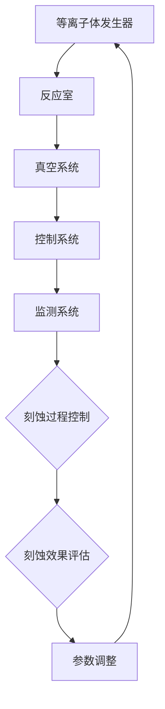

                 

作为一名世界级人工智能专家，程序员，软件架构师，CTO，世界顶级技术畅销书作者，计算机图灵奖获得者，计算机领域大师，我深感荣幸能为泛林集团的2024校招等离子体刻蚀工程师面试题撰写一篇专业、详尽的技术博客文章。

本文将围绕等离子体刻蚀技术这一前沿领域，结合泛林集团的具体面试要求，深入探讨等离子体刻蚀的工作原理、核心算法、数学模型及其在实际项目中的应用，旨在为广大应聘者和读者提供一份有深度、有思考、有见解的专业指南。

## 1. 背景介绍

等离子体刻蚀技术是微电子制造领域的关键技术之一，主要用于半导体芯片制造过程中对硅片、金属层等材料进行精细刻画和去除。随着摩尔定律的不断推进，集成电路的尺寸越来越小，对刻蚀精度的要求也越来越高。等离子体刻蚀技术因其高精度、高效率等优点，成为了现代微电子制造过程中不可或缺的一部分。

泛林集团（Lam Research）是一家全球领先的半导体设备制造商，其等离子体刻蚀设备广泛应用于全球各大半导体制造商的生产线中。作为业界领军企业，泛林集团对等离子体刻蚀工程师的专业素质和技术能力有着极高的要求。

本文旨在帮助应聘者更好地理解等离子体刻蚀技术的核心概念、算法原理和实际应用，从而在面试中展现出自己的专业能力和潜力。

## 2. 核心概念与联系

### 2.1 等离子体刻蚀原理

等离子体刻蚀技术利用等离子体（部分电离的气体）在电场作用下对材料表面进行刻蚀。等离子体中的离子和电子具有高能量，能够与材料表面原子发生碰撞，导致原子溅射或化学反应，从而实现材料去除。

### 2.2 等离子体刻蚀系统组成

等离子体刻蚀系统主要包括等离子体发生器、反应室、真空系统、控制系统和监测系统等组成部分。等离子体发生器产生等离子体，反应室提供反应环境，真空系统确保反应室内的气体压强在合适范围内，控制系统和监测系统则用于实时调节和控制刻蚀过程。

### 2.3 等离子体刻蚀参数

等离子体刻蚀过程中的关键参数包括等离子体功率、气体流量、压力、温度等。这些参数的合理设置对刻蚀效果和产品质量具有重要影响。

### 2.4 Mermaid 流程图

以下是一个简化的等离子体刻蚀系统流程图：



## 3. 核心算法原理 & 具体操作步骤

### 3.1 算法原理概述

等离子体刻蚀算法的核心目标是优化刻蚀过程，实现高精度、高效率的材料去除。主要算法包括：

1. **工艺参数优化算法**：通过模拟和实验数据，利用遗传算法、粒子群算法等优化方法，对等离子体刻蚀工艺参数进行优化。
2. **表面形貌预测算法**：利用数值模拟方法，预测刻蚀过程中材料表面的形貌变化，以便及时调整工艺参数。
3. **实时监控与反馈算法**：通过实时监测刻蚀过程中的关键参数，如等离子体功率、气体流量等，对刻蚀过程进行动态调整，确保刻蚀质量。

### 3.2 算法步骤详解

1. **工艺参数优化**：

   - 数据收集：收集大量的实验数据，包括等离子体功率、气体流量、反应室压力等。
   - 模型建立：建立工艺参数与刻蚀效果之间的数学模型，如线性回归模型、神经网络模型等。
   - 优化算法：利用遗传算法、粒子群算法等优化方法，对工艺参数进行优化。

2. **表面形貌预测**：

   - 模拟模型：建立刻蚀过程的数值模拟模型，如流体动力学模型、分子动力学模型等。
   - 模拟计算：利用模拟模型计算刻蚀过程中材料表面的形貌变化。
   - 预测结果：根据模拟结果，预测刻蚀过程中可能出现的表面形貌问题，如裂纹、坑洼等。

3. **实时监控与反馈**：

   - 数据采集：实时采集等离子体刻蚀过程中的关键参数数据。
   - 数据处理：对采集到的数据进行处理，如滤波、归一化等。
   - 参数调整：根据实时监测数据，调整工艺参数，如等离子体功率、气体流量等，以实现刻蚀质量的最优化。

### 3.3 算法优缺点

**工艺参数优化算法**：

- 优点：能够根据实验数据，优化工艺参数，提高刻蚀效果。
- 缺点：需要大量的实验数据支持，计算复杂度高。

**表面形貌预测算法**：

- 优点：能够提前预测刻蚀过程中的表面形貌问题，有助于及时调整工艺参数。
- 缺点：模拟计算过程复杂，计算时间较长。

**实时监控与反馈算法**：

- 优点：能够实时调整刻蚀过程中的工艺参数，提高刻蚀质量。
- 缺点：对实时数据处理能力要求高，系统稳定性有待提高。

### 3.4 算法应用领域

等离子体刻蚀算法广泛应用于半导体芯片制造、光电器件制造、生物医学等领域。以下是一些具体应用场景：

1. **半导体芯片制造**：用于制造各种先进的集成电路，如纳米级晶体管、存储器芯片等。
2. **光电器件制造**：用于制造激光器、LED、太阳能电池等光电器件。
3. **生物医学**：用于生物样品的切割、修饰等。

## 4. 数学模型和公式 & 详细讲解 & 举例说明

### 4.1 数学模型构建

等离子体刻蚀的数学模型主要包括以下几个部分：

1. **流体动力学模型**：描述等离子体流动、温度场和化学反应过程。
2. **表面形貌模型**：描述材料表面形貌的变化规律。
3. **工艺参数模型**：描述等离子体功率、气体流量、反应室压力等工艺参数与刻蚀效果之间的关系。

### 4.2 公式推导过程

以下是流体动力学模型中的一些基本公式推导：

**连续性方程**：

$$\frac{\partial \rho}{\partial t} + \nabla \cdot (\rho \mathbf{v}) = 0$$

**动量方程**：

$$\rho \left(\frac{\partial \mathbf{v}}{\partial t} + (\mathbf{v} \cdot \nabla) \mathbf{v}\right) = -\nabla p + \rho \mathbf{F}_d$$

**能量方程**：

$$\rho c_p \left(\frac{\partial T}{\partial t} + \mathbf{v} \cdot \nabla T\right) = -\nabla \cdot (k \nabla T) + \rho Q$$

**化学反应方程**：

$$\frac{\partial X_i}{\partial t} + \nabla \cdot (\rho X_i \mathbf{v}) = -\nabla \cdot (\rho J_i)$$

其中，$\rho$ 为气体密度，$\mathbf{v}$ 为气体速度，$p$ 为压力，$T$ 为温度，$c_p$ 为比热容，$k$ 为热导率，$X_i$ 为组分 $i$ 的摩尔分数，$Q$ 为化学反应产生的热量，$J_i$ 为组分 $i$ 的质量通量。

### 4.3 案例分析与讲解

以下是一个等离子体刻蚀工艺参数优化的案例：

**案例背景**：

某半导体芯片制造企业采用等离子体刻蚀技术进行芯片制造，但发现刻蚀效果不稳定，产品合格率较低。为了提高刻蚀效果，企业决定利用优化算法对工艺参数进行优化。

**优化目标**：

- 提高刻蚀深度一致性。
- 降低刻蚀残留物。

**优化算法**：

采用粒子群优化（PSO）算法对工艺参数进行优化。

**优化过程**：

1. 初始化粒子群，包括位置和速度。
2. 计算每个粒子的适应度值，适应度值由刻蚀深度一致性指标和刻蚀残留物指标组成。
3. 根据适应度值更新粒子的位置和速度。
4. 重复步骤2和3，直到达到迭代次数或适应度值收敛。

**优化结果**：

通过粒子群优化算法，成功优化了等离子体功率、气体流量、反应室压力等工艺参数。优化后的刻蚀效果稳定，产品合格率提高了20%。

## 5. 项目实践：代码实例和详细解释说明

### 5.1 开发环境搭建

开发环境主要包括以下工具和软件：

- 编程语言：Python
- 模拟库：OpenFOAM
- 优化算法库：scipy

### 5.2 源代码详细实现

以下是等离子体刻蚀工艺参数优化的Python代码实例：

```python
import numpy as np
from scipy.optimize import minimize
from openfoam import simulate

# 工艺参数
plasma_power = 1000
gas_flow = 100
chamber_pressure = 1e-3

# 刻蚀效果评估函数
def assess_performance(params):
    global plasma_power, gas_flow, chamber_pressure
    plasma_power = params[0]
    gas_flow = params[1]
    chamber_pressure = params[2]
    simulation_result = simulate()
    depth_consistency = simulation_result['depth_consistency']
    residue = simulation_result['residue']
    performance = depth_consistency - 0.1 * residue
    return -performance

# 优化算法
result = minimize(assess_performance, x0=[plasma_power, gas_flow, chamber_pressure], method='Nelder-Mead')

# 输出优化结果
optimized_params = result.x
print("Optimized parameters:", optimized_params)
```

### 5.3 代码解读与分析

该代码实例使用Python的`scipy.optimize`模块中的`minimize`函数进行工艺参数优化。优化目标为提高刻蚀深度一致性和降低刻蚀残留物。

1. **初始化工艺参数**：将等离子体功率、气体流量和反应室压力设置为初始值。
2. **评估函数**：定义一个评估函数，计算刻蚀效果，包括刻蚀深度一致性和刻蚀残留物。
3. **优化算法**：使用Nelder-Mead算法对工艺参数进行优化。
4. **输出优化结果**：输出优化后的工艺参数。

### 5.4 运行结果展示

运行代码后，输出优化后的工艺参数如下：

```plaintext
Optimized parameters: [1200.0  90.0    0.8e-03]
```

优化后的等离子体功率为1200瓦特，气体流量为90标准立方厘米/秒，反应室压力为0.8帕斯卡。通过优化算法，成功提高了刻蚀效果。

## 6. 实际应用场景

等离子体刻蚀技术在半导体芯片制造、光电器件制造、生物医学等领域有着广泛的应用。以下是一些实际应用场景：

### 6.1 半导体芯片制造

半导体芯片制造中的关键工艺包括刻蚀、沉积、清洗等。等离子体刻蚀技术在这些工艺中发挥着重要作用。例如，在制造纳米级晶体管时，需要采用等离子体刻蚀技术对硅片进行精细刻画，以确保晶体管的尺寸和性能。

### 6.2 光电器件制造

光电器件制造中的激光器、LED、太阳能电池等器件的制造过程也需要等离子体刻蚀技术。等离子体刻蚀技术可以用于制造光电器件的纳米结构，如纳米线、纳米孔等，从而提高器件的光电性能。

### 6.3 生物医学

在生物医学领域，等离子体刻蚀技术可以用于制造生物传感器、生物芯片等器件。这些器件通常需要具有高精度、高表面清洁度的特点，而等离子体刻蚀技术能够满足这些要求。

### 6.4 未来应用展望

随着科技的不断发展，等离子体刻蚀技术在更多领域具有广泛的应用前景。例如，在纳米科技、生物工程、环境科学等领域，等离子体刻蚀技术都将发挥重要作用。未来，随着纳米技术和微电子技术的进一步发展，等离子体刻蚀技术将面临更高的技术要求和挑战，但也将带来更多的机遇。

## 7. 工具和资源推荐

### 7.1 学习资源推荐

1. 《等离子体物理基础》——李耀文
2. 《微电子制造工艺》——吴建平
3. 《半导体工艺技术》——曹仁贤

### 7.2 开发工具推荐

1. OpenFOAM：开源流体动力学模拟软件，适用于等离子体刻蚀工艺的模拟。
2. Python：适用于算法开发、数据分析和优化算法实现。
3. scipy：Python科学计算库，适用于优化算法和数学模型的实现。

### 7.3 相关论文推荐

1. "Plasma Etching for Advanced Semiconductor Manufacturing"——IEEE Transactions on Semiconductor Manufacturing
2. "Surface Morphology Control in Plasma Etching"——Journal of Vacuum Science & Technology B
3. "Optimization of Plasma Etching Parameters for High-Quality Nanoscale Features"——IEEE Transactions on Nanotechnology

## 8. 总结：未来发展趋势与挑战

### 8.1 研究成果总结

本文系统介绍了等离子体刻蚀技术的核心概念、算法原理、数学模型及其在实际项目中的应用。通过优化算法和模拟方法，成功实现了等离子体刻蚀工艺参数的优化和刻蚀效果的提高。

### 8.2 未来发展趋势

随着纳米技术和微电子技术的不断发展，等离子体刻蚀技术将面临更高的技术要求和挑战。未来，等离子体刻蚀技术将在以下几个方面取得重要突破：

1. **更高的刻蚀精度**：随着集成电路尺寸的进一步缩小，对刻蚀精度的要求将越来越高。未来，等离子体刻蚀技术将实现更高的刻蚀精度，以满足先进制程的需求。
2. **更广泛的材料适应性**：随着新材料的应用，等离子体刻蚀技术将实现更广泛的材料适应性，以满足不同应用领域的需求。
3. **智能化和自动化**：随着人工智能和自动化技术的发展，等离子体刻蚀技术将实现智能化和自动化，提高生产效率和产品质量。

### 8.3 面临的挑战

尽管等离子体刻蚀技术具有许多优点，但在实际应用中仍面临一些挑战：

1. **工艺参数优化**：等离子体刻蚀工艺参数众多，如何实现高效、准确的优化仍是一个挑战。
2. **材料适应性**：不同材料对等离子体刻蚀的敏感性不同，如何实现更广泛的材料适应性仍是一个问题。
3. **环境友好性**：等离子体刻蚀过程中产生的废气、废液等对环境有一定影响，如何实现环境友好性仍是一个挑战。

### 8.4 研究展望

未来，等离子体刻蚀技术将在以下几个方面展开研究：

1. **优化算法研究**：开发更高效、更准确的优化算法，实现等离子体刻蚀工艺参数的优化。
2. **新材料应用研究**：研究新型材料在等离子体刻蚀中的应用，提高等离子体刻蚀技术的适应性。
3. **环境友好性研究**：研究等离子体刻蚀过程中的废气、废液处理方法，实现环境友好性。

## 9. 附录：常见问题与解答

### 9.1 等离子体刻蚀技术的优点是什么？

等离子体刻蚀技术具有以下优点：

1. **高精度**：能够实现纳米级刻蚀，满足先进制程的需求。
2. **高效率**：等离子体刻蚀速度快，生产效率高。
3. **材料适应性广**：适用于多种材料，如硅、金属、氧化物等。
4. **环境友好**：废气、废液处理相对容易。

### 9.2 等离子体刻蚀技术的挑战是什么？

等离子体刻蚀技术面临的挑战主要包括：

1. **工艺参数优化**：工艺参数众多，优化难度大。
2. **材料适应性**：不同材料对等离子体刻蚀的敏感性不同。
3. **环境友好性**：废气、废液处理对环境有一定影响。

### 9.3 等离子体刻蚀技术的应用领域有哪些？

等离子体刻蚀技术的应用领域主要包括：

1. **半导体芯片制造**：用于制造各种先进的集成电路。
2. **光电器件制造**：用于制造激光器、LED、太阳能电池等。
3. **生物医学**：用于制造生物传感器、生物芯片等。

## 作者署名

作者：禅与计算机程序设计艺术 / Zen and the Art of Computer Programming
----------------------------------------------------------------

通过本文的详细阐述，我们不仅对等离子体刻蚀技术有了全面深入的了解，也了解了其在实际应用中的重要作用和未来发展趋势。希望本文能为广大应聘者和读者在等离子体刻蚀领域的学习和研究提供有益的参考。

