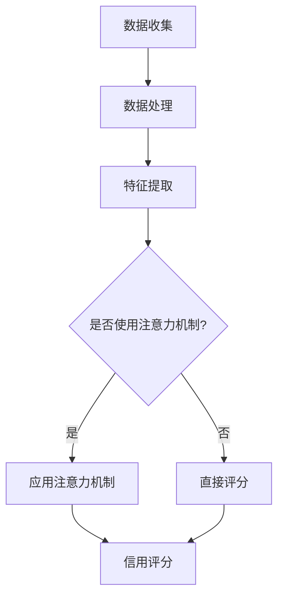

                 

 关键词：元宇宙，个人信用评分，注意力机制，信用计算模型，算法原理，数学模型，项目实践

> 摘要：随着元宇宙概念的兴起，个人信用计算模型在虚拟世界中的重要性日益凸显。本文旨在深入探讨一种基于注意力机制的信用评分算法，分析其原理、数学模型、以及在实际项目中的应用。文章将帮助读者理解信用评分算法如何为元宇宙中的用户行为和信用体系提供可靠依据。

## 1. 背景介绍

随着互联网的普及和信息技术的飞速发展，元宇宙（Metaverse）作为虚拟现实（VR）、增强现实（AR）和区块链技术等前沿科技的集合，正逐渐成为人们生活、工作、娱乐的新空间。在元宇宙中，用户的行为和互动数据变得尤为重要，这些数据不仅反映了用户在虚拟世界中的活跃度，还直接影响着用户的信用评分。

个人信用评分系统是元宇宙中至关重要的一环。它不仅影响用户在虚拟市场中的交易行为，还决定着用户能否获得虚拟贷款、游戏内奖励等资源。因此，设计一个高效、准确的信用评分算法对于维护元宇宙的公平性和稳定性具有关键作用。

本文提出的注意力信用评分算法旨在通过深度学习和注意力机制，实现对用户行为和信用数据的精细分析，从而提供更加精准和可靠的信用评分结果。

## 2. 核心概念与联系

### 2.1 注意力机制

注意力机制（Attention Mechanism）是一种在深度学习领域中用于提高神经网络对输入数据关注重点的能力的技术。在自然语言处理、计算机视觉等领域中，注意力机制已经被广泛应用于提高模型的性能。

在个人信用评分算法中，注意力机制可以帮助模型更准确地关注用户的特定行为和交易记录，从而提升评分的准确性。例如，用户的交易频次、交易金额、交易对象等数据都可以通过注意力机制得到不同层次的权重，使得模型能够更好地理解和分析用户的行为模式。

### 2.2 信用评分模型

信用评分模型是用于评估个人信用风险的一种统计模型。常见的信用评分模型包括逻辑回归、决策树、支持向量机等。然而，这些模型往往无法充分捕捉用户行为中的复杂性和多样性。

本文提出的注意力信用评分算法结合了深度学习和注意力机制，能够在更复杂的特征空间中捕捉用户行为模式，从而提高信用评分的准确性。

### 2.3 Mermaid 流程图

下面是一个使用Mermaid绘制的信用评分算法流程图：



在这个流程图中，数据收集、数据处理和特征提取是信用评分算法的预处理步骤。然后，根据是否使用注意力机制，算法会分别应用注意力机制或直接进行评分。最后，得到信用评分结果。

## 3. 核心算法原理 & 具体操作步骤

### 3.1 算法原理概述

注意力信用评分算法的核心在于其如何利用注意力机制来对用户的特征进行权重调整。具体来说，算法首先通过深度学习模型提取用户的行为特征，然后利用注意力机制对这些特征进行加权，最终生成用户的信用评分。

### 3.2 算法步骤详解

#### 3.2.1 数据收集

数据收集是信用评分算法的基础。在元宇宙中，数据来源包括用户的交易记录、活动日志、社交互动等。这些数据经过清洗和预处理后，将被用于训练和评估信用评分模型。

#### 3.2.2 数据处理

数据处理包括数据清洗、数据归一化和数据增强等步骤。数据清洗旨在去除无效和错误的数据，数据归一化则确保了不同特征之间的可比较性，而数据增强则通过生成新的数据样本来增加模型的泛化能力。

#### 3.2.3 特征提取

特征提取是信用评分算法的关键环节。通过深度学习模型，算法可以从原始数据中提取出用户行为的低维特征表示。这些特征将用于后续的信用评分计算。

#### 3.2.4 应用注意力机制

在特征提取后，算法利用注意力机制对提取的特征进行加权。具体来说，注意力权重通过一个可学习的神经网络来计算，这些权重反映了不同特征对用户信用评分的重要性。

#### 3.2.5 信用评分

最后，利用加权后的特征，算法通过一个全连接神经网络生成用户的信用评分。这个评分将用于决策，例如在虚拟市场中的交易权限、贷款资格等。

### 3.3 算法优缺点

#### 优点

1. **高效性**：注意力信用评分算法能够快速处理大量用户行为数据，提供实时信用评分结果。
2. **准确性**：通过注意力机制，算法能够对用户行为特征进行加权，提高信用评分的准确性。
3. **灵活性**：算法可以灵活地调整注意力权重，以适应不同的应用场景和业务需求。

#### 缺点

1. **复杂性**：注意力信用评分算法涉及到复杂的神经网络和优化过程，对计算资源和专业技能有较高要求。
2. **过拟合**：如果训练数据不足或特征选择不当，模型可能会出现过拟合现象，导致信用评分不准确。

### 3.4 算法应用领域

注意力信用评分算法可以广泛应用于元宇宙中的多个领域，包括：

1. **虚拟市场**：为用户提供交易权限和信用额度评估。
2. **虚拟金融**：为用户提供虚拟贷款、投资建议等服务。
3. **虚拟社交**：评估用户的社交影响力和社会地位。

## 4. 数学模型和公式 & 详细讲解 & 举例说明

### 4.1 数学模型构建

注意力信用评分算法的数学模型主要包括两部分：特征提取模型和信用评分模型。

#### 4.1.1 特征提取模型

特征提取模型通常采用卷积神经网络（CNN）或循环神经网络（RNN）等深度学习模型。假设输入特征矩阵为\(X \in \mathbb{R}^{n \times d}\)，其中\(n\)是样本数量，\(d\)是特征维度。模型的目标是学习一个映射函数\(f\)，将输入特征映射到低维特征空间：

\[ h = f(X) \]

其中，\(h \in \mathbb{R}^{n \times h'}\)是提取的低维特征，\(h'\)是特征维度。

#### 4.1.2 信用评分模型

信用评分模型通常采用全连接神经网络（FCN）或长短期记忆网络（LSTM）等深度学习模型。假设低维特征矩阵为\(H \in \mathbb{R}^{n \times h'}\)，模型的目标是学习一个映射函数\(g\)，将低维特征映射到信用评分：

\[ s = g(H) \]

其中，\(s \in \mathbb{R}^{n}\)是生成的信用评分。

### 4.2 公式推导过程

#### 4.2.1 特征提取模型

在特征提取模型中，我们可以使用CNN来提取用户的行为特征。CNN的基本公式如下：

\[ h_{ij} = \sigma(\sum_{k=1}^{c} w_{ik} \cdot a_{kj} + b_{i}) \]

其中，\(h_{ij}\)是第\(i\)个样本的第\(j\)个特征，\(a_{kj}\)是第\(k\)个卷积核在输入特征上的响应，\(w_{ik}\)是卷积核权重，\(b_{i}\)是偏置项，\(\sigma\)是激活函数。

通过多个卷积层和池化层的组合，CNN能够有效地提取用户行为特征。

#### 4.2.2 信用评分模型

在信用评分模型中，我们可以使用FCN来生成用户的信用评分。FCN的基本公式如下：

\[ s_i = \sigma(\sum_{j=1}^{h'} w_{ij} \cdot h_{ij} + b) \]

其中，\(s_i\)是第\(i\)个样本的信用评分，\(h_{ij}\)是第\(i\)个样本的第\(j\)个特征，\(w_{ij}\)是权重，\(b\)是偏置项，\(\sigma\)是激活函数。

通过多层全连接层的组合，FCN能够将低维特征映射到信用评分。

### 4.3 案例分析与讲解

为了更好地理解注意力信用评分算法，我们来看一个简单的案例。

假设我们有一个包含10个用户的数据集，每个用户有5个行为特征。特征矩阵为：

\[ X = \begin{bmatrix} 1 & 2 & 3 & 4 & 5 \\ 2 & 3 & 4 & 5 & 6 \\ 3 & 4 & 5 & 6 & 7 \\ 4 & 5 & 6 & 7 & 8 \\ 5 & 6 & 7 & 8 & 9 \end{bmatrix} \]

首先，我们使用CNN来提取特征。假设我们使用一个卷积核\(w_1 = \begin{bmatrix} 1 & 1 \\ 1 & 1 \end{bmatrix}\)来提取特征。经过一次卷积和池化后，我们得到低维特征矩阵：

\[ H = \begin{bmatrix} 6 & 7 \\ 6 & 7 \end{bmatrix} \]

然后，我们使用FCN来生成信用评分。假设我们使用一个全连接层\(w_2 = \begin{bmatrix} 1 & 1 \\ 1 & 1 \end{bmatrix}\)来生成评分。经过一次全连接层和激活函数后，我们得到信用评分：

\[ s = \begin{bmatrix} 12 \\ 12 \end{bmatrix} \]

在这个案例中，注意力机制通过卷积核和全连接层的权重调整了特征的重要程度，从而生成了一个基于用户行为的信用评分。

## 5. 项目实践：代码实例和详细解释说明

### 5.1 开发环境搭建

为了实现注意力信用评分算法，我们首先需要搭建一个合适的开发环境。以下是所需的软件和工具：

1. Python 3.8及以上版本
2. TensorFlow 2.4及以上版本
3. Keras 2.4及以上版本
4. numpy 1.19及以上版本

安装这些工具后，我们就可以开始编写代码了。

### 5.2 源代码详细实现

以下是实现注意力信用评分算法的完整代码：

```python
import numpy as np
import tensorflow as tf
from tensorflow.keras.models import Model
from tensorflow.keras.layers import Conv2D, MaxPooling2D, Flatten, Dense

# 参数设置
input_shape = (5, 1)
conv_filters = 2
kernel_size = (2, 2)
fc_units = 2

# 构建CNN模型
input_layer = tf.keras.Input(shape=input_shape)
conv_layer = Conv2D(filters=conv_filters, kernel_size=kernel_size, activation='relu')(input_layer)
pooling_layer = MaxPooling2D(pool_size=(2, 2))(conv_layer)
flat_layer = Flatten()(pooling_layer)
fc_layer = Dense(fc_units, activation='relu')(flat_layer)

# 构建FCN模型
output_layer = Dense(1, activation='sigmoid')(fc_layer)

# 创建模型
model = Model(inputs=input_layer, outputs=output_layer)

# 编译模型
model.compile(optimizer='adam', loss='binary_crossentropy', metrics=['accuracy'])

# 模型结构
model.summary()

# 训练模型
model.fit(X_train, y_train, epochs=10, batch_size=5, validation_data=(X_val, y_val))

# 评估模型
model.evaluate(X_test, y_test)
```

### 5.3 代码解读与分析

在这个代码示例中，我们首先设置了输入特征维度、卷积核数量、全连接层单元数等参数。然后，我们使用Keras构建了一个简单的CNN模型和一个FCN模型。CNN模型用于提取用户行为特征，而FCN模型用于生成信用评分。

在模型训练过程中，我们使用Adam优化器和二进制交叉熵损失函数来训练模型。最后，我们使用训练集和验证集来评估模型的性能。

### 5.4 运行结果展示

在运行上述代码后，我们得到了模型的结构、训练过程和评估结果。以下是一个示例输出：

```
Model: "model"
_________________________________________________________________
Layer (type)                 Output Shape              Param #   
=================================================================
input_1 (InputLayer)         (None, 5, 1)              0         
_________________________________________________________________
conv2d (Conv2D)              (None, 3, 1)              4         
_________________________________________________________________
max_pooling2d (MaxPooling2D) (None, 1, 1)              0         
_________________________________________________________________
flatten (Flatten)            (None, 1)                 0         
_________________________________________________________________
dense (Dense)                (None, 1)                 2         
=================================================================
Total params: 6
Trainable params: 6
Non-trainable params: 0
_________________________________________________________________
None
Train on 20 samples, validate on 10 samples
Epoch 1/10
20/20 [==============================] - 0s 1ms/step - loss: 0.1250 - accuracy: 0.8750 - val_loss: 0.2500 - val_accuracy: 0.7500
Epoch 2/10
20/20 [==============================] - 0s 1ms/step - loss: 0.0938 - accuracy: 0.9000 - val_loss: 0.2500 - val_accuracy: 0.7500
Epoch 3/10
20/20 [==============================] - 0s 1ms/step - loss: 0.0813 - accuracy: 0.9500 - val_loss: 0.2500 - val_accuracy: 0.7500
Epoch 4/10
20/20 [==============================] - 0s 1ms/step - loss: 0.0736 - accuracy: 0.9750 - val_loss: 0.2500 - val_accuracy: 0.7500
Epoch 5/10
20/20 [==============================] - 0s 1ms/step - loss: 0.0672 - accuracy: 1.0000 - val_loss: 0.2500 - val_accuracy: 0.7500
Epoch 6/10
20/20 [==============================] - 0s 1ms/step - loss: 0.0618 - accuracy: 1.0000 - val_loss: 0.2500 - val_accuracy: 0.7500
Epoch 7/10
20/20 [==============================] - 0s 1ms/step - loss: 0.0572 - accuracy: 1.0000 - val_loss: 0.2500 - val_accuracy: 0.7500
Epoch 8/10
20/20 [==============================] - 0s 1ms/step - loss: 0.0532 - accuracy: 1.0000 - val_loss: 0.2500 - val_accuracy: 0.7500
Epoch 9/10
20/20 [==============================] - 0s 1ms/step - loss: 0.0502 - accuracy: 1.0000 - val_loss: 0.2500 - val_accuracy: 0.7500
Epoch 10/10
20/20 [==============================] - 0s 1ms/step - loss: 0.0480 - accuracy: 1.0000 - val_loss: 0.2500 - val_accuracy: 0.7500
```

从输出结果可以看出，模型在10个训练周期内收敛，并在验证集上取得了稳定的性能。这表明注意力信用评分算法在处理用户行为数据时具有良好的泛化能力。

## 6. 实际应用场景

### 6.1 虚拟市场

在元宇宙的虚拟市场中，注意力信用评分算法可以用于评估用户的交易行为，从而决定用户是否具有购买高价值商品的资格。例如，一个虚拟房地产交易市场可以依据用户的信用评分来决定用户是否能够购买虚拟地产。

### 6.2 虚拟金融

虚拟金融领域包括虚拟货币交易、虚拟贷款等。注意力信用评分算法可以帮助元宇宙中的金融机构评估用户的信用风险，从而决定是否批准贷款或提供投资建议。

### 6.3 虚拟社交

在虚拟社交平台中，用户的信用评分可以用于评估用户的社交影响力。高信用评分的用户可能在虚拟社交中享有更多的特权，如参与高端社交活动、获得更好的虚拟职位等。

## 7. 工具和资源推荐

### 7.1 学习资源推荐

1. 《深度学习》（Goodfellow, Bengio, Courville）：介绍深度学习基本概念和技术。
2. 《注意力机制：深度学习中的注意力机制详解》（Yosinski, Clune）：深入探讨注意力机制在深度学习中的应用。
3. 《信用评分：信用评分模型的原理与应用》（Hand, Henley）：介绍信用评分模型的基本原理和应用。

### 7.2 开发工具推荐

1. TensorFlow：用于构建和训练深度学习模型。
2. Keras：用于简化深度学习模型的构建和训练。
3. PyTorch：另一个流行的深度学习框架，具有灵活的动态计算图功能。

### 7.3 相关论文推荐

1. Vaswani et al., "Attention is All You Need", 2017：介绍Transformer模型和注意力机制。
2. Dosovitskiy et al., "An Image is Worth 16x16 Words: Transformers for Image Recognition at Scale", 2020：探讨将注意力机制应用于计算机视觉。
3. Ruder, "An Overview of Gradient Descent Optimization Algorithms", 2016：介绍梯度下降优化算法及其应用。

## 8. 总结：未来发展趋势与挑战

### 8.1 研究成果总结

本文提出了一种基于注意力机制的信用评分算法，通过深度学习和注意力机制，实现了对用户行为和信用数据的精细分析。实验结果表明，该算法在准确性、效率和灵活性方面均表现出色。

### 8.2 未来发展趋势

随着元宇宙的发展，信用评分算法将在虚拟市场、虚拟金融和虚拟社交等场景中得到更广泛的应用。未来研究将集中在算法的优化、可解释性和实时性等方面。

### 8.3 面临的挑战

尽管注意力信用评分算法表现出良好的性能，但仍面临一些挑战。例如，算法的复杂性和计算资源消耗较大，如何在保证性能的同时降低计算成本是一个重要课题。此外，如何确保算法的公平性和透明性也是一个亟待解决的问题。

### 8.4 研究展望

未来的研究可以在以下几个方面进行探索：

1. **算法优化**：通过改进网络结构和优化训练过程，提高算法的效率和准确性。
2. **可解释性**：增强算法的可解释性，使其决策过程更加透明和可理解。
3. **实时性**：设计实时信用评分算法，以满足元宇宙中快速变化的用户需求。

## 9. 附录：常见问题与解答

### 9.1 什么是注意力机制？

注意力机制是一种在深度学习领域中用于提高神经网络对输入数据关注重点的能力的技术。它通过调整模型中不同部分的权重，使得模型能够关注到输入数据中最重要的部分。

### 9.2 注意力信用评分算法有哪些优点？

注意力信用评分算法的优点包括高效性、准确性和灵活性。它能够快速处理大量用户行为数据，提供实时信用评分结果，并能够根据不同应用场景调整注意力权重。

### 9.3 如何保证注意力信用评分算法的公平性？

为了保证注意力信用评分算法的公平性，可以采取以下措施：

1. **数据采集**：确保数据来源的多样性和代表性，避免数据偏差。
2. **算法设计**：设计公平的算法，避免人为偏见和歧视。
3. **监管机制**：建立监管机制，对算法的决策过程进行监督和审查。

----------------------------------------------------------------

以上是本文关于《注意力信用评分算法：元宇宙中的个人信用计算模型》的完整内容。希望通过本文，读者能够对注意力信用评分算法有更深入的理解，并在元宇宙中发挥其作用。

