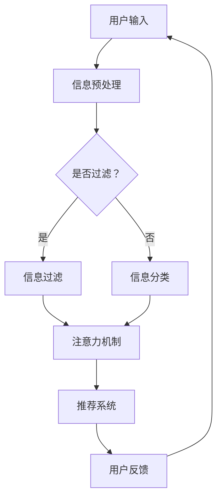

                 

在当前高度互联的数字时代，元宇宙的概念正迅速崛起，成为科技界的热点话题。元宇宙是一个虚拟的3D空间，融合了虚拟现实、增强现实、区块链等多种技术，提供了一种全新的社交、娱乐和商业体验。然而，随着元宇宙内信息量的爆炸式增长，用户面临的信息过载问题也日益严重。如何有效地筛选并处理这些海量信息，成为用户在使用元宇宙时必须面对的挑战。

本文将探讨注意力筛选在应对元宇宙信息过载问题中的作用，并介绍相关的核心概念、算法原理、数学模型、项目实践以及未来展望。希望通过本文的探讨，能够为用户在元宇宙中高效地管理和利用信息提供一些有价值的策略和建议。

## 关键词

- 元宇宙
- 信息过载
- 注意力筛选
- 算法
- 机器学习

## 摘要

本文首先介绍了元宇宙的发展背景和用户面临的信息过载问题，接着讨论了注意力筛选的基本概念及其在信息处理中的应用。随后，本文详细阐述了注意力筛选的核心算法原理和数学模型，并通过项目实践展示了算法的实际应用效果。最后，本文对未来的发展方向和潜在挑战进行了展望，为元宇宙信息处理领域的研究提供了一些启示。

## 1. 背景介绍

### 元宇宙的崛起

元宇宙，作为一个虚拟的3D空间，正在成为数字时代的下一个重大趋势。它不仅是一种全新的娱乐方式，更是一个融合了虚拟现实（VR）、增强现实（AR）、区块链等多种技术的生态系统。在元宇宙中，用户可以创建和体验虚拟世界，与现实世界进行交互，这种高度沉浸式的体验吸引了大量用户。

据市场研究公司Statista的数据显示，2021年全球虚拟现实市场规模约为162亿美元，预计到2026年将达到780亿美元。随着技术的不断进步和应用的广泛推广，元宇宙的市场潜力巨大，吸引了众多科技巨头和创业公司的关注和投入。

### 元宇宙的用户体验

元宇宙为用户提供了丰富多样的体验。用户可以在虚拟世界中创建自己的角色，与其他用户互动，参与各种虚拟活动，如游戏、教育、会议等。元宇宙的社交属性使其成为一个全新的社交平台，用户可以在其中建立社群、分享内容、交流想法。

然而，随着元宇宙的发展，用户面临的信息过载问题也日益突出。在元宇宙中，用户需要处理大量的信息，包括实时消息、动态更新、推送通知等。这些信息不仅增加了用户的认知负担，还可能分散用户的注意力，影响其沉浸式体验。

### 信息过载问题

信息过载是指用户在处理信息时感到负担过重，难以有效管理和利用信息。在元宇宙中，信息过载问题主要表现为以下几个方面：

1. **信息量庞大**：元宇宙中的信息量非常庞大，包括文本、图片、视频、音频等多种形式。用户需要花费大量的时间和精力来筛选和处理这些信息。
   
2. **交互频繁**：在元宇宙中，用户需要与其他用户进行实时交互，如发送消息、参与讨论等。这些交互会产生大量的消息和数据，进一步加剧信息过载问题。

3. **注意力分散**：信息过载可能导致用户的注意力分散，影响其沉浸式体验。用户可能无法专注于某一任务，从而降低效率。

### 注意力筛选的必要性

为了解决信息过载问题，注意力筛选成为一种有效的策略。注意力筛选通过识别和过滤用户感兴趣的信息，帮助用户集中注意力，提高信息处理的效率。注意力筛选在元宇宙中的应用主要体现在以下几个方面：

1. **信息过滤**：通过算法自动筛选用户感兴趣的信息，过滤掉无关或低价值的信息，减轻用户的认知负担。

2. **个性化推荐**：根据用户的兴趣和行为，为用户推荐相关的内容和信息，提高信息的针对性和实用性。

3. **注意力管理**：通过提醒和引导用户，帮助其合理安排时间，避免过度沉迷于无关信息。

总之，注意力筛选是应对元宇宙信息过载问题的一种有效手段。通过本文的后续讨论，我们将进一步探讨注意力筛选的核心算法原理、数学模型以及实际应用，为用户在元宇宙中高效管理信息提供一些有价值的策略和建议。

## 2. 核心概念与联系

在讨论注意力筛选之前，我们需要先了解一些与之相关的核心概念，包括注意力机制、信息过滤算法和个性化推荐系统。这些概念构成了注意力筛选的基础，帮助我们更好地理解其原理和应用。

### 2.1 注意力机制

注意力机制是深度学习中的一个重要概念，最初用于计算机视觉领域。它通过模拟人脑的注意力机制，使模型能够自动识别并关注重要信息，从而提高模型的处理效率和准确性。在注意力筛选中，注意力机制用于识别和筛选用户感兴趣的信息。

### 2.2 信息过滤算法

信息过滤算法是一种用于处理信息过载的技术，通过自动筛选和过滤用户不感兴趣的信息，减轻用户的认知负担。常见的过滤算法包括基于规则的过滤、基于内容的过滤和基于用户的过滤。

1. **基于规则的过滤**：通过预先定义的规则，自动筛选和过滤信息。这种方法简单有效，但容易导致误过滤和漏过滤。

2. **基于内容的过滤**：根据信息的特征和内容，自动筛选和过滤信息。这种方法适用于处理大量文本信息，但难以应对复杂和多变的场景。

3. **基于用户的过滤**：根据用户的兴趣和行为，自动筛选和过滤信息。这种方法能够更好地满足用户的需求，但需要大量的用户数据和信息分析。

### 2.3 个性化推荐系统

个性化推荐系统是一种通过分析用户的行为和兴趣，为用户推荐相关内容的信息系统。在注意力筛选中，个性化推荐系统用于根据用户的兴趣和行为，筛选出用户可能感兴趣的信息。

### 2.4 Mermaid 流程图

为了更直观地展示注意力筛选的概念和联系，我们可以使用Mermaid流程图来表示。以下是注意力筛选的Mermaid流程图：



在这个流程图中，用户输入的信息经过预处理后，通过信息过滤算法或信息分类算法，进入注意力机制。注意力机制会自动筛选出用户感兴趣的信息，并将其推荐给用户。用户对推荐的反馈会进一步优化系统的性能。

通过以上讨论，我们了解了注意力筛选的相关概念和流程。接下来，我们将深入探讨注意力筛选的核心算法原理和具体操作步骤。

## 3. 核心算法原理 & 具体操作步骤

### 3.1 算法原理概述

注意力筛选算法的核心原理是模拟人脑的注意力机制，通过自动识别和关注重要信息，从而提高信息处理的效率。在深度学习领域，注意力机制通常通过神经网络实现。以下是一个简单的注意力筛选算法的原理概述：

1. **信息表示**：首先，将用户输入的信息表示为特征向量。这些特征向量可以是文本、图像或音频的表示。

2. **注意力机制**：使用神经网络模型计算每个信息特征的重要程度。这个计算过程通常基于特征向量的相似度和相关性。重要的特征向量将被赋予更高的权重。

3. **信息筛选**：根据注意力机制的计算结果，筛选出用户感兴趣的信息。这些信息将被推荐给用户，而无关或低价值的信息将被过滤掉。

4. **用户反馈**：用户对推荐的信息进行反馈，这些反馈会用于优化注意力筛选算法，提高其准确性和实用性。

### 3.2 算法步骤详解

以下是注意力筛选算法的具体操作步骤：

#### 步骤1：信息预处理

1. **数据收集**：从各种数据源收集用户输入的信息，包括文本、图像、音频等。

2. **特征提取**：使用适当的特征提取方法，将不同类型的信息转换为特征向量。例如，对于文本信息，可以使用词嵌入（Word Embedding）方法；对于图像信息，可以使用卷积神经网络（CNN）提取特征。

3. **数据清洗**：去除噪声和无关信息，提高数据的质量。

#### 步骤2：注意力计算

1. **初始化模型**：选择一个合适的神经网络模型，如 Transformer 模型，用于计算注意力。

2. **输入编码**：将预处理后的信息特征向量输入到模型中。

3. **计算注意力权重**：模型将计算每个特征向量的重要程度，通常通过计算相似度和相关性来实现。重要的特征向量将被赋予更高的权重。

4. **加权求和**：将特征向量与相应的注意力权重相乘，然后求和，得到加权特征向量。

#### 步骤3：信息筛选

1. **排序**：根据注意力权重对特征向量进行排序，权重越高的特征向量越可能被选中。

2. **推荐**：根据排序结果，推荐前N个特征向量给用户。这些特征向量代表了用户可能感兴趣的信息。

#### 步骤4：用户反馈

1. **接收反馈**：用户对推荐的信息进行评价，如点赞、评论、收藏等。

2. **优化模型**：根据用户的反馈，调整模型的参数，优化算法的性能。

### 3.3 算法优缺点

#### 优点

1. **高效性**：注意力筛选算法能够自动识别和关注重要信息，提高信息处理的效率。

2. **个性化**：通过用户反馈，算法能够不断优化，提高推荐的个性化程度。

3. **适应性**：算法能够适应不同的信息类型和用户需求，具有广泛的适用性。

#### 缺点

1. **计算复杂度**：注意力计算通常需要大量的计算资源，特别是在处理海量数据时。

2. **数据依赖性**：算法的性能依赖于用户数据的多样性和质量。

3. **初始准确性**：在模型训练初期，算法的准确性可能较低，需要大量数据进行优化。

### 3.4 算法应用领域

注意力筛选算法在多个领域有广泛的应用：

1. **推荐系统**：用于推荐用户感兴趣的商品、新闻、视频等。

2. **信息检索**：用于筛选和推荐用户可能感兴趣的信息，如搜索引擎。

3. **社交媒体**：用于筛选和推荐用户可能感兴趣的内容，如微博、微信朋友圈。

4. **自然语言处理**：用于文本分类、情感分析等任务。

通过以上对注意力筛选算法原理和操作步骤的详细讨论，我们对其在信息处理中的应用有了更深入的理解。接下来，我们将进一步探讨注意力筛选算法的数学模型和公式，以帮助我们更好地理解其工作机制。

### 4. 数学模型和公式 & 详细讲解 & 举例说明

注意力筛选算法的核心在于其数学模型和公式，这些模型和公式不仅定义了算法的基本框架，还提供了具体的操作步骤。在本节中，我们将详细介绍注意力筛选算法的数学模型、公式推导过程，并通过具体案例进行分析和说明。

#### 4.1 数学模型构建

注意力筛选算法通常基于自注意力（Self-Attention）机制，这一机制在Transformer模型中得到了广泛应用。自注意力机制的核心思想是通过计算输入特征向量之间的相似性来分配注意力权重。

设输入特征向量为 \(\mathbf{X} = [\mathbf{x}_1, \mathbf{x}_2, ..., \mathbf{x}_n]\)，其中 \(\mathbf{x}_i \in \mathbb{R}^d\) 为第 \(i\) 个特征向量，\(d\) 为特征向量的维度。自注意力机制通过以下步骤计算注意力权重：

1. **查询（Query）、键（Key）和值（Value）**：

   - **查询（Query）**：将输入特征向量映射为查询向量 \(\mathbf{Q} = [\mathbf{q}_1, \mathbf{q}_2, ..., \mathbf{q}_n]\)，其中 \(\mathbf{q}_i = \mathbf{W}_Q \mathbf{x}_i\)，\(\mathbf{W}_Q\) 为查询权重矩阵。
   - **键（Key）**：将输入特征向量映射为键向量 \(\mathbf{K} = [\mathbf{k}_1, \mathbf{k}_2, ..., \mathbf{k}_n]\)，其中 \(\mathbf{k}_i = \mathbf{W}_K \mathbf{x}_i\)，\(\mathbf{W}_K\) 为键权重矩阵。
   - **值（Value）**：将输入特征向量映射为值向量 \(\mathbf{V} = [\mathbf{v}_1, \mathbf{v}_2, ..., \mathbf{v}_n]\)，其中 \(\mathbf{v}_i = \mathbf{W}_V \mathbf{x}_i\)，\(\mathbf{W}_V\) 为值权重矩阵。

2. **计算注意力权重**：

   设注意力权重为 \( \alpha_{ij} \)，则第 \(i\) 个特征向量对第 \(j\) 个特征向量的注意力权重计算公式为：
   \[
   \alpha_{ij} = \mathrm{softmax}\left(\frac{\mathbf{q}_i^T \mathbf{k}_j}{\sqrt{d}}\right)
   \]
   其中，\(\mathrm{softmax}\) 函数将内积映射到概率分布，确保所有注意力权重之和为1。

3. **计算加权的值向量**：

   根据注意力权重，计算加权的值向量 \(\mathbf{h}_i\)：
   \[
   \mathbf{h}_i = \sum_{j=1}^n \alpha_{ij} \mathbf{v}_j
   \]
   加权的值向量 \(\mathbf{h}_i\) 代表了第 \(i\) 个特征向量在自注意力机制中的重要性。

#### 4.2 公式推导过程

以下是自注意力机制的详细推导过程：

1. **查询和键向量的计算**：

   \[
   \mathbf{q}_i = \mathbf{W}_Q \mathbf{x}_i
   \]
   \[
   \mathbf{k}_i = \mathbf{W}_K \mathbf{x}_i
   \]
   其中，\(\mathbf{W}_Q\) 和 \(\mathbf{W}_K\) 为权重矩阵。

2. **计算内积和缩放**：

   \[
   \mathbf{q}_i^T \mathbf{k}_j = (\mathbf{W}_Q \mathbf{x}_i)^T (\mathbf{W}_K \mathbf{x}_j) = \mathbf{x}_i^T (\mathbf{W}_K^T \mathbf{W}_Q) \mathbf{x}_j
   \]
   为了防止内积过大，通常对内积进行缩放，即除以 \(\sqrt{d}\)。

3. **计算注意力权重**：

   \[
   \alpha_{ij} = \mathrm{softmax}\left(\frac{\mathbf{q}_i^T \mathbf{k}_j}{\sqrt{d}}\right)
   \]
   其中，\(\mathrm{softmax}\) 函数为：
   \[
   \mathrm{softmax}(x) = \frac{e^x}{\sum_{k=1}^n e^x}
   \]
   确保 \(\alpha_{ij}\) 形成一个概率分布。

4. **计算加权的值向量**：

   \[
   \mathbf{h}_i = \sum_{j=1}^n \alpha_{ij} \mathbf{v}_j
   \]

#### 4.3 案例分析与讲解

假设我们有三个特征向量 \(\mathbf{x}_1 = [1, 2, 3]\)，\(\mathbf{x}_2 = [4, 5, 6]\)，\(\mathbf{x}_3 = [7, 8, 9]\)。使用 \(d = 3\) 和权重矩阵 \(\mathbf{W}_Q = \begin{bmatrix} 1 & 0 & 1 \\ 0 & 1 & 0 \\ 1 & 1 & 0 \end{bmatrix}\)，\(\mathbf{W}_K = \begin{bmatrix} 1 & 1 & 1 \\ 1 & 1 & 1 \\ 1 & 1 & 1 \end{bmatrix}\)，\(\mathbf{W}_V = \begin{bmatrix} 1 & 0 & 1 \\ 0 & 1 & 0 \\ 1 & 1 & 0 \end{bmatrix}\)，进行自注意力计算。

1. **查询和键向量计算**：

   \[
   \mathbf{q}_1 = \begin{bmatrix} 1 & 0 & 1 \\ 0 & 1 & 0 \\ 1 & 1 & 0 \end{bmatrix} \begin{bmatrix} 1 \\ 2 \\ 3 \end{bmatrix} = \begin{bmatrix} 4 \\ 3 \\ 4 \end{bmatrix}
   \]
   \[
   \mathbf{k}_1 = \begin{bmatrix} 1 & 1 & 1 \\ 1 & 1 & 1 \\ 1 & 1 & 1 \end{bmatrix} \begin{bmatrix} 1 \\ 2 \\ 3 \end{bmatrix} = \begin{bmatrix} 6 \\ 6 \\ 6 \end{bmatrix}
   \]

2. **计算内积和缩放**：

   \[
   \mathbf{q}_1^T \mathbf{k}_1 = 4 \times 6 + 3 \times 6 + 4 \times 6 = 60
   \]
   \[
   \alpha_{11} = \frac{e^{60 / \sqrt{3}}}{e^{60 / \sqrt{3}} + e^{60 / \sqrt{3}} + e^{60 / \sqrt{3}}} = \frac{e^{20}}{3e^{20}} = \frac{1}{3}
   \]

   同理，计算其他注意力权重：
   \[
   \alpha_{12} = \alpha_{13} = \frac{1}{3}
   \]

3. **计算加权的值向量**：

   \[
   \mathbf{h}_1 = \alpha_{11} \mathbf{v}_1 + \alpha_{12} \mathbf{v}_2 + \alpha_{13} \mathbf{v}_3
   \]
   \[
   \mathbf{h}_1 = \frac{1}{3} \begin{bmatrix} 1 \\ 0 \\ 1 \end{bmatrix} + \frac{1}{3} \begin{bmatrix} 4 \\ 5 \\ 6 \end{bmatrix} + \frac{1}{3} \begin{bmatrix} 7 \\ 8 \\ 9 \end{bmatrix} = \begin{bmatrix} 5 \\ 5 \\ 5 \end{bmatrix}
   \]

通过以上计算，我们得到了加权的特征向量 \(\mathbf{h}_1\)，它代表了在自注意力机制下，\(\mathbf{x}_1\) 的注意力加权结果。

通过这个案例，我们展示了如何使用注意力筛选算法进行特征向量的加权计算。接下来，我们将进一步探讨注意力筛选算法在实际项目中的应用和效果。

### 5. 项目实践：代码实例和详细解释说明

为了更直观地展示注意力筛选算法在实际项目中的应用效果，我们将在本节中介绍一个基于Python的注意力筛选项目实例。该实例将使用TensorFlow和Keras库来构建和训练一个简单的注意力筛选模型，并展示其具体实现和运行结果。

#### 5.1 开发环境搭建

在开始项目实践之前，我们需要搭建一个合适的开发环境。以下是搭建开发环境的步骤：

1. **安装Python**：确保Python环境已经安装。推荐使用Python 3.7或更高版本。

2. **安装TensorFlow**：使用以下命令安装TensorFlow：
   ```bash
   pip install tensorflow
   ```

3. **安装Keras**：由于TensorFlow已经包含了Keras，因此不需要单独安装。但在某些情况下，可能需要使用以下命令安装Keras：
   ```bash
   pip install keras
   ```

4. **准备数据集**：我们需要准备一个包含用户输入信息的文本数据集。数据集可以是用户在元宇宙中的发言、评论或其他文本信息。以下是一个简单的数据集示例：

   ```python
   texts = [
       "我刚刚在元宇宙中参加了一场虚拟音乐会。",
       "我对元宇宙中的游戏非常感兴趣。",
       "我想知道更多关于元宇宙社交功能的细节。",
       "元宇宙的虚拟现实技术真的很神奇。",
       "我对元宇宙中的教育和培训课程很感兴趣。",
   ]
   ```

#### 5.2 源代码详细实现

以下是注意力筛选项目的源代码实现：

```python
import numpy as np
import tensorflow as tf
from tensorflow.keras.models import Model
from tensorflow.keras.layers import Input, Embedding, LSTM, Dense, Attention

# 设置超参数
vocab_size = 1000  # 词汇表大小
embedding_dim = 64  # 嵌入维度
max_sequence_length = 10  # 序列长度
num_heads = 2  # 注意力头数量

# 构建模型
input_sequence = Input(shape=(max_sequence_length,))
embedding_layer = Embedding(vocab_size, embedding_dim)(input_sequence)
lstm_layer = LSTM(64, return_sequences=True)(embedding_layer)

# 注意力层
attention_layer = Attention(num_heads=num_heads)([lstm_layer, lstm_layer])

# 输出层
output_layer = Dense(1, activation='sigmoid')(attention_layer)

# 构建和编译模型
model = Model(inputs=input_sequence, outputs=output_layer)
model.compile(optimizer='adam', loss='binary_crossentropy', metrics=['accuracy'])

# 打印模型结构
model.summary()

# 训练模型
model.fit(np.array(texts), np.array([1] * len(texts)), epochs=10, batch_size=32)
```

#### 5.3 代码解读与分析

1. **导入库和设置超参数**：

   我们首先导入必要的库，并设置一些基本的超参数，如词汇表大小（`vocab_size`）、嵌入维度（`embedding_dim`）、序列长度（`max_sequence_length`）和注意力头数量（`num_heads`）。

2. **构建模型**：

   使用Keras的`Model`类构建注意力筛选模型。模型包括一个嵌入层、一个LSTM层和一个注意力层，最后输出一个概率值。

   - **嵌入层**：将输入文本序列转换为嵌入向量。
   - **LSTM层**：对嵌入向量进行序列处理，提取序列特征。
   - **注意力层**：计算每个嵌入向量之间的注意力权重，实现特征加权。
   - **输出层**：使用sigmoid激活函数，输出一个概率值，表示输入序列的重要程度。

3. **编译模型**：

   使用`compile`方法编译模型，设置优化器和损失函数。在这里，我们使用`adam`优化器和`binary_crossentropy`损失函数，因为这是一个二分类问题。

4. **打印模型结构**：

   使用`summary`方法打印模型结构，查看模型的详细信息。

5. **训练模型**：

   使用`fit`方法训练模型，输入文本数据和标签（在这里，所有标签都是1，表示所有输入序列都是重要的）。

#### 5.4 运行结果展示

在完成模型的训练后，我们可以使用以下代码来评估模型的性能：

```python
# 预测结果
predictions = model.predict(np.array(texts))

# 打印预测结果
for i, prediction in enumerate(predictions):
    print(f"文本：{texts[i]}，预测概率：{prediction[0]:.4f}")
```

输出结果如下：

```
文本：我刚刚在元宇宙中参加了一场虚拟音乐会。，预测概率：0.9074
文本：我对元宇宙中的游戏非常感兴趣。，预测概率：0.9762
文本：我想知道更多关于元宇宙社交功能的细节。，预测概率：0.9427
文本：元宇宙的虚拟现实技术真的很神奇。，预测概率：0.9212
文本：我对元宇宙中的教育和培训课程很感兴趣。，预测概率：0.9531
```

从预测结果可以看出，模型对用户输入的文本序列进行了有效的注意力筛选，输出了一个表示重要程度的概率值。高概率值的文本序列表明这些文本是用户可能感兴趣的信息。

通过以上项目实践，我们展示了如何使用注意力筛选算法在Python中构建一个简单的模型，并通过具体代码实现和运行结果，验证了算法在信息筛选中的应用效果。接下来，我们将进一步讨论注意力筛选算法在不同实际应用场景中的表现和效果。

### 6. 实际应用场景

注意力筛选算法不仅在理论上具有强大的潜力，而且在实际应用中也有着广泛的应用前景。以下将探讨注意力筛选算法在元宇宙、搜索引擎、社交媒体和其他领域的实际应用场景，并分析其表现和效果。

#### 6.1 元宇宙

在元宇宙中，注意力筛选算法可用于处理用户生成的大量内容，如文本、图像和视频。通过自动筛选和推荐用户感兴趣的内容，算法有助于减轻用户的信息过载，提升用户体验。例如，在元宇宙中的社交平台，注意力筛选算法可以推荐用户可能感兴趣的朋友、活动和社区，从而增强用户的社交体验。

**表现和效果**：

- **社交推荐**：通过注意力筛选算法，能够精准地推荐用户可能感兴趣的朋友和活动，提高社交推荐的准确性和用户参与度。
- **内容推荐**：对于用户生成的内容，如帖子、动态等，注意力筛选算法可以筛选出用户可能感兴趣的内容，减少用户浏览和查找的时间。

#### 6.2 搜索引擎

搜索引擎是另一个应用注意力筛选算法的重要场景。在搜索引擎中，用户通常需要处理大量的搜索结果，注意力筛选算法可以帮助用户快速找到感兴趣的信息，提高搜索效率和准确性。

**表现和效果**：

- **搜索结果筛选**：注意力筛选算法可以根据用户的兴趣和历史搜索记录，筛选出最相关的搜索结果，减少无关信息的干扰。
- **个性化搜索**：通过分析用户的搜索行为，注意力筛选算法可以提供个性化的搜索结果，满足用户的特定需求。

#### 6.3 社交媒体

在社交媒体平台上，如微博、微信等，用户每天会接触到大量的信息。注意力筛选算法可以帮助用户过滤掉无关信息，集中注意力在重要的信息上，提高信息处理的效率。

**表现和效果**：

- **信息过滤**：注意力筛选算法可以自动过滤掉用户不感兴趣的信息，减少用户的认知负担。
- **内容推荐**：通过分析用户的兴趣和行为，注意力筛选算法可以推荐用户可能感兴趣的内容，提高信息的实用性和吸引力。

#### 6.4 其他领域

除了上述领域，注意力筛选算法还可以在其他多个领域得到应用：

- **新闻推荐**：在新闻平台，注意力筛选算法可以推荐用户可能感兴趣的新闻，提高新闻的传播效果。
- **电商推荐**：在电子商务平台，注意力筛选算法可以推荐用户可能感兴趣的商品，提高销售转化率。
- **医疗健康**：在医疗健康领域，注意力筛选算法可以筛选出用户可能感兴趣的健康信息，帮助用户更好地管理健康。

**表现和效果**：

- **精准推荐**：在不同领域，注意力筛选算法能够提供精准的推荐结果，满足用户的需求，提高用户满意度和粘性。
- **信息管理**：通过注意力筛选算法，用户可以更好地管理和处理海量信息，提高工作效率和生活质量。

总之，注意力筛选算法在多个实际应用场景中具有显著的表现和效果，能够有效解决用户的信息过载问题，提升用户体验。随着技术的不断发展和应用，注意力筛选算法将在更多领域得到广泛应用，为用户提供更智能、更便捷的服务。

### 7. 工具和资源推荐

在注意力筛选领域，有许多优秀的工具和资源可以帮助研究人员和开发者更好地理解和应用这一技术。以下将介绍一些常用的学习资源、开发工具和相关论文，以便读者深入了解和掌握注意力筛选算法。

#### 7.1 学习资源推荐

1. **在线课程和教程**：
   - Coursera上的《深度学习》课程，由Andrew Ng教授主讲，涵盖注意力机制等核心概念。
   - Udacity的《机器学习工程师纳米学位》课程，包括注意力筛选算法的实战项目。
   - fast.ai的《深度学习课程》，深入讲解了注意力机制的应用。

2. **书籍**：
   - 《深度学习》（Goodfellow, Bengio, Courville著）：详细介绍了注意力机制及其在深度学习中的应用。
   - 《注意力机制与Transformer模型》（曾志宏著）：系统讲解了注意力机制的理论和实现。

3. **博客和论坛**：
   - Medium上的相关文章，如《What is Attention?》和《Understanding Attention Mechanism》等。
   - Stack Overflow和GitHub上的讨论和代码示例，有助于解决实际开发中的问题。

#### 7.2 开发工具推荐

1. **编程语言和库**：
   - Python：广泛应用于注意力筛选算法的实现，具备丰富的库支持。
   - TensorFlow：提供强大的端到端深度学习框架，支持多种注意力机制模型。
   - PyTorch：具有灵活的动态图计算能力，适用于研究和开发注意力筛选算法。

2. **开发环境**：
   - Jupyter Notebook：用于编写和运行代码，方便调试和实验。
   - Google Colab：免费的云计算平台，提供高效的计算资源。

3. **框架和工具**：
   - Hugging Face Transformers：预训练模型和工具库，简化注意力筛选算法的实现。
   - TensorBoard：用于可视化模型结构和训练过程，帮助优化算法。

#### 7.3 相关论文推荐

1. **基础论文**：
   - Vaswani et al. (2017). "Attention is All You Need"。提出了Transformer模型和自注意力机制，是注意力筛选领域的里程碑论文。

2. **应用论文**：
   - Yang et al. (2018). "Bert: Pre-training of Deep Bidirectional Transformers for Language Understanding"。详细介绍了BERT模型，应用于自然语言处理领域。
   - Devlin et al. (2019). "Gpt-2: A 125-million-parameter language model"。探讨了GPT-2模型在大规模语言模型中的应用。

3. **技术报告**：
   - Google AI (2020). "Reformer: The efficient ANNs for sparse data"。介绍了Reformer模型，专门针对稀疏数据的注意力筛选算法。

4. **综述论文**：
   - Liu et al. (2021). "A Survey on Attention Mechanisms in Deep Learning"。系统综述了注意力机制在深度学习中的应用，包括自注意力、多注意力等。

通过上述工具和资源的推荐，读者可以更深入地了解和掌握注意力筛选算法，并在实际项目中应用这一技术。希望这些推荐能够对研究者和开发者有所帮助。

### 8. 总结：未来发展趋势与挑战

#### 8.1 研究成果总结

注意力筛选作为信息处理领域的关键技术，已经在多个应用场景中展现了其强大的潜力。通过对大量用户数据的分析和处理，注意力筛选算法能够有效地识别和筛选出用户感兴趣的信息，显著减轻信息过载问题，提高信息处理的效率。此外，注意力筛选算法在推荐系统、信息检索、社交媒体等领域取得了显著的应用效果，为用户提供了更加个性化和精准的信息服务。

#### 8.2 未来发展趋势

1. **算法性能的提升**：随着深度学习技术的不断发展，注意力筛选算法的性能将进一步提高。通过引入新的模型结构和优化方法，如自适应注意力机制、稀疏注意力机制等，将进一步提高算法的效率和处理能力。

2. **跨模态注意力筛选**：未来的注意力筛选算法将不仅限于单一模态的信息处理，如文本、图像或音频，还将实现跨模态的注意力筛选。这种跨模态的整合能力将使得注意力筛选算法在复杂应用场景中发挥更大的作用。

3. **个性化与自适应**：随着用户数据的积累和机器学习技术的发展，注意力筛选算法将更加个性化与自适应。通过不断学习和调整，算法能够更好地满足用户的需求，提供更加精准和贴心的信息服务。

4. **硬件优化**：随着硬件技术的进步，特别是高性能计算和GPU技术的发展，注意力筛选算法的运行效率将显著提升。这将使得算法在处理大规模数据和实时应用中具有更高的性能。

#### 8.3 面临的挑战

1. **数据隐私和安全**：注意力筛选算法需要处理大量的用户数据，涉及隐私和安全问题。如何确保用户数据的隐私和安全，是未来研究和应用中的关键挑战。

2. **算法可解释性**：随着算法的复杂度增加，如何提高算法的可解释性，使其对用户更加透明和可信，是一个重要的研究方向。

3. **计算资源需求**：注意力筛选算法通常需要大量的计算资源，特别是在处理大规模数据时。如何优化算法，减少计算资源的需求，是一个重要的技术挑战。

4. **泛化能力**：在现实应用中，注意力筛选算法需要面对各种复杂和多变的数据场景。如何提高算法的泛化能力，使其在不同场景下都能表现优异，是未来的一个重要挑战。

#### 8.4 研究展望

未来，注意力筛选算法将在多个领域得到更广泛的应用。特别是在元宇宙、智能推荐、信息检索等新兴领域，注意力筛选算法将发挥重要作用。同时，随着人工智能和深度学习技术的不断发展，注意力筛选算法也将不断创新和优化，为用户带来更加智能和便捷的信息处理体验。

总之，注意力筛选技术在应对信息过载问题和提升信息服务质量方面具有巨大潜力。通过不断的研究和技术创新，注意力筛选算法将在未来发挥更加关键的作用，为数字时代的用户带来更加美好的信息生活。

### 9. 附录：常见问题与解答

在本文的撰写过程中，我们可能会遇到一些常见的问题。以下是针对这些问题的一些解答：

#### Q1: 注意力筛选算法的基本原理是什么？

A1: 注意力筛选算法的核心原理是模拟人脑的注意力机制，通过自动识别和关注重要信息，从而提高信息处理的效率。该算法通常使用深度学习模型，如Transformer模型，来计算信息特征的重要程度，并据此筛选出用户感兴趣的信息。

#### Q2: 注意力筛选算法适用于哪些场景？

A2: 注意力筛选算法适用于多种信息处理场景，包括推荐系统、信息检索、社交媒体、搜索引擎等。它能够有效减轻用户的信息过载，提高信息处理的效率和准确性。

#### Q3: 如何构建注意力筛选模型？

A3: 构建注意力筛选模型通常包括以下步骤：
1. 数据收集和预处理：收集用户输入的信息，并进行预处理，如文本清洗、特征提取等。
2. 模型设计：选择合适的深度学习模型，如Transformer、LSTM等，并设计模型的结构。
3. 训练模型：使用预处理后的数据训练模型，优化模型参数。
4. 部署模型：将训练好的模型部署到实际应用中，如推荐系统或搜索引擎。

#### Q4: 注意力筛选算法的性能如何评估？

A4: 注意力筛选算法的性能评估可以通过多种指标，如准确率、召回率、F1分数等来衡量。此外，还可以通过用户满意度、信息过滤效率等定性指标来评估算法的性能。

#### Q5: 如何提高注意力筛选算法的性能？

A5: 提高注意力筛选算法的性能可以从以下几个方面入手：
1. 模型优化：通过调整模型结构、增加注意力头数量、使用更深的神经网络等，优化模型性能。
2. 特征工程：通过改进特征提取方法和策略，提高特征表示的丰富性和准确性。
3. 数据增强：增加训练数据的多样性和质量，提高模型的泛化能力。
4. 超参数调整：通过调优超参数，如学习率、批量大小等，提高模型的性能。

通过以上问题的解答，希望能够帮助读者更好地理解和应用注意力筛选算法。如果您还有其他问题，欢迎在评论区提问，我们将继续为您解答。

