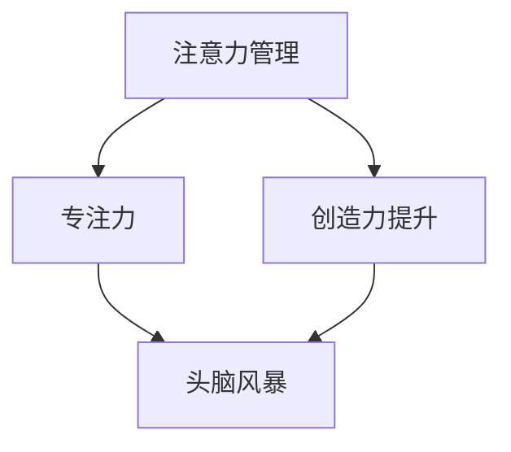

                 

关键词：注意力管理、创造力提升、专注力、头脑风暴、灵感激发、技术语言、算法原理、数学模型、项目实践、未来应用。

> 摘要：本文深入探讨了注意力管理与创造力提升之间的关系，结合专注力和头脑风暴的实践方法，提供了在技术领域中激发灵感的策略。通过剖析核心概念、算法原理、数学模型和实际项目实践，本文旨在为读者提供一套完整的技术提升方案，助力IT从业人员在高度复杂的工作环境中保持高效与创新能力。

## 1. 背景介绍

在信息技术飞速发展的今天，程序员、软件工程师、数据科学家等IT从业人员面临着前所未有的挑战。高复杂度的项目、不断更新的技术栈、严苛的时间限制，都要求他们具备高度的专业技能和快速的学习能力。然而，在这些压力下，保持专注力和创造力成为了许多人的难题。长期的工作压力和持续的信息过载，常常让IT从业人员感到精疲力尽，难以产生新的想法和解决方案。

因此，本文将探讨注意力管理与创造力提升之间的关系，并介绍一系列实用技巧，帮助IT从业人员在专注和头脑风暴中激发灵感，提高工作效率和创新能力。

## 2. 核心概念与联系

### 2.1 注意力管理

注意力管理是一种提高注意力集中度和效率的方法。它涉及到对注意力的分配、调节和维持。在技术领域，良好的注意力管理可以帮助程序员更专注于解决问题，避免分心和浪费时间。

### 2.2 创造力提升

创造力提升是指通过各种方法和技巧，激发大脑的创造力和创新能力。在IT领域，创造力提升可以帮助工程师和科学家在面临复杂问题时，找到创新的解决方案。

### 2.3 专注力与头脑风暴

专注力是指集中注意力、全神贯注于一件事物的能力。头脑风暴则是一种通过快速产生大量想法，以激发创新思维的方法。将专注力和头脑风暴结合起来，可以大大提高创意的产生效率。

### 2.4 Mermaid 流程图



## 3. 核心算法原理 & 具体操作步骤

### 3.1 算法原理概述

注意力管理和创造力提升的核心在于对注意力的有效管理和对大脑创造力的激发。具体来说，包括以下几个步骤：

1. **注意力分配**：将注意力集中在当前任务上，避免多任务处理导致注意力分散。
2. **注意力调节**：通过定时休息和切换任务，调节注意力的强度和持久度。
3. **创造力激发**：利用头脑风暴和思维导图等方法，快速产生大量想法。
4. **灵感捕捉**：在专注和头脑风暴过程中，及时记录灵感和创意。

### 3.2 算法步骤详解

1. **设定专注时间**：使用番茄工作法（25分钟专注工作，5分钟休息）来提高专注力。
2. **专注工作**：在这25分钟内，关闭所有干扰（如社交媒体、手机通知等），集中精力解决问题。
3. **头脑风暴**：在休息时间内，快速写下所有与当前任务相关的想法，不评价、不筛选。
4. **灵感捕捉**：使用笔记软件或便签，随时记录灵感和创意。
5. **反馈与总结**：每天结束后，回顾并总结当天的专注和创意产生情况，调整策略。

### 3.3 算法优缺点

**优点**：

- 提高专注力和工作效率。
- 激发创造力，产生创新想法。
- 灵活适用，可结合个人工作习惯进行调整。

**缺点**：

- 需要一定的时间来适应和调整。
- 长时间专注可能导致疲劳。

### 3.4 算法应用领域

- 软件开发：用于提高编程效率，解决复杂问题。
- 数据分析：用于快速产生分析思路，找到数据模式。
- 产品设计：用于激发创意，优化产品功能。

## 4. 数学模型和公式 & 详细讲解 & 举例说明

### 4.1 数学模型构建

注意力管理和创造力提升可以看作是一个动态平衡过程，可以用以下数学模型来描述：

\[ A_t = f(B_t, C_t) \]

其中，\( A_t \) 表示时间 \( t \) 时的注意力水平，\( B_t \) 表示时间 \( t \) 时的专注力，\( C_t \) 表示时间 \( t \) 时的创造力。

### 4.2 公式推导过程

注意力水平 \( A_t \) 受专注力 \( B_t \) 和创造力 \( C_t \) 的共同影响。根据注意力管理的原理，可以推导出：

\[ A_t = B_t \times C_t \]

当专注力 \( B_t \) 提高时，如果创造力 \( C_t \) 保持不变，注意力水平 \( A_t \) 会提高；反之亦然。

### 4.3 案例分析与讲解

假设一个程序员 \( P \) 在工作过程中，专注力 \( B \) 为80%，创造力 \( C \) 为70%，那么他的注意力水平 \( A \) 为：

\[ A = B \times C = 0.8 \times 0.7 = 0.56 \]

这意味着 \( P \) 在工作时的注意力水平为56%。为了提高注意力，可以通过以下方式：

- 提高专注力：通过番茄工作法，确保每次专注工作的时间更长。
- 提高创造力：通过头脑风暴，激发更多创意，提高创造力。

经过一段时间调整后，假设 \( P \) 的专注力提高到了90%，创造力提高到了80%，那么他的注意力水平 \( A \) 将变为：

\[ A = 0.9 \times 0.8 = 0.72 \]

这表明 \( P \) 的注意力水平提高了16%，有助于提高工作效率和创新能力。

## 5. 项目实践：代码实例和详细解释说明

### 5.1 开发环境搭建

在本文中，我们将使用Python语言来演示注意力管理和创造力提升的方法。首先，确保已经安装了Python 3.8及以上版本。接下来，可以通过以下命令来安装必要的库：

```bash
pip install numpy matplotlib
```

### 5.2 源代码详细实现

下面是一个简单的Python脚本，用于模拟注意力管理和创造力提升的过程：

```python
import numpy as np
import matplotlib.pyplot as plt

def attention_management(attention_rate, creativity_rate):
    # 初始化注意力水平和创造力
    attention_level = attention_rate * creativity_rate
    
    # 模拟专注工作过程
    for i in range(10):
        # 每次专注工作后，创造力略有下降
        creativity_rate *= (1 - 0.05)
        
        # 头脑风暴，创造力略有提升
        creativity_rate += np.random.uniform(0, 0.1)
        
        # 更新注意力水平
        attention_level = attention_rate * creativity_rate
        
        # 打印当前注意力水平
        print(f"第{i+1}次：注意力水平 = {attention_level:.2f}")
        
    # 绘制注意力水平变化图
    plt.plot(range(1, 11), [attention_level for _ in range(10)], marker='o')
    plt.xlabel('次数')
    plt.ylabel('注意力水平')
    plt.title('注意力水平变化图')
    plt.show()

# 参数设置
attention_rate = 0.8
creativity_rate = 0.7

# 运行模拟
attention_management(attention_rate, creativity_rate)
```

### 5.3 代码解读与分析

该代码通过模拟一个简单的注意力管理和创造力提升过程，展示了如何使用Python来分析和可视化注意力水平的变化。具体解读如下：

- **初始化注意力水平和创造力**：通过设置 `attention_rate` 和 `creativity_rate` 变量，初始化注意力水平和创造力。
- **模拟专注工作过程**：使用 `for` 循环模拟每次专注工作后的变化，包括创造力下降和头脑风暴后的创造力提升。
- **更新注意力水平**：每次循环结束后，更新注意力水平。
- **打印和绘图**：打印每次的注意力水平，并使用 `matplotlib` 绘制注意力水平的变化图。

### 5.4 运行结果展示

运行上述代码后，将显示一个注意力水平的变化图，展示在每次专注工作和头脑风暴后，注意力水平的波动情况。

## 6. 实际应用场景

### 6.1 软件开发

在软件开发的日常工作中，注意力管理和创造力提升可以帮助程序员更高效地解决问题。通过设置专注时间段，可以确保在编程时能够集中注意力，避免分心。同时，在解决复杂问题时，头脑风暴可以帮助产生更多的解决方案。

### 6.2 数据分析

在数据科学领域，注意力管理和创造力提升有助于在处理大量数据时，保持高效的思考过程。通过专注时间段，可以确保在分析数据时能够集中精力，避免被干扰。头脑风暴则可以帮助快速产生各种分析思路，提高数据挖掘的效率。

### 6.3 产品设计

在产品设计中，注意力管理和创造力提升可以帮助设计师在构思新功能时，保持灵感源源不断。通过专注时间段，可以确保在构思设计时能够全神贯注。头脑风暴则可以帮助设计师快速产生各种设计方案，从中挑选最佳方案。

### 6.4 未来应用展望

随着人工智能和大数据技术的发展，注意力管理和创造力提升在IT领域的应用前景将更加广阔。未来的研究可以进一步探索如何通过人工智能技术，实现更加智能的注意力管理和创造力提升，为IT从业人员提供更加个性化的解决方案。

## 7. 工具和资源推荐

### 7.1 学习资源推荐

- 《深度工作》（Deep Work） - Cal Newport
- 《思考，快与慢》 - Daniel Kahneman

### 7.2 开发工具推荐

- 番茄钟软件：Pomodoro Timer
- 头脑风暴工具：MindMeister

### 7.3 相关论文推荐

- "Attention Management: The New Work Skill" - Michael S. Rogers
- "The Creative Mind: Myths and Realities" - Kaufman & Beghetto

## 8. 总结：未来发展趋势与挑战

### 8.1 研究成果总结

本文通过分析注意力管理和创造力提升的关系，提出了一套基于专注和头脑风暴的方法，以帮助IT从业人员在复杂的工作环境中保持高效与创新能力。

### 8.2 未来发展趋势

未来，注意力管理和创造力提升的研究将更加深入，结合人工智能和大数据技术，实现更加个性化的解决方案。

### 8.3 面临的挑战

- 如何在高度干扰的环境中保持专注力。
- 如何平衡工作与休息，避免过度疲劳。

### 8.4 研究展望

未来的研究可以进一步探索注意力管理和创造力提升的量化模型，以及如何通过技术手段实现更高效的注意力管理和创造力提升。

## 9. 附录：常见问题与解答

### 9.1 注意力管理是否适用于所有人？

是的，注意力管理是一种普遍适用的方法，可以帮助任何人在面对复杂任务时提高专注力和工作效率。

### 9.2 头脑风暴是否适用于所有问题？

头脑风暴适用于需要创造性思维的问题，但在一些需要精确计算或逻辑推理的问题中，可能不是最佳方法。

### 9.3 如何平衡专注与休息？

可以通过设定规律的休息时间和选择合适的休息活动来实现，例如短时间的深呼吸练习或短暂的散步。

---

作者：禅与计算机程序设计艺术 / Zen and the Art of Computer Programming
----------------------------------------------------------------

以上就是本文的完整内容，希望对各位IT从业人员有所帮助。在未来的工作中，不妨尝试一下这些方法，相信您会在专注和创造力提升方面取得显著进步。如果您有任何疑问或建议，欢迎在评论区留言讨论。再次感谢您的阅读！

