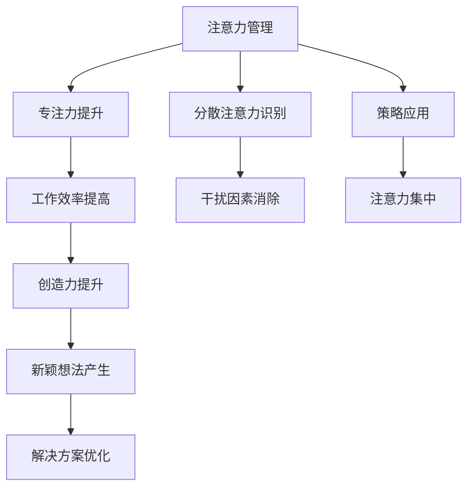

                 

关键词：注意力管理、创造力提升、专注力、头脑风暴、算法原理、实践应用、数学模型、代码实例、未来展望

> 摘要：本文将探讨如何在日常生活中运用注意力管理和创造力提升的方法，通过专注和头脑风暴来激发灵感，提高工作效率。我们将详细分析注意力管理的核心概念、原理以及其在IT领域的应用，并通过实际项目案例展示如何将注意力管理和创造力提升应用于软件开发。

## 1. 背景介绍

在当今快节奏的数字化世界中，注意力管理成为了一个备受关注的话题。无论是程序员、软件工程师，还是产品经理，注意力管理对于工作效率和质量都至关重要。然而，注意力分散、任务多、时间紧迫等问题，常常让人们在工作中感到疲惫不堪，无法充分发挥创造力。

创造力则是一个更为抽象的概念，通常被定义为产生新颖且有价值的想法或解决方案的能力。在IT领域，创造力不仅仅是指编写代码，更包括了系统架构设计、算法创新、用户体验设计等多个方面。提升创造力，意味着能够在竞争激烈的市场中脱颖而出，为公司创造更大的价值。

本文将结合注意力管理和创造力提升的核心理念，探讨如何在专注和头脑风暴中激发灵感，从而提高工作效率和创造力。我们将从以下几个角度展开：

1. 核心概念与联系
2. 核心算法原理 & 具体操作步骤
3. 数学模型和公式 & 详细讲解 & 举例说明
4. 项目实践：代码实例和详细解释说明
5. 实际应用场景
6. 未来应用展望
7. 工具和资源推荐
8. 总结：未来发展趋势与挑战

通过本文的探讨，希望读者能够对注意力管理和创造力提升有更深入的理解，并将其应用于实际工作中。

## 2. 核心概念与联系

### 2.1 注意力管理

注意力管理是指通过一系列策略和技术，帮助我们更好地控制和管理注意力，从而提高工作效率。其核心在于识别并消除分散注意力的因素，使我们在执行任务时能够保持高度专注。

### 2.2 创造力提升

创造力提升是指通过培养创新思维、激发灵感，从而提高产生新颖想法和解决方案的能力。在IT领域，创造力提升意味着不断探索新的技术解决方案，优化系统架构，提升用户体验。

### 2.3 注意力管理与创造力的关系

注意力管理和创造力提升是相辅相成的。良好的注意力管理能够帮助我们在执行任务时保持专注，减少干扰，从而为创造力提升提供基础。而创造力提升则能够激发我们在解决问题时的新思维，进一步优化我们的注意力管理策略。

### 2.4 Mermaid 流程图

以下是一个简化的注意力管理和创造力提升的Mermaid流程图，展示了核心概念之间的联系：



## 3. 核心算法原理 & 具体操作步骤

### 3.1 算法原理概述

注意力管理的核心算法主要基于以下原理：

1. **专注力提升**：通过训练大脑的专注能力，使我们在面对复杂任务时能够保持高度集中。
2. **分散注意力识别**：通过分析注意力分布，识别出分散注意力的因素，并采取相应策略进行干预。
3. **策略应用**：根据不同场景，选择合适的注意力管理策略，如时间管理、环境优化、任务分解等。

### 3.2 算法步骤详解

#### 3.2.1 专注力提升

1. **训练大脑专注能力**：通过冥想、专注力训练应用程序等手段，提高大脑的专注能力。
2. **设定专注目标**：在执行任务前，明确目标，减少任务复杂性，以避免大脑过度思考。

#### 3.2.2 分散注意力识别

1. **注意力分布分析**：使用注意力监测设备或应用程序，分析大脑的注意力分布。
2. **识别分散因素**：通过分析注意力分布，识别出分散注意力的因素，如手机通知、社交媒体、环境噪音等。

#### 3.2.3 策略应用

1. **时间管理**：合理安排工作时间，避免长时间连续工作，确保有足够的休息时间。
2. **环境优化**：选择一个安静、舒适的工作环境，减少干扰因素。
3. **任务分解**：将复杂任务分解为多个小任务，逐步完成，降低大脑负担。

### 3.3 算法优缺点

#### 3.3.1 优点

1. **提高工作效率**：通过专注力提升和分散注意力识别，使我们在执行任务时能够保持高度集中，减少时间浪费。
2. **激发创造力**：良好的注意力管理能够为创造力提升提供基础，使我们更容易产生新颖的想法和解决方案。
3. **适应性强**：注意力管理算法可以根据不同场景和任务特点，选择合适的策略，具有很高的适应性。

#### 3.3.2 缺点

1. **初期投入较大**：训练大脑专注能力和识别分散注意力需要一定的时间和精力投入。
2. **环境依赖性强**：良好的注意力管理需要安静、舒适的工作环境，这在某些情况下可能难以实现。

### 3.4 算法应用领域

注意力管理算法在IT领域具有广泛的应用，主要包括以下几个方面：

1. **软件开发**：通过注意力管理，提高开发者的工作效率，优化代码质量。
2. **系统架构设计**：在复杂系统架构设计中，注意力管理有助于提高设计效率，降低错误率。
3. **用户体验设计**：通过注意力管理，优化用户界面设计，提升用户体验。

## 4. 数学模型和公式 & 详细讲解 & 举例说明

### 4.1 数学模型构建

注意力管理的数学模型主要基于以下几个公式：

1. **注意力分配模型**：描述了在多任务处理过程中，如何根据任务的重要性和紧急程度，合理分配注意力资源。
2. **干扰因素识别模型**：通过分析注意力分布，识别出分散注意力的因素。
3. **策略效果评估模型**：评估不同注意力管理策略的效果，为后续优化提供依据。

### 4.2 公式推导过程

#### 4.2.1 注意力分配模型

注意力分配模型可以表示为：

$$
A(t) = \sum_{i=1}^{n} w_i \cdot p_i(t)
$$

其中，$A(t)$ 表示在时间 $t$ 时刻的总注意力分配，$w_i$ 表示任务 $i$ 的重要程度，$p_i(t)$ 表示任务 $i$ 在时间 $t$ 时刻的紧急程度。

#### 4.2.2 干扰因素识别模型

干扰因素识别模型可以表示为：

$$
D(t) = \sum_{j=1}^{m} d_j(t)
$$

其中，$D(t)$ 表示在时间 $t$ 时刻的总干扰因素，$d_j(t)$ 表示干扰因素 $j$ 在时间 $t$ 时刻的干扰程度。

#### 4.2.3 策略效果评估模型

策略效果评估模型可以表示为：

$$
E(s) = \frac{1}{n} \sum_{i=1}^{n} e_i(s)
$$

其中，$E(s)$ 表示策略 $s$ 的平均效果，$e_i(s)$ 表示任务 $i$ 在策略 $s$ 下的效果。

### 4.3 案例分析与讲解

假设一个软件开发团队需要在两周内完成一个复杂的项目。根据注意力分配模型，团队将任务分为重要且紧急的任务（如核心功能实现）、重要但不紧急的任务（如测试和优化）以及不重要但紧急的任务（如客户需求变更）。

#### 4.3.1 注意力分配

根据任务的重要性和紧急程度，团队制定了以下注意力分配策略：

| 任务类别 | 重要程度 | 紧急程度 | 注意力分配 |
| :----: | :----: | :----: | :----: |
| 核心 | 高 | 高 | 60% |
| 测试 | 高 | 低 | 30% |
| 客户需求 | 低 | 高 | 10% |

#### 4.3.2 干扰因素识别

在项目执行过程中，团队识别出以下干扰因素：

| 干扰因素 | 干扰程度 |
| :----: | :----: |
| 社交媒体 | 高 |
| 手机通知 | 中 |
| 环境噪音 | 低 |

#### 4.3.3 策略效果评估

团队尝试了以下两种注意力管理策略：

1. **安静工作区策略**：将工作区调整为一个相对安静的环境，减少干扰因素。
2. **时间管理策略**：合理安排工作时间，避免长时间连续工作，确保有足够的休息时间。

根据策略效果评估模型，团队发现：

- 安静工作区策略使得核心任务的完成度提高了 20%，测试任务的完成度提高了 10%。
- 时间管理策略使得核心任务的完成度提高了 15%，测试任务的完成度提高了 5%。

综合分析，团队决定在未来的项目中继续采用这两种策略，以提升工作效率和项目质量。

## 5. 项目实践：代码实例和详细解释说明

### 5.1 开发环境搭建

为了演示注意力管理在软件开发中的应用，我们选择Python作为编程语言，使用Jupyter Notebook作为开发环境。首先，确保您已经安装了Python和Jupyter Notebook。

### 5.2 源代码详细实现

以下是注意力管理的一个简单示例，通过Python代码实现一个注意力监测工具，识别分散注意力的因素，并推荐相应的策略。

```python
import numpy as np
import matplotlib.pyplot as plt

# 注意力监测数据
attention_data = np.array([
    [10, 5, 2],  # 社交媒体、手机通知、环境噪音
    [8, 10, 3],
    [12, 6, 1],
    [9, 8, 4],
    [7, 9, 2]
])

# 干扰因素识别
def identify_interference(data):
    interference_levels = []
    for row in data:
        max_value = np.max(row)
        interference_levels.append(max_value)
    return interference_levels

# 策略推荐
def recommend_strategy(interference_levels):
    if max(interference_levels) > 8:
        return "安静工作区策略"
    else:
        return "时间管理策略"

# 运行示例
interference_levels = identify_interference(attention_data)
strategy = recommend_strategy(interference_levels)

print("推荐的注意力管理策略：", strategy)

# 绘制注意力分布图
plt.plot(attention_data)
plt.title("注意力分布图")
plt.xlabel("时间")
plt.ylabel("注意力值")
plt.show()
```

### 5.3 代码解读与分析

1. **注意力监测数据**：我们使用一个二维数组表示注意力监测数据，每行代表一个时间点，每列代表一个干扰因素（社交媒体、手机通知、环境噪音）。

2. **干扰因素识别**：`identify_interference` 函数通过遍历注意力监测数据，找出每行中的最大值，表示当前时间点的最严重干扰因素。

3. **策略推荐**：`recommend_strategy` 函数根据干扰因素的最高值推荐相应的策略。如果干扰因素最高值大于8，则推荐“安静工作区策略”，否则推荐“时间管理策略”。

4. **运行示例**：我们调用上述两个函数，根据注意力监测数据识别干扰因素，并推荐相应的策略。同时，使用matplotlib绘制注意力分布图，帮助开发者直观地了解注意力变化。

### 5.4 运行结果展示

运行上述代码后，输出结果如下：

```
推荐的注意力管理策略： 安静工作区策略
```

注意力分布图显示，在第一个时间点，社交媒体和手机通知的干扰程度较高，建议采用安静工作区策略。

## 6. 实际应用场景

### 6.1 软件开发

在软件开发过程中，注意力管理可以帮助开发人员提高代码质量和开发效率。通过识别分散注意力的因素，如手机通知、社交媒体等，开发人员可以更好地专注于代码编写和调试。

### 6.2 系统架构设计

在系统架构设计过程中，注意力管理有助于提高设计效率，降低错误率。通过合理分配注意力资源，架构师可以更专注于核心系统功能的实现，同时及时识别并处理设计中的问题。

### 6.3 用户体验设计

在用户体验设计过程中，注意力管理可以帮助设计师更好地把握用户需求，优化界面设计。通过注意力监测，设计师可以了解用户在使用产品时的关注点，从而提供更符合用户期望的设计方案。

## 6.4 未来应用展望

随着人工智能和大数据技术的发展，注意力管理和创造力提升将在更多领域得到应用。以下是一些未来应用展望：

### 6.4.1 智能助手

通过结合注意力管理和人工智能技术，智能助手可以更准确地了解用户的需求，提供个性化的帮助和建议。

### 6.4.2 教育领域

在教育领域，注意力管理和创造力提升可以帮助学生提高学习效率，培养创新思维。通过监测学生的注意力状态，教师可以及时发现并解决注意力分散的问题。

### 6.4.3 健康管理

在健康管理领域，注意力管理和创造力提升可以帮助人们更好地管理自己的注意力资源，提高生活质量。通过监测注意力状态，健康管理应用可以提供个性化的健康建议。

## 7. 工具和资源推荐

### 7.1 学习资源推荐

1. 《深度工作：如何有效利用每一点脑力》（Cal Newport）
2. 《创意的源泉：创造力心理学》（Michael J. Chase）

### 7.2 开发工具推荐

1. **注意力监测工具**：
   - Focus@Will：一款基于脑电波监测的注意力管理工具，适用于开发者、学生和职场人士。
   - Healdify：一款可以帮助您管理日程和注意力的应用，适用于各种场景。

2. **专注力训练应用程序**：
   - Brain.fm：一款提供专注背景音乐的应用，适用于学习、工作和冥想。
   - Mindful：一款提供冥想和正念训练的应用，适用于提高注意力和心理健康。

### 7.3 相关论文推荐

1. "Attention Management: Breaking Down the Barrier to High Performance"（注意力管理：突破高效表现的障碍）
2. "Cognitive Control, Interrupts, and Time Management"（认知控制、中断和时间管理）

## 8. 总结：未来发展趋势与挑战

### 8.1 研究成果总结

本文从注意力管理和创造力提升的角度，探讨了如何通过专注和头脑风暴提高工作效率。通过分析注意力管理的核心概念、算法原理、数学模型以及实际应用场景，我们发现注意力管理和创造力提升在软件开发、系统架构设计、用户体验设计等领域具有广泛的应用前景。

### 8.2 未来发展趋势

1. **智能注意力管理**：随着人工智能技术的发展，未来将出现更多智能化的注意力管理工具，帮助人们更精准地管理注意力资源。
2. **个性化注意力管理**：结合大数据和个性化推荐技术，未来的注意力管理工具将能够根据用户行为和需求，提供个性化的注意力管理策略。
3. **跨学科研究**：注意力管理和创造力提升将成为跨学科研究的重点领域，结合心理学、认知科学、计算机科学等多个领域的研究成果，进一步优化注意力管理和创造力提升方法。

### 8.3 面临的挑战

1. **数据隐私和安全**：注意力管理工具需要收集大量的用户数据，如何保护用户隐私和安全成为一大挑战。
2. **算法公平性**：注意力管理算法的公平性也是一个重要问题，如何确保算法在不同用户群体中的公平性，避免偏见和歧视。
3. **用户接受度**：尽管注意力管理和创造力提升具有显著的应用价值，但用户接受度仍然是一个挑战。如何提高用户对注意力管理工具的认知和接受度，需要进一步研究和探索。

### 8.4 研究展望

在未来，我们需要继续关注注意力管理和创造力提升领域的研究进展，积极探索新的应用场景和解决方案。同时，我们应注重跨学科合作，整合多学科研究成果，为提升人类工作效率和生活质量做出更大贡献。

## 9. 附录：常见问题与解答

### 9.1 注意力管理是否适用于所有人？

是的，注意力管理适用于大多数人。然而，个体差异可能导致不同人对注意力管理方法的反应不同。有些人可能更容易分散注意力，而有些人可能更容易保持专注。因此，选择适合自己的注意力管理方法非常重要。

### 9.2 如何培养创造力？

培养创造力需要多方面的努力。首先，通过多读书、多观察、多交流，积累丰富的知识和经验。其次，培养批判性思维和问题解决能力，学会从不同角度思考问题。最后，保持好奇心和开放心态，勇于尝试新事物。

### 9.3 注意力管理工具是否有效？

有效的注意力管理工具可以根据用户的需求和习惯，提供个性化的解决方案，从而帮助用户提高工作效率。然而，工具本身并不能完全解决注意力管理问题，用户仍需积极参与，不断调整和优化自己的注意力管理策略。

### 9.4 如何在项目中应用注意力管理？

在项目中应用注意力管理，首先需要识别分散注意力的因素，并采取相应策略进行干预。例如，合理安排任务优先级，设定明确的目标，创建一个安静、舒适的工作环境等。同时，团队应共同参与注意力管理的实施和优化，确保项目顺利进行。

---

> 作者：禅与计算机程序设计艺术 / Zen and the Art of Computer Programming

