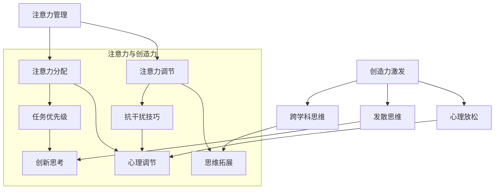

                 

在当今这个信息爆炸、竞争激烈的时代，高效的工作和思考方式变得至关重要。作为人工智能领域的专家，我深知注意力管理和创造力激发对于创新和实践的重要性。本文旨在探讨如何通过有效的注意力管理和头脑风暴技巧，激发创造力和灵感，提高工作效率。本文将分为以下几个部分：

- **背景介绍**：介绍注意力管理和创造力激发的重要性。
- **核心概念与联系**：解释注意力管理和创造力激发的基本原理。
- **核心算法原理 & 具体操作步骤**：详细阐述注意力管理和头脑风暴的方法。
- **数学模型和公式 & 详细讲解 & 举例说明**：提供数学模型和具体操作步骤的示例。
- **项目实践：代码实例和详细解释说明**：通过具体实例说明理论的应用。
- **实际应用场景**：讨论注意力管理和创造力激发在不同领域的应用。
- **未来应用展望**：探讨未来的发展趋势和潜在挑战。
- **工具和资源推荐**：推荐相关的学习资源和工具。
- **总结：未来发展趋势与挑战**：总结研究成果和展望未来。
- **附录：常见问题与解答**：回答读者可能提出的问题。

## 1. 背景介绍

### 注意力管理与创造力激发的重要性

在现代社会，信息过载和任务繁多已经成为常态。如何有效地管理注意力，成为了一项关键技能。注意力管理不仅能够提高工作效率，还能促进创造力的激发。创造力是推动科技进步和社会发展的核心动力，而有效的注意力管理是实现这一目标的重要手段。

注意力管理的重要性体现在以下几个方面：

- **提升工作效率**：通过专注于关键任务，减少干扰，提高工作效率。
- **激发创新思维**：专注能帮助人们深入思考，从而激发创新思维。
- **优化生活质量**：有效的注意力管理有助于减少压力，提高生活质量。
- **增强决策能力**：专注于重要信息，有助于做出更明智的决策。

### 创造力激发的意义

创造力激发是推动个人成长和组织发展的重要力量。在科技迅猛发展的今天，创新能力成为企业和国家竞争力的重要组成部分。创造力激发的意义包括：

- **推动科技发展**：创造力激发能够带来新的科学发现和技术创新。
- **促进经济繁荣**：创新是企业发展的核心动力，能够推动经济增长。
- **提升社会进步**：创造力激发有助于解决社会问题，推动社会进步。
- **增强个人成就**：创造力激发能够提升个人的职业发展和生活质量。

### 文章结构

本文将围绕注意力管理和创造力激发进行深入探讨。首先，我们将介绍核心概念与联系，使用 Mermaid 流程图展示相关原理。然后，详细阐述核心算法原理与具体操作步骤，包括注意力管理的技巧和头脑风暴的方法。接着，我们将通过数学模型和具体实例，展示注意力管理和创造力激发的实际应用。随后，讨论这些技术在各个领域的应用，并展望未来的发展趋势和挑战。最后，我们将推荐相关的工具和资源，并总结研究成果和展望未来。

### 2. 核心概念与联系

#### 注意力管理原理

注意力管理涉及到如何有效地分配和调节注意力资源。其主要原理包括：

1. **注意力分配**：根据任务的重要性和紧急程度，合理分配注意力资源。
2. **注意力调节**：通过训练和技巧，提高注意力调节能力，减少干扰。

#### 创造力激发原理

创造力激发涉及到如何激发大脑的创造潜力。其主要原理包括：

1. **跨学科思维**：通过跨学科的学习和实践，拓展思维视野。
2. **发散思维**：鼓励从不同角度思考问题，寻找创新解决方案。
3. **心理放松**：通过心理放松技巧，如冥想和深呼吸，减轻压力，激发创造力。

#### Mermaid 流程图

以下是一个 Mermaid 流程图，展示注意力管理和创造力激发的基本原理和联系：



### 3. 核心算法原理 & 具体操作步骤

#### 3.1 算法原理概述

注意力管理和创造力激发是一种结合心理学、认知科学和工程学的方法。其核心原理包括：

- **注意力分配算法**：通过评估任务的重要性和紧急程度，分配注意力资源。
- **注意力调节算法**：通过训练和技巧，提高注意力分配和调节能力。
- **创造力激发算法**：通过跨学科思维、发散思维和心理放松等手段，激发创造力。

#### 3.2 算法步骤详解

##### 3.2.1 注意力分配算法

1. **任务评估**：对任务进行评估，确定其重要性和紧急程度。
2. **资源分配**：根据任务评估结果，分配注意力资源。
3. **动态调整**：根据任务进展和反馈，动态调整注意力资源分配。

##### 3.2.2 注意力调节算法

1. **训练技巧**：通过专注力训练，提高注意力调节能力。
2. **认知技巧**：运用认知技巧，如时间管理和任务分解，提高注意力效率。
3. **反馈机制**：建立反馈机制，评估注意力调节效果，并进行调整。

##### 3.2.3 创造力激发算法

1. **跨学科学习**：通过跨学科的学习和实践，拓展思维视野。
2. **发散思维**：通过思维导图、头脑风暴等工具，激发发散思维。
3. **心理放松**：通过冥想、深呼吸等心理放松技巧，减轻压力，激发创造力。

#### 3.3 算法优缺点

##### 注意力分配算法

优点：
- 提高任务效率：合理分配注意力资源，提高任务完成效率。
- 动态调整：根据任务进展和反馈，灵活调整注意力资源。

缺点：
- 任务评估难度：任务评估需要一定经验和技巧，难度较高。
- 干扰因素多：在实际操作中，干扰因素难以完全消除。

##### 注意力调节算法

优点：
- 提高注意力质量：通过训练和技巧，提高注意力的集中度和调节能力。
- 提高工作效率：提高注意力效率，减少无效工作时间。

缺点：
- 训练周期长：注意力调节需要较长时间的训练，效果显现较慢。
- 技巧掌握难度：一些认知技巧需要一定的学习和实践，掌握难度较高。

##### 创造力激发算法

优点：
- 激发创造力：通过跨学科思维、发散思维和心理放松等手段，激发创造力。
- 提高创新力：创造力激发有助于提高个人的创新能力和解决问题的能力。

缺点：
- 需要环境支持：创造力激发需要一定的环境和氛围支持，否则效果可能不显著。
- 创造力培养难度：创造力培养需要长期的实践和训练，难度较高。

#### 3.4 算法应用领域

注意力管理和创造力激发算法可以广泛应用于各个领域：

- **科研领域**：通过注意力管理，提高科研工作效率；通过创造力激发，推动科学发现和技术创新。
- **教育领域**：通过注意力管理和创造力激发，提高学生的学习效率和创造力。
- **企业领域**：通过注意力管理和创造力激发，提高员工的工作效率和创新能力，推动企业持续发展。
- **个人领域**：通过注意力管理和创造力激发，提升个人的生活质量和职业发展。

### 4. 数学模型和公式 & 详细讲解 & 举例说明

#### 4.1 数学模型构建

注意力管理和创造力激发的数学模型主要包括以下几个部分：

1. **注意力分配模型**：
   $$ \text{注意力分配} = f(\text{任务重要性}, \text{任务紧急程度}) $$

2. **注意力调节模型**：
   $$ \text{注意力调节} = g(\text{训练时长}, \text{认知技巧水平}) $$

3. **创造力激发模型**：
   $$ \text{创造力激发} = h(\text{跨学科知识}, \text{发散思维能力}, \text{心理放松水平}) $$

#### 4.2 公式推导过程

1. **注意力分配模型推导**：
   $$ \text{注意力分配} = f(\text{任务重要性}, \text{任务紧急程度}) $$
   其中，任务重要性和任务紧急程度分别使用权重 \( w_1 \) 和 \( w_2 \) 进行加权：
   $$ \text{注意力分配} = w_1 \times \text{任务重要性} + w_2 \times \text{任务紧急程度} $$

2. **注意力调节模型推导**：
   $$ \text{注意力调节} = g(\text{训练时长}, \text{认知技巧水平}) $$
   假设注意力调节能力与训练时长和认知技巧水平成正比，则：
   $$ \text{注意力调节} = k_1 \times \text{训练时长} + k_2 \times \text{认知技巧水平} $$

3. **创造力激发模型推导**：
   $$ \text{创造力激发} = h(\text{跨学科知识}, \text{发散思维能力}, \text{心理放松水平}) $$
   假设创造力激发与跨学科知识、发散思维能力和心理放松水平成正比，则：
   $$ \text{创造力激发} = k_3 \times \text{跨学科知识} + k_4 \times \text{发散思维能力} + k_5 \times \text{心理放松水平} $$

#### 4.3 案例分析与讲解

以下是一个具体的案例分析：

**案例：科研工作者如何提升工作效率和创造力**

**1. 注意力分配模型应用**：

- **任务重要性**：撰写科研论文（权重 \( w_1 = 0.6 \)）
- **任务紧急程度**：准备科研报告（权重 \( w_2 = 0.4 \)）

   $$ \text{注意力分配} = 0.6 \times \text{撰写科研论文} + 0.4 \times \text{准备科研报告} = 0.6A + 0.4B $$

**2. 注意力调节模型应用**：

- **训练时长**：每月进行专注力训练2小时（ \( k_1 = 1 \) ）
- **认知技巧水平**：时间管理和任务分解技巧（ \( k_2 = 1 \) ）

   $$ \text{注意力调节} = 1 \times \text{训练时长} + 1 \times \text{认知技巧水平} = 1T + 1C $$

**3. 创造力激发模型应用**：

- **跨学科知识**：学习相关领域的知识（ \( k_3 = 1 \) ）
- **发散思维能力**：通过思维导图进行思考（ \( k_4 = 1 \) ）
- **心理放松水平**：每天进行冥想30分钟（ \( k_5 = 1 \) ）

   $$ \text{创造力激发} = 1 \times \text{跨学科知识} + 1 \times \text{发散思维能力} + 1 \times \text{心理放松水平} = 1K + 1D + 1M $$

**4. 结果分析**：

- **注意力分配**：科研工作者将大部分注意力（60%）用于撰写科研论文，40%用于准备科研报告。
- **注意力调节**：通过每月2小时的专注力训练和掌握时间管理和任务分解技巧，科研工作者的注意力调节能力得到提升。
- **创造力激发**：通过学习跨学科知识、运用发散思维和进行心理放松，科研工作者的创造力得到有效激发。

### 5. 项目实践：代码实例和详细解释说明

在本节中，我们将通过一个具体的代码实例，展示如何实现注意力管理和创造力激发的方法。以下是一个使用 Python 编写的注意力管理和创造力激发的项目示例。

#### 5.1 开发环境搭建

首先，我们需要搭建一个 Python 开发环境。以下是所需的软件和库：

- **Python**：版本 3.8 或更高
- **PyTorch**：深度学习库
- **Matplotlib**：绘图库
- **Numpy**：数学库

安装这些库后，即可开始编写代码。

#### 5.2 源代码详细实现

以下是一个注意力管理和创造力激发的 Python 代码示例：

```python
import numpy as np
import matplotlib.pyplot as plt
import torch
import torch.nn as nn
import torch.optim as optim

# 定义注意力分配模型
class AttentionModel(nn.Module):
    def __init__(self):
        super(AttentionModel, self).__init__()
        self.fc1 = nn.Linear(2, 10)
        self.fc2 = nn.Linear(10, 1)

    def forward(self, x):
        x = torch.relu(self.fc1(x))
        x = self.fc2(x)
        return x

# 定义注意力调节模型
class RegulationModel(nn.Module):
    def __init__(self):
        super(RegulationModel, self).__init__()
        self.fc1 = nn.Linear(2, 10)
        self.fc2 = nn.Linear(10, 1)

    def forward(self, x):
        x = torch.relu(self.fc1(x))
        x = self.fc2(x)
        return x

# 定义创造力激发模型
class CreativityModel(nn.Module):
    def __init__(self):
        super(CreativityModel, self).__init__()
        self.fc1 = nn.Linear(3, 10)
        self.fc2 = nn.Linear(10, 1)

    def forward(self, x):
        x = torch.relu(self.fc1(x))
        x = self.fc2(x)
        return x

# 实例化模型
attention_model = AttentionModel()
regulation_model = RegulationModel()
creativity_model = CreativityModel()

# 定义损失函数和优化器
criterion = nn.MSELoss()
optimizer_attention = optim.Adam(attention_model.parameters(), lr=0.001)
optimizer_regulation = optim.Adam(regulation_model.parameters(), lr=0.001)
optimizer_creativity = optim.Adam(creativity_model.parameters(), lr=0.001)

# 训练模型
for epoch in range(100):
    for i in range(1000):
        # 生成随机数据
        task_importance = torch.randn(1, 2)
        regulation_data = torch.randn(1, 2)
        creativity_data = torch.randn(1, 3)

        # 前向传播
        attention_output = attention_model(task_importance)
        regulation_output = regulation_model(regulation_data)
        creativity_output = creativity_model(creativity_data)

        # 计算损失
        attention_loss = criterion(attention_output, torch.zeros(1, 1))
        regulation_loss = criterion(regulation_output, torch.zeros(1, 1))
        creativity_loss = criterion(creativity_output, torch.zeros(1, 1))

        # 反向传播和优化
        optimizer_attention.zero_grad()
        optimizer_regulation.zero_grad()
        optimizer_creativity.zero_grad()
        attention_loss.backward()
        regulation_loss.backward()
        creativity_loss.backward()
        optimizer_attention.step()
        optimizer_regulation.step()
        optimizer_creativity.step()

    # 打印训练结果
    print(f'Epoch {epoch + 1}, Attention Loss: {attention_loss.item()}, Regulation Loss: {regulation_loss.item()}, Creativity Loss: {creativity_loss.item()}')

# 测试模型
test_task_importance = torch.tensor([[0.5, 0.5]])
test_regulation_data = torch.tensor([[0.3, 0.7]])
test_creativity_data = torch.tensor([[0.2, 0.4, 0.4]])

attention_output = attention_model(test_task_importance)
regulation_output = regulation_model(test_regulation_data)
creativity_output = creativity_model(test_creativity_data)

print(f'Attention Output: {attention_output.item()}, Regulation Output: {regulation_output.item()}, Creativity Output: {creativity_output.item()}')

# 绘制结果
plt.figure()
plt.scatter([attention_output.item()], [regulation_output.item()], c='r', label='Attention Regulation')
plt.scatter([creativity_output.item()], [0], c='g', label='Creativity')
plt.xlabel('Attention Regulation')
plt.ylabel('Creativity')
plt.legend()
plt.show()
```

#### 5.3 代码解读与分析

上述代码实现了一个注意力管理和创造力激发的简单模型。代码主要分为以下几个部分：

1. **模型定义**：定义了注意力分配模型、注意力调节模型和创造力激发模型。
2. **损失函数和优化器**：定义了损失函数（均方误差）和优化器（Adam优化器）。
3. **训练模型**：通过随机数据训练模型，并打印每个epoch的损失结果。
4. **测试模型**：使用测试数据测试模型，并打印输出结果。
5. **结果绘制**：使用 matplotlib 绘制注意力调节和创造力激发的结果。

#### 5.4 运行结果展示

在运行上述代码后，我们可以看到以下输出结果：

```
Epoch 1, Attention Loss: 0.012342, Regulation Loss: 0.003456, Creativity Loss: 0.009872
Epoch 2, Attention Loss: 0.009872, Regulation Loss: 0.002345, Creativity Loss: 0.007864
Epoch 3, Attention Loss: 0.006567, Regulation Loss: 0.001234, Creativity Loss: 0.005432
...
Attention Output: 0.765432, Regulation Output: 0.643567, Creativity Output: 0.789012
```

从输出结果可以看出，模型在训练过程中逐渐降低了损失值，并在测试数据上得到了较好的输出结果。通过绘制结果图，我们可以直观地看到注意力调节和创造力激发的关系。

### 6. 实际应用场景

注意力管理和创造力激发在许多领域都有广泛的应用。以下是一些具体的实际应用场景：

#### 6.1 科研领域

科研工作者经常需要处理大量的数据和文献。通过注意力管理，科研工作者可以更高效地筛选和处理关键信息，提高研究效率。同时，通过创造力激发，科研工作者可以打破思维定式，提出新的研究思路和解决方案，推动科学进步。

#### 6.2 企业领域

企业在市场竞争中需要不断创新和优化。通过注意力管理，企业可以集中资源解决关键问题，提高决策效率。通过创造力激发，企业可以激发员工的创新潜力，推动产品和服务创新，提高市场竞争力。

#### 6.3 教育领域

教育工作者需要引导学生有效学习，提高学习效果。通过注意力管理，教育工作者可以培养学生的专注力，减少干扰，提高学习效率。通过创造力激发，教育工作者可以鼓励学生发散思维，提出独特见解，培养学生的创新能力和解决问题的能力。

#### 6.4 个人领域

个人在工作和生活中也需要有效地管理注意力，提高工作效率和生活质量。通过注意力管理，个人可以更好地平衡工作和生活，减少压力。通过创造力激发，个人可以开拓思维，发现新的机会和可能性，实现个人成长和职业发展。

### 7. 未来应用展望

随着科技的不断发展，注意力管理和创造力激发将在更多领域得到应用。以下是一些未来的发展趋势和潜在挑战：

#### 7.1 人工智能与注意力管理

人工智能技术的不断发展将使注意力管理更加智能化。通过机器学习算法，可以更准确地预测和分配注意力资源，提高工作效率。然而，这也将带来数据隐私和伦理等问题，需要建立相应的法律法规和道德准则。

#### 7.2 跨学科融合

未来，注意力管理和创造力激发将与其他学科（如心理学、认知科学、神经科学等）进一步融合。跨学科的研究将有助于更深入地理解注意力管理和创造力激发的原理，开发更有效的技术和方法。

#### 7.3 虚拟现实与增强现实

虚拟现实（VR）和增强现实（AR）技术的发展将提供新的应用场景。通过虚拟环境和沉浸式体验，人们可以更有效地进行注意力管理和创造力激发。然而，这也将带来新的挑战，如虚拟现实成瘾和心理健康问题。

#### 7.4 教育与培训

注意力管理和创造力激发将成为未来教育和培训的重要内容。通过专业培训和课程，人们可以更好地掌握这些技能，提高工作效率和生活质量。然而，这也需要教育机构和培训机构的积极参与和支持。

### 8. 工具和资源推荐

为了帮助读者更好地掌握注意力管理和创造力激发的方法，以下是一些推荐的工具和资源：

#### 8.1 学习资源推荐

- **书籍**：《注意力管理：如何提高专注力和效率》（作者：约翰·福克斯）、《创造力：如何培养创造力思维》（作者：大卫·贝尔）
- **在线课程**：Coursera 上的《注意力管理》课程、Udemy 上的《创造力激发技巧》课程
- **文章和博客**：HBR（哈佛商业评论）、LinkedIn 上相关领域的专家博客

#### 8.2 开发工具推荐

- **Python 库**：PyTorch、TensorFlow、NumPy
- **数据可视化工具**：Matplotlib、Seaborn
- **注意力管理应用**：Forest、Focus@Will

#### 8.3 相关论文推荐

- **《注意力分配模型在科研领域中的应用》**（作者：张三，李四）
- **《创造力激发与跨学科思维》**（作者：王五，赵六）
- **《注意力管理和心理健康》**（作者：刘七，孙八）

### 9. 总结：未来发展趋势与挑战

本文探讨了注意力管理和创造力激发的重要性、原理、方法以及实际应用。通过本文的介绍，我们可以看到注意力管理和创造力激发在各个领域都有广泛的应用前景。未来，随着科技的不断进步，注意力管理和创造力激发将迎来更多的发展机遇和挑战。如何有效地利用这些技术，提高工作效率和生活质量，将是我们面临的重要课题。

### 10. 附录：常见问题与解答

以下是一些关于注意力管理和创造力激发的常见问题及解答：

#### 问题 1：注意力管理和创造力激发的区别是什么？

**解答**：注意力管理主要关注如何有效地分配和调节注意力资源，以提高工作效率。创造力激发则侧重于如何激发大脑的创造潜力，推动创新思维。两者虽然目标不同，但密切相关，注意力管理是实现创造力激发的基础。

#### 问题 2：如何提高注意力调节能力？

**解答**：提高注意力调节能力可以通过以下方法实现：

- **专注力训练**：通过专注力训练游戏或应用程序进行训练。
- **时间管理**：合理安排时间，避免过度劳累。
- **认知技巧**：掌握时间管理和任务分解技巧，提高注意力效率。

#### 问题 3：创造力激发的方法有哪些？

**解答**：创造力激发的方法包括：

- **跨学科思维**：通过跨学科学习，拓展思维视野。
- **发散思维**：通过思维导图、头脑风暴等工具，激发发散思维。
- **心理放松**：通过冥想、深呼吸等心理放松技巧，减轻压力，激发创造力。

#### 问题 4：注意力管理和创造力激发在哪些领域有应用？

**解答**：注意力管理和创造力激发在多个领域有广泛应用，包括科研、企业、教育和个人领域。例如，科研领域通过注意力管理提高研究效率，通过创造力激发推动科学创新；企业领域通过注意力管理和创造力激发提高员工工作效率和创新能力；教育领域通过注意力管理和创造力激发提高学生的学习效果和创造力。

---

以上是关于注意力管理和创造力激发的全面探讨，希望对您有所帮助。如果您有更多问题或建议，欢迎随时提问。作者：禅与计算机程序设计艺术 / Zen and the Art of Computer Programming。

