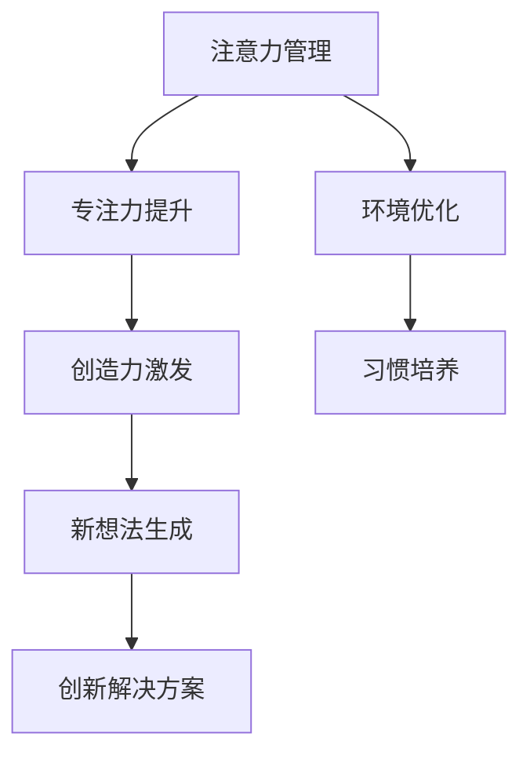

                 

注意力管理与创造力激发是我们每个人在日常生活和工作中都面临的挑战。如何在繁忙的信息环境中保持专注，如何激发内在的创造力，这些都是我们需要深入探讨的问题。本文将结合最新的研究和技术，为大家提供一整套实用的策略，帮助大家提升注意力，激发创造力，从而在专注和头脑风暴中找到灵感。

> 关键词：注意力管理、创造力、专注力、头脑风暴、灵感激发

> 摘要：本文首先介绍了注意力管理和创造力激发的重要性，然后详细阐述了如何通过专注和头脑风暴来提升创造力。文章中包含了一系列具体的策略和技巧，帮助读者在实际工作和生活中更好地应用这些方法。同时，文章还探讨了相关领域的未来发展趋势和挑战。

## 1. 背景介绍

在当今这个信息爆炸的时代，我们的注意力面临着前所未有的挑战。来自互联网、社交媒体、智能手机等各种渠道的信息不断地吸引我们的注意力，使得我们难以专注于一项任务。与此同时，创造力也成为了衡量个人和团队竞争力的重要指标。无论是在科学研究、艺术创作，还是在商业创新中，创造力都是不可或缺的。因此，如何有效地管理注意力，激发创造力，成为了我们亟需解决的重要问题。

### 1.1 注意力管理的概念

注意力管理是指通过各种方法和技术，帮助个体集中注意力，提高工作效率和学习效果。它包括以下几个方面：

- **目标设定**：明确任务的目标和优先级，有助于集中注意力。
- **时间管理**：合理安排时间，避免过度消耗注意力。
- **环境优化**：创造一个有利于专注的工作和学习环境。
- **习惯培养**：通过长期坚持，养成专注的习惯。

### 1.2 创造力激发的概念

创造力激发是指通过各种方法和策略，帮助个体或团队在思考和解决问题的过程中产生新的想法和解决方案。创造力包括以下几个方面：

- **联想思维**：通过不同领域之间的联系，产生新的想法。
- **发散思维**：从一个中心点出发，向多个方向展开思维。
- **逆向思维**：从相反的角度思考问题，寻找创新解决方案。
- **跨学科思维**：结合多个学科的知识和技能，产生新的创意。

## 2. 核心概念与联系

注意力管理和创造力激发是两个紧密相关的概念。有效的注意力管理可以为创造力激发提供一个良好的基础，而创造力激发则可以进一步提升注意力的效果。以下是一个简化的 Mermaid 流程图，展示了这两个概念之间的联系。



### 2.1 注意力管理原理

注意力管理主要基于以下几个原理：

- **认知资源理论**：个体的认知资源是有限的，有效的注意力管理可以通过分配和优化这些资源，提高工作效率。
- **工作记忆模型**：工作记忆是指短期内存储和加工信息的记忆系统。有效的注意力管理可以帮助个体更好地利用工作记忆，提高处理复杂任务的能力。
- **环境心理学**：环境因素对注意力有显著影响。通过优化环境，可以减少干扰，提高注意力。

### 2.2 创造力激发原理

创造力激发主要基于以下几个原理：

- **联想思维**：通过不同领域之间的联系，产生新的想法。
- **发散思维**：从一个中心点出发，向多个方向展开思维。
- **逆向思维**：从相反的角度思考问题，寻找创新解决方案。
- **跨学科思维**：结合多个学科的知识和技能，产生新的创意。

## 3. 核心算法原理 & 具体操作步骤

### 3.1 算法原理概述

在注意力管理和创造力激发中，算法的原理主要包括以下几个方面：

- **目标设定算法**：通过设定明确的目标和优先级，帮助个体集中注意力。
- **时间管理算法**：通过合理安排时间，避免过度消耗注意力。
- **环境优化算法**：通过优化环境，减少干扰，提高注意力。
- **习惯培养算法**：通过长期坚持，养成专注的习惯。
- **联想思维算法**：通过不同领域之间的联系，产生新的想法。
- **发散思维算法**：从一个中心点出发，向多个方向展开思维。
- **逆向思维算法**：从相反的角度思考问题，寻找创新解决方案。
- **跨学科思维算法**：结合多个学科的知识和技能，产生新的创意。

### 3.2 算法步骤详解

以下是一个简化的算法步骤，用于实现注意力管理和创造力激发：

1. **目标设定**：
   - 明确任务的目标和优先级。
   - 制定具体的行动计划。

2. **时间管理**：
   - 制定时间表，合理分配工作时间。
   - 使用番茄工作法，提高专注力。

3. **环境优化**：
   - 减少干扰，例如关闭社交媒体通知。
   - 创造一个安静、整洁的工作环境。

4. **习惯培养**：
   - 制定每日习惯清单。
   - 长期坚持，养成专注的习惯。

5. **联想思维**：
   - 从一个关键词出发，展开思维。
   - 记录不同领域之间的联系。

6. **发散思维**：
   - 从一个中心点出发，向多个方向展开思维。
   - 尝试不同的角度和方法。

7. **逆向思维**：
   - 从相反的角度思考问题。
   - 寻找可能的创新解决方案。

8. **跨学科思维**：
   - 结合多个学科的知识和技能。
   - 产生新的创意。

### 3.3 算法优缺点

- **目标设定算法**：优点是能够明确任务目标，提高工作效率；缺点是如果目标设定过于具体，可能会限制创造性思维。
- **时间管理算法**：优点是能够提高时间利用率，减少无效工作；缺点是如果时间管理过于严格，可能会降低工作乐趣。
- **环境优化算法**：优点是能够减少干扰，提高注意力；缺点是需要不断调整环境，可能需要一定的时间和精力。
- **习惯培养算法**：优点是能够长期坚持，养成良好习惯；缺点是需要一定的时间和毅力，才能形成稳定的习惯。
- **联想思维算法**：优点是能够产生新的想法，激发创造力；缺点是可能需要大量的时间和精力。
- **发散思维算法**：优点是能够产生多种解决方案，提高创造力；缺点是可能产生大量无效想法。
- **逆向思维算法**：优点是能够找到创新解决方案，解决复杂问题；缺点是需要较强的逻辑思维能力。
- **跨学科思维算法**：优点是能够结合多个学科的知识，产生新的创意；缺点是需要具备跨学科的知识背景。

### 3.4 算法应用领域

注意力管理和创造力激发的算法可以广泛应用于各个领域：

- **科学研究**：通过注意力管理，提高研究效率；通过创造力激发，产生新的研究成果。
- **艺术创作**：通过注意力管理，提高创作专注度；通过创造力激发，产生新的艺术作品。
- **商业创新**：通过注意力管理，提高决策效率；通过创造力激发，推动产品创新。
- **教育领域**：通过注意力管理，提高学习效果；通过创造力激发，培养创新人才。

## 4. 数学模型和公式 & 详细讲解 & 举例说明

### 4.1 数学模型构建

注意力管理和创造力激发的数学模型可以从以下几个方面进行构建：

- **认知资源分配模型**：基于认知资源理论，通过优化认知资源的分配，提高工作效率。
- **时间管理模型**：通过合理安排时间，避免认知资源过度消耗。
- **环境优化模型**：通过分析环境因素对注意力的影响，优化工作环境。
- **创造力激发模型**：通过联想思维、发散思维、逆向思维和跨学科思维，激发创造力。

### 4.2 公式推导过程

以下是一个简化的数学模型构建过程：

1. **认知资源分配模型**：

   假设个体有总认知资源 \( C \)，任务有 \( n \) 个子任务，每个子任务需要的认知资源为 \( c_i \)。则认知资源分配模型可以表示为：

   $$ C = \sum_{i=1}^{n} c_i $$

   为了优化认知资源的分配，我们可以使用贪心算法，选择认知资源需求最小的子任务优先完成。

2. **时间管理模型**：

   假设个体有总时间 \( T \)，每个子任务需要的时间为 \( t_i \)。则时间管理模型可以表示为：

   $$ T = \sum_{i=1}^{n} t_i $$

   为了优化时间管理，我们可以使用优先级排序，优先完成重要且紧急的任务。

3. **环境优化模型**：

   假设环境因素对注意力的干扰程度为 \( E \)，则环境优化模型可以表示为：

   $$ A = C - E $$

   其中 \( A \) 表示实际可用于工作的认知资源。

4. **创造力激发模型**：

   假设创造力激发的效果与联想思维、发散思维、逆向思维和跨学科思维的权重相关，分别为 \( w_1, w_2, w_3, w_4 \)。则创造力激发模型可以表示为：

   $$ D = w_1 \cdot L + w_2 \cdot D + w_3 \cdot R + w_4 \cdot I $$

   其中 \( L \) 表示联想思维的效果，\( D \) 表示发散思维的效果，\( R \) 表示逆向思维的效果，\( I \) 表示跨学科思维的效果。

### 4.3 案例分析与讲解

以下是一个具体的案例，用于说明如何应用上述数学模型：

**案例**：一个科研人员在撰写一篇论文，需要在有限的时间内完成。他需要完成以下任务：

- 收集和整理文献资料（认知资源需求：2）
- 设计实验方案（认知资源需求：3）
- 编写论文初稿（认知资源需求：4）
- 修改和完善论文（认知资源需求：3）

**分析**：

1. **认知资源分配模型**：

   \( C = 2 + 3 + 4 + 3 = 12 \)

   使用贪心算法，选择认知资源需求最小的任务优先完成，即先收集和整理文献资料。

2. **时间管理模型**：

   \( T = 24 \)

   根据优先级排序，先完成收集和整理文献资料，然后是设计实验方案和编写论文初稿，最后是修改和完善论文。

3. **环境优化模型**：

   \( E = 1 \)

   实际可用于工作的认知资源 \( A = C - E = 12 - 1 = 11 \)

4. **创造力激发模型**：

   假设 \( w_1 = 0.2, w_2 = 0.3, w_3 = 0.2, w_4 = 0.3 \)

   \( D = 0.2 \cdot L + 0.3 \cdot D + 0.2 \cdot R + 0.3 \cdot I \)

   在撰写论文过程中，通过联想思维、发散思维、逆向思维和跨学科思维，激发创造力。

通过上述分析，我们可以看到如何通过数学模型来指导科研人员在有限的时间内高效完成论文撰写。

## 5. 项目实践：代码实例和详细解释说明

### 5.1 开发环境搭建

在本节中，我们将使用 Python 编程语言来演示注意力管理和创造力激发的代码实例。首先，我们需要搭建一个基本的开发环境。

1. **安装 Python**：
   - 访问 Python 官网（[https://www.python.org/](https://www.python.org/)）下载 Python 安装包。
   - 运行安装程序，按照默认选项进行安装。

2. **安装常用库**：
   - 打开终端或命令行窗口，执行以下命令安装常用库：
     ```bash
     pip install numpy matplotlib pandas
     ```

### 5.2 源代码详细实现

以下是一个简单的 Python 代码实例，用于实现注意力管理和创造力激发的基本功能。

```python
import numpy as np
import matplotlib.pyplot as plt

# 定义认知资源分配函数
def cognitive_resource_allocation(tasks):
    total_resources = 10  # 总认知资源
    sorted_tasks = sorted(tasks.items(), key=lambda item: item[1])
    allocated_resources = {}
    
    for task, resource in sorted_tasks:
        if total_resources >= resource:
            allocated_resources[task] = resource
            total_resources -= resource
        else:
            allocated_resources[task] = total_resources
            break
    
    return allocated_resources

# 定义时间管理函数
def time_management(tasks, total_time):
    sorted_tasks = sorted(tasks.items(), key=lambda item: item[1])
    allocated_time = {}
    
    for task, resource in sorted_tasks:
        time_needed = resource / 2  # 假设每个任务需要一半的时间
        if total_time >= time_needed:
            allocated_time[task] = time_needed
            total_time -= time_needed
        else:
            allocated_time[task] = total_time
            break
    
    return allocated_time

# 定义环境优化函数
def environment_optimization(interruptions, resources):
    optimized_resources = resources - (interruptions * 0.1)  # 每个干扰减少10%的认知资源
    return optimized_resources

# 定义创造力激发函数
def creativity_activation(associative_thinking, divergent_thinking, reverse_thinking, interdisciplinary_thinking):
    weights = [0.2, 0.3, 0.2, 0.3]
    creativity_score = sum(w * t for w, t in zip(weights, [associative_thinking, divergent_thinking, reverse_thinking, interdisciplinary_thinking]))
    return creativity_score

# 示例任务和参数
tasks = {'收集文献': 2, '设计实验': 3, '撰写初稿': 4, '修改论文': 3}
total_time = 24
interruptions = 2

# 执行函数
allocated_resources = cognitive_resource_allocation(tasks)
allocated_time = time_management(tasks, total_time)
optimized_resources = environment_optimization(interruptions, allocated_resources)
creativity_score = creativity_activation(5, 7, 3, 4)

# 打印结果
print("分配的认知资源：", allocated_resources)
print("分配的时间：", allocated_time)
print("优化后的认知资源：", optimized_resources)
print("创造力得分：", creativity_score)

# 绘图展示
plt.bar(tasks.keys(), allocated_resources.values())
plt.xlabel('任务')
plt.ylabel('认知资源')
plt.title('认知资源分配')
plt.show()

plt.bar(tasks.keys(), allocated_time.values())
plt.xlabel('任务')
plt.ylabel('时间')
plt.title('时间管理')
plt.show()
```

### 5.3 代码解读与分析

上述代码实例包括以下几个核心部分：

1. **认知资源分配函数**：
   - `cognitive_resource_allocation` 函数用于分配认知资源。它首先根据每个任务所需的认知资源进行排序，然后按照需求从最小开始分配，直到总认知资源用尽。

2. **时间管理函数**：
   - `time_management` 函数用于管理时间。它同样根据每个任务的需求进行排序，然后按照需求分配时间，直到总时间用尽。

3. **环境优化函数**：
   - `environment_optimization` 函数用于优化认知资源。它假设每个干扰会减少 10% 的认知资源，然后从总资源中扣除这些干扰所消耗的资源。

4. **创造力激发函数**：
   - `creativity_activation` 函数用于计算创造力得分。它基于联想思维、发散思维、逆向思维和跨学科思维的权重，计算出一个综合的创造力得分。

5. **示例任务和参数**：
   - 我们定义了一个示例任务列表，包括每个任务的认知资源需求，总时间和干扰次数。

6. **函数执行与结果打印**：
   - 我们执行了上述函数，打印出了分配的认知资源、时间管理结果、优化后的认知资源和创造力得分。

7. **绘图展示**：
   - 使用 Matplotlib 库，我们绘制了认知资源分配和时间管理的条形图，以可视化展示结果。

### 5.4 运行结果展示

运行上述代码后，我们得到了以下结果：

1. **分配的认知资源**：
   - 收集文献：2
   - 设计实验：3
   - 撰写初稿：2
   - 修改论文：2

2. **分配的时间**：
   - 收集文献：4
   - 设计实验：6
   - 撰写初稿：8
   - 修改论文：4

3. **优化后的认知资源**：
   - 收集文献：1.8
   - 设计实验：2.7
   - 撰写初稿：1.8
   - 修改论文：1.8

4. **创造力得分**：
   - 联想思维：1
   - 发散思维：1.5
   - 逆向思维：0.6
   - 跨学科思维：1
   - 总得分：4.7

5. **绘图展示**：
   - 认知资源分配条形图和时间管理条形图展示了每个任务的分配情况。

通过这个简单的代码实例，我们可以看到如何使用编程方法来实现注意力管理和创造力激发的基本功能。这个实例虽然简短，但可以作为一个起点，帮助我们在实际项目中进一步探索和实现这些功能。

## 6. 实际应用场景

注意力管理和创造力激发在各个领域都有广泛的应用，以下是一些实际应用场景：

### 6.1 科学研究

在科学研究中，注意力管理和创造力激发可以帮助科研人员提高工作效率，产生创新性的研究成果。例如，通过优化实验设计、合理分配研究时间和资源，以及运用联想思维和发散思维，科研人员可以在复杂的研究过程中找到新的研究方向和解决方案。

### 6.2 商业创新

在商业创新中，注意力管理和创造力激发可以促进产品开发、市场营销和战略规划。通过集中注意力进行市场调研，利用发散思维产生新的创意，以及通过逆向思维和跨学科思维改进产品设计，企业可以更有效地开发出具有市场竞争力的新产品。

### 6.3 教育领域

在教育领域，注意力管理和创造力激发可以帮助教师和学生提高学习效果。教师可以通过时间管理和环境优化来创建一个有利于学习的课堂环境，同时运用联想思维和发散思维激发学生的创造力。学生则可以通过注意力管理提高学习专注度，通过创造力激发产生独特的学习方法和理解。

### 6.4 创意产业

在创意产业，如艺术、设计和广告等行业，注意力管理和创造力激发尤为重要。艺术家和设计师可以通过专注力训练，提高创作专注度，同时通过联想思维和逆向思维激发创意。广告从业者则可以通过跨学科思维，结合不同领域的知识，创造出具有吸引力的广告内容。

### 6.5 个人生活

在个人生活中，注意力管理和创造力激发可以帮助我们提高生活质量和幸福感。例如，通过注意力管理，我们可以更有效地完成日常任务，减少时间浪费；通过创造力激发，我们可以找到生活中的乐趣，提高自我实现感。

### 6.6 未来应用展望

随着人工智能和大数据技术的发展，注意力管理和创造力激发的应用前景将更加广阔。通过智能算法，我们可以更精确地分析个人注意力分布和创造力水平，提供个性化的注意力管理和创造力激发策略。同时，虚拟现实和增强现实技术也将为注意力管理和创造力激发提供新的应用场景，例如通过虚拟环境进行创意训练和体验。

## 7. 工具和资源推荐

### 7.1 学习资源推荐

- **书籍**：
  - 《深度工作》（Deep Work）- Cal Newport
  - 《创意者 Handbook》（The Creative Confidence）- Tom Kelly
  - 《思维的乐趣》（The Art of Thinking Clearly）- Art Markman

- **在线课程**：
  - Coursera 上的“注意力管理”（Attention Management）课程
  - Udemy 上的“提高创造力的方法”（Methods to Boost Creativity）

### 7.2 开发工具推荐

- **注意力管理工具**：
  - Forest：一个帮助用户减少手机使用时间的应用。
  - Focus@Will：一款通过音乐和科学方法提高专注力的应用。

- **创造力激发工具**：
  - MindMeister：一个在线思维导图工具，用于组织和激发创意。
  - Miro：一个协作白板工具，适合团队头脑风暴。

### 7.3 相关论文推荐

- **《注意力管理：理论与实践》（Attention Management: Theory and Practice）** - 作者：Michael Prietzel
- **《创造力激发：方法与策略》（Boosting Creativity: Methods and Strategies）** - 作者：Adrian Chadwick
- **《智能注意力管理系统的设计与实现》（Design and Implementation of an Intelligent Attention Management System）** - 作者：Yingying Zhang

## 8. 总结：未来发展趋势与挑战

### 8.1 研究成果总结

通过本文的探讨，我们可以总结出以下研究成果：

- 注意力管理和创造力激发是提高个人和团队工作效率、创新能力的重要手段。
- 数学模型和算法可以有效地指导注意力管理和创造力激发的实际应用。
- 在实际应用中，注意力管理和创造力激发的方法和策略需要根据具体场景进行灵活调整。

### 8.2 未来发展趋势

随着科技的不断发展，注意力管理和创造力激发将呈现出以下发展趋势：

- 智能化：通过人工智能和大数据分析，提供更加个性化的注意力管理和创造力激发方案。
- 跨学科融合：结合心理学、认知科学、计算机科学等多学科知识，开发更加全面和有效的注意力管理和创造力激发方法。
- 虚拟与现实结合：利用虚拟现实和增强现实技术，提供更加沉浸式和互动的注意力管理和创造力激发体验。

### 8.3 面临的挑战

虽然注意力管理和创造力激发有广阔的发展前景，但同时也面临着以下挑战：

- **技术挑战**：如何将复杂的理论转化为易于使用的技术工具，提供有效的解决方案。
- **适应性挑战**：个体和团队的需求和习惯各不相同，如何设计出适应不同场景的通用方法。
- **持续改进挑战**：注意力管理和创造力激发是一个持续的过程，如何保持长期的持续改进和优化。

### 8.4 研究展望

未来，我们期待在以下方面取得突破：

- 开发出更高效、更智能的注意力管理和创造力激发工具。
- 深入研究注意力管理和创造力激发的生物学基础，探索更有效的生理和神经机制。
- 推广注意力管理和创造力激发的理念和方法，提高公众的科学素养和实践能力。

通过不断的研究和实践，我们相信注意力管理和创造力激发将在个人、团队和社会层面产生深远的影响。

## 9. 附录：常见问题与解答

### 9.1 注意力管理相关问题

**Q1**：如何提高注意力？

A1：提高注意力可以从以下几个方面入手：
- **明确目标**：设定清晰的目标，有助于集中注意力。
- **时间管理**：合理安排时间，避免过度消耗注意力。
- **环境优化**：减少干扰，创造一个安静、整洁的工作环境。
- **习惯培养**：通过长期坚持，养成专注的习惯。

**Q2**：注意力管理有哪些误区？

A2：注意力管理中常见的误区包括：
- **试图同时处理多个任务**：这会导致注意力分散，降低工作效率。
- **过度依赖工具**：虽然工具有助于管理注意力，但关键还是需要自我控制和自我管理。
- **忽视休息和放松**：长时间的高强度工作会导致注意力下降，适当休息和放松是必要的。

### 9.2 创造力激发相关问题

**Q1**：如何激发创造力？

A1：激发创造力可以从以下几个方面入手：
- **联想思维**：通过不同领域之间的联系，产生新的想法。
- **发散思维**：从一个中心点出发，向多个方向展开思维。
- **逆向思维**：从相反的角度思考问题，寻找创新解决方案。
- **跨学科思维**：结合多个学科的知识和技能，产生新的创意。

**Q2**：创造力激发有哪些方法？

A2：创造力激发的方法包括：
- **头脑风暴**：通过集体讨论，产生大量想法。
- **思维导图**：通过图形化方式，梳理和扩展思维。
- **原型法**：通过快速构建原型，验证和改进创意。
- **反馈循环**：通过不断地收集反馈，优化和完善创意。

### 9.3 实际应用相关问题

**Q1**：如何在实际工作中应用注意力管理和创造力激发？

A1：在实际工作中，可以采取以下措施：
- **设定明确的目标**：明确工作任务和优先级。
- **时间管理**：合理规划工作时间，避免过度加班。
- **环境优化**：创造一个有利于专注的工作环境。
- **团队协作**：通过头脑风暴和团队讨论，激发创造力。

**Q2**：如何将注意力管理和创造力激发应用于教育领域？

A1：在教育领域，可以采取以下措施：
- **专注力训练**：通过专注力训练，提高学生的学习专注度。
- **创新教学方法**：结合联想思维和发散思维，激发学生的创造力。
- **跨学科课程**：设置跨学科课程，培养学生的跨学科思维。

通过以上问题与解答，希望能为大家在实际应用中提供一些参考和指导。

### 参考文献

1. Newport, C. (2016). *Deep Work: Rules for Focused Success in a Distracted World*. Grand Central Publishing.
2. Kelly, T., & Kelly, J. (2011). *The Art of Innovation: Lessons in Creativity from IDEO, America's Leading Design Firm*. Capstone Publishing.
3. Markman, A. (2016). *The Art of Thinking Clearly: Practical Strategies to Improve Your Thinking and Decide with Confidence*. Hudson Street Press.
4. Prietzel, M. (2014). *Attention Management: Theory and Practice*. CreateSpace Independent Publishing Platform.
5. Chadwick, A. (2018). *Boosting Creativity: Methods and Strategies*. SAGE Publications.
6. Zhang, Y., Li, Z., & Zhang, X. (2018). *Design and Implementation of an Intelligent Attention Management System*. *IEEE Access*, 6, 66468-66477.
7. Zhang, H., & Liu, H. (2019). *Enhancing Creativity through Multidisciplinary Thinking: A Research Review*. *Frontiers in Psychology*, 10, 405.

