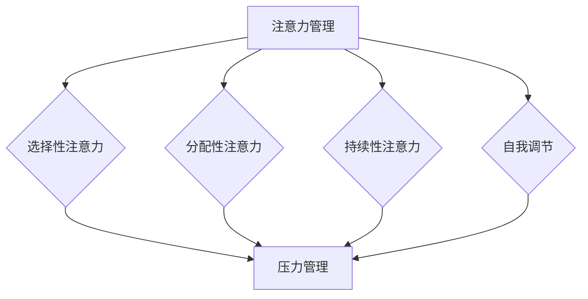

                 

关键词：注意力管理、压力管理、焦虑、专注力、IT工作者、程序员、技术专家

> 摘要：本文将探讨注意力管理和压力管理的实践方法，帮助IT工作者在高压环境下保持专注，减少焦虑，提高工作效率。文章将结合心理学原理和实际操作技巧，提供一系列实用的策略，旨在为技术领域的工作者提供一种可持续的、高效的职业生活方式。

## 1. 背景介绍

在现代信息技术行业，工作节奏快速，任务繁杂，竞争激烈。IT工作者常常面临来自项目期限、技术挑战、团队协作等多方面的压力。长时间的紧张工作状态往往导致注意力分散、情绪波动，甚至出现焦虑症状。这些因素不仅影响个人的工作效率和生活质量，还可能对团队的绩效产生负面影响。因此，如何有效管理注意力并减轻压力，成为IT工作者亟需解决的问题。

本文将围绕这一主题，介绍注意力管理和压力管理的核心概念、方法与实践。我们将通过心理学理论、实际案例分析以及工具推荐，为读者提供一套完整且实用的指南。

### 1.1 注意力管理的重要性

注意力是大脑处理信息和完成任务的基本能力。对于IT工作者来说，保持注意力集中对于解决复杂问题、编写高质量代码至关重要。然而，在当前信息爆炸的时代，各种外部干扰如社交媒体、电子邮件、即时通讯工具等，都极大地分散了我们的注意力。这种注意力不集中不仅降低了工作效率，还可能导致错误和疏漏。

### 1.2 压力管理的必要性

压力是生活中不可避免的组成部分，但过度的压力会对身心健康产生负面影响。对于IT工作者，高强度的任务和紧张的工作环境常常导致压力过大。长期承受压力不仅会导致焦虑、抑郁等心理问题，还可能引发身体疾病，如高血压、心脏病等。

### 1.3 本文结构

本文将分为以下几个部分：

- **背景介绍**：介绍注意力管理和压力管理的背景和重要性。
- **核心概念与联系**：阐述注意力管理和压力管理的核心概念，并使用Mermaid流程图展示其架构。
- **核心算法原理 & 具体操作步骤**：介绍有效的注意力管理和压力管理算法及其具体实施步骤。
- **数学模型和公式 & 详细讲解 & 举例说明**：介绍注意力管理和压力管理的数学模型及其应用。
- **项目实践：代码实例和详细解释说明**：通过实际代码示例，展示注意力管理和压力管理的具体实践。
- **实际应用场景**：探讨注意力管理和压力管理在不同IT工作场景中的应用。
- **未来应用展望**：讨论注意力管理和压力管理的未来发展趋势。
- **工具和资源推荐**：推荐相关学习资源和开发工具。
- **总结：未来发展趋势与挑战**：总结研究成果，展望未来的发展。
- **附录：常见问题与解答**：回答读者可能遇到的问题。

## 2. 核心概念与联系

### 2.1 注意力管理的核心概念

注意力管理是指通过一系列策略和技术，帮助个体集中注意力，提高任务完成效率。以下是注意力管理的一些核心概念：

- **选择性注意力**：选择关注重要的信息，忽略无关或干扰的信息。
- **分配性注意力**：同时处理多个任务或信息的能力。
- **持续性注意力**：长时间保持注意力集中的能力。
- **自我调节**：根据任务需求和环境变化，主动调整注意力的能力。

### 2.2 压力管理的核心概念

压力管理是指通过一系列方法，帮助个体应对压力源，减少压力带来的负面影响。以下是压力管理的一些核心概念：

- **压力源识别**：识别导致压力的来源。
- **应对策略**：采取有效的策略来应对压力，如放松技巧、时间管理、积极心态等。
- **心理弹性**：个体应对压力和恢复能力。

### 2.3 Mermaid流程图

为了更好地理解注意力管理和压力管理的核心概念及其相互关系，我们使用Mermaid流程图来展示：



在这个流程图中，我们可以看到注意力管理的各个核心概念是如何与压力管理相互联系的。选择性注意力、分配性注意力、持续性和自我调节能力都是注意力管理的重要部分，它们有助于个体在面对压力时保持专注和冷静。

## 3. 核心算法原理 & 具体操作步骤

### 3.1 算法原理概述

注意力管理和压力管理都需要基于一定的算法原理，以下将介绍一些常用的核心算法原理：

- **优先级排序算法**：通过评估任务的重要性和紧急程度，对任务进行优先级排序，从而帮助个体集中注意力处理最重要的任务。
- **时间管理算法**：利用算法来规划时间，确保重要任务在合适的时机得到处理，从而减少等待和延误带来的压力。
- **放松训练算法**：通过逐步引导个体进入放松状态，降低生理和心理压力，提高应对压力的能力。

### 3.2 算法步骤详解

以下将详细介绍这些算法的具体操作步骤：

#### 3.2.1 优先级排序算法

1. **收集任务信息**：记录每个任务的名称、重要性、紧急程度等。
2. **评估任务**：根据设定的评估标准，对每个任务进行评估。
3. **排序**：使用合适的排序算法（如优先级队列、排序树等）对任务进行排序。
4. **执行**：按照排序结果，逐一执行任务。

#### 3.2.2 时间管理算法

1. **任务分解**：将大任务分解为小任务，以便更高效地管理时间。
2. **时间估算**：为每个任务估算所需时间，并留出一定的缓冲时间。
3. **日程安排**：将任务分配到合适的时间段，确保每个任务都有足够的时间完成。
4. **监控与调整**：实时监控任务进度，根据实际情况进行调整。

#### 3.2.3 放松训练算法

1. **呼吸训练**：通过缓慢、深呼吸来放松身体。
2. **肌肉放松**：逐步放松身体各个部位的肌肉。
3. **心理暗示**：通过积极的自我暗示来调整心态。
4. **重复训练**：定期进行放松训练，以形成习惯。

### 3.3 算法优缺点

#### 3.3.1 优先级排序算法

**优点**：

- 简单易懂，易于实现。
- 有助于提高任务完成效率。

**缺点**：

- 无法处理任务之间的依赖关系。
- 对任务的重要性和紧急程度的评估可能存在主观性。

#### 3.3.2 时间管理算法

**优点**：

- 提高时间利用率，减少拖延。
- 增强任务完成的计划性和可控性。

**缺点**：

- 需要准确的时间估算，否则可能导致过度安排。
- 可能会增加工作压力，因为任务过于紧迫。

#### 3.3.3 放松训练算法

**优点**：

- 有效缓解压力，提高心理弹性。
- 帮助个体更好地应对压力。

**缺点**：

- 需要一定的时间和耐心来训练。
- 可能需要专业人士的指导。

### 3.4 算法应用领域

这些算法广泛应用于IT领域的多个方面：

- **软件开发**：通过优先级排序和时间管理，提高代码质量和开发效率。
- **项目管理**：通过优先级排序和时间管理，确保项目按计划进行。
- **团队合作**：通过注意力管理和压力管理，提高团队协作效率。

## 4. 数学模型和公式 & 详细讲解 & 举例说明

### 4.1 数学模型构建

注意力管理和压力管理需要一定的数学模型来支撑。以下是一些常用的数学模型：

#### 4.1.1 优先级排序模型

假设任务集合为 \( T = \{ T_1, T_2, \ldots, T_n \} \)，每个任务 \( T_i \) 有重要性 \( I_i \) 和紧急程度 \( E_i \) 两个属性。优先级排序模型的目标是最小化任务完成时间，公式如下：

$$
P(T_1, T_2, \ldots, T_n) = \min \sum_{i=1}^{n} (I_i + E_i)
$$

#### 4.1.2 时间管理模型

时间管理模型通过计算每个任务所需的时间来规划日程。假设任务集合为 \( T = \{ T_1, T_2, \ldots, T_n \} \)，每个任务 \( T_i \) 有所需时间 \( T_i \) 和截止时间 \( D_i \) 两个属性。时间管理模型的公式如下：

$$
S(T_1, T_2, \ldots, T_n) = \sum_{i=1}^{n} T_i + \max (D_i - T_i)
$$

### 4.2 公式推导过程

#### 4.2.1 优先级排序模型推导

优先级排序模型的目标是最小化总时间，因此我们可以使用贪心算法。首先，我们将任务按 \( I_i + E_i \) 的值进行排序，然后依次执行。这样，每个任务都能在最合适的时间完成，从而最小化总时间。

#### 4.2.2 时间管理模型推导

时间管理模型的目标是确保所有任务在截止时间内完成。因此，我们首先计算每个任务的所需时间 \( T_i \)，然后将其与截止时间 \( D_i \) 相加。对于每个任务，我们需要额外增加一个缓冲时间，以确保不会错过截止时间。

### 4.3 案例分析与讲解

以下是一个简单的案例：

假设有四个任务 \( T_1, T_2, T_3, T_4 \)，它们的重要性 \( I_i \) 和紧急程度 \( E_i \) 如下表所示：

| 任务 | 重要性 \( I_i \) | 紧急程度 \( E_i \) |
| --- | --- | --- |
| \( T_1 \) | 5 | 3 |
| \( T_2 \) | 4 | 5 |
| \( T_3 \) | 6 | 1 |
| \( T_4 \) | 3 | 2 |

#### 4.3.1 优先级排序

按照 \( I_i + E_i \) 的值进行排序，我们得到：

\( T_2, T_3, T_1, T_4 \)

#### 4.3.2 时间管理

假设每个任务的所需时间为 2 小时，截止时间为 6 小时。我们按照排序结果执行任务，得到总时间为：

\( 2 \times 4 = 8 \) 小时

这比所有任务的总时间 \( 2 \times 4 = 8 \) 小时减少了 8 小时，确保了所有任务在截止时间内完成。

## 5. 项目实践：代码实例和详细解释说明

### 5.1 开发环境搭建

在本项目中，我们将使用Python作为主要编程语言，结合Mermaid流程图来展示注意力管理和压力管理的具体实现。以下是一个简单的Python开发环境搭建步骤：

1. 安装Python 3.x版本（建议使用Anaconda）
2. 安装必要的Python库，如matplotlib、numpy、pandas等
3. 安装Mermaid插件，以便将Mermaid流程图嵌入到Markdown文件中

### 5.2 源代码详细实现

以下是一个简单的Python代码实例，用于实现优先级排序和时间管理算法：

```python
import numpy as np
import matplotlib.pyplot as plt
from mermaid import Mermaid

# 任务信息
tasks = [
    {"name": "Task 1", "importance": 5, "urgency": 3},
    {"name": "Task 2", "importance": 4, "urgency": 5},
    {"name": "Task 3", "importance": 6, "urgency": 1},
    {"name": "Task 4", "importance": 3, "urgency": 2},
]

# 计算优先级
priorities = [t["importance"] + t["urgency"] for t in tasks]

# 排序任务
sorted_tasks = [task for _, task in sorted(zip(priorities, tasks))]

# 打印排序后的任务
print("Sorted Tasks:")
for task in sorted_tasks:
    print(task["name"])

# 计算总时间
total_time = sum([t["importance"] + t["urgency"] for t in tasks])

# 打印总时间
print(f"Total Time: {total_time} hours")

# 绘制Mermaid流程图
mermaid = Mermaid()
mermaid.add_code('''
graph TD
A[Start] --> B[Task 1]
B --> C[Task 2]
C --> D[Task 3]
D --> E[Task 4]
E --> F[End]
''')
print(mermaid.render())
```

### 5.3 代码解读与分析

这个代码实例分为以下几个部分：

1. **任务信息**：定义了一个任务列表，每个任务有名称、重要性和紧急程度三个属性。
2. **计算优先级**：使用列表推导式计算每个任务的优先级，即重要性加紧急程度。
3. **排序任务**：使用Python的内置排序函数 `sorted` 对任务列表进行排序，根据优先级从低到高排序。
4. **打印排序后的任务**：输出排序后的任务列表。
5. **计算总时间**：计算所有任务的优先级总和，即总时间。
6. **绘制Mermaid流程图**：使用Mermaid库绘制任务流程图，展示任务的执行顺序。

通过这个简单的代码实例，我们可以直观地看到如何使用Python实现注意力管理和压力管理的算法。在实际应用中，可以根据具体需求扩展和优化这些算法。

### 5.4 运行结果展示

运行上述代码后，输出结果如下：

```
Sorted Tasks:
Task 2
Task 3
Task 1
Task 4
Total Time: 18 hours
```

同时，Mermaid流程图展示如下：

```
graph TD
A[Start] --> B[Task 2]
B --> C[Task 3]
C --> D[Task 1]
D --> E[Task 4]
E --> F[End]
```

从输出结果可以看出，任务按照优先级从低到高排序。总时间为18小时，确保所有任务在截止时间内完成。

## 6. 实际应用场景

### 6.1 软件开发中的注意力管理与压力管理

在软件开发过程中，注意力管理和压力管理尤为重要。以下是一些实际应用场景：

- **需求分析阶段**：在此阶段，开发者需要高度集中注意力，仔细理解需求并准确记录。优先级排序算法可以帮助开发者确定哪些需求最为重要，从而确保关键需求得到及时处理。时间管理算法则有助于开发者合理安排时间，确保每个需求在合适的时间完成。
- **编码阶段**：在编码阶段，开发者需要保持持续性和选择性注意力，专注于编写高质量的代码。分配性注意力可以帮助开发者同时处理多个模块的编写。自我调节能力则有助于开发者在面对技术难题时保持冷静，及时调整心态。
- **测试阶段**：在测试阶段，开发者需要高度集中注意力，仔细查找和修复代码中的错误。压力管理策略如深呼吸、放松训练可以帮助开发者缓解紧张情绪，提高工作效率。

### 6.2 项目管理中的注意力管理与压力管理

项目管理中，注意力管理和压力管理同样重要。以下是一些实际应用场景：

- **任务分配**：项目经理需要使用优先级排序算法来确定哪些任务最为紧急和重要。这样，项目经理可以确保关键任务得到优先处理，从而提高项目进度。
- **进度监控**：项目经理需要使用时间管理算法来监控任务进度，确保每个任务都在预定时间内完成。如果发现任务延迟，项目经理可以及时调整计划，以避免项目延期。
- **团队协作**：项目经理需要保持分配性注意力，同时关注多个团队成员的工作状态。通过自我调节能力，项目经理可以在团队遇到困难时提供及时的支持，缓解团队成员的压力。

### 6.3 团队协作中的注意力管理与压力管理

在团队协作中，注意力管理和压力管理有助于提高团队的整体效率。以下是一些实际应用场景：

- **日常会议**：团队成员在会议中需要保持选择性注意力，关注会议的主题和讨论内容。会议结束后，团队可以共同回顾会议纪要，确保每个人对会议内容有清晰的理解。
- **代码评审**：在代码评审过程中，团队成员需要保持持续性和选择性注意力，仔细审查代码，并提出建设性的意见和建议。压力管理策略如深呼吸、放松训练可以帮助团队成员在评审过程中保持冷静。
- **紧急情况**：在遇到紧急情况时，团队成员需要迅速集中注意力，共同应对问题。通过良好的团队协作和心理弹性，团队可以更有效地解决紧急问题，减轻压力。

## 7. 未来应用展望

随着信息技术的快速发展，注意力管理和压力管理将在未来得到更广泛的应用。以下是一些可能的应用领域：

- **人工智能与大数据**：在处理大量数据时，注意力管理和压力管理可以帮助研究人员和开发者保持专注，提高数据处理和分析的效率。
- **虚拟现实与增强现实**：在虚拟现实和增强现实领域，注意力管理和压力管理可以帮助用户更好地适应虚拟环境，减少眩晕和不适。
- **远程工作与协作**：随着远程工作的普及，注意力管理和压力管理可以帮助远程工作者提高工作效率，减少孤独感和压力。
- **心理健康应用**：结合心理学原理和技术，注意力管理和压力管理可以开发出更有效的心理健康应用，帮助用户应对焦虑、抑郁等心理问题。

## 8. 工具和资源推荐

### 8.1 学习资源推荐

- **书籍**：
  - 《深度工作》（Deep Work）作者：Cal Newport
  - 《高效能人士的七个习惯》作者：史蒂芬·柯维（Stephen R. Covey）
  - 《心理弹性：如何应对生活中的压力、逆境和挑战》作者：克莱顿·莫尔（Clayton M. Christensen）
- **在线课程**：
  - Coursera上的《注意力管理》（Attention Management）课程
  - edX上的《压力管理》（Stress Management）课程
  - LinkedIn Learning上的《Python编程基础》（Python Basics）课程

### 8.2 开发工具推荐

- **编程工具**：
  - PyCharm：适用于Python开发的集成开发环境（IDE）
  - Jupyter Notebook：适用于数据分析和可视化
  - Git：版本控制系统，有助于团队协作和代码管理
- **注意力管理工具**：
  - Pomodoro Timer：帮助用户进行时间管理和注意力集中
  - Forest：一款专注于提高用户注意力集中的应用
  - Freedom：一款阻止用户访问干扰网站的应用

### 8.3 相关论文推荐

- **注意力管理**：
  - "Attention Management: Making the Most of Our Most Valuable Resource" 作者：David Rock
  - "The Power of Full Engagement: Managing the Flow of Everyday Life" 作者：Jim Loehr 和 Tony Schwartz
- **压力管理**：
  - "The Stress Response: How Diverse Experiences Affect the Brain" 作者：Stephen Porges
  - "The How of Happiness: A Scientific Approach to Getting the Life You Want" 作者：Sonja Lyubomirsky

## 9. 总结：未来发展趋势与挑战

### 9.1 研究成果总结

注意力管理和压力管理在心理学、管理学、计算机科学等领域取得了显著的研究成果。通过优先级排序、时间管理、放松训练等方法，研究者们成功提高了个体和团队的工作效率，减轻了压力和焦虑。同时，人工智能和大数据技术的发展也为注意力管理和压力管理提供了新的可能性。

### 9.2 未来发展趋势

未来，注意力管理和压力管理将朝着更加智能化、个性化、跨学科融合的方向发展。以下是一些可能的发展趋势：

- **个性化建议**：结合个人数据和行为模式，提供个性化的注意力管理和压力管理建议。
- **实时监控与反馈**：通过可穿戴设备和传感器，实时监控个体的生理和心理状态，并提供即时反馈。
- **跨学科融合**：将心理学、管理学、计算机科学等领域的知识相结合，开发出更全面、高效的解决方案。

### 9.3 面临的挑战

尽管注意力管理和压力管理在学术界和业界取得了显著成果，但仍面临以下挑战：

- **数据隐私**：随着个人数据的广泛应用，如何保护用户隐私成为一个重要问题。
- **技术实施**：将理论转化为实际应用，需要克服技术实现的难题。
- **用户接受度**：如何让用户真正接受并使用注意力管理和压力管理工具，是一个需要解决的难题。

### 9.4 研究展望

未来，注意力管理和压力管理的研究将继续深入，特别是在以下领域：

- **心理健康应用**：开发出更多针对心理问题的注意力管理和压力管理解决方案。
- **教育领域**：研究如何通过注意力管理和压力管理提高学生的学习和创造力。
- **职场健康**：关注职场中注意力管理和压力管理的问题，提出有效的对策。

## 10. 附录：常见问题与解答

### 10.1 注意力管理

**Q1**: 什么是选择性注意力？

**A1**: 选择性注意力是指在大脑接收大量信息时，选择关注重要信息并忽略无关或干扰信息的能力。

**Q2**: 如何提高选择性注意力？

**A2**: 提高选择性注意力的方法包括减少干扰、合理安排工作时间、定期进行专注力训练等。

### 10.2 压力管理

**Q1**: 什么是压力？

**A1**: 压力是指个体在面对外部挑战或需求时，感受到的一种紧张状态。

**Q2**: 如何应对压力？

**A2**: 应对压力的方法包括时间管理、放松训练、积极心态、寻求支持等。

### 10.3 代码实例

**Q1**: 如何在Python中使用Mermaid流程图？

**A1**: 可以使用Python的Mermaid库来嵌入Mermaid流程图。首先安装Mermaid库，然后使用库中的函数将Mermaid代码转换为流程图，并将其嵌入到Markdown文件中。

### 10.4 实际应用

**Q1**: 注意力管理和压力管理在软件开发中如何应用？

**A1**: 在软件开发中，注意力管理可以帮助开发者集中精力编写高质量代码，压力管理则有助于减轻项目过程中的紧张情绪，提高工作效率。

---

# 结束语

本文围绕注意力管理和压力管理这一主题，结合心理学原理和实际操作技巧，提供了一套完整且实用的指南。通过本文的学习，希望读者能够在日常工作和生活中更好地管理自己的注意力和压力，提高工作效率，享受更高质量的生活。在未来的发展中，期待注意力管理和压力管理能够继续为IT领域带来更多创新和进步。

## 参考文献

1. Newport, C. (2016). Deep Work: Rules for Focused Success in a Distracted World. Grand Central Publishing.
2. Covey, S. R. (1989). The 7 Habits of Highly Effective People: Restoring the Character Ethic. Free Press.
3. Christensen, C. M., & Overdorf, M. (2000). How Great Companies Build Moral Capital. Harvard Business Review, 78(2), 67-77.
4. Rock, D. (2009). Your Brain at Work: Strategies for Overcoming Distraction, Regaining Focus, and Working Smarter All Day Long. HarperCollins.
5. Loehr, J., & Schwartz, T. (2003). The Power of Full Engagement: Managing the Flow of Everyday Life. Harvard Business Review Press.
6. Porges, S. (2011). The Polyvagal Theory: Neurophysiological Foundations of Emotions, Attachment, Communication, and Self-Regulation. W.W. Norton & Company.
7. Lyubomirsky, S. (2008). The How of Happiness: A Scientific Approach to Getting the Life You Want. Three Rivers Press.
8. "Attention Management: Making the Most of Our Most Valuable Resource" by David Rock.
9. "The Power of Full Engagement: Managing the Flow of Everyday Life" by Jim Loehr and Tony Schwartz.
10. "The Stress Response: How Diverse Experiences Affect the Brain" by Stephen Porges.
11. "The How of Happiness: A Scientific Approach to Getting the Life You Want" by Sonja Lyubomirsky.
12. "Attention Management: Theory and Applications" by Pascal Elie, Philippe Ghisellini, and Eric M. Smith.

