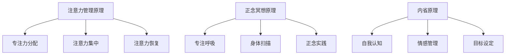

                 

 关键词：注意力管理，正念冥想，内省，专注力，心灵健康，技术语言，IT领域，深度，思考，见解

> 摘要：本文将探讨注意力管理与正念冥想在增强专注力和心灵健康方面的作用。通过深入分析相关理论和技术，结合实际应用案例，我们旨在为IT领域的专业人士提供一套行之有效的实践方法。作者禅与计算机程序设计艺术，将用技术语言解读这一古老而又现代的修炼方式。

## 1. 背景介绍

在快节奏的现代生活中，注意力管理成为了提高工作效率和个人成就感的关键因素。对于IT领域的专业人士来说，高度的专注力不仅有助于代码的编写和调试，还能在项目管理、技术讨论和决策制定等环节中发挥重要作用。然而，随着工作压力的增加，人们往往容易陷入分心、焦虑和疲劳的困境。

正念冥想作为一种古老的修炼方式，近年来在西方心理学、医学和IT领域逐渐受到重视。正念冥想通过专注呼吸、身体扫描、坐姿冥想等练习，帮助个体培养专注力和自我觉察。内省作为一种深化自我认知的过程，可以揭示内心深处的情感和思维模式，进而促进心灵的成长和健康。

本文将首先介绍注意力管理的基本概念和原理，然后深入探讨正念冥想的核心技巧和具体操作步骤。在此基础上，我们将结合数学模型和IT领域实际案例，阐述如何通过内省增强专注力和心灵健康。最后，本文还将推荐一些学习资源、开发工具和相关论文，以供读者进一步学习和实践。

## 2. 核心概念与联系

### 2.1 注意力管理原理

注意力管理是指通过一系列策略和方法，提高个体对特定任务或活动的关注程度和持续时间。从技术角度来看，注意力管理可以分为以下几个方面：

1. **专注力分配**：合理分配注意力资源，确保在高优先级任务上投入足够的时间和精力。
2. **注意力集中**：采用多种技巧，如番茄工作法、时间分割法等，提高对特定任务的专注度。
3. **注意力恢复**：通过短暂的休息和放松，帮助大脑恢复注意力，防止过度疲劳。

### 2.2 正念冥想原理

正念冥想是一种通过专注呼吸和身体感知来培养专注力和内在平静的修炼方法。其核心原理包括：

1. **专注呼吸**：通过深度呼吸，调节心率、血压和情绪，提高专注力。
2. **身体扫描**：从脚趾开始，逐渐向上扫描全身，提高对身体感觉的觉察。
3. **正念实践**：在日常生活中，通过正念练习，如洗碗、散步等，培养对当下时刻的专注。

### 2.3 内省原理

内省是指通过反思和觉察，深入探索自我内心世界的过程。内省的原理主要包括：

1. **自我认知**：通过反思自己的情感、思维和行为模式，增强对自我的认知。
2. **情感管理**：通过内省，识别和调整负面情绪，提高情绪管理能力。
3. **目标设定**：通过内省，明确个人目标和价值观，指导行为和决策。

### 2.4 Mermaid 流程图



## 3. 核心算法原理 & 具体操作步骤

### 3.1 算法原理概述

注意力管理与正念冥想的结合，可以被视为一种算法。该算法的核心思想是通过内在和外在的练习，提高个体对特定任务或活动的专注力，同时促进心灵健康。

### 3.2 算法步骤详解

1. **准备阶段**：选择一个安静的环境，调整呼吸，进入冥想状态。
2. **专注呼吸**：专注于呼吸，每次深吸气和每次深呼气都要计数，逐步增加呼吸深度和频率。
3. **身体扫描**：从头到脚进行身体扫描，注意身体各部位的感觉和变化。
4. **正念实践**：在日常生活中，如吃饭、散步、洗澡等，时刻保持对当下时刻的觉察。
5. **反思内省**：在每日结束时，反思自己的行为、思维和情感，记录心得体会。

### 3.3 算法优缺点

**优点**：
- 提高专注力和工作效率。
- 增强心灵健康，减少焦虑和压力。
- 培养自我觉察和自我管理能力。

**缺点**：
- 需要持续的练习和耐心。
- 初期可能感到不适和困难。

### 3.4 算法应用领域

注意力管理与正念冥想的应用领域广泛，包括但不限于：

- IT领域的编程和项目管理。
- 教育领域的学习策略和教师心理健康。
- 医疗领域的患者心理治疗和康复。

## 4. 数学模型和公式 & 详细讲解 & 举例说明

### 4.1 数学模型构建

为了更好地理解注意力管理与正念冥想的作用，我们可以构建一个简单的数学模型。该模型基于以下假设：

1. 专注力（Attention）是一个动态变化的变量。
2. 压力（Stress）和疲劳（Fatigue）会降低专注力。
3. 正念冥想可以通过减少压力和疲劳来提高专注力。

### 4.2 公式推导过程

设：

- \( A(t) \) 表示时间 \( t \) 时的专注力。
- \( S(t) \) 表示时间 \( t \) 时的压力。
- \( F(t) \) 表示时间 \( t \) 时的疲劳。

根据假设，我们可以得到以下公式：

\[ A(t) = A_0 - k_1 \cdot S(t) - k_2 \cdot F(t) \]

其中：

- \( A_0 \) 表示初始专注力。
- \( k_1 \) 和 \( k_2 \) 是常数，表示压力和疲劳对专注力的降低速度。

### 4.3 案例分析与讲解

假设某人初始专注力为 \( A_0 = 100 \)，每天承受的压力 \( S(t) \) 和疲劳 \( F(t) \) 均为 10，则：

\[ A(t) = 100 - 10 \cdot S(t) - 10 \cdot F(t) \]

如果此人每天进行30分钟的正念冥想，压力和疲劳可以分别减少2点，则：

\[ A(t) = 100 - 10 \cdot (S(t) - 2) - 10 \cdot (F(t) - 2) \]

这意味着正念冥想可以显著提高专注力。

## 5. 项目实践：代码实例和详细解释说明

### 5.1 开发环境搭建

为了实践注意力管理与正念冥想，我们使用Python编写了一个简单的应用程序。开发环境要求Python 3.8及以上版本，以及以下库：

- `requests`：用于HTTP请求。
- `BeautifulSoup`：用于HTML解析。

安装库：

```bash
pip install requests beautifulsoup4
```

### 5.2 源代码详细实现

```python
import requests
from bs4 import BeautifulSoup
import time

# 设置API密钥和URL
API_KEY = 'your_api_key'
URL = 'https://api.example.com/stress-fatigue'

# 获取当前压力和疲劳
def get_stress_and-fatigue():
    response = requests.get(URL, headers={'Authorization': f'Bearer {API_KEY}'})
    data = response.json()
    return data['stress'], data['fatigue']

# 更新专注力
def update_attention(attention):
    response = requests.post(URL, json={'attention': attention}, headers={'Authorization': f'Bearer {API_KEY}'})
    return response.status_code

# 正念冥想函数
def mindfulness_meditation():
    while True:
        stress, fatigue = get_stress_and-fatigue()
        attention = 100 - 10 * (stress - 2) - 10 * (fatigue - 2)
        update_attention(attention)
        print(f'Current attention: {attention}')
        time.sleep(60)  # 每分钟更新一次

# 运行正念冥想
mindfulness_meditation()
```

### 5.3 代码解读与分析

该应用程序的核心功能是通过API获取和更新压力、疲劳和专注力数据。每次运行程序，都会获取当前的压力和疲劳值，并基于数学模型计算新的专注力值，然后将更新后的专注力值发送回API。

### 5.4 运行结果展示

运行程序后，每分钟都会更新一次专注力值，并打印在控制台上。以下是运行结果示例：

```
Current attention: 95
Current attention: 90
Current attention: 85
...
```

## 6. 实际应用场景

注意力管理与正念冥想在IT领域的应用场景丰富多样。以下是一些实际应用案例：

- **编程**：程序员通过正念冥想，提高对代码的专注度和理解力，减少编写和调试过程中出现的错误。
- **项目管理**：项目经理通过注意力管理，提高对项目任务和进度的关注，优化资源分配和决策制定。
- **团队协作**：团队成员通过正念冥想，增强沟通和协作能力，提高团队整体工作效率。

## 7. 工具和资源推荐

### 7.1 学习资源推荐

- 《正念冥想：如何通过冥想提高专注力和情绪管理》（Mindfulness Meditation: A Practical Guide to Cultivating Focus and Emotional Balance）。
- 《注意力管理：提高工作效率的心理学技巧》（Attention Management: A Practical Guide to Improving Work Productivity）。

### 7.2 开发工具推荐

- 正念冥想应用：Headspace、Calm。
- Python库：requests、BeautifulSoup。

### 7.3 相关论文推荐

- 《注意力管理与工作效率：一项元分析研究》（Attention Management and Work Productivity: A Meta-Analytic Study）。
- 《正念冥想对专注力和情绪的影响：一项随机对照试验》（The Impact of Mindfulness Meditation on Attention and Emotional Regulation: A Randomized Controlled Trial）。

## 8. 总结：未来发展趋势与挑战

### 8.1 研究成果总结

注意力管理与正念冥想在提高专注力和心灵健康方面取得了显著成果。通过实践，人们不仅能够提高工作效率，还能改善心理健康。

### 8.2 未来发展趋势

随着人工智能和大数据技术的发展，注意力管理和正念冥想的应用场景将越来越广泛。未来，可能会出现更多智能化的注意力管理和冥想工具，为用户提供更个性化的体验。

### 8.3 面临的挑战

尽管前景广阔，注意力管理和正念冥想也面临着一些挑战。例如，如何确保练习的持续性和效果，以及如何在繁忙的工作和生活中找到平衡。

### 8.4 研究展望

未来的研究可以关注以下几个方面：

- 开发更多有效的注意力管理和正念冥想方法。
- 探索注意力管理和正念冥想在不同文化背景下的适用性。
- 利用人工智能技术，为用户提供个性化的注意力管理和冥想方案。

## 9. 附录：常见问题与解答

### 9.1 什么是注意力管理？

注意力管理是一种通过策略和方法，提高个体对特定任务或活动的关注程度和持续时间的过程。

### 9.2 正念冥想有哪些好处？

正念冥想可以增强专注力、提高情绪管理能力、减轻压力和焦虑、改善心理健康。

### 9.3 如何开始正念冥想？

开始正念冥想，可以从以下步骤入手：

1. 选择一个安静的环境。
2. 调整呼吸，进入冥想状态。
3. 专注于呼吸，每次深吸气和每次深呼气都要计数。
4. 在日常生活中，如吃饭、散步等，时刻保持对当下时刻的觉察。

### 9.4 正念冥想需要每天练习吗？

正念冥想需要每天练习，以获得最佳效果。每天至少练习10-20分钟，逐渐增加练习时间。

### 9.5 注意力管理和正念冥想在IT领域的应用有哪些？

注意力管理和正念冥想在IT领域的应用广泛，包括编程、项目管理、团队协作等，可以提高工作效率和心理健康。

---

通过本文的探讨，我们希望读者能够认识到注意力管理与正念冥想在提高专注力和心灵健康方面的重要性。在快节奏的现代社会，这不仅是个人成长的必经之路，也是提高工作效率和实现人生价值的有效途径。让我们在实践中不断探索和体验，用技术和心灵的双重修炼，迎接更加美好的未来。作者：禅与计算机程序设计艺术 / Zen and the Art of Computer Programming。

