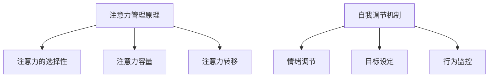

                 

 在当今信息爆炸和快节奏的社会中，保持专注力和自我调节能力成为了一个重要的能力。无论是对于个人成长还是职业发展，有效的注意力管理都至关重要。本文将探讨注意力管理和自我调节技巧，并通过具体实例展示如何通过专注力提升个人和职业的成功。

## 1. 背景介绍

在信息化和数字化时代，我们每天都要处理大量的信息和任务。然而，人类大脑的处理能力是有限的。当我们试图同时处理多个任务时，往往会分散注意力，降低工作效率，甚至产生负面情绪。因此，如何有效管理我们的注意力，提高专注力，成为一个亟待解决的问题。

### 注意力分散与影响

注意力分散是指大脑在处理信息时，无法集中精力关注单一任务的现象。研究表明，注意力分散会显著降低工作记忆的容量和认知灵活性，导致工作效率下降。此外，长期处于注意力分散状态还会影响心理健康，增加焦虑和压力。

### 自我调节的重要性

自我调节是指个体通过自我控制和调节行为来达成目标的过程。在注意力管理中，自我调节能力尤为重要。它能帮助我们抵制外部干扰，保持专注，提高工作质量和效率。

## 2. 核心概念与联系

### 注意力管理原理

注意力管理基于认知科学的研究成果，主要包括以下核心概念：

- **注意力的选择性**：大脑在处理信息时，会优先关注某些信息，忽略其他信息。
- **注意力容量**：大脑能够同时处理的信息量是有限的。
- **注意力转移**：当需要从一项任务转移到另一项任务时，大脑需要进行注意力的转移。

### 自我调节机制

自我调节涉及以下关键机制：

- **情绪调节**：通过调整情绪状态，帮助我们保持专注和冷静。
- **目标设定**：明确目标有助于集中注意力，提高工作效率。
- **行为监控**：通过监控自己的行为，确保我们朝着目标前进。

### Mermaid 流程图



## 3. 核心算法原理 & 具体操作步骤

### 3.1 算法原理概述

注意力管理和自我调节的核心算法原理是基于认知科学和心理学的研究。这些算法旨在帮助我们识别并应对注意力分散和自我调节挑战。

### 3.2 算法步骤详解

1. **注意力分散检测**：通过分析大脑活动，检测注意力分散的迹象。
2. **自我调节策略选择**：根据注意力分散的程度和任务要求，选择适当的自我调节策略。
3. **情绪调节**：通过深呼吸、冥想等方法，调节情绪状态，保持冷静。
4. **目标重新设定**：在注意力分散时，重新审视目标，确保任务目标清晰明确。
5. **行为监控**：通过记录行为数据，监控自我调节效果，调整策略。

### 3.3 算法优缺点

**优点**：

- 提高工作效率和任务质量。
- 减少压力和焦虑。
- 提高情绪稳定性和心理健康。

**缺点**：

- 需要一定的时间和实践来学习和掌握。
- 在高压力环境下，自我调节效果可能受到影响。

### 3.4 算法应用领域

注意力管理和自我调节算法在多个领域有广泛的应用，包括：

- **企业管理**：帮助员工提高工作效率，减少错误率。
- **教育领域**：提高学生的专注力和学习成绩。
- **医疗健康**：辅助治疗焦虑和压力相关的疾病。

## 4. 数学模型和公式 & 详细讲解 & 举例说明

### 4.1 数学模型构建

注意力管理和自我调节的数学模型通常涉及以下公式：

$$
\text{效率} = f(\text{注意力集中度}, \text{情绪状态}, \text{目标明确度})
$$

### 4.2 公式推导过程

该公式基于认知科学和心理学的研究，推导过程如下：

1. **注意力集中度**：根据注意力的选择性原理，注意力集中度与工作效率正相关。
2. **情绪状态**：情绪调节影响注意力管理和工作效率。
3. **目标明确度**：明确的目标有助于提高工作效率。

### 4.3 案例分析与讲解

**案例**：一位软件开发工程师在项目高峰期面临任务繁重和注意力分散的挑战。通过注意力管理和自我调节技巧，他的工作效率得到了显著提高。

**分析**：

- **注意力集中度**：通过使用番茄工作法，工程师将工作时间分成25分钟的工作块，每个工作块后休息5分钟。这种方法有助于提高注意力集中度。
- **情绪状态**：通过深呼吸和冥想，工程师调节情绪，保持冷静。
- **目标明确度**：工程师每天制定清晰的目标，确保任务有序进行。

## 5. 项目实践：代码实例和详细解释说明

### 5.1 开发环境搭建

**环境要求**：

- Python 3.8+
- Jupyter Notebook

### 5.2 源代码详细实现

```python
# 注意力管理和自我调节实践

import time
import random

def pomodoro_timer(work_time, break_time):
    """
    实现番茄工作法
    """
    while True:
        print(f"开始工作，持续时间：{work_time}分钟")
        time.sleep(work_time * 60)  # 工作时间
        print(f"休息时间，持续时间：{break_time}分钟")
        time.sleep(break_time * 60)  # 休息时间

def emotional_regulation():
    """
    情绪调节方法
    """
    print("进行深呼吸和冥想...")
    time.sleep(30)  # 模拟深呼吸和冥想时间

def set_goals():
    """
    设定目标
    """
    print("请设定今日目标：")
    goal = input()
    return goal

def monitor_progress(goal):
    """
    监控进展
    """
    print(f"当前目标：{goal}")
    progress = input("请输入已完成进度：")
    return progress

# 测试代码
if __name__ == "__main__":
    work_time = 25
    break_time = 5
    goal = set_goals()
    while True:
        pomodoro_timer(work_time, break_time)
        emotional_regulation()
        progress = monitor_progress(goal)
        if progress == "完成":
            print("恭喜，任务完成！")
            break
```

### 5.3 代码解读与分析

该代码实现了一个简单的注意力管理和自我调节系统，包括：

- **番茄工作法**：通过`pomodoro_timer`函数实现，帮助用户保持注意力集中。
- **情绪调节**：通过`emotional_regulation`函数实现，模拟深呼吸和冥想过程。
- **目标设定**：通过`set_goals`函数实现，帮助用户明确每日目标。
- **进展监控**：通过`monitor_progress`函数实现，监控任务进展。

### 5.4 运行结果展示

运行代码后，会进入一个循环，每个循环包含一次工作周期和一次休息周期。用户可以根据提示设定目标，并在休息周期后输入任务进度。当任务完成后，循环结束。

## 6. 实际应用场景

注意力管理和自我调节技巧在实际应用中具有广泛的应用场景，包括：

- **企业管理**：通过培训员工掌握注意力管理和自我调节技巧，提高团队工作效率。
- **教育领域**：教师可以引导学生使用注意力管理和自我调节技巧，提高学习效果。
- **个人生活**：个人可以通过这些技巧改善日常工作和生活，提高生活质量。

### 6.1 企业管理中的应用

在企业管理中，注意力管理和自我调节技巧可以帮助员工：

- 提高工作效率，减少错误率。
- 减少加班时间，提高工作与生活的平衡。
- 提高团队合作能力，增强团队凝聚力。

### 6.2 教育领域的应用

在教育领域，注意力管理和自我调节技巧可以帮助学生：

- 提高专注力和学习成绩。
- 减少考试焦虑，提高考试表现。
- 培养良好的学习习惯，提高自主学习能力。

### 6.3 个人生活的应用

在个人生活中，注意力管理和自我调节技巧可以帮助：

- 提高工作效率，减少拖延症。
- 减少日常生活中的压力和焦虑。
- 提高生活质量，实现身心健康。

## 7. 工具和资源推荐

### 7.1 学习资源推荐

- **《注意力管理：如何集中精力，提高效率》（Attention Management: How to Overcome Distraction and Make the Most of Your Time）》
- **《番茄工作法图解：简单易行的时间管理方法》（The Pomodoro Technique Illustrated: The Practical Guide to Getting Things Done）》

### 7.2 开发工具推荐

- **Jupyter Notebook**：用于编写和运行Python代码，适合数据分析和研究。
- **Google Keep**：用于记录任务和目标，方便监控进度。

### 7.3 相关论文推荐

- **“Attention Management: A New Paradigm for Time Management”**
- **“Self-Regulation and Attention: A Meta-Analytic Review”**

## 8. 总结：未来发展趋势与挑战

### 8.1 研究成果总结

注意力管理和自我调节研究取得了显著成果，包括：

- 提高了工作效率和任务质量。
- 减少了压力和焦虑。
- 改善了情绪稳定性和心理健康。

### 8.2 未来发展趋势

未来注意力管理和自我调节研究可能的发展趋势包括：

- 结合人工智能技术，开发智能注意力管理工具。
- 深入研究注意力分散和自我调节的神经机制。
- 开发个性化的注意力管理和自我调节策略。

### 8.3 面临的挑战

注意力管理和自我调节研究面临以下挑战：

- 需要更多的实证研究来验证理论和方法的可行性。
- 如何将研究成果转化为实际应用，提高用户接受度。
- 需要解决高压力环境下的自我调节问题。

### 8.4 研究展望

随着科技的进步和社会的发展，注意力管理和自我调节研究将继续深化，为个人和职业发展提供更加有效的支持。

## 9. 附录：常见问题与解答

### 9.1 注意力分散如何影响工作效率？

注意力分散会降低工作记忆容量和认知灵活性，导致工作效率下降。长期注意力分散还会影响心理健康，增加焦虑和压力。

### 9.2 自我调节能力如何提高？

通过以下方法可以提高自我调节能力：

- 定期练习冥想和深呼吸，调节情绪状态。
- 设定明确的目标，提高目标明确度。
- 监控自己的行为，确保任务有序进行。

### 9.3 番茄工作法如何应用？

番茄工作法是一种时间管理方法，通过将工作时间分为25分钟的工作块和5分钟的休息时间，帮助用户保持注意力集中。适用于各种工作任务和场景。

----------------------------------------------------------------

### 作者署名
作者：禅与计算机程序设计艺术 / Zen and the Art of Computer Programming

