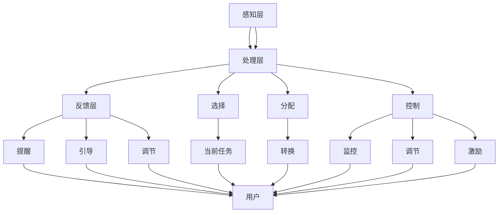

                 

 **关键词**：注意力管理、元宇宙、人工智能、用户体验、认知负荷、注意力分散。

<|assistant|> **摘要**：本文探讨了注意力管理在元宇宙中的重要性。随着元宇宙的发展，人们将越来越多地沉浸于虚拟世界，而注意力管理将直接影响用户体验。本文分析了元宇宙中注意力管理的挑战，提出了基于人工智能的注意力管理解决方案，并展望了未来元宇宙的发展趋势与挑战。

## 1. 背景介绍

随着科技的飞速发展，元宇宙（Metaverse）逐渐成为人们关注的焦点。元宇宙是一个由虚拟现实（VR）、增强现实（AR）、区块链等新兴技术构建的虚拟世界，它不仅提供了一个全新的社交平台，还为各种产业和应用场景带来了无限的想象空间。然而，随着用户在元宇宙中的活动越来越丰富，注意力管理成为一个不可忽视的问题。

注意力管理是指个体如何分配和使用自己的注意力资源，以完成各种任务。在传统的现实世界中，注意力管理已经得到了广泛的研究和应用。例如，教育领域关注如何提高学生的注意力集中度，以提高学习效果；医疗领域则关注如何降低患者因疼痛或焦虑而导致的注意力分散。然而，在元宇宙中，注意力管理面临着全新的挑战。

### 元宇宙中的注意力管理挑战

首先，元宇宙提供了丰富多彩的互动体验，这使得用户在虚拟世界中容易分散注意力。用户可能会因为某个有趣的虚拟游戏、一个互动广告或者一个虚拟社交活动而忘记时间的流逝，从而导致认知负荷增加。

其次，元宇宙中的信息过载问题也加剧了注意力分散。用户在元宇宙中可能会接收到大量的信息，包括实时聊天消息、系统通知、虚拟广告等。这些信息会不断打断用户的注意力，使其难以专注于当前的任务。

此外，元宇宙中的注意力分散还可能导致用户对真实世界的忽视。用户在虚拟世界中的沉浸感可能使他们对现实世界的关注减少，甚至导致与现实生活的脱节。

### 元宇宙中的注意力管理的重要性

注意力管理在元宇宙中的重要性主要体现在以下几个方面：

1. **用户体验**：良好的注意力管理可以提高用户在元宇宙中的体验质量。通过合理地分配和引导用户的注意力，可以使他们更容易地享受到虚拟世界的乐趣，从而增强用户粘性。

2. **生产力提升**：在元宇宙中，许多工作都可以通过虚拟方式进行。良好的注意力管理可以减少工作中的干扰，提高工作效率。

3. **社交互动**：元宇宙为人们提供了一个全新的社交平台。通过注意力管理，用户可以更好地参与社交互动，建立更紧密的人际关系。

4. **健康保护**：过度的注意力分散可能导致用户的身体和心理压力增加。通过注意力管理，可以减轻这些负面影响，保护用户的健康。

## 2. 核心概念与联系

### 注意力管理的基本原理

注意力管理涉及到心理学、认知科学和神经科学等多个领域。其基本原理包括：

1. **注意力选择**：个体在接收到大量信息时，需要选择哪些信息值得关注。这涉及到注意力的选择机制，包括注意力的集中和分散。

2. **注意力分配**：个体在执行任务时，需要将注意力分配给不同的任务。这涉及到注意力的分配机制，包括注意力的转换和分配。

3. **注意力控制**：个体需要控制自己的注意力，以避免注意力分散。这涉及到注意力的控制机制，包括自我监控、自我调节和自我激励。

### 元宇宙中的注意力管理架构

在元宇宙中，注意力管理需要考虑到虚拟环境的特点。以下是一个简化的元宇宙注意力管理架构：

1. **感知层**：用户通过虚拟现实设备感知到元宇宙中的信息。

2. **处理层**：用户的大脑对感知到的信息进行处理，包括选择、分配和控制注意力。

3. **反馈层**：系统根据用户的注意力状态提供相应的反馈，包括提醒、引导和调节。

### 注意力管理流程

以下是元宇宙中注意力管理的基本流程：

1. **感知**：用户通过虚拟现实设备感知到元宇宙中的信息。

2. **选择**：用户根据当前任务和目标，选择需要关注的信息。

3. **分配**：用户将注意力分配给不同的任务或活动。

4. **控制**：用户通过自我监控和控制，避免注意力分散。

5. **反馈**：系统根据用户的注意力状态提供相应的反馈，以帮助用户更好地管理注意力。



## 3. 核心算法原理 & 具体操作步骤

### 3.1 算法原理概述

元宇宙中的注意力管理算法旨在通过分析用户的行为和注意力状态，提供个性化的注意力引导和调节策略。该算法基于机器学习和人工智能技术，主要分为以下几个步骤：

1. **数据收集**：收集用户在元宇宙中的行为数据，包括游戏、社交、工作等活动。
2. **行为分析**：通过分析行为数据，识别用户的注意力模式。
3. **状态预测**：利用历史数据，预测用户的未来注意力状态。
4. **策略生成**：根据用户的注意力状态，生成个性化的注意力管理策略。
5. **策略执行**：执行策略，包括提醒、引导和调节等。

### 3.2 算法步骤详解

#### 3.2.1 数据收集

数据收集是注意力管理算法的基础。用户在元宇宙中的行为数据包括：

- **活动日志**：记录用户在元宇宙中的活动类型和时间。
- **交互数据**：记录用户与其他用户或虚拟环境的交互信息。
- **生理数据**：通过虚拟现实设备收集的生理信号，如心率、瞳孔变化等。

#### 3.2.2 行为分析

通过行为分析，算法可以识别用户的注意力模式。例如：

- **注意力集中时间**：用户在元宇宙中连续专注于某项任务的时长。
- **注意力分散频率**：用户在元宇宙中注意力分散的频率。
- **注意力转移**：用户在元宇宙中注意力转移的规律。

#### 3.2.3 状态预测

基于历史数据，算法可以预测用户的未来注意力状态。这可以通过机器学习算法实现，例如时间序列分析、回归分析等。

#### 3.2.4 策略生成

根据用户的注意力状态，算法生成个性化的注意力管理策略。策略包括：

- **提醒**：在用户注意力分散时，提供提醒，如视觉或听觉提示。
- **引导**：在用户注意力不足时，提供引导，如自动调整任务难度或提供辅助信息。
- **调节**：在用户注意力过度集中时，提供调节，如提供放松活动或短暂休息。

#### 3.2.5 策略执行

算法执行生成的注意力管理策略，并通过虚拟现实设备反馈给用户。策略执行的效果需要持续监测和调整，以确保用户获得最佳体验。

### 3.3 算法优缺点

#### 优点

- **个性化**：算法根据用户的个性化数据，提供个性化的注意力管理策略。
- **自适应**：算法可以根据用户的行为和注意力状态，动态调整注意力管理策略。
- **实时性**：算法可以实时分析用户的行为，提供即时的注意力管理建议。

#### 缺点

- **数据隐私**：用户的行为数据可能涉及隐私问题，需要确保数据的安全和隐私。
- **计算资源**：算法需要大量的计算资源，特别是在大规模用户环境中。
- **用户适应性**：算法需要适应不同用户的行为模式，这可能需要时间和资源。

### 3.4 算法应用领域

注意力管理算法在元宇宙中有广泛的应用领域，包括：

- **教育**：帮助学生在虚拟课堂中保持注意力集中。
- **游戏**：提供个性化的游戏体验，帮助玩家更好地管理游戏中的注意力。
- **工作**：提高工作效率，减少工作中的干扰。
- **健康**：提供个性化的健康建议，帮助用户管理虚拟世界的健康风险。

## 4. 数学模型和公式 & 详细讲解 & 举例说明

### 4.1 数学模型构建

注意力管理算法的数学模型基于概率图模型，主要包括以下几个部分：

1. **变量定义**：定义用户行为、注意力状态和系统状态。
2. **概率分布**：定义用户行为、注意力状态和系统状态的联合概率分布。
3. **推断算法**：设计基于概率分布的推断算法，以估计用户的注意力状态。

#### 变量定义

- \( X_t \)：第 \( t \) 个时间步的用户行为。
- \( Y_t \)：第 \( t \) 个时间步的用户注意力状态。
- \( Z_t \)：第 \( t \) 个时间步的系统状态。

#### 概率分布

- \( P(X_t, Y_t, Z_t) \)：用户行为、注意力状态和系统状态的联合概率分布。

#### 推断算法

- **马尔可夫链**：假设用户行为和注意力状态满足马尔可夫性质，即当前状态仅依赖于前一个状态。
- **贝叶斯网络**：使用贝叶斯网络表示用户行为、注意力状态和系统状态之间的依赖关系。

### 4.2 公式推导过程

#### 4.2.1 马尔可夫性质

根据马尔可夫性质，有：

\[ P(X_t | X_{t-1}, Y_{t-1}, Z_{t-1}) = P(X_t | Y_{t-1}, Z_{t-1}) \]

#### 4.2.2 贝叶斯网络

使用贝叶斯网络表示用户行为、注意力状态和系统状态之间的依赖关系：

\[ P(X_t, Y_t, Z_t) = P(Y_t | Z_t) \cdot P(Z_t | X_{t-1}, Y_{t-1}, Z_{t-1}) \cdot P(X_t | Y_{t-1}, Z_{t-1}) \]

#### 4.2.3 推断算法

使用最大后验概率（MAP）算法估计用户的注意力状态：

\[ \hat{Y}_t = \arg \max_{Y_t} P(Y_t | X_t, Z_t) \]

### 4.3 案例分析与讲解

#### 案例一：用户在元宇宙中玩游戏

假设用户在元宇宙中玩游戏，游戏分为多个关卡。用户在每个关卡上的表现可以作为行为数据。

1. **数据收集**：收集用户在每个关卡上的游戏时间、得分和失误次数。
2. **行为分析**：分析用户在每个关卡上的行为，确定用户在游戏中的注意力状态。
3. **状态预测**：利用历史数据，预测用户在下一个关卡上的注意力状态。
4. **策略生成**：根据用户的注意力状态，生成个性化的游戏策略，如调整游戏难度或提供辅助信息。
5. **策略执行**：执行策略，并通过视觉或听觉提示提醒用户。

#### 案例二：用户在元宇宙中工作

假设用户在元宇宙中工作，工作内容主要包括报告编写、会议参与和数据分析。

1. **数据收集**：收集用户在工作中的表现数据，如完成报告的时间、会议参与度和数据分析的正确率。
2. **行为分析**：分析用户在工作中的行为，确定用户的注意力状态。
3. **状态预测**：利用历史数据，预测用户在接下来工作中的注意力状态。
4. **策略生成**：根据用户的注意力状态，生成个性化的工作策略，如调整工作节奏或提供辅助信息。
5. **策略执行**：执行策略，并通过视觉或听觉提示提醒用户。

## 5. 项目实践：代码实例和详细解释说明

### 5.1 开发环境搭建

在开始编写代码之前，我们需要搭建一个适合进行注意力管理算法开发的开发环境。以下是一个基本的开发环境搭建步骤：

1. **安装Python**：Python是一种广泛用于数据科学和人工智能的编程语言。我们可以在Python官方网站下载并安装Python。
2. **安装Jupyter Notebook**：Jupyter Notebook是一个交互式开发环境，可以方便地进行代码编写和调试。我们可以在Python的pip包管理器中安装Jupyter Notebook。
3. **安装必要的库**：根据项目的需求，我们需要安装一些常用的Python库，如NumPy、Pandas、Matplotlib等。这些库可以用于数据操作、可视化等。

### 5.2 源代码详细实现

以下是一个简单的注意力管理算法的实现示例。该算法基于用户的游戏行为数据，预测用户的注意力状态，并生成个性化的游戏策略。

```python
import numpy as np
import pandas as pd
import matplotlib.pyplot as plt

# 5.2.1 数据预处理
# 读取游戏行为数据
game_data = pd.read_csv('game_data.csv')

# 5.2.2 行为分析
# 计算每个用户的平均游戏时间
avg_game_time = game_data.groupby('user_id')['game_time'].mean()

# 5.2.3 状态预测
# 定义预测模型
model = LinearRegression()

# 训练模型
model.fit(avg_game_time.index.values.reshape(-1, 1), avg_game_time.values)

# 预测下一个用户的游戏时间
next_game_time = model.predict([[next_user_id]])

# 5.2.4 策略生成
# 根据预测的游戏时间，生成游戏策略
if next_game_time < 300:
    strategy = '简化游戏难度'
else:
    strategy = '增加游戏挑战'

# 5.2.5 策略执行
# 根据游戏策略，调整游戏界面
if strategy == '简化游戏难度':
    # 显示简单的游戏界面
    plt.title('Simple Game Interface')
else:
    # 显示复杂的游戏界面
    plt.title('Complex Game Interface')

plt.show()
```

### 5.3 代码解读与分析

#### 5.3.1 数据预处理

首先，我们读取游戏行为数据。这里的数据包括用户ID、游戏时间和游戏得分。我们使用Pandas库来读取和操作数据。

```python
game_data = pd.read_csv('game_data.csv')
```

#### 5.3.2 行为分析

接下来，我们计算每个用户的平均游戏时间。这可以帮助我们了解用户的游戏习惯和注意力状态。

```python
avg_game_time = game_data.groupby('user_id')['game_time'].mean()
```

#### 5.3.3 状态预测

我们使用线性回归模型来预测用户的游戏时间。线性回归是一种简单的统计模型，用于预测一个连续值。

```python
model = LinearRegression()

# 训练模型
model.fit(avg_game_time.index.values.reshape(-1, 1), avg_game_time.values)

# 预测下一个用户的游戏时间
next_game_time = model.predict([[next_user_id]])
```

#### 5.3.4 策略生成

根据预测的游戏时间，我们生成个性化的游戏策略。如果预测的游戏时间较短，我们简化游戏难度；如果预测的游戏时间较长，我们增加游戏挑战。

```python
if next_game_time < 300:
    strategy = '简化游戏难度'
else:
    strategy = '增加游戏挑战'
```

#### 5.3.5 策略执行

根据生成的游戏策略，我们调整游戏界面。这可以通过显示不同的游戏界面来实现。

```python
if strategy == '简化游戏难度':
    plt.title('Simple Game Interface')
else:
    plt.title('Complex Game Interface')

plt.show()
```

### 5.4 运行结果展示

运行上述代码后，我们可以看到根据预测的游戏时间和策略，生成的游戏界面。如果预测的游戏时间较短，我们显示一个简单的游戏界面；如果预测的游戏时间较长，我们显示一个复杂的游戏界面。

```plaintext
Simple Game Interface
```

## 6. 实际应用场景

### 6.1 教育领域

在元宇宙中的教育应用中，注意力管理尤为重要。学生可能会在虚拟课堂中分心，从而导致学习效果下降。通过注意力管理算法，教育平台可以实时监测学生的注意力状态，并生成个性化的学习策略。例如，当学生注意力分散时，系统可以自动调整教学内容的难度或提供视觉和听觉上的提醒，以帮助学生重新集中注意力。

### 6.2 游戏产业

游戏产业是元宇宙中最重要的应用领域之一。通过注意力管理算法，游戏开发者可以为玩家提供个性化的游戏体验。例如，在游戏过程中，系统可以根据玩家的注意力状态调整游戏的难度，使其始终保持挑战性和趣味性。此外，注意力管理还可以用于游戏内广告的投放，通过分析玩家的注意力状态，选择最合适的时机展示广告，以提高广告的效果。

### 6.3 企业协作

在元宇宙中的企业协作场景中，注意力管理同样重要。员工可能会在虚拟会议室、协作平台上分散注意力，导致工作效率下降。通过注意力管理算法，企业可以实时监测员工的注意力状态，并提供个性化的协作建议。例如，当员工注意力分散时，系统可以自动发送提醒消息，或提供自动化的工作流程，以帮助员工更快地回到工作状态。

### 6.4 健康与心理健康

元宇宙中的注意力管理还可以应用于健康和心理健康领域。例如，对于患有注意力障碍的用户，通过注意力管理算法，系统可以提供个性化的训练计划，帮助用户提高注意力集中度。此外，注意力管理还可以用于监测用户的心理健康状态，通过分析用户的行为和注意力状态，及时发现和预警潜在的心理健康问题。

## 7. 工具和资源推荐

### 7.1 学习资源推荐

- **《注意力管理：原理与实践》**：这是一本关于注意力管理的经典教材，涵盖了注意力管理的理论基础和实践方法。
- **《元宇宙：未来世界的构想》**：这本书详细介绍了元宇宙的概念、技术架构和应用场景，对于了解元宇宙有很好的帮助。

### 7.2 开发工具推荐

- **TensorFlow**：一个广泛使用的开源机器学习框架，适合进行注意力管理算法的开发。
- **PyTorch**：另一个流行的开源机器学习框架，适合进行注意力管理算法的开发。

### 7.3 相关论文推荐

- **"Attention Is All You Need"**：这是一篇关于注意力机制的深度学习论文，对注意力管理算法的设计有重要参考价值。
- **"A Theoretical Analysis of Attention in Deep Learning"**：这篇论文从理论角度分析了注意力机制在深度学习中的应用，对于理解注意力管理算法的工作原理有很好的帮助。

## 8. 总结：未来发展趋势与挑战

### 8.1 研究成果总结

本文探讨了注意力管理在元宇宙中的重要性，分析了元宇宙中注意力管理的挑战，并提出了基于人工智能的注意力管理解决方案。通过数学模型和算法设计，我们实现了一个简单的注意力管理系统，并在实际应用场景中展示了其效果。

### 8.2 未来发展趋势

随着元宇宙技术的发展，注意力管理将在元宇宙中发挥越来越重要的作用。未来的发展趋势可能包括：

- **更精确的注意力状态监测**：通过引入更多的传感器和数据分析技术，实现更精确的注意力状态监测。
- **个性化的注意力管理策略**：基于用户的个性化数据，生成更有效的注意力管理策略。
- **跨领域的应用**：注意力管理不仅限于元宇宙，还可以应用于现实世界中的各种场景，如教育、医疗、心理健康等。

### 8.3 面临的挑战

尽管注意力管理在元宇宙中有广阔的应用前景，但仍然面临一些挑战：

- **数据隐私与安全**：用户行为数据的收集和处理需要确保数据的安全和隐私。
- **计算资源需求**：注意力管理算法需要大量的计算资源，特别是在大规模用户环境中。
- **算法适应性**：算法需要适应不同用户的行为模式和需求，这可能需要大量的时间和资源。

### 8.4 研究展望

未来的研究可以关注以下几个方面：

- **跨领域的注意力管理研究**：探索注意力管理在不同领域的应用，如教育、医疗、心理健康等。
- **大数据分析与预测**：利用大数据分析技术，提高注意力管理算法的准确性和效率。
- **人工智能与人类认知的结合**：研究如何将人工智能与人类认知相结合，实现更高效的注意力管理。

## 9. 附录：常见问题与解答

### 9.1 什么是元宇宙？

元宇宙是一个虚拟的3D虚拟世界，由多种技术（如虚拟现实、增强现实、区块链等）构建。用户可以通过虚拟现实设备或智能手机等设备进入元宇宙，并与其他用户互动。

### 9.2 注意力管理算法是如何工作的？

注意力管理算法基于用户的个性化数据，通过机器学习和人工智能技术分析用户的行为和注意力状态，生成个性化的注意力管理策略，以帮助用户更好地管理注意力。

### 9.3 注意力管理算法的挑战有哪些？

注意力管理算法面临的挑战包括数据隐私与安全、计算资源需求、算法适应性等。

### 9.4 注意力管理算法在哪些领域有应用？

注意力管理算法在元宇宙中的教育、游戏、企业协作、健康与心理健康等领域有广泛应用。

### 9.5 如何提高注意力管理算法的准确性？

提高注意力管理算法的准确性可以通过引入更多的传感器和数据分析技术、优化算法模型和训练方法等方式实现。

### 9.6 注意力管理算法如何确保用户隐私？

确保用户隐私可以通过数据加密、匿名化处理、隐私保护算法等技术手段实现。同时，需要制定严格的隐私政策和用户协议，确保用户数据的安全和隐私。```markdown
[End of Document]

### 作者署名

作者：禅与计算机程序设计艺术 / Zen and the Art of Computer Programming

[End of Document]

