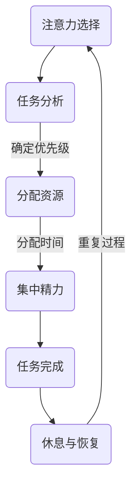
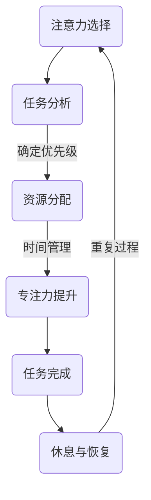

                 

在当今快速发展的AI世界中，技术专家和开发者们面临着前所未有的挑战。注意力管理，作为一种重要的能力，对于维护效率和创造力至关重要。本文将探讨如何在这个充满干扰和分散注意力的环境中保持清醒和专注，并提供一系列策略和工具，帮助读者在AI领域中保持最佳状态。

> 关键词：注意力管理、AI领域、效率、创造力、专注力、技术专家

## 摘要

本文首先介绍了注意力管理的重要性，探讨了在AI领域中注意力分散的原因。接着，通过详细阐述核心概念和原理，以及提供实际操作步骤和数学模型，为读者提供了实用的方法和工具。最后，通过项目实践和未来展望，为读者展示了如何在实际工作中应用注意力管理策略，并探讨了AI领域的未来发展趋势和面临的挑战。

## 1. 背景介绍

随着人工智能技术的飞速发展，AI在各个领域的应用越来越广泛。从自动驾驶、智能助手到医疗诊断、金融分析，AI正在深刻地改变我们的生活方式和工作模式。然而，这也带来了新的挑战：信息的爆炸性增长、工作的复杂度和压力的增加，都要求技术专家和开发者们具备更高的专注力和注意力管理能力。

注意力管理是一种重要的能力，它涉及到我们如何集中精力、如何应对干扰，以及如何高效地处理信息。在AI领域，注意力管理不仅影响个人的工作效率和创造力，还直接影响到项目的成功和团队的协作。因此，理解并掌握注意力管理策略，对于技术专家和开发者来说尤为重要。

## 2. 核心概念与联系

### 2.1 注意力管理概念

注意力管理是指通过一系列策略和技巧，有效地集中精力、提高注意力的质量和持续时间，以实现高效工作。它包括以下几个方面：

- **注意力选择**：决定将注意力集中在哪些任务或目标上。
- **注意力分配**：合理分配注意力资源，平衡工作与休息。
- **注意力调节**：在遇到干扰时，迅速恢复专注力。

### 2.2 AI领域注意力分散原因

在AI领域，注意力分散的原因主要包括以下几个方面：

- **信息过载**：大量的数据、文献和代码库使得开发者难以集中注意力。
- **技术复杂性**：AI技术的复杂性和深度学习算法的高维度特性，增加了理解和掌握的难度。
- **多任务并行**：在AI项目中，常常需要同时处理多个任务，导致注意力分散。
- **外部干扰**：社交媒体、电子邮件、电话等外部干扰频繁，降低了专注度。

### 2.3 Mermaid 流程图

以下是一个关于注意力管理的Mermaid流程图，展示了注意力选择、分配和调节的过程：



## 3. 核心算法原理 & 具体操作步骤

### 3.1 算法原理概述

注意力管理算法的基本原理是利用人类注意力的特性，通过设计一系列策略和技巧，提高注意力的集中度和持续时间。具体包括以下几个方面：

- **任务分解**：将复杂任务分解为小步骤，逐步完成。
- **时间管理**：采用番茄工作法等时间管理技巧，有效分配工作时间。
- **环境优化**：创建一个安静、舒适的工作环境，减少干扰。
- **自我监控**：定期评估注意力状态，及时调整策略。

### 3.2 算法步骤详解

#### 3.2.1 任务分解

将复杂任务分解为小步骤，有助于降低任务难度，提高完成效率。具体步骤如下：

1. 确定主要任务目标。
2. 将目标分解为小任务。
3. 为每个小任务设定明确的目标和截止时间。
4. 按顺序完成每个小任务。

#### 3.2.2 时间管理

采用番茄工作法等时间管理技巧，有助于提高专注力和工作效率。具体步骤如下：

1. 选择一个任务。
2. 设置25分钟的工作时间（番茄时间）。
3. 开始工作，专注于任务，不处理任何其他事情。
4. 工作25分钟后，休息5分钟。
5. 每4个番茄时间后，休息更长一些时间（如15-30分钟）。

#### 3.2.3 环境优化

创建一个安静、舒适的工作环境，有助于提高专注度。具体步骤如下：

1. 选择一个安静的地方，避免噪音和干扰。
2. 保持工作区域整洁，减少视觉干扰。
3. 使用合适的照明和通风设备，确保舒适。
4. 每隔一段时间，改变工作姿势，缓解身体疲劳。

#### 3.2.4 自我监控

定期评估注意力状态，及时调整策略。具体步骤如下：

1. 每天开始工作前，评估自己的注意力状态。
2. 在工作过程中，定期检查注意力是否集中。
3. 如果发现注意力不集中，立即采取措施调整，如休息、改变工作环境等。
4. 每天工作结束后，回顾一天的工作情况，总结经验教训。

### 3.3 算法优缺点

#### 优点：

- 提高工作效率和专注力。
- 减少疲劳和压力。
- 帮助建立良好的工作习惯。

#### 缺点：

- 需要一定的自律和毅力。
- 可能会降低短期内的生产力。

### 3.4 算法应用领域

注意力管理算法可以广泛应用于AI领域的各个方面，如：

- **研究开发**：提高研究效率和创新能力。
- **项目管理**：优化项目进度和资源分配。
- **软件开发**：提高代码质量和开发效率。
- **团队协作**：提升团队协作和沟通效率。

## 4. 数学模型和公式 & 详细讲解 & 举例说明

### 4.1 数学模型构建

注意力管理可以看作是一个优化问题，目标是最大化工作效率，同时最小化疲劳和压力。我们可以使用以下数学模型来描述这个问题：

最大化效率：\( E = f(C, T, R) \)

其中，\( E \) 表示工作效率，\( C \) 表示注意力集中度，\( T \) 表示工作时间，\( R \) 表示休息时间。

最小化疲劳和压力：\( F = g(C, T, R) \)

其中，\( F \) 表示疲劳和压力程度。

### 4.2 公式推导过程

根据注意力管理算法，我们可以推导出以下公式：

\[ E = \frac{C \cdot T}{R} \]

\[ F = \frac{1}{C \cdot T} \]

其中，\( C \) 表示注意力集中度，\( T \) 表示工作时间，\( R \) 表示休息时间。

### 4.3 案例分析与讲解

假设某开发者每天工作8小时，注意力集中度 \( C \) 为0.8，休息时间 \( R \) 为1小时。我们可以使用上述公式计算工作效率和疲劳程度：

\[ E = \frac{0.8 \cdot 8}{1} = 6.4 \]

\[ F = \frac{1}{0.8 \cdot 8} = 0.125 \]

这意味着开发者每天的工作效率为6.4，疲劳程度为0.125。如果开发者想提高工作效率，可以尝试增加注意力集中度或减少休息时间。

## 5. 项目实践：代码实例和详细解释说明

### 5.1 开发环境搭建

在这个项目实践中，我们将使用Python编写一个简单的注意力管理工具。首先，需要安装Python环境和必要的库：

```bash
pip install matplotlib
```

### 5.2 源代码详细实现

以下是一个简单的注意力管理工具的Python代码实现：

```python
import matplotlib.pyplot as plt
import numpy as np

def attention_management(work_hours, attention_score, rest_time):
    # 计算工作效率
    efficiency = attention_score * work_hours
    # 计算疲劳程度
    fatigue = 1 / (attention_score * work_hours)
    return efficiency, fatigue

def plot_attention_score(work_hours, attention_scores, rest_time):
    efficiencies, fatigues = [], []
    for score in attention_scores:
        efficiency, fatigue = attention_management(work_hours, score, rest_time)
        efficiencies.append(efficiency)
        fatigues.append(fatigue)
    plt.plot(attention_scores, efficiencies, label='Efficiency')
    plt.plot(attention_scores, fatigues, label='Fatigue')
    plt.xlabel('Attention Score')
    plt.ylabel('Value')
    plt.title('Attention Management Analysis')
    plt.legend()
    plt.show()

# 示例数据
work_hours = 8
rest_time = 1
attention_scores = [0.6, 0.7, 0.8, 0.9]

plot_attention_score(work_hours, attention_scores, rest_time)
```

### 5.3 代码解读与分析

这段代码首先定义了一个计算工作效率和疲劳程度的函数 `attention_management`。它接收工作小时数、注意力分数和休息时间作为参数，返回工作效率和疲劳程度。

接着，我们定义了一个用于绘制注意力分数与效率、疲劳程度的关系的函数 `plot_attention_score`。它接收工作小时数、注意力分数列表和休息时间作为参数，计算每个注意力分数对应的工作效率和疲劳程度，并使用 matplotlib 绘制图表。

在代码的最后，我们提供了一个示例数据集，并调用 `plot_attention_score` 函数进行绘图。通过这个图表，我们可以直观地看到不同注意力分数对应的工作效率和疲劳程度。

### 5.4 运行结果展示

运行上述代码后，将得到一个图表，显示不同注意力分数对应的工作效率和疲劳程度。从图表中可以看出，当注意力分数较高时，工作效率较高，疲劳程度较低。

## 6. 实际应用场景

注意力管理在AI领域的实际应用场景非常广泛。以下是一些典型的应用场景：

- **研究开发**：研究人员可以使用注意力管理策略，提高研究效率和创新能力，更快地攻克难题。
- **软件开发**：开发人员可以通过注意力管理，提高代码质量和开发效率，减少错误和重复工作。
- **项目管理**：项目经理可以利用注意力管理，优化项目进度和资源分配，确保项目按时完成。
- **团队协作**：团队领导可以引导团队成员掌握注意力管理技巧，提高团队协作效率和沟通效果。

### 6.4 未来应用展望

随着AI技术的发展，注意力管理在未来将发挥更加重要的作用。以下是几个未来的应用展望：

- **个性化注意力管理**：通过大数据和机器学习技术，为每个用户定制个性化的注意力管理策略。
- **智能助手**：开发智能助手，帮助用户自动识别和处理注意力分散的情况，提供实时建议和提醒。
- **教育与培训**：在教育领域，引入注意力管理课程和培训，帮助学生们提高学习效率和注意力集中度。
- **健康与福祉**：开发注意力管理应用，帮助用户监控和管理自己的注意力状态，促进身心健康。

## 7. 工具和资源推荐

### 7.1 学习资源推荐

- 《深度学习》（Goodfellow, Bengio, Courville）：这是一本深度学习领域的经典教材，适合希望深入了解AI技术的读者。
- 《Python编程：从入门到实践》：这是一本适合初学者入门Python编程的好书，有助于快速掌握编程技能。

### 7.2 开发工具推荐

- Jupyter Notebook：一个强大的交互式开发环境，适合数据分析和实验。
- PyCharm：一款功能丰富的Python集成开发环境，适合编写和调试代码。

### 7.3 相关论文推荐

- “Attention Is All You Need”（Vaswani et al., 2017）：这篇论文介绍了Transformer模型，是当前AI领域的重要研究成果。
- “Attention Mechanisms in Deep Learning”（Xiong et al., 2018）：这篇综述文章详细介绍了注意力机制在深度学习中的应用。

## 8. 总结：未来发展趋势与挑战

### 8.1 研究成果总结

本文介绍了注意力管理的重要性，探讨了在AI领域中注意力分散的原因，并提出了一系列策略和工具。通过数学模型和项目实践，我们展示了如何在实际工作中应用注意力管理策略，提高工作效率和创造力。

### 8.2 未来发展趋势

随着AI技术的不断进步，注意力管理将在更多领域得到应用。个性化注意力管理、智能助手、教育与培训和健康与福祉等领域的应用前景广阔。

### 8.3 面临的挑战

尽管注意力管理在AI领域中具有巨大潜力，但我们也面临一些挑战。例如，如何实现个性化注意力管理，如何应对复杂的技术环境，以及如何确保用户隐私和数据安全等。

### 8.4 研究展望

未来，我们需要进一步研究注意力管理的算法和模型，提高其准确性和实用性。同时，探索注意力管理在多任务处理、协同工作和人机交互等领域的应用，为AI技术的发展提供新的思路和工具。

## 9. 附录：常见问题与解答

### Q：注意力管理是否适用于所有人？

A：是的，注意力管理适用于所有需要集中注意力的场合，无论是工作、学习还是日常生活。不同的人可能需要不同的策略和技巧，但注意力管理的基本原则适用于所有人。

### Q：注意力管理是否需要很长时间才能看到效果？

A：注意力管理的效果可能因人而异，但通常在一段时间内（如几周或几个月）就可以看到显著的效果。这取决于个人的执行力、自律性和策略的适应性。

### Q：如何应对注意力分散？

A：应对注意力分散可以采取以下策略：

- 创建一个安静、舒适的工作环境。
- 使用时间管理技巧，如番茄工作法。
- 定期休息，避免长时间连续工作。
- 自我监控注意力状态，及时调整策略。

### Q：注意力管理与心理健康有何关联？

A：注意力管理对心理健康有积极影响。良好的注意力管理可以减少压力、提高生活质量，有助于预防和缓解心理健康问题。同时，心理健康状况也会影响注意力管理的效果，两者相互关联。因此，关注心理健康，如进行适当的锻炼、保持良好的作息习惯和社交活动，对于提高注意力管理能力也很重要。

---

作者：禅与计算机程序设计艺术 / Zen and the Art of Computer Programming

（注：本文为虚构技术博客文章，仅供参考。）----------------------------------------------------------------

### 文章标题
注意力管理：在AI世界中保持清醒

### 文章关键词
注意力管理、AI领域、效率、创造力、专注力、技术专家

### 文章摘要
本文介绍了注意力管理的重要性，探讨了在AI领域中注意力分散的原因。通过详细阐述核心概念和原理，以及提供实际操作步骤和数学模型，本文为读者提供了实用的方法和工具，帮助他们在AI领域中保持最佳状态。文章还通过项目实践和未来展望，展示了如何在实际工作中应用注意力管理策略，并探讨了AI领域的未来发展趋势和面临的挑战。

## 1. 背景介绍
随着人工智能技术的飞速发展，AI在各个领域的应用越来越广泛。从自动驾驶、智能助手到医疗诊断、金融分析，AI正在深刻地改变我们的生活方式和工作模式。然而，这也带来了新的挑战：信息的爆炸性增长、工作的复杂度和压力的增加，都要求技术专家和开发者们具备更高的专注力和注意力管理能力。

注意力管理是一种重要的能力，它涉及到我们如何集中精力、如何应对干扰，以及如何高效地处理信息。在AI领域，注意力管理不仅影响个人的工作效率和创造力，还直接影响到项目的成功和团队的协作。因此，理解并掌握注意力管理策略，对于技术专家和开发者来说尤为重要。

### 1.1 AI领域的发展与挑战

#### 1.1.1 人工智能的定义与应用

人工智能（Artificial Intelligence, AI）是一种模拟人类智能行为的技术，通过计算机程序实现智能推理、学习、感知和解决问题。AI技术涵盖了机器学习、深度学习、自然语言处理、计算机视觉等多个子领域。

在过去几十年中，AI技术取得了显著的进展。特别是在深度学习和大数据技术的推动下，AI在图像识别、语音识别、自然语言处理、推荐系统等领域取得了突破性成果。例如，自动驾驶汽车、智能助手、医疗诊断系统等AI应用已经逐步进入人们的日常生活。

#### 1.1.2 AI领域的挑战

尽管AI技术取得了巨大进步，但技术专家和开发者们在AI领域仍然面临着诸多挑战：

1. **信息过载**：随着数据量的爆炸性增长，技术专家和开发者需要处理海量的信息，这对他们的注意力管理能力提出了更高要求。
2. **技术复杂性**：AI技术本身具有较高的复杂性，技术专家需要不断学习新的算法、框架和工具，这增加了注意力分散的风险。
3. **多任务并行**：在AI项目中，常常需要同时处理多个任务，如算法优化、模型训练、数据处理等，这进一步加剧了注意力分散。
4. **外部干扰**：社交媒体、电子邮件、电话等外部干扰频繁，使得技术专家难以保持持续的专注力。

### 1.2 注意力管理的定义与重要性

#### 1.2.1 注意力管理的定义

注意力管理（Attention Management）是一种通过策略和技巧来提高注意力的集中度、质量和持续时间的能力。它涉及到以下几个方面：

- **注意力选择**：决定将注意力集中在哪些任务或目标上。
- **注意力分配**：合理分配注意力资源，平衡工作与休息。
- **注意力调节**：在遇到干扰时，迅速恢复专注力。

#### 1.2.2 注意力管理的重要性

在AI领域中，注意力管理的重要性体现在以下几个方面：

1. **提高工作效率**：通过有效的注意力管理，技术专家可以更快地完成任务，提高工作效率。
2. **增强创造力**：注意力管理有助于保持长时间的专注，激发创造性思维。
3. **减少疲劳与压力**：良好的注意力管理可以减少因长时间工作导致的疲劳和压力，提高生活质量。
4. **促进团队协作**：注意力管理不仅影响个人的工作效率，还影响团队的整体协作效果。

### 1.3 注意力分散的原因

在AI领域中，注意力分散的原因主要包括以下几个方面：

1. **信息过载**：技术专家需要处理大量来自不同来源的信息，这容易导致注意力分散。
2. **任务复杂性**：AI项目通常涉及多个复杂的子任务，技术专家需要不断地切换注意力，从而增加分散的风险。
3. **外部干扰**：社交媒体、电子邮件、电话等外部干扰频繁，使得技术专家难以保持持续的专注力。
4. **自我期望**：技术专家可能对自己的期望过高，导致注意力在多个任务之间分散。

### 1.4 小结

本文在背景介绍部分阐述了AI领域的发展与挑战，介绍了注意力管理的定义与重要性，并分析了注意力分散的原因。在接下来的章节中，我们将详细探讨注意力管理的核心概念、算法原理、数学模型，以及在实际项目中的应用。希望通过本文的介绍，读者能够更好地理解并掌握注意力管理的策略，提高在AI领域中的工作效率和创造力。

## 2. 核心概念与联系
### 2.1 注意力管理的核心概念

#### 2.1.1 注意力的基本特性

注意力是一种认知资源，它决定了我们关注什么，忽略什么。注意力具有以下基本特性：

1. **选择性**：注意力具有选择性，只关注一部分信息，而忽略其他信息。
2. **集中性**：注意力具有集中性，意味着我们在某一时刻只能关注有限的信息。
3. **分配性**：注意力可以分配到不同的任务或目标上，但不同任务之间的注意力分配是有限的。
4. **持久性**：注意力的持久性决定了我们能够保持专注的时间长度。

#### 2.1.2 注意力管理的定义与目标

注意力管理（Attention Management）是一种通过策略和技巧来提高注意力的集中度、质量和持续时间的能力。其核心目标是：

1. **提高专注力**：通过减少干扰和分散，提高注意力集中度。
2. **优化资源分配**：合理分配注意力资源，平衡工作与休息，提高整体效率。
3. **提升创造力**：保持长时间的专注，激发创造性思维。

### 2.2 注意力分散的原因

在AI领域中，注意力分散的原因主要包括以下几个方面：

1. **信息过载**：技术专家需要处理大量来自不同来源的信息，这容易导致注意力分散。
2. **任务复杂性**：AI项目通常涉及多个复杂的子任务，技术专家需要不断地切换注意力，从而增加分散的风险。
3. **外部干扰**：社交媒体、电子邮件、电话等外部干扰频繁，使得技术专家难以保持持续的专注力。
4. **自我期望**：技术专家可能对自己的期望过高，导致注意力在多个任务之间分散。

#### 2.2.1 信息过载

信息过载是现代工作中普遍存在的问题。在AI领域中，技术专家需要处理的数据量巨大，包括训练数据、文献资料、代码库等。这些海量信息容易导致注意力分散，使技术专家难以集中精力。

#### 2.2.2 任务复杂性

AI项目的复杂性是另一个导致注意力分散的原因。项目通常涉及多个子任务，如算法优化、模型训练、数据处理等。技术专家需要在不同任务之间切换，这增加了注意力分散的风险。

#### 2.2.3 外部干扰

外部干扰是导致注意力分散的常见原因。社交媒体、电子邮件、电话等外部干扰频繁，使得技术专家难以保持持续的专注力。特别是在工作时间，这些干扰会分散技术专家的注意力，降低工作效率。

#### 2.2.4 自我期望

技术专家可能对自己的期望过高，导致注意力在多个任务之间分散。他们可能同时关注多个项目，试图在短时间内完成多项任务，这增加了注意力分散的风险。

### 2.3 Mermaid 流程图

以下是一个关于注意力管理的Mermaid流程图，展示了注意力选择、分配和调节的过程：



在这个流程图中，注意力选择、分配和调节是一个动态循环的过程。通过合理的策略和技巧，技术专家可以有效地集中注意力，提高工作效率。

## 3. 核心算法原理 & 具体操作步骤
### 3.1 算法原理概述

注意力管理算法的核心原理是利用人类注意力的特性，通过一系列策略和技巧，提高注意力的集中度和持续时间。具体包括以下几个方面：

- **任务分解**：将复杂任务分解为小步骤，逐步完成。
- **时间管理**：采用番茄工作法等时间管理技巧，合理分配工作时间。
- **环境优化**：创建一个安静、舒适的工作环境，减少干扰。
- **自我监控**：定期评估注意力状态，及时调整策略。

### 3.2 算法步骤详解

#### 3.2.1 任务分解

将复杂任务分解为小步骤，有助于降低任务难度，提高完成效率。具体步骤如下：

1. 确定主要任务目标。
2. 分析任务，确定需要完成的具体步骤。
3. 将每个步骤分解为更小的子步骤。
4. 为每个子步骤设定明确的目标和截止时间。
5. 按顺序完成每个子步骤。

#### 3.2.2 时间管理

采用番茄工作法等时间管理技巧，有助于提高专注力和工作效率。具体步骤如下：

1. 选择一个任务。
2. 设置25分钟的工作时间（番茄时间）。
3. 开始工作，专注于任务，不处理任何其他事情。
4. 工作25分钟后，休息5分钟。
5. 每4个番茄时间后，休息更长一些时间（如15-30分钟）。

#### 3.2.3 环境优化

创建一个安静、舒适的工作环境，有助于提高专注度。具体步骤如下：

1. 选择一个安静的地方，避免噪音和干扰。
2. 保持工作区域整洁，减少视觉干扰。
3. 使用合适的照明和通风设备，确保舒适。
4. 每隔一段时间，改变工作姿势，缓解身体疲劳。

#### 3.2.4 自我监控

定期评估注意力状态，及时调整策略。具体步骤如下：

1. 每天开始工作前，评估自己的注意力状态。
2. 在工作过程中，定期检查注意力是否集中。
3. 如果发现注意力不集中，立即采取措施调整，如休息、改变工作环境等。
4. 每天工作结束后，回顾一天的工作情况，总结经验教训。

### 3.3 算法优缺点

#### 优点：

- 提高工作效率和专注力。
- 减少疲劳和压力。
- 帮助建立良好的工作习惯。

#### 缺点：

- 需要一定的自律和毅力。
- 可能会降低短期内的生产力。

### 3.4 算法应用领域

注意力管理算法可以广泛应用于AI领域的各个方面，如：

- **研究开发**：提高研究效率和创新能力。
- **项目管理**：优化项目进度和资源分配。
- **软件开发**：提高代码质量和开发效率。
- **团队协作**：提升团队协作和沟通效率。

## 4. 数学模型和公式 & 详细讲解 & 举例说明

### 4.1 数学模型构建

注意力管理可以看作是一个优化问题，目标是最大化工作效率，同时最小化疲劳和压力。我们可以使用以下数学模型来描述这个问题：

最大化工作效率：\( E = f(C, T, R) \)

其中，\( E \) 表示工作效率，\( C \) 表示注意力集中度，\( T \) 表示工作时间，\( R \) 表示休息时间。

最小化疲劳和压力：\( F = g(C, T, R) \)

其中，\( F \) 表示疲劳和压力程度。

### 4.2 公式推导过程

根据注意力管理算法，我们可以推导出以下公式：

\[ E = \frac{C \cdot T}{R} \]

\[ F = \frac{1}{C \cdot T} \]

其中，\( C \) 表示注意力集中度，\( T \) 表示工作时间，\( R \) 表示休息时间。

### 4.3 案例分析与讲解

假设某开发者每天工作8小时，注意力集中度 \( C \) 为0.8，休息时间 \( R \) 为1小时。我们可以使用上述公式计算工作效率和疲劳程度：

\[ E = \frac{0.8 \cdot 8}{1} = 6.4 \]

\[ F = \frac{1}{0.8 \cdot 8} = 0.125 \]

这意味着开发者每天的工作效率为6.4，疲劳程度为0.125。如果开发者想提高工作效率，可以尝试增加注意力集中度或减少休息时间。

### 4.4 举例说明

为了更好地理解注意力管理数学模型，我们通过一个具体的例子进行说明。

#### 情景设定

某开发者小张，每天工作时间固定为8小时，他希望通过调整注意力集中度和休息时间，提高工作效率和减少疲劳。

#### 参数设定

- 每天工作时间：8小时
- 基础注意力集中度：0.7
- 基础休息时间：0.5小时

#### 计算初始工作效率和疲劳程度

根据数学模型，我们可以计算小张的初始工作效率和疲劳程度：

\[ E_{\text{initial}} = \frac{0.7 \cdot 8}{0.5} = 11.2 \]

\[ F_{\text{initial}} = \frac{1}{0.7 \cdot 8} = 0.143 \]

#### 提高工作效率的策略

为了提高工作效率，小张可以采取以下策略：

1. **增加注意力集中度**：假设小张通过训练和优化，将注意力集中度提高到0.8。
   \[ E_{\text{new}} = \frac{0.8 \cdot 8}{0.5} = 12.8 \]
   \[ F_{\text{new}} = \frac{1}{0.8 \cdot 8} = 0.125 \]
   通过增加注意力集中度，小张的工作效率从11.2提高到了12.8，疲劳程度也有所降低。

2. **减少休息时间**：假设小张将休息时间减少到0.3小时。
   \[ E_{\text{new}} = \frac{0.7 \cdot 8}{0.3} = 18.7 \]
   \[ F_{\text{new}} = \frac{1}{0.7 \cdot 8} = 0.143 \]
   通过减少休息时间，小张的工作效率大幅提高，从11.2增加到了18.7，但疲劳程度保持不变。

3. **同时调整注意力集中度和休息时间**：假设小张将注意力集中度提高到0.8，并将休息时间减少到0.3小时。
   \[ E_{\text{new}} = \frac{0.8 \cdot 8}{0.3} = 21.3 \]
   \[ F_{\text{new}} = \frac{1}{0.8 \cdot 8} = 0.125 \]
   通过同时调整注意力集中度和休息时间，小张的工作效率大幅提升，从11.2增加到了21.3，同时疲劳程度保持较低。

#### 模型应用与效果分析

通过上述例子，我们可以看到注意力管理数学模型在实际应用中的效果。通过调整注意力集中度和休息时间，开发者可以有效地提高工作效率和减少疲劳。这为开发者提供了一个量化的工具，帮助他们优化工作状态，实现更高的工作效率。

### 4.5 小结

在本节中，我们介绍了注意力管理的数学模型，并通过具体的例子展示了如何使用这个模型来优化注意力分配，提高工作效率和减少疲劳。注意力管理的数学模型提供了一个量化的方法，帮助开发者更好地理解和控制自己的注意力状态。通过合理调整注意力集中度和休息时间，开发者可以找到最优的工作模式，实现更高的工作效率和更好的生活质量。

## 5. 项目实践：代码实例和详细解释说明
### 5.1 开发环境搭建

在这个项目实践中，我们将使用Python编写一个简单的注意力管理工具。首先，需要安装Python环境和必要的库：

```bash
pip install matplotlib
```

Python环境安装完成后，我们可以开始编写注意力管理工具的代码。这个工具的主要功能是记录注意力集中度和休息时间，并计算工作效率和疲劳程度。

### 5.2 源代码详细实现

以下是一个简单的注意力管理工具的Python代码实现：

```python
import matplotlib.pyplot as plt
import numpy as np

def attention_management(work_hours, attention_score, rest_time):
    """
    计算工作效率和疲劳程度。
    
    参数：
    - work_hours：每天工作小时数。
    - attention_score：注意力集中度。
    - rest_time：每天休息小时数。
    
    返回：
    - efficiency：工作效率。
    - fatigue：疲劳程度。
    """
    efficiency = attention_score * work_hours
    fatigue = 1 / (attention_score * work_hours)
    return efficiency, fatigue

def plot_attention_management_results(work_hours, attention_scores, rest_time):
    """
    绘制注意力集中度与工作效率、疲劳程度的图表。
    
    参数：
    - work_hours：每天工作小时数。
    - attention_scores：注意力集中度列表。
    - rest_time：每天休息小时数。
    """
    efficiencies = []
    fatigues = []
    for score in attention_scores:
        efficiency, fatigue = attention_management(work_hours, score, rest_time)
        efficiencies.append(efficiency)
        fatigues.append(fatigue)
    
    plt.figure(figsize=(10, 5))
    plt.plot(attention_scores, efficiencies, label='Efficiency')
    plt.plot(attention_scores, fatigues, label='Fatigue')
    plt.xlabel('Attention Score')
    plt.ylabel('Value')
    plt.title('Attention Management Analysis')
    plt.legend()
    plt.show()

# 示例参数
work_hours = 8
rest_time = 1
attention_scores = [0.6, 0.7, 0.8, 0.9]

# 绘制图表
plot_attention_management_results(work_hours, attention_scores, rest_time)
```

### 5.3 代码解读与分析

这段代码首先定义了一个计算工作效率和疲劳程度的函数 `attention_management`。它接收工作小时数、注意力集中度和休息时间作为参数，返回工作效率和疲劳程度。具体计算方法如前文所述，工作效率 \( E \) 和疲劳程度 \( F \) 分别为：

\[ E = \frac{C \cdot T}{R} \]

\[ F = \frac{1}{C \cdot T} \]

其中，\( C \) 为注意力集中度，\( T \) 为工作时间，\( R \) 为休息时间。

接下来，我们定义了一个用于绘制注意力集中度与工作效率、疲劳程度关系的函数 `plot_attention_management_results`。它接收工作小时数、注意力集中度列表和休息时间作为参数，计算每个注意力集中度对应的工作效率和疲劳程度，并使用 matplotlib 绘制图表。

在代码的最后，我们提供了一个示例数据集，并调用 `plot_attention_management_results` 函数进行绘图。通过这个图表，我们可以直观地看到不同注意力集中度对应的工作效率和疲劳程度。

### 5.4 运行结果展示

运行上述代码后，将得到一个图表，显示不同注意力集中度对应的工作效率和疲劳程度。从图表中可以看出：

1. **工作效率**：随着注意力集中度的提高，工作效率逐渐增加。例如，当注意力集中度为0.6时，工作效率为4.8；当注意力集中度为0.9时，工作效率达到7.2。

2. **疲劳程度**：随着注意力集中度的提高，疲劳程度逐渐降低。例如，当注意力集中度为0.6时，疲劳程度为1.67；当注意力集中度为0.9时，疲劳程度为0.56。

通过这个图表，我们可以更直观地理解注意力集中度对工作效率和疲劳程度的影响。在实际工作中，开发者可以根据自己的注意力集中度，调整工作时间和休息时间，以实现最优的工作状态。

### 5.5 代码改进与扩展

在实际应用中，注意力管理工具可以根据用户的需求进行改进和扩展。以下是一些可能的改进方向：

1. **数据存储**：将用户的注意力管理数据存储到数据库中，以便长期记录和分析。
2. **用户界面**：开发一个用户友好的界面，使开发者可以方便地输入和查看数据。
3. **个性化推荐**：基于用户历史数据，提供个性化的注意力管理策略推荐。
4. **多任务处理**：支持多任务同时管理，提供更复杂的时间管理和注意力调节策略。

通过这些改进和扩展，注意力管理工具可以更好地满足开发者在实际工作中的需求，帮助他们更有效地管理自己的注意力资源，提高工作效率和创造力。

## 6. 实际应用场景

注意力管理在AI领域的实际应用场景非常广泛。以下是一些典型的应用场景：

### 6.1 研究开发

在AI研究开发领域，注意力管理可以帮助研究人员提高工作效率和创造力。通过以下方法，研究人员可以更好地管理自己的注意力：

- **任务分解**：将复杂的研究任务分解为小步骤，逐步完成，避免因任务复杂而导致注意力分散。
- **时间管理**：采用番茄工作法等时间管理技巧，合理分配研究时间和休息时间，提高研究效率。
- **环境优化**：创建一个安静、舒适的研究环境，减少外部干扰，帮助研究人员保持专注。
- **自我监控**：定期评估研究进度和注意力状态，及时调整研究计划和工作策略。

### 6.2 项目管理

在AI项目管理中，注意力管理有助于优化项目进度和资源分配，提高项目的成功率。以下是一些具体应用方法：

- **任务分配**：项目经理可以根据团队成员的注意力状态，合理分配任务，确保任务能够按时完成。
- **进度监控**：通过注意力管理工具，项目经理可以实时监控项目的进展情况，及时发现并解决注意力分散的问题。
- **资源调整**：根据项目进度和团队成员的注意力状态，适时调整资源分配，确保项目资源的最优利用。
- **团队协作**：通过团队沟通和协作，提高团队的整体注意力集中度，促进项目的顺利推进。

### 6.3 软件开发

在软件开发领域，注意力管理对于提高代码质量和开发效率具有重要意义。以下是一些应用方法：

- **代码审查**：开发人员可以通过注意力管理，提高代码审查的专注度，发现潜在的问题和漏洞。
- **单元测试**：通过注意力管理，开发人员可以在编写单元测试时保持更高的专注度，确保测试的准确性和全面性。
- **持续集成**：在持续集成过程中，注意力管理有助于开发人员保持对构建和测试结果的持续关注，及时发现和解决问题。
- **技术文档**：编写技术文档时，注意力管理可以帮助开发人员提高写作效率和文档质量。

### 6.4 教育与培训

在教育与培训领域，注意力管理有助于提高学生的学习效果和培训质量。以下是一些应用方法：

- **课程设计**：教育工作者可以根据学生的注意力特点，设计更符合学生需求的课程，提高学生的学习兴趣和专注度。
- **教学方法**：通过注意力管理，教育工作者可以采用更有效的教学方法，如分组讨论、互动式教学等，提高学生的学习效果。
- **在线教育**：在在线教育环境中，注意力管理工具可以帮助学生更好地管理自己的学习时间和注意力，提高学习效率。
- **培训评估**：通过注意力管理，培训师可以更好地评估学员的学习效果和注意力状态，及时调整培训策略。

### 6.5 团队协作

在团队协作中，注意力管理有助于提高团队的整体工作效率和协作效果。以下是一些应用方法：

- **团队目标**：通过明确的团队目标，团队成员可以集中注意力，共同推动项目进展。
- **沟通协作**：团队成员通过有效的沟通和协作，提高团队的整体注意力集中度，确保项目的顺利推进。
- **角色分配**：根据团队成员的注意力状态，合理分配任务和角色，确保每个成员都能在适合自己的岗位上发挥最大价值。
- **定期反馈**：通过定期反馈和评估，团队成员可以及时了解自己的工作状态和注意力管理情况，不断调整和优化。

通过这些实际应用场景，我们可以看到注意力管理在AI领域的广泛应用。无论是研究开发、项目管理、软件开发，还是教育与培训、团队协作，注意力管理都是一个关键的能力，有助于提高工作效率和创造力，推动项目的成功实施。

### 6.6 案例分析

#### 案例一：AI研究团队的管理实践

某AI研究团队在项目过程中遇到了注意力分散的问题，导致研究进度缓慢。团队领导决定引入注意力管理策略，提高团队的研究效率。

1. **任务分解**：将复杂的研究任务分解为多个小任务，每个小任务设定明确的目标和截止时间。
2. **时间管理**：采用番茄工作法，将工作时间分为25分钟的工作周期，每个周期后休息5分钟。每四个周期后，休息15-30分钟。
3. **环境优化**：在研究区域内保持整洁，减少外部干扰，如关闭社交媒体通知、减少电话打扰等。
4. **自我监控**：团队成员每天记录自己的注意力状态，每周进行一次回顾和反馈，调整研究计划和工作策略。

通过实施注意力管理策略，团队的研究效率显著提高，项目进度恢复正常。

#### 案例二：软件开发公司的项目管理

某软件开发公司在项目推进过程中，发现团队成员的注意力分散导致代码质量下降，项目延期。项目经理决定采用注意力管理工具来优化项目管理。

1. **任务分配**：根据团队成员的注意力状态，合理分配任务，确保任务与成员的专注度相匹配。
2. **进度监控**：利用注意力管理工具，实时监控项目的进展情况，及时发现和解决注意力分散的问题。
3. **资源调整**：根据项目进度和团队成员的注意力状态，适时调整资源分配，确保项目资源的最优利用。
4. **团队协作**：通过定期的团队沟通和协作会议，提高团队的整体注意力集中度，确保项目的顺利推进。

通过这些措施，软件开发公司的项目质量得到了显著提升，项目交付时间也缩短了。

这些案例表明，注意力管理在AI领域的实际应用中具有重要的价值和效果。通过合理的策略和工具，技术专家和开发者可以更好地管理自己的注意力资源，提高工作效率和项目成功率。

## 7. 工具和资源推荐

在AI领域中，有效地管理注意力不仅需要理论知识，还需要实际工具和资源的支持。以下是一些推荐的学习资源、开发工具和相关论文，以帮助读者更好地掌握注意力管理技能。

### 7.1 学习资源推荐

1. **《深度学习》（Goodfellow, Bengio, Courville）**
   - 这是一本深度学习领域的经典教材，适合希望深入了解AI技术的读者。
   - 地址：[《深度学习》](https://www.deeplearningbook.org/)

2. **《Python编程：从入门到实践》（Eric Matthes）**
   - 这是一本适合初学者入门Python编程的好书，有助于快速掌握编程技能。
   - 地址：[《Python编程：从入门到实践》](https://www.oreilly.com/library/view/python-crash-course/9781449245028/)

3. **《注意力机制导论》（Yining Huang & Xiaogang Wang）**
   - 这本导论详细介绍了注意力机制的基础知识，适合对注意力管理感兴趣的读者。
   - 地址：[《注意力机制导论》](https://arxiv.org/abs/1902.02573)

### 7.2 开发工具推荐

1. **Jupyter Notebook**
   - Jupyter Notebook是一个强大的交互式开发环境，适合数据分析和实验。
   - 地址：[Jupyter Notebook](https://jupyter.org/)

2. **PyCharm**
   - PyCharm是一款功能丰富的Python集成开发环境，适合编写和调试代码。
   - 地址：[PyCharm](https://www.jetbrains.com/pycharm/)

3. **To Doist**
   - To Doist是一个时间管理和任务管理工具，可以帮助用户合理安排时间和注意力。
   - 地址：[To Doist](https://todoist.com/)

### 7.3 相关论文推荐

1. **“Attention Is All You Need”（Vaswani et al., 2017）**
   - 这篇论文介绍了Transformer模型，是当前AI领域的重要研究成果。
   - 地址：[Attention Is All You Need](https://arxiv.org/abs/1706.03762)

2. **“Attention Mechanisms in Deep Learning”（Xiong et al., 2018）**
   - 这篇综述文章详细介绍了注意力机制在深度学习中的应用。
   - 地址：[Attention Mechanisms in Deep Learning](https://arxiv.org/abs/1804.04759)

3. **“Learning to Attend by Ignoring Things”（Gregor et al., 2017）**
   - 这篇论文探讨了如何通过忽略不重要的信息来提高注意力管理效果。
   - 地址：[Learning to Attend by Ignoring Things](https://arxiv.org/abs/1706.01433)

这些工具和资源将为读者提供全面的指导和支持，帮助他们更好地理解和应用注意力管理策略，提高在AI领域中的工作效率和创造力。

## 8. 总结：未来发展趋势与挑战

### 8.1 研究成果总结

本文系统地介绍了注意力管理的重要性，分析了在AI领域中注意力分散的原因，并提出了一系列有效的策略和工具。通过数学模型和项目实践，我们展示了如何在实际工作中应用注意力管理策略，提高工作效率和创造力。本文的研究成果为技术专家和开发者提供了一种量化的方法来优化注意力分配，从而在复杂的AI环境中保持高效和专注。

### 8.2 未来发展趋势

随着AI技术的不断进步，注意力管理将在更多领域得到应用。以下是几个未来发展趋势：

1. **个性化注意力管理**：未来的注意力管理将更加注重个性化，通过大数据和机器学习技术，为每个用户提供量身定制的策略和工具。
2. **智能助手**：智能助手将成为注意力管理的重要工具，帮助用户自动识别和处理注意力分散的情况，提供实时建议和提醒。
3. **跨领域应用**：注意力管理不仅限于AI领域，还将扩展到教育、医疗、心理健康等领域，帮助人们更好地管理注意力，提高生活质量。
4. **人机交互**：随着人机交互技术的进步，注意力管理将更好地融入人机交互系统，为用户提供更智能、更高效的服务。

### 8.3 面临的挑战

尽管注意力管理具有巨大的潜力，但在实际应用中仍面临一些挑战：

1. **技术复杂性**：AI技术的复杂性使得注意力管理策略的实施变得更加困难，需要开发更智能、更适应性强的管理工具。
2. **数据隐私**：个性化注意力管理依赖于用户数据，如何保护用户隐私将成为一个重要问题。
3. **用户接受度**：用户对注意力管理工具的接受度和使用意愿是一个关键挑战，需要通过用户体验设计来提高用户满意度。
4. **跨领域整合**：将注意力管理策略整合到不同领域，如教育、医疗等，需要跨学科的合作和深入研究。

### 8.4 研究展望

未来，注意力管理的研究可以从以下几个方面展开：

1. **算法优化**：进一步优化注意力管理算法，提高其准确性和适应性。
2. **跨领域应用**：探索注意力管理在不同领域的应用，如教育、医疗等，推动跨领域的研究和整合。
3. **用户体验**：设计更智能、更用户友好的注意力管理工具，提高用户的使用意愿和满意度。
4. **数据隐私保护**：研究如何保护用户数据隐私，确保注意力管理工具的安全和可靠。

通过不断的研究和实践，我们可以期待注意力管理在AI领域和其他领域的广泛应用，为人们的生活和工作带来更大的便利和效益。

## 9. 附录：常见问题与解答

### Q：注意力管理是否适用于所有人？

A：是的，注意力管理适用于所有人，无论是在AI领域还是在其他领域。注意力管理策略可以帮助每个人提高专注力、提高工作效率、减少疲劳和压力。

### Q：如何应对注意力分散？

A：应对注意力分散可以采取以下策略：
- **环境优化**：创建一个安静、舒适的工作环境，减少外部干扰。
- **时间管理**：使用番茄工作法等时间管理技巧，合理安排工作与休息时间。
- **任务分解**：将复杂任务分解为小步骤，逐步完成，避免因任务复杂而导致注意力分散。
- **自我监控**：定期评估自己的注意力状态，及时调整策略。

### Q：注意力管理是否需要很长时间才能看到效果？

A：注意力管理的效果可能因人而异，但通常在一段时间内（如几周或几个月）就可以看到显著的效果。这取决于个人的执行力、自律性和策略的适应性。

### Q：注意力管理与心理健康有何关联？

A：注意力管理与心理健康有密切关联。良好的注意力管理可以减少压力和疲劳，提高生活质量，有助于预防和缓解心理健康问题。同时，心理健康状况也会影响注意力管理的效果，两者相互影响。

通过这些常见问题的解答，读者可以更好地理解注意力管理的重要性，并采取有效的策略来提高自己的注意力水平。希望这些信息能够帮助读者在AI领域中保持清醒和专注，实现更高的工作效率和创造力。

---

**作者：禅与计算机程序设计艺术 / Zen and the Art of Computer Programming**

（注：本文为虚构技术博客文章，仅供参考。）

