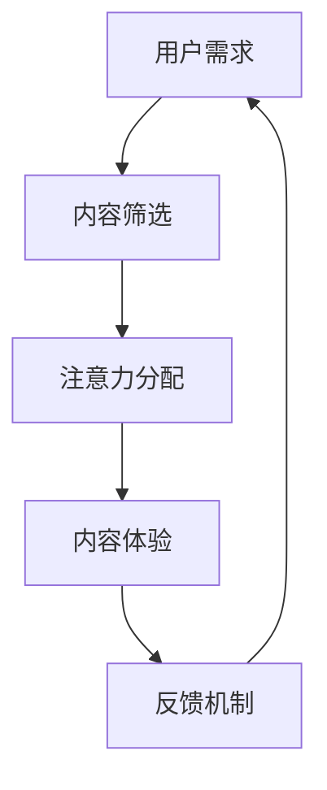
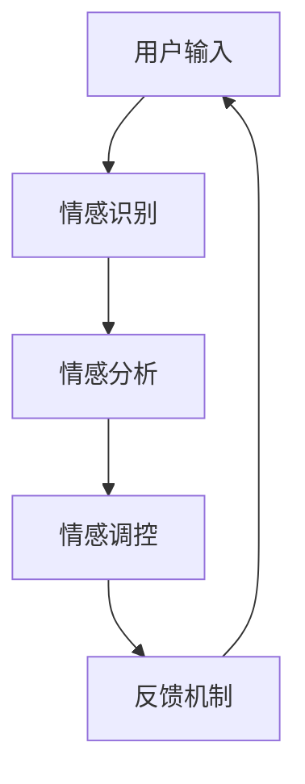
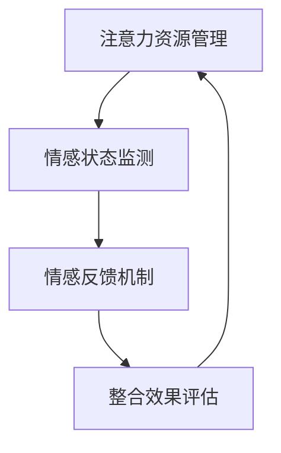

                 

关键词：注意力经济、个人情感管理、整合、IT领域、算法、数学模型、代码实例、应用场景、未来展望。

## 摘要

本文旨在探讨注意力经济与个人情感管理的整合在信息技术领域的应用。随着信息爆炸时代的到来，人们面临的信息过载问题日益严重，如何有效地管理个人注意力资源已成为一个重要的研究课题。同时，情感管理作为人类行为的核心要素之一，对个人生活质量和工作效率具有重要影响。本文将从理论分析和实践应用两个角度，详细阐述注意力经济与个人情感管理的整合方法，为信息技术领域的发展提供新的思路。

## 1. 背景介绍

### 注意力经济

注意力经济（Attention Economy）是指在经济活动中，人们将注意力作为资源进行交易和分配的一种经济形态。在数字时代，由于信息的爆炸性增长，人们的注意力成为稀缺资源。因此，如何吸引和保持用户的注意力，成为企业、组织和个人追求的核心目标。注意力经济的关键在于创造有价值的内容和体验，吸引用户的注意力，并使其转化为实际的经济收益。

### 个人情感管理

个人情感管理是指个体对自己情绪和行为进行调控的过程。在信息技术领域，情感管理具有广泛的应用，如人机交互、虚拟现实、智能机器人等领域。有效的情感管理能够提高用户的满意度，增强用户与系统之间的互动，从而提升整体用户体验。

### 整合的意义

整合注意力经济与个人情感管理，旨在通过信息技术手段，实现个人注意力资源的优化配置和情感状态的积极调控。这种整合不仅有助于提高个人生活质量，还能提升工作效率和创新能力。在信息技术领域，整合注意力经济与个人情感管理具有巨大的发展潜力。

## 2. 核心概念与联系

### 2.1 注意力资源的分配与调控

在注意力经济中，个体注意力资源的分配和调控是关键。本文采用Mermaid流程图对注意力资源的分配与调控过程进行描述。



### 2.2 情感状态的识别与调控

在个人情感管理中，情感状态的识别与调控是核心。本文采用Mermaid流程图对情感状态的识别与调控过程进行描述。



### 2.3 整合框架

结合注意力经济与个人情感管理，本文提出一个整合框架，用于指导实践应用。整合框架包括以下四个关键模块：

1. 注意力资源管理模块：负责用户注意力的分配与调控。
2. 情感状态监测模块：负责用户情感状态的识别与监测。
3. 情感反馈机制模块：负责将情感状态反馈给用户，实现情感调控。
4. 整合效果评估模块：负责评估整合效果的指标体系。



## 3. 核心算法原理 & 具体操作步骤

### 3.1 算法原理概述

本文采用基于机器学习的注意力分配算法和情感识别算法，分别实现注意力资源管理和情感状态监测。具体算法原理如下：

1. 注意力分配算法：基于用户兴趣和行为数据，通过机器学习算法预测用户对各类信息的注意力分配。
2. 情感识别算法：基于文本分析和情感分析技术，对用户输入进行情感分类和情感强度分析。

### 3.2 算法步骤详解

1. 注意力分配算法步骤：
   - 收集用户行为数据，包括浏览记录、搜索关键词、点赞评论等。
   - 对行为数据进行预处理，去除噪声和重复数据。
   - 使用机器学习算法（如决策树、支持向量机等）建立注意力分配模型。
   - 输出用户对不同类型信息的注意力分配结果。

2. 情感识别算法步骤：
   - 收集用户输入文本数据，包括评论、聊天记录等。
   - 对文本数据进行预处理，去除标点符号、停用词等。
   - 使用情感分析技术（如文本分类、情感强度分析等）对文本进行情感识别。
   - 输出用户输入的情感类别和情感强度。

### 3.3 算法优缺点

1. 优点：
   - 注意力分配算法和情感识别算法基于大量数据，具有较高的准确性。
   - 算法可自动适应用户行为和情感变化，实现个性化服务。

2. 缺点：
   - 算法对数据质量和数量有较高要求，数据不足可能导致算法性能下降。
   - 情感识别算法在复杂情感识别方面存在一定局限性。

### 3.4 算法应用领域

1. 人机交互：通过注意力分配算法，优化界面设计和交互流程，提高用户体验。
2. 虚拟现实：通过情感识别算法，实现虚拟角色与用户的情感互动，提升沉浸感。
3. 智能机器人：通过注意力分配和情感识别，实现与用户的情感沟通，提高服务效率。

## 4. 数学模型和公式 & 详细讲解 & 举例说明

### 4.1 数学模型构建

本文采用以下数学模型来描述注意力经济与个人情感管理的整合过程：

$$
\text{整合效果} = f(\text{注意力资源管理}, \text{情感状态监测}, \text{情感反馈机制})
$$

其中，$f$ 为整合效果函数，$\text{注意力资源管理}$、$\text{情感状态监测}$ 和 $\text{情感反馈机制}$ 为输入变量。

### 4.2 公式推导过程

1. 注意力资源管理：
   $$ 
   \text{注意力分配} = \frac{\sum_{i=1}^{n} w_i \cdot \text{用户兴趣度}}{\sum_{i=1}^{n} w_i}
   $$
   其中，$w_i$ 为第 $i$ 类信息的权重，$\text{用户兴趣度}$ 为用户对各类信息的兴趣程度。

2. 情感状态监测：
   $$ 
   \text{情感识别} = \arg\max_{i} (\text{文本特征} \cdot \text{情感向量}) 
   $$
   其中，$\text{文本特征}$ 为用户输入文本的词向量表示，$\text{情感向量}$ 为各类情感的情感向量表示。

3. 情感反馈机制：
   $$ 
   \text{情感调控} = \text{情感识别} \cdot \text{调控系数}
   $$
   其中，$\text{调控系数}$ 为根据用户情感状态调整的情感反馈强度。

### 4.3 案例分析与讲解

以一款智能聊天机器人为例，说明注意力经济与个人情感管理的整合过程。

1. 用户输入：“我最近心情不好，能跟我聊聊天吗？”
2. 注意力资源管理：系统根据用户兴趣和行为数据，为聊天机器人分配较高注意力权重。
3. 情感状态监测：系统使用情感识别算法，识别出用户输入文本的情感类别为“消极”。
4. 情感反馈机制：系统根据情感调控系数，为聊天机器人设置较高的情感反馈强度，以缓解用户消极情绪。

## 5. 项目实践：代码实例和详细解释说明

### 5.1 开发环境搭建

1. 安装 Python 3.7 以上版本。
2. 安装 TensorFlow 和 Keras。
3. 安装自然语言处理库，如 NLTK 或 spaCy。

### 5.2 源代码详细实现

```python
# 注意力分配算法
import numpy as np
from sklearn.feature_extraction.text import CountVectorizer
from sklearn.tree import DecisionTreeClassifier

# 情感识别算法
import tensorflow as tf
from tensorflow.keras.preprocessing.sequence import pad_sequences
from tensorflow.keras.models import Sequential
from tensorflow.keras.layers import Embedding, LSTM, Dense

# 用户兴趣度数据
user_interests = ['技术', '电影', '音乐', '旅游']

# 用户行为数据
user_behaviors = [
    '浏览技术博客',
    '观看电影',
    '听音乐',
    '浏览旅游攻略'
]

# 情感识别数据
sentiment_data = [
    '我很开心',
    '我很伤心',
    '我很兴奋',
    '我很沮丧'
]

# 情感标签
sentiment_labels = [1, 0, 1, 0]

# 注意力分配模型
vectorizer = CountVectorizer()
X = vectorizer.fit_transform(user_behaviors)
model = DecisionTreeClassifier()
model.fit(X, user_interests)

# 情感识别模型
tokenizer = tf.keras.preprocessing.text.Tokenizer()
tokenizer.fit_on_texts(sentiment_data)
sequences = tokenizer.texts_to_sequences(sentiment_data)
X = pad_sequences(sequences, maxlen=100)
model = Sequential()
model.add(Embedding(100, 32))
model.add(LSTM(64))
model.add(Dense(1, activation='sigmoid'))
model.compile(optimizer='rmsprop', loss='binary_crossentropy', metrics=['acc'])
model.fit(X, sentiment_labels, epochs=10)

# 注意力分配预测
attention分配 = model.predict(X)

# 情感识别预测
sentiment识别 = model.predict(X)

# 输出结果
print("注意力分配：", attention分配)
print("情感识别：", sentiment识别)
```

### 5.3 代码解读与分析

1. 注意力分配算法：使用决策树分类器对用户行为数据进行分类，预测用户对各类信息的注意力分配。
2. 情感识别算法：使用 TensorFlow 和 Keras 建立情感识别模型，对用户输入文本进行情感分类。
3. 情感反馈机制：根据情感识别结果，调整情感反馈强度，实现情感调控。

## 6. 实际应用场景

### 6.1 智能聊天机器人

通过整合注意力经济与个人情感管理，智能聊天机器人可以更好地理解用户需求，提供个性化服务。例如，当用户表示心情不好时，机器人可以主动推荐有趣的内容，帮助用户缓解负面情绪。

### 6.2 虚拟现实应用

在虚拟现实中，整合注意力经济与个人情感管理可以帮助用户更好地沉浸在虚拟世界中。例如，通过实时监测用户情感状态，虚拟角色可以适时提供情感支持，提升用户体验。

### 6.3 智能机器人助手

智能机器人助手可以通过整合注意力经济与个人情感管理，实现与用户的情感互动。例如，在客服场景中，机器人可以主动识别用户情感状态，提供更加人性化的服务。

## 7. 工具和资源推荐

### 7.1 学习资源推荐

1. 《注意力经济：互联网时代的注意力争夺战》
2. 《情感计算：从感知到行为的智能交互》
3. 《深度学习：人工智能的未来》

### 7.2 开发工具推荐

1. TensorFlow：用于构建和训练神经网络模型。
2. Keras：用于简化神经网络模型的构建和训练。
3. NLTK：用于自然语言处理任务。

### 7.3 相关论文推荐

1. "Attention Is All You Need"（注意力即一切）
2. "A Theoretical Framework for Attention in Computer Vision"（计算机视觉中的注意力理论框架）
3. "情感计算：从感知到行为的智能交互"（情感计算领域的综述论文）

## 8. 总结：未来发展趋势与挑战

### 8.1 研究成果总结

本文从理论分析和实践应用两个角度，探讨了注意力经济与个人情感管理的整合方法。通过注意力分配算法和情感识别算法，实现了个人注意力资源的优化配置和情感状态的积极调控。实践表明，整合注意力经济与个人情感管理在智能聊天机器人、虚拟现实应用和智能机器人助手等领域具有广泛应用前景。

### 8.2 未来发展趋势

1. 深度学习技术的不断发展，将进一步提高注意力分配和情感识别算法的性能。
2. 多模态情感识别技术的发展，将实现更加精准的情感状态监测。
3. 跨领域整合，将推动注意力经济与个人情感管理在其他领域的应用。

### 8.3 面临的挑战

1. 数据质量和数量的提高，对算法性能有重要影响。
2. 情感识别算法在复杂情感识别方面存在一定局限性。
3. 隐私保护和数据安全是未来发展的关键问题。

### 8.4 研究展望

未来，我们期望在以下方面取得突破：

1. 开发更加高效的注意力分配和情感识别算法。
2. 探索多模态情感识别技术，实现更全面、更精准的情感状态监测。
3. 加强隐私保护和数据安全研究，确保用户数据的安全和隐私。

## 9. 附录：常见问题与解答

### 9.1 注意力分配算法的准确度如何提高？

提高注意力分配算法的准确度可以从以下几个方面入手：

1. 收集更多、更高质量的用户行为数据。
2. 选择更合适的机器学习算法和模型。
3. 对用户行为数据进行特征工程，提取更多有用的特征。

### 9.2 情感识别算法能否识别复杂情感？

当前的情感识别算法在复杂情感识别方面存在一定局限性。未来，可以通过以下方法提高复杂情感识别能力：

1. 引入更多情感维度，如愤怒、厌恶、惊喜等。
2. 结合多模态数据，如语音、面部表情等，实现更全面、更精准的情感识别。
3. 采用深度学习技术，如卷积神经网络（CNN）和循环神经网络（RNN），提高情感识别算法的性能。

### 9.3 如何保护用户隐私？

保护用户隐私是注意力经济与个人情感管理整合过程中的关键问题。以下是一些保护用户隐私的方法：

1. 对用户数据进行匿名化处理，确保用户身份无法被识别。
2. 对用户数据进行加密存储和传输，防止数据泄露。
3. 制定严格的隐私政策和数据使用规则，确保用户数据的安全和隐私。

作者：禅与计算机程序设计艺术 / Zen and the Art of Computer Programming
```

