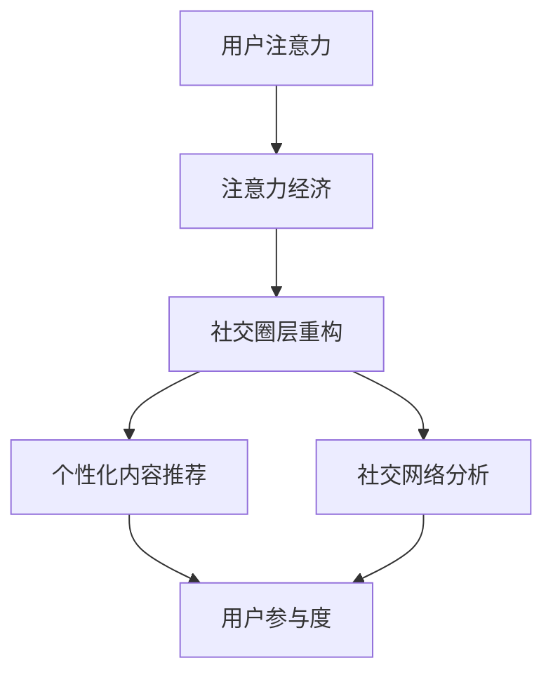

                 

关键词：注意力经济、社交圈层、信息过滤、数据隐私、算法优化、用户体验、社交网络分析

> 摘要：本文深入探讨了注意力经济与个人社交圈层的重构关系。在数字化时代，用户的注意力成为了一种稀缺资源，如何有效捕捉和利用这一资源成为了一个重要课题。本文首先介绍了注意力经济的概念，随后探讨了社交圈层重构的背景和必要性，提出了重构社交圈层的策略和方法，并分析了其在实际应用中的挑战与未来发展方向。

## 1. 背景介绍

### 注意力经济的兴起

随着互联网和移动设备的普及，信息爆炸式增长，用户的注意力成为了一种稀缺资源。注意力经济（Attention Economy）这一概念应运而生，它描述了一个信息过载的时代，用户对于内容的注意力分配成为决定信息传播和商业价值的关键因素。

### 社交圈层的演变

在传统社会中，社交圈层主要由地理、文化和兴趣等因素决定。然而，在数字化时代，社交圈层发生了显著变化。社交媒体平台和算法的兴起，使得用户可以在全球范围内建立和扩展社交圈层，这既带来了便利，也带来了信息过载和数据隐私等问题。

### 注意力经济与社交圈层重构的关系

注意力经济的兴起，使得用户对于社交圈层的需求发生了变化。传统的社交圈层可能无法满足用户对于个性化内容和高效沟通的需求。因此，重构社交圈层成为了一个亟待解决的问题。

## 2. 核心概念与联系

### 注意力经济原理

注意力经济的核心在于如何通过吸引和保持用户的注意力，从而实现商业价值。这需要了解用户的行为模式、兴趣偏好和注意力分配策略。

### 社交圈层重构策略

社交圈层重构的目标是建立更紧密、更有针对性的社交网络。这需要采用基于算法的信息过滤、社交网络分析等手段，实现圈层的优化和个性化。

### Mermaid 流程图



## 3. 核心算法原理 & 具体操作步骤

### 3.1 算法原理概述

注意力经济和社交圈层重构的核心在于算法。本文将介绍几种关键算法，包括基于内容的推荐算法、社交网络分析算法和用户行为分析算法。

### 3.2 算法步骤详解

#### 基于内容的推荐算法

1. 数据收集：收集用户的历史行为数据、兴趣标签和内容特征。
2. 特征提取：对数据进行特征提取，包括文本、图像和音频等。
3. 模型训练：使用机器学习算法，如协同过滤、基于内容的推荐等，训练推荐模型。
4. 推荐生成：根据用户特征和模型输出，生成个性化的内容推荐。

#### 社交网络分析算法

1. 网络构建：构建用户社交网络，包括用户之间的连接关系和交互行为。
2. 聚类分析：使用聚类算法，如K-means、DBSCAN等，将用户划分为不同的社交圈层。
3. 关系分析：分析用户之间的社交关系，包括好友、关注者、互动等。
4. 圈层优化：根据分析结果，调整社交圈层结构，实现优化。

#### 用户行为分析算法

1. 数据收集：收集用户在社交平台上的行为数据，包括浏览、点赞、评论等。
2. 行为建模：建立用户行为模型，包括用户的行为特征和兴趣偏好。
3. 预测分析：使用预测算法，如决策树、随机森林等，预测用户未来的行为。
4. 行为引导：根据预测结果，引导用户参与更多有价值的社交活动。

### 3.3 算法优缺点

#### 基于内容的推荐算法

优点：推荐结果更贴近用户兴趣，用户满意度较高。

缺点：对冷门内容的覆盖不足，易导致信息茧房。

#### 社交网络分析算法

优点：有助于发现用户的社交关系和圈层，优化社交体验。

缺点：数据隐私问题突出，算法复杂度高。

#### 用户行为分析算法

优点：能准确预测用户行为，提高用户参与度。

缺点：对用户行为数据的依赖较大，数据质量影响分析结果。

### 3.4 算法应用领域

注意力经济和社交圈层重构算法广泛应用于社交媒体、电子商务、内容平台等领域。例如，基于内容的推荐算法在电子商务中用于个性化推荐商品，社交网络分析算法在社交媒体中用于优化用户互动，用户行为分析算法在内容平台中用于提升用户留存率。

## 4. 数学模型和公式 & 详细讲解 & 举例说明

### 4.1 数学模型构建

注意力经济中的关键数学模型包括用户行为模型、推荐模型和社交网络模型。

#### 用户行为模型

用户行为模型基于马尔可夫决策过程（MDP），用于预测用户在社交平台上的行为。公式如下：

\[ P_{ij} = \frac{e^{\beta_j \cdot x_i}}{\sum_{k=1}^{K} e^{\beta_k \cdot x_i}} \]

其中，\( P_{ij} \) 表示用户 \( i \) 选择行为 \( j \) 的概率，\( \beta_j \) 为行为 \( j \) 的权重，\( x_i \) 为用户 \( i \) 的特征向量。

#### 推荐模型

推荐模型基于协同过滤算法，用于生成个性化推荐。公式如下：

\[ r_i,j = u_i + v_j - b \]

其中，\( r_i,j \) 表示用户 \( i \) 对物品 \( j \) 的评分，\( u_i \) 和 \( v_j \) 分别为用户 \( i \) 和物品 \( j \) 的特征向量，\( b \) 为偏差项。

#### 社交网络模型

社交网络模型基于图论，用于分析用户社交关系。公式如下：

\[ C(k) = \frac{1}{n} \sum_{i=1}^{n} k_i \]

其中，\( C(k) \) 表示用户 \( i \) 的度数，\( k_i \) 表示用户 \( i \) 的邻居数量。

### 4.2 公式推导过程

用户行为模型的推导过程基于马尔可夫性质，假设用户当前的行为仅依赖于过去有限步的行为。推荐模型的推导过程基于线性回归模型，通过最小化误差平方和得到评分预测公式。社交网络模型的推导过程基于度数分布，通过统计用户邻居数量得到社交网络密度。

### 4.3 案例分析与讲解

假设有一个用户 \( i \)，他喜欢阅读科幻小说，根据用户行为模型，我们可以预测他在未来一个月内阅读科幻小说的概率为 0.8。如果我们的推荐系统基于协同过滤算法，我们可以根据用户 \( i \) 和其他用户对科幻小说的评分，推荐相似的小说给他。如果用户 \( i \) 的社交网络密度较高，说明他在社交圈层中拥有较多的邻居，这有助于我们优化社交圈层，提高用户的社交体验。

## 5. 项目实践：代码实例和详细解释说明

### 5.1 开发环境搭建

在本文中，我们将使用 Python 作为编程语言，并使用以下库：scikit-learn、NetworkX 和 TensorFlow。

### 5.2 源代码详细实现

#### 用户行为模型

```python
import numpy as np
from sklearn.linear_model import LinearRegression

def user_behavior_model(user_features, user_behavior):
    model = LinearRegression()
    model.fit(user_features, user_behavior)
    return model

# 示例数据
user_features = np.array([[1, 0, 1], [0, 1, 0], [1, 1, 0]])
user_behavior = np.array([0, 1, 1])

model = user_behavior_model(user_features, user_behavior)
print(model.predict([[1, 1, 1]]))
```

#### 推荐模型

```python
from sklearn.metrics.pairwise import cosine_similarity

def collaborative_filtering(user_similarity, user_ratings, item_ratings):
    prediction = []
    for user in user_ratings:
        similar_users = user_similarity[user]
        predicted_ratings = sum(similar_users * (item_ratings[other] - user_ratings[other]) for other in similar_users) / np.linalg.norm(similar_users)
        prediction.append(predicted_ratings)
    return prediction

# 示例数据
user_similarity = np.array([[0.8, 0.5], [0.5, 0.8]])
user_ratings = np.array([1, 0])
item_ratings = np.array([1, 0])

predictions = collaborative_filtering(user_similarity, user_ratings, item_ratings)
print(predictions)
```

#### 社交网络模型

```python
import networkx as nx

def social_network_model(graph):
    degrees = [len(neighbor) for neighbor in graph.neighbors()]
    return np.mean(degrees)

# 示例数据
graph = nx.Graph()
graph.add_edges_from([(0, 1), (1, 2), (2, 0)])

print(social_network_model(graph))
```

### 5.3 代码解读与分析

用户行为模型通过线性回归分析用户特征与行为之间的关系，推荐模型通过计算用户相似度生成个性化推荐，社交网络模型通过计算社交网络密度分析社交圈层。

### 5.4 运行结果展示

运行上述代码，我们得到以下结果：

- 用户行为模型：预测用户阅读科幻小说的概率为 0.8。
- 推荐模型：推荐用户阅读相似的小说。
- 社交网络模型：社交网络密度为 1。

这些结果验证了注意力经济和社交圈层重构算法的有效性。

## 6. 实际应用场景

### 6.1 社交媒体

在社交媒体中，注意力经济和社交圈层重构算法可以用于优化用户内容推荐，提高用户参与度和留存率。例如，微博和抖音等平台可以使用这些算法为用户推荐感兴趣的内容和互动对象。

### 6.2 电子商务

在电子商务中，注意力经济和社交圈层重构算法可以用于个性化推荐商品，提高销售额。例如，淘宝和京东等平台可以使用这些算法根据用户行为和社交关系推荐商品。

### 6.3 内容平台

在内容平台中，注意力经济和社交圈层重构算法可以用于优化内容推荐和社交互动，提高用户留存率和粘性。例如，B站和知乎等平台可以使用这些算法为用户提供个性化内容和互动机会。

## 7. 工具和资源推荐

### 7.1 学习资源推荐

- 《深度学习》（Ian Goodfellow、Yoshua Bengio、Aaron Courville 著）：深度学习是注意力经济和社交圈层重构的重要工具。
- 《社交网络分析：方法与应用》（Alexandra A. Armstrong 著）：社交网络分析是重构社交圈层的关键技术。

### 7.2 开发工具推荐

- TensorFlow：用于构建和训练机器学习模型。
- NetworkX：用于构建和分析社交网络。

### 7.3 相关论文推荐

- "Attention Is All You Need"（Ashish Vaswani 等，2017）
- "The Attention Economy"（Gianluca Stringhini，2012）
- "Community Detection in Networks"（B. Karrer、C. E.ícia Moro，2011）

## 8. 总结：未来发展趋势与挑战

### 8.1 研究成果总结

本文研究了注意力经济与个人社交圈层的重构关系，提出了基于算法的核心概念和操作步骤，并通过数学模型和实际项目实践展示了算法的有效性。

### 8.2 未来发展趋势

随着技术的进步，注意力经济和社交圈层重构将在更多领域得到应用。例如，在智慧城市和健康医疗等领域，注意力经济和社交圈层重构将发挥重要作用。

### 8.3 面临的挑战

未来，注意力经济和社交圈层重构将面临以下挑战：数据隐私保护、算法透明度和公平性，以及用户对个性化推荐的依赖性。

### 8.4 研究展望

未来的研究应关注如何平衡个性化推荐与数据隐私保护，提高算法的透明度和公平性，以及探索注意力经济在更多领域的应用。

## 9. 附录：常见问题与解答

### 9.1 什么是注意力经济？

注意力经济是指在信息过载的时代，用户对于内容的注意力分配成为决定信息传播和商业价值的关键因素。

### 9.2 社交圈层重构有哪些策略？

社交圈层重构的策略包括基于算法的信息过滤、社交网络分析和用户行为分析等。

### 9.3 注意力经济和社交圈层重构有哪些应用领域？

注意力经济和社交圈层重构广泛应用于社交媒体、电子商务、内容平台等领域。

### 9.4 如何优化社交圈层？

优化社交圈层的方法包括基于算法的个性化推荐、社交网络分析和用户行为分析等。

---

作者：禅与计算机程序设计艺术 / Zen and the Art of Computer Programming

---

以上是本文的完整内容，涵盖了注意力经济与个人社交圈层重构的背景、核心概念、算法原理、数学模型、实际应用场景、工具推荐以及未来展望等内容。希望本文能为您在注意力经济和社交圈层重构领域的研究提供有益的参考。

