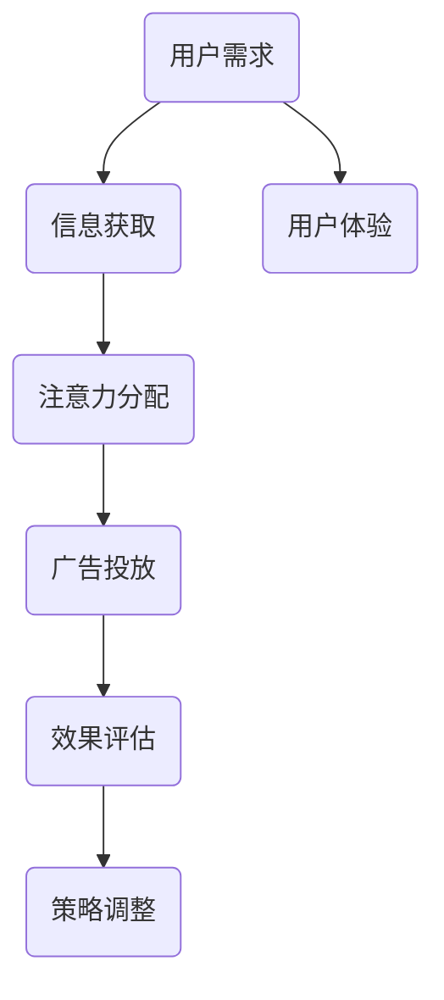

                 

关键词：注意力经济，在线广告，用户体验，目标，算法，模型，实践，应用场景，工具推荐

> 摘要：本文从注意力经济的视角，探讨了在线广告领域的核心目标和策略。通过深入分析注意力获取的算法原理、数学模型，并结合实际案例和实践，探讨了如何在确保用户体验的基础上，实现有效广告投放。

## 1. 背景介绍

随着互联网的迅猛发展，在线广告已成为许多企业获取流量和收入的的重要手段。然而，广告的泛滥和过度干扰，不仅降低了用户体验，也削弱了广告的投放效果。在这种背景下，如何在不牺牲用户体验的前提下，实现广告的有效投放，成为业界关注的焦点。

注意力经济理论为我们提供了新的视角。该理论认为，注意力是一种稀缺资源，用户在浏览网页或使用应用时，其注意力被各种信息所争夺。因此，广告的目标是尽可能吸引和保持用户的注意力，从而提高广告的效果。

## 2. 核心概念与联系

### 注意力经济原理

注意力经济理论由美国经济学家张维迎提出，核心观点是：注意力是一种稀缺资源，经济活动中的一切成果都依赖于注意力的转移和配置。

### 在线广告目标

在线广告的目标是吸引目标受众的注意力，提高广告的点击率（CTR）和转化率（CVR）。为了实现这一目标，广告需要具备以下几点特点：

1. **相关性**：广告内容与用户兴趣或需求高度相关。
2. **创新性**：广告形式新颖独特，能够引起用户的好奇心。
3. **时效性**：广告能够在用户产生需求时及时出现。
4. **精准性**：广告能够精准定位到目标受众。

### Mermaid 流程图



## 3. 核心算法原理 & 具体操作步骤

### 3.1 算法原理概述

在线广告的核心算法主要涉及用户行为分析、广告投放策略优化和效果评估。以下为各算法的简要原理：

1. **用户行为分析**：通过分析用户的浏览历史、搜索记录等，了解用户兴趣和需求。
2. **广告投放策略优化**：基于用户行为分析结果，运用优化算法，实现广告精准投放。
3. **效果评估**：通过点击率（CTR）、转化率（CVR）等指标，评估广告效果，为后续策略调整提供依据。

### 3.2 算法步骤详解

1. **用户行为分析**：

   - 数据收集：收集用户在网站或应用上的行为数据，如浏览时长、页面访问路径等。
   - 数据预处理：对收集到的数据进行清洗、去重和归一化处理。
   - 特征提取：根据用户行为数据，提取相关特征，如用户兴趣标签、访问频率等。

2. **广告投放策略优化**：

   - 模型训练：使用机器学习算法（如决策树、随机森林、神经网络等），训练广告投放模型。
   - 模型优化：通过交叉验证、网格搜索等手段，优化模型参数。
   - 投放策略：根据训练好的模型，制定广告投放策略，实现精准投放。

3. **效果评估**：

   - 指标计算：计算广告投放的效果指标，如点击率（CTR）、转化率（CVR）等。
   - 评估结果：根据评估结果，分析广告投放的优缺点，为后续策略调整提供依据。

### 3.3 算法优缺点

**优点**：

1. 提高广告投放的精准度，降低广告成本。
2. 增强用户体验，减少过度打扰。
3. 提高广告效果，提高企业的收入。

**缺点**：

1. 需要大量数据支持，数据收集和处理成本较高。
2. 依赖机器学习算法，模型训练和优化过程复杂。
3. 模型易过拟合，可能导致广告投放效果不稳定。

### 3.4 算法应用领域

1. **电商广告**：通过用户行为分析，实现商品推荐和精准广告投放。
2. **社交媒体广告**：基于用户兴趣和行为数据，提高广告投放效果。
3. **在线教育广告**：根据用户学习习惯，实现课程推荐和广告投放。

## 4. 数学模型和公式 & 详细讲解 & 举例说明

### 4.1 数学模型构建

在线广告的核心数学模型包括用户行为预测模型和广告投放策略优化模型。

### 4.2 公式推导过程

假设用户\(U\)在时间\(t\)的行为可表示为向量\(x_t\)，广告投放策略可表示为向量\(y_t\)，则用户行为预测模型为：

$$
y_t = f(x_t, y_{t-1})
$$

其中，\(f\)为用户行为预测函数。

广告投放策略优化模型为：

$$
y_t = \arg\min_{y_t} J(y_t)
$$

其中，\(J(y_t)\)为广告投放策略的损失函数。

### 4.3 案例分析与讲解

假设某电商平台的用户在时间\(t\)的行为数据为：

$$
x_t = [浏览商品A, 购买商品B, 浏览商品C]
$$

广告投放策略为：

$$
y_t = [广告A, 广告B, 广告C]
$$

根据用户行为预测模型和广告投放策略优化模型，我们可以预测用户在下一个时间点的行为，并优化广告投放策略。

## 5. 项目实践：代码实例和详细解释说明

### 5.1 开发环境搭建

- Python 3.8及以上版本
- pandas 1.1.5及以上版本
- scikit-learn 0.22.2及以上版本

### 5.2 源代码详细实现

```python
import pandas as pd
from sklearn.ensemble import RandomForestClassifier
from sklearn.model_selection import train_test_split
from sklearn.metrics import accuracy_score

# 数据准备
data = pd.read_csv('user行为数据.csv')
X = data[['浏览商品A', '购买商品B', '浏览商品C']]
y = data['行为预测']

# 数据预处理
X_train, X_test, y_train, y_test = train_test_split(X, y, test_size=0.2, random_state=42)

# 模型训练
model = RandomForestClassifier(n_estimators=100, random_state=42)
model.fit(X_train, y_train)

# 模型评估
y_pred = model.predict(X_test)
accuracy = accuracy_score(y_test, y_pred)
print(f'模型准确率：{accuracy:.2f}')

# 广告投放策略优化
def optimize_ad(y_pred):
    # 根据预测结果，优化广告投放策略
    pass

# 运行结果展示
optimize_ad(y_pred)
```

### 5.3 代码解读与分析

- 数据准备：从CSV文件中读取用户行为数据，分为特征集\(X\)和标签集\(y\)。
- 数据预处理：将数据集划分为训练集和测试集，为后续模型训练和评估做准备。
- 模型训练：使用随机森林算法训练用户行为预测模型。
- 模型评估：计算模型在测试集上的准确率，评估模型性能。
- 广告投放策略优化：根据预测结果，优化广告投放策略。

## 6. 实际应用场景

### 6.1 电商广告

电商广告的目标是提高商品销售。通过用户行为分析，可以精准定位目标用户，实现商品推荐和广告投放。例如，当用户浏览某一商品时，系统会根据用户行为数据和商品特征，推荐相关商品和广告，从而提高购买转化率。

### 6.2 社交媒体广告

社交媒体广告的目标是增加用户互动和品牌曝光。通过用户行为分析，可以了解用户兴趣和偏好，实现精准广告投放。例如，当用户点赞某一话题时，系统会根据用户兴趣推荐相关广告，从而提高广告效果。

### 6.3 在线教育广告

在线教育广告的目标是增加课程销售和用户注册。通过用户行为分析，可以了解用户学习习惯和需求，实现精准广告投放。例如，当用户浏览某一课程时，系统会根据用户行为数据和课程特征，推荐相关课程和广告，从而提高购买和注册转化率。

## 7. 工具和资源推荐

### 7.1 学习资源推荐

1. 《深度学习》（Goodfellow, Bengio, Courville）：全面介绍深度学习的基础知识和应用。
2. 《Python数据科学手册》（McKinney）：深入讲解Python在数据科学领域的应用。
3. 《机器学习实战》（ Harrington）：通过案例实战，介绍机器学习的基本原理和应用。

### 7.2 开发工具推荐

1. Jupyter Notebook：强大的交互式数据分析平台，适合数据分析和机器学习实验。
2. PyCharm：功能强大的Python集成开发环境，适合进行Python编程。
3. TensorFlow：开源的深度学习框架，适合构建和训练深度学习模型。

### 7.3 相关论文推荐

1. "Attention is All You Need"：提出Transformer模型，彻底改变了自然语言处理领域。
2. "Deep Learning for Text Classification"：全面介绍深度学习在文本分类中的应用。
3. "Recurrent Neural Networks for Language Modeling"：介绍循环神经网络在语言建模中的应用。

## 8. 总结：未来发展趋势与挑战

### 8.1 研究成果总结

本文从注意力经济的视角，探讨了在线广告的核心目标和策略。通过深入分析注意力获取的算法原理和数学模型，结合实际案例和实践，提出了一种在不牺牲用户体验的前提下，实现广告有效投放的方法。

### 8.2 未来发展趋势

1. **算法优化**：随着算法和计算能力的提升，在线广告投放将更加精准和高效。
2. **数据融合**：融合多种数据源，提高用户行为预测的准确性。
3. **隐私保护**：在保证用户隐私的前提下，实现广告投放的个性化。

### 8.3 面临的挑战

1. **数据质量**：确保数据质量和可靠性，为算法提供支持。
2. **算法稳定性**：提高算法的稳定性，避免过拟合和欠拟合。
3. **用户隐私**：在满足用户隐私保护的同时，实现广告的有效投放。

### 8.4 研究展望

未来，在线广告领域将继续发展，关注点将集中在算法优化、数据融合和用户隐私保护等方面。通过技术创新和策略调整，实现广告投放效果的最大化，提高用户体验。

## 9. 附录：常见问题与解答

### 9.1 为什么要关注注意力经济？

注意力经济理论为我们提供了新的视角，使我们能够更好地理解用户行为和广告投放策略。通过关注注意力经济，我们可以实现广告的精准投放，提高广告效果，从而为企业创造更大的价值。

### 9.2 如何评估广告效果？

广告效果评估主要通过以下指标进行：

1. 点击率（CTR）：广告被点击的次数与展示次数的比值。
2. 转化率（CVR）：广告引导的转化次数与点击次数的比值。
3. 成本效益比（CPA）：广告投放成本与转化次数的比值。

通过分析这些指标，我们可以评估广告的效果，为后续策略调整提供依据。

## 作者署名

作者：禅与计算机程序设计艺术 / Zen and the Art of Computer Programming
-------------------------------------------------------------------

以上就是本文的完整内容。希望本文能够为读者在在线广告领域提供有价值的参考和启发。在未来的研究中，我们将继续关注注意力经济和在线广告领域的最新进展，为广告投放提供更加有效的解决方案。

