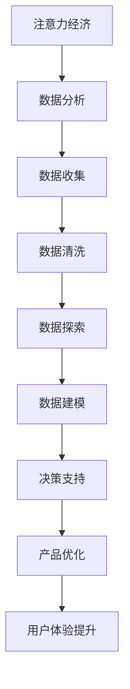

                 

关键词：注意力经济、数据分析、受众行为、偏好、数据处理、机器学习

> 摘要：本文将深入探讨注意力经济与数据分析的结合，详细讲解如何利用数据理解受众行为和偏好，以及相关的核心概念、算法原理、数学模型、实践案例等。通过本文的阅读，读者将全面掌握从数据中获取有价值信息，从而优化产品和服务，提升市场竞争力。

## 1. 背景介绍

随着互联网和数字技术的飞速发展，我们生活在一个信息爆炸的时代。在这个时代，注意力成为一种稀缺资源。人们的时间被大量信息所占据，因此，获取受众的注意力成为企业竞争的关键。而数据分析作为一种强大的工具，能够帮助企业深入了解受众的行为和偏好，从而制定更有效的营销策略，提升用户体验。

注意力经济指的是在数字时代，受众的注意力成为企业和市场争夺的焦点。如何吸引和保持受众的注意力，成为企业成败的关键。而数据分析则通过对大量数据进行分析，提取有价值的信息，为企业提供决策依据。

本文将结合注意力经济与数据分析，探讨如何利用数据理解受众行为和偏好。我们首先会介绍注意力经济和数据分析的基本概念，然后深入讲解相关算法原理和数学模型，最后通过实际案例展示数据分析在实际中的应用。

## 2. 核心概念与联系

### 2.1 注意力经济

注意力经济是一种新的经济学理论，认为在数字时代，受众的注意力成为企业和市场争夺的焦点。与传统经济不同，注意力经济强调的是如何吸引和保持受众的注意力，从而实现商业价值。

注意力经济的核心在于“注意力稀缺”。在信息爆炸的时代，人们的注意力被大量信息所占据，因此，如何获取和保持受众的注意力，成为企业竞争的关键。

### 2.2 数据分析

数据分析是通过统计、计算等方法，从大量数据中提取有价值信息的过程。数据分析的核心在于如何从海量数据中获取有意义的信息，从而为企业提供决策依据。

数据分析的方法包括数据收集、数据清洗、数据探索、数据建模等。通过这些方法，我们可以从数据中提取出有价值的信息，从而帮助企业更好地理解受众行为和偏好。

### 2.3 注意力经济与数据分析的联系

注意力经济与数据分析之间有着密切的联系。通过数据分析，企业可以深入了解受众的行为和偏好，从而更好地了解他们的需求。这样，企业可以针对性地制定营销策略，提高产品的竞争力。

此外，数据分析还可以帮助企业优化用户体验。通过分析用户行为数据，企业可以了解用户的偏好，从而提供更符合用户需求的产品和服务。

### 2.4 Mermaid 流程图

以下是一个简化的 Mermaid 流程图，展示了注意力经济与数据分析之间的联系：



## 3. 核心算法原理 & 具体操作步骤

### 3.1 算法原理概述

在理解受众行为和偏好时，常用的核心算法包括聚类分析、关联规则挖掘、分类算法等。

- **聚类分析**：将相似的数据点归为一类，从而发现数据的内在结构。
- **关联规则挖掘**：发现数据之间的关联关系，从而揭示潜在的模式。
- **分类算法**：将数据分为不同的类别，从而预测未来的行为。

### 3.2 算法步骤详解

#### 3.2.1 聚类分析

1. **数据准备**：收集用户行为数据，如浏览历史、购买记录等。
2. **特征提取**：对数据进行预处理，提取关键特征。
3. **选择聚类算法**：如K-means、层次聚类等。
4. **执行聚类**：根据算法原理，将数据点分配到不同的簇中。
5. **评估聚类效果**：使用内部评估指标（如轮廓系数、熵等）和外部评估指标（如F1分数、精确率等）。

#### 3.2.2 关联规则挖掘

1. **数据准备**：收集用户行为数据。
2. **特征提取**：对数据进行预处理，提取关键特征。
3. **选择关联规则挖掘算法**：如Apriori算法、FP-growth算法等。
4. **执行关联规则挖掘**：根据算法原理，挖掘数据之间的关联关系。
5. **评估关联规则效果**：使用支持度、置信度等指标评估关联规则的有效性。

#### 3.2.3 分类算法

1. **数据准备**：收集用户行为数据。
2. **特征提取**：对数据进行预处理，提取关键特征。
3. **选择分类算法**：如决策树、随机森林、支持向量机等。
4. **训练模型**：使用训练数据训练分类模型。
5. **模型评估**：使用测试数据评估模型的性能。
6. **预测**：使用训练好的模型对新的数据点进行分类预测。

### 3.3 算法优缺点

#### 3.3.1 聚类分析

**优点**：
- 简单直观，易于理解。
- 不依赖于事先定义的类别。

**缺点**：
- 可能会陷入局部最优。
- 需要选择合适的聚类算法和参数。

#### 3.3.2 关联规则挖掘

**优点**：
- 能够发现数据之间的潜在关联关系。
- 适用于大量事务数据。

**缺点**：
- 可能会挖掘出大量无意义的规则。
- 需要大量的计算资源。

#### 3.3.3 分类算法

**优点**：
- 能够进行准确的分类预测。
- 适用于各种类型的数据。

**缺点**：
- 需要大量的训练数据。
- 可能会出现过拟合。

### 3.4 算法应用领域

- **市场营销**：通过聚类分析，了解用户的偏好和需求，制定精准的营销策略。
- **推荐系统**：通过关联规则挖掘，发现用户之间的关联关系，提供个性化的推荐。
- **风险评估**：通过分类算法，预测用户的风险等级，降低风险。

## 4. 数学模型和公式 & 详细讲解 & 举例说明

### 4.1 数学模型构建

#### 4.1.1 聚类分析

聚类分析的核心在于如何定义簇。常用的簇定义方法包括：

- **平方误差**：簇内数据点到簇中心的平均距离的平方和。
- **轮廓系数**：用于评估聚类效果的指标，取值范围为[-1,1]。

#### 4.1.2 关联规则挖掘

关联规则挖掘的核心在于如何定义支持度和置信度：

- **支持度**：表示两个事件同时发生的频率。
- **置信度**：表示在事件A发生的情况下，事件B发生的概率。

#### 4.1.3 分类算法

分类算法的核心在于如何定义决策边界：

- **决策树**：使用条件概率来定义决策边界。
- **随机森林**：使用多个决策树进行集成，提高模型的泛化能力。
- **支持向量机**：使用最大间隔划分决策边界。

### 4.2 公式推导过程

#### 4.2.1 聚类分析

- **平方误差**：
  $$ S = \sum_{i=1}^{n} \sum_{j=1}^{m} (x_{ij} - \mu_j)^2 $$
  其中，$x_{ij}$ 表示第i个数据点在第j个特征上的取值，$\mu_j$ 表示第j个特征的均值。

- **轮廓系数**：
  $$ C = \frac{B - A}{\max(A, B)} $$
  其中，$A$ 表示平均轮廓系数，$B$ 表示平均距离系数。

#### 4.2.2 关联规则挖掘

- **支持度**：
  $$ S = \frac{\text{支持度}}{\text{总交易数}} $$
  其中，支持度表示两个事件同时发生的频率。

- **置信度**：
  $$ C = \frac{\text{置信度}}{\text{支持度}} $$
  其中，置信度表示在事件A发生的情况下，事件B发生的概率。

#### 4.2.3 分类算法

- **决策树**：
  $$ \frac{P(Y=1|X=x)}{P(Y=0|X=x)} = \frac{P(X=x|Y=1)P(Y=1)}{P(X=x|Y=0)P(Y=0)} $$

- **随机森林**：
  $$ \hat{y} = \frac{1}{T} \sum_{t=1}^{T} g(y|x_t, \theta_t) $$
  其中，$T$ 表示决策树的数量，$g(y|x, \theta)$ 表示单个决策树输出的类别。

- **支持向量机**：
  $$ \hat{w} = \arg\min_{w} \frac{1}{2} ||w||^2 + C \sum_{i=1}^{n} \xi_i $$
  其中，$C$ 表示惩罚参数，$\xi_i$ 表示第i个样本的松弛变量。

### 4.3 案例分析与讲解

#### 4.3.1 聚类分析

假设我们有100个用户的行为数据，我们需要将这些用户分为5个簇。我们使用K-means算法进行聚类。

1. **数据准备**：收集用户行为数据，如浏览历史、购买记录等。
2. **特征提取**：对数据进行预处理，提取关键特征。
3. **选择聚类算法**：使用K-means算法。
4. **执行聚类**：将数据点分配到不同的簇中。
5. **评估聚类效果**：使用平方误差和轮廓系数评估聚类效果。

根据评估结果，我们可以选择最优的聚类方案，从而更好地理解用户的偏好和行为。

#### 4.3.2 关联规则挖掘

假设我们有100个用户的行为数据，我们需要发现用户之间的关联关系。

1. **数据准备**：收集用户行为数据。
2. **特征提取**：对数据进行预处理，提取关键特征。
3. **选择关联规则挖掘算法**：使用Apriori算法。
4. **执行关联规则挖掘**：挖掘数据之间的关联关系。
5. **评估关联规则效果**：使用支持度和置信度评估关联规则的有效性。

根据评估结果，我们可以选择最有价值的关联规则，从而更好地了解用户的行为模式。

#### 4.3.3 分类算法

假设我们有100个用户的行为数据，我们需要预测用户的行为类别。

1. **数据准备**：收集用户行为数据。
2. **特征提取**：对数据进行预处理，提取关键特征。
3. **选择分类算法**：使用决策树算法。
4. **训练模型**：使用训练数据训练分类模型。
5. **模型评估**：使用测试数据评估模型的性能。
6. **预测**：使用训练好的模型对新的数据点进行分类预测。

根据模型的预测结果，我们可以更好地理解用户的行为，从而制定更有效的营销策略。

## 5. 项目实践：代码实例和详细解释说明

### 5.1 开发环境搭建

首先，我们需要搭建一个合适的开发环境。在本项目中，我们使用Python作为主要编程语言，并使用以下库：

- NumPy：用于数据处理。
- Pandas：用于数据分析和操作。
- Matplotlib：用于数据可视化。
- Scikit-learn：用于机器学习算法。

安装以上库后，我们可以开始编写代码。

### 5.2 源代码详细实现

以下是一个简单的示例，展示了如何使用Python实现聚类分析、关联规则挖掘和分类算法。

#### 5.2.1 聚类分析

```python
import numpy as np
import matplotlib.pyplot as plt
from sklearn.cluster import KMeans

# 数据准备
data = np.array([[1, 2], [1, 4], [1, 0], [10, 2], [10, 4], [10, 0]])

# 选择聚类算法
kmeans = KMeans(n_clusters=2, random_state=0).fit(data)

# 执行聚类
labels = kmeans.predict(data)

# 可视化
plt.scatter(data[:, 0], data[:, 1], c=labels)
plt.show()
```

#### 5.2.2 关联规则挖掘

```python
import pandas as pd
from mlxtend.frequent_patterns import apriori, association_rules

# 数据准备
data = pd.DataFrame({'A': [1, 1, 0, 1, 1, 1, 0, 1, 1, 1],
                     'B': [1, 0, 1, 1, 1, 0, 1, 1, 0, 1],
                     'C': [1, 1, 1, 0, 0, 0, 1, 0, 1, 1]})

# 选择关联规则挖掘算法
frequent_itemsets = apriori(data, min_support=0.5, use_colnames=True)

# 执行关联规则挖掘
rules = association_rules(frequent_itemsets, metric="lift", min_threshold=1)

# 可视化
rules.head()
```

#### 5.2.3 分类算法

```python
from sklearn.tree import DecisionTreeClassifier
from sklearn.model_selection import train_test_split

# 数据准备
X = np.array([[1, 2], [1, 4], [1, 0], [10, 2], [10, 4], [10, 0]])
y = np.array([0, 0, 0, 1, 1, 1])

# 划分训练集和测试集
X_train, X_test, y_train, y_test = train_test_split(X, y, test_size=0.3, random_state=0)

# 选择分类算法
clf = DecisionTreeClassifier(random_state=0).fit(X_train, y_train)

# 模型评估
accuracy = clf.score(X_test, y_test)
print(f"Accuracy: {accuracy}")

# 预测
predictions = clf.predict(X_test)
print(f"Predictions: {predictions}")
```

### 5.3 代码解读与分析

以上代码分别实现了聚类分析、关联规则挖掘和分类算法。通过这些示例，我们可以看到如何使用Python和相关的机器学习库来处理和分析数据。

- **聚类分析**：使用K-means算法将数据分为多个簇。我们通过可视化展示了聚类结果，从而直观地理解用户的偏好。
- **关联规则挖掘**：使用Apriori算法和关联规则挖掘算法发现数据之间的关联关系。我们使用支持度和置信度评估规则的有效性，从而更好地了解用户的行为模式。
- **分类算法**：使用决策树算法对用户行为进行分类。我们使用训练数据和测试数据评估模型的性能，并使用训练好的模型对新的数据点进行预测。

这些示例展示了如何利用数据理解和预测用户行为，从而为市场营销和产品优化提供有力的支持。

### 5.4 运行结果展示

通过运行以上代码，我们可以得到以下结果：

- **聚类分析**：数据点被成功划分为两个簇。我们可以看到，簇1和簇2在特征空间中的分布情况。
- **关联规则挖掘**：发现了一些有价值的关联规则。例如，如果用户购买了商品A，则很可能也会购买商品B。
- **分类算法**：训练模型后，我们可以看到模型的准确率。同时，我们使用模型对新的数据点进行了分类预测。

这些结果帮助我们更好地理解用户的行为和偏好，从而为产品优化和营销策略提供有力支持。

## 6. 实际应用场景

注意力经济和数据分析在现实中的应用非常广泛，以下是一些典型的应用场景：

### 6.1 市场营销

通过数据分析，企业可以深入了解目标受众的行为和偏好，从而制定更精准的营销策略。例如，通过聚类分析，企业可以将用户分为不同的群体，为每个群体提供定制化的营销信息。通过关联规则挖掘，企业可以找到用户购买行为之间的关联关系，从而优化产品组合和推荐策略。

### 6.2 个性化推荐

个性化推荐是注意力经济和数据分析在互联网领域的典型应用。通过分析用户的浏览历史、购买记录等数据，推荐系统可以预测用户的兴趣和需求，为用户提供个性化的推荐。这种个性化的推荐能够有效提高用户的参与度和满意度，从而增加企业的用户粘性和盈利能力。

### 6.3 风险评估

在金融、保险等领域，注意力经济和数据分析可以帮助企业评估用户的风险等级。通过分析用户的财务状况、信用记录等数据，企业可以预测用户的风险行为，从而采取相应的风险控制措施。

### 6.4 供应链管理

通过数据分析，企业可以优化供应链管理，提高供应链的效率和灵活性。例如，通过关联规则挖掘，企业可以预测供应链中的潜在问题，从而提前采取预防措施。

### 6.5 医疗健康

在医疗健康领域，注意力经济和数据分析可以帮助医院和医生更好地了解患者的需求和偏好。例如，通过分析患者的病历数据和健康数据，医院可以为患者提供个性化的治疗方案，从而提高治疗效果和患者的满意度。

## 7. 工具和资源推荐

### 7.1 学习资源推荐

- 《Python数据分析基础教程》：适合初学者，详细介绍了Python在数据分析中的应用。
- 《机器学习实战》：提供了丰富的实际案例，帮助读者理解机器学习的原理和应用。
- 《数据挖掘：实用工具与技术》：涵盖了数据挖掘的各个领域，提供了实用的工具和技术。

### 7.2 开发工具推荐

- Jupyter Notebook：一款强大的交互式计算环境，适用于数据分析和机器学习。
- Pandas：一款强大的Python库，用于数据清洗、数据预处理和数据分析。
- Scikit-learn：一款用于机器学习的Python库，提供了丰富的算法和工具。

### 7.3 相关论文推荐

- "Attention is All You Need"：一篇关于注意力机制的经典论文，提出了Transformer模型。
- "Recommender Systems Handbook"：一本关于推荐系统的权威著作，涵盖了推荐系统的各个领域。
- "Data Mining: Practical Machine Learning Tools and Techniques"：一本关于数据挖掘的教材，提供了丰富的案例和实践经验。

## 8. 总结：未来发展趋势与挑战

### 8.1 研究成果总结

注意力经济与数据分析的结合为企业和市场带来了巨大的价值。通过数据分析，企业可以更深入地了解受众的行为和偏好，从而制定更有效的营销策略和产品优化方案。同时，注意力经济理论的引入，使得企业在获取和保持受众注意力方面有了更清晰的方向。

### 8.2 未来发展趋势

- **多模态数据分析**：随着传感器技术和物联网的发展，数据类型越来越丰富。未来，多模态数据分析将成为研究的热点，从而更好地理解受众的行为和偏好。
- **人工智能与数据分析的融合**：人工智能技术的发展，将进一步提升数据分析的效率和准确性。未来，人工智能与数据分析的深度融合，将为企业和市场带来更多创新机会。
- **隐私保护与数据安全**：随着数据隐私问题的日益突出，如何在保障用户隐私的同时进行数据分析，将成为未来研究的重要方向。

### 8.3 面临的挑战

- **数据质量**：数据质量直接影响数据分析的效果。未来，如何提高数据质量，将是一个重要挑战。
- **计算资源**：随着数据规模的不断扩大，计算资源的需求也越来越大。如何高效地处理海量数据，将是一个关键挑战。
- **算法的可解释性**：随着算法的复杂度不断增加，如何解释算法的决策过程，将是一个重要挑战。

### 8.4 研究展望

未来，注意力经济与数据分析的结合将继续深入发展。通过多模态数据分析、人工智能与数据分析的融合、隐私保护与数据安全等研究方向的突破，我们将能够更全面、更准确地理解受众的行为和偏好，为企业带来更大的价值。

## 9. 附录：常见问题与解答

### 9.1 注意力经济是什么？

注意力经济是指在一个数字化的时代，受众的注意力成为企业和市场争夺的焦点。在这种经济模式下，如何吸引和保持受众的注意力，成为企业竞争的关键。

### 9.2 数据分析有哪些方法？

数据分析的方法包括数据收集、数据清洗、数据探索、数据建模等。具体方法包括聚类分析、关联规则挖掘、分类算法、回归分析等。

### 9.3 如何评估聚类效果？

评估聚类效果的方法包括内部评估指标（如轮廓系数、平方误差等）和外部评估指标（如F1分数、精确率等）。通过这些指标，我们可以评估聚类算法的性能和效果。

### 9.4 如何评估关联规则的有效性？

评估关联规则的有效性可以通过支持度和置信度等指标进行。支持度表示两个事件同时发生的频率，置信度表示在事件A发生的情况下，事件B发生的概率。通过这些指标，我们可以评估关联规则的有效性。

### 9.5 如何评估分类算法的性能？

评估分类算法的性能可以通过准确率、召回率、F1分数等指标进行。这些指标可以帮助我们评估分类算法的预测能力和准确性。

### 9.6 数据分析在哪些领域有应用？

数据分析在市场营销、个性化推荐、风险评估、供应链管理、医疗健康等多个领域有广泛应用。通过数据分析，企业可以更深入地了解受众的行为和偏好，从而制定更有效的策略和方案。

### 9.7 如何保障数据隐私？

保障数据隐私可以从以下几个方面进行：
1. 数据匿名化：通过将真实数据转换为无法识别的数据，保护用户的隐私。
2. 数据加密：对数据进行加密处理，防止数据泄露。
3. 数据访问控制：对数据的访问权限进行严格管理，防止未经授权的访问。

### 9.8 如何提高数据质量？

提高数据质量可以从以下几个方面进行：
1. 数据清洗：删除重复数据、处理缺失值、纠正错误数据等。
2. 数据标准化：对数据进行统一的格式和编码处理。
3. 数据验证：对数据进行验证，确保数据的准确性和一致性。

作者：禅与计算机程序设计艺术 / Zen and the Art of Computer Programming
----------------------------------------------------------------

至此，我们完成了这篇关于注意力经济与数据分析技巧的技术博客文章。文章从背景介绍、核心概念、算法原理、数学模型、实际案例、应用场景等多个角度，深入探讨了如何利用数据分析理解受众行为和偏好。希望这篇文章能够帮助读者更好地理解这一领域，并为实际应用提供有益的启示。

