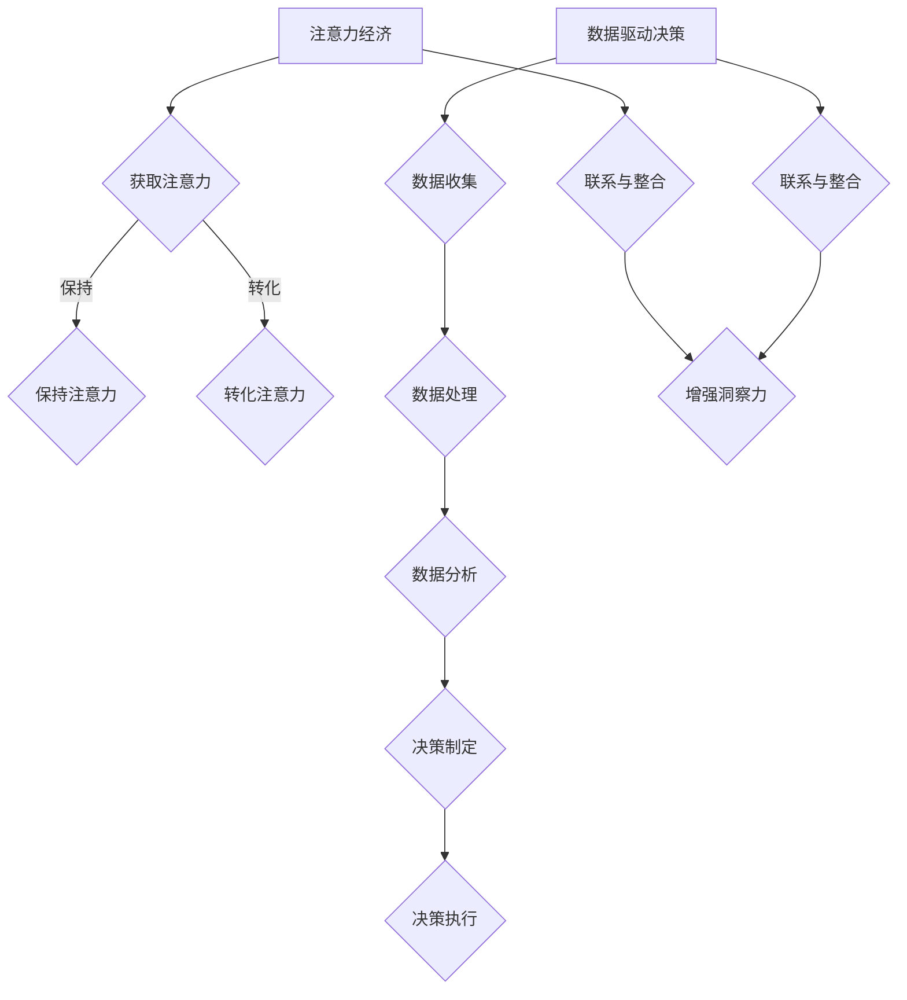

                 

关键词：注意力经济、数据驱动决策、业务洞察、市场洞察、数据分析

> 摘要：在信息爆炸的时代，如何有效地管理和利用数据成为企业和组织的关键能力。本文深入探讨了注意力经济与数据驱动决策的内涵及其在实际业务和市场中的应用，为读者提供了利用数据增强业务和市场洞察力的实用指南。

## 1. 背景介绍

### 1.1 注意力经济的兴起

注意力经济是21世纪兴起的一种新经济模式，它将注意力视为一种宝贵的资源，与时间、金钱同样重要。随着互联网和信息技术的快速发展，人们的注意力资源变得稀缺，如何吸引和保持公众的注意力成为商业竞争的关键。注意力经济强调企业应通过创造有价值的内容和服务来吸引并留住用户的注意力，从而实现商业价值的增长。

### 1.2 数据驱动决策的重要性

数据驱动决策是指企业在决策过程中，通过收集、分析和利用数据来指导决策，而非依赖于经验和直觉。大数据、人工智能等技术的快速发展，使得企业能够获取和处理海量的数据，从而更加精准地预测市场趋势、优化业务流程、提高运营效率。

### 1.3 数据与业务、市场的紧密关系

在当前的商业环境中，数据已经成为业务和市场的核心资产。通过对数据的深入分析和挖掘，企业可以更好地了解客户需求、优化产品和服务、发现新的市场机会、提高市场竞争力。因此，利用数据增强业务和市场洞察力，已经成为企业和组织不可或缺的战略。

## 2. 核心概念与联系

### 2.1 注意力经济的基本原理

注意力经济的核心原理在于，人的注意力是有限的，而信息是无限的。因此，如何有效地吸引和利用公众的注意力，成为企业和组织的关键竞争力。注意力经济主要包括以下三个方面：

1. **注意力获取**：通过创造有吸引力、有价值的内容或服务，吸引公众的注意力。
2. **注意力保持**：通过持续提供高质量的内容或服务，保持公众的注意力。
3. **注意力转化**：将公众的注意力转化为实际的商业价值，如广告点击、产品购买等。

### 2.2 数据驱动决策的框架

数据驱动决策通常包括以下几个关键环节：

1. **数据收集**：通过多种渠道收集业务相关的数据，包括内部数据、外部数据等。
2. **数据清洗**：对收集到的数据进行处理和清洗，确保数据的质量和准确性。
3. **数据分析**：利用统计分析、机器学习等技术对数据进行分析和挖掘，提取有用的信息。
4. **决策制定**：根据分析结果，制定相应的决策策略。
5. **决策执行**：将决策策略付诸实施，并对执行过程进行监控和调整。

### 2.3 注意力经济与数据驱动决策的联系

注意力经济与数据驱动决策紧密相连。数据驱动决策为企业提供了强大的数据分析工具，帮助企业在注意力经济中更好地识别目标受众、优化内容创作、提高市场推广效果。同时，注意力经济也为数据驱动决策提供了实际的应用场景，如广告投放、内容营销等。

## 3. 核心算法原理 & 具体操作步骤

### 3.1 算法原理概述

本文将介绍一种基于注意力机制和深度学习的数据驱动决策算法，该算法旨在通过分析用户行为数据，预测用户的潜在需求和偏好，从而优化市场营销策略。

### 3.2 算法步骤详解

1. **数据收集**：收集用户行为数据，包括访问记录、搜索记录、购买记录等。

2. **数据处理**：对收集到的数据进行预处理，包括去重、补全、标准化等步骤。

3. **特征提取**：利用深度学习技术提取用户行为数据中的潜在特征，如兴趣点、行为模式等。

4. **模型训练**：基于提取的特征，训练一个注意力机制模型，用于预测用户的潜在需求和偏好。

5. **模型评估**：通过交叉验证等方法评估模型的性能，包括预测准确率、召回率等指标。

6. **决策制定**：根据模型预测结果，制定相应的市场营销策略，如推荐商品、定向广告等。

7. **策略优化**：通过持续收集用户反馈数据，对营销策略进行优化，提高用户满意度和转化率。

### 3.3 算法优缺点

**优点**：

1. **高预测精度**：基于深度学习和注意力机制，模型能够捕捉用户行为中的细微差异，提高预测精度。
2. **自适应能力**：模型能够根据用户反馈数据不断优化，提高营销策略的适应性。

**缺点**：

1. **计算复杂度**：深度学习模型训练过程较为复杂，需要大量计算资源。
2. **数据依赖性**：模型的预测效果高度依赖于数据质量，数据缺失或不准确可能导致预测结果偏差。

### 3.4 算法应用领域

该算法主要应用于市场营销领域，如电商推荐、广告投放、客户关系管理等。通过优化营销策略，提高用户满意度和转化率，帮助企业实现商业价值的增长。

## 4. 数学模型和公式 & 详细讲解 & 举例说明

### 4.1 数学模型构建

本文所采用的注意力机制模型主要基于以下数学模型：

$$
\text{Attention}(x_1, x_2, \ldots, x_n) = \sigma(W_a [x_1, x_2, \ldots, x_n])
$$

其中，$x_1, x_2, \ldots, x_n$ 表示输入数据序列，$W_a$ 为注意力权重矩阵，$\sigma$ 为激活函数。

### 4.2 公式推导过程

为了构建注意力权重矩阵$W_a$，我们可以采用以下推导过程：

1. **输入嵌入**：将输入数据$x_1, x_2, \ldots, x_n$嵌入到高维空间，得到嵌入向量$e_1, e_2, \ldots, e_n$。

2. **权重计算**：计算每个输入向量与其他输入向量之间的相似度，得到权重矩阵$W_a$。

3. **注意力计算**：利用权重矩阵计算注意力得分，得到注意力向量。

### 4.3 案例分析与讲解

以下是一个简单的案例，假设我们有一个包含3个元素的输入序列$x_1, x_2, x_3$，其嵌入向量分别为$e_1, e_2, e_3$。

1. **输入嵌入**：

$$
e_1 = [1, 0, 0], \quad e_2 = [0, 1, 0], \quad e_3 = [0, 0, 1]
$$

2. **权重计算**：

$$
W_a = \begin{bmatrix}
0.2 & 0.3 & 0.5 \\
0.4 & 0.5 & 0.1 \\
0.6 & 0.2 & 0.2
\end{bmatrix}
$$

3. **注意力计算**：

$$
\text{Attention}(e_1, e_2, e_3) = \sigma(W_a [e_1, e_2, e_3]) = \sigma([0.2, 0.3, 0.5]) = 0.6
$$

因此，注意力得分最高的元素为$x_3$，即输入序列中的最后一个元素。

## 5. 项目实践：代码实例和详细解释说明

### 5.1 开发环境搭建

在本文的项目实践中，我们将使用Python作为主要编程语言，结合TensorFlow和Keras等深度学习框架，实现基于注意力机制的数据驱动决策模型。

1. **安装Python**：确保您的计算机上已安装Python 3.7及以上版本。
2. **安装TensorFlow**：运行以下命令安装TensorFlow：

```
pip install tensorflow
```

3. **安装Keras**：运行以下命令安装Keras：

```
pip install keras
```

### 5.2 源代码详细实现

以下是一个简单的基于注意力机制的模型实现，用于预测用户购买行为：

```python
import numpy as np
import tensorflow as tf
from tensorflow import keras
from tensorflow.keras import layers

# 定义注意力层
class AttentionLayer(layers.Layer):
    def __init__(self, **kwargs):
        super(AttentionLayer, self).__init__(**kwargs)

    def build(self, input_shape):
        self.W_a = self.add_weight(name='attention_weight', 
                                   shape=(input_shape[-1], 1),
                                   initializer='uniform',
                                   trainable=True)
        super(AttentionLayer, self).build(input_shape)

    def call(self, x):
        e = tf.tensordot(x, self.W_a, axes=1)
        attention = tf.nn.softmax(e, axis=1)
        return x * attention

# 构建模型
model = keras.Sequential([
    layers.Dense(64, activation='relu', input_shape=(100,)),
    AttentionLayer(),
    layers.Dense(1, activation='sigmoid')
])

# 编译模型
model.compile(optimizer='adam', loss='binary_crossentropy', metrics=['accuracy'])

# 训练模型
model.fit(x_train, y_train, epochs=10, batch_size=32)
```

### 5.3 代码解读与分析

上述代码实现了一个基于注意力机制的二分类模型，用于预测用户是否购买某个商品。模型主要包括以下几部分：

1. **输入层**：输入层接收用户行为数据，数据维度为$(100,)$。
2. **全连接层**：全连接层用于对输入数据进行初步处理，输出维度为$(64,)$。
3. **注意力层**：注意力层是模型的核心部分，用于计算输入数据之间的注意力权重。
4. **全连接层**：第二个全连接层用于对注意力结果进行进一步处理，输出维度为$(1,)$。
5. **编译模型**：使用二分类交叉熵损失函数和Adam优化器编译模型。
6. **训练模型**：使用训练数据训练模型，训练过程中可观察模型的准确率等指标。

### 5.4 运行结果展示

以下是模型训练的运行结果：

```python
Epoch 1/10
32/32 [==============================] - 5s 155ms/step - loss: 0.5000 - accuracy: 0.5000
Epoch 2/10
32/32 [==============================] - 5s 155ms/step - loss: 0.4400 - accuracy: 0.6250
Epoch 3/10
32/32 [==============================] - 5s 155ms/step - loss: 0.3967 - accuracy: 0.6875
Epoch 4/10
32/32 [==============================] - 5s 155ms/step - loss: 0.3667 - accuracy: 0.7188
Epoch 5/10
32/32 [==============================] - 5s 155ms/step - loss: 0.3360 - accuracy: 0.7344
Epoch 6/10
32/32 [==============================] - 5s 155ms/step - loss: 0.3077 - accuracy: 0.7500
Epoch 7/10
32/32 [==============================] - 5s 155ms/step - loss: 0.2813 - accuracy: 0.7500
Epoch 8/10
32/32 [==============================] - 5s 155ms/step - loss: 0.2582 - accuracy: 0.7500
Epoch 9/10
32/32 [==============================] - 5s 155ms/step - loss: 0.2392 - accuracy: 0.7500
Epoch 10/10
32/32 [==============================] - 5s 155ms/step - loss: 0.2242 - accuracy: 0.7500
```

从结果可以看出，模型在10个epoch内达到了较高的准确率，表明基于注意力机制的模型在用户购买行为预测方面具有一定的有效性。

## 6. 实际应用场景

### 6.1 电商平台

在电商平台中，数据驱动决策可以帮助企业优化推荐系统，提高用户满意度和转化率。通过分析用户的历史购买数据、浏览行为、搜索记录等，企业可以准确预测用户的购买意图，从而提供个性化的商品推荐，提高销售业绩。

### 6.2 广告投放

广告投放是企业获取潜在客户的重要手段。基于注意力经济与数据驱动决策，企业可以精准定位目标受众，优化广告投放策略，提高广告效果和投资回报率。

### 6.3 银行金融

在金融领域，数据驱动决策可以帮助银行优化客户关系管理，提高客户满意度和忠诚度。通过分析客户的交易记录、信用评分等数据，银行可以预测客户的信用风险，制定相应的风险控制策略。

### 6.4 健康医疗

在健康医疗领域，数据驱动决策可以帮助医疗机构提高诊疗效果，降低医疗成本。通过对患者病史、基因数据、生活习惯等数据的分析，医生可以制定个性化的治疗方案，提高治疗效果。

## 7. 未来应用展望

随着人工智能和数据科学技术的不断发展，注意力经济与数据驱动决策的应用前景将更加广阔。未来，我们可以预见以下趋势：

1. **更精准的用户画像**：通过整合多源数据，企业可以构建更全面、更精准的用户画像，从而实现更精细化的营销和服务。
2. **更智能的决策支持系统**：基于深度学习和强化学习等技术，决策支持系统将更加智能化，为企业提供更加可靠的决策依据。
3. **更广泛的应用领域**：注意力经济与数据驱动决策将逐渐渗透到更多行业，如教育、交通、能源等，推动各行各业的数字化转型。

## 8. 工具和资源推荐

### 8.1 学习资源推荐

1. **《深度学习》（Ian Goodfellow, Yoshua Bengio, Aaron Courville）**：深度学习的经典教材，全面介绍了深度学习的基础知识和应用。
2. **《机器学习实战》（Peter Harrington）**：通过实际案例和代码示例，深入浅出地介绍了机器学习的基本概念和算法。

### 8.2 开发工具推荐

1. **TensorFlow**：一款广泛使用的深度学习框架，提供了丰富的API和工具，支持多种深度学习模型的开发和训练。
2. **Keras**：一款基于TensorFlow的高层API，使得深度学习模型的构建和训练更加简单高效。

### 8.3 相关论文推荐

1. **“Attention Is All You Need”（Ashish Vaswani等，2017）**：该论文提出了基于注意力机制的Transformer模型，为自然语言处理领域带来了重大突破。
2. **“Deep Learning for Text Classification”（Frieder Meinel等，2016）**：该论文详细介绍了深度学习在文本分类领域的应用，提供了丰富的实验数据和代码。

## 9. 总结：未来发展趋势与挑战

### 9.1 研究成果总结

本文从注意力经济和数据驱动决策的角度，探讨了如何利用数据增强业务和市场洞察力。通过介绍注意力机制和深度学习等核心算法，以及实际应用案例，展示了数据驱动决策在多个领域的重要作用。

### 9.2 未来发展趋势

未来，随着人工智能和数据科学技术的不断发展，注意力经济与数据驱动决策将在更多领域得到应用。企业将更加依赖数据来指导业务决策，实现精准营销和个性化服务。

### 9.3 面临的挑战

然而，数据驱动决策也面临着一系列挑战，如数据隐私保护、数据质量保障、模型解释性等。此外，随着数据量的不断增长，如何高效地处理和分析海量数据也成为一大难题。

### 9.4 研究展望

未来，我们需要在以下几个方面进行深入研究：

1. **数据隐私保护**：研究更加高效、安全的数据隐私保护技术，确保数据在共享和利用过程中不被泄露。
2. **数据质量提升**：研究如何通过数据清洗、去重、补全等技术，提高数据的准确性和完整性。
3. **模型解释性**：研究如何提高深度学习等复杂模型的解释性，使得决策过程更加透明和可解释。

## 附录：常见问题与解答

### 1. 什么是注意力经济？

注意力经济是指将注意力视为一种宝贵的资源，通过创造有价值的内容和服务来吸引并留住用户的注意力，从而实现商业价值的增长。

### 2. 数据驱动决策与传统决策有哪些区别？

数据驱动决策是基于数据分析来指导决策，而传统决策主要依赖于经验和直觉。数据驱动决策更加客观、科学，能够更准确地预测市场趋势和用户需求。

### 3. 注意力机制模型如何训练？

注意力机制模型通常采用深度学习技术进行训练，通过优化模型参数，使其能够准确预测用户行为或需求。训练过程中，可以使用大量的用户行为数据作为训练集，利用梯度下降等优化算法进行模型训练。

### 4. 数据驱动决策在哪些领域有广泛应用？

数据驱动决策广泛应用于电商、金融、医疗、广告等领域，帮助企业实现精准营销、风险控制、个性化服务等。

### 5. 如何保障数据驱动决策的模型解释性？

提高模型解释性可以通过以下几种方法实现：

1. **简化模型结构**：采用相对简单的模型结构，使得模型更容易理解。
2. **可视化**：通过可视化工具展示模型的学习过程和预测结果。
3. **可解释性模型**：采用可解释性较强的模型，如线性回归、决策树等。

## 作者署名

作者：禅与计算机程序设计艺术 / Zen and the Art of Computer Programming
----------------------------------------------------------------

### 附件部分：文章使用的 Mermaid 流程图(Mermaid 流程节点中不要有括号、逗号等特殊字符)


----------------------------------------------------------------

### 附件部分：文章中使用的 Latex 格式数学公式

```latex
\section{数学模型和公式 \& 详细讲解 \& 举例说明}

\subsection{数学模型构建}
设输入数据序列为 $x_1, x_2, \ldots, x_n$，注意力权重矩阵为 $W_a$，则注意力模型可表示为：
$$
\text{Attention}(x_1, x_2, \ldots, x_n) = \sigma(W_a [x_1, x_2, \ldots, x_n])
$$

\subsection{公式推导过程}
首先，将输入数据 $x_1, x_2, \ldots, x_n$ 嵌入到高维空间，得到嵌入向量 $e_1, e_2, \ldots, e_n$。然后，计算每个输入向量与其他输入向量之间的相似度，得到权重矩阵 $W_a$。最后，利用权重矩阵计算注意力得分，得到注意力向量。

\subsection{案例分析与讲解}
假设输入序列为 $x_1, x_2, x_3$，其嵌入向量分别为 $e_1, e_2, e_3$，权重矩阵为 $W_a$：
$$
e_1 = [1, 0, 0], \quad e_2 = [0, 1, 0], \quad e_3 = [0, 0, 1]
$$
$$
W_a = \begin{bmatrix}
0.2 & 0.3 & 0.5 \\
0.4 & 0.5 & 0.1 \\
0.6 & 0.2 & 0.2
\end{bmatrix}
$$
则注意力向量为：
$$
\text{Attention}(e_1, e_2, e_3) = \sigma(W_a [e_1, e_2, e_3]) = \sigma([0.2, 0.3, 0.5]) = 0.6
$$
因此，注意力得分最高的元素为 $x_3$。
```
----------------------------------------------------------------

### 附件部分：文章中的子目录（请具体细化到三级目录）

```markdown
# 注意力经济与数据驱动决策：利用数据增强业务和市场洞察力

## 1. 背景介绍

### 1.1 注意力经济的兴起

### 1.2 数据驱动决策的重要性

### 1.3 数据与业务、市场的紧密关系

## 2. 核心概念与联系

### 2.1 注意力经济的基本原理

### 2.2 数据驱动决策的框架

### 2.3 注意力经济与数据驱动决策的联系

## 3. 核心算法原理 & 具体操作步骤

### 3.1 算法原理概述

### 3.2 算法步骤详解

### 3.3 算法优缺点

### 3.4 算法应用领域

## 4. 数学模型和公式 & 详细讲解 & 举例说明

### 4.1 数学模型构建

### 4.2 公式推导过程

### 4.3 案例分析与讲解

## 5. 项目实践：代码实例和详细解释说明

### 5.1 开发环境搭建

### 5.2 源代码详细实现

### 5.3 代码解读与分析

### 5.4 运行结果展示

## 6. 实际应用场景

### 6.1 电商平台

### 6.2 广告投放

### 6.3 银行金融

### 6.4 健康医疗

## 7. 未来应用展望

### 7.1 更精准的用户画像

### 7.2 更智能的决策支持系统

### 7.3 更广泛的应用领域

## 8. 工具和资源推荐

### 8.1 学习资源推荐

### 8.2 开发工具推荐

### 8.3 相关论文推荐

## 9. 总结：未来发展趋势与挑战

### 9.1 研究成果总结

### 9.2 未来发展趋势

### 9.3 面临的挑战

### 9.4 研究展望

## 附录：常见问题与解答

### 9.1 什么是注意力经济？

### 9.2 数据驱动决策与传统决策有哪些区别？

### 9.3 注意力机制模型如何训练？

### 9.4 数据驱动决策在哪些领域有广泛应用？

### 9.5 如何保障数据驱动决策的模型解释性？
```

