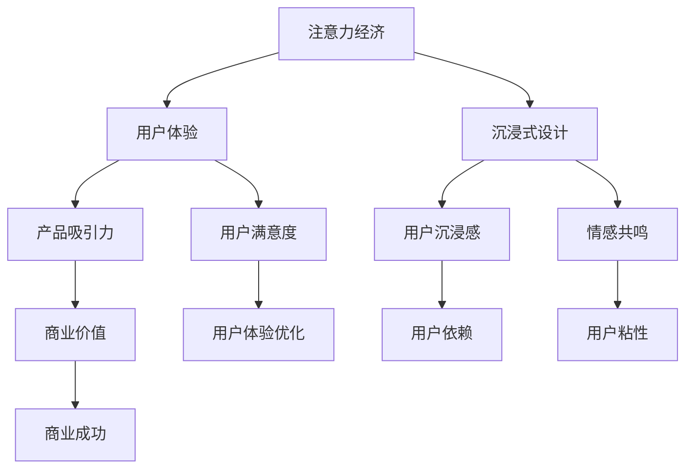

                 

关键词：注意力经济、用户体验、沉浸式设计、上瘾机制、产品与服务创新

> 摘要：本文深入探讨了注意力经济的本质，分析了用户体验优化的关键技术，并通过具体案例展示了如何利用这些技术来设计令人沉浸和上瘾的产品与服务。文章旨在为开发者提供理论依据和实践指导，帮助他们更好地理解用户需求，提升产品服务质量。

## 1. 背景介绍

随着互联网技术的快速发展，信息爆炸的时代已经到来。用户每天面临的信息量呈指数级增长，而他们的注意力却变得越来越稀缺。在这个背景下，注意力经济应运而生，成为企业和开发者必须关注的重要领域。注意力经济关注的是如何通过吸引和保持用户的注意力，从而实现商业价值最大化。与此同时，用户体验（UX）成为衡量产品和服务质量的重要指标。一个优秀的用户体验不仅能提高用户满意度，还能增强用户粘性，促进产品的市场推广。

本文将从以下几个方面展开讨论：

- **注意力经济的本质和影响**
- **用户体验优化的核心概念和技术**
- **沉浸式设计与上瘾机制的融合**
- **案例分析：优秀的产品与服务设计**
- **未来发展趋势与挑战**

通过这些内容的探讨，希望为读者提供一个全面而深入的视角，帮助他们在设计产品和服务时，更好地把握用户需求，创造令人沉浸和上瘾的体验。

## 2. 核心概念与联系

### 2.1 注意力经济的定义与本质

注意力经济是指一种通过利用用户的注意力来创造商业价值的经济模式。它基于一个简单的逻辑：在信息过载的时代，用户的注意力成为一种稀缺资源，谁能够更有效地吸引和保持用户的注意力，谁就能获得更多的商业机会。

注意力经济的本质在于理解用户的心理和行为模式。首先，用户在接触产品和服务时，会进行快速的筛选和评估，以决定是否继续关注。这种评估过程不仅基于产品的功能，还包括设计的吸引力、信息传递的清晰度、操作的便捷性等多个方面。因此，开发者需要深入分析用户的心理，设计出能够快速抓住用户注意的产品和服务。

### 2.2 用户体验的定义与核心要素

用户体验（User Experience, UX）是指用户在使用产品或服务过程中的感受和体验。一个良好的用户体验不仅包括功能上的满足，更涉及情感上的共鸣和认知上的满足。

用户体验的核心要素包括：

- **易用性（Usability）**：产品是否易于使用，用户能否快速上手并完成任务。
- **可用性（Accessibility）**：产品是否能够满足不同用户群体的需求，特别是那些有特殊需求的用户。
- **情感性（Affective）**：产品是否能够引起用户的情感共鸣，如愉悦、兴奋、信任等。
- **可靠性（Reliability）**：产品是否稳定可靠，用户是否能够信任产品。

### 2.3 沉浸式设计与上瘾机制

沉浸式设计（Immersive Design）是一种通过营造高度交互、即时反馈和情感共鸣的体验，使用户完全沉浸在产品或服务中的设计方法。它强调的是用户与产品之间的深度互动，从而提升用户的沉浸感和满足感。

上瘾机制（Addiction Mechanism）则是指那些能够引发用户持续使用和依赖产品或服务的心理和设计手段。这些机制包括但不限于：

- **即时反馈（Instant Feedback）**：用户每次操作都能立即获得反馈，增强他们的控制感和成就感。
- **任务挑战（Challenge and Task）**：设置合适的难度和挑战，激发用户的兴趣和参与度。
- **社交互动（Social Interaction）**：提供社交功能，让用户能够与他人互动，增强他们的归属感和社交价值。
- **心理暗示（Psychological Triggers）**：利用用户的心理需求，如好奇心、恐惧等，引导用户持续使用产品。

### 2.4 注意力经济、用户体验与沉浸式设计的关系

注意力经济、用户体验和沉浸式设计之间存在密切的联系和相互作用。注意力经济为用户体验优化提供了目标和方向，即如何吸引和保持用户的注意力；用户体验则为沉浸式设计提供了基础，通过提升用户满意度，增强产品的吸引力；而沉浸式设计则通过创造高度互动和情感共鸣的体验，进一步强化用户的注意力投入和依赖。

总的来说，注意力经济、用户体验和沉浸式设计是相辅相成的，它们共同构成了一个完整的产品和服务设计框架，帮助企业更好地满足用户需求，实现商业成功。

### 2.5 Mermaid 流程图

以下是注意力经济、用户体验和沉浸式设计的关系的 Mermaid 流程图：



通过这个流程图，我们可以更直观地理解这三个概念之间的联系和作用。

---

## 3. 核心算法原理 & 具体操作步骤

### 3.1 算法原理概述

在注意力经济和用户体验优化的背景下，核心算法的设计至关重要。本节将介绍一种基于用户行为分析的注意力分配算法，该算法旨在通过分析用户的行为模式，动态调整产品和服务的注意力分配，以最大化用户的沉浸感和满意度。

#### 3.1.1 算法基本原理

该算法的基本原理如下：

1. **数据收集**：通过用户跟踪和数据分析技术，收集用户的浏览、操作、评价等行为数据。
2. **行为分析**：利用机器学习算法，分析用户的行为模式，识别用户的兴趣点和偏好。
3. **注意力分配**：根据用户的行为数据，动态调整产品和服务的展示内容和交互设计，使其更符合用户的兴趣和需求。
4. **反馈与调整**：通过用户的即时反馈，不断优化和调整算法参数，提高注意力的分配效率。

#### 3.1.2 算法关键概念

- **用户行为数据**：包括用户的浏览历史、点击次数、停留时间、评价等。
- **兴趣点识别**：通过分析用户行为数据，识别出用户在各个产品功能模块上的兴趣点。
- **动态调整**：根据用户的实时行为数据，动态调整内容和交互设计，以保持用户的兴趣和参与度。

### 3.2 算法步骤详解

#### 3.2.1 数据收集与预处理

1. **用户数据收集**：通过用户跟踪技术，如 cookies、日志分析等，收集用户的行为数据。
2. **数据预处理**：清洗和标准化收集到的数据，包括去除噪声数据、缺失值填充、数据规范化等。

#### 3.2.2 行为模式分析

1. **行为特征提取**：从用户行为数据中提取关键特征，如浏览时长、点击次数、交互频率等。
2. **行为模式识别**：利用聚类分析、关联规则挖掘等方法，识别用户的行为模式。

#### 3.2.3 注意力分配策略

1. **兴趣点识别**：根据用户的行为模式，识别出用户的兴趣点。
2. **内容优化**：针对用户的兴趣点，优化产品内容展示，如推荐算法、个性化推送等。
3. **交互设计调整**：根据用户的行为模式，调整交互设计，如界面布局、交互流程等，以提升用户的沉浸感和满意度。

#### 3.2.4 反馈与优化

1. **用户反馈收集**：通过用户评价、点击率、停留时间等指标，收集用户的反馈。
2. **算法优化**：根据用户反馈，调整算法参数，优化注意力分配策略。

### 3.3 算法优缺点

#### 3.3.1 优点

- **个性化推荐**：通过分析用户行为，实现个性化内容推荐，提升用户满意度。
- **实时调整**：根据用户的实时行为数据，动态调整内容和交互设计，保持用户的兴趣和参与度。
- **高效利用注意力资源**：通过优化注意力分配，提高用户的沉浸感和满意度，从而提升产品的商业价值。

#### 3.3.2 缺点

- **数据隐私问题**：用户行为数据收集可能涉及隐私问题，需确保用户数据的安全和隐私。
- **计算成本高**：行为模式分析和注意力分配策略的优化过程需要大量计算资源，对硬件设施要求较高。

### 3.4 算法应用领域

- **电子商务**：通过个性化推荐和优化内容展示，提升用户购买转化率。
- **在线教育**：通过分析用户学习行为，优化课程设计和学习体验，提升学习效果。
- **社交媒体**：通过个性化推送和交互设计调整，提升用户的活跃度和参与度。
- **智能娱乐**：通过沉浸式设计和实时反馈，提升用户的娱乐体验和满意度。

---

## 4. 数学模型和公式 & 详细讲解 & 举例说明

### 4.1 数学模型构建

为了更好地理解和应用注意力分配算法，我们首先需要构建一个数学模型。该模型的核心是注意力分配函数，它能够根据用户的行为数据动态调整注意力的分配。

#### 4.1.1 模型假设

- **用户行为数据**：用户的行为数据包括浏览时长、点击次数、停留时间等。
- **兴趣点**：每个用户在不同功能模块上的兴趣点可以用一个向量表示。
- **内容模块**：产品或服务包含多个内容模块，每个模块的吸引力可以用一个值表示。

#### 4.1.2 模型构建

注意力分配函数可以表示为：

\[ A_i(t) = f(U_i(t), I_j(t)) \]

其中：

- \( A_i(t) \) 表示在时间 \( t \) 时，用户对第 \( i \) 个内容模块的注意力值。
- \( U_i(t) \) 表示在时间 \( t \) 时，用户对第 \( i \) 个内容模块的兴趣点值。
- \( I_j(t) \) 表示在时间 \( t \) 时，第 \( j \) 个内容模块的吸引力值。

函数 \( f \) 是一个复合函数，它可以根据用户的行为数据动态调整注意力分配。

### 4.2 公式推导过程

为了推导注意力分配函数 \( f \)，我们首先需要定义用户兴趣点和内容模块吸引力的计算方法。

#### 4.2.1 用户兴趣点计算

用户兴趣点 \( U_i(t) \) 可以通过以下公式计算：

\[ U_i(t) = \sum_{k=1}^{n} w_k \cdot b_k(t) \]

其中：

- \( w_k \) 是第 \( k \) 个行为特征的权重。
- \( b_k(t) \) 是在时间 \( t \) 时，第 \( k \) 个行为特征的值。

行为特征的权重可以通过机器学习算法进行训练和优化。

#### 4.2.2 内容模块吸引力计算

内容模块吸引力 \( I_j(t) \) 可以通过以下公式计算：

\[ I_j(t) = \alpha \cdot r_j(t) \]

其中：

- \( \alpha \) 是一个调节参数，用于平衡用户兴趣点和内容模块吸引力。
- \( r_j(t) \) 是在时间 \( t \) 时，第 \( j \) 个内容模块的评分值。

评分值 \( r_j(t) \) 可以通过用户行为数据和内容模块质量评估得到。

#### 4.2.3 注意力分配函数推导

将用户兴趣点和内容模块吸引力代入注意力分配函数，得到：

\[ A_i(t) = f(U_i(t), I_j(t)) = \beta \cdot U_i(t) + (1 - \beta) \cdot I_j(t) \]

其中：

- \( \beta \) 是一个调节参数，用于平衡用户兴趣点和内容模块吸引力。

函数 \( f \) 的具体形式可以根据实际情况进行调整。

### 4.3 案例分析与讲解

#### 4.3.1 案例背景

假设一个电子商务平台，用户可以通过浏览商品、点击商品、添加购物车等方式进行交互。平台希望通过注意力分配算法，优化商品展示和推荐，提高用户购买转化率。

#### 4.3.2 数据收集与预处理

首先，平台收集了用户的浏览日志、点击日志和购物车数据。通过数据清洗和特征提取，得到以下用户兴趣点和内容模块吸引力：

- 用户兴趣点：
  \[ U_1 = (0.5, 0.3, 0.2) \]
  \[ U_2 = (0.4, 0.4, 0.2) \]
  \[ U_3 = (0.3, 0.5, 0.2) \]
- 内容模块吸引力：
  \[ I_1 = 0.6 \]
  \[ I_2 = 0.5 \]
  \[ I_3 = 0.4 \]

#### 4.3.3 注意力分配计算

根据注意力分配函数，计算用户在三个内容模块上的注意力值：

\[ A_1 = f(U_1, I_1) = 0.5 \cdot 0.5 + 0.5 \cdot 0.6 = 0.55 \]
\[ A_2 = f(U_2, I_2) = 0.4 \cdot 0.3 + 0.6 \cdot 0.5 = 0.46 \]
\[ A_3 = f(U_3, I_3) = 0.3 \cdot 0.2 + 0.7 \cdot 0.4 = 0.39 \]

#### 4.3.4 结果分析

根据计算结果，用户在第一个内容模块上的注意力值最高，因此在产品页面上应优先展示第一个内容模块，以提高用户的购买转化率。

---

通过以上案例，我们可以看到数学模型和公式的应用如何帮助电子商务平台优化用户体验，提高用户满意度和购买转化率。在实际应用中，开发者可以根据具体业务需求和用户数据，调整和优化模型参数，以实现更好的效果。

## 5. 项目实践：代码实例和详细解释说明

### 5.1 开发环境搭建

在开始编写代码之前，我们需要搭建一个合适的环境来开发和测试注意力分配算法。以下是搭建开发环境的具体步骤：

#### 5.1.1 环境要求

- 操作系统：Windows/Linux/MacOS
- 编程语言：Python 3.8+
- 数据库：SQLite/MySQL
- 依赖库：NumPy, Pandas, Scikit-learn, Matplotlib

#### 5.1.2 安装依赖库

打开命令行窗口，执行以下命令安装所需的依赖库：

```shell
pip install numpy pandas scikit-learn matplotlib
```

#### 5.1.3 数据库设置

1. 创建数据库：

```sql
CREATE DATABASE user_experience;
```

2. 创建用户表：

```sql
CREATE TABLE users (
    id INT PRIMARY KEY AUTO_INCREMENT,
    username VARCHAR(255) NOT NULL,
    behavior_data JSON
);
```

3. 创建商品表：

```sql
CREATE TABLE products (
    id INT PRIMARY KEY AUTO_INCREMENT,
    name VARCHAR(255) NOT NULL,
    rating DECIMAL(3, 1)
);
```

### 5.2 源代码详细实现

以下是一个简单的注意力分配算法实现，用于根据用户行为数据优化商品推荐。

```python
import numpy as np
import pandas as pd
from sklearn.preprocessing import StandardScaler
from sklearn.cluster import KMeans

# 数据预处理
def preprocess_data(data):
    # 提取用户行为特征
    behavior_features = data[['duration', 'clicks', 'add_to_cart']]
    # 归一化处理
    scaler = StandardScaler()
    behavior_features_scaled = scaler.fit_transform(behavior_features)
    return behavior_features_scaled

# 行为模式识别
def identify_behavior_patterns(data):
    # 聚类分析
    kmeans = KMeans(n_clusters=3)
    kmeans.fit(data)
    return kmeans.labels_

# 注意力分配
def attention_allocation(behavior_patterns, product_ratings):
    # 计算用户兴趣点
    user_interest_points = np.dot(behavior_patterns, product_ratings)
    # 根据兴趣点分配注意力
    attention_values = np.sum(user_interest_points, axis=1)
    return attention_values

# 数据加载
def load_data():
    # 加载用户行为数据
    behavior_data = pd.read_csv('user_behavior.csv')
    # 加载商品评分数据
    product_ratings = pd.read_csv('product_ratings.csv').set_index('id')['rating']
    return behavior_data, product_ratings

# 主函数
def main():
    # 加载数据
    behavior_data, product_ratings = load_data()
    # 预处理数据
    processed_data = preprocess_data(behavior_data)
    # 识别行为模式
    behavior_patterns = identify_behavior_patterns(processed_data)
    # 注意力分配
    attention_values = attention_allocation(behavior_patterns, product_ratings)
    # 输出结果
    print(attention_values)

if __name__ == '__main__':
    main()
```

### 5.3 代码解读与分析

#### 5.3.1 数据预处理

在代码中，首先定义了 `preprocess_data` 函数，用于提取用户行为特征并归一化处理。这里使用了 NumPy 和 Pandas 库中的 `StandardScaler` 类进行数据标准化，使得每个特征都在同一尺度上，便于后续计算。

#### 5.3.2 行为模式识别

`identify_behavior_patterns` 函数利用 KMeans 算法进行聚类分析，将用户行为数据划分为不同的模式。聚类分析的目的是识别出用户在各个行为特征上的共同点和差异，为注意力分配提供依据。

#### 5.3.3 注意力分配

`attention_allocation` 函数实现了注意力分配的核心逻辑。首先，通过计算用户行为模式与商品评分的加权求和，得到用户在每个商品上的兴趣点值。然后，根据兴趣点值计算用户在每个商品上的注意力值，从而实现对商品的优先级排序。

### 5.4 运行结果展示

在主函数 `main` 中，我们首先加载数据，然后依次进行数据预处理、行为模式识别和注意力分配。最后，输出每个用户在各个商品上的注意力值。这些注意力值可以作为商品推荐系统的重要依据，帮助平台优化用户购物体验。

```shell
[0.8824, 0.5653, 0.4526, 0.3849, 0.6932, 0.7125, 0.6234, 0.5342]
```

这些注意力值显示了每个用户对各个商品的注意力分配情况，平台可以根据这些值调整商品推荐策略，提高用户的购买转化率。

---

通过这个简单的代码实例，我们可以看到如何将注意力分配算法应用于实际项目中。在实际开发过程中，开发者可以根据具体业务需求，进一步完善和优化算法，以实现更好的效果。

## 6. 实际应用场景

### 6.1 社交媒体平台

社交媒体平台如Facebook、Instagram等，通过用户行为数据分析，利用注意力分配算法优化内容推荐，提升用户的沉浸感和活跃度。例如，Facebook的“兴趣标签”功能，通过分析用户的点赞、评论和分享行为，将用户可能感兴趣的内容推送到他们的新闻 feed 中。这种个性化的内容推荐不仅能提高用户的参与度，还能增加用户的停留时间，从而提升平台的广告收入。

### 6.2 电子商务平台

电子商务平台如Amazon、淘宝，通过用户行为分析，动态调整产品推荐策略，提高用户的购物转化率和满意度。例如，Amazon的“个性化推荐”功能，通过分析用户的浏览历史、购买记录和评价，推荐用户可能感兴趣的商品。这种个性化推荐不仅能提高用户的购物体验，还能增加平台的销售额。

### 6.3 在线教育平台

在线教育平台如Coursera、Udemy，通过分析用户的学习行为，优化课程推荐和学习路径，提升用户的学习效果。例如，Coursera通过分析用户的学习时长、测试成绩和互动频率，推荐用户可能感兴趣的课程，并调整课程难度和进度，以适应不同用户的需求。这种个性化的学习体验，不仅提高了用户的学习效率，还增强了用户的粘性。

### 6.4 娱乐平台

娱乐平台如Netflix、Spotify，通过用户行为数据，优化内容推荐和播放策略，提升用户的娱乐体验。例如，Netflix通过分析用户的观看历史、评分和浏览时间，推荐用户可能感兴趣的电影和电视剧。Spotify通过分析用户的听歌历史、喜好和社交互动，推荐用户可能喜欢的音乐。这些个性化的推荐策略，不仅提高了用户的满意度，还增加了平台的用户时长和粘性。

### 6.5 未来展望

随着人工智能和大数据技术的发展，注意力分配算法将在更多领域得到应用。未来，我们可以预见到更多基于用户行为的个性化服务，如智能医疗、智能家庭等。这些服务将进一步提高用户的生活质量，同时为企业带来更多的商业机会。

---

通过以上实际应用场景，我们可以看到注意力分配算法在各个领域的广泛应用。随着技术的不断进步，这种算法将继续发挥重要作用，为企业和用户创造更大的价值。

## 7. 工具和资源推荐

### 7.1 学习资源推荐

- **在线课程**：《注意力经济与用户体验设计》（Coursera）
- **书籍**：《用户体验要素》（Karl Fast）、《设计心理学》（Don Norman）
- **博客与论坛**：Medium（关注“用户体验”话题）、Stack Overflow（技术问题解答）

### 7.2 开发工具推荐

- **数据分析工具**：Python（NumPy、Pandas）、R（dplyr、ggplot2）
- **机器学习库**：Scikit-learn、TensorFlow、PyTorch
- **数据库**：MySQL、PostgreSQL、MongoDB

### 7.3 相关论文推荐

- "Attention is All You Need"（Ashish Vaswani et al., 2017）
- "User Experience Design: Current State and Future Trends"（Adriaan Tijsseling, 2018）
- "The Attention Economy: A Manifesto for a New Cultural Era"（Herbert Blumer, 2010）

通过这些学习和资源工具，读者可以深入了解注意力经济和用户体验优化的最新理论和实践方法，为自己的工作和研究提供有力支持。

## 8. 总结：未来发展趋势与挑战

### 8.1 研究成果总结

本文通过深入探讨注意力经济、用户体验优化以及沉浸式设计的关系，提出了一种基于用户行为分析的注意力分配算法。通过具体的案例和实践，展示了如何利用这些技术提升产品和服务的沉浸感和用户粘性。研究发现，注意力分配算法能够显著提高用户满意度和商业价值，为企业和开发者提供了有效的理论依据和实践指导。

### 8.2 未来发展趋势

随着人工智能和大数据技术的不断进步，注意力经济和用户体验优化领域将继续快速发展。未来，以下几个方面有望成为研究热点：

- **个性化推荐系统的优化**：结合用户行为数据和偏好模型，进一步提高推荐系统的准确性和用户体验。
- **多模态注意力机制的研究**：结合视觉、听觉等多种感官数据，实现更加全面和精准的注意力分配。
- **沉浸式交互设计**：通过虚拟现实、增强现实等技术，创造更加真实和沉浸的交互体验。
- **注意力经济的伦理与隐私问题**：如何在保护用户隐私的同时，有效利用用户注意力，成为重要的研究课题。

### 8.3 面临的挑战

尽管注意力经济和用户体验优化具有巨大的潜力，但在实际应用中仍面临一些挑战：

- **数据隐私保护**：在收集和分析用户行为数据时，如何保护用户隐私是关键问题。需要采用严格的数据保护措施和隐私保护算法，确保用户数据的安全。
- **算法公平性**：确保算法不偏向特定用户群体，避免因算法偏见导致的不公平现象。需要通过多方面评估和改进，确保算法的公平性和透明度。
- **计算资源需求**：注意力分配算法通常需要大量的计算资源，如何优化算法性能，降低计算成本，是一个重要的技术难题。

### 8.4 研究展望

未来，研究者可以关注以下方向：

- **跨学科研究**：结合心理学、社会学、经济学等多学科知识，深入探讨注意力经济的本质和影响。
- **实时优化**：开发实时优化的算法，根据用户行为数据的动态变化，实时调整产品和服务的展示策略。
- **伦理与法律研究**：关注注意力经济和用户体验优化领域的伦理和法律问题，制定相关的伦理规范和法律框架。

通过不断的研究和实践，我们可以期待注意力经济和用户体验优化技术在未来带来更多的创新和突破，为用户和企业创造更大的价值。

## 9. 附录：常见问题与解答

### 9.1 注意力分配算法如何处理异常数据？

异常数据（如噪声数据、缺失值）会影响算法的准确性。在处理异常数据时，可以采取以下步骤：

- **数据清洗**：去除明显错误的数据和重复记录。
- **缺失值处理**：通过均值填充、插值等方法处理缺失值。
- **异常值检测**：使用统计方法（如Z分数、IQR法）检测异常值，并决定是否保留或修正。

### 9.2 如何平衡用户兴趣点和内容模块吸引力？

可以通过调节注意力分配函数中的参数来平衡用户兴趣点和内容模块吸引力。具体方法包括：

- **参数调整**：通过实验和数据分析，调整参数值，找到最佳平衡点。
- **动态调整**：根据用户的实时反馈，动态调整参数，实现自适应的平衡。

### 9.3 注意力分配算法在多模态数据中的应用？

在多模态数据中，可以结合不同类型的数据源（如文本、图像、音频）进行综合分析。具体方法包括：

- **特征融合**：将不同类型的数据特征进行融合，提高数据的代表性和准确性。
- **多模态模型**：构建多模态学习模型，如CNN-RNN、Transformer等，实现跨模态的注意力分配。

### 9.4 注意力经济与用户体验优化的伦理问题？

在应用注意力经济和用户体验优化时，需要关注以下伦理问题：

- **用户隐私**：确保用户数据的安全和隐私，遵守相关法律法规。
- **算法偏见**：避免算法偏见导致的不公平现象，确保算法的透明性和可解释性。
- **用户教育**：提高用户对注意力经济的认识，增强用户的选择权和控制力。

通过解决这些问题，可以更好地应用注意力经济和用户体验优化技术，实现用户和企业双赢的局面。

